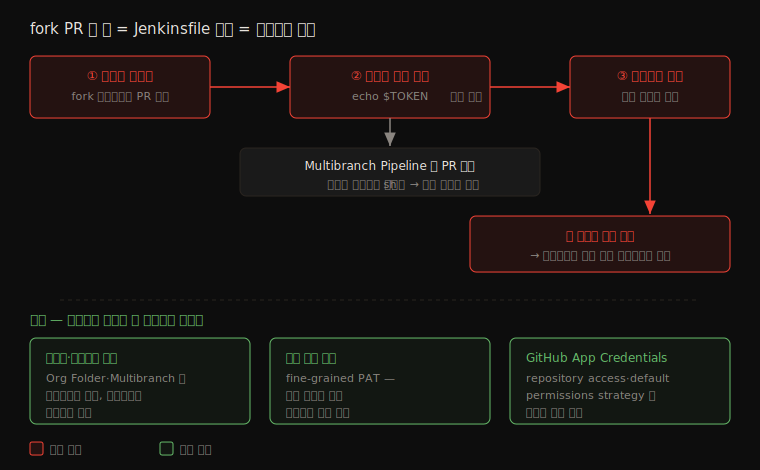

# 빌드 권한과 입력 안전 — 빌드는 누구로 무엇을 들고 도는가

---

> 빌드가 *어떤 유저 권한으로* 돌고(기본은 전권 SYSTEM), 빌드에 *어떤 입력이 흘러드는가*(환경변수·SCM 자격증명) 를 다룹니다. 03-01 이 빌드가 도는 *프로세스를 가뒀다면*, 이 문서는 그 빌드의 *신원과 입력* 을 좁힙니다. fork PR 한 줄로 시크릿이 새는 경로까지 봅니다.

## §학습 목표

> 이 문서를 읽고 나면 *빌드가 기본적으로 어떤 권한으로 도는지*(SYSTEM 전권) 와 그게 왜 위험한지 설명할 수 있고, `Authorize Project` 플러그인의 역할과 *공식이 붙인 경고* 를 함께 말할 수 있으며, `PATH`·`LD_PRELOAD` 같은 환경변수 주입과 Windows Batch 값 주입이 *무엇을 바꾸는지* 구분할 수 있습니다. 나아가 Multibranch Pipeline 에서 *fork PR 한 줄이 자격증명을 어떻게 탈취* 하는지, 그걸 저장소·자격증명 격리로 어떻게 막는지 예측할 수 있습니다.

## §사전 지식

> 본 문서는 [03-01 프로세스·파일시스템 격리](03-01.프로세스·파일시스템%20격리%20—%20워킹%20디렉토리%20밖으로%20못%20나가게.md) 의 형제입니다. 03-01 이 "빌드가 도는 *프로세스* 를 OS 레벨에서 가두는" 축이라면, 이 문서는 "빌드의 *신원(누구로 도는가)* 과 *입력(무엇이 흘러드는가)*" 축입니다. 인증·인가 일반은 [01-01 인증과 인가](01-01.인증과%20인가%20—%20누가%20무엇을%20할%20수%20있는가.md), 자격증명 저장은 [01-02 시크릿 관리](01-02.시크릿%20관리와%20최소%20권한%20원칙.md) 가 다룹니다.

> **공식 문서 내 위치**: 이 문서는 Jenkins 공식 보안 문서의 *Access Control for Builds*([build-authorization](https://www.jenkins.io/doc/book/security/build-authorization/)), *Handling Environment Variables*([environment-variables](https://www.jenkins.io/doc/book/security/environment-variables/)), *SCM credentials for Organization Folders and Multibranch Pipelines*([securing-org-folders-and-multibranch-pipelines](https://www.jenkins.io/doc/book/security/securing-org-folders-and-multibranch-pipelines/)) 세 페이지를 묶어 *빌드 신원·입력* 관점으로 다룹니다.

## 1. 빌드는 누구로 도는가 — 기본 SYSTEM 유저의 전권

> 본 절은 *빌드의 신원* 을 다룹니다. 핵심은 빌드가 기본적으로 *전권을 가진 SYSTEM 유저* 로 돌고, 세밀한 권한 환경에서 이게 구멍이 된다는 점입니다.

Jenkins 빌드는 기본적으로 내부 **SYSTEM 유저** 의 권한으로 실행됩니다. 이 유저는 어떤 노드에서든 실행하고, Job 을 만들거나 지우고, 다른 빌드를 시작·취소할 수 있는 *전권* 을 가집니다. 빌드를 *누가 트리거했는지* 와 무관하게, 빌드 스크립트는 SYSTEM 권한으로 돕니다.

이것이 문제가 되는 곳은 권한을 세밀하게 나눈(fine-grained) 환경입니다. 

- 예를 들어 Pipeline Build Step Plugin 으로 한 Job 의 빌드 스크립트가 *다른 Job 을 트리거* 할 수 있는데, 빌드가 SYSTEM 으로 돌면 그 사용자가 원래 갖지 못한 권한까지 행사하게 됩니다. Job 설정 권한만 가진 사용자가 무관한 Job 을 임의로 돌리는 길이 열립니다. 
- 공식 문서는 이 상태를 이렇게 표현합니다 — "빌드 권한을 쓰지 않거나 빌드를 SYSTEM 으로 돌리는 것은, 위에서 설명한 것 같은 문제가 일어날 수 있다는 *징후(indicator)* 다(Not using build authorization, or having builds run as SYSTEM, is an indicator that problems like the one described above can occur)."

### Authorize Project 플러그인 — 공식 해법, 그러나 경고가 붙는다

공식이 제시하는 해법은 **Authorize Project Plugin** 입니다. 이 플러그인은 전역(global) 및 프로젝트별(per-project) 빌드 권한을 유연하게 구성하게 해, 빌드가 SYSTEM 대신 *지정된 유저의 권한* 으로 돌도록 만듭니다. 빌드의 신원을 트리거한 사람이나 특정 계정으로 묶으면, 빌드가 그 권한 밖의 일을 하지 못합니다.

다만 공식 문서가 *직접 경고* 를 붙입니다

- "그 플러그인은 그러나 *활발히 유지보수되지 않으며*, 이 접근에는 *알려진 한계* 가 있다(That plugin is however not actively maintained, and there are known limitations to this approach)." 
- 그래서 이 플러그인을 만능으로 믿기보다, 빌드를 컨트롤러에서 빼고(03-01 의 ephemeral agent) 권한을 좁히는 다른 층과 함께 써야 합니다. 공식이 경고를 붙인 것을 권장으로 포장하지 않는 것이 정확한 태도입니다.

연결된 권한 하나가 `Agent/Build` 입니다. 이 권한은 빌드 권한 설정이 전제돼야 의미가 있는데, 핵심은 *검사 대상* 입니다 — "빌드의 *authentication* 이 검사되며, 빌드를 시작한 사용자가 아니다(the build's authentication is checked, and not the user starting the build)." 즉 누가 버튼을 눌렀느냐가 아니라 빌드 자체에 부여된 신원으로 에이전트 접근이 통제됩니다.

## 2. 빌드에 무엇이 흘러드는가 (1) — 환경변수 주입

> 본 절은 *빌드 입력 중 환경변수* 를 다룹니다. 핵심은 변수의 *이름* 이나 *값* 이 빌드 동작을 바꿔치기할 수 있다는 점입니다.

빌드에 외부에서 환경변수를 주입할 수 있으면, 그 변수가 빌드 동작을 조용히 바꿀 수 있습니다. 두 경로가 있습니다.

첫째는 **이름(name) 주입** 입니다. 셸이 특별하게 해석하는 변수명을 덮어쓰는 방식입니다. 공식 문서는 `PATH` 를 예로 듭니다 — "`PATH`(윈도우에선 `Path`) 는 빌드 중 실행되는 프로그램을 찾는 데 쓰이므로, 그 값을 덮어쓰면 예기치 못한 효과가 날 수 있다(overriding its value may have an unexpected effect)." 공격자가 `PATH` 를 자기 디렉토리로 바꾸면, 빌드가 의도한 `git`·`mvn` 대신 *공격자가 심은 동명의 실행 파일* 을 부릅니다. 리눅스의 `LD_PRELOAD`, macOS 의 `DYLD_LIBRARY_PATH` 도 같은 종류의 위협입니다 — 동적 링커가 *먼저 로드할 라이브러리* 를 가로채니까요.

둘째는 **값(value) 주입** 입니다. 특히 Windows Batch 가 위험합니다. `cmd.exe` 는 변수 값을 *명령으로 평가* 할 수 있어서, 공식 문서 표현으로 "유효한 Batch 명령을 담은 변수 값이 Jenkins 에 의해 그 명령으로 실행될 수 있다(A variable value that contains valid Batch commands may result in the execution of these commands)." 변수에 값을 넣은 게 아니라 *명령을 넣은* 셈이 됩니다.

두 경로의 공통 뿌리는 하나입니다 — "이름을 자기 맘대로 정해 환경변수를 추가할 수 있는 사용자는 누구나 이 방식으로 빌드 동작을 바꿀 수 있다(Any user who can add environment variables with a name they choose may be able to modify the behavior of builds this way)." 그래서 *누가 환경변수를 정의할 수 있는가* 를 통제하는 것이 1차 방어입니다.

방어책으로 Jenkins 2.248 / LTS 2.249.1 이후 관리자는 빌드 스텝에 전달되는 환경변수에 **전역 필터(global filters)** 를 걸 수 있습니다. Shell·Windows Batch 빌드 스텝과 Pipeline 스텝(Pipeline: Nodes and Processes 2.36+) 이 이 필터를 지원합니다. 관련 플러그인은 다음과 같습니다.

| 플러그인 | 역할 |
|----------|------|
| Safe Batch Environment Filter | 위험 메타문자가 든 Batch 스텝을 자동 실패 처리 |
| Generic Build Step Environment Filters | 기타 스크립트 인터프리터용 범용 필터 |
| Pipeline: Keep Environment Step | 미사용 변수를 걸러, 전역 필터가 빌드를 실패시키는 것을 방지 |

## 3. 빌드에 무엇이 흘러드는가 (2) — SCM 자격증명과 fork PR

> 본 절은 *빌드 입력 중 SCM 자격증명* 을 다룹니다. 핵심은 Jenkinsfile 을 고칠 수 있는 사람은 거기 묶인 자격증명을 *사실상 손에 넣는다* 는 점입니다.

Organization Folder 와 Multibranch Pipeline 에서 SCM 자격증명은 위험한 성질을 하나 갖습니다 — "Jenkinsfile 을 수정할 수 있는 누구나 임의로 사용할 수 있다(SCM credentials ... are available for arbitrary use by anyone who is able to modify the `Jenkinsfile`)." Jenkinsfile 이 `sh` 스텝 둘레에 자격증명을 바인딩하면, 그 스텝 안에서 자격증명 값을 읽어낼 수 있기 때문입니다.

문제는 *Jenkinsfile 을 고칠 수 있는 범위* 가 생각보다 넓다는 데 있습니다. fork 에서 올린 PR 도 Jenkinsfile 을 *간접적으로* 바꿉니다. 공식 문서의 시나리오를 그대로 옮기면 — Multibranch Pipeline 이 fork 의 PR 을 빌드하고 Jenkinsfile 이 테스트를 돌리는 `sh` 스텝에 자격증명을 바인딩하면, "사용자가 fork 에서 그 테스트를 *자격증명에 접근하도록 고친* PR 을 올릴 수 있다(a user can file a PR from a fork that modifies the tests to access the credential)." 테스트 코드 한 줄을 `echo $TOKEN` 같은 걸로 바꾼 PR 이면 충분합니다.

그 결과가 무섭습니다 — "한 저장소에 대한 쓰기 권한이, 저장소 읽기/쓰기를 넘어서는 권한의 자격증명을 얻는 데 쓰일 수 있다(Write access to one repository can be used to obtain credentials with permissions beyond repository read/write access)." 작은 저장소의 PR 권한 하나가, 그 자격증명이 닿는 *모든 시스템* 으로 번지는 통로가 됩니다.

방어는 *격리* 와 *최소 권한* 입니다.

- **저장소·자격증명 격리** — 여러 Organization Folder 로 저장소를 서브셋별로 나누고, 자격증명도 저장소별로 따로 둡니다. 한 PR 이 닿는 자격증명 범위를 그 저장소로 좁힙니다.
- **저장소별 Multibranch Pipeline** — 저장소 하나당 Multibranch Pipeline 하나를 두고 자격증명을 독립 설정합니다.
- **최소 권한 토큰** — GitHub 의 fine-grained personal access token 처럼 권한 범위가 좁은 토큰을 씁니다. 탈취돼도 피해가 그 범위로 갇힙니다.
- **GitHub App Credentials** (1844.v4a_9883d49126+) — repository access strategy·default permissions strategy 로 세밀한 접근 제어를 적용합니다.

### fork PR 자격증명 탈취 흐름

아래 그림은 fork PR 한 줄이 자격증명을 어떻게 빼내는지, 그리고 격리가 그 범위를 어디서 끊는지 보여 줍니다.

> 핵심은 *Jenkinsfile 수정 권한 = 자격증명 접근* 이라는 등식이고, fork PR 이 그 수정 권한을 우회로 얻는다는 점입니다. 저장소·자격증명 격리는 탈취되더라도 *닿는 범위* 를 그 저장소로 가둡니다.

## 4. 세 위험의 공통 뿌리 — 빌드를 신뢰 경계로 보라

> 본 절은 1~3절을 *하나의 원칙* 으로 묶습니다. 핵심은 "빌드 코드는 신뢰할 수 없는 입력" 이라는 시각입니다.

세 위험(SYSTEM 전권·환경변수 주입·fork PR 자격증명)은 표면이 다르지만 뿌리가 같습니다 — *빌드 코드와 빌드 입력을 신뢰할 수 있다고 가정* 한 데서 옵니다. 빌드 스크립트는 Job 설정자나 PR 작성자가 쓰는 것이고, 그들이 항상 신뢰할 수 있는 건 아닙니다. [01_core/02-05](../01_core/02-05.sh%20step%20셸%20실행%20위생.md) 가 "에이전트는 신뢰할 수 없는 운영자로 취급" 하라고 한 것과 같은 시각입니다.

그래서 방어의 방향도 하나로 모입니다. 빌드의 *신원* 을 좁히고(SYSTEM 대신 제한된 권한), 빌드의 *입력* 을 검증하며(환경변수 필터), 빌드가 닿는 *자격증명* 을 격리합니다(저장소별 분리). 03-01 이 빌드가 도는 *프로세스* 를 가뒀다면, 이 문서는 빌드가 *행사하는 권한과 받아들이는 입력* 을 가둡니다. 둘은 같은 원칙의 두 면입니다 — 빌드가 망가뜨릴 수 있는 범위를 최소로 좁힌다.

---

## 면접 질문

> 자기 답을 떠올린 뒤 `정답` 절을 펼쳐 비교합니다.

1. Jenkins 빌드는 기본적으로 *어떤 유저* 로 돕니까? 그게 fine-grained 권한 환경에서 왜 위험합니까?
2. `Authorize Project` 플러그인은 무엇을 해결하며, 공식 문서가 이 플러그인에 *어떤 경고* 를 붙였습니까?
3. `Agent/Build` 권한은 *누구의* 권한을 검사합니까 — 빌드를 트리거한 사람입니까, 빌드 자체입니까?
4. 환경변수 *이름* 주입과 *값* 주입은 각각 무엇을 바꿉니까? `PATH` 와 Windows Batch 를 예로 설명할 수 있습니까?
5. Multibranch Pipeline 에서 fork PR 한 줄이 어떻게 자격증명을 탈취합니까? "한 저장소 쓰기 권한 → 그 이상" 이 무슨 뜻입니까?
6. 세 위험(SYSTEM·env·fork PR)의 공통 뿌리는 무엇이며, 03-01 의 프로세스 격리와 어떻게 한 원칙으로 묶입니까?

## 정답

### 정답 1 — 기본 SYSTEM 유저

빌드는 기본적으로 내부 SYSTEM 유저로 돕니다. 이 유저는 어떤 노드 실행·Job 생성/삭제·다른 빌드 제어까지 *전권* 을 가집니다. fine-grained 환경에서 위험한 이유는, 빌드를 트리거한 사람의 권한과 무관하게 빌드가 전권으로 돌기 때문입니다. Job 설정 권한만 가진 사용자가 Pipeline Build Step 등으로 무관한 Job 을 임의로 돌리는 길이 열립니다. 공식 문서는 "빌드를 SYSTEM 으로 돌리는 것은 문제가 일어날 수 있다는 징후" 라고 표현합니다.

### 정답 2 — Authorize Project 와 경고

`Authorize Project` 플러그인은 전역·프로젝트별 빌드 권한을 구성해, 빌드가 SYSTEM 대신 *지정된 유저 권한* 으로 돌게 합니다. 공식 문서가 붙인 경고는 — "활발히 유지보수되지 않으며, 알려진 한계가 있다(not actively maintained, and there are known limitations)" 입니다. 그래서 이 플러그인을 만능으로 믿지 말고, 빌드를 에이전트로 빼고 권한을 좁히는 다른 층과 함께 써야 합니다.

### 정답 3 — Agent/Build 가 검사하는 신원

빌드 *자체* 의 authentication 을 검사합니다. 빌드를 시작한 사람이 아닙니다 — "the build's authentication is checked, and not the user starting the build." 누가 버튼을 눌렀느냐가 아니라 빌드에 부여된 신원으로 에이전트 접근이 통제됩니다.

### 정답 4 — 이름 주입 vs 값 주입

이름 주입은 셸이 특별 해석하는 *변수명을 덮어쓰는* 것입니다. `PATH` 를 공격자 디렉토리로 바꾸면 빌드가 의도한 프로그램 대신 동명의 악성 실행 파일을 부릅니다(`LD_PRELOAD`·`DYLD_LIBRARY_PATH` 도 동종). 값 주입은 변수 *값에 명령을 심는* 것으로, 특히 Windows Batch 의 `cmd.exe` 는 변수 값을 명령으로 평가해 그 명령이 실행됩니다. 둘 다 "이름을 맘대로 정해 변수를 추가할 수 있는 사용자" 가 빌드 동작을 바꾸는 경로라, 환경변수 정의 권한 통제 + 전역 필터(2.248/LTS 2.249.1+)로 막습니다.

### 정답 5 — fork PR 자격증명 탈취

Multibranch Pipeline 의 자격증명은 Jenkinsfile 을 수정할 수 있는 누구나 사용할 수 있는데, fork PR 도 Jenkinsfile(또는 그것이 부르는 테스트)을 간접 수정합니다. fork 에서 테스트를 `echo $TOKEN` 류로 고친 PR 을 올리면, 그 자격증명에 접근할 수 있습니다. "한 저장소 쓰기 권한 → 그 이상" 은, 작은 저장소의 PR 권한 하나가 그 자격증명이 닿는 *모든 시스템* 으로 번진다는 뜻입니다. 방어는 저장소·자격증명 격리, 저장소별 Multibranch, 최소 권한 토큰(fine-grained PAT), GitHub App Credentials 입니다.

### 정답 6 — 공통 뿌리

세 위험의 뿌리는 *빌드 코드·입력을 신뢰할 수 있다고 가정* 한 것입니다. 빌드 스크립트는 Job 설정자·PR 작성자가 쓰며 항상 신뢰할 수는 없습니다(02-05 "에이전트=신뢰할 수 없는 운영자" 와 같은 시각). 방어는 빌드의 *신원* 을 좁히고, *입력* 을 검증하며, *자격증명* 을 격리하는 것으로 모입니다. 03-01 이 빌드가 도는 프로세스를 가뒀다면, 이 문서는 빌드의 권한·입력을 가둡니다 — 같은 원칙(빌드가 망가뜨릴 범위를 최소로)의 두 면입니다.

## 관련 문서

> 빌드가 도는 프로세스 격리는 03-01 이, 자격증명 저장은 01-02 가, 인증·인가 일반은 01-01 이 다룹니다. 이 문서는 빌드의 *신원·입력* 을 채웁니다.

- [03-01. 프로세스·파일시스템 격리](03-01.프로세스·파일시스템%20격리%20—%20워킹%20디렉토리%20밖으로%20못%20나가게.md) — 빌드가 도는 프로세스를 OS 레벨에서 가두는 형제 축
- [01-02. 시크릿 관리와 최소 권한 원칙](01-02.시크릿%20관리와%20최소%20권한%20원칙.md) — 자격증명 저장·바인딩의 기본
- [01-01. 인증과 인가](01-01.인증과%20인가%20—%20누가%20무엇을%20할%20수%20있는가.md) — Authorization Strategy 일반
- [01_core/02-05. sh step 셸 실행 위생](../01_core/02-05.sh%20step%20셸%20실행%20위생.md) — "에이전트=신뢰할 수 없는 운영자" 시각

### 공식 출처 (1차 자료)

- [Access Control for Builds](https://www.jenkins.io/doc/book/security/build-authorization/) — 빌드 SYSTEM 권한, Authorize Project Plugin 경고, `Agent/Build` 권한
- [Handling Environment Variables](https://www.jenkins.io/doc/book/security/environment-variables/) — 이름·값 주입, 전역 필터(2.248/LTS 2.249.1+)
- [Securing SCM credentials for Organization Folders and Multibranch Pipelines](https://www.jenkins.io/doc/book/security/securing-org-folders-and-multibranch-pipelines/) — fork PR 자격증명 탈취, 격리·최소 권한 토큰
