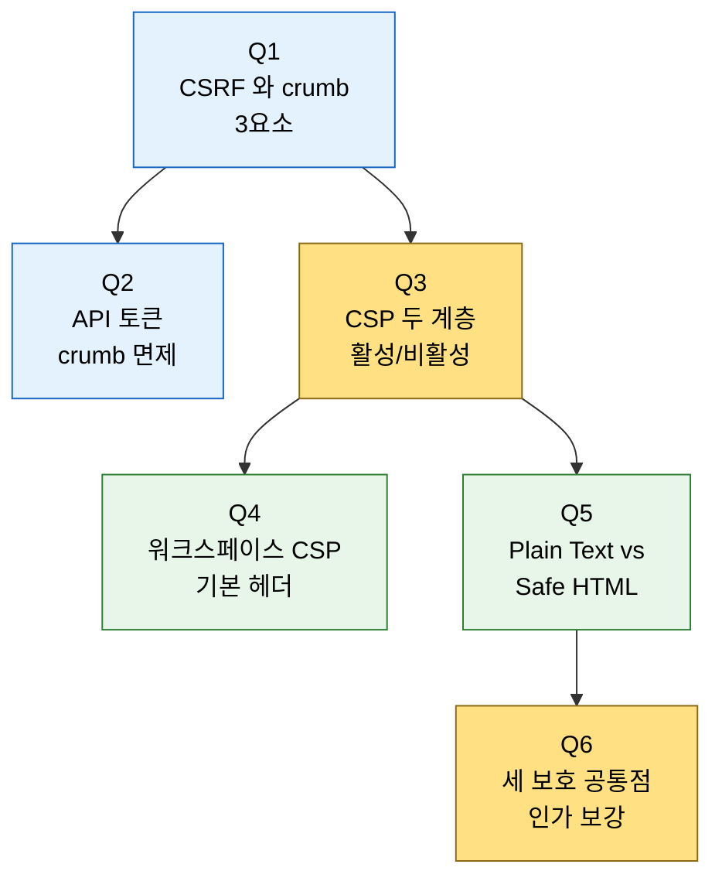

# 6단계 점검 — 웹 계층 보호 핵심 질문

---

> 이 점검 문서는 04장(웹 계층 보호) 을 다 읽은 뒤 스스로를 시험하기 위한 자가 점검입니다. 먼저 §면접 질문만 보고 답을 떠올린 뒤, §정답 절에서 같은 번호로 대조하세요.
> 다루는 문서: `04-01.웹 계층 보호 — CSRF·CSP·사용자 콘텐츠`

## §학습 목표

> 이 질문들에 막힘 없이 답할 수 있으면 04장 본편 학습이 끝난 것으로 봅니다. 막힌 질문은 본문 해당 절로 돌아가 다시 읽고 다음 회차 복습으로 가져갑니다.

## §사전 지식

> 본 점검은 "CSRF(요청 위조)", "crumb 토큰", "Content Security Policy(XSS 차단)", "Markup Formatter(사용자 텍스트 렌더링)" 같은 웹 보안 개념을 Jenkins 의 Default Crumb Issuer·워크스페이스/UI CSP·Plain Text/Safe HTML 단위로 좁혀 본 형태입니다. 인증·인가 일반은 [01-01](01-01.인증과%20인가%20—%20누가%20무엇을%20할%20수%20있는가.md) 에서 봅니다.

## §질문 흐름 한눈에

> Q1(CSRF)·Q3(CSP) 가 두 기둥이고, Q6 이 세 보호를 하나의 원칙(브라우저 계층에서 인가 보강)으로 묶습니다.

## 면접 질문

> 자기 답을 떠올린 뒤 `정답` 절을 펼쳐 비교합니다.

1. CSRF 는 무엇을 위조하며, crumb 토큰은 무엇 세 가지를 인코딩해 막습니까?
2. API 토큰으로 인증하면 왜 crumb 이 면제됩니까?
3. Jenkins CSP 두 계층은 각각 무엇을 대상으로 하고, 기본 상태(활성/비활성)가 어떻게 다릅니까?
4. 워크스페이스·아티팩트 CSP 기본 헤더는 JavaScript 를 어떻게 다루고, 조정은 무엇으로 합니까?
5. Markup Formatter 의 Plain Text 와 Safe HTML 은 각각 무엇을 허용/차단하며, Safe HTML 의 전제 조건은?
6. 세 보호(CSRF·CSP·Markup)의 공통점은 무엇이며, 인증·인가와 어떤 보강 관계입니까?

## 정답

### 정답 1

CSRF 는 사용자의 *브라우저 세션을 도용* 해 상태 변경 요청을 위조합니다. crumb 토큰은 *사용자명·웹 세션 ID·인스턴스 고유 salt* 세 가지를 인코딩합니다. 악성 사이트는 세션 ID·salt 를 몰라 유효한 crumb 을 못 만들고 위조 요청이 걸립니다.

### 정답 2

CSRF 는 세션 쿠키가 자동으로 실려 나가는 점을 악용합니다. API 토큰은 세션 쿠키가 아니라 명시적으로 제공해야 하는 인증이라 악성 사이트가 사용자 모르게 실어 보낼 수 없습니다. 구조적으로 CSRF 에 취약하지 않으므로 crumb 이 면제됩니다.

### 정답 3

① 워크스페이스·아티팩트 CSP 는 빌드 산출물·워크스페이스 HTML 대상이고 *기본 활성* 입니다. ② UI CSP 는 Jenkins UI 페이지 대상으로 2.539+ 에 도입됐고 *기본 비활성* 이라 위반 리포트만 수집해 비호환 플러그인을 먼저 파악하게 합니다. 슬러그도 다릅니다(configuring-content-security-policy vs csp).

### 정답 4

기본 헤더(`sandbox allow-same-origin; default-src 'none'; img-src 'self'; style-src 'self';`)는 JavaScript 를 전면 차단하고 인라인·외부 CSS, XHR, iframe 도 막습니다. 조정은 Java 시스템 프로퍼티 `hudson.model.DirectoryBrowserSupport.CSP` 로 하며 Script Console 에서 재시작 없이 실험합니다. 빈 문자열은 헤더를 비활성화해 권장하지 않습니다.

### 정답 5

Plain Text(기본)는 `<`·`&` 를 이스케이프하고 줄바꿈을 ` ` 로 렌더링해 스크립트 실행을 막습니다. Safe HTML 은 안전한 HTML 서브셋(굵게·링크)을 허용하되 스크립트는 거릅니다. 전제 조건은 *OWASP Markup Formatter Plugin 설치* 입니다 — 없으면 Safe HTML 선택지가 없습니다.

### 정답 6

세 보호 모두 *한 사용자가 제어하는 입력(요청·HTML·텍스트)이 다른 사용자의 브라우저에서 함부로 실행되는 것* 을 막습니다. 인증·인가가 세운 권한 경계를 브라우저 계층에서 보강합니다 — 권한을 잘 나눠도 남의 브라우저에서 코드를 돌리면 경계가 우회되므로 그 우회로를 닫습니다.
