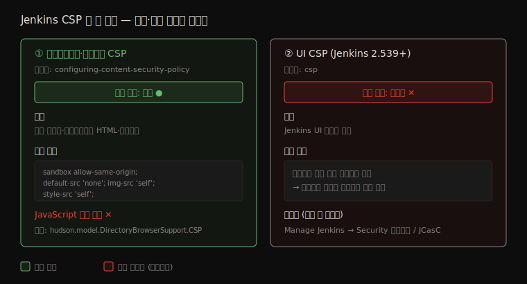

# 웹 계층 보호 — CSRF·CSP·사용자 콘텐츠

---

> Jenkins 의 *웹 공격 표면* 을 다룹니다. 브라우저 세션을 도용하는 CSRF 를 crumb 토큰이 어떻게 막는지, 워크스페이스·아티팩트와 UI 두 계층의 CSP 가 XSS 를 어떻게 차단하는지, 사용자가 입력한 텍스트(설명·프로필)를 Markup Formatter 가 어떻게 안전하게 렌더링하는지 봅니다.

## §학습 목표

> 이 문서를 읽고 나면 CSRF 가 *무엇을 위조* 하고 crumb 토큰이 *어떻게* 막는지(crumb 에 무엇이 인코딩되는지) 설명할 수 있고, Jenkins 의 CSP 가 *두 계층*(워크스페이스·아티팩트 vs UI 2.539+) 으로 나뉜다는 것과 각 기본 정책을 구분할 수 있으며, Markup Formatter 의 Plain Text 와 Safe HTML 이 *무엇을 허용/차단* 하는지, Safe HTML 에 *어떤 플러그인이 전제* 되는지 답할 수 있습니다.

## §사전 지식

> 본 문서는 인증·인가([01-01](01-01.인증과%20인가%20—%20누가%20무엇을%20할%20수%20있는가.md))가 "누가 무엇을 할 수 있는가" 를 정한 *뒤*, 브라우저·렌더링 계층에서 *그 권한이 도용·우회되는 것* 을 막는 축입니다. CSRF 의 API 토큰 면제는 01-01 §4(API Token과 CSRF)와 이어지므로 함께 보면 좋습니다.

> **공식 문서 내 위치**: 이 문서는 Jenkins 공식 보안 문서의 *CSRF Protection*([csrf-protection](https://www.jenkins.io/doc/book/security/csrf-protection/)), *Content Security Policy*([configuring-content-security-policy](https://www.jenkins.io/doc/book/security/configuring-content-security-policy/) · [csp](https://www.jenkins.io/doc/book/security/csp/)), *Markup Formatters / Rendering User Content*([markup-formatter](https://www.jenkins.io/doc/book/security/markup-formatter/)) 페이지를 *웹 공격 표면* 관점으로 묶습니다.

## 1. CSRF — 세션 도용 위조를 crumb 으로 막는다

> 본 절은 *상태 변경 요청 위조* 를 다룹니다. 핵심은 crumb 이라는 일회성 토큰으로 "이 요청이 진짜 Jenkins UI 에서 왔는가" 를 검증한다는 점입니다.

Cross-Site Request Forgery(CSRF)는 사용자가 다른 사이트를 방문하는 동안, 그 사이트가 사용자의 *브라우저 세션을 이용해* Jenkins 에 무단 요청을 보내는 공격입니다. 사용자가 Jenkins 에 로그인된 상태라면, 악성 페이지가 몰래 "빌드 트리거" 나 "설정 변경" 요청을 보내도 브라우저는 세션 쿠키를 자동으로 실어 보냅니다. 공격자는 사용자의 권한으로 상태를 바꿀 수 있습니다.

Jenkins 는 이를 **crumb 토큰** 으로 막습니다. 상태를 바꾸는 요청마다 crumb 을 요구하는데, Default Crumb Issuer 는 이 crumb 해시에 세 가지를 인코딩합니다 — *사용자명*, *웹 세션 ID*, 그리고 *이 Jenkins 인스턴스에 고유한 salt*. 악성 사이트는 사용자의 세션 ID 와 인스턴스 salt 를 알 수 없으므로 유효한 crumb 을 만들지 못합니다. 그래서 위조 요청은 crumb 검증에서 걸립니다.

API 로 Jenkins 를 호출할 때는 crumb 을 먼저 발급받아야 합니다. `/crumbIssuer/api` 엔드포인트로 crumb 을 받고, 공식 표현으로 "사용자명·비밀번호에 더해 crumb 과 세션 쿠키를 함께 제공(provide the crumb and the session cookie in addition to username and password)" 합니다. 한 가지 예외가 있습니다 — **API 토큰으로 인증하면 crumb 이 면제** 됩니다. API 토큰 자체가 세션 쿠키가 아니라 CSRF 에 취약하지 않은 인증 수단이기 때문입니다. 그래서 자동화 스크립트는 비밀번호+crumb 보다 API 토큰을 쓰는 편이 간단합니다.

CSRF Protection 은 Jenkins 2.222 이상에서 기본 활성화됩니다. 더 엄격한 정책이 필요하면 Strict Crumb Issuer 플러그인으로 커스터마이징합니다.


## 2. CSP — XSS 를 막는 두 계층

> 본 절은 *Content Security Policy* 를 다룹니다. 핵심은 Jenkins 의 CSP 가 *워크스페이스·아티팩트용* 과 *UI 용(2.539+)* 두 계층으로 나뉘고, 둘의 기본 상태가 다르다는 점입니다.

Jenkins 는 사용자가 제어하는 HTML 이 XSS 벡터가 되는 것을 CSP 로 막습니다. 그런데 *두 계층* 이 있고, 슬러그도 기본 상태도 다릅니다. 이 둘을 혼동하지 않는 것이 핵심입니다.



### 계층 ① — 워크스페이스·아티팩트 CSP (기존)

빌드 산출물, 워크스페이스 브라우저, 아카이브된 아티팩트처럼 *사용자가 만든 HTML 파일* 이 Jenkins 를 통해 서빙될 때 적용됩니다. 빌드가 만든 HTML 리포트에 악성 스크립트가 들어 있어도, CSP 가 그 실행을 막습니다. 기본 정책 헤더는 다음과 같습니다.

```
sandbox allow-same-origin; default-src 'none'; img-src 'self'; style-src 'self';
```

이 기본값이 차단하는 것은 강력합니다 — JavaScript 를 *전면 차단* 하고, 인라인 CSS 와 외부 사이트 CSS 를 막으며, XHR/AJAX·플러그인 객체·iframe·외부 폰트를 모두 거부합니다. 빌드 리포트가 *정적 HTML+자기 출처 이미지·스타일* 만 쓰도록 강제하는 셈입니다.

조정이 필요하면 Java 시스템 프로퍼티 `hudson.model.DirectoryBrowserSupport.CSP` 를 설정합니다. Script Console 에서 재시작 없이 동적으로 실험할 수 있고, 빈 문자열로 두면 헤더 자체가 비활성화됩니다(권장하지 않습니다 — XSS 보호가 사라집니다). 더 완전한 격리가 필요하면 Resource Root URL 을 별도 도메인으로 두어 아티팩트를 메인 출처에서 분리합니다.

### 계층 ② — UI CSP (Jenkins 2.539+)

Jenkins 2.539 부터는 *Jenkins UI 자체* 에 대한 CSP 가 도입됐습니다. 다만 계층 ①과 달리 — 공식 표현으로 "기본적으로 Jenkins UI 페이지에 대한 CSP 강제는 비활성(by default, CSP enforcement on Jenkins UI pages is disabled)" 입니다. 대신 Jenkins 가 위반 리포트를 수집해, 관리자가 *어떤 플러그인이 CSP 와 호환되지 않는지* 먼저 파악하게 합니다. 호환성을 확인한 뒤 활성화하라는 단계적 도입입니다.

활성화는 Manage Jenkins → Security 의 CSP 강제 체크박스나 JCasC YAML(`security: contentSecurityPolicy: enforce: true`) 로 합니다. 디렉티브 수준 조정은 Content Security Policy Plugin 2.x 로 합니다.

| 계층 | 대상 | 기본 상태 | 슬러그 |
|------|------|----------|--------|
| ① 워크스페이스·아티팩트 | 빌드 산출물·워크스페이스 HTML | *활성* (위 기본 헤더) | configuring-content-security-policy |
| ② UI | Jenkins UI 페이지 자체 | *비활성* (2.539+, 리포트만 수집) | csp |

## 3. Markup Formatter — 사용자 텍스트를 안전하게 렌더링

> 본 절은 *사용자가 입력한 텍스트* 의 렌더링을 다룹니다. 핵심은 Job·뷰·프로필 설명에 들어간 HTML 을 그대로 렌더링하면 XSS 가 된다는 점, Markup Formatter 가 그걸 결정한다는 점입니다.

Jenkins 는 Job·뷰·노드 설명(description), 사용자 프로필 등 여러 곳에서 *사용자가 입력한 텍스트* 를 렌더링합니다. 이 텍스트를 HTML 로 그대로 렌더링하면, 공식 표현대로 "완전히 신뢰할 수는 없는, 빌드에 영향을 줄 수 있는 사람들에 의해 그 HTML 파일에 Cross-Site Scripting 공격이 심길 수 있습니다(Cross-Site Scripting attacks could be put into those HTML files by people with influence over builds who may not be fully trusted)."

특히 위험한 곳이 *사용자 프로필* 입니다. Overall/Read 권한만 있으면 누구나 자기 프로필을 편집할 수 있는데, GitHub·GitLab·Google 같은 외부 인증을 쓰는 *공개* Jenkins 라면 누구나 로그인한 뒤 프로필에 XSS 페이로드를 심을 수 있습니다.

이를 Markup Formatter 설정이 통제합니다. 두 가지가 있습니다.

- **Plain Text** (기본) — 공식 표현으로 "`<`·`&` 같은 위험한 HTML 메타문자를 이스케이프하고, 줄바꿈을 `<br/>` 태그로 렌더링(Unsafe HTML metacharacters like `<` and `&` are escaped, and line breaks are rendered as `<br/>` HTML tags)" 합니다. HTML 태그가 *텍스트로* 보일 뿐 실행되지 않으므로 스크립트 주입이 불가능합니다.
- **Safe HTML** — "기본적이고 안전한 HTML 서브셋의 사용을 허용(allows the use of a basic, safe subset of HTML)" 합니다. 굵게·링크 같은 서식은 되지만 스크립트는 거릅니다. 단 이 옵션은 **OWASP Markup Formatter Plugin 설치가 전제** 입니다 — 플러그인이 없으면 Safe HTML 선택지 자체가 없습니다.

설정 경로는 Manage Jenkins → Security → Markup Formatter 입니다. 기본 Plain Text 를 유지하면 가장 안전하고, 서식이 꼭 필요할 때만 Safe HTML(OWASP 플러그인)로 바꿉니다.

## 4. 세 보호의 공통점 — 신뢰 경계는 브라우저에서도 그어진다

> 본 절은 1~3절을 묶습니다. 핵심은 세 보호 모두 *사용자가 제어하는 입력이 다른 사용자의 브라우저에서 실행되는 것* 을 막는다는 점입니다.

CSRF·CSP·Markup Formatter 는 다른 공격을 막지만 한 가지를 공유합니다 — *한 사용자가 제어하는 것(요청·HTML·텍스트)이 다른 사용자의 브라우저 컨텍스트에서 함부로 실행되지 못하게* 하는 것입니다. CSRF 는 악성 사이트의 요청이 내 세션으로 실행되는 것을, CSP 는 빌드 산출물의 스크립트가 내 브라우저에서 도는 것을, Markup Formatter 는 남의 설명·프로필의 스크립트가 내 화면에서 실행되는 것을 막습니다.

그래서 이 셋은 인증·인가([01-01](01-01.인증과%20인가%20—%20누가%20무엇을%20할%20수%20있는가.md))가 세운 권한 경계를 *브라우저 계층에서 보강* 합니다. 권한을 아무리 잘 나눠도, 한 사용자가 다른 사용자의 브라우저에서 코드를 실행할 수 있으면 그 경계는 우회됩니다. 웹 계층 보호는 그 우회로를 닫습니다.

---

## 면접 질문

> 자기 답을 떠올린 뒤 `정답` 절을 펼쳐 비교합니다.

1. CSRF 는 무엇을 위조하며, crumb 토큰은 *무엇을 인코딩* 해서 막습니까?
2. API 토큰으로 인증하면 왜 crumb 이 면제됩니까?
3. Jenkins CSP 는 *두 계층* 으로 나뉩니다. 각각 무엇을 대상으로 하고, 기본 상태(활성/비활성)는 어떻게 다릅니까?
4. 워크스페이스·아티팩트 CSP 의 기본 헤더는 JavaScript 를 어떻게 다룹니까? 조정은 무엇으로 합니까?
5. Markup Formatter 의 Plain Text 와 Safe HTML 은 각각 무엇을 허용/차단합니까? Safe HTML 의 *전제 조건* 은?
6. 세 보호(CSRF·CSP·Markup)의 공통점은 무엇이며, 인증·인가와 어떻게 보강 관계입니까?

## 정답

### 정답 1 — CSRF 와 crumb

CSRF 는 사용자의 *브라우저 세션을 도용* 해 상태 변경 요청(빌드 트리거·설정 변경)을 위조하는 공격입니다. crumb 토큰은 해시에 *사용자명·웹 세션 ID·인스턴스 고유 salt* 세 가지를 인코딩합니다. 악성 사이트는 세션 ID 와 salt 를 알 수 없어 유효한 crumb 을 못 만들고, 위조 요청이 crumb 검증에서 걸립니다.

### 정답 2 — API 토큰 crumb 면제

CSRF 는 *세션 쿠키가 자동으로 실려 나가는* 점을 악용합니다. API 토큰은 세션 쿠키가 아니라 명시적으로 제공해야 하는 인증 수단이라, 악성 사이트가 사용자 모르게 실어 보낼 수 없습니다. 즉 API 토큰 인증은 구조적으로 CSRF 에 취약하지 않으므로 crumb 이 면제됩니다. 그래서 자동화 스크립트는 API 토큰을 쓰는 편이 간단합니다.

### 정답 3 — CSP 두 계층

① 워크스페이스·아티팩트 CSP 는 *빌드 산출물·워크스페이스 HTML* 을 대상으로 하고 *기본 활성* 입니다(슬러그 configuring-content-security-policy). ② UI CSP 는 *Jenkins UI 페이지 자체* 를 대상으로 Jenkins 2.539+ 에 도입됐으며 *기본 비활성* 입니다 — 위반 리포트만 수집해 관리자가 비호환 플러그인을 먼저 파악하게 합니다(슬러그 csp). 둘을 혼동하면 안 됩니다.

### 정답 4 — 워크스페이스 CSP 기본 헤더

기본 헤더(`sandbox allow-same-origin; default-src 'none'; img-src 'self'; style-src 'self';`)는 JavaScript 를 *전면 차단* 합니다. 인라인·외부 CSS, XHR/AJAX, iframe, 외부 폰트도 막고, 같은 출처 이미지·스타일만 허용합니다. 조정은 Java 시스템 프로퍼티 `hudson.model.DirectoryBrowserSupport.CSP` 로 하며, Script Console 에서 재시작 없이 실험할 수 있습니다. 빈 문자열로 두면 헤더가 비활성화돼 XSS 보호가 사라지므로 권장하지 않습니다.

### 정답 5 — Plain Text vs Safe HTML

Plain Text(기본)는 `<`·`&` 같은 메타문자를 이스케이프하고 줄바꿈을 `<br/>` 로 렌더링합니다 — HTML 이 텍스트로만 보여 스크립트가 실행되지 않습니다. Safe HTML 은 안전한 HTML 서브셋(굵게·링크 등)을 허용하되 스크립트는 거릅니다. 전제 조건은 *OWASP Markup Formatter Plugin 설치* 입니다 — 플러그인이 없으면 Safe HTML 선택지 자체가 없습니다. 기본 Plain Text 가 가장 안전합니다.

### 정답 6 — 공통점과 보강 관계

세 보호는 모두 *한 사용자가 제어하는 입력(요청·HTML·텍스트)이 다른 사용자의 브라우저에서 함부로 실행되는 것* 을 막습니다. CSRF 는 악성 사이트 요청이 내 세션으로, CSP 는 빌드 산출물 스크립트가 내 브라우저에서, Markup Formatter 는 남의 설명·프로필 스크립트가 내 화면에서 실행되는 것을 각각 차단합니다. 인증·인가가 세운 권한 경계를 *브라우저 계층에서 보강* 하는 관계입니다 — 권한을 잘 나눠도 한 사용자가 남의 브라우저에서 코드를 돌리면 경계가 우회되므로, 그 우회로를 닫습니다.

## 관련 문서

> 인증·인가는 01-01 이, 빌드 신원·입력은 03-02 가 다룹니다. 이 문서는 그 권한이 *브라우저·렌더링 계층에서 우회되는 것* 을 막는 축입니다.

- [01-01. 인증과 인가](01-01.인증과%20인가%20—%20누가%20무엇을%20할%20수%20있는가.md) § "API Token과 CSRF Protection" — crumb·API 토큰의 인증 측면
- [03-02. 빌드 권한과 입력 안전](03-02.빌드%20권한과%20입력%20안전%20—%20빌드는%20누구로%20무엇을%20들고%20도는가.md) — 빌드 신원·입력 축(웹 계층과 짝)

### 공식 출처 (1차 자료)

- [CSRF Protection](https://www.jenkins.io/doc/book/security/csrf-protection/) — crumb 3요소, `/crumbIssuer/api`, API 토큰 면제
- [Configuring Content Security Policy](https://www.jenkins.io/doc/book/security/configuring-content-security-policy/) — 워크스페이스·아티팩트 CSP 기본 헤더
- [Content Security Policy (UI)](https://www.jenkins.io/doc/book/security/csp/) — UI CSP(2.539+, 기본 비활성)
- [Markup Formatters](https://www.jenkins.io/doc/book/security/markup-formatter/) — Plain Text·Safe HTML(OWASP 플러그인)
