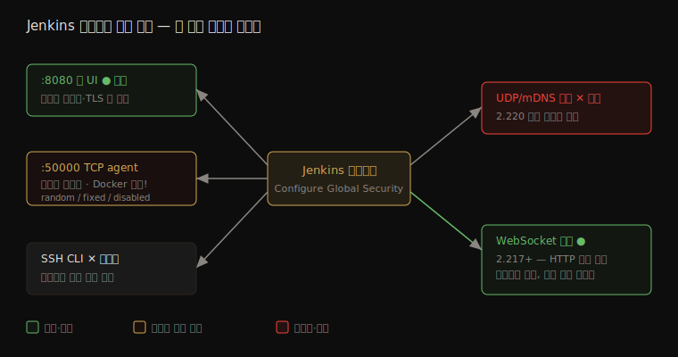

# 노출 표면과 보안 관리 — 포트·서비스·Configure Global Security

---

> Jenkins 가 *바깥으로 여는 포트·서비스* 가 무엇이고 어떻게 줄이는지, 그리고 이 모든 보안 설정이 모이는 *중앙 진입점*(Configure Global Security)이 무엇인지 다룹니다. 공격 표면을 줄이는 것과 설정을 한곳에서 관리하는 것, 두 운영 관점입니다.

## §학습 목표

> 이 문서를 읽고 나면 Jenkins 가 여는 주요 포트(웹 8080·TCP agent 50000·SSH CLI)가 *각각 무엇이고 어떻게 제한* 하는지 설명할 수 있고, TCP agent 포트의 random/fixed/disabled 모드와 WebSocket 대안의 차이를 구분할 수 있으며, Configure Global Security 가 *어떤 설정을 한곳에 모으는지*, 그리고 "Enable Security 체크박스가 *왜 사라졌는지*" 답할 수 있습니다.

## §사전 지식

> 본 문서는 인증·인가([01-01](01-01.인증과%20인가%20—%20누가%20무엇을%20할%20수%20있는가.md))·프로세스 격리([03-01](03-01.프로세스·파일시스템%20격리%20—%20워킹%20디렉토리%20밖으로%20못%20나가게.md))가 *내부* 를 다뤘다면, *외부로 노출되는 표면* 과 그 설정의 *중앙 관리* 를 다룹니다. Docker·Kubernetes 배포는 03-01 의 환경별 설정과 이어집니다.

> **공식 문서 내 위치**: 이 문서는 Jenkins 공식 보안 문서의 *Exposed Services and Ports*([services](https://www.jenkins.io/doc/book/security/services/)) 와 *Managing Security*([managing-security](https://www.jenkins.io/doc/book/security/managing-security/)) 페이지를 *운영 노출·중앙 설정* 관점으로 묶습니다.

## 1. Jenkins 가 여는 포트와 서비스

> 본 절은 *공격 표면* 을 다룹니다. 핵심은 Jenkins 가 여는 포트마다 용도와 기본 상태가 다르고, 안 쓰는 것은 닫는 게 최소 노출이라는 점입니다.

Jenkins 는 여러 포트로 서비스를 노출합니다. 각각 용도와 기본 상태가 다르므로, 무엇이 열려 있는지 알고 안 쓰는 것은 닫는 것이 공격 표면을 줄이는 기본입니다.

| 서비스 | 기본 포트 | 기본 상태 | 제한·비활성화 |
|--------|----------|----------|--------------|
| Web UI (HTTP/HTTPS) | 8080 | 활성 | 리버스 프록시로 필터링·TLS 종단 |
| TCP Agent Listener (inbound agent / JNLP) | 50000 (Docker 이미지) | 대부분 패키지에서 *비활성*, Docker 는 노출 | Manage Jenkins → Security 에서 fixed/random/disabled |
| SSH Server (CLI 용) | 커스텀 | *비활성* (플러그인 별도 설치 필요) | 비활성 유지 또는 공개키 인증 |
| UDP/mDNS 서비스 탐색 | — | *제거됨* | Jenkins 2.220 에서 보안상 제거 |

UDP/mDNS 자동 탐색은 공식 표현으로 "보안상 이유로 Jenkins 2.220 에서 대체 없이 제거(removed without replacement in Jenkins 2.220 for security reasons)" 됐습니다. 자동 탐색이 네트워크에 Jenkins 의 존재를 광고하는 표면이었기 때문입니다. 최신 LTS 에서는 신경 쓸 필요가 없습니다.

TCP Agent Listener 는 주의가 필요합니다. 공식 표현으로 "대부분의 패키지에서 기본 비활성이지만, Docker 이미지는 50000 포트로 노출(disabled by default in most packages, but the Docker images expose it at port 50000)" 합니다. 즉 패키지 설치만 보고 "agent 포트는 닫혀 있겠지" 라고 가정하면, Docker 배포에서 틀립니다. 배포 방식마다 확인해야 합니다.

### TCP Agent 포트 모드와 WebSocket 대안

inbound agent 가 컨트롤러에 붙는 TCP 포트는 세 모드가 있습니다.

- **Random** — 컨트롤러 재시작마다 포트가 바뀝니다. 방화벽 규칙을 고정하기 어려워 운영에 불편합니다.
- **Fixed** — 관리자가 지정한 포트로 고정합니다. 방화벽 규칙을 일관되게 적용할 수 있어 운영에 유리합니다.
- **Disabled** — inbound TCP agent 를 아예 받지 않습니다. 에이전트가 필요 없거나 다른 방식으로 붙을 때.

Jenkins 2.217 이상은 **WebSocket** 대안을 제공합니다. 에이전트가 WebSocket 으로 컨트롤러에 연결하면, 별도 TCP agent 포트를 열 필요가 없습니다. HTTP(S) 포트(8080·443) 위로 에이전트 트래픽이 흐르므로, 방화벽에 추가 포트를 뚫지 않아도 됩니다. 노출 표면을 줄이는 방향이라 방화벽이 빡빡한 환경에서 유용합니다.

설정 경로는 Manage Jenkins → Security 입니다.

## 2. Configure Global Security — 모든 보안 설정의 중앙 진입점

> 본 절은 *설정의 중앙 관리* 를 다룹니다. 핵심은 흩어진 보안 설정이 한 페이지에 모이고, 2.0 이후 안전한 기본값이 강제된다는 점입니다.

지금까지 본 보안 설정(인증·인가·CSRF·Markup Formatter·agent 포트·컨트롤러 격리)은 흩어진 게 아니라 한 곳에 모입니다 — **Configure Global Security**(Manage Jenkins → Security) 페이지입니다. 이 페이지가 Jenkins 전체 보안 설정의 중앙 진입점입니다.

| 범주 | 설정하는 것 |
|------|------------|
| Authentication (Security Realm) | Jenkins 자체 DB·LDAP·SAML 등 인증 방식 |
| Authorization | Matrix-based·Project-based matrix·역할 기반 등 권한 전략 |
| CSRF Protection | crumb 활성/비활성 |
| Markup Formatter | Plain Text·Safe HTML |
| TCP Agent Listener Port | disabled·random·fixed |
| Agent ↔ Controller 격리 | 에이전트가 컨트롤러 파일시스템에 접근 못 하게 |

공식 문서는 이 조합의 표현력을 이렇게 말합니다 — "Security Realm 과 Authorization 설정을 함께 쓰면 느슨하게도 엄격하게도 인증·인가 체계를 구성할 수 있다(Using both the Security Realm and Authorization configurations it is possible to configure very relaxed or very rigid authentication and authorization schemes)." 두 축을 조합해 환경에 맞는 정책을 만드는 것입니다.

### "Enable Security" 체크박스는 왜 사라졌나

예전 Jenkins 에는 보안을 켜고 끄는 "Enable Security" 체크박스가 있었습니다. 지금은 없습니다. 공식 표현으로 "Jenkins 2.214 와 LTS 2.222.1 부터 'Enable Security' 체크박스가 제거됐고, Jenkins 자체 사용자 DB 가 기본 Security Realm 으로 쓰인다(Beginning with Jenkins 2.214 and Jenkins LTS 2.222.1, the 'Enable Security' checkbox has been removed)." 보안을 *끌 수 있는 선택지 자체를 없앤* 것입니다.

이 변화의 뿌리는 Jenkins 2.0 입니다 — "Jenkins 2.0 부터 많은 보안 옵션이 기본 활성화되어, 관리자가 명시적으로 끄지 않는 한 Jenkins 환경이 안전하게 유지된다(As of Jenkins 2.0, many of the security options were enabled by default)." 즉 "안전한 기본값(secure by default)" 으로의 전환이고, 보안을 켜는 걸 잊어 무방비로 노출되는 사고를 구조적으로 막은 것입니다. 관리자가 *일부러 느슨하게 바꾸지 않는 한* 기본이 안전합니다.

## 3. 두 관점의 공통 목표 — 표면을 줄이고 한곳에서 본다

> 본 절은 1·2절을 묶습니다. 핵심은 노출 최소화와 중앙 관리가 *같은 운영 위생* 의 두 면이라는 점입니다.

포트·서비스를 줄이는 것(1절)과 설정을 한곳에서 관리하는 것(2절)은 따로가 아닙니다. 안 쓰는 포트를 닫으려면 *무엇이 열려 있는지* 한눈에 봐야 하고, 그 통제가 Configure Global Security 에 모여 있습니다. 노출 표면을 줄이면 공격자가 건드릴 수 있는 입구가 적어지고, 중앙 관리는 그 입구들을 일관되게 닫고 점검하게 합니다.

이것은 03-01 의 프로세스 격리·03-02 의 빌드 신원과 같은 방향입니다 — *공격자가 닿을 수 있는 범위를 최소로 줄이고, 그 범위를 명시적으로 통제* 합니다. 내부(프로세스·빌드)든 외부(포트·서비스)든, 줄이고 통제한다는 원칙은 같습니다.

---

## 면접 질문

> 자기 답을 떠올린 뒤 `정답` 절을 펼쳐 비교합니다.

1. Jenkins 의 주요 노출 포트 세 가지(웹·TCP agent·SSH)는 각각 무엇이고 기본 상태는 어떻습니까?
2. TCP Agent Listener 포트를 "패키지면 닫혀 있겠지" 라고 가정하면 어디서 틀립니까?
3. TCP agent 포트의 random/fixed/disabled 차이와, WebSocket 대안이 노출 표면을 어떻게 줄입니까?
4. UDP/mDNS 서비스 탐색은 어떻게 됐고, *왜* 그렇게 됐습니까?
5. Configure Global Security 는 어떤 설정을 한곳에 모읍니까? (세 개 이상)
6. "Enable Security" 체크박스는 왜 사라졌으며, 이게 "secure by default" 와 어떻게 이어집니까?

## 정답

### 정답 1 — 주요 노출 포트

웹 UI 는 8080(HTTP/HTTPS), *활성* — 리버스 프록시·TLS 로 보호합니다. TCP Agent Listener(inbound agent/JNLP)는 50000(Docker), *대부분 패키지 비활성·Docker 노출* 입니다. SSH Server(CLI)는 *비활성*(플러그인 별도 설치)입니다. 안 쓰는 것은 닫는 게 최소 노출입니다.

### 정답 2 — TCP agent 가정의 함정

TCP Agent Listener 는 "대부분 패키지에서 비활성이지만 Docker 이미지는 50000 으로 노출" 합니다. 그래서 패키지 설치 기준으로 "닫혀 있겠지" 라고 가정하면 *Docker 배포에서 틀립니다*. 배포 방식마다 실제 상태를 확인해야 합니다.

### 정답 3 — agent 포트 모드와 WebSocket

Random 은 재시작마다 포트가 바뀌어 방화벽 규칙 고정이 어렵고, Fixed 는 지정 포트로 고정해 방화벽에 유리하며, Disabled 는 inbound TCP agent 를 아예 안 받습니다. WebSocket(2.217+)은 에이전트가 HTTP(S) 포트 위로 연결해 *별도 TCP agent 포트를 열지 않아도* 되므로, 방화벽에 추가 구멍을 안 뚫고 노출 표면을 줄입니다.

### 정답 4 — UDP/mDNS

UDP/mDNS 자동 탐색은 Jenkins 2.220 에서 *보안상 이유로 대체 없이 제거* 됐습니다. 자동 탐색이 네트워크에 Jenkins 존재를 광고하는 표면이었기 때문입니다. 최신 LTS 에서는 신경 쓸 필요가 없습니다.

### 정답 5 — Configure Global Security

Security Realm(인증 방식), Authorization(권한 전략), CSRF Protection, Markup Formatter, TCP Agent Listener Port, Agent↔Controller 격리 등을 한 페이지(Manage Jenkins → Security)에 모읍니다. 흩어진 보안 설정의 중앙 진입점입니다.

### 정답 6 — Enable Security 제거

"Enable Security" 체크박스는 Jenkins 2.214 / LTS 2.222.1 에서 제거됐고, Jenkins 자체 DB 가 기본 Security Realm 이 됐습니다 — *보안을 끌 수 있는 선택지 자체를 없앤* 것입니다. 뿌리는 Jenkins 2.0 의 "many security options enabled by default" 로, secure by default 전환입니다. 보안을 켜는 걸 잊어 무방비 노출되는 사고를 구조적으로 막았습니다.

## 관련 문서

> 내부 프로세스 격리는 03-01 이, 빌드 신원·입력은 03-02 가, 인증·인가는 01-01 이 다룹니다. 이 문서는 *외부 노출 표면과 중앙 관리* 를 채웁니다.

- [03-01. 프로세스·파일시스템 격리](03-01.프로세스·파일시스템%20격리%20—%20워킹%20디렉토리%20밖으로%20못%20나가게.md) — 내부 프로세스 격리(외부 노출과 짝)
- [01-01. 인증과 인가](01-01.인증과%20인가%20—%20누가%20무엇을%20할%20수%20있는가.md) — Configure Global Security 의 Security Realm·Authorization

### 공식 출처 (1차 자료)

- [Exposed Services and Ports](https://www.jenkins.io/doc/book/security/services/) — 8080·50000·SSH 포트, UDP/mDNS 제거(2.220), WebSocket(2.217+)
- [Managing Security](https://www.jenkins.io/doc/book/security/managing-security/) — Configure Global Security, "Enable Security" 제거(2.214/LTS 2.222.1)
