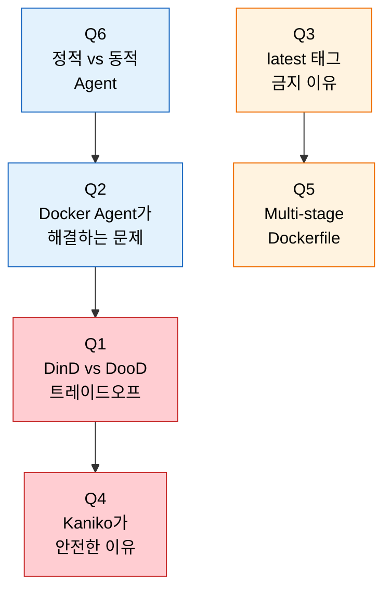
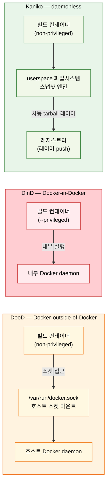

# 4단계 점검 — Agent와 Docker 핵심 질문

> 이 점검 문서는 4단계(Agent와 Docker) 를 다 읽은 뒤 스스로를 시험하기 위한 자가 점검입니다. 먼저 §면접 질문만 보고 답을 떠올린 뒤, §정답 절에서 같은 번호로 대조하세요.

> 다루는 문서: `01-01.실행환경으로서의 Agent` ~ `01-04.빌드 도구 비교와 선택`

## §학습 목표

> 이 질문들에 막힘 없이 답할 수 있으면 Agent·Docker 본편 학습이 끝난 것으로 봅니다. 막힌 질문은 본문 해당 절로 돌아가 다시 읽고 다음 회차 복습으로 가져갑니다.

## §사전 지식

> 본 점검은 "컨테이너 안에서 컨테이너 빌드(DinD/DooD)", "daemon-free 빌드 도구(Kaniko/Buildah)", "이미지 태그 불변성", "Multi-stage 빌드", "정적 vs 동적 워커" 같은 일반 컨테이너/CI 개념을 Jenkins Agent·Docker Agent·Kubernetes Plugin 단위로 좁혀 본 형태입니다.

## §질문 흐름 한눈에

> 파란색은 *Agent 실행 모델* (정적/동적, Docker Agent 의 본질), 빨간색은 *컨테이너 내부 빌드의 보안* (DinD/DooD/Kaniko), 주황색은 *이미지 위생* (태그 전략, Multi-stage) 입니다.

> DinD는 `--privileged` 필수(컨테이너 탈출 위험), DooD는 호스트 소켓 마운트(호스트 root 접근과 동일), Kaniko는 userspace 스냅샷으로 daemon·privileged 모두 불필요합니다.

---

## 면접 질문

> 답을 떠올린 뒤 §정답 절에서 같은 번호로 대조하세요. 각 질문 뒤의 *심화*까지 답할 수 있으면 충분합니다.

1. DinD와 DooD의 차이와 트레이드오프는? *(심화: Kubernetes Pod Security Standards에서 DinD와 DooD가 각각 어떤 수준(privileged, baseline, restricted)에서 허용됩니까?)*
2. Docker Agent를 사용하면 어떤 문제가 해결됩니까? *(심화: Docker Agent에서 npm 캐시나 Maven 로컬 리포지토리를 빌드 간에 공유하려면 어떻게 해야 합니까?)*
3. `latest` 태그를 프로덕션에서 사용하면 안 되는 이유는? *(심화: 이미지 태그의 불변성(immutability)을 레지스트리 수준에서 강제하는 방법은 무엇입니까?)*
4. Kaniko가 Docker socket 마운트보다 안전한 이유는? *(심화: Kaniko에서 레이어 캐시 효율을 높이려면 어떤 전략을 사용해야 합니까?)*
5. Multi-stage Dockerfile이 CI/CD에서 중요한 이유는? *(심화: Multi-stage 빌드에서 중간 스테이지의 결과물을 디버깅하려면 어떻게 합니까?)*
6. 정적 Agent와 동적 Agent의 차이는? *(심화: Kubernetes Plugin 환경에서 라벨 대신 Pod Template을 사용하는 방식은 어떤 장점이 있습니까?)*

---

## 정답

> 위 질문을 스스로 설명해 본 뒤에 펼치세요.

### 정답 1 — DinD vs DooD 트레이드오프

DinD는 컨테이너 안에서 별도 Docker daemon을 띄우므로 `--privileged`가 필수이며 컨테이너 탈출 위험이 있고 레이어 캐시도 독립이라 느립니다. DooD는 호스트 socket을 마운트해 `--privileged`는 불필요하지만 socket 접근 = 호스트 root 접근과 사실상 동일하므로 보안 측면은 동등하게 위험합니다. 그래서 Kubernetes 보안 정책 환경에서는 두 방식 모두 부적합하고 Kaniko·Buildah처럼 daemon-free 도구로 우회합니다.

비교 표는 `01-03.md` §1, VM 환경에서의 위험 모델은 `01-03a.md` 를 참조합니다.

### 정답 1 심화 — DinD·DooD와 Pod Security Standards

Pod Security Standards 기준으로 (a) **DinD** 는 `--privileged` 컨테이너를 요구하므로 *privileged* 프로파일에서만 허용됩니다 — baseline·restricted 모두 거부. (b) **DooD** 는 `--privileged` 는 불필요하지만 `/var/run/docker.sock` 을 hostPath 로 마운트해야 하므로 *baseline 도 사실상 거부* (hostPath 마운트는 baseline 에서 금지). 따라서 둘 다 *restricted 환경에서는 불가* 이고, restricted 를 강제하는 클러스터에서는 Kaniko/Buildah 가 유일한 daemon-free 대안입니다.

### 정답 2 — Docker Agent가 해결하는 문제

호스트 직접 빌드는 Agent에 설치된 도구 버전에 의존하므로 "이 Agent에서만 실패"하는 비결정성이 발생합니다. Docker Agent는 이미지 태그로 버전을 고정해 동일 결과를 보장하고, 빌드마다 독립 컨테이너를 써서 빌드 간 간섭을 원천 차단합니다. 핵심 오해: Docker Agent는 빌드 "환경"을 컨테이너화하는 것이지 Docker 이미지를 빌드하는 게 아닙니다 — 안에서 `docker build`를 돌리려면 DinD/DooD/Kaniko 같은 별도 전략이 추가로 필요합니다.

상세는 `01-02.md` §1 을 참조합니다.

### 정답 2 심화 — 빌드 간 캐시 공유 전략

빌드 간 공유 캐시는 *Agent 호스트의 영속 경로를 컨테이너에 마운트* 해서 만듭니다. (a) **VM Docker Agent**: `args '-v $HOME/.m2:/root/.m2'` 처럼 호스트의 Maven 로컬 리포지토리를 컨테이너 안 경로에 마운트 — 다음 빌드가 같은 호스트에서 돌면 의존성을 다시 안 받음. (b) **K8s 동적 Agent**: Pod 가 매번 새로 뜨므로 호스트 마운트가 무의미 — 대신 *PersistentVolumeClaim* 을 캐시 디렉토리에 마운트하거나, *원격 캐시 레지스트리* (npm proxy, Nexus/Artifactory) 를 두어 네트워크 캐시로 대체. 동적 환경에서는 *공유 스토리지 또는 원격 캐시* 가 핵심입니다.

### 정답 3 — latest 태그 금지 이유

세 가지가 동시에 깨집니다. 비결정성(여러 브랜치 동시 빌드 시 어느 커밋이 `latest`인지 보장 불가), 롤백 불가("이전 latest" 개념이 없음), Kubernetes 노드 캐시 불일치(`imagePullPolicy: IfNotPresent`가 기본이라 노드마다 다른 버전이 실행됨). 권장 전략은 Git SHA(`myapp:a1b2c3d`)나 SemVer + SHA(`myapp:2.1.0-a1b2c3d`) 조합으로 추적성과 의미를 함께 확보하는 것입니다.

태깅 전략 표는 `01-02.md` §5 를 참조합니다.

### 정답 3 심화 — 태그 불변성 강제 방법

레지스트리 수준에서 태그 불변성을 강제하는 방법이 있습니다. (a) **레지스트리 immutable tag 정책** — Harbor·ECR·GCP Artifact Registry 등은 *immutable tag* 옵션을 제공해 같은 태그로 다시 push 하면 거부. (b) **digest 기반 참조** — `myapp@sha256:...` 형태로 *태그가 아닌 콘텐츠 해시* 로 배포 매니페스트를 고정하면 태그가 바뀌어도 실행 이미지는 불변. (c) **CI 단 push 게이트** — 파이프라인에서 *이미 존재하는 태그면 push 중단* 하는 검증을 넣음. 운영 매니페스트는 *digest 고정* 이 가장 강력합니다.

### 정답 4 — Kaniko가 안전한 이유

`/var/run/docker.sock`에 접근할 수 있는 프로세스는 `docker run -v /:/host alpine chroot /host`로 호스트 root 쉘을 얻을 수 있습니다. Kubernetes Pod Security Standards `restricted` 프로파일은 호스트 path 마운트와 privileged 컨테이너를 모두 금지하므로 Docker daemon 의존이 정책 위반이 됩니다. Kaniko는 Dockerfile 명령을 사용자 공간에서 실행하고 파일시스템 스냅샷으로 레이어를 만들어 daemon 없이 일반 권한으로 동작합니다. 트레이드오프는 레이어 캐싱 효율이 Docker만 못해 빌드 속도가 떨어지는 것입니다.

공식 문서(github.com/GoogleContainerTools/kaniko)에 따르면 Kaniko의 동작 순서는 다음과 같습니다. base 이미지 파일시스템을 추출한 뒤, Dockerfile 명령을 순차 실행하고, 각 명령 실행 후 *userspace에서 파일시스템 스냅샷*(체크섬 비교)을 찍어 변경분을 차등 tarball 레이어로 append합니다.

상세는 `01-03.md` §2 를 참조합니다. 빌드 도구 선택과 대안 비교는 `01-04.md` 결정 트리를 함께 봅니다.

### 정답 4 심화 — Kaniko 레이어 캐시 효율 전략

Kaniko 레이어 캐시 효율 전략은 *Docker 와 같은 레이어 순서 원칙* + *원격 캐시* 입니다. (a) **`--cache=true` + 캐시 레지스트리** — `--cache-repo` 로 빌드한 중간 레이어를 레지스트리에 올려 다음 빌드가 재사용. (b) **Dockerfile 레이어 순서 최적화** — `COPY package*.json ./` + `RUN npm ci` 를 소스 복사 *앞* 에 두어 의존성 레이어가 소스 변경에 안 깨지게. (c) **`--cache-ttl`** 로 캐시 만료 관리. daemon 로컬 캐시가 없으므로 *원격 캐시 레지스트리* 가 사실상 필수입니다.

### 정답 5 — Multi-stage Dockerfile의 CI/CD 가치

이미지 크기와 보안을 한 번에 개선합니다. Node.js Single-stage 1GB+ 이미지가 nginx 서빙 30~50MB로 떨어지면 레지스트리 전송 시간과 컨테이너 시작 시간이 줄고, 최종 이미지에서 컴파일러·패키지 매니저가 빠지면 공격 표면과 CVE 탐지 수가 극적으로 감소합니다. 추가 효과로 `COPY package*.json ./` + `RUN npm ci`를 소스 복사보다 먼저 두면 의존성 레이어가 캐시되어 재빌드 속도까지 빨라집니다.

상세는 `01-03.md` §3 을 참조합니다.

### 정답 5 심화 — 중간 스테이지 디버깅 방법

중간 스테이지 디버깅은 *특정 스테이지까지만 빌드해서 그 안으로 들어가는* 방법입니다. (a) **`--target` 빌드** — `docker build --target builder -t debug-img .` 로 `builder` 스테이지까지만 빌드한 뒤 `docker run -it debug-img sh` 로 진입해 *그 시점 파일시스템* 을 확인. (b) **중간 스테이지에 이름 부여** — `FROM node:18 AS builder` 처럼 명시적 이름을 두면 `--target` 으로 정확히 그 단계를 지정 가능. (c) **임시 디버그 스테이지** — 문제가 되는 스테이지 다음에 `RUN ls -la /app && cat ...` 같은 진단 레이어를 임시로 끼워 빌드 로그로 관찰. 운영 빌드 전에 *컴파일 산출물이 의도대로 생겼는지* 확인하는 데 씁니다.

### 정답 6 — 정적 Agent vs 동적 Agent

정적은 미리 등록되어 항상 온라인이라 빌드가 즉시 시작되지만 빌드 없는 시간에도 리소스를 점유하고 환경이 누적 오염됩니다. 동적은 빌드 요청 시 생성·완료 후 삭제라 매번 깨끗한 환경을 보장하지만 Agent 생성 시간만큼 지연이 붙습니다. 대규모 CI에서는 Kubernetes Plugin으로 Pod를 동적 생성하는 방식이 표준이며, Agent Pool 크기는 피크 동시 빌드 수와 생성 시간의 균형으로 결정합니다.

비교 표와 Pod 생성 흐름은 `01-01.md` §3 을 참조합니다.

### 정답 6 심화 — Pod Template의 장점

Pod Template 방식의 장점은 *빌드별로 필요한 컨테이너 조합을 선언* 할 수 있다는 점입니다. 단순 라벨(`agent { label 'docker' }`) 은 *미리 정의된 노드 그룹* 중 하나를 고르는 것에 그치지만, Pod Template 은 (a) **빌드마다 다른 sidecar 조합** — maven + docker + sonar-scanner 컨테이너를 한 Pod 에 묶어 빌드 그래프를 표현, (b) **리소스 요청 세밀화** — Pod 별 CPU/메모리 requests/limits 를 빌드 성격에 맞게 지정, (c) **Jenkinsfile 안에서 인라인 정의** — `agent { kubernetes { yaml '...' } }` 로 *파이프라인 코드와 함께 버전 관리*. 라벨은 *고정 풀 선택*, Pod Template 은 *빌드별 환경 조립* 입니다.

공식 문서(jenkins.io/doc/pipeline/steps/kubernetes)에 따르면 Kubernetes Plugin은 podTemplate에 `jnlp`라는 이름의 컨테이너를 자동 생성해 Jenkins inbound agent를 실행합니다. 기본 agent 이미지를 교체하려면 컨테이너 이름을 반드시 `jnlp`로 지정해야 합니다. podTemplate에는 `privileged`(boolean), `alwaysPullImage`(boolean, latest 태그 캐시 갱신), `livenessProbe`, `resourceLimitCpu` 등의 옵션을 사용할 수 있습니다. Jenkinsfile에서 인라인으로 선언할 때는 `agent { kubernetes { defaultContainer 'kaniko'; yaml '...' } }` 형태로 Pod 스펙을 직접 포함할 수 있습니다(jenkins.io/doc/book/pipeline/syntax).

---

## 관련 문서

> 이 점검 문서는 01-01부터 01-04까지 네 편을 모두 다룹니다. 점검 중 막힌 질문이 있으면 아래 해당 편으로 바로 돌아가 해당 절을 다시 읽고, 심화 답변은 각 편의 참조 절 표시를 따라가면 동선이 이어집니다.

  - [01-01. 실행환경으로서의 Agent](01-01.실행환경으로서의%20Agent.md) — Agent 실행 모델 본편 § 정적·동적 Agent 비교 및 Pod 생성 흐름(Q6 연계)
  - [01-02. Docker with Pipeline](01-02.Docker%20with%20Pipeline.md) — Docker Agent·이미지 빌드 § Docker Agent 사용법 및 태깅 전략(Q2·Q3 연계)
  - [01-03. 컨테이너 이미지 빌드](01-03.컨테이너%20이미지%20빌드.md) — 컨테이너 이미지 빌드 메커니즘 § DinD·DooD·Kaniko 비교 및 Multi-stage 상세(Q1·Q4·Q5 연계)
  - [01-03a. VM Jenkins에서의 Docker 보안 모델](01-03a.VM%20Jenkins에서의%20Docker%20보안%20모델.md) — docker.sock 보안 § VM 환경 위험 모델(Q1 심화 연계)
  - [01-04. 빌드 도구 비교와 선택](01-04.빌드%20도구%20비교와%20선택.md) — 빌드 도구 선택 § Kaniko·Buildah·BuildKit 결정 트리(Q4 심화 연계)
