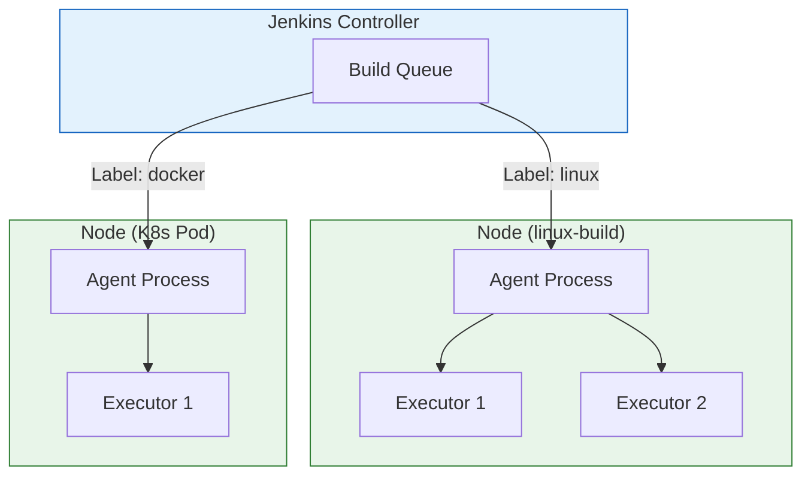
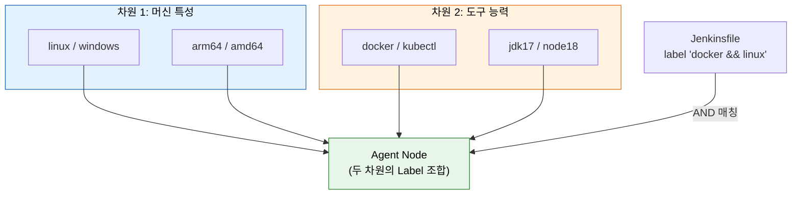
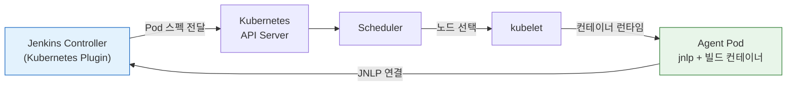

# Agent와 실행환경 설계

---

> 이 문서를 읽고 나면 Node / Agent / Executor 의 포함 관계를 *설명* 하고, Label 을 머신 특성·도구 능력 두 차원으로 *선택* 하며, 정적 Agent 와 동적 Agent(K8s Pod) 의 트레이드오프를 *비교* 하고, 빌드 실패 원인을 Label 불일치·Cold Start·도구 부재로 *디버깅* 할 수 있습니다.


## 사전 지식

> 본 문서는 "워커 노드와 실행 슬롯", "태그 기반 작업 라우팅", "정적 풀 vs 동적 프로비저닝", "실행 환경의 코드화" 같은 일반 분산 빌드 개념을 Jenkins 의 Node·Agent·Executor·Label·Pod Template 단위로 좁혀 본 것입니다.


## 진입 — 빌드는 결국 "어디서" 도는가

> 배포 자동화는 "무엇을" 실행하느냐 못지않게 "어디서" 실행하느냐로 품질이 갈립니다. 같은 Jenkinsfile 도 도는 머신에 따라 결과가 달라집니다.

Jenkins 를 처음 세우면 Controller 한 대가 웹 UI 도 띄우고 빌드도 직접 돌립니다. 파이프라인이 한둘일 때는 이 구성이 단순해서 좋지만, 팀이 커지고 동시 빌드가 늘면 Controller 한 대에 모든 부하가 몰립니다. 무거운 컴파일·테스트가 Controller 의 CPU 와 디스크를 잡아먹으면 웹 UI 응답이 느려지고, 빌드 하나가 Controller 를 죽이면 파이프라인 히스토리와 설정까지 함께 위험해집니다. 그래서 Jenkins 는 일찍부터 "빌드를 받아 실행하는 일"을 Controller 에서 떼어 별도 머신으로 보내는 controller/agent 아키텍처를 채택했습니다(출처: jenkins.io/doc/book/using/using-agents). 이 문서는 그 "빌드가 실제로 도는 자리"를 Node·Agent·Executor·Label·Pod 라는 단위로 분해해 설계하는 법을 다룹니다.


## 1. Node, Agent, Executor 관계

> 본 절은 세 개념의 *포함 관계* 를 정리합니다. Node = 머신, Agent = 그 위 작업 프로세스, Executor = 동시 처리 슬롯 수입니다.

> 이 구조는 이미 아는 *운영체제의 호스트–프로세스–스레드* 관계를 빌드 클러스터 차원으로 일반화한 것입니다. Node 가 호스트, Agent 가 그 위 프로세스, Executor 가 동시 실행 슬롯에 대응합니다.

> Jenkins에서 Node는 빌드를 실행할 수 있는 머신 단위이고, Agent는 그 Node에서 실제 작업을 받아 처리하는 프로세스입니다. Executor는 Agent가 동시에 처리할 수 있는 작업 슬롯 수를 결정합니다.

세 개념을 *건물 비유* 로 잡으면 이해가 빠릅니다. Node 는 *작업장이 들어선 건물* 이고, Executor 는 그 건물 안의 *작업대* 입니다. 작업대(Executor) 하나에서 동시에 진행되는 빌드는 정확히 한 건이고, 작업대가 둘이면 빌드 두 건이 나란히 돕니다. Agent 는 *건물을 운영하며 작업대에 일감을 배분하는 관리인* 입니다. 이 비유는 "Executor 수 = 동시 빌드 수"라는 핵심까지는 정확하지만, 건물과 달리 Executor 는 CPU·메모리라는 *공유 자원* 을 두고 경쟁한다는 점에서 깨집니다 — 작업대 수를 코어 수보다 무리하게 늘리면 작업대끼리 자원을 뺏어 전체가 느려집니다.

- Controller 자체도 Node이지만, 실제 빌드 작업은 별도 Agent Node에서 수행하는 것이 원칙입니다. Jenkins 공식 문서는 빌드 격리와 안정성을 위해 **Controller 의 executor 수를 0 으로 둘 것**을 권장합니다 — 그래야 Controller 가 빌드를 직접 받지 않고 조정 역할에만 전념합니다(출처: jenkins.io/doc/book/using/using-agents).
- Controller에서 빌드를 직접 실행하면 파이프라인 수가 늘어날수록 Controller의 부하가 증가하고, 장애 발생 시 파이프라인 히스토리까지 영향을 받습니다.
- 하나의 Node에 여러 Executor를 설정할 수 있고, **Executor 1 개가 동시 빌드 1 건** 에 대응하므로 Executor 수만큼 파이프라인이 동시에 실행됩니다(출처: jenkins.io/doc/book/using/using-agents).
- Executor 수를 Node의 CPU 코어 수와 1:1로 맞추는 것이 일반적입니다. 빌드 작업이 I/O 중심이라면 코어 수의 1.5~2배까지 늘려도 됩니다.

```
Jenkins Controller
├── Node: agent-01 (Executor: 2)
│   ├── Executor #1 — pipeline-A 실행 중
│   └── Executor #2 — 대기 중
└── Node: agent-02 (Executor: 4)
    ├── Executor #1 — pipeline-B 실행 중
    ├── Executor #2 — pipeline-C 실행 중
    └── Executor #3, #4 — 대기 중
```




## 2. Label 전략

> 본 절은 Label 이 *자동 감지가 아니라 관리자의 선언* 이라는 점과, 머신 특성·도구 능력 두 차원 설계를 다룹니다. Label 은 검증되지 않는 *약속* 입니다.

> Label은 파이프라인이 특정 Node를 선택할 때 사용하는 태그입니다. 머신 특성과 도구 능력이라는 두 가지 차원으로 설계하면 관리가 쉬워집니다.

### Label은 자동 감지되는가?

**아닙니다. Label은 관리자가 직접 등록해야 합니다.** Controller가 Agent의 OS나 설치된 도구를 자동으로 감지하여 Label을 붙여주지 않습니다.

- **정적 Agent (VM/서버)**: Manage Jenkins > Nodes > 해당 노드 설정에서 Labels 필드에 직접 입력합니다. 예: `linux docker jdk17`
- **동적 Agent (K8s Pod)**: Kubernetes Plugin 설정에서 Pod Template의 `label` 필드에 지정합니다. 이 label이 Jenkinsfile의 `agent { label '...' }`과 매칭되는 기준입니다. Pod Template을 등록하는 방법은 두 가지입니다.

**방법 1: Jenkins UI에서 Pod Template 등록**

Manage Jenkins > Clouds > Kubernetes > Pod Templates에서 설정합니다:

| 필드 | 값 | 설명 |
|------|---|------|
| Name | `maven-builder` | 템플릿 식별 이름 |
| Labels | `maven linux` | **이 값이 agent { label }과 매칭됨** |
| Containers > Name | `maven` | `container('maven')`으로 선택할 이름 |
| Containers > Docker image | `maven:3.9-eclipse-temurin-17` | 빌드 도구 이미지 |

**방법 2: JCasC로 Pod Template 코드화**

```yaml
# JCasC — Kubernetes Pod Template + Label 설정
jenkins:
  clouds:
    - kubernetes:
        name: "k8s"
        jenkinsUrl: "http://jenkins:8080"
        namespace: "jenkins"
        templates:
          - name: "maven-builder"
            label: "maven linux"          # ← 이 label이 agent { label }의 매칭 기준
            nodeUsageMode: NORMAL
            containers:
              - name: "maven"
                image: "maven:3.9-eclipse-temurin-17"
                command: "sleep"          # 왜 sleep infinity: 컨테이너가 즉시 종료되면 Pod가 죽으므로, step이 들어올 때까지 살려둠
                args: "infinity"
              - name: "docker"
                image: "docker:24-dind"
                privileged: true           # 왜 privileged: dind는 컨테이너 안에서 Docker daemon을 띄워야 해 호스트 권한이 필요 (보안 부담은 01-05편에서)
            volumes:
              - persistentVolumeClaim:
                  claimName: "maven-cache-pvc"
                  mountPath: "/root/.m2"    # 왜 .m2 마운트: Pod는 매번 새로 뜨므로 의존성 캐시를 영속 볼륨에 둬 재다운로드 방지
```

이 설정이 있으면 Jenkinsfile에서 다음과 같이 사용합니다:

```groovy
// Pod Template의 label "maven linux"과 매칭
pipeline {
    agent { label 'maven && linux' }
    stages {
        stage('Build') {
            steps {
                container('maven') {
                    sh 'mvn clean package'
                }
            }
        }
    }
}
```

- Jenkinsfile의 `agent { label 'maven && linux' }`가 Pod Template의 `label: "maven linux"`와 매칭됩니다.
- 매칭되면 Kubernetes Plugin이 해당 Template으로 Pod를 생성하고, 빌드가 끝나면 삭제합니다.
- Pod Template에 docker 컨테이너가 들어있어도 label에 `docker`를 명시하지 않으면 `agent { label 'docker' }` 파이프라인은 이 Template을 찾지 못합니다.

> 여기서는 *label 매칭이 어떻게 동작하는가* 만 봅니다. Kubernetes Plugin Cloud 자체를 설정하는 전체 절차(`serverUrl`·`jenkinsTunnel`·`containerCapStr` 등)는 [02-01. Kubernetes Jenkins 구축](02-01.Kubernetes%20Jenkins%20구축.md) § "Kubernetes Plugin 설정" 이 정본입니다.

반면 `agent { kubernetes { yaml '...' } }`처럼 **Jenkinsfile에 직접 Pod YAML을 인라인**하는 방식도 있습니다. 이 경우 Pod Template 등록 없이 파이프라인 자체에서 Pod 스펙을 정의하므로 label 매칭이 필요 없습니다. 두 방식의 차이는 다음과 같습니다:

| 방식 | Pod 스펙 위치 | Label 매칭 | 적합한 경우 |
|------|-------------|-----------|-----------|
| Pod Template + `agent { label }` | Jenkins 설정 (중앙 관리) | 필요 | 여러 파이프라인이 같은 환경을 공유할 때 |
| `agent { kubernetes { yaml } }` | Jenkinsfile (인라인) | 불필요 | 특정 파이프라인만의 고유한 환경일 때 |

- **JCasC (정적 Agent용)**: `jenkins.yaml`의 `nodes` 섹션에 Label을 코드로 관리할 수 있습니다.

```yaml
# JCasC — 정적 Agent Label 설정
jenkins:
  nodes:
    - permanent:
        name: "linux-build-01"
        labelString: "linux docker jdk17"
        numExecutors: 2
        remoteFS: "/home/jenkins"
```

이것이 의미하는 바는 다음과 같습니다:

- Agent에 docker가 설치되어 있어도 `docker` Label이 없으면 `agent { label 'docker' }` 파이프라인은 해당 Agent를 선택하지 않습니다.
- 반대로 docker가 없는 Agent에 `docker` Label을 잘못 붙이면 빌드가 "docker: command not found"로 실패합니다.
- Label은 **약속**입니다. "이 Agent에는 이 도구가 있다"는 관리자의 선언이며, Jenkins는 그 선언을 신뢰할 뿐 검증하지 않습니다.

Jenkins 공식 문서는 노드별로 빌드를 받아들이는 정책을 **Label Expression** 으로 표현합니다(출처: jenkins.io/doc/book/using/using-agents). 노드 사용 모드를 "Use this node as much as possible" 로 두면 그 노드가 *가능한 한 많은* 빌드를 받고, "Only build jobs with label expressions matching this node" 로 두면 *Label 식이 명시적으로 일치하는* 빌드만 받습니다. 전용 도구가 깔린 특수 노드(GPU·Windows·dind 등) 는 후자(only) 로 두어, Label 을 지정하지 않은 일반 빌드가 그 노드를 점유하지 못하게 막는 것이 정석입니다.

Agent 와 Controller 의 연결 방식도 Label 선택과 별개로 두 갈래입니다(출처: jenkins.io/doc/book/using/using-agents). **SSH** 방식은 Controller 가 Agent 머신에 SSH 로 접속해 agent 프로세스를 띄우고, **inbound(JNLP)** 방식은 Agent 쪽에서 Controller 로 먼저 연결을 겁니다. 방화벽 안쪽에 둔 Agent 나 K8s Pod 처럼 Controller 가 직접 접속하기 어려운 환경은 inbound 방식을 씁니다 — 뒤의 K8s 동적 Agent 가 바로 이 inbound 방식을 사용합니다.

### Label 설계 두 차원 한눈에

> Label 을 *머신 특성* 과 *도구 능력* 두 축으로 나누면 조합과 관리가 단순해집니다.



> 파란색(머신 특성) 은 *바꿀 수 없는 속성* (OS·아키텍처), 주황색(도구 능력) 은 *설치로 부여하는 속성* 입니다. 두 차원을 섞어 `docker && linux` 처럼 AND 조합하면 *정확한 환경* 을 고를 수 있습니다. 너무 세분하면 병목, 너무 넓으면 빌드 실패 — 팀 도구 조합 기준 2~3세트가 관리 적정선입니다.

- `agent { label 'docker' }`처럼 선언하면 `docker` 레이블이 붙은 Node에서만 해당 스텝이 실행됩니다.
- Node에는 여러 레이블을 붙일 수 있고, `label 'docker && linux'`처럼 AND 조건으로 두 차원을 조합합니다. 세분화 과도 시 병목, 과범위 시 "command not found" 실패 — 팀 도구 조합 기준 2~3세트가 관리 적정선입니다.

```groovy
// 특정 레이블 조건으로 Agent 선택
pipeline {
    agent { label 'docker && linux' }
    stages {
        stage('Build') {
            steps {
                sh 'docker build -t myapp .'
            }
        }
    }
}
```


## 3. 정적 Agent vs 동적 Agent

> 본 절은 두 Agent 모델의 *자원 효율·Cold Start* 트레이드오프를 다룹니다. 대규모 CI 의 표준은 K8s 동적 Agent 입니다.

> 정적 Agent는 단순하고 즉시 사용 가능하지만 자원을 항상 점유합니다. 동적 Agent는 초기 설정이 복잡하지만 자원 효율과 환경 재현성이 훨씬 높습니다.

| 항목 | 정적 Agent | 동적 Agent (Kubernetes) |
|------|-----------|------------------------|
| 초기 설정 | 간단 | 복잡 (K8s 클러스터 필요) |
| 자원 효율 | 낮음 (유휴 시 낭비) | 높음 (빌드 시만 사용) |
| 빌드 환경 관리 | 머신 직접 관리 | 이미지로 버전 관리 |
| Cold Start | 없음 | 있음 (Pod 생성 10~30초) |
| 확장성 | 수동 추가 | 자동 스케일 아웃 |

### 정적 Agent 등록 예시

정적 Agent는 Manage Jenkins > Nodes에서 등록하거나, JCasC로 코드화합니다:

```yaml
# JCasC — 정적 Agent 등록
jenkins:
  nodes:
    - permanent:
        name: "linux-build-01"
        labelString: "linux docker jdk17"   # 왜 약속: 실제 설치 여부와 무관하게 관리자가 선언한 능력 — 틀리면 빌드가 엉뚱한 노드를 잡음
        numExecutors: 2                       # 왜 2: 이 노드에서 동시에 도는 빌드 수 상한 (코어 수 기준으로 잡음)
        remoteFS: "/home/jenkins"             # 왜 별도 작업 루트: Controller와 분리된 빌드 작업공간 — 빌드 산출물이 Controller 디스크를 안 건드림
        launcher:
          ssh:
            host: "192.168.1.100"
            # 왜 SSH 방식: Controller가 이 머신에 SSH로 접속해 agent 프로세스를 띄움 (inbound와 대비)
            # 왜 SYSTEM scope 키: 이 SSH 키는 파이프라인이 접근하면 안 되는 시스템 연결용
            credentialsId: "agent-ssh-key"
            port: 22
```

```groovy
// 정적 Agent를 사용하는 파이프라인
pipeline {
    agent { label 'linux && docker' }
    stages {
        stage('Build') {
            steps { sh 'docker build -t myapp .' }
        }
    }
}
```

- 정적 Agent는 항상 켜져 있으므로 Cold Start가 없습니다.
- 대신 빌드가 없을 때도 서버 비용이 발생하고, 도구 업데이트를 직접 관리해야 합니다.
- `numExecutors` 는 동시 빌드 허가증입니다. 공식 가이드는 노드당 1개가 가장 안전하고, 작업이 가벼울 때만 코어당 1개까지 권하며, 늘릴 때는 I/O·CPU·메모리 모니터링을 함께 두라고 명시합니다(출처: jenkins.io/doc/book/managing/nodes). 계층별 성능 보호 수단은 [04_api/05-04](../04_api/05-04.큐%20내부%20흐름과%20실행%20순서.md) § "7-6" 에서 다룹니다.

### 동적 Agent (Kubernetes Pod) 예시

동적 Agent는 빌드마다 Pod를 생성하고, 빌드 종료 후 삭제합니다:

```groovy
// 동적 Agent — K8s Pod으로 빌드
pipeline {
    agent {
        kubernetes {
            yaml '''
            apiVersion: v1
            kind: Pod
            metadata:
              labels:
                jenkins: agent    # 선택사항 — K8s 리소스 필터링용 (kubectl -l), Jenkins Label과 무관
            spec:
              containers:
              - name: maven
                image: maven:3.9-eclipse-temurin-17
                command: ['sleep', 'infinity']
                volumeMounts:
                - name: maven-cache
                  mountPath: /root/.m2
              - name: docker
                image: docker:24-dind
                securityContext:
                  privileged: true
              volumes:
              - name: maven-cache
                persistentVolumeClaim:
                  claimName: maven-cache-pvc
            '''
        }
    }
    stages {
        stage('Build') {
            steps {
                container('maven') {  // 왜 container 지정: Pod 안 여러 컨테이너 중 maven 선택
                    sh 'mvn clean package -DskipTests'
                }
            }
        }
        stage('Docker Build') {
            steps {
                container('docker') {
                    sh 'docker build -t myapp:${BUILD_NUMBER} .'
                }
            }
        }
    }
}
```

- `container('maven')`: Pod 안의 `maven` 컨테이너에서 명령을 실행합니다. "Jenkins에 설치된 도구"가 아니라 "Pod에 선언된 컨테이너"를 선택하는 것입니다.
- `maven-cache` PVC: Maven 의존성을 영속 볼륨에 캐시하여 매 빌드마다 다운로드를 방지합니다.
- `jnlp` 컨테이너는 명시하지 않아도 Kubernetes Plugin이 자동으로 추가합니다. 이 컨테이너가 Controller와 통신을 담당합니다. 이 inbound agent 컨테이너는 `JENKINS_URL`·`JENKINS_SECRET`·`JENKINS_AGENT_NAME` 세 환경변수로 Controller 에 연결하며, 외부 클러스터처럼 직접 TCP 가 막힌 환경에서는 `jenkinsTunnel` 로 지정한 엔드포인트나 WebSocket 연결을 사용합니다(출처: plugins.jenkins.io/kubernetes).

Pod 의 자원 설정은 단순한 스케줄링 힌트 이상입니다. `resources` 의 requests/limits 를 지정하면 Kubernetes 가 Pod 를 어느 노드에 올릴지 정하는 동시에, Kubernetes Plugin 이 **JVM heap 을 memory request 값에서 유도** 하므로 빌드 컨테이너의 OOM 방지에 직접 영향을 줍니다(출처: plugins.jenkins.io/kubernetes). 그래서 빌드가 무거운 Pod 는 requests 를 넉넉히 잡아야 합니다. 또한 inbound agent 가 Controller 에 권한을 행사하려면 Pod 의 ServiceAccount 에 충분한 권한이 있어야 합니다.

### Pod 생성 흐름

동적 Agent의 Pod 생성 흐름은 다음과 같습니다.



- 동적 Agent의 Cold Start는 이미지를 미리 Node에 pull해두거나, 자주 쓰는 이미지를 DaemonSet으로 워밍업하면 10초 내외로 줄일 수 있습니다.
- 빌드가 평균 5분 이상이라면 Cold Start 비용은 전체의 3% 미만이어서 실용적으로 무시할 수 있는 수준입니다.
- Pod 안의 `jnlp` 컨테이너가 Jenkins Controller에 연결되면 그때부터 해당 Pod가 Jenkins Agent로 등록됩니다.
- `container('maven')`, `container('kaniko')` 같은 Jenkinsfile 지시어는 "Jenkins에 설치된 도구 호출"이 아니라 "Pod 안에 선언된 컨테이너 선택"이라는 점을 기억해야 합니다.

"Pod 가 안 떠서 빌드가 멈춰 있다" 와 "Pod 가 떴는데 연결이 안 된다" 는 다른 문제이고, 각각을 좌우하는 공식 타임아웃 값이 따로 있습니다. Pod 생성 자체는 10~30초면 끝나지만, inbound agent 가 그 안에서 Controller 로 연결을 거는 단계는 `slaveConnectTimeout` 으로 제한되며 **기본값이 1000 초** 입니다(출처: plugins.jenkins.io/kubernetes). 즉 이미지 pull 이 느리거나 네트워크가 막히면, 빌드는 1000 초 가까이 "연결 대기" 상태로 큐에 묶여 있다가 비로소 실패합니다 — 막연히 "수 초 걸린다"가 아니라 *실패 판정까지 최대 약 16 분* 이 걸린다는 뜻이므로, 디버깅 시 이 값을 줄여 빠른 실패로 전환하는 것이 좋습니다. Pod 의 생애주기를 좌우하는 주요 옵션은 다음과 같습니다.

| 옵션 | 기본/의미 | 무엇을 통제하는가 |
|------|----------|-----------------|
| `slaveConnectTimeout` | 기본 1000초 | agent 가 Controller 에 연결되기까지 기다리는 한계 — 초과 시 빌드 실패 |
| `idleMinutes` | 마지막 step 후 Pod 유지 시간 | 0 보다 크면 Pod 를 바로 안 죽이고 재사용 → Cold Start 분산 |
| `activeDeadlineSeconds` | Pod 삭제 데드라인 | 무한정 도는 Pod 를 강제 회수 |
| `podRetention` | `never()`/`onFailure()`/`always()`/`evicted()`/`default()` | 빌드 후 Pod 보존 정책 — 실패 Pod 만 남겨 디버깅(`onFailure`) |

> `idleMinutes` 를 양수로 두면 빌드 종료 후에도 Pod 를 잠시 살려 다음 빌드가 같은 Pod 를 재사용하므로 Cold Start 가 분산됩니다(출처: plugins.jenkins.io/kubernetes). 단 orphaned pod 를 청소하는 GC 는 **기본 비활성** 이라, 재사용·보존 정책을 켤수록 떠다니는 Pod 가 쌓이지 않는지 직접 점검해야 합니다. 디버깅 중에는 `podRetention onFailure()` 로 실패한 Pod 만 남겨 `kubectl logs` 로 들여다보는 방식이 유용합니다.

```
Jenkins Controller
    └─ Kubernetes Plugin ──▶ Kubernetes API
                                └─ Scheduler ──▶ kubelet ──▶ containerd
                                                                └─ Agent Pod
                                                                    ├─ jnlp (Jenkins 연결)
                                                                    ├─ maven (빌드)
                                                                    └─ kaniko (이미지 빌드)
```


## 3.1 master-agent 모델의 이점과 분산 팜 구축법

> 정적·동적 Agent 를 모두 *master 가 조정하는 분산 팜* 의 노드로 보면, 확장성·유연성·결함 허용이라는 모델의 이점과 팜을 짜는 두 갈래(VM·컨테이너) 가 한눈에 정리됩니다.

Jenkins 의 Controller-Agent 구조는 분산 컴퓨팅의 **master-agent 모델**(과거 master-slave·master-worker 로도 불림) 을 따릅니다. master(Controller) 가 작업 분배·모니터링·자원 관리·결과 집계·통신 허브를 맡고, agent 는 받은 작업을 실행하고 결과를 보고합니다. 이 분리가 만드는 이점은 세 가지입니다.

- **확장성**: agent 를 추가하기만 하면 더 많은 빌드를 동시에 처리합니다. Controller 코드를 건드릴 필요가 없습니다.
- **유연성**: agent 를 용도별로 특화할 수 있습니다. GPU 노드, Windows 노드, dind 노드처럼 환경이 다른 빌드를 같은 Controller 아래 둡니다.
- **결함 허용**: 한 agent 가 죽으면 그 작업을 다른 agent 로 다시 보냅니다. Controller 가 agent 의 health 를 감시하며 작업을 고르게 분배합니다. 다만 *Controller 자체* 의 고가용성은 이 모델이 보장하지 않습니다 — Controller 는 단일 장애점으로 남아, HA 는 별도 수단이 필요합니다.

분산 팜(distributed build farm) 을 짜는 방법은 **고정(fixed) agent** 와 **동적(dynamic) agent** 두 축으로 갈립니다. 고정 agent 는 미리 띄워 둔 제한된 수의 노드를 재사용하고, 동적 agent 는 빌드 수요에 맞춰 노드를 생성하고 끝나면 파기합니다. 동적 방식은 다시 두 갈래입니다.

| 갈래 | 실행 단위 | 대표 수단 | 성격 |
|------|----------|----------|------|
| VM 기반 동적 | 가상 머신 | AWS EC2·Azure VM·GCE | 완전 OS 격리, Windows·레거시 호환, 기동 느림 |
| 컨테이너 기반 동적 | 컨테이너·Pod | Docker·Kubernetes | 경량, 빠른 기동, cloud-native |

임시 인력 파견에 빗댈 수 있습니다. 고정 agent 가 상근 직원이라면, 동적 agent 는 일이 있을 때 부르고 끝나면 보내는 파견 인력입니다. 비용은 쓴 만큼만 들지만, 부르고 환경을 갖추는 데 시간이 걸립니다 — 그 시간이 VM 은 분 단위, 컨테이너는 초 단위라는 점이 갈림길입니다. 이 절은 컨테이너(K8s) 동적 agent 를 다루며, VM 기반 동적 agent 의 구체 설정(Azure VM Agents·retention 전략) 은 [`../06_infra/03-01.클라우드 VM 동적 Agent`](../06_infra/03-01.%ED%81%B4%EB%9D%BC%EC%9A%B0%EB%93%9C%20VM%20%EB%8F%99%EC%A0%81%20Agent%20%E2%80%94%20Azure%20VM%20Agents%20%ED%94%8C%EB%9F%AC%EA%B7%B8%EC%9D%B8.md) 에서 다룹니다.


## 4. 실행환경 설계 원칙

> 본 절은 Agent 를 *서버가 아니라 실행 환경* 으로 보는 관점에서 3원칙(도구 분리·버전 고정·레지스트리 관리) 을 다룹니다. 셋이 갖춰지면 빌드가 머신 상태에 의존하지 않습니다.

> Agent는 단순한 서버가 아니라 실행 환경입니다. 어떤 도구를 어느 이미지에 두느냐를 의도적으로 설계해야 파이프라인이 예상대로 동작합니다.

실행환경 설계의 핵심 원칙은 세 가지입니다.

- **도구 분리**: 빌드 도구는 Agent 이미지에, 배포 도구는 별도 이미지에 분리합니다. Maven으로 빌드하는 스테이지와 kubectl로 배포하는 스테이지가 같은 이미지를 사용할 필요는 없습니다. 분리하면 각 이미지를 독립적으로 업데이트할 수 있고, 이미지 크기도 줄어듭니다.
- **버전 고정**: 이미지 태그를 `latest`로 고정하지 않습니다. `maven:3.9-eclipse-temurin-17`처럼 구체적인 버전을 명시해야 빌드 재현성이 보장됩니다. CI 파이프라인에서 환경이 날짜에 따라 달라지는 상황은 가장 디버깅하기 어려운 장애 유형입니다.
- **레지스트리 관리**: Agent 이미지는 별도 레지스트리에 버전 관리합니다. 팀이 공유하는 `ci-base:1.2.0` 이미지를 레지스트리에 올려두고 Jenkinsfile에서 참조하는 방식이 가장 안전합니다. 이 이미지 자체도 별도 파이프라인으로 빌드하고 스캔해야 합니다.

```groovy
pipeline {
    agent none
    stages {
        stage('Build & Test') {
            // 빌드 도구가 있는 이미지
            agent { docker { image 'maven:3.9-eclipse-temurin-17' } }
            steps {
                sh 'mvn -B clean package'
            }
        }
        stage('Deploy') {
            // 배포 도구가 있는 이미지 — 빌드 이미지와 분리 (도구 분리 원칙)
            agent { docker { image 'bitnami/kubectl:1.29' } }
            steps {
                sh 'kubectl apply -f k8s/'
            }
        }
    }
}
```

세 원칙이 갖춰지면 파이프라인은 어느 Node에서 언제 실행하든 동일한 결과를 보장합니다.


## 면접 질문

> 답을 떠올린 뒤 §정답 절에서 같은 번호로 대조하세요. 각 질문 뒤의 *심화*까지 답할 수 있으면 충분합니다.

1. Node / Agent / Executor 의 포함 관계를 한 문장으로 설명할 수 있습니까? *(심화: Executor 수를 CPU 코어 수 기준으로 잡되 I/O 중심 빌드면 늘리는 이유는 무엇입니까?)*
2. Label 이 자동 감지가 아니라 관리자의 약속이라는 사실이 만드는 대표적 사고는 무엇입니까? *(심화: 두 가지 불일치 시나리오를 각각 설명하세요.)*
3. `agent { label }` + Pod Template 방식과 `agent { kubernetes { yaml } }` 인라인 방식은 언제 각각을 선택합니까? *(심화: Jenkins Kubernetes plugin 공식 문서에서 두 방식 모두 지원하는 옵션 이름은?)*
4. 동적 Agent 의 Cold Start 가 실용적으로 무시 가능한 조건은 무엇이며, 줄이는 방법 두 가지는 무엇입니까? *(심화: `jnlp` 컨테이너는 누가 언제 추가하며, 기본 이미지를 교체하려면 어떻게 해야 합니까?)*

### 빈칸 채우기 — 실행환경 핵심 수치·연결

빈칸을 채운 뒤 §정답 절 맨 끝 "빈칸 정답" 에서 대조하세요.

1. Jenkins 공식 문서는 빌드 격리·안정성을 위해 Controller 의 executor 수를 ____ 로 둘 것을 권장합니다.
2. Executor ____ 개가 동시 빌드 ____ 건에 대응합니다.
3. K8s inbound agent 컨테이너는 `JENKINS_URL`·`____`·`JENKINS_AGENT_NAME` 환경변수로 Controller 에 연결합니다.
4. agent 가 Controller 에 연결되기까지 기다리는 한계인 `slaveConnectTimeout` 의 기본값은 ____ 초입니다.
5. 빌드 후 Pod 보존 정책 `podRetention` 에서 실패한 Pod 만 남겨 디버깅하려면 ____ 모드를 씁니다.
6. orphaned pod 를 청소하는 K8s 플러그인의 GC 는 기본적으로 ____(활성/비활성) 상태입니다.


## 정답

> 위 질문을 스스로 설명해 본 뒤에 펼치세요.

### 정답 1 — Node / Agent / Executor 포함 관계

*Node 는 빌드를 실행할 수 있는 머신, Agent 는 그 Node 에서 작업을 받아 처리하는 프로세스, Executor 는 Agent 가 동시에 처리할 수 있는 작업 슬롯 수* 입니다 (Node ⊇ Agent ⊇ Executor). Executor 수를 CPU 코어 수 기준으로 잡는 이유는 *CPU 집약 빌드가 코어 수를 넘으면 컨텍스트 스위칭 비용으로 전체 처리량이 줄기* 때문입니다. I/O 중심 빌드(네트워크 다운로드·디스크 대기 많음) 는 CPU 가 노는 시간이 많아 *코어 수의 1.5~2배* 까지 올려도 처리량이 늘어납니다.

### 정답 2 — Label 불일치 사고

*Label 과 실제 도구 설치 상태의 불일치* 사고입니다. Jenkins 는 Label 을 *검증하지 않고 신뢰* 하므로 — (a) docker 가 *설치된* Agent 에 `docker` Label 을 *안 붙이면* `agent { label 'docker' }` 가 그 Agent 를 영영 못 골라 빌드가 큐에서 무한 대기, (b) docker 가 *없는* Agent 에 `docker` Label 을 *잘못 붙이면* 빌드가 `docker: command not found` 로 실패합니다. Label 은 "이 Agent 엔 이 도구가 있다" 는 관리자의 *약속* 이고, 약속이 실제와 어긋나면 사고가 납니다.

### 정답 3 — Pod Template vs 인라인 선택 기준

선택 기준은 *환경 공유 여부* 입니다. (a) **Pod Template + `agent { label }`** — *여러 파이프라인이 같은 빌드 환경을 공유* 할 때. Pod 스펙이 Jenkins 설정에 중앙 관리되어 한 곳 수정이 모든 파이프라인에 반영. (b) **`agent { kubernetes { yaml } }` 인라인** — *특정 파이프라인만의 고유한 환경* 일 때. Pod 스펙이 Jenkinsfile 안에 있어 *파이프라인 코드와 함께 버전 관리* 되고 Label 매칭이 불필요. 공통 환경은 Template, 일회성/특수 환경은 인라인입니다.

Jenkins Kubernetes plugin 공식 문서(jenkins.io/doc/pipeline/steps/kubernetes)에 따르면, `podTemplate` 스텝은 `privileged`(boolean), `alwaysPullImage`(boolean — latest 태그 캐시 갱신 강제), `livenessProbe`, `resourceLimitCpu` 등의 옵션을 제공합니다. 두 방식 모두 이 옵션들을 사용할 수 있으며, 인라인 방식에서는 `agent { kubernetes { defaultContainer 'kaniko'; yaml '...' } }` 형태로 Pod 스펙과 기본 컨테이너를 함께 선언합니다(jenkins.io/doc/book/pipeline/syntax).

### 정답 3 심화 — jnlp 컨테이너와 기본 이미지 교체

Jenkins Kubernetes plugin 은 podTemplate 을 사용할 때 `jnlp` 이름의 컨테이너를 **자동으로 추가**합니다. 이 컨테이너가 Jenkins Controller 와의 inbound agent 연결(JNLP 프로토콜)을 담당합니다. 기본 agent 이미지를 교체하려면 컨테이너 이름을 반드시 **`jnlp`** 으로 선언해야 합니다. 이름이 다른 컨테이너는 플러그인이 별도 사이드카로 취급하여, 기본 inbound agent 컨테이너가 여전히 자동 추가됩니다(출처: jenkins.io/doc/pipeline/steps/kubernetes).

### 정답 4 — Cold Start 조건과 단축 방법

*빌드 평균 시간이 5분 이상* 이면 Cold Start(Pod 생성 10~30초) 가 전체의 3% 미만이라 무시 가능합니다. 줄이는 방법은 (a) **이미지 사전 pull** — 자주 쓰는 Agent 이미지를 노드에 미리 받아두면(`imagePullPolicy: IfNotPresent` + 사전 배포) pull 시간 제거, (b) **DaemonSet 워밍업** — 모든 노드에 이미지를 미리 깔아두는 워머를 돌려 *어느 노드에 스케줄돼도* 즉시 시작. 둘 다 *이미지가 노드에 도달하는 시간* 을 0 에 가깝게 만들어 Cold Start 를 10초 내외로 줄입니다.

### 정답 4 심화 — Pod 안에서 왜 Kaniko 인가

Pod 안에서 `docker:24-dind` 대신 Kaniko 를 쓰는 이유는 **privileged 컨테이너 없이 이미지를 빌드**할 수 있기 때문입니다. DinD 는 privileged 로 새 daemon 을 띄워야 하고 DooD 는 호스트 socket 을 마운트해야 하는데, restricted 보안 정책 클러스터는 둘 다 막습니다. Kaniko 는 daemon-free 라 `container('kaniko')` 로 일반 unprivileged 컨테이너 안에서 OCI 이미지를 만들어 push 합니다. userspace 스냅샷 빌드 메커니즘과 "런타임 격리에 의존" 캐비엇은 [01-03. 빌드 도구 비교와 선택](01-03.빌드%20도구%20비교와%20선택.md) § "OCI 관점의 근본 차이" · "Kaniko 보안 캐비엇" 이 정본입니다.

### 빈칸 정답 — 실행환경 핵심 수치·연결

1. **0** — Controller 의 executor 를 0 으로 두어 빌드를 직접 받지 않고 조정 역할에만 전념시킵니다(출처: jenkins.io/doc/book/using/using-agents).
2. **1 / 1** — Executor 1 개가 동시 빌드 1 건에 대응합니다(출처: jenkins.io/doc/book/using/using-agents).
3. **`JENKINS_SECRET`** — inbound agent 는 `JENKINS_URL`·`JENKINS_SECRET`·`JENKINS_AGENT_NAME` 으로 Controller 에 연결합니다(출처: plugins.jenkins.io/kubernetes).
4. **1000** — `slaveConnectTimeout` 기본값은 1000 초입니다(출처: plugins.jenkins.io/kubernetes).
5. **`onFailure()`** — 실패한 Pod 만 남겨 로그를 들여다봅니다(출처: plugins.jenkins.io/kubernetes).
6. **비활성** — orphaned pod GC 는 기본 비활성이므로 보존·재사용 정책을 켤수록 직접 점검해야 합니다(출처: plugins.jenkins.io/kubernetes).


## 관련 문서

> 이 편은 Agent의 개념 구조(Node·Label·정적/동적 모델)를 다루는 출발점입니다. Docker Agent 실행 방식의 구체 구현은 다음 편에서, VM 환경에서의 보안 모델과 K8s 동적 Agent 구축은 그 이후 편에서 이어집니다.

  - [01-02. Docker with Pipeline](01-02.Docker%20with%20Pipeline.md) — Docker Agent 실행 § Docker-in-Docker vs Docker Socket
  - [01-05. VM Jenkins에서의 Docker 보안 모델](01-05.VM%20Jenkins에서의%20Docker%20보안%20모델.md) — VM 보안 모델 § privileged 컨테이너의 위험
  - [02-01. Kubernetes Jenkins 구축](02-01.Kubernetes%20Jenkins%20구축.md) — K8s 동적 Agent § Pod Template 등록과 Kubernetes Plugin 설정
