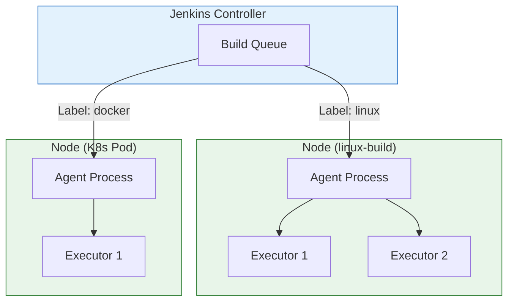
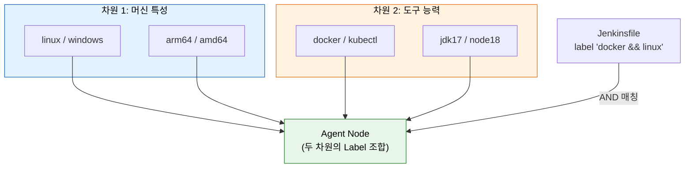
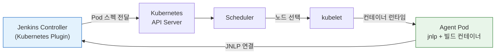

# Agent와 실행환경 설계

---

> 배포 자동화는 "어디서" 실행되느냐에 따라 품질이 달라집니다.

## §학습 목표

> 이 문서를 읽고 나면 Node / Agent / Executor 의 관계를 *설명* 할 수 있고, Label 을 머신 특성·도구 능력 두 차원으로 *설계* 할 수 있으며, 정적 Agent 와 동적 Agent(K8s Pod) 의 트레이드오프를 *비교* 하고 실행환경 설계 3원칙(도구 분리·버전 고정·레지스트리 관리) 을 *적용* 할 수 있습니다.

## §사전 지식

> 본 문서는 "워커 노드와 실행 슬롯", "태그 기반 작업 라우팅", "정적 풀 vs 동적 프로비저닝", "실행 환경의 코드화" 같은 일반 분산 빌드 개념을 Jenkins 의 Node·Agent·Executor·Label·Pod Template 단위로 좁혀 본 것입니다.

## 1. Node, Agent, Executor 관계

> 본 절은 세 개념의 *포함 관계* 를 정리합니다. Node = 머신, Agent = 그 위 작업 프로세스, Executor = 동시 처리 슬롯 수입니다.

> Jenkins에서 Node는 빌드를 실행할 수 있는 머신 단위이고, Agent는 그 Node에서 실제 작업을 받아 처리하는 프로세스입니다. Executor는 Agent가 동시에 처리할 수 있는 작업 슬롯 수를 결정합니다.

- Controller 자체도 Node이지만, 실제 빌드 작업은 별도 Agent Node에서 수행하는 것이 원칙입니다.
- Controller에서 빌드를 직접 실행하면 파이프라인 수가 늘어날수록 Controller의 부하가 증가하고, 장애 발생 시 파이프라인 히스토리까지 영향을 받습니다.
- 하나의 Node에 여러 Executor를 설정할 수 있고, Executor 수만큼 파이프라인이 동시에 실행됩니다.
- Executor 수를 Node의 CPU 코어 수와 1:1로 맞추는 것이 일반적입니다. 빌드 작업이 I/O 중심이라면 코어 수의 1.5~2배까지 늘려도 됩니다.

```
Jenkins Controller
├── Node: agent-01 (Executor: 2)
│   ├── Executor #1 — pipeline-A 실행 중
│   └── Executor #2 — 대기 중
└── Node: agent-02 (Executor: 4)
    ├── Executor #1 — pipeline-B 실행 중
    ├── Executor #2 — pipeline-C 실행 중
    └── Executor #3, #4 — 대기 중
```



## 2. Label 전략

> 본 절은 Label 이 *자동 감지가 아니라 관리자의 선언* 이라는 점과, 머신 특성·도구 능력 두 차원 설계를 다룹니다. Label 은 검증되지 않는 *약속* 입니다.

> Label은 파이프라인이 특정 Node를 선택할 때 사용하는 태그입니다. 머신 특성과 도구 능력이라는 두 가지 차원으로 설계하면 관리가 쉬워집니다.

### Label은 자동 감지되는가?

**아닙니다. Label은 관리자가 직접 등록해야 합니다.** Controller가 Agent의 OS나 설치된 도구를 자동으로 감지하여 Label을 붙여주지 않습니다.

- **정적 Agent (VM/서버)**: Manage Jenkins > Nodes > 해당 노드 설정에서 Labels 필드에 직접 입력합니다. 예: `linux docker jdk17`
- **동적 Agent (K8s Pod)**: Kubernetes Plugin 설정에서 Pod Template의 `label` 필드에 지정합니다. 이 label이 Jenkinsfile의 `agent { label '...' }`과 매칭되는 기준입니다. Pod Template을 등록하는 방법은 두 가지입니다.

**방법 1: Jenkins UI에서 Pod Template 등록**

Manage Jenkins > Clouds > Kubernetes > Pod Templates에서 설정합니다:

| 필드 | 값 | 설명 |
|------|---|------|
| Name | `maven-builder` | 템플릿 식별 이름 |
| Labels | `maven linux` | **이 값이 agent { label }과 매칭됨** |
| Containers > Name | `maven` | `container('maven')`으로 선택할 이름 |
| Containers > Docker image | `maven:3.9-eclipse-temurin-17` | 빌드 도구 이미지 |

**방법 2: JCasC로 Pod Template 코드화**

```yaml
# JCasC — Kubernetes Pod Template + Label 설정
jenkins:
  clouds:
    - kubernetes:
        name: "k8s"
        jenkinsUrl: "http://jenkins:8080"
        namespace: "jenkins"
        templates:
          - name: "maven-builder"
            label: "maven linux"          # ← 이 label이 agent { label }의 매칭 기준
            nodeUsageMode: NORMAL
            containers:
              - name: "maven"
                image: "maven:3.9-eclipse-temurin-17"
                command: "sleep"
                args: "infinity"
              - name: "docker"
                image: "docker:24-dind"
                privileged: true
            volumes:
              - persistentVolumeClaim:
                  claimName: "maven-cache-pvc"
                  mountPath: "/root/.m2"
```

이 설정이 있으면 Jenkinsfile에서 다음과 같이 사용합니다:

```groovy
// Pod Template의 label "maven linux"과 매칭
pipeline {
    agent { label 'maven && linux' }
    stages {
        stage('Build') {
            steps {
                container('maven') {
                    sh 'mvn clean package'
                }
            }
        }
    }
}
```

- Jenkinsfile의 `agent { label 'maven && linux' }`가 Pod Template의 `label: "maven linux"`와 매칭됩니다.
- 매칭되면 Kubernetes Plugin이 해당 Template으로 Pod를 생성하고, 빌드가 끝나면 삭제합니다.
- Pod Template에 docker 컨테이너가 들어있어도 label에 `docker`를 명시하지 않으면 `agent { label 'docker' }` 파이프라인은 이 Template을 찾지 못합니다.

반면 `agent { kubernetes { yaml '...' } }`처럼 **Jenkinsfile에 직접 Pod YAML을 인라인**하는 방식도 있습니다. 이 경우 Pod Template 등록 없이 파이프라인 자체에서 Pod 스펙을 정의하므로 label 매칭이 필요 없습니다. 두 방식의 차이는 다음과 같습니다:

| 방식 | Pod 스펙 위치 | Label 매칭 | 적합한 경우 |
|------|-------------|-----------|-----------|
| Pod Template + `agent { label }` | Jenkins 설정 (중앙 관리) | 필요 | 여러 파이프라인이 같은 환경을 공유할 때 |
| `agent { kubernetes { yaml } }` | Jenkinsfile (인라인) | 불필요 | 특정 파이프라인만의 고유한 환경일 때 |

- **JCasC (정적 Agent용)**: `jenkins.yaml`의 `nodes` 섹션에 Label을 코드로 관리할 수 있습니다.

```yaml
# JCasC — 정적 Agent Label 설정
jenkins:
  nodes:
    - permanent:
        name: "linux-build-01"
        labelString: "linux docker jdk17"
        numExecutors: 2
        remoteFS: "/home/jenkins"
```

이것이 의미하는 바는 다음과 같습니다:

- Agent에 docker가 설치되어 있어도 `docker` Label이 없으면 `agent { label 'docker' }` 파이프라인은 해당 Agent를 선택하지 않습니다.
- 반대로 docker가 없는 Agent에 `docker` Label을 잘못 붙이면 빌드가 "docker: command not found"로 실패합니다.
- Label은 **약속**입니다. "이 Agent에는 이 도구가 있다"는 관리자의 선언이며, Jenkins는 그 선언을 신뢰할 뿐 검증하지 않습니다.

### Label 설계 두 차원 한눈에

> Label 을 *머신 특성* 과 *도구 능력* 두 축으로 나누면 조합과 관리가 단순해집니다.



> 파란색(머신 특성) 은 *바꿀 수 없는 속성* (OS·아키텍처), 주황색(도구 능력) 은 *설치로 부여하는 속성* 입니다. 두 차원을 섞어 `docker && linux` 처럼 AND 조합하면 *정확한 환경* 을 고를 수 있습니다. 너무 세분하면 병목, 너무 넓으면 빌드 실패 — 팀 도구 조합 기준 2~3세트가 관리 적정선입니다.

- `agent { label 'docker' }`처럼 선언하면 `docker` 레이블이 붙은 Node에서만 해당 스텝이 실행됩니다.
- Node에는 여러 레이블을 붙일 수 있고, 파이프라인에서 `label 'docker && linux'`처럼 AND 조건으로 조합할 수 있습니다.
- 레이블 설계는 두 가지 차원으로 나눕니다.
  - **머신 특성**: 운영체제와 아키텍처(`linux`, `windows`, `arm64`)처럼 머신 자체의 속성을 표현
  - **도구 능력**: 설치된 도구(`docker`, `kubectl`, `helm`, `jdk17`)처럼 실행 환경이 제공하는 기능을 표현
- 레이블을 너무 세밀하게 나누면 특정 Node에만 작업이 몰려 병목이 생깁니다. 반대로 너무 넓게 잡으면 필요한 도구가 없는 Node에 작업이 할당되어 빌드가 실패합니다.
- 팀에서 자주 쓰는 도구 조합을 기준으로 레이블 세트를 2~3가지로 정리하는 편이 관리하기 쉽습니다.

```groovy
// 특정 레이블 조건으로 Agent 선택
pipeline {
    agent { label 'docker && linux' }
    stages {
        stage('Build') {
            steps {
                sh 'docker build -t myapp .'
            }
        }
    }
}
```

## 3. 정적 Agent vs 동적 Agent

> 본 절은 두 Agent 모델의 *자원 효율·Cold Start* 트레이드오프를 다룹니다. 대규모 CI 의 표준은 K8s 동적 Agent 입니다.

> 정적 Agent는 단순하고 즉시 사용 가능하지만 자원을 항상 점유합니다. 동적 Agent는 초기 설정이 복잡하지만 자원 효율과 환경 재현성이 훨씬 높습니다.

| 항목 | 정적 Agent | 동적 Agent (Kubernetes) |
|------|-----------|------------------------|
| 초기 설정 | 간단 | 복잡 (K8s 클러스터 필요) |
| 자원 효율 | 낮음 (유휴 시 낭비) | 높음 (빌드 시만 사용) |
| 빌드 환경 관리 | 머신 직접 관리 | 이미지로 버전 관리 |
| Cold Start | 없음 | 있음 (Pod 생성 10~30초) |
| 확장성 | 수동 추가 | 자동 스케일 아웃 |

### 정적 Agent 등록 예시

정적 Agent는 Manage Jenkins > Nodes에서 등록하거나, JCasC로 코드화합니다:

```yaml
# JCasC — 정적 Agent 등록
jenkins:
  nodes:
    - permanent:
        name: "linux-build-01"
        labelString: "linux docker jdk17"
        numExecutors: 2
        remoteFS: "/home/jenkins"
        launcher:
          ssh:
            host: "192.168.1.100"
            # 왜 SYSTEM scope 키: 이 SSH 키는 파이프라인이 접근하면 안 되는 시스템 연결용
            credentialsId: "agent-ssh-key"
            port: 22
```

```groovy
// 정적 Agent를 사용하는 파이프라인
pipeline {
    agent { label 'linux && docker' }
    stages {
        stage('Build') {
            steps { sh 'docker build -t myapp .' }
        }
    }
}
```

- 정적 Agent는 항상 켜져 있으므로 Cold Start가 없습니다.
- 대신 빌드가 없을 때도 서버 비용이 발생하고, 도구 업데이트를 직접 관리해야 합니다.

### 동적 Agent (Kubernetes Pod) 예시

동적 Agent는 빌드마다 Pod를 생성하고, 빌드 종료 후 삭제합니다:

```groovy
// 동적 Agent — K8s Pod으로 빌드
pipeline {
    agent {
        kubernetes {
            yaml '''
            apiVersion: v1
            kind: Pod
            metadata:
              labels:
                jenkins: agent    # 선택사항 — K8s 리소스 필터링용 (kubectl -l), Jenkins Label과 무관
            spec:
              containers:
              - name: maven
                image: maven:3.9-eclipse-temurin-17
                command: ['sleep', 'infinity']
                volumeMounts:
                - name: maven-cache
                  mountPath: /root/.m2
              - name: docker
                image: docker:24-dind
                securityContext:
                  privileged: true
              volumes:
              - name: maven-cache
                persistentVolumeClaim:
                  claimName: maven-cache-pvc
            '''
        }
    }
    stages {
        stage('Build') {
            steps {
                container('maven') {  // 왜 container 지정: Pod 안 여러 컨테이너 중 maven 선택
                    sh 'mvn clean package -DskipTests'
                }
            }
        }
        stage('Docker Build') {
            steps {
                container('docker') {
                    sh 'docker build -t myapp:${BUILD_NUMBER} .'
                }
            }
        }
    }
}
```

- `container('maven')`: Pod 안의 `maven` 컨테이너에서 명령을 실행합니다. "Jenkins에 설치된 도구"가 아니라 "Pod에 선언된 컨테이너"를 선택하는 것입니다.
- `maven-cache` PVC: Maven 의존성을 영속 볼륨에 캐시하여 매 빌드마다 다운로드를 방지합니다.
- `jnlp` 컨테이너는 명시하지 않아도 Kubernetes Plugin이 자동으로 추가합니다. 이 컨테이너가 Controller와 통신을 담당합니다.

### Pod 생성 흐름

동적 Agent의 Pod 생성 흐름은 다음과 같습니다.



- 동적 Agent의 Cold Start는 이미지를 미리 Node에 pull해두거나, 자주 쓰는 이미지를 DaemonSet으로 워밍업하면 10초 내외로 줄일 수 있습니다.
- 빌드가 평균 5분 이상이라면 Cold Start 비용은 전체의 3% 미만이어서 실용적으로 무시할 수 있는 수준입니다.
- Pod 안의 `jnlp` 컨테이너가 Jenkins Controller에 연결되면 그때부터 해당 Pod가 Jenkins Agent로 등록됩니다.
- `container('maven')`, `container('kaniko')` 같은 Jenkinsfile 지시어는 "Jenkins에 설치된 도구 호출"이 아니라 "Pod 안에 선언된 컨테이너 선택"이라는 점을 기억해야 합니다.

```
Jenkins Controller
    └─ Kubernetes Plugin ──▶ Kubernetes API
                                └─ Scheduler ──▶ kubelet ──▶ containerd
                                                                └─ Agent Pod
                                                                    ├─ jnlp (Jenkins 연결)
                                                                    ├─ maven (빌드)
                                                                    └─ kaniko (이미지 빌드)
```

## 4. 실행환경 설계 원칙

> 본 절은 Agent 를 *서버가 아니라 실행 환경* 으로 보는 관점에서 3원칙(도구 분리·버전 고정·레지스트리 관리) 을 다룹니다. 셋이 갖춰지면 빌드가 머신 상태에 의존하지 않습니다.

> Agent는 단순한 서버가 아니라 실행 환경입니다. 어떤 도구를 어느 이미지에 두느냐를 의도적으로 설계해야 파이프라인이 예상대로 동작합니다.

실행환경 설계의 핵심 원칙은 세 가지입니다.

- **도구 분리**: 빌드 도구는 Agent 이미지에, 배포 도구는 별도 이미지에 분리합니다. Maven으로 빌드하는 스테이지와 kubectl로 배포하는 스테이지가 같은 이미지를 사용할 필요는 없습니다. 분리하면 각 이미지를 독립적으로 업데이트할 수 있고, 이미지 크기도 줄어듭니다.
- **버전 고정**: 이미지 태그를 `latest`로 고정하지 않습니다. `maven:3.9-eclipse-temurin-17`처럼 구체적인 버전을 명시해야 빌드 재현성이 보장됩니다. CI 파이프라인에서 환경이 날짜에 따라 달라지는 상황은 가장 디버깅하기 어려운 장애 유형입니다.
- **레지스트리 관리**: Agent 이미지는 별도 레지스트리에 버전 관리합니다. 팀이 공유하는 `ci-base:1.2.0` 이미지를 레지스트리에 올려두고 Jenkinsfile에서 참조하는 방식이 가장 안전합니다. 이 이미지 자체도 별도 파이프라인으로 빌드하고 스캔해야 합니다.

```groovy
pipeline {
    agent none
    stages {
        stage('Build & Test') {
            // 빌드 도구가 있는 이미지
            agent { docker { image 'maven:3.9-eclipse-temurin-17' } }
            steps {
                sh 'mvn -B clean package'
            }
        }
        stage('Deploy') {
            // 배포 도구가 있는 이미지 — 빌드 이미지와 분리 (도구 분리 원칙)
            agent { docker { image 'bitnami/kubectl:1.29' } }
            steps {
                sh 'kubectl apply -f k8s/'
            }
        }
    }
}
```

실행환경을 이렇게 설계하면 파이프라인이 특정 머신 상태에 의존하지 않게 됩니다. 어떤 Node에서 실행하든, 언제 실행하든 동일한 결과를 기대할 수 있습니다.

---

## §면접 질문

> 자기 답을 떠올린 뒤 `§정답` 절을 펼쳐 비교합니다.

1. Node / Agent / Executor 의 포함 관계를 한 문장으로 설명할 수 있습니까? Executor 수를 *CPU 코어 수 기준* 으로 잡되 I/O 중심 빌드면 늘리는 이유는 무엇입니까?
2. Label 이 *자동 감지가 아니라 관리자의 약속* 이라는 사실이 만드는 *대표적 사고* 는 무엇입니까?
3. `agent { label }` + Pod Template 방식과 `agent { kubernetes { yaml } }` 인라인 방식은 *언제 각각* 을 선택합니까?
4. 동적 Agent 의 Cold Start 가 *실용적으로 무시 가능한* 조건은 무엇이며, 줄이는 방법 두 가지는 무엇입니까?

## §정답

### Q1 정답

*Node 는 빌드를 실행할 수 있는 머신, Agent 는 그 Node 에서 작업을 받아 처리하는 프로세스, Executor 는 Agent 가 동시에 처리할 수 있는 작업 슬롯 수* 입니다 (Node ⊇ Agent ⊇ Executor). Executor 수를 CPU 코어 수 기준으로 잡는 이유는 *CPU 집약 빌드가 코어 수를 넘으면 컨텍스트 스위칭 비용으로 전체 처리량이 줄기* 때문입니다. I/O 중심 빌드(네트워크 다운로드·디스크 대기 많음) 는 CPU 가 노는 시간이 많아 *코어 수의 1.5~2배* 까지 올려도 처리량이 늘어납니다.

### Q2 정답

*Label 과 실제 도구 설치 상태의 불일치* 사고입니다. Jenkins 는 Label 을 *검증하지 않고 신뢰* 하므로 — (a) docker 가 *설치된* Agent 에 `docker` Label 을 *안 붙이면* `agent { label 'docker' }` 가 그 Agent 를 영영 못 골라 빌드가 큐에서 무한 대기, (b) docker 가 *없는* Agent 에 `docker` Label 을 *잘못 붙이면* 빌드가 `docker: command not found` 로 실패합니다. Label 은 "이 Agent 엔 이 도구가 있다" 는 관리자의 *약속* 이고, 약속이 실제와 어긋나면 사고가 납니다.

### Q3 정답

선택 기준은 *환경 공유 여부* 입니다. (a) **Pod Template + `agent { label }`** — *여러 파이프라인이 같은 빌드 환경을 공유* 할 때. Pod 스펙이 Jenkins 설정에 중앙 관리되어 한 곳 수정이 모든 파이프라인에 반영. (b) **`agent { kubernetes { yaml } }` 인라인** — *특정 파이프라인만의 고유한 환경* 일 때. Pod 스펙이 Jenkinsfile 안에 있어 *파이프라인 코드와 함께 버전 관리* 되고 Label 매칭이 불필요. 공통 환경은 Template, 일회성/특수 환경은 인라인입니다.

### Q4 정답

*빌드 평균 시간이 5분 이상* 이면 Cold Start(Pod 생성 10~30초) 가 전체의 3% 미만이라 무시 가능합니다. 줄이는 방법은 (a) **이미지 사전 pull** — 자주 쓰는 Agent 이미지를 노드에 미리 받아두면(`imagePullPolicy: IfNotPresent` + 사전 배포) pull 시간 제거, (b) **DaemonSet 워밍업** — 모든 노드에 이미지를 미리 깔아두는 워머를 돌려 *어느 노드에 스케줄돼도* 즉시 시작. 둘 다 *이미지가 노드에 도달하는 시간* 을 0 에 가깝게 만들어 Cold Start 를 10초 내외로 줄입니다.
