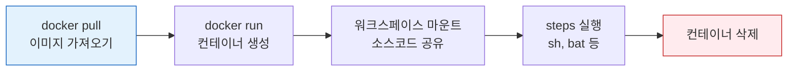

# Docker with Pipeline
---
> Docker로 빌드 환경을 격리하면 환경 일관성, 격리, 재현성 세 가지를 한 번에 얻는다.


## 1. agent { docker } 패턴

> 호스트 머신에 직접 설치된 도구에 의존하는 전통적인 방식은 환경 불일치 문제를 피할 수 없다. `agent { docker }` 패턴은 이미지 버전을 고정해 언제 어디서 실행하든 동일한 빌드 환경을 보장한다.

"내 로컬에서는 되는데요"의 근본 원인은 호스트 도구 버전 차이다(개발자 로컬 Node 18, Agent Node 16). `node:18.17.0-alpine`처럼 이미지를 명시하면 어디서 실행하든 동일한 빌드 환경이 보장된다. 파이프라인이 시작되면 Jenkins가 해당 이미지로 컨테이너를 생성하고 워크스페이스를 마운트한 뒤 스텝을 실행한 다음, 빌드가 끝나면 컨테이너를 삭제한다.



```groovy
pipeline {
    agent {
        docker {
            image 'node:18-alpine'
            args '-v $HOME/.npm:/root/.npm'  // 호스트 npm 캐시 마운트
        }
    }
    stages {
        stage('Install') { steps { sh 'npm ci' } }
        stage('Test')    { steps { sh 'npm test' } }
        stage('Build')   { steps { sh 'npm run build' } }
    }
}
```

- `args`에 `-v`로 호스트 디렉토리를 마운트하면 컨테이너 간 캐시를 공유할 수 있다. npm의 경우 `~/.npm` 캐시를 공유하면 `npm ci` 속도가 크게 향상된다.


## 2. 스테이지별 이미지 분리

> 파이프라인 레벨에서 `agent none`을 선언하면 스테이지마다 다른 이미지를 사용할 수 있다. 각 스테이지는 독립된 컨테이너에서 실행되므로 도구 간 충돌이 발생하지 않는다.

- 빌드는 Node.js 이미지로, 배포는 AWS CLI 이미지로 실행하는 패턴이 대표적이다.
- 스테이지 간 파일을 전달할 때는 `stash`/`unstash`를 사용한다. 컨테이너가 스테이지마다 새로 생성되므로 이전 스테이지의 워크스페이스 내용이 자동으로 유지되지 않는다는 점에 주의해야 한다.

```groovy
pipeline {
    agent none
    stages {
        stage('Build') {
            agent { docker { image 'node:18-alpine' } }
            steps {
                sh 'npm ci && npm run build'
                stash includes: 'dist/**', name: 'build-output'
            }
        }
        stage('Deploy') {
            agent { docker { image 'amazon/aws-cli:2.13.0' } }
            steps {
                unstash 'build-output'
                sh 'aws s3 sync ./dist s3://my-bucket'
            }
        }
    }
}
```


## 3. 캐시 마운트와 격리

> Docker Agent의 격리성은 장점이지만, 매 빌드마다 의존성을 새로 다운로드하면 빌드 시간이 길어진다. 핵심은 격리는 유지하면서 캐시만 호스트와 공유하는 것이다.

- `-v` 마운트로 캐시 디렉토리만 공유하면 컨테이너 격리를 해치지 않고도 빌드 속도를 유지할 수 있다.
- 언어별로 자주 쓰는 캐시 마운트 패턴은 다음과 같다.
  - `-v $HOME/.npm:/root/.npm` — npm 패키지 캐시
  - `-v $HOME/.m2:/root/.m2` — Maven 로컬 저장소
  - `-v $HOME/.gradle:/root/.gradle` — Gradle 캐시
  - `-v $HOME/go/pkg:/go/pkg` — Go 모듈 캐시
- 캐시 디렉토리는 Jenkins Agent Node의 홈 디렉토리 기준이다.
- 동적 Agent(Kubernetes Pod)에서는 호스트 경로가 매번 다를 수 있으므로, PVC(PersistentVolumeClaim)를 사용하거나 원격 캐시 서버를 별도로 구성해야 한다.


## 4. Registry 인증

> 파이프라인 코드에 비밀번호를 직접 넣는 것은 보안 사고의 직접적인 원인이 된다. Jenkins Credentials에 등록하고 `docker.withRegistry()`로 참조하는 것이 올바른 방법이다.

- `docker.withRegistry()`는 블록 진입 시 `docker login`을, 블록 종료 시 `docker logout`을 자동으로 수행한다.
- Credential이 파이프라인 로그에 노출되지 않으며, Jenkins의 중앙 집중식 Credential 관리를 활용할 수 있다.

```groovy
pipeline {
    agent any
    environment {
        REGISTRY  = 'registry.example.com'
        IMAGE_TAG = "${env.BUILD_NUMBER}-${sh(script: 'git rev-parse --short HEAD', returnStdout: true).trim()}"
    }
    stages {
        stage('Build & Push') {
            steps {
                script {
                    docker.withRegistry("https://${REGISTRY}", 'registry-credentials') {
                        def image = docker.build("${REGISTRY}/myapp:${IMAGE_TAG}")
                        image.push()
                        image.push('latest')
                    }
                }
            }
        }
    }
    post {
        always {
            sh "docker rmi ${REGISTRY}/myapp:${IMAGE_TAG} || true"
        }
    }
}
```

주요 레지스트리별 인증 방식은 다음과 같다.

- **Docker Hub**: Jenkins의 `Username/Password` Credential 사용
- **Harbor**: 마찬가지로 `Username/Password` Credential 사용
- **AWS ECR**: Amazon ECR 플러그인 + `ecr:<region>:<credential-id>` 형식

```groovy
// AWS ECR 인증 예시
stage('Push to ECR') {
    steps {
        script {
            docker.withRegistry(
                "https://123456789.dkr.ecr.ap-northeast-2.amazonaws.com"
                , 'ecr:ap-northeast-2:aws-credentials'
            ) {
                docker.image('myapp').push("${env.BUILD_NUMBER}")
            }
        }
    }
}
```

- **GCP Artifact Registry**: GCP 서비스 계정 키 또는 Workload Identity 사용
- 클라우드 레지스트리라면 정적 비밀번호보다 IAM 기반 인증을 우선 검토하는 것이 좋다. 비밀번호 로테이션 없이 인증을 관리할 수 있고, 권한 범위를 더 세밀하게 제어할 수 있기 때문이다.


## 5. 이미지 태깅 전략

> 이미지 태그는 배포 추적성과 롤백 가능성을 결정한다. `latest` 태그는 어떤 커밋의 이미지인지 알 수 없고, 노드마다 다른 버전이 실행될 수 있어 프로덕션에서 사용하면 안 된다.

- 여러 브랜치에서 동시에 빌드가 발생하면 어떤 것이 `latest`인지 불확실해진다.
- Kubernetes에서 `imagePullPolicy: IfNotPresent`인 상황이라면 노드마다 다른 버전의 `latest`가 실행될 수 있다.
| 전략 | 예시 | 장점 | 단점 |
|------|------|------|------|
| `latest` | `myapp:latest` | 간편 | 버전 추적 불가, 롤백 불가 |
| 빌드 번호 | `myapp:142` | 빌드 추적 가능 | 코드 버전과 직접 연결 안 됨 |
| Git SHA | `myapp:a1b2c3d` | 정확한 코드 버전 | 사람이 읽기 어려움 |
| SemVer | `myapp:2.1.0` | 의미적 버전 관리 | 수동 버전 관리 필요 |
| 복합 | `myapp:142-a1b2c3d` | 추적성 + 식별 | 태그가 길어짐 |

프로덕션에서는 **복합 태그**(`myapp:{BUILD_NUMBER}-{git_sha}`)가 가장 실용적이다. 빌드 순서와 커밋을 동시에 식별할 수 있고, 두 정보 중 하나가 빠졌을 때 생기는 장단점을 모두 보완한다.
