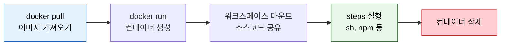
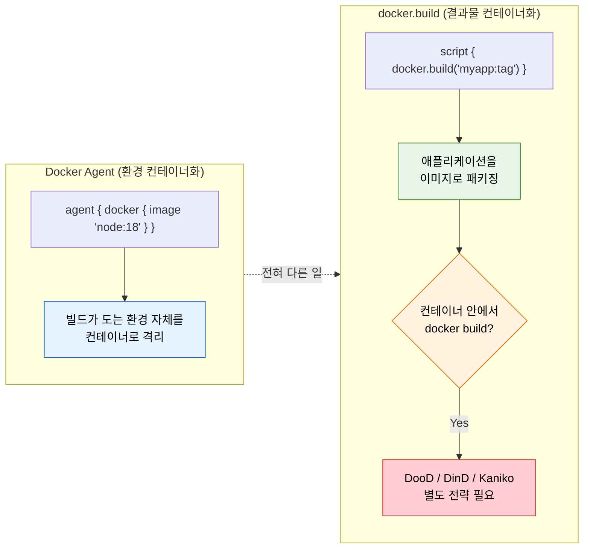

# Docker with Pipeline

---

> Jenkins Pipeline에서 Docker를 활용하는 두 가지 방법과 각각의 적합한 상황을 다룹니다.

## §학습 목표

> 이 문서를 읽고 나면 *Docker Agent (빌드 환경 컨테이너화)* 와 *`docker.build` (결과물 컨테이너화)* 의 차이를 *구분* 할 수 있고, 컨테이너 안에서 이미지를 빌드하는 세 방법(DooD / DinD / Kaniko) 의 보안·속도 트레이드오프를 *비교* 할 수 있으며, `latest` 대신 *추적 가능한 태깅 전략* 을 *선택* 할 수 있습니다.

## §사전 지식

> 본 문서는 "빌드 환경 격리", "컨테이너 안에서 컨테이너 빌드", "sidecar 로 의존 서비스 띄우기", "이미지 태그 추적성" 같은 일반 컨테이너 개념을 Jenkins 의 `agent { docker }`·`docker.build`·`docker.withRun` 단위로 좁혀 본 것입니다.

## 1. Docker Agent — 빌드 환경의 컨테이너화

> 본 절의 결론은 *Docker Agent 는 빌드 환경을 이미지로 고정해 "내 머신에서는 됐는데" 를 없앤다* 입니다. Agent 에 도구를 설치하는 대신 이미지로 버전을 박습니다.

빌드 환경을 컨테이너로 격리하는 것이 Docker Agent의 핵심입니다. 같은 Jenkins Agent에서 여러 프로젝트를 빌드할 때, 프로젝트마다 다른 JDK, Node.js, Python 버전이 필요하면 충돌이 발생합니다. Docker Agent는 각 빌드를 독립된 컨테이너에서 실행해 이 문제를 해결합니다.

```groovy
pipeline {
    agent {
        // 왜 image 고정: 호스트 Node 버전과 무관하게 항상 node:18 환경에서 빌드 (재현성)
        docker { image 'node:18-alpine' }
    }
    stages {
        stage('Build') {
            steps {
                sh 'node --version'  // v18.x.x — 호스트 Node 버전과 무관
                sh 'npm ci'
                sh 'npm run build'
            }
        }
    }
}
```

- 위 파이프라인은 호스트에 어떤 Node.js 버전이 깔려 있든 항상 `node:18-alpine` 컨테이너 안에서 빌드합니다.
- `agent` 레벨에 `docker`를 선언하면 해당 stage 또는 pipeline 전체가 그 컨테이너 안에서 실행됩니다.

Docker Agent를 사용하면 세 가지 이점이 있습니다:

- **환경 일관성**: 모든 빌드가 동일한 이미지에서 실행되므로 "Agent마다 다른 결과"가 사라집니다.
- **버전 격리**: 프로젝트 A는 Node 18, 프로젝트 B는 Node 20을 쓰더라도 서로 영향을 주지 않습니다.
- **깨끗한 빌드**: 매 빌드가 새 컨테이너에서 시작하므로 이전 빌드의 잔여물이 남지 않습니다.

Docker Agent 가 한 스테이지를 실행하는 내부 흐름은 *pull → run → 마운트 → steps → 삭제* 입니다.

> 컨테이너가 *빌드 시작에 생성되고 종료에 삭제* 되는 수명이 깨끗한 빌드를 보장합니다.



> 파란색(pull) 에서 시작해 빨간색(삭제) 으로 끝나는 수명이 매 빌드마다 반복됩니다. 워크스페이스만 호스트와 공유되고 *컨테이너 자체는 남지 않으므로* 이전 빌드의 잔여물이 다음 빌드로 새지 않습니다.

### Docker Agent vs docker.build — 두 컨테이너화의 분리

> 가장 흔한 혼동입니다. *환경을 컨테이너로* 와 *결과물을 컨테이너로* 는 다른 일이고, 후자를 하려면 별도 빌드 전략이 추가로 필요합니다.



> 파란색(Docker Agent) 은 *빌드가 실행되는 환경* 을 컨테이너로 만드는 일, 초록색(docker.build) 은 *애플리케이션 결과물* 을 이미지로 만드는 일입니다. 빨간색이 함정 — *Docker Agent 안에서 `docker build` 를 돌리려면* daemon 이 없으므로 DooD/DinD/Kaniko 중 하나를 별도로 골라야 합니다.


## 2. 호스트 Docker vs DinD vs Kaniko

> 본 절은 컨테이너 안 이미지 빌드 3방법의 *보안·속도 트레이드오프* 를 다룹니다. K8s 보안 정책 환경에서는 daemon-free 인 Kaniko 계열이 표준입니다.

Docker Agent 안에서 `docker build`를 실행하려면 별도 전략이 필요합니다. 컨테이너 안에는 기본적으로 Docker daemon이 없기 때문입니다. 세 가지 접근이 있습니다:

| 방법 | 동작 | 보안 | 속도 |
|------|------|------|------|
| 호스트 Docker (DooD) | 호스트의 `/var/run/docker.sock` 마운트 | 위험 (호스트 root 접근) | 빠름 |
| DinD (Docker-in-Docker) | 컨테이너 안에서 별도 daemon 실행 | 위험 (`--privileged` 필요) | 느림 (캐시 격리) |
| Kaniko | daemon 없이 사용자 공간에서 빌드 | 안전 (권한 불필요) | 중간 |

각 방법의 선택 기준은 다음과 같습니다:

- **호스트 Docker(DooD)**: 가장 간단하지만 빌드 컨테이너가 호스트의 Docker 전체를 제어할 수 있어 위험합니다. 신뢰할 수 있는 내부 빌드에만 씁니다.
- **DinD**: 격리는 되지만 `--privileged`가 필요하고 레이어 캐시가 매번 초기화돼 느립니다.
- **Kaniko**: Kubernetes 환경에서 권장됩니다. daemon이 필요 없어 보안 정책을 지키면서 이미지를 빌드할 수 있습니다.

> Kaniko는 2026-06부로 archive(유지보수 중단) 상태입니다. 신규 프로젝트는 `01-04.빌드 도구 비교와 선택` 의 결정 트리를 먼저 확인합니다.


## 3. Docker 이미지 빌드와 레지스트리 푸시

> 본 절은 `docker.build` + `docker.withRegistry` 조합의 *표준 빌드·푸시 흐름* 과 인증 처리를 다룹니다.

Jenkins Pipeline에서 Docker 이미지를 빌드하고 레지스트리에 푸시하는 표준 흐름입니다. `docker.build`와 `docker.withRegistry`를 조합합니다.

```groovy
pipeline {
    agent any
    environment {
        IMAGE_NAME = 'myapp'
        REGISTRY = 'registry.example.com'
    }
    stages {
        stage('Build & Push') {
            steps {
                script {
                    def image = docker.build("${REGISTRY}/${IMAGE_NAME}:${BUILD_NUMBER}")
                    // 왜 withRegistry: 인증을 블록 스코프로 한정해 자격증명이 블록 밖으로 새지 않게
                    docker.withRegistry("https://${REGISTRY}", 'registry-credentials') {
                        image.push()
                        image.push('latest')
                    }
                }
            }
        }
    }
}
```

- `docker.build`는 Dockerfile을 기반으로 이미지를 생성합니다.
- `docker.withRegistry`는 레지스트리 인증을 처리하고, 블록 안에서 `push`를 호출합니다.
- `registry-credentials`는 Jenkins Credentials에 등록한 레지스트리 인증 정보의 ID입니다.


## 4. Pipeline에서 컨테이너 다루기

> 본 절은 `docker.image().withRun()` 의 *sidecar 패턴* — 통합 테스트용 DB 같은 의존 서비스를 *빌드 중에만* 띄우는 방법을 다룹니다.

통합 테스트에서 데이터베이스가 필요할 때, `docker.image().withRun()`으로 임시 컨테이너를 띄울 수 있습니다. 빌드가 끝나면 자동으로 정리됩니다.

```groovy
pipeline {
    agent any
    stages {
        stage('Integration Test') {
            steps {
                script {
                    docker.image('postgres:15').withRun('-e POSTGRES_PASSWORD=test') { c ->
                        // 왜 pg_isready 대기: DB 부팅 완료 전에 테스트가 붙으면 연결 실패로 깨짐
                        sh "while ! pg_isready -h localhost; do sleep 1; done"
                        sh './gradlew integrationTest'
                    }
                }
            }
        }
    }
}
```

- `withRun`은 블록이 시작될 때 컨테이너를 띄우고, 블록이 끝나면 자동으로 중지·삭제합니다.
- 통합 테스트에 필요한 PostgreSQL을 빌드 중에만 띄우고, 테스트가 끝나면 정리하는 패턴입니다.
- `pg_isready`로 DB가 준비될 때까지 대기한 후 테스트를 실행합니다.


## 5. 이미지 태깅 전략

> 본 절은 `latest` 의 *추적·롤백 불가* 문제와 *Git SHA / SemVer+SHA* 같은 추적 가능 태깅 전략을 다룹니다.

이미지 태그는 빌드를 추적하고 롤백할 수 있는 기준이 됩니다. `latest`만 쓰면 어떤 빌드가 배포됐는지 추적할 수 없습니다.

| 전략 | 예시 | 장점 | 단점 |
|------|------|------|------|
| latest | `myapp:latest` | 간단 | 추적 불가, 롤백 불가 |
| 빌드 번호 | `myapp:${BUILD_NUMBER}` | Jenkins 빌드와 1:1 매칭 | Jenkins 재구축 시 번호 리셋 |
| Git SHA | `myapp:a1b2c3d` | 커밋과 정확히 매칭 | 사람이 읽기 어려움 |
| SemVer + SHA | `myapp:2.1.0-a1b2c3d` | 의미 + 추적성 | 태깅 규칙 관리 필요 |

실무에서 권장하는 조합은 다음과 같습니다:

- **개발 빌드**: `${BRANCH_NAME}-${GIT_COMMIT[0..6]}` — 어느 브랜치의 어느 커밋인지 즉시 파악
- **릴리스 빌드**: SemVer(`2.1.0`) + `latest` 동시 태깅
- **롤백 대비**: 최소 직전 5개 버전의 이미지는 레지스트리에서 삭제하지 않습니다

`docker.build`로 빌드하고 여러 태그를 동시에 붙이는 예시입니다:

```groovy
script {
    // 왜 --short HEAD: 커밋과 1:1 추적되는 짧은 SHA 를 태그로 사용
    def commitHash = sh(script: 'git rev-parse --short HEAD', returnStdout: true).trim()
    def image = docker.build("myapp:${commitHash}")
    image.push()
    image.push("build-${BUILD_NUMBER}")
}
```

- 하나의 이미지에 여러 태그를 붙이면, 같은 이미지를 커밋 해시로도 빌드 번호로도 참조할 수 있습니다.
- Git SHA 태그는 정확한 추적용, 빌드 번호 태그는 Jenkins UI에서의 편의용입니다.


## 6. 정리

> 본 절의 핵심 한 줄은 *Docker Agent 는 "빌드 환경"을, docker.build 는 "결과물"을 컨테이너화한다* 이고, 둘을 혼동하지 않는 것이 이 문서의 가장 중요한 산출입니다.

이 둘을 혼동하지 않는 것이 핵심입니다. Docker Agent는 빌드가 실행되는 환경을 컨테이너로 격리하는 것이고, `docker.build`는 애플리케이션을 패키징한 이미지를 만드는 것입니다. 전자는 `agent { docker {...} }`로 선언하고, 후자는 `script` 블록 안에서 `docker.build()`로 호출합니다. K8s 환경에서는 Docker Agent 대신 Pod Template을 쓰고, 이미지 빌드는 Kaniko로 daemon 없이 처리하는 것이 표준 패턴입니다.

---

## 면접 질문

> 답을 떠올린 뒤 §정답 절에서 같은 번호로 대조하세요. 각 질문 뒤의 *심화*까지 답할 수 있으면 충분합니다.

1. *Docker Agent* 와 *`docker.build`* 가 서로 다른 일이라는 사실을 한 문장으로 설명할 수 있습니까? *(심화: Docker Agent 안에서 `docker build` 를 돌리려면 무엇이 추가로 필요합니까?)*
2. DooD 와 DinD 는 격리 방식이 다른데 *보안 위험 수준은 왜 둘 다 높음* 입니까?
3. `latest` 태그가 *Kubernetes 노드 캐시 불일치* 를 만드는 메커니즘을 `imagePullPolicy` 와 함께 설명할 수 있습니까?
4. `docker.image().withRun()` 의 sidecar 패턴에서 *`pg_isready` 대기 루프* 가 왜 필요합니까?

## 정답

> 위 질문을 스스로 설명해 본 뒤에 펼치세요.

### 정답 1 — Docker Agent vs docker.build 역할 분리

Docker Agent 는 *빌드가 실행되는 환경* 을 컨테이너로 격리하고, `docker.build` 는 *애플리케이션 결과물* 을 이미지로 패키징합니다 — 전혀 다른 일입니다. Docker Agent 안에서 `docker build` 를 돌리려면 *그 컨테이너 안에는 Docker daemon 이 없으므로* DooD(호스트 socket 마운트) / DinD(별도 daemon) / Kaniko(daemon-free) 중 하나를 *별도 전략으로* 추가해야 합니다. 둘을 혼동하면 "Docker Agent 를 썼는데 왜 docker build 가 안 되지" 라는 함정에 빠집니다.

### 정답 1 심화 — Kubernetes 환경에서의 표준 패턴

Kubernetes 환경에서는 `agent { docker }` 대신 `agent { kubernetes { ... } }` 로 Pod Template 을 선언합니다. Jenkins Kubernetes plugin(jenkins.io/doc/pipeline/steps/kubernetes)은 podTemplate 에 `"jnlp"` 이름의 컨테이너를 자동 생성해 Jenkins inbound agent 를 실행합니다. 기본 agent 이미지를 교체하려면 컨테이너 이름을 반드시 `"jnlp"` 로 선언해야 합니다. 이미지 빌드는 Kaniko 컨테이너를 sidecar 로 추가해 daemon 없이 처리합니다. Jenkins Declarative Pipeline 에서는 아래처럼 `defaultContainer` 를 지정합니다(출처: jenkins.io/doc/book/pipeline/syntax):

```groovy
agent {
    kubernetes {
        defaultContainer 'kaniko'
        yaml '''
apiVersion: v1
kind: Pod
spec:
  containers:
  - name: jnlp
    image: jenkins/inbound-agent:latest
  - name: kaniko
    image: gcr.io/kaniko-project/executor:latest
    command: [/busybox/cat]
    tty: true
'''
    }
}
```

### 정답 2 — DooD·DinD 보안 위험 수준이 동일한 이유

둘 다 *호스트 수준 권한으로 귀결* 되기 때문입니다. (a) **DinD** 는 컨테이너 안에서 별도 daemon 을 띄우는데 그러려면 `--privileged` 가 필수이고, privileged 컨테이너는 *호스트 커널에 거의 완전한 접근* 을 가져 컨테이너 탈출이 쉽습니다. (b) **DooD** 는 `--privileged` 는 안 쓰지만 `/var/run/docker.sock` 을 마운트하는 순간 *그 socket 으로 `docker run -v /:/host` 해서 호스트 root 쉘* 을 딸 수 있습니다. 격리 방식은 다르지만 *최종 도달 권한이 호스트 root* 라는 점이 같아 위험 등급이 동일합니다.

Kaniko 는 이 문제를 다른 방식으로 접근합니다. Docker daemon 없이 Dockerfile 로 이미지를 빌드하며, 동작 방식은 base 이미지 파일시스템을 추출한 뒤 Dockerfile 명령을 순차 실행하고, 각 명령 후 *userspace 에서 파일시스템 스냅샷*(체크섬 비교)을 찍어 변경분을 차등 tarball 레이어로 append 합니다. userspace 스냅샷이므로 storage driver 나 container runtime 에 의존하지 않아 privileged 권한이 불필요합니다(출처: github.com/GoogleContainerTools/kaniko).

### 정답 3 — latest 태그와 Kubernetes 노드 캐시 불일치

`latest` 는 *가변 태그* 인데 Kubernetes 기본 `imagePullPolicy: IfNotPresent` 는 *노드에 같은 태그 이미지가 이미 있으면 다시 pull 안 함* 입니다. 따라서 노드 A 는 어제 pull 한 `myapp:latest` (구버전) 를 그대로 쓰고, 노드 B 는 오늘 처음 pull 한 `myapp:latest` (신버전) 를 씁니다. 결과적으로 *같은 태그인데 노드마다 다른 이미지* 가 실행되어 일관성이 깨집니다. 불변 태그(Git SHA) 를 쓰면 *태그가 곧 콘텐츠* 라 이 불일치가 구조적으로 사라집니다.

Jenkins Kubernetes plugin 의 podTemplate 옵션 중 `alwaysPullImage: true` 를 설정하면 `latest` 태그 캐시를 매 빌드마다 갱신하도록 강제할 수 있습니다(출처: jenkins.io/doc/pipeline/steps/kubernetes). 그러나 pull 비용이 매번 발생하므로, 불변 태그를 쓰는 편이 성능과 추적성을 동시에 확보하는 방법입니다.

### 정답 4 — pg_isready 대기 루프가 필요한 이유

컨테이너가 *떴다* 는 것과 *DB 가 연결 받을 준비가 됐다* 는 것이 다르기 때문입니다. `docker.image().withRun()` 은 PostgreSQL 컨테이너를 *시작* 하지만, postgres 프로세스가 초기화·소켓 listen 까지 완료하는 데 수 초가 걸립니다. 이 대기 없이 바로 `./gradlew integrationTest` 를 돌리면 *DB 가 아직 연결을 안 받아* connection refused 로 테스트가 깨집니다. `while ! pg_isready; do sleep 1; done` 은 *DB 가 실제로 준비될 때까지* 폴링해 race condition 을 막는 게이트입니다.

## 관련 문서

> 이 편은 "Docker Agent(환경)와 docker.build(결과물)의 구분"과 "컨테이너 안 이미지 빌드 3방법 개요"를 다룹니다. DinD·DooD의 동작 메커니즘 정본과 빌드 도구 선택 기준은 아래 편들로 이어집니다.

  - [01-03. 컨테이너 이미지 빌드](01-03.컨테이너%20이미지%20빌드.md) — DinD/DooD 메커니즘 정본과 Kaniko 빌드 흐름 상세
  - [01-03a. VM Jenkins에서의 Docker 보안 모델](01-03a.VM%20Jenkins에서의%20Docker%20보안%20모델.md) — docker.sock 마운트의 호스트 권한 탈취 위험과 완화 전략
  - [01-04. 빌드 도구 비교와 선택](01-04.빌드%20도구%20비교와%20선택.md) — Kaniko·Buildah·BuildKit 비교 및 환경별 선택 결정 트리
