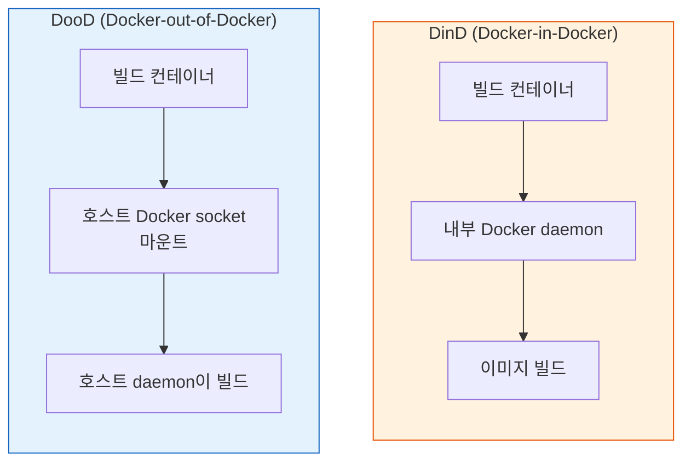
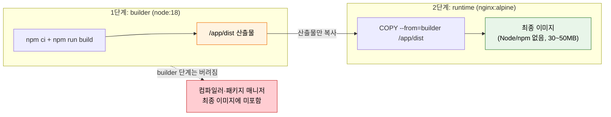

# 컨테이너 이미지 빌드

---

> 컨테이너 안에서 컨테이너를 빌드하는 것은 생각보다 까다롭습니다. DinD, DooD, Kaniko 세 가지 접근의 차이를 이해해야 합니다.

## §학습 목표

> 이 문서를 읽고 나면 DinD 와 DooD 의 *격리·보안·속도* 트레이드오프를 *비교* 할 수 있고, Kaniko 가 daemon 없이 안전하게 빌드하는 원리를 *설명* 할 수 있으며, Multi-stage 빌드와 레이어 캐싱으로 이미지 크기·빌드 속도를 *최적화* 할 수 있습니다.

## §사전 지식

> 본 문서는 "컨테이너 안에서 컨테이너 빌드", "daemon-free 빌드", "Multi-stage 분리", "레이어 캐시 순서 최적화" 같은 일반 컨테이너 개념을 Jenkins 의 DinD/DooD/Kaniko·Dockerfile 단위로 좁혀 본 것입니다.

## 1. DinD vs DooD

> 본 절은 컨테이너 안 이미지 빌드 두 방식의 트레이드오프를 다룹니다. DinD 는 격리되지만 무겁고, DooD 는 가볍지만 호스트와 강하게 결합됩니다 — *둘 다 보안 위험* 입니다.

> 컨테이너 안에서 이미지를 빌드하는 두 가지 방식입니다. DinD는 격리되지만 무겁고, DooD는 가볍지만 호스트와 강하게 결합됩니다.

컨테이너 안에서 Docker 이미지를 빌드해야 할 때 두 가지 방식이 있습니다. DinD(Docker-in-Docker)는 컨테이너 안에서 별도의 Docker daemon을 실행하는 방식입니다. DooD(Docker-out-of-Docker)는 호스트의 Docker daemon을 공유하는 방식입니다.



DinD와 DooD의 특성을 비교하면 다음과 같습니다:

| 항목 | DinD | DooD |
|------|------|------|
| Docker daemon | 컨테이너 내부에 별도 실행 | 호스트 daemon 공유 |
| 격리 수준 | 높음 (완전 격리) | 낮음 (호스트와 공유) |
| 권한 | `--privileged` 필수 | socket 마운트 필요 |
| 빌드 캐시 | 컨테이너 종료 시 소멸 | 호스트와 공유 (재사용 가능) |
| 보안 위험 | 컨테이너 탈출 가능성 | 호스트 root 접근과 동일 |
| 속도 | 느림 (캐시 격리) | 빠름 (캐시 공유) |

DinD는 `--privileged` 플래그가 필요합니다. 이 플래그는 컨테이너에 호스트의 모든 장치 접근 권한을 부여하므로, 컨테이너 탈출(container escape) 공격에 취약합니다. DooD는 호스트의 `/var/run/docker.sock`을 마운트하는데, 이 socket에 접근할 수 있다는 것은 호스트 Docker daemon을 완전히 제어할 수 있다는 의미입니다. 결국 두 방식 모두 보안 측면에서 위험합니다.

```groovy
// DinD 방식 — privileged 컨테이너 필요
pipeline {
    agent {
        kubernetes {
            yaml '''
            apiVersion: v1
            kind: Pod
            spec:
              containers:
              - name: docker
                image: docker:24-dind
                securityContext:
                  # 왜 위험: privileged 는 호스트 커널 접근을 열어 컨테이너 탈출 표면이 됨
                  privileged: true
            '''
        }
    }
    stages {
        stage('Build') {
            steps {
                container('docker') {
                    sh 'docker build -t myapp .'
                }
            }
        }
    }
}
```


## 2. Kaniko로 안전하게 빌드

> 본 절은 Kaniko 가 *daemon 없이 사용자 공간에서* 빌드해 privileged 없이 restricted 환경에서도 동작하는 원리를 다룹니다.

> Kaniko는 daemon 없이 사용자 공간에서 이미지를 빌드합니다. privileged 권한이 필요 없어 Kubernetes 환경에서 안전합니다.

Kaniko는 Google이 개발한 도구로, Docker daemon 없이 컨테이너 이미지를 빌드합니다. Dockerfile의 각 명령을 사용자 공간(user space)에서 실행하고, 파일시스템 변경사항을 레이어로 만듭니다. `--privileged`도, socket 마운트도 필요 없습니다.

```groovy
pipeline {
    agent {
        kubernetes {
            yaml '''
            apiVersion: v1
            kind: Pod
            spec:
              containers:
              - name: kaniko
                image: gcr.io/kaniko-project/executor:debug
                command: ['sleep', 'infinity']
            '''
        }
    }
    stages {
        stage('Build & Push') {
            steps {
                container('kaniko') {
                    sh '''
                        /kaniko/executor \
                          --context=`pwd` \
                          --dockerfile=Dockerfile \
                          --destination=registry.example.com/myapp:${BUILD_NUMBER}
                    '''
                }
            }
        }
    }
}
```

- Kaniko는 `--privileged` 없이 동작하므로 Kubernetes Pod Security Standards의 restricted 프로파일에서도 사용할 수 있습니다.
- 빌드 컨텍스트(`--context`)와 Dockerfile 경로(`--destination`)를 지정하면, 이미지를 빌드해 레지스트리에 바로 푸시합니다.
- archive 상태이지만 여전히 많은 환경에서 사용 중이므로 동작 원리를 이해해 두는 것이 좋습니다.


## 3. Multi-stage 빌드

> 본 절은 빌드 환경과 런타임 환경을 *한 Dockerfile 안에서 분리* 해 이미지 크기·공격 표면을 줄이는 기법을 다룹니다.

> Multi-stage 빌드는 빌드 환경과 런타임 환경을 분리해 최종 이미지 크기를 줄이고 보안을 강화합니다.

Multi-stage 빌드는 하나의 Dockerfile에서 여러 단계(stage)를 정의하고, 최종 이미지에는 필요한 것만 포함시키는 기법입니다. 빌드 도구는 빌드 단계에만 두고, 최종 이미지에는 실행에 필요한 산출물만 복사합니다.

```dockerfile
# 1단계: 빌드 환경
FROM node:18 AS builder
WORKDIR /app
# 왜 package*.json 먼저: 소스 변경 시에도 의존성 레이어 캐시 재사용 (§4 캐싱 원칙)
COPY package*.json ./
RUN npm ci
COPY . .
RUN npm run build

# 2단계: 런타임 환경
FROM nginx:alpine
# 왜 --from=builder: 빌드 산출물만 가져와 최종 이미지에서 Node/npm 제거 (크기·공격 표면 축소)
COPY --from=builder /app/dist /usr/share/nginx/html
EXPOSE 80
CMD ["nginx", "-g", "daemon off;"]
```

- 1단계 builder에서 Node.js로 빌드하고, 2단계에서 nginx 이미지에 빌드 산출물만 복사합니다.
- 최종 이미지에는 Node.js나 npm이 포함되지 않으므로 크기가 작고 공격 표면이 좁습니다.
- `COPY --from=builder`로 이전 단계의 산출물을 가져옵니다.

Multi-stage 빌드가 *두 단계를 거쳐 최종 이미지에 산출물만 남기는* 흐름은 다음과 같습니다.

> builder 단계의 도구는 *버려지고*, runtime 단계에는 *실행에 필요한 것만* 복사됩니다.



> 주황색(builder 산출물) 만 초록색(runtime) 으로 넘어가고, 빨간색(컴파일러·패키지 매니저) 은 최종 이미지에서 *사라집니다*. 이 분리가 크기(1GB+ → 30~50MB) 와 공격 표면을 동시에 줄입니다.

Multi-stage 빌드의 효과는 다음과 같습니다:

| 항목 | Single-stage | Multi-stage |
|------|--------------|-------------|
| 이미지 크기 | 1GB+ (빌드 도구 포함) | 30~50MB (런타임만) |
| 공격 표면 | 넓음 (컴파일러, 패키지 매니저) | 좁음 (런타임만) |
| 빌드 캐시 | 비효율 | 의존성 레이어 캐시 |
| CVE 노출 | 많음 | 적음 |

## 4. 빌드 최적화

> 본 절의 핵심 한 줄은 *자주 바뀌지 않는 것을 먼저, 자주 바뀌는 것을 나중에* 입니다. 레이어 캐시 적중률과 `.dockerignore` 가 빌드 속도를 좌우합니다.

> 레이어 캐싱과 .dockerignore로 빌드 속도를 높입니다. 자주 바뀌는 것을 나중에 두는 것이 핵심입니다.

Docker는 레이어 단위로 캐시합니다. Dockerfile의 명령 순서를 최적화하면 캐시 적중률을 높여 빌드 속도를 크게 개선할 수 있습니다. 핵심 원칙은 자주 바뀌지 않는 것을 먼저, 자주 바뀌는 것을 나중에 배치하는 것입니다.

```dockerfile
# 나쁜 예 — 소스 변경 시 의존성도 다시 설치
FROM node:18
WORKDIR /app
COPY . .
RUN npm ci

# 좋은 예 — 의존성 레이어 캐시 활용
# 왜: package*.json 만 먼저 복사하면 소스만 바뀌어도 npm ci 레이어가 캐시됨
FROM node:18
WORKDIR /app
COPY package*.json ./
RUN npm ci
COPY . .
```

- `package*.json`만 먼저 복사하고 `npm ci`를 실행하면, 소스 코드만 바뀌었을 때 의존성 설치 레이어는 캐시를 재사용합니다.
- 소스를 먼저 복사하면 코드 한 줄만 바뀌어도 `npm ci`가 매번 다시 실행됩니다.

`.dockerignore`로 불필요한 파일을 빌드 컨텍스트에서 제외하면 빌드 속도가 빨라집니다:

```
node_modules
.git
*.log
dist
.env
```

- `.dockerignore`는 빌드 컨텍스트 전송 크기를 줄여 빌드를 빠르게 합니다.
- `.git`이나 `node_modules`처럼 큰 디렉토리를 제외하면 효과가 큽니다.
- `.env` 같은 민감 파일을 제외하면 이미지에 비밀이 포함되는 사고를 막습니다.

## 5. 정리

> 본 절의 결론은 *컨테이너 이미지 빌드 = 보안(daemon-free) · 크기(multi-stage) · 속도(캐싱) 세 축의 균형* 입니다.

> 컨테이너 이미지 빌드는 보안과 효율의 균형입니다.

Kubernetes 환경에서는 DinD/DooD의 보안 위험 때문에 Kaniko 같은 daemon-free 도구가 권장됩니다. 단, Kaniko가 archive되었으므로 신규 프로젝트는 BuildKit이나 Buildah를 검토해야 합니다. 이미지 자체는 Multi-stage 빌드로 크기와 공격 표면을 줄이고, 레이어 캐싱과 `.dockerignore`로 빌드 속도를 확보합니다. 보안(daemon-free), 크기(multi-stage), 속도(캐싱)의 세 축을 함께 고려하는 것이 핵심입니다.

---

## §면접 질문

> 자기 답을 떠올린 뒤 `§정답` 절을 펼쳐 비교합니다.

1. DinD 와 DooD 는 *격리 수준이 정반대* 인데 왜 *보안 위험은 둘 다 높음* 입니까?
2. Kaniko 가 *privileged 없이* 이미지를 빌드할 수 있는 원리는 무엇이며, 그래서 어떤 K8s 보안 프로파일에서 동작합니까?
3. Multi-stage 빌드가 *이미지 크기와 보안을 동시에* 개선하는 메커니즘을 설명할 수 있습니까?
4. Dockerfile 에서 `COPY package*.json` 을 `COPY . .` 보다 *먼저* 두는 게 왜 빌드 속도를 높입니까?

## §정답

### Q1 정답

격리 방식은 정반대지만 *최종 권한이 호스트 root 로 귀결* 되기 때문입니다. **DinD** 는 컨테이너 안에 별도 daemon 을 띄우려고 `--privileged` 를 요구하는데, privileged 컨테이너는 *호스트 커널에 거의 완전한 접근* 을 가져 컨테이너 탈출이 쉽습니다. **DooD** 는 `--privileged` 는 안 쓰지만 `docker.sock` 을 마운트하는 순간 *그 socket 으로 호스트 daemon 을 완전 제어* (호스트 root) 할 수 있습니다. 격리(DinD) vs 공유(DooD) 라는 차이에도 *도달 가능한 권한* 이 같아 위험 등급이 동일합니다.

### Q2 정답

Kaniko 는 *Dockerfile 의 각 명령을 사용자 공간(user space) 에서 직접 실행* 하고 *파일시스템 변경을 스냅샷으로 떠서 레이어로 만듭니다*. Docker daemon 에 빌드를 위임하지 않으므로 daemon 도, privileged 도, socket 마운트도 필요 없습니다. 그래서 *일반 사용자 권한* 으로 동작하고, Kubernetes Pod Security Standards 의 가장 엄격한 **restricted 프로파일** 에서도 빌드가 가능합니다 — privileged/hostPath 를 금지하는 환경에서 daemon-free 가 사실상 유일한 길입니다.

### Q3 정답

*빌드 단계와 런타임 단계를 분리* 해 최종 이미지에 *런타임에 필요한 것만* 남기기 때문입니다. (a) **크기** — builder 단계의 컴파일러·패키지 매니저·소스가 최종 이미지에 안 들어가고 `COPY --from=builder` 로 *산출물만* 가져오므로 1GB+ → 30~50MB 로 줄어듭니다. (b) **보안** — 최종 이미지에서 컴파일러·패키지 매니저가 빠지면 *공격자가 악용할 도구가 사라지고* CVE 탐지 대상도 급감합니다. 하나의 분리가 두 이득을 동시에 만듭니다.

### Q4 정답

Docker 가 *레이어 단위로 캐시* 하고 *변경된 레이어부터 이후 전부 재빌드* 하기 때문입니다. `COPY package*.json ./` + `RUN npm ci` 를 *소스 복사 앞* 에 두면, 소스 코드만 바뀌었을 때 *의존성 레이어(`npm ci`) 는 그대로 캐시 재사용* 됩니다. 반대로 `COPY . .` 를 먼저 두면 *코드 한 줄만 바뀌어도* 그 레이어가 무효화되고 *뒤따르는 `npm ci` 가 매번 다시 실행* 되어 수백 MB 의존성을 재다운로드합니다. *자주 바뀌는 것(소스) 을 자주 안 바뀌는 것(의존성) 뒤* 에 두는 게 캐시 적중의 핵심입니다.
