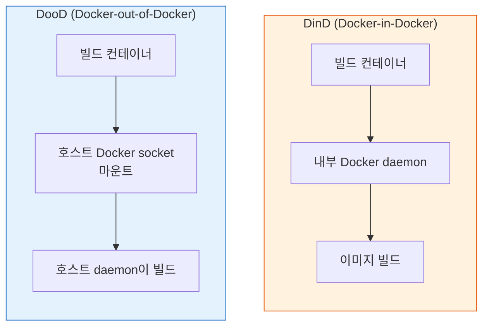
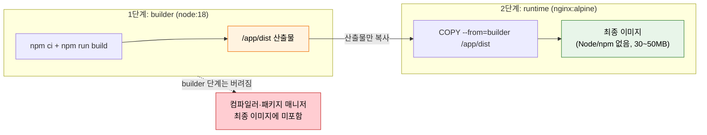
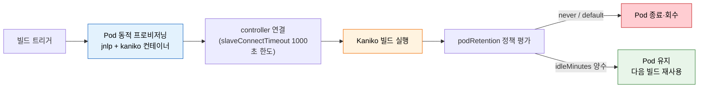

# 컨테이너 이미지 빌드

---

> 이 문서를 읽고 나면 DinD 와 DooD 의 격리·보안·속도 트레이드오프를 *비교* 하고, Kaniko 가 daemon 없이 빌드하는 원리를 *설명* 하며, Multi-stage 빌드와 레이어 캐싱이 이미지 크기·빌드 속도에 미치는 결과를 *예측* 할 수 있습니다.


## 사전 지식

> 본 문서는 "컨테이너 안에서 컨테이너 빌드", "daemon-free 빌드", "Multi-stage 분리", "레이어 캐시 순서 최적화" 같은 일반 컨테이너 개념을 Jenkins 의 DinD/DooD/Kaniko·Dockerfile 단위로 좁혀 본 것입니다.


## 진입 — 왜 "컨테이너 안의 빌드"가 별도 문제가 되었는가

> 컨테이너 안에서 컨테이너를 빌드하는 것은 생각보다 까다롭습니다. DinD, DooD, Kaniko 세 가지 접근의 차이를 설명할 수 있어야 합니다.

CI 가 VM 위에서 돌던 시절에는 빌드 노드 자체가 Docker daemon 을 직접 가지고 있어, `docker build` 한 줄이면 끝이었습니다. 그런데 Jenkins agent 가 Kubernetes Pod 로 동적 프로비저닝되면서(plugins.jenkins.io/kubernetes: Pod-per-agent 동적 프로비저닝, 빌드 후 Pod 종료) 빌드가 일어나는 곳이 "또 다른 컨테이너 안" 으로 바뀌었습니다. 컨테이너 안에는 Docker daemon 이 없고, restricted 보안 프로파일에서는 daemon 을 띄울 privileged 권한도 막혀 있습니다. 그래서 "컨테이너 안에서 이미지를 어떻게 빌드할 것인가" 가 새로운 문제로 떠올랐고, DinD·DooD·Kaniko 는 모두 이 한 질문에 대한 서로 다른 대답입니다.


## 1. DinD vs DooD

> 본 절은 컨테이너 안 이미지 빌드 두 방식의 트레이드오프를 다룹니다. DinD 는 격리되지만 무겁고, DooD 는 가볍지만 호스트와 강하게 결합됩니다 — *둘 다 보안 위험* 입니다.

> DinD/DooD 는 이미 아는 "Docker daemon 에 빌드를 위임한다" 는 모델을, *컨테이너 경계 안쪽에서 그 daemon 을 어디에 두느냐* 라는 위치 문제로 일반화한 것입니다.

컨테이너 안에서 Docker 이미지를 빌드해야 할 때 두 가지 방식이 있습니다. DinD(Docker-in-Docker)는 컨테이너 안에서 별도의 Docker daemon을 실행하는 방식입니다. DooD(Docker-out-of-Docker)는 호스트의 Docker daemon을 공유하는 방식입니다.



DinD와 DooD의 특성을 비교하면 다음과 같습니다:

| 항목 | DinD | DooD |
|------|------|------|
| Docker daemon | 컨테이너 내부에 별도 실행 | 호스트 daemon 공유 |
| 격리 수준 | 높음 (완전 격리) | 낮음 (호스트와 공유) |
| 권한 | `--privileged` 필수 | socket 마운트 필요 |
| 빌드 캐시 | 컨테이너 종료 시 소멸 | 호스트와 공유 (재사용 가능) |
| 보안 위험 | 컨테이너 탈출 가능성 | 호스트 root 접근과 동일 |
| 속도 | 느림 (캐시 격리) | 빠름 (캐시 공유) |

DinD는 `--privileged` 플래그가 필요합니다. 이 플래그는 컨테이너에 호스트의 모든 장치 접근 권한을 부여하므로, 컨테이너 탈출(container escape) 공격에 취약합니다. DooD는 호스트의 `/var/run/docker.sock`을 마운트하는데, 이 socket에 접근할 수 있다는 것은 호스트 Docker daemon을 완전히 제어할 수 있다는 의미입니다. 결국 두 방식 모두 보안 측면에서 위험합니다.

```groovy
// DinD 방식 — privileged 컨테이너 필요
pipeline {
    agent {
        kubernetes {
            yaml '''
            apiVersion: v1
            kind: Pod
            spec:
              containers:
              - name: docker
                image: docker:24-dind
                securityContext:
                  # 왜 위험: privileged 는 호스트 커널 접근을 열어 컨테이너 탈출 표면이 됨
                  privileged: true
            '''
        }
    }
    stages {
        stage('Build') {
            steps {
                container('docker') {
                    sh 'docker build -t myapp .'
                }
            }
        }
    }
}
```


## 2. Kaniko로 안전하게 빌드

> 본 절은 Kaniko 가 *daemon 없이 사용자 공간에서* 빌드해 privileged 없이 restricted 환경에서도 동작하는 원리를 다룹니다.

Kaniko는 Google이 개발한 도구로, Docker daemon 없이 컨테이너 이미지를 빌드합니다. Dockerfile의 각 명령을 사용자 공간(user space)에서 순차 실행하고, 명령마다 파일시스템 스냅샷을 떠서 변경된 부분만 레이어로 append 합니다(출처: github.com/GoogleContainerTools/kaniko). `--privileged`도, socket 마운트도, namespacing·seccomp/AppArmor 같은 추가 권한도 필요 없습니다.

userspace 스냅샷 방식은 일상의 비유로 보면 *요리 단계마다 도마 사진을 한 장씩 찍어, 직전 사진과 달라진 부분만 따로 모아 두는 것* 과 같습니다. RUN/COPY 명령이 끝날 때마다 파일시스템 전체를 비교해 "이번 명령으로 새로 생기거나 바뀐 파일" 만 한 레이어로 묶습니다. 이 비유는 "각 단계의 차이만 보관해 레이어를 만든다" 까지는 유효하지만, *실제로는 사진을 통째로 저장하지 않고 체크섬으로 차등만 계산한다* 는 점에서 깨집니다 — 사진 비유처럼 매 단계 전체 스냅샷을 디스크에 남기면 오히려 느려지므로, Kaniko 는 변경분만 tarball 로 묶어 효율을 확보합니다.

```groovy
pipeline {
    agent {
        kubernetes {
            yaml '''
            apiVersion: v1
            kind: Pod
            spec:
              containers:
              - name: kaniko
                # 왜 debug 변종: 셸이 포함돼 sh step·디버깅이 가능 (기본 이미지엔 셸 없음)
                image: gcr.io/kaniko-project/executor:debug
                # 왜 sleep infinity: executor 는 빌드 후 종료하므로, Pod 를 살려 두고
                #                    Jenkins 가 container() 안에서 명령을 주입하도록 대기
                command: ['sleep', 'infinity']
            '''
        }
    }
    stages {
        stage('Build & Push') {
            steps {
                container('kaniko') {
                    sh '''
                        /kaniko/executor \
                          --context=`pwd` \
                          --dockerfile=Dockerfile \
                          --destination=registry.example.com/myapp:${BUILD_NUMBER}
                    '''
                }
            }
        }
    }
}
```

- Kaniko는 `--privileged` 없이 동작하므로 Kubernetes Pod Security Standards의 restricted 프로파일에서도 사용할 수 있습니다.
- 빌드 컨텍스트(`--context`)와 Dockerfile 경로(`--dockerfile`)를 지정하고, `--destination` 으로 이미지를 빌드해 레지스트리에 바로 푸시합니다.
- 실행은 `gcr.io/kaniko-project/executor` 이미지 안에서만 가능하며, 셸이 필요할 때는 `:debug` 변종을 씁니다. Windows 는 미지원이고 multi-arch manifest 도 생성하지 않습니다(출처: github.com/GoogleContainerTools/kaniko).
- archive 상태이지만 여전히 많은 환경에서 사용 중이므로 동작 원리를 설명할 수 있어야 합니다.

### 2.1 Kaniko 레이어 캐시 플래그

반복 빌드에서 RUN/COPY 레이어를 매번 다시 만들면 느리므로, Kaniko 는 외부 캐시 플래그를 제공합니다(출처: github.com/GoogleContainerTools/kaniko).

| 플래그 | 역할 | 비고 |
|--------|------|------|
| `--cache=true` | RUN/COPY 명령으로 생긴 레이어를 캐시 | 캐시 미적중 시에만 실행 |
| `--cache-repo` | 캐시 레이어를 저장·조회할 레지스트리 경로 | 미지정 시 `--destination` 기준 |
| `--cache-dir` | 로컬 디렉터리 캐시(+ warmer 이미지로 base 이미지 사전 캐시) | base 캐시는 warmer 가 채움 |
| `--cache-ttl` | 캐시 레이어 유효 기간 | 만료 시 재빌드 |

```bash
# 왜 cache-repo 분리: 빌드 산출물(destination) 과 캐시 레이어를 다른 경로에 둬
#                    릴리스 태그가 캐시 레이어로 오염되지 않게 함
/kaniko/executor \
  --context=`pwd` \
  --dockerfile=Dockerfile \
  --destination=registry.example.com/myapp:${BUILD_NUMBER} \
  --cache=true \
  --cache-repo=registry.example.com/myapp/cache \
  --cache-ttl=168h
```

> 캐비엇 — Kaniko 가 daemon·privileged·seccomp/AppArmor 를 불필요하게 만드는 것은 *빌드를 안전하게 보장* 한다는 뜻이 아닙니다. Kaniko 자체는 빌드 보안을 보장하지 않고, *컨테이너 런타임의 격리에 의존* 합니다(출처: github.com/GoogleContainerTools/kaniko). 즉 신뢰할 수 없는 Dockerfile 을 Kaniko 로 돌리면, 격리는 여전히 런타임(컨테이너·노드)이 책임집니다.


## 3. Multi-stage 빌드

> 본 절은 빌드 환경과 런타임 환경을 *한 Dockerfile 안에서 분리* 해 이미지 크기·공격 표면을 줄이는 기법을 다룹니다.

Multi-stage 빌드는 하나의 Dockerfile에서 여러 단계(stage)를 정의하고, 최종 이미지에는 필요한 것만 포함시키는 기법입니다. 빌드 도구는 빌드 단계에만 두고, 최종 이미지에는 실행에 필요한 산출물만 복사합니다.

```dockerfile
# 1단계: 빌드 환경
FROM node:18 AS builder
WORKDIR /app
# 왜 package*.json 먼저: 소스 변경 시에도 의존성 레이어 캐시 재사용 (§4 캐싱 원칙)
COPY package*.json ./
RUN npm ci
COPY . .
RUN npm run build

# 2단계: 런타임 환경
FROM nginx:alpine
# 왜 --from=builder: 빌드 산출물만 가져와 최종 이미지에서 Node/npm 제거 (크기·공격 표면 축소)
COPY --from=builder /app/dist /usr/share/nginx/html
EXPOSE 80
CMD ["nginx", "-g", "daemon off;"]
```

- 1단계 builder에서 Node.js로 빌드하고, 2단계에서 nginx 이미지에 빌드 산출물만 복사합니다.
- 최종 이미지에는 Node.js나 npm이 포함되지 않으므로 크기가 작고 공격 표면이 좁습니다.
- `COPY --from=builder`로 이전 단계의 산출물을 가져옵니다.

Multi-stage 빌드가 *두 단계를 거쳐 최종 이미지에 산출물만 남기는* 흐름은 다음과 같습니다.

> builder 단계의 도구는 *버려지고*, runtime 단계에는 *실행에 필요한 것만* 복사됩니다.



> 주황색(builder 산출물) 만 초록색(runtime) 으로 넘어가고, 빨간색(컴파일러·패키지 매니저) 은 최종 이미지에서 *사라집니다*. 이 분리가 크기(1GB+ → 30~50MB) 와 공격 표면을 동시에 줄입니다.

Multi-stage 빌드의 효과는 다음과 같습니다:

| 항목 | Single-stage | Multi-stage |
|------|--------------|-------------|
| 이미지 크기 | 1GB+ (빌드 도구 포함) | 30~50MB (런타임만) |
| 공격 표면 | 넓음 (컴파일러, 패키지 매니저) | 좁음 (런타임만) |
| 빌드 캐시 | 비효율 | 의존성 레이어 캐시 |
| CVE 노출 | 많음 | 적음 |


## 4. 빌드 최적화

> 본 절의 핵심 한 줄은 *자주 바뀌지 않는 것을 먼저, 자주 바뀌는 것을 나중에* 입니다. 레이어 캐시 적중률과 `.dockerignore` 가 빌드 속도를 좌우합니다.

Docker는 레이어 단위로 캐시합니다. Dockerfile의 명령 순서를 최적화하면 캐시 적중률을 높여 빌드 속도를 크게 개선할 수 있습니다. 핵심 원칙은 자주 바뀌지 않는 것을 먼저, 자주 바뀌는 것을 나중에 배치하는 것입니다.

```dockerfile
# 나쁜 예 — 소스 변경 시 의존성도 다시 설치
FROM node:18
WORKDIR /app
COPY . .
RUN npm ci

# 좋은 예 — 의존성 레이어 캐시 활용
# 왜: package*.json 만 먼저 복사하면 소스만 바뀌어도 npm ci 레이어가 캐시됨
FROM node:18
WORKDIR /app
COPY package*.json ./
RUN npm ci
COPY . .
```

- `package*.json`만 먼저 복사하고 `npm ci`를 실행하면, 소스 코드만 바뀌었을 때 의존성 설치 레이어는 캐시를 재사용합니다.
- 소스를 먼저 복사하면 코드 한 줄만 바뀌어도 `npm ci`가 매번 다시 실행됩니다.

`.dockerignore`로 불필요한 파일을 빌드 컨텍스트에서 제외하면 빌드 속도가 빨라집니다:

```
node_modules
.git
*.log
dist
.env
```

- `.dockerignore`는 빌드 컨텍스트 전송 크기를 줄여 빌드를 빠르게 합니다.
- `.git`이나 `node_modules`처럼 큰 디렉토리를 제외하면 효과가 큽니다.
- `.env` 같은 민감 파일을 제외하면 이미지에 비밀이 포함되는 사고를 막습니다.


## 5. Pod 빌드 환경의 연결·수명 파라미터

> 본 절은 Kaniko 빌드가 도는 Pod 자체가 *언제 연결되고 언제 사라지는가* 를 결정하는 Kubernetes plugin 파라미터를 다룹니다.

Kaniko 컨테이너가 들어 있는 빌드 Pod 는 빌드마다 새로 떠서(plugins.jenkins.io/kubernetes: 동적 프로비저닝) controller 에 inbound agent 로 연결됩니다. 이때 jnlp 컨테이너가 `JENKINS_URL`/`JENKINS_SECRET`/`JENKINS_AGENT_NAME` 환경변수로 controller 를 찾아가며, 외부 클러스터에서는 `jenkinsTunnel` 엔드포인트나 WebSocket 연결을 씁니다(출처: plugins.jenkins.io/kubernetes).

"Pod 연결이 안 되면 수 초 만에 실패한다" 는 식의 막연한 서술은 위험합니다. 실제 기본값은 다음과 같습니다.

| 파라미터 | 기본값 | 의미 | 비교 |
|----------|--------|------|------|
| `slaveConnectTimeout` | 1000초 | agent 연결 타임아웃 | postgres 컨테이너 부팅 2~5초보다 훨씬 길어, 일시적 스케줄 지연은 흡수 |
| `idleMinutes` | 미설정(0) | 마지막 step 후 Pod 재사용 유지 시간 | 0 이면 빌드 직후 회수, 양수면 다음 빌드가 재사용 |
| `activeDeadlineSeconds` | 미설정 | Pod 강제 삭제 데드라인 | 무한 빌드 방지용 상한 |
| `podRetention` | `default()` | 빌드 후 Pod 보존 정책 | `never()`/`onFailure()`/`always()`/`evicted()` 중 선택 |

(출처: plugins.jenkins.io/kubernetes)



resources requests/limits 를 지정하면 컨테이너 메모리 request 에서 JVM heap 이 유도되고, orphaned pod 를 제거하는 GC 는 기본 비활성이므로 별도 활성화가 필요합니다(출처: plugins.jenkins.io/kubernetes).


## 6. 정리

> 본 절의 결론은 *컨테이너 이미지 빌드 = 보안(daemon-free) · 크기(multi-stage) · 속도(캐싱) 세 축의 균형* 입니다.

Kubernetes 환경에서는 DinD/DooD의 보안 위험 때문에 Kaniko 같은 daemon-free 도구가 권장됩니다. 단, Kaniko가 archive되었으므로 신규 프로젝트는 BuildKit이나 Buildah를 검토해야 합니다. 이미지 자체는 Multi-stage 빌드로 크기와 공격 표면을 줄이고, 레이어 캐싱과 `.dockerignore`로 빌드 속도를 확보합니다. 보안(daemon-free), 크기(multi-stage), 속도(캐싱)의 세 축을 함께 고려하는 것이 핵심입니다.


## 면접 질문

> 답을 떠올린 뒤 §정답 절에서 같은 번호로 대조하세요. 각 질문 뒤의 *심화*까지 답할 수 있으면 충분합니다.

1. DinD 와 DooD 는 *격리 수준이 정반대* 인데 왜 *보안 위험은 둘 다 높음* 입니까? *(심화: 각각 어떤 권한 경로로 호스트 root 에 도달합니까?)*
2. Kaniko 가 *privileged 없이* 이미지를 빌드할 수 있는 원리는 무엇이며, 그래서 어떤 K8s 보안 프로파일에서 동작합니까? *(심화: Kaniko 가 파일시스템 변경을 레이어로 만드는 내부 단계를 설명해 보세요.)*
3. Multi-stage 빌드가 *이미지 크기와 보안을 동시에* 개선하는 메커니즘을 설명할 수 있습니까? *(심화: `COPY --from=builder` 가 없다면 최종 이미지에 무엇이 남습니까?)*
4. Dockerfile 에서 `COPY package*.json` 을 `COPY . .` 보다 *먼저* 두는 게 왜 빌드 속도를 높입니까? *(심화: 레이어 캐시가 무효화되는 시점은 언제입니까?)*

### 빈칸 채우기 — Kaniko·빌드 Pod 파라미터

다음 빈칸을 채워 보세요. 정답은 맨 아래 "빈칸 정답" 절에서 같은 기호로 대조합니다.

- Kaniko 는 Dockerfile 명령을 (A)_____ 에서 순차 실행하고, 각 명령 후 파일시스템 (B)_____ 을 떠서 변경분만 레이어로 append 합니다.
- Kaniko 의 RUN/COPY 레이어 캐시는 (C)`--______=true` 플래그로 켜고, 캐시 레이어 저장 경로는 (D)`--______` 로 지정합니다.
- Kaniko 는 daemon·privileged 가 불필요하지만 빌드 보안 자체는 보장하지 않고 컨테이너 (E)_____ 의 격리에 의존합니다.
- Kubernetes plugin 의 agent 연결 타임아웃 `slaveConnectTimeout` 기본값은 (F)_____ 초입니다.


## 정답

> 위 질문을 스스로 설명해 본 뒤에 펼치세요.

### 정답 1 — DinD·DooD 보안 위험 등가

격리 방식은 정반대지만 *최종 권한이 호스트 root 로 귀결* 되기 때문입니다. **DinD** 는 컨테이너 안에 별도 daemon 을 띄우려고 `--privileged` 를 요구하는데, privileged 컨테이너는 *호스트 커널에 거의 완전한 접근* 을 가져 컨테이너 탈출이 쉽습니다. **DooD** 는 `--privileged` 는 안 쓰지만 `docker.sock` 을 마운트하는 순간 *그 socket 으로 호스트 daemon 을 완전 제어* (호스트 root) 할 수 있습니다. 격리(DinD) vs 공유(DooD) 라는 차이에도 *도달 가능한 권한* 이 같아 위험 등급이 동일합니다.

### 정답 1 심화 — 권한 도달 경로 비교

DinD 의 경로는 `--privileged` → 호스트 디바이스·cgroup·네임스페이스 직접 접근 → 컨테이너 탈출입니다. DooD 의 경로는 `/var/run/docker.sock` 마운트 → `docker run -v /:/host` 같은 명령 실행 → 호스트 파일시스템 완전 장악입니다. 두 경로 모두 최종 도달점이 호스트 root 권한이어서 위험 등급이 동일합니다.

### 정답 2 — Kaniko privileged 불필요 원리

Kaniko 는 *Dockerfile 의 각 명령을 사용자 공간(user space) 에서 직접 실행* 하고 *파일시스템 변경을 스냅샷으로 떠서 레이어로 만듭니다*. Docker daemon 에 빌드를 위임하지 않으므로 daemon 도, privileged 도, socket 마운트도 필요 없습니다. 그래서 *일반 사용자 권한* 으로 동작하고, Kubernetes Pod Security Standards 의 가장 엄격한 **restricted 프로파일** 에서도 빌드가 가능합니다 — privileged/hostPath 를 금지하는 환경에서 daemon-free 가 사실상 유일한 길입니다.

### 정답 2 심화 — Kaniko 내부 빌드 단계

공식 문서(github.com/GoogleContainerTools/kaniko)에 따르면 Kaniko 의 빌드 흐름은 다음 세 단계로 이루어집니다. ① base 이미지 파일시스템을 추출해 로컬에 펼칩니다. ② Dockerfile 명령을 순서대로 실행하되, 각 명령 실행 후 *userspace 에서 파일시스템 스냅샷*(체크섬 비교)을 찍습니다. ③ 변경된 파일만 차등 tarball 로 묶어 새 레이어로 append 합니다. 이 방식이 storage driver 나 container runtime 에 의존하지 않으므로 이식성이 확보되고 privileged 가 불필요합니다.

Jenkins Kubernetes plugin(jenkins.io/doc/pipeline/steps/kubernetes)과 함께 쓸 때는 `podTemplate` 안에 `kaniko` 컨테이너를 선언하고, `agent { kubernetes { defaultContainer 'kaniko' } }` 형태로 Pod 스펙을 인라인으로 지정합니다(jenkins.io/doc/book/pipeline/syntax). jnlp 컨테이너는 plugin 이 자동 생성하므로 별도 선언은 필요 없습니다.

### 정답 3 — Multi-stage 크기·보안 동시 개선

*빌드 단계와 런타임 단계를 분리* 해 최종 이미지에 *런타임에 필요한 것만* 남기기 때문입니다. (a) **크기** — builder 단계의 컴파일러·패키지 매니저·소스가 최종 이미지에 안 들어가고 `COPY --from=builder` 로 *산출물만* 가져오므로 1GB+ → 30~50MB 로 줄어듭니다. (b) **보안** — 최종 이미지에서 컴파일러·패키지 매니저가 빠지면 *공격자가 악용할 도구가 사라지고* CVE 탐지 대상도 급감합니다. 하나의 분리가 두 이득을 동시에 만듭니다.

### 정답 3 심화 — COPY --from=builder 없을 때

`COPY --from=builder` 를 쓰지 않고 단일 스테이지로 빌드하면 컴파일러, 패키지 매니저, 빌드 스크립트, 중간 산출물이 모두 최종 이미지에 남습니다. 예를 들어 Node.js 앱을 단일 스테이지로 빌드하면 node_modules 전체(수백 MB)와 npm 바이너리가 이미지에 포함되어 크기가 1GB 를 넘기도 합니다. Multi-stage 분리는 이 문제를 Dockerfile 구조만으로 해결합니다.

### 정답 4 — 레이어 캐시 순서 최적화

Docker 가 *레이어 단위로 캐시* 하고 *변경된 레이어부터 이후 전부 재빌드* 하기 때문입니다. `COPY package*.json ./` + `RUN npm ci` 를 *소스 복사 앞* 에 두면, 소스 코드만 바뀌었을 때 *의존성 레이어(`npm ci`) 는 그대로 캐시 재사용* 됩니다. 반대로 `COPY . .` 를 먼저 두면 *코드 한 줄만 바뀌어도* 그 레이어가 무효화되고 *뒤따르는 `npm ci` 가 매번 다시 실행* 되어 수백 MB 의존성을 재다운로드합니다. *자주 바뀌는 것(소스) 을 자주 안 바뀌는 것(의존성) 뒤* 에 두는 게 캐시 적중의 핵심입니다.

### 정답 4 심화 — 캐시 무효화 시점

레이어 캐시는 해당 레이어의 명령 문자열 또는 `COPY`/`ADD` 대상 파일의 체크섬이 이전 빌드와 달라지는 순간 무효화됩니다. 한 레이어가 무효화되면 그 뒤에 오는 모든 레이어도 연쇄 무효화됩니다. 따라서 변경 빈도가 낮은 레이어(base 이미지, 의존성 설치)를 앞에, 변경 빈도가 높은 레이어(소스 복사, 설정 파일)를 뒤에 배치하는 것이 빌드 속도 최적화의 기본 원칙입니다.

### 빈칸 정답 — Kaniko·빌드 Pod 파라미터

- (A) 사용자 공간(user space) — Docker daemon 에 위임하지 않고 executor 프로세스가 직접 실행합니다.
- (B) 스냅샷(snapshot) — 명령마다 체크섬으로 차등을 계산해 변경 파일만 레이어로 묶습니다.
- (C) `--cache=true` — RUN/COPY 레이어를 캐시합니다.
- (D) `--cache-repo` — 캐시 레이어를 저장·조회할 레지스트리 경로입니다(로컬은 `--cache-dir`).
- (E) 런타임(runtime) — Kaniko 자체는 빌드 보안을 보장하지 않고 컨테이너 런타임의 격리에 의존합니다.
- (F) 1000 — `slaveConnectTimeout` 기본값은 1000초입니다(출처: plugins.jenkins.io/kubernetes).


## 관련 문서

> 이 편은 VM·K8s 환경에서 컨테이너 이미지를 *어떻게* 빌드하는지(DinD·DooD·Kaniko·Multi-stage)를 다룹니다. 앞뒤로 "Pipeline 안에서 Docker 명령을 호출하는 방법(01-02)", "DooD socket 의 보안 함의를 VM 맥락에서 심화한 편(01-03a)", "Kaniko 외 빌드 도구를 비교해 선택하는 기준(01-04)", "K8s 클러스터에 Kaniko Agent 를 실제 구축하는 편(02-01)"으로 이어집니다.

  - [01-02. Docker with Pipeline](01-02.Docker%20with%20Pipeline.md) — Pipeline 안에서 Docker 빌드·push 명령을 호출하는 방법
  - [01-03a. VM Jenkins에서의 Docker 보안 모델](01-03a.VM%20Jenkins에서의%20Docker%20보안%20모델.md) — DooD socket 마운트의 보안 위협과 VM 환경 완화 전략
  - [01-04. 빌드 도구 비교와 선택](01-04.빌드%20도구%20비교와%20선택.md) — Kaniko·Buildah·BuildKit 등 daemon-free 빌드 도구 선택 기준
  - [02-01. Kubernetes Jenkins 구축](02-01.Kubernetes%20Jenkins%20구축.md) — K8s Pod 위에 Kaniko Agent 를 올리는 실습 구성
