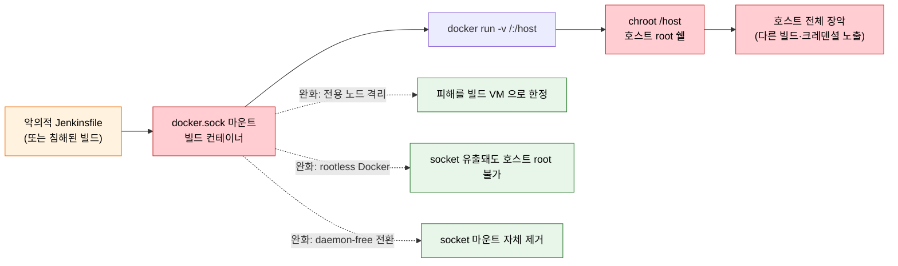
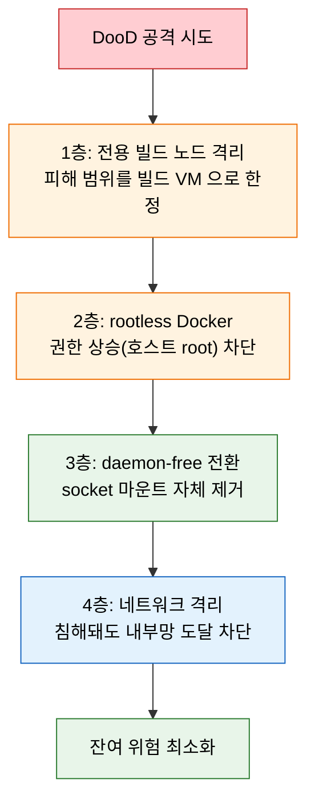

# VM Jenkins에서의 Docker 보안 모델

---

> 이 문서를 읽고 나면 DooD(Docker socket 마운트) 가 *왜 호스트 root 권한과 동등한 위험* 인지 한 명령어 예시로 *설명* 하고, 완화 전략 4종(전용 노드 격리 / rootless Docker / Kaniko·Buildah 전환 / 네트워크 격리) 을 *보안 강도·도입 비용* 으로 *비교* 하며, VM 환경의 단계적 권장 구성을 근거와 함께 *선택* 할 수 있습니다.


## 사전 지식

> 본 문서는 "Docker socket = 호스트 제어권", "rootless 컨테이너", "전용 빌드 노드 격리", "네트워크 세그먼트 분리" 같은 일반 보안 개념을 VM Jenkins 의 DooD·완화 전략 단위로 좁혀 본 것입니다. Jenkins controller/agent 아키텍처(빌드를 agent executor 에서 실행, controller executors=0 권장)와 Docker 컨테이너의 기본 격리 모델을 먼저 떠올리면 읽기가 수월합니다(출처: jenkins.io/doc/book/using/using-agents).


## 진입 — 왜 빌드 컨테이너에 socket 을 꽂게 되는가

> 컨테이너 안에서 이미지를 빌드하려면 Docker daemon 이 필요한데, 컨테이너 안에는 daemon 이 없습니다. 가장 빠른 우회가 호스트의 daemon 을 빌려 쓰는 것이고, 그 대가가 이 문서의 주제입니다.

VM 기반 Jenkins 에서 파이프라인을 Docker Agent 안에서 돌리다 보면 "이 컨테이너 안에서 또 `docker build` 를 하고 싶다"는 상황을 자주 만납니다. 그런데 빌드 컨테이너 안에는 이미지를 만들 Docker daemon 이 없습니다. 컨테이너마다 daemon 을 새로 띄우는 것(DinD)은 무겁고 privileged 권한이 필요하므로, 현장에서는 *호스트가 이미 돌리고 있는 daemon 을 그대로 빌려 쓰는* 손쉬운 길을 택하게 됩니다. 그 통로가 바로 `/var/run/docker.sock` 마운트이고, 편의가 큰 만큼 위험도 큽니다. 이 도입의 편의성이 어떤 보안 비용으로 돌아오는지가 아래 §1 의 출발점입니다.


## 1. DooD의 보안 위험

> 본 절의 결론은 *Docker socket 마운트 = 빌드 컨테이너에 호스트 root 를 넘기는 것* 입니다. 편의성과 보안의 trade-off 가 가장 극명한 자리입니다.

> 이 개념은 이미 아는 *유닉스 소켓 = 프로세스 간 명령 통로* 의 보안 측면을 컨테이너 경계 너머로 일반화한 것입니다. socket 에 쓰기 권한이 있다는 것은 그 socket 뒤 daemon 에 명령을 보낼 수 있다는 뜻이고, 그 daemon 이 root 라면 명령 권한이 곧 root 권한이 됩니다.

VM 기반 Jenkins에서 Docker 이미지를 빌드하는 가장 흔한 방법은 호스트의 Docker socket을 빌드 컨테이너에 마운트하는 것입니다. 이를 DooD(Docker-out-of-Docker)라 합니다.

socket 마운트의 위험을 이해하려면 *위조 명함* 비유가 유효합니다. 빌드 컨테이너에 socket 을 건네는 것은 회사 정문 경비(daemon)에게 직접 지시할 수 있는 사장 명함을 주는 것과 같습니다. 경비는 명함만 보고 "사장 지시"로 받아들여 어떤 문이든 열어 줍니다. 이 비유는 *"socket 접근 = daemon 권한 위임"* 까지는 정확하지만, daemon 이 root 가 아닌 비root 사용자로 동작하는 rootless 구성(§2)에서는 깨집니다. 그때는 같은 명함이라도 경비가 가진 열쇠 자체가 일부 문에만 통하는 한정 열쇠이기 때문입니다.

```groovy
pipeline {
    agent {
        docker {
            image 'docker:24'
            // 왜 위험: 이 socket 마운트가 곧 호스트 Docker daemon 전체 제어권
            args '-v /var/run/docker.sock:/var/run/docker.sock'
        }
    }
    stages {
        stage('Build') {
            steps {
                sh 'docker build -t myapp .'
            }
        }
    }
}
```

- 위 설정은 빌드 컨테이너가 호스트의 Docker daemon에 직접 접근하게 합니다.
- 문제는 이 권한이 사실상 호스트 root 권한과 동일하다는 것입니다.
- 빌드 컨테이너에서 `docker run -v /:/host ...`로 호스트 파일시스템 전체를 마운트할 수 있습니다.

악용 시나리오는 다음과 같습니다:

```bash
# 빌드 컨테이너 안에서 실행하면 호스트 root 획득
# 왜 위험: 호스트 / 를 컨테이너에 마운트 + chroot 로 호스트 쉘 탈취
docker run -v /:/host alpine chroot /host sh
```

- 이 명령은 호스트 루트 파일시스템을 컨테이너에 마운트하고 chroot로 진입합니다.
- 공격자가 Jenkinsfile을 수정할 수 있다면, 이 한 줄로 호스트를 장악할 수 있습니다.

### DooD 공격 경로 한눈에

> *Jenkinsfile 한 줄 → 호스트 장악* 까지의 경로를 한 그림으로 정리합니다. 단계마다 *어디서 끊을 수 있는가* 가 완화 전략의 자리입니다.



> 빨간색 체인이 *공격 경로* — socket 마운트가 시작점이고 호스트 장악이 종점입니다. 초록색 점선이 *완화 지점* — 전용 노드 격리는 *피해 범위* 를, rootless 는 *권한 상승* 을, daemon-free 전환은 *socket 자체* 를 제거합니다. 가장 근본적인 차단은 *daemon-free 전환* 입니다.


## 2. 완화 전략

> 본 절은 완화 4전략을 *보안 강도 × 도입 비용* 으로 정렬합니다. 근본 해결(daemon-free) 일수록 강하고, 격리는 싸지만 부분적입니다.

DooD의 보안 위험을 완화하는 전략은 네 가지입니다. 보안 강도와 도입 비용이 다르므로 환경에 맞게 선택합니다.

| 전략 | 보안 강도 | 도입 비용 | 설명 |
|------|----------|----------|------|
| 전용 빌드 노드 격리 | 중 | 낮음 | 빌드 전용 Agent를 별도 VM으로 분리 |
| rootless Docker | 중상 | 중간 | 비root 사용자로 Docker daemon 실행 |
| Kaniko/Buildah 전환 | 상 | 중간 | daemon 없는 빌드 도구로 대체 |
| 빌드 노드 네트워크 격리 | 상 | 높음 | 빌드 노드를 별도 네트워크 세그먼트로 분리 |

각 전략의 적용 방법은 다음과 같습니다:

- **전용 빌드 노드 격리**: 빌드를 전용 Agent VM에서만 실행하고, 그 VM에는 민감한 데이터를 두지 않습니다. socket이 유출돼도 피해가 그 VM으로 제한됩니다.
- **rootless Docker**: Docker daemon을 비root 사용자로 실행합니다. socket이 유출돼도 호스트 root 권한은 얻지 못합니다.
- **Kaniko/Buildah 전환**: daemon 자체가 필요 없으므로 socket 마운트 위험이 원천 제거됩니다.
- **빌드 노드 네트워크 격리**: 빌드 노드를 별도 VLAN/서브넷에 두고, 내부 시스템 접근을 차단합니다.

### 완화 전략의 방어 깊이 한눈에

> 4전략이 *서로 다른 층* 을 막으므로 *겹쳐 쓸수록* 방어가 깊어집니다.



> 각 층이 *다른 실패 모드* 를 막습니다 — 격리는 *범위*, rootless 는 *권한 상승*, daemon-free 는 *공격 표면*, 네트워크 격리는 *측면 이동* 입니다. 심층 방어(Defense in Depth) 의 정신대로, 한 층이 뚫려도 다음 층이 피해를 가둡니다.


## 3. VM 환경 권장 구성

> 본 절은 *보안과 운영 편의의 균형* 을 단계적으로 잡는 3단계 접근을 다룹니다. 1단계만 해도 피해 범위가 크게 줄어듭니다.

VM 기반 Jenkins에서 현실적으로 권장하는 구성은 보안 수준에 따라 단계적으로 적용합니다.

1단계는 전용 빌드 Agent를 분리하는 것입니다. 빌드는 전용 Agent에서만 실행하고, Controller에서는 절대 빌드하지 않습니다. 이것만으로도 socket 유출 시 피해 범위를 크게 줄입니다.

2단계는 rootless Docker를 적용하는 것입니다. 빌드 Agent의 Docker를 비root로 실행하면, socket 접근이 호스트 root로 이어지지 않습니다.

3단계는 daemon 없는 빌드 도구로 전환하는 것입니다. Buildah나 BuildKit을 쓰면 socket 마운트 자체가 필요 없어집니다.

```groovy
// 권장: 전용 빌드 Agent + Kaniko 조합
pipeline {
    agent { label 'build-node' }  // 왜 전용 노드: socket 유출 시 피해를 이 VM 으로 한정
    stages {
        stage('Build Image') {
            steps {
                sh '''
                    /kaniko/executor \
                      --dockerfile=Dockerfile \
                      --context=. \
                      --destination=registry.example.com/myapp:${BUILD_NUMBER}
                '''
            }
        }
    }
}
```

- 전용 빌드 노드 라벨로 빌드 위치를 제한합니다. Label Expression 은 노드를 "가능하면 이 라벨"이 아니라 "오직 이 라벨"로 묶을 수 있어, 빌드가 controller 나 공용 노드로 새지 않게 합니다(출처: jenkins.io/doc/book/using/using-agents).
- Kaniko로 daemon 없이 빌드하면 socket 마운트가 불필요합니다. Kaniko 는 Docker daemon·privileged·namespacing·seccomp/AppArmor 를 모두 요구하지 않으며, 빌드 가속을 위해 `--cache=true` 로 RUN/COPY 레이어를 `--cache-repo`·`--cache-dir` 에 보존하고 `--cache-ttl` 로 만료를 관리합니다(출처: github.com/GoogleContainerTools/kaniko).
- 단, Kaniko는 archive 상태이므로 신규 구성은 Buildah/BuildKit을 고려합니다.

빌드 노드가 분리되면 controller 와 agent 가 네트워크로 연결되는 시간도 함께 따져야 합니다. SSH 또는 inbound(JNLP) 방식 모두 연결이 즉시 성립하지 않을 수 있는데, Kubernetes 플러그인 기준으로 agent 연결 타임아웃(`slaveConnectTimeout`)의 기본값은 1000초입니다(출처: plugins.jenkins.io/kubernetes). VM 환경의 정적 노드라면 부팅·연결이 보통 그보다 훨씬 짧게 끝나므로, "수 초~수십 초 안에 안 붙으면 실패"라는 막연한 기대보다 *플랫폼별 실제 타임아웃 기본값* 을 알고 있어야 디버깅 때 헛다리를 짚지 않습니다.

| 항목 | VM 정적 노드 | K8s Pod-per-agent |
|------|-------------|-------------------|
| 연결 방식 | SSH / inbound(JNLP) 상시 대기 | Pod 기동 후 inbound agent 가 controller 에 연결 |
| 연결 타임아웃 기본 | (플러그인별 상이) | `slaveConnectTimeout` 1000초 |
| 생명주기 | 장기 상주, 재사용 | 빌드 후 Pod 종료(동적 프로비저닝) |
| 격리 단위 | VM 1대(여러 빌드 공유 가능) | 빌드마다 새 Pod(자동 격리) |

> 출처: jenkins.io/doc/book/using/using-agents, plugins.jenkins.io/kubernetes.


## 4. 정리

> 본 절의 핵심 한 줄은 *DooD 는 간단하지만 위험하고, daemon-free 는 안전하지만 학습 비용이 있다* 이며, VM 환경에도 K8s 보안 원칙(최소 권한·격리) 을 적용할 수 있다는 게 결론입니다.

DooD는 간단하지만 위험하고, daemon 없는 도구는 안전하지만 학습 비용이 있습니다. 핵심은 빌드 환경을 격리하고, 가능하면 daemon 의존을 줄이는 방향으로 가는 것입니다. VM 환경에서도 Kubernetes의 보안 원칙(최소 권한, 격리)을 적용할 수 있으며, 전용 빌드 노드와 rootless/daemon-free 도구의 조합이 현실적인 해법입니다.


## 면접 질문

> 답을 떠올린 뒤 §정답 절에서 같은 번호로 대조하세요. 각 질문 뒤의 *심화*까지 답할 수 있으면 충분합니다.

1. `-v /var/run/docker.sock:/var/run/docker.sock` 마운트가 *왜 호스트 root 권한 부여와 동등* 한지 한 명령어 예시로 설명할 수 있습니까? *(심화: Jenkinsfile 한 줄에서 호스트 root 쉘까지 이어지는 공격 경로를 단계별로 설명해 보세요.)*
2. 완화 전략 4종 중 *socket 마운트 위험을 원천 제거* 하는 것은 무엇이며, *피해 범위만 한정* 하는 것은 무엇입니까? *(심화: 두 전략의 보안 강도가 다른 이유를 "공격 표면"과 "피해 범위" 관점에서 설명해 보세요.)*
3. rootless Docker 가 *socket 유출 시에도 호스트 root 를 못 얻게* 만드는 메커니즘은 무엇입니까? *(심화: user namespace 매핑이 어떻게 권한 상승 경로를 끊는지 설명해 보세요.)*
4. VM 환경에서 1단계(전용 빌드 노드 격리) 만으로도 *피해 범위가 크게 줄어드는* 이유는 무엇입니까? *(심화: Controller 분리·민감 데이터 부재·교체 가능성 세 가지로 설명해 보세요.)*

### 빈칸 채우기 — DooD 위험과 완화

다음 빈칸을 채워 보세요. 정답은 이 문서 §정답 절 끝의 *빈칸 정답* 에서 대조하세요.

1. 빌드 컨테이너에 `_____` 를 마운트하면 호스트 Docker daemon 전체에 명령을 보낼 수 있고, 그 daemon 이 `_____` 권한으로 동작하므로 사실상 호스트 root 권한이 위임됩니다.
2. `docker run -v /:/host alpine `_____` /host sh` 한 줄이면 호스트 루트 파일시스템에 진입해 호스트 root 쉘을 얻습니다.
3. 완화 4전략 중 *공격 표면 자체* 를 없애는 것은 `_____` 전환이고, *피해 범위만* 가두는 것은 전용 `_____` 격리입니다.
4. rootless Docker 에서는 Linux `_____` 매핑으로 컨테이너 안 root(UID 0)가 호스트의 비특권 UID 로 바뀌어 권한 상승 경로가 끊깁니다.
5. Kubernetes 플러그인의 agent 연결 타임아웃 `slaveConnectTimeout` 기본값은 `_____` 초입니다.


## 정답

> 위 질문을 스스로 설명해 본 뒤에 펼치세요.

### 정답 1 — DooD socket 마운트가 호스트 root 와 동등한 이유

`docker.sock` 에 접근하면 *호스트 Docker daemon 에 명령을 보낼 수 있고*, daemon 은 root 로 동작하므로 *임의의 컨테이너를 root 권한으로 띄울 수 있습니다*. 결정적 예시는 `docker run -v /:/host alpine chroot /host sh` — 호스트 루트 파일시스템 `/` 를 컨테이너에 통째로 마운트하고 `chroot` 로 진입하면 *호스트의 root 쉘* 을 그대로 얻습니다. 즉 socket 접근 권한 = 호스트 root 권한입니다. 빌드 컨테이너가 침해되거나 악의적 Jenkinsfile 한 줄이면 이 경로가 열립니다.

### 정답 1 심화 — Jenkinsfile 한 줄에서 호스트 root 쉘까지

공격 경로는 세 단계입니다. 첫째, 악의적(또는 침해된) Jenkinsfile 이 빌드 컨테이너 안에서 `docker` CLI 명령을 실행합니다. 둘째, 빌드 컨테이너는 socket 마운트(`-v /var/run/docker.sock:/var/run/docker.sock`) 덕분에 호스트 Docker daemon 에 그대로 연결됩니다. 셋째, daemon 에 `docker run -v /:/host alpine chroot /host sh` 를 요청하면 *호스트 루트 파일시스템이 마운트된 컨테이너* 가 root 권한으로 기동되어 `chroot` 로 호스트 root 쉘이 열립니다. 이 경로의 시작점이 *socket 마운트* 이므로, socket 을 제거하거나(daemon-free) 격리하는 것이 가장 직접적인 방어입니다.

### 정답 2 — 원천 제거 vs 피해 범위 한정

**원천 제거**: *Kaniko/Buildah 전환 (daemon-free)* — daemon 자체가 없으므로 socket 마운트가 필요 없어 공격 표면이 사라집니다. **피해 범위 한정**: *전용 빌드 노드 격리* — socket 유출은 여전히 가능하지만 그 노드에 민감 데이터가 없고 격리돼 있어 *피해가 그 VM 안에 갇힙니다*. 전자는 *근본 해결*, 후자는 *완화* — 보안 강도가 다릅니다. 실무는 둘을 *겹쳐* 씁니다.

### 정답 2 심화 — "공격 표면"과 "피해 범위" 관점 비교

daemon-free 전환은 *공격 표면을 제거*합니다. socket 이 존재하지 않으므로 마운트할 것 자체가 없고, 빌드가 Dockerfile 명령을 userspace 에서 직접 실행합니다. 예를 들어 Kaniko 는 base 이미지 파일시스템을 추출한 뒤 각 Dockerfile 명령 후 userspace 에서 파일시스템 스냅샷(체크섬 비교)을 수행하고 변경분을 차등 tarball 레이어로 누적합니다. daemon 이 없으므로 privileged 권한도 불필요합니다(출처: github.com/GoogleContainerTools/kaniko). 반면 전용 노드 격리는 socket 이 유출되더라도 *피해 범위를 그 노드로 한정*하는 방식입니다. 공격 표면은 그대로이나, 공격자가 얻는 것이 비어 있는 빌드 VM 이므로 실질 피해가 줄어듭니다.

### 정답 3 — rootless Docker 의 권한 상승 차단 메커니즘

rootless Docker 는 *Docker daemon 을 root 가 아닌 일반 사용자로 실행* 하므로, daemon 이 할 수 있는 일이 *그 일반 사용자 권한* 으로 제한됩니다. socket 이 유출돼 공격자가 컨테이너를 띄워도, 그 컨테이너의 권한은 *호스트 root 가 아니라 그 비root 사용자* 입니다. user namespace 매핑으로 *컨테이너 안 root 가 호스트의 비특권 UID 로 매핑* 되므로 `chroot /host` 를 해도 호스트 root 파일을 건드릴 수 없습니다. 권한 상승 경로 자체가 끊깁니다.

### 정답 3 심화 — user namespace 매핑이 권한 상승 경로를 끊는 방식

Linux user namespace 는 컨테이너 내부의 UID/GID 를 호스트의 다른 UID/GID 로 매핑합니다. rootless Docker 에서는 컨테이너 안 `root(UID 0)` 가 호스트의 특정 비특권 UID(예: 100000번대 서브uid)로 매핑됩니다. 이 덕분에 컨테이너 안에서 `chroot /host sh` 를 실행해 호스트 파일시스템에 진입하더라도, 호스트 관점에서 그 프로세스는 비특권 UID 이므로 root 소유 파일을 읽거나 수정할 수 없습니다. DooD 에서 호스트 root 로 동작하는 daemon 이 컨테이너를 기동하는 것과 결정적으로 다른 점이 바로 이 UID 매핑입니다.

### 정답 4 — 전용 빌드 노드 격리만으로도 피해가 크게 줄어드는 이유

DooD 위험의 본질이 *"socket 유출 → 그 노드의 모든 것 장악"* 인데, 전용 빌드 노드는 *그 노드에 장악할 가치가 없게* 만들기 때문입니다. (a) Controller 와 분리 — `JENKINS_HOME`·크레덴셜·다른 잡 기록이 그 VM 에 없음. (b) 민감 데이터 부재 — 빌드 산출물 외에 훔칠 게 없음. (c) 일회성/교체 가능 — 침해되면 VM 을 폐기·재생성. 결과적으로 socket 이 유출돼도 *공격자가 얻는 것이 빈 빌드 VM* 이라 피해가 크게 줄어듭니다. 도입 비용이 낮으면서 효과가 커서 *1단계로 권장* 됩니다.

### 정답 4 심화 — Controller 분리·민감 데이터 부재·교체 가능성

세 요소가 서로 다른 피해 경로를 막습니다. **Controller 분리**: Jenkins Controller 에는 파이프라인 정의·크레덴셜·빌드 히스토리가 집중되어 있습니다. 전용 빌드 Agent 는 Controller 와 별도 VM 이므로, Agent 가 침해돼도 Controller 의 시크릿에 직접 접근할 수 없습니다. 이 때문에 Controller 의 executor 를 0 으로 두어 빌드를 절대 Controller 에서 돌리지 않는 구성이 권장됩니다(출처: jenkins.io/doc/book/using/using-agents). **민감 데이터 부재**: 빌드 Agent 에는 빌드 아티팩트 외에 보관할 장기 데이터를 두지 않습니다. 공격자가 Agent VM 을 장악해도 얻을 수 있는 정보가 제한됩니다. **교체 가능성**: Agent VM 은 이미지 기반으로 프로비저닝하면 침해 시 폐기하고 깨끗한 VM 으로 즉시 교체할 수 있습니다. 여기서 한발 더 나아간 형태가 K8s 의 Pod-per-agent 로, 빌드마다 Pod 를 새로 프로비저닝하고 빌드가 끝나면 종료해 격리를 자동화합니다(출처: plugins.jenkins.io/kubernetes). 세 요소 모두 "침해 후 피해 최소화(Blast Radius 제한)" 원칙에서 출발합니다.

### 빈칸 정답 — DooD 위험과 완화

1. `/var/run/docker.sock`(Docker socket) / root
2. `chroot`
3. daemon-free(Kaniko·Buildah·BuildKit) / 빌드 노드
4. user namespace
5. 1000

각 정답의 근거는 본문 §1(socket 마운트·chroot), §2(완화 4전략), §3(연결 타임아웃)과 §정답 3 심화(user namespace 매핑)에 있습니다.


## 관련 문서

> 이 편은 DooD 의 *위험과 완화 전략* 을 다루는 보안 이론 편입니다. 앞 편(01-02)에서 Docker Agent 를 처음 쓰는 법을 익혔다면, 이 편에서 그 구성이 왜 위험한지 배우고, 뒤 편(01-03·01-04)에서 DinD/DooD 메커니즘과 daemon-free 대안 도구를 차례로 살펴보는 흐름으로 이어집니다.

  - [01-02. Docker with Pipeline](01-02.Docker%20with%20Pipeline.md) — Docker Agent 선언과 `args` 옵션으로 socket 을 마운트하는 기초 사용법
  - [01-03. 컨테이너 이미지 빌드](01-03.컨테이너%20이미지%20빌드.md) — DinD/DooD 메커니즘 비교 및 각각의 격리 수준
  - [01-04. 빌드 도구 비교와 선택](01-04.빌드%20도구%20비교와%20선택.md) — Kaniko·Buildah·BuildKit 등 daemon-free 전환 도구 비교와 선택 기준
