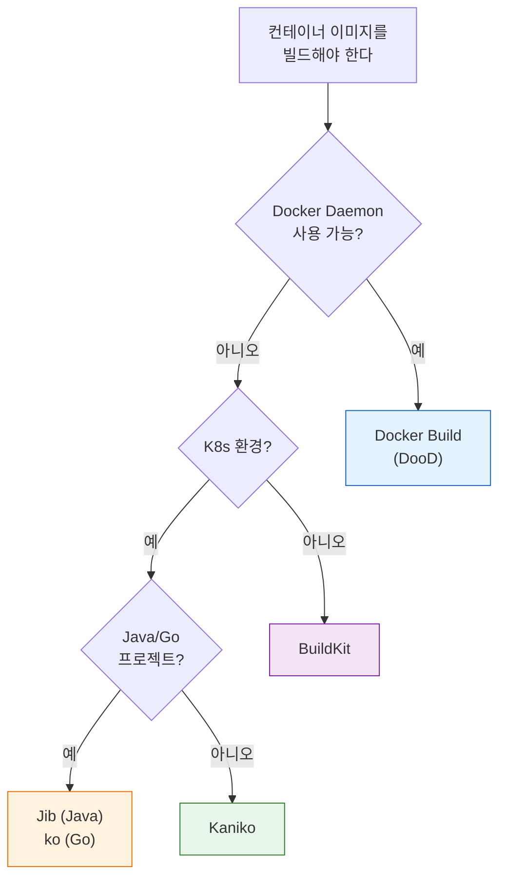

# 빌드 도구 비교와 선택
---
> Kaniko가 유일한 답은 아니다. 환경과 요구사항에 따라 적합한 빌드 도구가 다르다.

## 1. Kaniko 유지보수 현황

> Kaniko 원본 저장소(`GoogleContainerTools/kaniko`)는 2025년 6월 3일 archive되었다. 이것이 곧바로 "즉시 폐기"를 의미하지는 않는다. 이미 안정적으로 운영 중인 파이프라인이라면 당장 교체보다 계획적인 마이그레이션이 더 중요하다.
>
> - 신규 표준을 지금 정해야 하는 상황인가?
> - 멀티 아키텍처 빌드나 고급 캐시 기능이 필요한가?
> - 장기 유지보수 리스크를 감수할 수 있는가?
>
> 이 중 하나라도 해당된다면 대체 검토가 실질적으로 필요하다.

2026년 4월 기준 주요 도구의 유지보수 상태는 다음과 같다:

| 도구 | 최신 릴리스 | 상태 |
|------|------------|------|
| Kaniko | archive | 신규 기능 개발 중단 |
| BuildKit | v0.26.3 (2025-12) | 활발히 유지보수 중 |
| kpack | v0.17.1 (2025-12) | 활발히 유지보수 중 |
| Buildah | v1.42.1 (2025-11) | 활발히 유지보수 중 |
| Jib | v3.4.6 (2025-07) | 유지보수 중 |
| ko | v0.18.0 (2025-05) | 유지보수 중 |


## 2. BuildKit, kpack, Buildah 비교

> Jenkins on Kubernetes 환경에서 각 도구를 평가하는 핵심 기준은 네 가지다. `--privileged` 없이 동작하는지, Dockerfile을 그대로 유지할 수 있는지, 캐시 성능이 충분한지, Jenkinsfile 변경 폭이 크지 않은지다.

| 항목 | Kaniko | BuildKit | kpack | Buildah |
|------|--------|----------|-------|---------|
| Docker daemon 필요 | 없음 | 없음 | 없음 | 없음 |
| Dockerfile 유지 | 가능 | 가능 | 보통 불가 | 가능 |
| 캐시 성능 | 보통 | 강함 | 좋음 | 좋음 |
| 멀티 아키텍처 | 별도 설계 필요 | 강함 | 빌드팩 체인 의존 | 가능하나 난이도 있음 |
| Jenkinsfile 친화성 | 높음 | 높음 | 낮음 | 중간 |
| 장기 유지보수 | 낮음 | 높음 | 높음 | 높음 |

**BuildKit**은 `buildkitd` 데몬과 `buildctl` 클라이언트 구조를 가진다.

- Jenkins on Kubernetes에서는 클러스터 안에 `buildkitd`를 별도 서비스로 띄우고, Jenkins Agent Pod에서 `buildctl`로 원격 호출하는 방식이 가장 일반적이다.
- Dockerfile과 Jenkinsfile을 그대로 유지하면서 Kaniko만 교체하고 싶은 팀에 가장 잘 맞는다.

**kpack**은 빌드 도구라기보다 Kubernetes 네이티브 빌드 서비스에 가깝다.

- `Image`, `Builder`, `Build` 같은 Kubernetes 리소스를 통해 이미지를 선언적으로 빌드한다.
- Jenkins는 빌드 엔진 역할에서 벗어나 kpack 리소스를 생성하고 상태를 확인하는 오케스트레이터 역할로 변한다.
- Dockerfile 세부 제어가 중요한 팀에는 답답할 수 있으나, 플랫폼 팀이 빌드를 표준화하려는 조직에는 가장 전략적으로 맞는 선택이다.

**Buildah**는 OCI 이미지 빌드 도구로 Dockerfile 빌드(`buildah bud`)와 스크립트 방식 모두 지원한다.

- Rootless 운영과 Podman 생태계, OpenShift와의 친화성이 강하다.
- 일반적인 Kubernetes Jenkins 환경에서는 BuildKit보다 선택 우선순위가 낮지만, OpenShift 또는 Red Hat 계열 인프라라면 검토 가치가 충분하다.


## 3. 언어 특화 빌더: Jib과 ko

> Jib과 ko는 범용 빌더가 아니라 특정 언어에 최적화된 빌더다. Docker daemon이 필요 없고, Dockerfile 없이도 이미지를 빌드할 수 있다는 공통점이 있다.

| 항목 | Jib | ko |
|------|-----|----|
| 대상 언어 | Java (Maven/Gradle) | Go |
| Dockerfile 필요 | 없음 | 없음 |
| Docker daemon 필요 | 없음 | 없음 |
| 레이어 전략 | 의존성/클래스/리소스 분리 | distroless 위에 바이너리 배치 |
| 멀티 아키텍처 | 지원 | 지원 |
| 대표 사용처 | Spring Boot 서비스 | Kubernetes 오퍼레이터, Go 마이크로서비스 |

**Jib**은 Java 애플리케이션 이미지를 Maven 또는 Gradle에서 직접 빌드하고 push한다.

- 의존성 레이어와 애플리케이션 클래스 레이어를 분리하므로 코드만 변경되면 의존성 레이어는 캐시를 그대로 사용한다.
- Spring Boot 서비스의 경우 이미지 빌드 시간이 Docker 방식 대비 크게 줄어드는 경우가 많다.

```xml
<!-- pom.xml에 Jib 플러그인 추가 -->
<plugin>
    <groupId>com.google.cloud.tools</groupId>
    <artifactId>jib-maven-plugin</artifactId>
    <version>3.4.6</version>
    <configuration>
        <to>
            <image>registry.example.com/myapp:${project.version}</image>
        </to>
    </configuration>
</plugin>
```

```groovy
// Jenkinsfile에서 Jib 호출
stage('Build & Push Image') {
    agent { docker { image 'maven:3.9-eclipse-temurin-17' } }
    steps {
        sh 'mvn jib:build -Djib.to.auth.username=$REGISTRY_USER -Djib.to.auth.password=$REGISTRY_PASSWORD'
    }
}
```

**ko**는 Go 애플리케이션 이미지를 `go build` 기반으로 빠르게 이미지화한다.

- Go 바이너리를 distroless 베이스 이미지 위에 올리는 방식이 기본이어서 최종 이미지가 매우 작다.
- Go 마이크로서비스나 Kubernetes 오퍼레이터를 빌드하는 환경에서 특히 효과적이다.

언어 특화 빌더의 한계는 범용성이 없다는 것이다.

- 여러 언어가 섞인 플랫폼에서 공통 빌드 표준으로 채택하기 어렵다.
- Dockerfile 세부 제어가 필요한 서비스에는 적합하지 않다.
- 그러나 Java 또는 Go 서비스 단위로 Kaniko를 걷어내는 데는 가장 효과적인 방법이다.


## 4. 선택 기준 의사결정 트리

> 도구 선택은 팀 상황과 운영 목표에 따라 달라진다. 아래 흐름을 따라가면 대부분의 경우 합리적인 선택에 도달할 수 있다.



Jenkins on Kubernetes를 기준으로 가장 현실적인 권고안은 다음과 같다.

- 현재 Kaniko 운영 중이라면 단기 유지
- 신규 서비스나 신규 표준을 정해야 한다면 BuildKit 우선 검토
- Java/Go 특화 서비스라면 Jib/ko 우선 검토
- 플랫폼 빌드 서비스화가 목표라면 kpack 검토

레지스트리 인증은 어떤 도구를 선택하든 빌드 Pod 권한 기준으로 설계해야 한다.

- Jenkins Credentials에 등록하는 것만으로는 충분하지 않다.
- 실제로 이미지를 push하는 주체가 Jenkins Controller가 아니라 Kubernetes 위의 빌드 컨테이너이기 때문이다.
- 클라우드 레지스트리라면 가능한 한 Workload Identity(GKE) 또는 IRSA(EKS) 같은 워크로드 아이덴티티를 우선 적용하는 것이 좋다.
