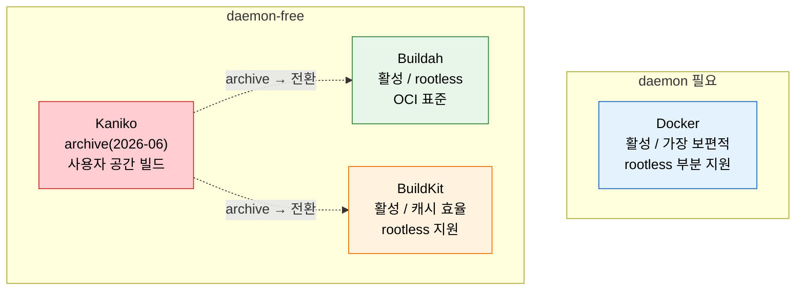
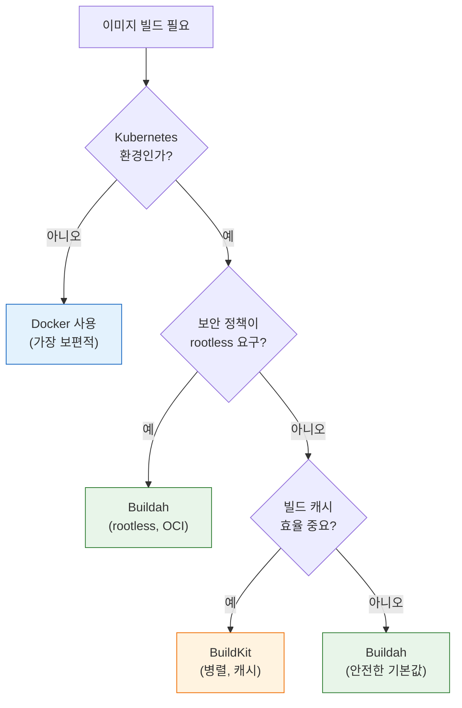
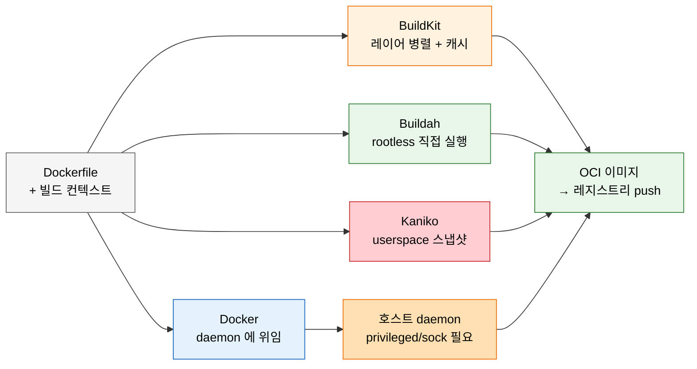

# 빌드 도구 비교와 선택

---

> 이 문서를 읽고 나면 컨테이너 이미지 빌드 도구 4종(Docker / Kaniko / Buildah / BuildKit) 의 *daemon 의존성·rootless 지원* 을 *비교* 하고, 실행 환경(VM / K8s 일반 / K8s rootless) 에 맞는 도구를 결정 트리로 *선택* 하며, Kaniko 가 보안을 *컨테이너 런타임 격리에 의존* 한다는 캐비엇을 *예측* 하고, archive 이후 대안 전환 판단을 *설명* 할 수 있습니다.


## 진입 — 왜 Docker 하나로는 부족해졌는가

> 한동안 "이미지 빌드 = `docker build`" 가 공식이었습니다. 그런데 Jenkins 를 K8s 위에 올리는 순간 이 공식이 깨집니다. daemon 없는 빌드 도구가 우후죽순 등장한 이유가 바로 이 지점에 있습니다.

`docker build` 는 호스트의 Docker daemon 에게 "이미지를 구워달라" 고 시키는 명령입니다. VM 한 대에서는 문제가 없습니다. 그런데 빌드가 K8s Pod 안에서 돌면 사정이 달라집니다. Pod 안에는 daemon 이 없으므로, daemon 을 쓰려면 호스트의 `docker.sock` 을 마운트하거나(DooD) Pod 안에 별도 daemon 을 `--privileged` 로 띄워야(DinD) 합니다. 둘 다 컨테이너 탈출 시 노드 전체를 위협하는 권한 상승 경로를 엽니다. K8s 보안 정책이 이를 금지하면서, "daemon 없이 이미지를 굽는" 도구가 필요해졌습니다. Kaniko·Buildah·BuildKit 은 모두 이 요구에 대한 응답입니다.


## 사전 지식

> 본 문서는 "daemon-free 빌드", "rootless 컨테이너", "OCI 표준 이미지", "빌드 캐시 효율" 같은 일반 컨테이너 개념을 Docker·Kaniko·Buildah·BuildKit 단위로 좁혀 본 것입니다.


## 1. 컨테이너 이미지 빌드 도구 지형

> 이 개념은 새로 배우는 게 아니라, *로컬에서 `docker build` 하나로 끝내던 습관* 을 보안·환경 제약이 다른 여러 무대(VM / K8s)로 일반화한 것입니다. 도구가 늘어난 게 아니라 무대가 늘어난 것입니다.

> 본 절은 *Docker 하나가 정답이던 시대가 끝난* 배경과 daemon-free 대안들의 등장 이유를 다룹니다. K8s 보안 제약이 이 변화의 동력입니다.

> Docker daemon 없이 이미지를 빌드하는 도구가 여럿 등장했습니다. 보안과 환경 제약에 따라 선택이 갈립니다.

| 도구 | 개발 주체 | daemon 필요 | 핵심 특징 | 2026 상태 |
|------|----------|------------|----------|----------|
| Docker | Docker Inc | 필요 | 가장 보편적, 풍부한 생태계 | 활성 |
| Kaniko | Google | 불필요 | K8s 친화, 사용자 공간 빌드 | **archive (2026-06)** |
| Buildah | Red Hat | 불필요 | rootless, OCI 표준, daemonless | 활성 |
| BuildKit | Docker/Moby | 선택 | 병렬 빌드, 캐시 효율, rootless 지원 | 활성 |

- Kaniko가 2026년 6월부로 archive되면서, 신규 프로젝트에서 daemon 없는 빌드가 필요하면 Buildah나 BuildKit을 선택하는 것이 합리적입니다.
- 기존 Kaniko 사용 파이프라인은 당장 마이그레이션할 필요는 없지만, 장기적으로는 대안을 검토해야 합니다.

daemon-free 라는 표현을 한 번 비유로 잡아두면 이후 절이 쉽게 읽힙니다. Docker daemon 방식은 *전담 주방장(daemon)에게 주문을 넣어 요리를 시키는* 식당이고, daemon-free 방식은 *주방장 없이 레시피(Dockerfile)만 들고 자기 손으로 요리하는* 방식입니다. 주방장이 없으니 "주방장에게 권한을 위임"하는 보안 문제(privileged, docker.sock)가 사라집니다. 다만 이 비유는 *"누가 빌드를 수행하는가"* 까지만 유효하고, *격리의 책임 소재* 에서 깨집니다. 레시피만으로 요리한다고 해서 주방 자체가 안전해지는 것은 아닙니다. Kaniko 의 경우 빌드 명령은 자기 손으로 실행하지만, 그 손이 노드를 망가뜨리지 못하게 막는 것은 여전히 *바깥 컨테이너 런타임의 격리* 입니다(§6 캐비엇 참조).

### 빌드 도구 지형 한눈에

> *daemon 의존성* 과 *rootless 지원* 두 축으로 4종을 배치하면 선택의 좌표가 분명해집니다.



> 파란색(Docker) 은 *daemon 필요* 영역에 혼자 — VM·단순 환경의 기본값. 빨간색(Kaniko) 은 *archive* 라 신규 도입 비추천, 점선이 전환 방향. 초록색(Buildah) 은 *rootless·OCI 표준* 으로 보안 우선, 주황색(BuildKit) 은 *캐시·속도* 우선입니다.


## 2. Kaniko 사용 예시

> 본 절은 archive 상태인 Kaniko 의 *기존 파이프라인 이해* 를 위한 참고입니다. Pod 안에서 Dockerfile → 레지스트리 푸시 흐름을 정리합니다.

> Kaniko는 Kubernetes Pod 안에서 Dockerfile로 이미지를 빌드하고 레지스트리에 푸시합니다. archive 상태이지만 기존 파이프라인 이해를 위해 정리합니다.

Kaniko는 `gcr.io/kaniko-project/executor` 이미지로 실행합니다. Dockerfile과 빌드 컨텍스트를 지정하면 이미지를 빌드해 레지스트리에 푸시합니다. Kaniko 실행은 이 executor 이미지 *안에서만* 가능하며, 셸 디버깅이 필요할 때 쓰는 debug 변종 이미지가 별도로 존재합니다 (출처: github.com/GoogleContainerTools/kaniko).

```yaml
apiVersion: v1
kind: Pod
spec:
  containers:
  - name: kaniko
    # 왜 executor 이미지 고정: Kaniko 실행 코드는 이 이미지 안에만 있어 별도 바이너리 설치 불가
    image: gcr.io/kaniko-project/executor:latest
    args:
    # 왜 --dockerfile: 빌드할 Dockerfile 경로를 명시해야 executor 가 명령을 순차 실행
    - "--dockerfile=Dockerfile"
    # 왜 git:// 컨텍스트: 레포를 직접 당겨 빌드 → 별도 checkout stage 없이 Pod 단독 완결
    - "--context=git://github.com/example/repo.git"
    # 왜 --destination: daemon 이 없어 로컬 저장이 무의미 → 빌드 직후 레지스트리로 push 가 기본 동선
    - "--destination=registry.example.com/myapp:v1.0"
    # 왜 --cache=true: RUN/COPY 레이어를 cache-repo 에 저장해 다음 빌드에서 재사용 (warmer 로 base 도 캐시 가능)
    - "--cache=true"
    volumeMounts:
    - name: docker-config
      # 왜 /kaniko/.docker: Kaniko 가 레지스트리 인증 정보를 이 경로에서 읽음
      mountPath: /kaniko/.docker
  volumes:
  - name: docker-config
    configMap:
      name: docker-config
```

- `--dockerfile`: 빌드할 Dockerfile 경로
- `--context`: 빌드 컨텍스트 (Git 저장소나 디렉토리)
- `--destination`: 푸시할 레지스트리 주소와 태그
- `--cache=true`: RUN/COPY 명령 레이어를 캐시. `--cache-repo`(원격 저장소), `--cache-dir`(로컬), `--cache-ttl`(만료) 로 세부 제어하며, base 이미지는 warmer 이미지로 미리 캐시합니다 (출처: github.com/GoogleContainerTools/kaniko).
- `/kaniko/.docker`에 레지스트리 인증 정보를 마운트합니다.

Kaniko 는 Docker daemon·privileged·namespacing·seccomp/AppArmor 가 *모두 불필요* 하다는 점이 daemon-free 의 핵심 강점입니다. 다만 Windows 미지원이고 multi-arch manifest 를 생성하지 못하는 한계가 있습니다 (출처: github.com/GoogleContainerTools/kaniko).


## 3. Buildah 사용 예시

> 본 절은 Buildah 의 *두 빌드 방식* (Dockerfile 호환 vs 네이티브 셸 제어) 과 rootless 강점을 다룹니다.

Buildah는 두 가지 방식으로 이미지를 빌드합니다. 기존 Dockerfile을 그대로 사용하는 `build-using-dockerfile`과, 셸 스크립트로 단계를 제어하는 네이티브 명령입니다.

```bash
# Dockerfile 기반 빌드 — 왜: 기존 Dockerfile 그대로라 마이그레이션 비용 0
buildah build-using-dockerfile -t myapp:v1.0 .

# 네이티브 명령 빌드 (셸로 제어) — 왜: 빌드 단계를 셸로 세밀 제어할 때
container=$(buildah from alpine:3.18)
buildah run $container apk add --no-cache nodejs npm
buildah copy $container . /app
buildah config --cmd "node /app/index.js" $container
buildah commit $container myapp:v1.0
```

- 네이티브 명령은 빌드 과정을 셸 스크립트로 세밀하게 제어할 수 있습니다.
- rootless로 동작하므로 일반 사용자 권한으로 빌드할 수 있어 K8s 보안 정책과 충돌하지 않습니다.


## 4. 빌드 도구 선택 가이드

> 본 절은 *환경 → 보안 제약 → 캐시 요구* 순으로 분기하는 결정 트리를 다룹니다. 첫 분기가 *K8s 인가* 입니다.

> 환경과 제약에 따라 어떤 도구를 선택해야 하는지 결정 트리로 정리합니다.

빌드 도구 선택은 실행 환경과 보안 제약에 따라 달라집니다:



각 환경별 권장 사항은 다음과 같습니다:

- **VM 기반 Jenkins**: Docker가 가장 단순하고 안정적입니다. 보안 위험은 Agent 격리로 관리합니다.
- **Kubernetes + 일반 보안**: BuildKit이 캐시 효율과 빌드 속도에서 우수합니다.
- **Kubernetes + 엄격한 보안(rootless 필수)**: Buildah가 OCI 표준을 따르며 rootless를 완전 지원합니다.
- **레거시 Kaniko 파이프라인**: 당장은 유지하되, 신규 빌드는 Buildah/BuildKit으로 전환합니다.


## 5. 정리

> 본 절의 결론은 *2026년 기준 "Docker 가 기본"이라는 공식이 깨졌다* 이고, 환경별 3분기(VM / K8s 보안 / K8s 속도) 가 핵심 산출입니다.

> 2026년 기준, 컨테이너 이미지 빌드는 "Docker가 기본"이라는 공식이 깨졌습니다.

Kubernetes 환경이 보편화되면서 daemon 없는 빌드가 표준이 되어가고 있습니다. Kaniko의 archive는 이 변화를 상징적으로 보여줍니다. 환경별 결론:

- **VM/단순 환경**: Docker — 검증된 안정성
- **K8s/보안 중시**: Buildah — rootless, OCI 표준
- **K8s/속도 중시**: BuildKit — 병렬 빌드, 캐시 효율

도구는 계속 바뀌지만 핵심 원칙은 변하지 않습니다. 빌드 환경은 재현 가능해야 하고, 보안 제약을 지켜야 하며, 캐시를 활용해 빌드 속도를 확보해야 합니다. 도구 선택은 이 세 가지 원칙을 환경에 맞게 구현하는 수단일 뿐입니다.


## 6. 4종 도구 비교 — 흐름·표·결론

> 본 절은 §1~§5 의 산발적 비교를 *동작 흐름(mermaid) → 한눈 비교표 → 굵은 결론 한 줄* 3계열로 묶어 시험·실무에서 바로 꺼내 쓸 수 있게 정리합니다.

네 도구가 이미지를 굽는 *방식의 차이* 를 한 흐름에 겹쳐 보면 daemon 의존도가 한눈에 드러납니다.



| 축 | Docker | BuildKit | Buildah | Kaniko |
|----|--------|----------|---------|--------|
| daemon | 필요 | 선택(daemonless 가능) | 불필요 | 불필요 |
| rootless | 부분 | 지원 | 완전 | 불필요(userspace) |
| 캐시 강점 | 보통 | 레이어 병렬·원격 캐시 | 보통 | RUN/COPY 레이어 캐시 |
| 보안 격리 책임 | daemon | 빌더 | rootless 사용자 | **외부 런타임에 의존** |
| 2026 상태 | 활성 | 활성 | 활성 | archive(2026-06) |

**굵은 결론**: VM 이면 Docker, K8s 에서 속도가 우선이면 BuildKit, rootless 강제이면 Buildah — 그리고 Kaniko 는 archive 이므로 신규 도입 대상에서 제외합니다.


## 7. Kaniko 보안 캐비엇 — "런타임 격리에 의존"

> 본 절은 §6 비교표의 *"보안 격리 책임 = 외부 런타임에 의존"* 한 칸을 풀어 설명합니다. Kaniko 를 "안전한 빌드 도구" 로 오해하지 않게 막는 안전핀입니다.

Kaniko 가 privileged 없이 동작한다는 점 때문에 "Kaniko = 안전한 빌드" 로 받아들이기 쉽지만, 이는 절반만 맞습니다. Kaniko 는 Docker daemon·privileged·namespacing·seccomp/AppArmor 를 *요구하지 않을* 뿐, *빌드 격리 자체를 보장하지는 않습니다.* Kaniko 가 의존하는 격리는 *자신을 감싸고 있는 컨테이너 런타임* 의 격리입니다. 즉 Kaniko 가 도는 Pod 의 런타임(containerd 등)이 제대로 격리를 제공하지 않으면, Kaniko 가 실행하는 Dockerfile 의 `RUN` 명령이 호스트에 영향을 줄 여지가 생깁니다 (출처: github.com/GoogleContainerTools/kaniko).

이 캐비엇이 §1 비유의 "깨지는 지점" 과 정확히 맞닿습니다. 주방장(daemon) 없이 레시피만으로 요리한다고 해서 *주방 벽(런타임 격리)* 까지 내가 만든 것은 아닙니다. Kaniko 는 daemon 의존을 없애 *권한 위임 경로* 는 닫았지만, *임의 명령 실행에 대한 경계* 는 여전히 바깥 런타임이 책임집니다. 그래서 신뢰할 수 없는 Dockerfile 을 Kaniko 로 빌드할 때는, Kaniko 가 도는 Pod 자체를 별도 namespace·정책으로 한 번 더 격리하는 것이 안전합니다.

---


## 면접 질문

> 답을 떠올린 뒤 §정답 절에서 같은 번호로 대조하세요. 각 질문 뒤의 *심화*까지 답할 수 있으면 충분합니다.

1. *daemon 필요* 와 *daemon-free* 빌드 도구의 차이가 *K8s 보안 정책* 관점에서 왜 결정적입니까? *(심화: DinD 와 DooD 의 보안 위험 차이는 무엇입니까?)*
2. Kaniko 가 archive 됐을 때, 기존 Kaniko 파이프라인을 *당장 마이그레이션하지 않아도 되는* 판단 근거는 무엇입니까? *(심화: Kaniko 가 userspace 스냅샷 방식으로 동작하는 원리를 설명하세요.)*
3. K8s 환경에서 *Buildah 와 BuildKit* 의 갈림 신호는 무엇입니까? 각각 어떤 요구에 맞습니까?
4. VM 기반 Jenkins 에서 굳이 daemon-free 도구를 안 쓰고 Docker 를 쓰는 게 합리적인 이유는 무엇입니까?
5. Kaniko 가 privileged 없이 동작하는데도 "Kaniko 자체가 빌드 보안을 보장하지 않는다" 고 말하는 이유는 무엇입니까?

### 빈칸 채우기 — daemon-free 빌드와 Kaniko

> 빈칸을 채운 뒤 §정답 절 *맨 끝* 의 「빈칸 정답」에서 대조하세요.

1. K8s Pod Security Standards 의 `(______)` 프로파일은 privileged 컨테이너와 hostPath 마운트를 모두 금지하므로, DinD·DooD 방식의 Docker 빌드가 정책을 위반합니다.
2. Kaniko 는 각 Dockerfile 명령 실행 후 `(______)` 에서 파일시스템 스냅샷을 찍어 변경분만 레이어로 append 합니다.
3. Kaniko 는 Docker daemon·privileged·namespacing·`(______)` 를 모두 요구하지 않지만, 빌드 격리 자체는 외부 `(______)` 의 격리에 의존합니다.
4. Buildah 는 `(______)` 로 동작하므로 일반 사용자 권한으로 빌드할 수 있어 K8s rootless 정책과 충돌하지 않습니다.
5. K8s 플러그인에서 agent 연결 타임아웃을 정하는 옵션은 `slaveConnectTimeout` 이고 기본값은 `(______)` 초입니다.


## 정답

> 위 질문을 스스로 설명해 본 뒤에 펼치세요.

### 정답 1 — daemon-free 와 K8s 보안 정책

K8s 의 Pod Security Standards `restricted` 프로파일이 *privileged 컨테이너와 hostPath 마운트를 모두 금지* 하기 때문입니다. daemon 필요 도구(Docker via DinD/DooD) 는 (a) DinD = `--privileged`, (b) DooD = `docker.sock` hostPath 마운트 를 요구하므로 *restricted 정책 위반* 입니다. daemon-free 도구(Buildah/BuildKit rootless) 는 *일반 사용자 권한 + 호스트 마운트 없이* 동작하므로 정책을 지키면서 이미지를 빌드합니다. 즉 *엄격한 K8s 보안 환경에서는 daemon-free 가 사실상 유일한 선택* 입니다.

### 정답 1 심화 — DinD 와 DooD 보안 위험 차이

DinD(Docker-in-Docker) 는 Pod 컨테이너 안에 별도 Docker daemon 을 띄우기 위해 `--privileged` 플래그가 필요합니다. `--privileged` 는 호스트 커널 기능 전체를 컨테이너에 노출하므로, 빌드 컨테이너 탈출 시 노드 전체를 장악할 수 있습니다. DooD(Docker-out-of-Docker) 는 `--privileged` 없이 호스트의 `docker.sock` 을 `hostPath` 로 마운트해 사용합니다. 겉보기엔 덜 위험해 보이지만, `docker.sock` 을 가진 컨테이너는 호스트 Docker daemon 을 직접 제어할 수 있어 *권한 상승 경로는 동일* 합니다. 결과적으로 DinD 는 커널 수준, DooD 는 daemon 수준의 위험이 있지만 둘 다 restricted 정책에서는 허용되지 않습니다.

### 정답 2 — Kaniko archive 후 마이그레이션 판단 근거

archive 는 *유지보수 중단* 이지 *즉시 동작 불가* 가 아니기 때문입니다. 기존 Kaniko 이미지·파이프라인은 *그대로 계속 빌드를 수행* 하므로 운영 중단이 없습니다. 마이그레이션을 미뤄도 되는 근거는 (a) **동작 지속** — 이미 검증된 파이프라인이 깨지지 않음, (b) **전환 비용** — 멀티 파이프라인 동시 전환은 회귀 위험. 다만 *장기적으로는* 보안 패치·신규 K8s 버전 호환성이 끊기므로 *신규 빌드는 Buildah/BuildKit 으로, 기존은 점진 전환* 이 합리적입니다.

### 정답 2 심화 — Kaniko userspace 스냅샷 동작 원리

Kaniko 의 빌드 흐름은 다음 네 단계로 이루어집니다. ① base 이미지의 파일시스템을 컨테이너 내부(userspace)로 추출합니다. ② Dockerfile 명령을 순차적으로 실행합니다. ③ 각 명령 실행 후 *userspace 에서 파일시스템 스냅샷*을 찍어 이전 상태와 체크섬을 비교합니다. ④ 변경된 파일만 차등 tarball 레이어로 append 해 최종 이미지를 구성합니다. 모든 과정이 userspace 에서 일어나므로 커널 storage driver 나 컨테이너 runtime 에 의존하지 않아 이식성이 확보되고, privileged 권한도 필요하지 않습니다. (출처: github.com/GoogleContainerTools/kaniko)

### 정답 3 — Buildah 와 BuildKit 갈림 신호

갈림 신호는 *rootless 강제 여부* 와 *캐시·속도 우선순위* 입니다. (a) **Buildah** — 보안 정책이 *rootless 를 강제* 하거나 *OCI 표준 준수* 가 요구일 때. Red Hat 생태계(OpenShift) 와 궁합. (b) **BuildKit** — *빌드 캐시 효율과 병렬 빌드 속도* 가 우선일 때. 레이어 병렬화·원격 캐시로 큰 빌드가 빠름. 결정 트리상 *rootless 필수면 Buildah, 아니고 캐시 중요하면 BuildKit, 둘 다 아니면 안전한 기본값 Buildah* 입니다.

### 정답 4 — VM 기반 Jenkins 에서 Docker 를 쓰는 합리적 이유

VM 환경에서는 *daemon-free 의 이점(privileged 회피) 이 별 의미가 없고, Docker 의 안정성·생태계 이점이 더 크기* 때문입니다. VM 은 K8s Pod Security Standards 같은 *restricted 정책 제약이 없으므로* Docker daemon 을 그냥 써도 됩니다. 보안 위험(빌드가 호스트 Docker 제어) 은 *Agent 자체를 격리* (전용 빌드 VM, 네트워크 분리) 하는 것으로 관리합니다. 검증된 안정성·풍부한 생태계·익숙한 운영을 *굳이 daemon-free 로 바꿀 동기가 약한* 환경입니다.

### 정답 5 — Kaniko 가 빌드 보안을 보장하지 않는 이유

Kaniko 는 Docker daemon·privileged·namespacing·seccomp/AppArmor 를 요구하지 *않을* 뿐, *빌드 격리 자체를 제공하지는 않기* 때문입니다. Kaniko 가 의존하는 격리는 자신을 감싼 *컨테이너 런타임* 의 격리이고, Kaniko 자체는 그 경계를 만들지 않습니다. 따라서 런타임 격리가 약한 환경에서 신뢰할 수 없는 Dockerfile 을 빌드하면, `RUN` 명령이 호스트에 영향을 줄 여지가 남습니다. "privileged 가 필요 없다" 와 "안전하다" 는 다른 명제입니다. (출처: github.com/GoogleContainerTools/kaniko)

### 빈칸 정답 — daemon-free 빌드와 Kaniko

1. `restricted` — Pod Security Standards 의 가장 엄격한 프로파일로, privileged 와 hostPath 를 금지합니다.
2. `userspace`(사용자 공간) — 커널 storage driver 가 아닌 컨테이너 내부 userspace 에서 스냅샷을 찍습니다 (출처: github.com/GoogleContainerTools/kaniko).
3. `seccomp/AppArmor` / `컨테이너 런타임` — Kaniko 는 이들을 요구하지 않지만 격리는 외부 런타임에 의존합니다 (출처: github.com/GoogleContainerTools/kaniko).
4. `rootless` — 일반 사용자 권한으로 동작합니다.
5. `1000` — `slaveConnectTimeout` 의 기본값은 1000초입니다 (출처: plugins.jenkins.io/kubernetes).


## 관련 문서

> 이 편은 "어떤 빌드 도구를 선택하는가"라는 결정 문제를 다룹니다. 선택의 전제가 되는 컨테이너 빌드 메커니즘과 VM 소켓 보안은 01-03 묶음에서, 선택 결과를 실제로 적용하는 K8s 빌드 환경은 02-01에서 이어집니다.

  - [01-03. 컨테이너 이미지 빌드](01-03.컨테이너%20이미지%20빌드.md) — 컨테이너 빌드 메커니즘 § "이미지 레이어와 빌드 캐시"
  - [01-03a. VM Jenkins에서의 Docker 보안 모델](01-03a.VM%20Jenkins에서의%20Docker%20보안%20모델.md) — VM socket 보안
  - [02-01. Kubernetes Jenkins 구축](02-01.Kubernetes%20Jenkins%20구축.md) — K8s 빌드 환경
