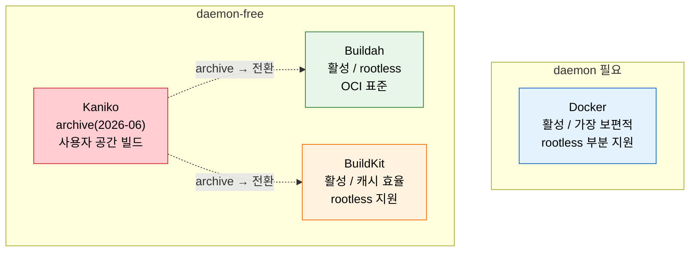
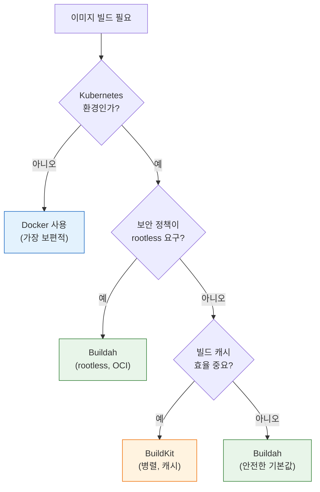

# 빌드 도구 비교와 선택

---

> 컨테이너 이미지 빌드 도구의 선택지와 2026년 기준 권장 사항을 다룹니다.

## §학습 목표

> 이 문서를 읽고 나면 컨테이너 이미지 빌드 도구 4종(Docker / Kaniko / Buildah / BuildKit) 의 *daemon 의존성·rootless 지원* 을 *비교* 할 수 있고, 실행 환경(VM / K8s 일반 / K8s rootless) 에 맞는 도구를 결정 트리로 *선택* 할 수 있으며, Kaniko archive 이후의 *대안 전환 판단* 을 *설명* 할 수 있습니다.

## §사전 지식

> 본 문서는 "daemon-free 빌드", "rootless 컨테이너", "OCI 표준 이미지", "빌드 캐시 효율" 같은 일반 컨테이너 개념을 Docker·Kaniko·Buildah·BuildKit 단위로 좁혀 본 것입니다.

## 1. 컨테이너 이미지 빌드 도구 지형

> 본 절은 *Docker 하나가 정답이던 시대가 끝난* 배경과 daemon-free 대안들의 등장 이유를 다룹니다. K8s 보안 제약이 이 변화의 동력입니다.

> Docker daemon 없이 이미지를 빌드하는 도구가 여럿 등장했습니다. 보안과 환경 제약에 따라 선택이 갈립니다.

컨테이너 이미지를 빌드하는 도구는 더 이상 Docker 하나가 아닙니다. 특히 Kubernetes 환경에서 Docker daemon에 의존하는 빌드가 보안 문제를 일으키면서, daemon 없이 동작하는 대안들이 등장했습니다.

| 도구 | 개발 주체 | daemon 필요 | 핵심 특징 | 2026 상태 |
|------|----------|------------|----------|----------|
| Docker | Docker Inc | 필요 | 가장 보편적, 풍부한 생태계 | 활성 |
| Kaniko | Google | 불필요 | K8s 친화, 사용자 공간 빌드 | **archive (2026-06)** |
| Buildah | Red Hat | 불필요 | rootless, OCI 표준, daemonless | 활성 |
| BuildKit | Docker/Moby | 선택 | 병렬 빌드, 캐시 효율, rootless 지원 | 활성 |

- Kaniko가 2026년 6월부로 archive되면서, 신규 프로젝트에서 daemon 없는 빌드가 필요하면 Buildah나 BuildKit을 선택하는 것이 합리적입니다.
- 기존 Kaniko 사용 파이프라인은 당장 마이그레이션할 필요는 없지만, 장기적으로는 대안을 검토해야 합니다.

### 빌드 도구 지형 한눈에

> *daemon 의존성* 과 *rootless 지원* 두 축으로 4종을 배치하면 선택의 좌표가 분명해집니다.



> 파란색(Docker) 은 *daemon 필요* 영역에 혼자 — VM·단순 환경의 기본값. 빨간색(Kaniko) 은 *archive* 라 신규 도입 비추천, 점선이 전환 방향. 초록색(Buildah) 은 *rootless·OCI 표준* 으로 보안 우선, 주황색(BuildKit) 은 *캐시·속도* 우선입니다.


## 2. Kaniko 사용 예시

> 본 절은 archive 상태인 Kaniko 의 *기존 파이프라인 이해* 를 위한 참고입니다. Pod 안에서 Dockerfile → 레지스트리 푸시 흐름을 정리합니다.

> Kaniko는 Kubernetes Pod 안에서 Dockerfile로 이미지를 빌드하고 레지스트리에 푸시합니다. archive 상태이지만 기존 파이프라인 이해를 위해 정리합니다.

Kaniko는 `gcr.io/kaniko-project/executor` 이미지로 실행합니다. Kubernetes Pod에서 Kaniko 컨테이너를 정의하고, Dockerfile과 빌드 컨텍스트를 지정하면 이미지를 빌드해 레지스트리에 푸시합니다.

```yaml
apiVersion: v1
kind: Pod
spec:
  containers:
  - name: kaniko
    image: gcr.io/kaniko-project/executor:latest
    args:
    - "--dockerfile=Dockerfile"
    - "--context=git://github.com/example/repo.git"
    - "--destination=registry.example.com/myapp:v1.0"
    volumeMounts:
    - name: docker-config
      # 왜 /kaniko/.docker: Kaniko 가 레지스트리 인증 정보를 이 경로에서 읽음
      mountPath: /kaniko/.docker
  volumes:
  - name: docker-config
    configMap:
      name: docker-config
```

- `--dockerfile`: 빌드할 Dockerfile 경로
- `--context`: 빌드 컨텍스트 (Git 저장소나 디렉토리)
- `--destination`: 푸시할 레지스트리 주소와 태그
- `/kaniko/.docker`에 레지스트리 인증 정보를 마운트합니다.


## 3. Buildah 사용 예시

> 본 절은 Buildah 의 *두 빌드 방식* (Dockerfile 호환 vs 네이티브 셸 제어) 과 rootless 강점을 다룹니다.

> Buildah는 Red Hat이 개발한 daemonless 빌드 도구로, rootless 빌드를 지원해 보안이 강합니다.

Buildah는 두 가지 방식으로 이미지를 빌드합니다. 기존 Dockerfile을 그대로 사용하는 `build-using-dockerfile`과, 셸 스크립트로 단계를 제어하는 네이티브 명령입니다.

```bash
# Dockerfile 기반 빌드 — 왜: 기존 Dockerfile 그대로라 마이그레이션 비용 0
buildah build-using-dockerfile -t myapp:v1.0 .

# 네이티브 명령 빌드 (셸로 제어) — 왜: 빌드 단계를 셸로 세밀 제어할 때
container=$(buildah from alpine:3.18)
buildah run $container apk add --no-cache nodejs npm
buildah copy $container . /app
buildah config --cmd "node /app/index.js" $container
buildah commit $container myapp:v1.0
```

- `build-using-dockerfile`은 기존 Dockerfile을 그대로 사용하므로 마이그레이션이 쉽습니다.
- 네이티브 명령은 빌드 과정을 셸 스크립트로 세밀하게 제어할 수 있습니다.
- rootless로 동작하므로 일반 사용자 권한으로 빌드할 수 있어 K8s 보안 정책과 충돌하지 않습니다.


## 4. 빌드 도구 선택 가이드

> 본 절은 *환경 → 보안 제약 → 캐시 요구* 순으로 분기하는 결정 트리를 다룹니다. 첫 분기가 *K8s 인가* 입니다.

> 환경과 제약에 따라 어떤 도구를 선택해야 하는지 결정 트리로 정리합니다.

빌드 도구 선택은 실행 환경과 보안 제약에 따라 달라집니다. 아래 결정 트리를 따릅니다:



각 환경별 권장 사항은 다음과 같습니다:

- **VM 기반 Jenkins**: Docker가 가장 단순하고 안정적입니다. 보안 위험은 Agent 격리로 관리합니다.
- **Kubernetes + 일반 보안**: BuildKit이 캐시 효율과 빌드 속도에서 우수합니다.
- **Kubernetes + 엄격한 보안(rootless 필수)**: Buildah가 OCI 표준을 따르며 rootless를 완전 지원합니다.
- **레거시 Kaniko 파이프라인**: 당장은 유지하되, 신규 빌드는 Buildah/BuildKit으로 전환합니다.


## 5. 정리

> 본 절의 결론은 *2026년 기준 "Docker 가 기본"이라는 공식이 깨졌다* 이고, 환경별 3분기(VM / K8s 보안 / K8s 속도) 가 핵심 산출입니다.

> 2026년 기준, 컨테이너 이미지 빌드는 "Docker가 기본"이라는 공식이 깨졌습니다.

Kubernetes 환경이 보편화되면서 daemon 없는 빌드가 표준이 되어가고 있습니다. Kaniko의 archive는 이 변화를 상징적으로 보여줍니다. 정리하면:

- **VM/단순 환경**: Docker — 검증된 안정성
- **K8s/보안 중시**: Buildah — rootless, OCI 표준
- **K8s/속도 중시**: BuildKit — 병렬 빌드, 캐시 효율

도구는 계속 바뀌지만 핵심 원칙은 변하지 않습니다. 빌드 환경은 재현 가능해야 하고, 보안 제약을 지켜야 하며, 캐시를 활용해 빌드 속도를 확보해야 합니다. 도구 선택은 이 세 가지 원칙을 환경에 맞게 구현하는 수단일 뿐입니다.

---

## §면접 질문

> 자기 답을 떠올린 뒤 `§정답` 절을 펼쳐 비교합니다.

1. *daemon 필요* 와 *daemon-free* 빌드 도구의 차이가 *K8s 보안 정책* 관점에서 왜 결정적입니까?
2. Kaniko 가 archive 됐을 때, 기존 Kaniko 파이프라인을 *당장 마이그레이션하지 않아도 되는* 판단 근거는 무엇입니까?
3. K8s 환경에서 *Buildah 와 BuildKit* 의 갈림 신호는 무엇입니까? 각각 어떤 요구에 맞습니까?
4. VM 기반 Jenkins 에서 굳이 daemon-free 도구를 안 쓰고 Docker 를 쓰는 게 합리적인 이유는 무엇입니까?

## §정답

### Q1 정답

K8s 의 Pod Security Standards `restricted` 프로파일이 *privileged 컨테이너와 hostPath 마운트를 모두 금지* 하기 때문입니다. daemon 필요 도구(Docker via DinD/DooD) 는 (a) DinD = `--privileged`, (b) DooD = `docker.sock` hostPath 마운트 를 요구하므로 *restricted 정책 위반* 입니다. daemon-free 도구(Buildah/BuildKit rootless) 는 *일반 사용자 권한 + 호스트 마운트 없이* 동작하므로 정책을 지키면서 이미지를 빌드합니다. 즉 *엄격한 K8s 보안 환경에서는 daemon-free 가 사실상 유일한 선택* 입니다.

### Q2 정답

archive 는 *유지보수 중단* 이지 *즉시 동작 불가* 가 아니기 때문입니다. 기존 Kaniko 이미지·파이프라인은 *그대로 계속 빌드를 수행* 하므로 운영 중단이 없습니다. 마이그레이션을 미뤄도 되는 근거는 (a) **동작 지속** — 이미 검증된 파이프라인이 깨지지 않음, (b) **전환 비용** — 멀티 파이프라인 동시 전환은 회귀 위험. 다만 *장기적으로는* 보안 패치·신규 K8s 버전 호환성이 끊기므로 *신규 빌드는 Buildah/BuildKit 으로, 기존은 점진 전환* 이 합리적입니다.

### Q3 정답

갈림 신호는 *rootless 강제 여부* 와 *캐시·속도 우선순위* 입니다. (a) **Buildah** — 보안 정책이 *rootless 를 강제* 하거나 *OCI 표준 준수* 가 요구일 때. Red Hat 생태계(OpenShift) 와 궁합. (b) **BuildKit** — *빌드 캐시 효율과 병렬 빌드 속도* 가 우선일 때. 레이어 병렬화·원격 캐시로 큰 빌드가 빠름. 결정 트리상 *rootless 필수면 Buildah, 아니고 캐시 중요하면 BuildKit, 둘 다 아니면 안전한 기본값 Buildah* 입니다.

### Q4 정답

VM 환경에서는 *daemon-free 의 이점(privileged 회피) 이 별 의미가 없고, Docker 의 안정성·생태계 이점이 더 크기* 때문입니다. VM 은 K8s Pod Security Standards 같은 *restricted 정책 제약이 없으므로* Docker daemon 을 그냥 써도 됩니다. 보안 위험(빌드가 호스트 Docker 제어) 은 *Agent 자체를 격리* (전용 빌드 VM, 네트워크 분리) 하는 것으로 관리합니다. 검증된 안정성·풍부한 생태계·익숙한 운영을 *굳이 daemon-free 로 바꿀 동기가 약한* 환경입니다.
