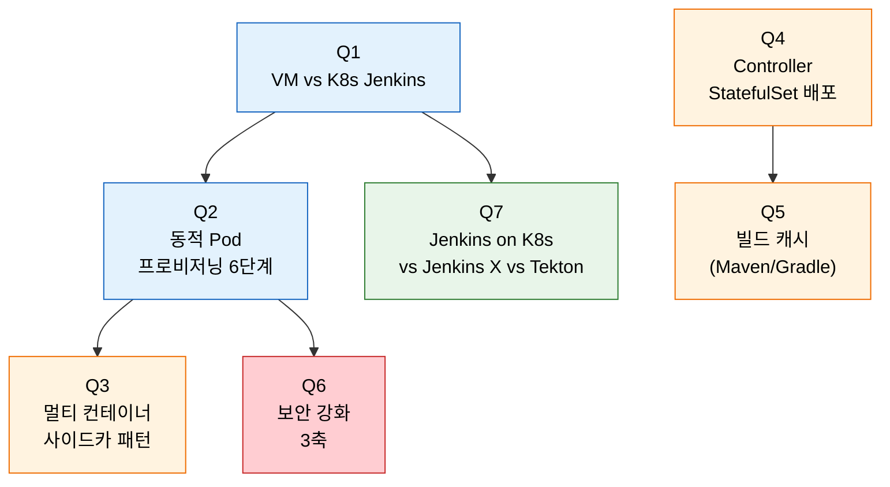
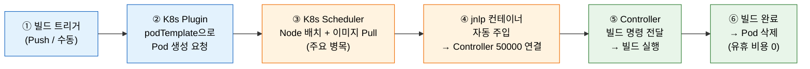

# 7단계 점검 — Kubernetes Jenkins 핵심 질문

---

> 이 점검 문서는 5단계(Kubernetes Agent) 를 다 읽은 뒤 스스로를 시험하기 위한 자가 점검입니다. 먼저 §면접 질문만 보고 답을 떠올린 뒤, §정답 절에서 같은 번호로 대조하세요.

> 다루는 문서: `02-01.Kubernetes Jenkins 구축`, `02-02.Kubernetes Jenkins 운영`

## §학습 목표

> 이 질문들에 막힘 없이 답할 수 있으면 K8s Jenkins 본편 학습이 끝난 것으로 봅니다. 막힌 질문은 본문 해당 절로 돌아가 다시 읽고 다음 회차 복습으로 가져갑니다.

## §사전 지식

> 본 점검은 "동적 Pod 프로비저닝", "사이드카 패턴", "StatefulSet vs Deployment", "RWX/RWO 볼륨 접근 모드", "ServiceAccount 최소 권한 + NetworkPolicy" 같은 일반 K8s 개념을 Jenkins Kubernetes Plugin·Controller 배포·빌드 캐시 단위로 좁혀 본 형태입니다.

## §질문 흐름 한눈에



> 파란색은 *왜 K8s 인가 + 동적 Agent 흐름*, 주황색은 *Pod 구성과 영속성* (사이드카·StatefulSet·캐시), 빨간색은 *보안*, 초록색은 *도구 선택* 입니다.

---

## 면접 질문

> 답을 떠올린 뒤 §정답 절에서 같은 번호로 대조하세요. 각 질문 뒤의 *심화*까지 답할 수 있으면 충분합니다.

1. VM 기반 Jenkins와 Kubernetes 기반 Jenkins의 핵심 차이는? *(심화: K8s Jenkins에서 Agent Pod 이미지 Pull이 병목이 되는 경우 어떻게 해결합니까?)*
2. Kubernetes Plugin의 동적 Agent Pod 프로비저닝 과정을 단계별로 설명할 수 있습니까? *(심화: Kubernetes Plugin 없이 Pod을 직접 생성해 Jenkins Agent로 연결하려면 어떻게 합니까?)*
3. 멀티 컨테이너 Pod Template과 사이드카 패턴을 쓰는 이유는? *(심화: 멀티 컨테이너 Pod에서 컨테이너 간 파일을 공유하려면 어떻게 설정합니까?)*
4. Jenkins Controller를 Deployment가 아닌 StatefulSet으로 배포하는 이유는? *(심화: PVC의 ReclaimPolicy가 Delete일 때 Helm 릴리즈 삭제 시 데이터 손실을 방지하려면 어떻게 합니까?)*
5. K8s Jenkins에서 빌드 캐시(Maven/Gradle)를 어떻게 관리합니까? *(심화: 빌드 캐시 PVC를 ReadWriteOnce(RWO)로만 설정할 수 있는 환경에서 캐시를 공유하려면 어떻게 접근합니까?)*
6. K8s Jenkins에서 보안을 강화하는 핵심 방법은? *(심화: JNLP 연결이 실패할 때 트러블슈팅 접근법은 무엇입니까?)*
7. Jenkins on K8s, Jenkins X, Tekton — 어떤 상황에 어느 것을 선택합니까? *(심화: Tekton Pipeline을 직접 사용할 때 Jenkins Shared Library와 동등한 코드 재사용 메커니즘은 무엇입니까?)*

---

## 정답

> 위 질문을 스스로 설명해 본 뒤에 펼치세요.

### 정답 1 — VM vs K8s Jenkins 핵심 차이

| 항목 | VM 기반 | K8s 기반 |
|------|---------|---------|
| 유휴 비용 | Agent VM을 상시 가동 (평균 사용률 30%면 70%가 낭비) | 빌드 완료 후 Pod 즉시 삭제 → 유휴 비용 0에 수렴 |
| 환경 일관성 | 시간이 지나면 Configuration Drift 발생 | 매번 새 컨테이너 이미지에서 시작 → 빌드 재현성 보장 |
| 스케일링 속도 | VM 추가에 수 분 소요 | Pod 생성은 수 초 |

### 정답 1 심화 — Agent Pod 이미지 Pull 병목 해결

이미지 Pull 병목은 *이미지가 노드에 도달하는 시간* 을 줄여서 해결합니다. (a) **이미지 슬림화** — Multi-stage 빌드로 Agent 이미지를 작게 만들어 pull 시간 단축. (b) **노드 로컬 캐시** — 자주 쓰는 Agent 이미지를 노드에 미리 pull(DaemonSet warmer 또는 `imagePullPolicy: IfNotPresent` + 사전 배포). (c) **내부 레지스트리 미러** — Docker Hub 대신 클러스터 내부/근접 레지스트리(Harbor 등) 에서 pull 해 네트워크 지연 감소. (d) **registry mirror + 레이어 캐시 공유**. 가장 효과 큰 건 *이미지 슬림화 + 내부 미러* 조합입니다.

### 정답 2 — 동적 Agent Pod 프로비저닝 단계

1. 개발자가 코드를 Push → Controller가 빌드를 큐에 추가
2. 가용 Agent 없음 → Kubernetes Plugin이 `podTemplate` 스펙으로 Kubernetes API에 Pod 생성 요청
3. Kubernetes Scheduler가 적절한 Node에 Pod을 배치하고 이미지를 Pull (주요 병목 지점)
4. Pod 내 JNLP 컨테이너가 Controller의 JNLP 포트(50000)에 연결 수립
5. Controller가 연결된 Agent에 빌드 명령 전달 → 빌드 실행
6. 빌드 완료 후 결과를 Controller에 반환 → Plugin이 Pod 삭제

**공식 보충 — jnlp 컨테이너 자동 주입 (출처: jenkins.io/doc/pipeline/steps/kubernetes)**

Kubernetes Plugin은 podTemplate 안에 `jnlp`라는 이름의 컨테이너를 자동으로 생성합니다. 이 컨테이너가 Jenkins inbound agent 역할을 맡아 Controller의 JNLP 포트(50000)에 연결합니다. 기본 agent 이미지를 교체하려면 반드시 컨테이너 이름을 `jnlp`으로 지정해야 합니다. 다른 이름을 쓰면 Plugin이 기본 이미지를 별도로 삽입하므로 두 개의 agent 컨테이너가 공존하는 문제가 발생합니다.

podTemplate에서 자주 쓰이는 옵션은 다음과 같습니다: `privileged`(boolean, DinD 허용 여부), `alwaysPullImage`(boolean, latest 태그 캐시 갱신 강제), `livenessProbe`(컨테이너 헬스체크), `resourceLimitCpu`/`resourceLimitMemory`(리소스 상한). Pipeline 선언 예시는 아래와 같습니다.

```groovy
// 출처: jenkins.io/doc/book/pipeline/syntax
agent {
  kubernetes {
    defaultContainer 'kaniko'
    yaml '''
      apiVersion: v1
      kind: Pod
      spec:
        containers:
        - name: jnlp
          image: jenkins/inbound-agent:latest
        - name: kaniko
          image: gcr.io/kaniko-project/executor:latest
          command: ["/busybox/sh", "-c"]
          args: ["cat"]
          tty: true
    '''
  }
}
```

### 정답 2 심화 — Plugin 없이 직접 JNLP 연결

Plugin 없이 직접 연결하려면 *JNLP inbound agent 를 수동 구성* 합니다. (a) Jenkins UI/JCasC 에서 *permanent agent* 를 하나 등록하고 secret 을 발급. (b) Pod 매니페스트에 `jenkins/inbound-agent` 이미지를 두고 `-url`, `-secret`, `-name` 인자로 Controller JNLP 포트(50000) 에 연결하도록 설정. (c) 그 Pod 를 Deployment 로 띄우면 *항상 살아 있는 정적 K8s Agent* 가 됩니다. 단 이 방식은 *동적 생성/삭제의 이점을 포기* 하므로, GPU 같은 *상시 유지가 필요한 특수 노드* 에만 의미가 있습니다.

**동적 Agent Pod 프로비저닝 흐름**



> ④ jnlp 컨테이너 자동 주입은 Kubernetes Plugin의 핵심 동작입니다. Controller는 별도 설정 없이 inbound 연결을 기다리고, Plugin이 생성한 Pod 안의 jnlp 컨테이너가 먼저 연결을 시작합니다(출처: jenkins.io/doc/pipeline/steps/kubernetes).

### 정답 3 — 멀티 컨테이너 Pod Template과 사이드카 패턴

- **단일 거대 이미지의 문제**: 이미지가 수 GB로 커지고, 도구 하나를 업데이트하려면 전체 이미지를 다시 빌드해야 합니다.
- **멀티 컨테이너 패턴**: Maven, Docker, Node 컨테이너를 분리 → 각자 독립적으로 버전 관리

같은 Pod 내 컨테이너들은 네트워크 네임스페이스와 볼륨을 공유합니다:

- Maven이 빌드한 JAR을 Docker 컨테이너가 즉시 접근해 이미지를 빌드할 수 있는 이유가 이것입니다.
- Jenkinsfile에서 `container('maven')` 블록으로 어느 컨테이너에서 명령을 실행할지 명시합니다.
- JNLP Agent 컨테이너가 기본으로 포함되며 Controller 통신을 담당합니다.
- 나머지 사이드카 컨테이너들은 `command: ['sleep'], args: ['infinity']`로 실행을 유지합니다.

### 정답 3 심화 — 컨테이너 간 파일 공유

컨테이너 간 파일 공유는 *Pod 내 `emptyDir` 볼륨을 공유 마운트* 해서 만듭니다. (a) Pod spec 에 `volumes: - name: workspace emptyDir: {}` 선언. (b) 각 컨테이너의 `volumeMounts` 에 같은 `name: workspace` 를 같은 경로(예: `/home/jenkins/agent`) 로 마운트. (c) 그러면 maven 컨테이너가 빌드한 JAR 을 docker 컨테이너가 *같은 파일시스템 경로* 에서 즉시 읽습니다. Kubernetes Plugin 은 *기본 workspace 볼륨을 자동으로 모든 컨테이너에 공유* 마운트하므로 대부분은 추가 설정 없이 동작합니다.

### 정답 4 — StatefulSet으로 Controller 배포하는 이유

Jenkins Controller는 stateful 애플리케이션입니다. `JENKINS_HOME`에 아래 데이터가 저장됩니다:

- Job 정의, 빌드 히스토리, 플러그인, Credential, 사용자 설정

| 배포 방식 | 특징 | 주의사항 |
|-----------|------|---------|
| StatefulSet | 안정적인 Pod 이름 + PVC 자동 재마운트 보장 | 권장 방식 |
| Deployment | 사용 가능하지만 반드시 `replicas: 1`로 제한 | 2개 이상이면 동일 `JENKINS_HOME` 공유로 데이터 손상 |

Jenkins Controller는 Active-Active를 지원하지 않습니다.

### 정답 4 심화 — ReclaimPolicy Delete 환경에서 데이터 보호

ReclaimPolicy 가 Delete 면 *PV 가 PVC 삭제 시 함께 삭제* 되므로, Helm 릴리스 삭제가 곧 데이터 손실입니다. 방지책은 (a) **ReclaimPolicy 를 Retain 으로 변경** — `kubectl patch pv <pv> -p '{"spec":{"persistentVolumeReclaimPolicy":"Retain"}}'` 로 PVC 가 지워져도 PV/디스크가 남게. (b) **Helm `resource-policy: keep` 어노테이션** — PVC 매니페스트에 `helm.sh/resource-policy: keep` 을 박아 `helm uninstall` 시 PVC 를 *건너뛰게*. (c) **정기 백업** — `JENKINS_HOME` 을 별도 백업(velero, 스냅샷). 운영에서는 *Retain + 백업* 을 함께 둡니다.

### 정답 5 — 빌드 캐시 관리 (Maven/Gradle)

Agent Pod은 빌드마다 새로 생성되므로, 캐시를 관리하지 않으면 매번 수백 MB의 의존성을 다운로드합니다.

- **PVC 기반 캐시**: `.m2/repository`를 ReadWriteMany(RWX) PVC로 마운트 → 여러 Pod이 동시에 접근 가능
  - RWX 지원 스토리지: NFS, CephFS, AWS EFS
- **동시 쓰기 충돌 문제**: 여러 빌드가 동시에 같은 의존성 파일을 쓰면 충돌 발생
  - 해결책: Maven의 `-Dmaven.repo.local` 옵션으로 Pod별 로컬 저장소 분리, 읽기만 공유 캐시에서 수행

### 정답 5 심화 — RWO 환경에서 캐시 공유 전략

RWO 만 가능한 환경에서는 *동시 쓰기 공유* 가 불가하므로 *읽기 전용 공유 + 쓰기 분리* 또는 *원격 캐시* 로 우회합니다. (a) **읽기 전용 베이스 + 로컬 쓰기** — 공유 캐시를 RWO 로 한 Pod 가 주기적으로 채우고(`warmer` 잡), 빌드 Pod 는 그 스냅샷을 *읽기 전용* 으로 마운트하거나 init container 로 복사. (b) **원격 캐시 레지스트리** — PVC 대신 Nexus/Artifactory 같은 *네트워크 의존성 프록시* 를 두어 RWO 제약 자체를 우회 — 모든 Pod 가 HTTP 로 캐시 접근. RWO 환경의 표준은 *원격 프록시 캐시* 입니다.

### 정답 6 — 보안 강화 3축

- **ServiceAccount 최소 권한**: Controller SA에 Agent Pod 생성/조회/삭제 RBAC 권한만 부여합니다. Secret 접근이나 다른 네임스페이스 접근은 차단합니다.
- **Docker-in-Docker 대체**: `privileged: true`는 호스트 커널에 완전한 접근 권한을 주므로 컨테이너 탈출 공격에 취약합니다. Kaniko나 BuildKit rootless로 대체합니다.
- **NetworkPolicy**: Agent Pod의 네트워크 대상을 명시적으로 제한합니다. Controller, 내부 컨테이너 레지스트리, SCM 서버만 허용, 나머지는 deny-all.

**공식 보충 — Kaniko 동작 원리 (출처: github.com/GoogleContainerTools/kaniko)**

Kaniko는 Docker daemon 없이 Dockerfile로 이미지를 빌드합니다. 동작 방식은 base 이미지 파일시스템을 추출한 뒤 Dockerfile 명령을 순차 실행하고, 각 명령 실행 후 *userspace에서 파일시스템 스냅샷*(체크섬 비교)을 찍어 변경된 부분만 차등 tarball 레이어로 append합니다. userspace 스냅샷 방식이기 때문에 storage driver나 container runtime에 의존하지 않아 이식성이 높고, `privileged: true` 없이도 동작합니다. DinD(Docker-in-Docker)와 DooD(Docker-outside-of-Docker) 모두 호스트 소켓 또는 privileged 권한을 요구하지만, Kaniko는 일반 컨테이너 권한만으로 동일한 결과를 만들어 냅니다.

### 정답 6 심화 — JNLP 연결 실패 트러블슈팅

JNLP 연결 실패 트러블슈팅은 *연결 경로를 단계별로 좁히는* 순서입니다. (a) **Pod 로그 확인** — `kubectl logs <agent-pod> -c jnlp` 로 JNLP 컨테이너가 어떤 에러로 죽는지 확인 (잘못된 secret, 잘못된 URL 이 흔함). (b) **네트워크 도달성** — Agent Pod 에서 Controller JNLP 포트(50000) 와 HTTP 포트로 `nc -zv` 도달 테스트. NetworkPolicy 가 너무 빡빡해 막은 경우가 흔함. (c) **JNLP 포트 노출 확인** — Controller Service 가 50000 포트를 노출하는지, `Manage Jenkins > Security` 에서 *고정 포트* 로 설정됐는지. (d) **이미지 버전 불일치** — inbound-agent 이미지와 Controller remoting 버전 호환성. 보통 (a)→(b) 순서로 80% 가 잡힙니다.

### 정답 7 — Jenkins on K8s vs Jenkins X vs Tekton 선택 기준

| 도구 | 특징 | 적합한 상황 |
|------|------|------------|
| Jenkins on K8s | 기존 Jenkins 자산(Shared Library, 플러그인, Jenkinsfile) 유지 | 레거시 파이프라인을 K8s 환경으로 이전하는 팀 |
| Jenkins X | 내부 엔진은 Tekton. GitOps + Preview Environment 내장 | K8s 네이티브 CI/CD를 처음부터 구축하는 새 프로젝트 |
| Tekton | Kubernetes CRD로 파이프라인 정의. 최종 사용자 도구보다 빌딩 블록에 가까움 | 내부 개발자 플랫폼(IDP)의 파이프라인 엔진을 구축하는 플랫폼 팀 |

### 정답 7 심화 — Tekton 코드 재사용 메커니즘

Tekton 의 코드 재사용 메커니즘은 *Task / ClusterTask 와 Tekton Hub* 입니다. (a) **Task** — 재사용 가능한 단위 작업을 CRD 로 정의해 여러 Pipeline 에서 참조 (Jenkins 의 `vars/` 전역 함수에 대응). (b) **ClusterTask** — 클러스터 전역에서 공유되는 Task (네임스페이스 무관 재사용). (c) **Tekton Hub** — 커뮤니티가 만든 Task 를 가져다 쓰는 레지스트리 (Jenkins 플러그인 마켓플레이스 + Shared Library 의 혼합 성격). 차이는 Jenkins Shared Library 가 *Groovy 코드 재사용* 이라면 Tekton 은 *선언적 CRD 재사용* 이라는 점입니다.
