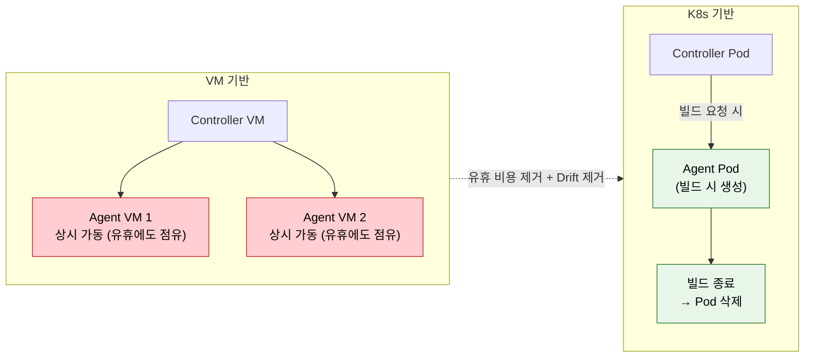
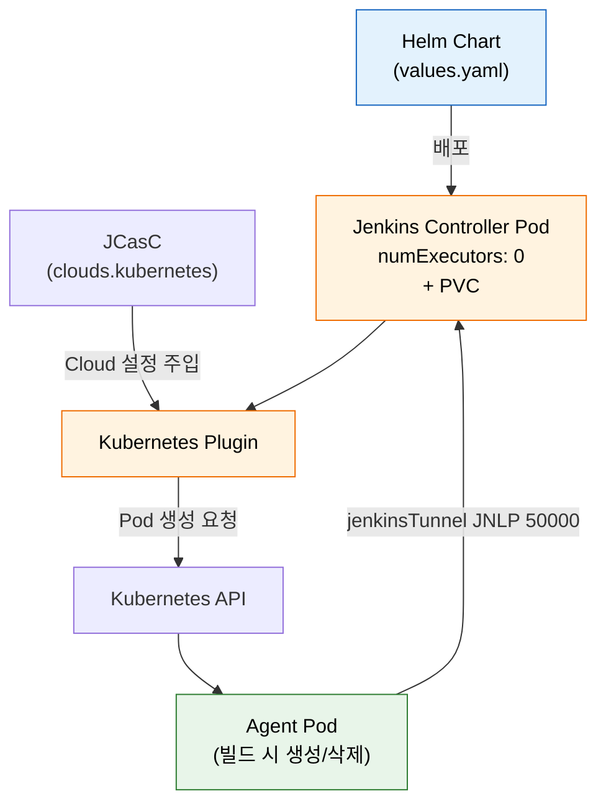

# Kubernetes Jenkins 구축

---

> 이 문서를 읽고 나면 VM 기반 Jenkins 의 한계(유휴 비용·Configuration Drift)를 K8s 가 어떤 메커니즘으로 푸는지 *설명* 하고, Helm + Kubernetes Plugin + JCasC 조합으로 동적 Agent 환경을 *구축* 하며, Agent Pod 이 빌드마다 생성·삭제되는 수명주기를 검증 절차로 *확인* 하고, `numExecutors: 0` 같은 설정값을 *선택* 한 근거를 보안 관점에서 *비교* 할 수 있습니다.


## 사전 지식

> 본 문서는 "Helm 패키지 배포", "동적 Pod 프로비저닝", "JNLP 터널 연결", "설정의 코드화(JCasC)" 같은 일반 K8s 개념을 Jenkins Helm Chart·Kubernetes Plugin·Pod Template 단위로 좁혀 본 것입니다.


## 진입 — 왜 빌드 환경을 매번 새로 짓는가

> 빌드 서버를 "한 번 세워두고 계속 쓰는 고정 설비" 로 보던 관점을, "필요할 때마다 짓고 끝나면 허무는 일회용 작업 공간" 으로 뒤집은 것이 K8s Jenkins 의 출발점입니다.

전통적인 CI 서버는 빌드 머신을 한 번 구성해 두고 모든 빌드를 그 위에서 돌렸습니다. 그런데 이 방식은 시간이 흐를수록 두 가지 비용을 키웠습니다. 빌드가 없는 밤에도 머신이 켜져 있어 자원을 점유했고, 누군가 손으로 패키지를 깔거나 설정을 바꾸면서 "내 머신에서는 됐는데" 라는 환경 격차가 누적됐습니다. Kubernetes 는 컨테이너 이미지를 생성·삭제 단위로 다루는 모델을 이미 갖고 있었기 때문에, 빌드 환경 자체를 이미지에서 매번 새로 찍어내면 두 비용이 동시에 사라진다는 발상으로 이어졌습니다. 이 편은 그 발상을 Helm·Kubernetes Plugin·JCasC 세 도구로 실제 구축하는 절차를 다룹니다.


## 1. 왜 Kubernetes에 Jenkins를 올리는가

> 본 절은 VM Jenkins 의 두 한계(유휴 비용·Drift) 와 K8s 의 해법을 다룹니다. 동적 Pod 가 *빌드 시에만 생성* 되는 게 핵심 전환점입니다.

> 동적 Agent Pod 은 이미 아는 VM 기반 Agent 의 *수명주기 측면* 을 일반화한 것입니다. 상시 켜져 있던 빌드 머신을 "요청 시 생성, 종료 시 삭제" 하는 자동 프로비저닝으로 바꿨을 뿐, 빌드를 격리된 노드에서 돌린다는 본질은 같습니다.

VM 기반 Jenkins는 Agent를 상시 가동해야 하므로 유휴 비용이 큽니다. 빌드가 없는 시간에도 Agent VM이 계속 돌아가며 리소스를 점유합니다. 또한 Agent 환경이 시간이 지나면서 달라지는 Configuration Drift 문제가 있습니다.

Pod Template 을 일상의 비유로 옮기면 *빌드용 일회용 작업 천막* 에 가깝습니다. 행사 때마다 천막을 치고 끝나면 걷어내듯, 빌드 요청마다 명세(Pod Template)대로 Pod 을 세우고 빌드가 끝나면 철거합니다. 이 비유는 "필요할 때만 세우고 끝나면 흔적을 남기지 않는다" 까지는 정확합니다. 다만 천막은 같은 천막을 옮겨 다시 칠 수 있지만, K8s Pod 은 기본적으로 매번 *새 이미지에서 새로 찍어내는* 것이라 이전 빌드 상태가 전혀 이어지지 않는다는 점에서 비유가 깨집니다. 이 "이전 상태가 절대 이어지지 않는다" 는 특성이 바로 Configuration Drift 를 원천 차단하는 지점입니다.

Kubernetes 기반 Jenkins는 이 문제들을 해결합니다:

- **유휴 비용 제거**: 빌드가 필요할 때만 Agent Pod을 생성하고, 완료 후 삭제합니다.
- **환경 일관성**: 매번 동일한 컨테이너 이미지에서 시작하므로 Drift가 없습니다.
- **빠른 스케일링**: Pod 생성은 이미지가 노드에 캐시돼 있으면 보통 수 초, 이미지를 새로 받아야 하면 수십 초 단위입니다. VM 부팅이 분 단위인 것과 비교하면 한 자릿수 이상 짧습니다.

| 구분 | VM Agent | K8s Agent Pod |
|------|----------|----------------|
| 기동 시간 | 분 단위 (OS 부팅 포함) | 수 초 (이미지 캐시 시) ~ 수십 초 (이미지 pull 시) |
| 연결 타임아웃 기본값 | (인프라마다 상이) | `slaveConnectTimeout` 기본 1000초 (출처: plugins.jenkins.io/kubernetes) |
| 유휴 점유 | 상시 (빌드 없어도 켜짐) | 0 에 수렴 (종료 시 삭제) |
| Drift | 누적됨 | 매 빌드 새 이미지라 없음 |

### VM vs K8s Jenkins 자원 모델

> *상시 점유* 와 *온디맨드 생성* 의 차이를 한 그림으로 정리합니다. 유휴 비용의 위치가 다릅니다.



> 빨간색(VM Agent) 은 *빌드가 없어도 켜져 있어* 유휴 비용을 만듭니다. 초록색(K8s Agent Pod) 은 *빌드 요청 시 생성, 종료 시 삭제* 라 유휴 비용이 0 에 수렴하고, 매번 새 이미지에서 시작하므로 Configuration Drift 도 사라집니다.


## 2. Helm으로 Jenkins 설치

> 본 절은 Helm Chart 로 Jenkins 를 배포하는 표준 절차를 다룹니다. `numExecutors: 0` + persistence 가 보안·영속성 기본값입니다.

Jenkins 공식 Helm 차트를 사용하면 복잡한 Kubernetes 리소스를 한 번에 배포할 수 있습니다.

```bash
helm repo add jenkins https://charts.jenkins.io
helm repo update
# 왜 --create-namespace: jenkins 네임스페이스를 격리 단위로 분리해 RBAC/NetworkPolicy 적용 용이
helm install jenkins jenkins/jenkins -n jenkins --create-namespace -f values.yaml
```

핵심 values.yaml 설정은 다음과 같습니다:

```yaml
controller:
  numExecutors: 0          # 왜 0: Controller 에서 빌드 금지 — secrets/ 노출 차단 (보안 기본값)
  installPlugins:
    - kubernetes
    - workflow-aggregator
    - git
    - configuration-as-code
  serviceType: ClusterIP
persistence:
  enabled: true            # 왜 enabled: PVC 로 JENKINS_HOME 영속화 — Pod 재시작에도 설정 보존
  size: "20Gi"
agent:
  enabled: true
```

- `numExecutors: 0`으로 Controller에서 빌드를 실행하지 않게 합니다. Jenkins 공식 문서도 controller 의 executor 수를 0 으로 두어 빌드를 격리된 Agent 로만 보내는 것을 권장합니다. executor 1 개가 곧 동시 빌드 1 개에 대응하므로, 0 이면 controller 자체로는 어떤 빌드도 받지 않습니다(출처: jenkins.io/doc/book/using/using-agents).
- `persistence`로 JENKINS_HOME을 영속화합니다.
- Kubernetes Plugin 이 Agent Pod 을 만들고 지우려면 controller Pod 에 바인딩된 ServiceAccount 가 해당 네임스페이스에서 Pod 을 생성·삭제할 충분한 권한을 가져야 합니다(출처: plugins.jenkins.io/kubernetes). 이 SA 권한이 곧 §3 의 보안 논점과 직결됩니다.


## 2.1 jenkinsUrl·JCasC configScripts·Nginx Ingress 노출

> Helm chart 의 `values.yaml` 은 설치뿐 아니라 *접속 URL·JCasC 설정·외부 노출* 까지 한 파일에서 선언하게 해 줍니다.

앞 절의 `values.yaml` 은 플러그인과 영속성에 집중했습니다. 실제 운영에서는 접속 URL, JCasC 설정, 외부 노출까지 같은 파일에 묶어 선언합니다.

`controller.jenkinsUrl` 은 Jenkins 가 자기 자신을 가리키는 정규 URL 입니다. webhook 콜백 주소나 빌드 로그의 링크가 이 값을 기준으로 생성되므로, Ingress 로 노출할 외부 주소와 일치시켜야 합니다. `controller.JCasC.configScripts` 아래에는 JCasC YAML 을 인라인으로 적을 수 있어, 별도 `jenkins.yaml` 파일 없이 Helm 값만으로 시스템 메시지·보안 영역 같은 설정을 선언합니다(출처: github.com/jenkinsci/helm-charts).

```yaml
controller:
  jenkinsUrl: "https://jenkins.example.com"   # 왜: webhook·로그 링크가 이 주소를 기준으로 생성됨
  JCasC:
    configScripts:
      welcome: |                              # 왜 인라인: 별도 jenkins.yaml 없이 Helm 값만으로 JCasC 적용
        jenkins:
          systemMessage: "Helm + JCasC 로 배포된 Jenkins"
ingress:
  enabled: true
  ingressClassName: nginx                     # 왜 nginx: Nginx Ingress Controller 가 외부 트래픽을 이 서비스로 라우팅
  hostName: jenkins.example.com
```

외부 노출은 Nginx Ingress Controller 가 담당합니다. K8s 서비스를 `ClusterIP` 로 두면 클러스터 내부에서만 접근되므로, Ingress 리소스를 만들어 `jenkins.example.com` 같은 호스트로 들어온 HTTP/HTTPS 트래픽을 Jenkins 서비스(8080)로 라우팅합니다. 클라우드 관리형 K8s(AKS·EKS·GKE)에서는 Ingress Controller 가 클라우드 로드밸런서를 자동 프로비저닝해 공용 IP 를 할당합니다. 설치·노출·업그레이드는 `helm install` 과 `helm upgrade -f values.yaml` 로 일관되게 처리하며, IaC 관점의 배포 묶음은 `../06_planning/06-03` 에서 다룹니다.


## 3. Kubernetes Plugin 설정

> 본 절은 동적 Agent Pod 생성의 핵심인 Kubernetes Plugin Cloud 설정을 다룹니다. `jenkinsTunnel` 과 `containerCapStr` 가 연결·동시성의 핵심 파라미터입니다.

Kubernetes Plugin은 빌드 요청 시 Pod을 동적으로 생성합니다. JCasC로 설정하면 다음과 같습니다:

```yaml
jenkins:
  clouds:
    - kubernetes:
        name: "kubernetes"
        # 왜 default 주소: 클러스터 내부에서 API Server 에 접근하는 표준 DNS
        serverUrl: "https://kubernetes.default"
        namespace: "jenkins"
        jenkinsUrl: "http://jenkins:8080"
        # 왜 jenkinsTunnel: Agent 가 Controller 에 JNLP(50000) 로 역연결하는 경로
        jenkinsTunnel: "jenkins-agent:50000"
        containerCapStr: "10"   # 동시 생성 가능한 최대 Pod 수 (동시성 상한)
        # 왜 명시: 외부 클러스터·느린 이미지 pull 환경에서 기본 1000초로는 빌드가 오래 매달림
        connectTimeout: 100      # slaveConnectTimeout 기본 1000초를 짧게 조정 (출처: plugins.jenkins.io/kubernetes)
        templates:
          - name: "default"
            label: "jenkins-agent"
            containers:
              # 왜 이름이 'jnlp' 고정: Plugin 이 이 이름의 컨테이너를 inbound agent 진입점으로 자동 인식
              - name: "jnlp"
                image: "jenkins/inbound-agent:latest"
                # 왜 비워둠: JENKINS_URL/JENKINS_SECRET/JENKINS_AGENT_NAME 은 Plugin 이 주입하므로 손대지 않음
```

- `serverUrl`은 클러스터 내부에서 접근하는 Kubernetes API 주소입니다.
- `jenkinsTunnel`은 Agent가 Controller에 연결할 때 사용하는 JNLP 포트입니다. inbound agent 컨테이너는 Plugin 이 주입하는 `JENKINS_URL`·`JENKINS_SECRET`·`JENKINS_AGENT_NAME` 환경변수로 controller 에 역연결하며, `jenkinsTunnel` 이 그 인바운드 연결의 엔드포인트를 가리킵니다(출처: plugins.jenkins.io/kubernetes). 이름이 `jnlp` 인 컨테이너가 이 inbound agent 를 실행하는 관례이며, 다른 이름을 쓰면 Plugin 이 진입점을 못 찾습니다.
- `containerCapStr`은 동시에 생성할 수 있는 최대 Pod 수입니다.
- `slaveConnectTimeout` 은 Agent 가 controller 에 붙기까지 기다리는 시간이며 기본값은 1000초입니다(출처: plugins.jenkins.io/kubernetes). 외부 클러스터를 WebSocket 으로 연결하거나 이미지 pull 이 느린 환경에서는 이 값이 빌드 대기 시간을 좌우하므로 환경에 맞게 줄입니다.
- 이 외에 `idleMinutes`(마지막 step 이후 Pod 재사용 유지 시간), `podRetention`(`never()`/`onFailure()`/`always()`/`evicted()`/`default()`), `activeDeadlineSeconds`(Pod 삭제 데드라인), `inheritFrom`(템플릿 상속)도 동작을 세밀하게 제어합니다(출처: plugins.jenkins.io/kubernetes). orphaned Pod 을 청소하는 GC 는 기본 비활성이라, 누수가 의심되면 명시적으로 켜야 합니다.

### 구축 컴포넌트 연결 한눈에

> Helm · Kubernetes Plugin · JCasC 세 컴포넌트가 *어떻게 맞물려* 동적 Agent 를 만드는지 정리합니다.



> 파란색(Helm) 이 *배포 단계*, 주황색(Controller + Plugin) 이 *상시 운영*, 초록색(Agent Pod) 이 *빌드별 휘발성* 입니다. JCasC 가 Plugin 에 Cloud 설정을 주입하고, Plugin 이 빌드 요청마다 API 로 Pod 를 만들면, Pod 가 `jenkinsTunnel` 로 Controller 에 역연결해 Agent 로 등록됩니다.


## 4. 구축 검증

> 본 절은 *Pod 가 실제로 생성·삭제되는지* 를 확인하는 최소 검증 절차를 다룹니다. `kubectl get pods` 로 생성·소멸을 눈으로 확인합니다.

설치가 완료되면 간단한 파이프라인으로 동작을 검증합니다:

```groovy
pipeline {
    agent {
        kubernetes {
            // 왜 인라인 yaml: 검증 단계라 별도 podTemplate 등록 없이 Pod 명세를 한곳에 둠
            yaml '''
            apiVersion: v1
            kind: Pod
            spec:
              containers:
              # 왜 jnlp 컨테이너를 안 적음: Plugin 이 inbound agent용 jnlp 컨테이너를 자동 주입
              - name: busybox
                image: busybox
                # 왜 sleep infinity: 컨테이너가 즉시 종료되면 step 실행 전에 Pod 가 사라짐 — 살려둠
                command: ['sleep', 'infinity']
            '''
        }
    }
    stages {
        stage('Test') {
            steps {
                // 왜 container('busybox'): jnlp 가 아닌 사용자 컨테이너에서 명령을 실행하도록 전환
                container('busybox') {
                    sh 'echo "Hello from K8s agent"'
                }
            }
        }
    }
}
```

빌드를 실행하면 다음을 확인할 수 있습니다:

- `kubectl get pods -n jenkins`로 Agent Pod이 생성되는 것을 확인합니다.
- 빌드가 끝나면 Pod이 자동으로 삭제됩니다.
- Jenkins 로그에서 JNLP 연결 성공 메시지를 확인합니다.


## 5. 정리

> 본 절의 결론 한 줄은 *K8s Jenkins 구축 = Helm(배포) + Kubernetes Plugin(동적 Agent) + JCasC(설정 코드화) 의 조합* 입니다.

Helm으로 Jenkins를 배포하고, Kubernetes Plugin으로 동적 Agent를 구성하며, JCasC로 모든 설정을 코드화하는 것이 표준 구축 패턴입니다. 이렇게 구축하면 Jenkins 자체가 선언적으로 관리되어 재현 가능하고, 빌드는 동적 Pod에서 격리되어 실행됩니다. 다음 단계는 운영(백업, 모니터링, 보안)이며 `02-02.Kubernetes Jenkins 운영` 에서 다룹니다.


## 면접 질문

> 답을 떠올린 뒤 §정답 절에서 같은 번호로 대조하세요. 각 질문 뒤의 *심화*까지 답할 수 있으면 충분합니다.

1. VM Jenkins 의 두 한계(유휴 비용·Configuration Drift) 를 K8s 가 *각각 어떤 메커니즘* 으로 해결합니까? *(심화: 이미지 기반이라는 K8s 의 본질이 두 문제를 동시에 푸는 이유는 무엇입니까?)*
2. Helm `values.yaml` 의 `controller.numExecutors: 0` 이 *K8s 환경에서 특히* 중요한 이유는 무엇입니까? *(심화: Controller Pod 이 클러스터 SA 권한을 보유한다는 사실이 왜 VM 보다 위험을 높입니까?)*
3. `jenkinsTunnel` 설정이 빠지거나 잘못되면 *어떤 증상* 이 나타납니까? *(심화: `jnlp` 컨테이너가 반드시 "jnlp"라는 이름을 가져야 하는 이유는 무엇입니까?)*
4. 구축 검증에서 `kubectl get pods -n jenkins` 로 *무엇을 두 번* 확인해야 검증이 완료됩니까? *(심화: 생성은 되지만 삭제가 안 되면 어떤 문제가 쌓입니까?)*

### 빈칸 채우기 — Kubernetes Plugin 핵심 파라미터

> 빈칸을 채운 뒤 문서 끝 '빈칸 정답' 절에서 대조하세요.

1. Agent 가 controller 에 붙기까지 기다리는 시간인 `slaveConnectTimeout` 의 기본값은 ____ 초입니다.
2. Plugin 이 inbound agent 진입점으로 자동 인식하는 컨테이너의 이름은 `____` 입니다.
3. inbound agent 컨테이너가 controller 에 역연결할 때 Plugin 이 주입하는 환경변수 세 가지는 `JENKINS_URL`·`____`·`JENKINS_AGENT_NAME` 입니다.
4. orphaned Pod 을 제거하는 GC 는 기본적으로 (활성 / ____) 상태입니다.
5. Controller 의 executor 수를 ____ 로 두면 controller 자체로는 어떤 빌드도 받지 않습니다.


## 정답

> 위 질문을 스스로 설명해 본 뒤에 펼치세요.

### 정답 1 — VM 한계와 K8s 해법

(a) **유휴 비용** — VM 은 Agent 를 *상시 가동* 하므로 빌드 없는 시간에도 리소스를 점유합니다. K8s 는 *빌드 요청 시 Pod 생성, 종료 시 삭제* 라 유휴 시간 점유가 0 에 수렴합니다. (b) **Configuration Drift** — VM Agent 는 시간이 지나며 패치·수동 변경으로 환경이 *조금씩 달라집니다*. K8s 는 *매 빌드가 동일한 컨테이너 이미지에서 시작* 하므로 Drift 자체가 발생하지 않습니다. 두 한계 모두 *동적·이미지 기반* 이라는 K8s 의 본질로 풀립니다.

### 정답 1 심화 — 이미지 기반이 두 문제를 동시에 푸는 이유

컨테이너 이미지는 *불변 스냅샷* 이므로, 빌드마다 새 이미지에서 시작하면 이전 빌드의 잔재가 남지 않습니다. 유휴 비용은 "쓸 때만 생성" 정책으로, Drift 는 "항상 동일한 기준점에서 시작" 정책으로 각각 제거되는데, 이 두 정책이 모두 *이미지를 생성·삭제 단위로 쓰는 K8s 의 Pod 모델* 에서 자연스럽게 나옵니다.

### 정답 2 — numExecutors: 0 의 K8s 특수 중요성

K8s 환경에서 Controller 는 *Pod 로 떠 있고 모든 시크릿·설정이 PVC 에 영속* 되므로, Controller 위에서 빌드를 돌리면 *침해된 빌드가 클러스터 전체의 진입점* 이 됩니다. `numExecutors: 0` 은 *빌드 실행 면을 동적 Agent Pod 로 완전히 분리* 해, Controller 는 *오케스트레이션만* 하고 빌드는 *격리된 휘발성 Pod* 에서만 돌게 합니다. VM 보다 K8s 에서 더 중요한 이유는 *Controller 가 클러스터 API 접근 권한(SA)* 까지 들고 있어 침해 시 피해가 훨씬 크기 때문입니다.

### 정답 2 심화 — Controller SA 권한과 위험 증폭

K8s Controller Pod 에 바인딩된 ServiceAccount 는 Agent Pod 생성·삭제를 위해 클러스터 API 권한을 보유합니다. Controller 위에서 악의적 빌드가 실행되면 해당 SA 토큰으로 클러스터 전체 리소스에 접근할 수 있습니다. `numExecutors: 0` 으로 Controller 를 빌드 실행에서 완전히 배제하는 것이 이 공격 면을 닫는 최소 보안 기본값입니다.

### 정답 3 — jenkinsTunnel 오설정 증상

*Agent Pod 가 생성은 되지만 Controller 에 연결되지 못하는* 증상이 납니다. `jenkinsTunnel` 은 Agent 가 Controller 의 JNLP 포트(50000) 로 *역연결* 하는 경로인데, 이게 빠지거나 잘못된 주소면 Pod 는 떠도 *JNLP 핸드셰이크가 실패* 합니다. 결과적으로 빌드는 *Pod 가 연결되기를 기다리며 무한 대기* 하다가 타임아웃되고, `kubectl logs <pod> -c jnlp` 에 연결 거부/타임아웃 에러가 찍힙니다. Controller Service 가 50000 포트를 노출하는지와 함께 확인해야 합니다.

### 정답 3 심화 — jnlp 컨테이너 이름 규칙

Jenkins Kubernetes Plugin 은 podTemplate 안에 컨테이너 이름이 `"jnlp"` 인 컨테이너를 자동으로 찾아 inbound agent 를 실행합니다(출처: [jenkins.io/doc/pipeline/steps/kubernetes](https://www.jenkins.io/doc/pipeline/steps/kubernetes/)). 기본 agent 이미지를 교체하려면 컨테이너 이름을 반드시 `"jnlp"` 로 지정해야 하며, 이름이 다르면 Plugin 이 해당 컨테이너를 agent 진입점으로 인식하지 못합니다. podTemplate 에는 `privileged`(boolean), `alwaysPullImage`(boolean, latest 태그 캐시 강제 갱신), `livenessProbe`, `resourceLimitCpu` 같은 추가 옵션도 지원됩니다.

### 정답 4 — 검증 두 시점

*생성* 과 *삭제* 를 두 번 확인해야 합니다. (a) 빌드 시작 직후 `kubectl get pods -n jenkins` 에 *Agent Pod 가 새로 뜨는지* — 동적 프로비저닝이 작동하는 증거. (b) 빌드 종료 후 다시 조회해 *그 Pod 가 사라지는지* — 정리(cleanup) 가 작동하는 증거. 생성만 되고 삭제가 안 되면 *Pod 누수* 로 클러스터 자원이 쌓이고, 생성 자체가 안 되면 Plugin/RBAC 설정 문제입니다. 두 시점 확인이 끝나야 *동적 Agent 의 전체 수명주기* 가 검증됩니다.

### 정답 4 심화 — Pod 누수의 누적 영향

삭제가 작동하지 않으면 완료된 빌드의 Pod 가 `Completed` 또는 좀비 상태로 남아 네임스페이스에 계속 쌓입니다. 클러스터 자원(CPU·메모리 request 예약)이 소진되어 이후 빌드가 *Pending* 으로 대기하거나 스케줄링되지 못하는 문제가 발생합니다. `containerCapStr` 한도와 맞물려 동시 빌드 수가 의도치 않게 제한될 수 있으므로 정기적으로 `kubectl get pods -n jenkins` 로 잔여 Pod 를 확인하는 것이 권장됩니다.

### 빈칸 정답 — Kubernetes Plugin 핵심 파라미터

1. `1000` 초 (출처: plugins.jenkins.io/kubernetes)
2. `jnlp` — Plugin 이 이 이름의 컨테이너를 inbound agent 진입점으로 자동 인식합니다.
3. `JENKINS_SECRET` — `JENKINS_URL`·`JENKINS_SECRET`·`JENKINS_AGENT_NAME` 세 변수로 controller 에 역연결합니다(출처: plugins.jenkins.io/kubernetes).
4. `비활성` — orphaned Pod GC 는 기본 비활성이라 누수가 의심되면 명시적으로 켜야 합니다.
5. `0` — `numExecutors: 0` 이면 controller 가 빌드를 받지 않아 빌드 실행 면이 동적 Agent Pod 로 완전히 분리됩니다(출처: jenkins.io/doc/book/using/using-agents).


## 관련 문서

> 이 편은 K8s 위에 Jenkins 를 *처음 세우는* 구축 단계를 다룹니다. 구축 이후 일상 운영(백업·모니터링·보안)은 02-02 로, Pod Template 의 전제가 되는 Agent/Executor 개념은 01-01 로, K8s 환경에서 어떤 빌드 도구를 선택해야 하는지는 01-04 로 연결됩니다.

  - [02-02. Kubernetes Jenkins 운영](02-02.Kubernetes%20Jenkins%20운영.md) — K8s Jenkins 운영 (백업·모니터링·보안 § 운영 패턴)
  - [01-01. 실행환경으로서의 Agent](01-01.실행환경으로서의%20Agent.md) — Agent/Executor 개념 § Pod Template 의 전제
  - [01-04. 빌드 도구 비교와 선택](01-04.빌드%20도구%20비교와%20선택.md) — K8s 빌드 도구 선택 § 환경별 적합 도구 판단
