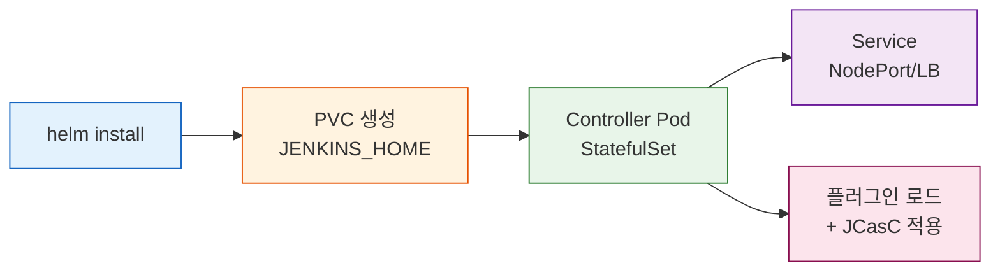
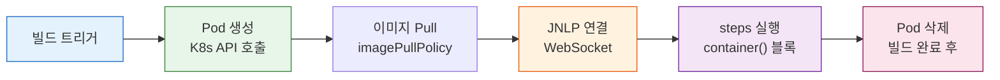

# Kubernetes Jenkins 구축

---

> Jenkins를 K8s 위에서 확장하는 방법을 다룬다.

## 1. 왜 Kubernetes인가

> Docker Compose 기반 Jenkins의 구조적 한계와 Kubernetes가 그 한계를 어떻게 해소하는지 비교한다.

Docker Compose로 Jenkins를 운영하면 단일 호스트의 자원 한계에 묶인다. 동시 빌드가 늘어나도 에이전트를 추가하려면 새 VM을 프로비저닝하고 SSH 연결을 수동으로 설정해야 한다. 자원이 부족하면 빌드 큐가 쌓이고, 자원이 남으면 유휴 VM이 비용을 낭비한다.

Kubernetes는 이 두 문제를 동시에 해결한다. 빌드 요청이 들어오면 에이전트 Pod를 동적으로 생성하고, 빌드가 끝나면 삭제한다. Cluster Autoscaler와 연동하면 노드 자체도 자동 확장·축소된다.

**Docker Compose vs Kubernetes 비교**

| 항목 | Docker Compose | Kubernetes |
|------|---------------|-----------|
| 에이전트 확장 | VM 추가 + SSH 수동 설정 | Pod 동적 생성/삭제 |
| 자원 효율 | 유휴 VM 비용 낭비 | 빌드 후 Pod 삭제 → 자원 반환 |
| 복구 | 컨테이너 재시작 (수동) | 컨트롤러 자동 재시작 + PVC 상태 유지 |
| 설정 관리 | 파일 직접 수정 | Helm + JCasC로 Git 관리 |
| 의존성 격리 | 호스트 공유 | Pod별 독립 환경 |

Kubernetes가 제공하는 핵심 이점은 다음과 같다:

- **동적 Pod 생성**: 빌드마다 독립 Pod가 생성되므로 의존성 충돌 없이 격리된 환경에서 실행된다.
- **자동 복구**: 컨트롤러 Pod가 죽으면 Kubernetes가 즉시 재시작한다. PVC에 데이터를 보관하므로 상태가 유지된다.
- **선언적 관리**: Helm Chart와 JCasC(Jenkins Configuration as Code)로 전체 설정을 Git에 보관하고 재현 가능하게 관리한다.
- **자원 격리**: 각 빌드에 리소스 요청·제한을 명시하므로 하나의 빌드가 클러스터 자원을 독점하지 못한다.

## 2. Helm Chart로 설치하기

> Helm이 사실상 표준인 이유와 `values.yaml`의 핵심 섹션, 설치 후 자주 겪는 함정을 다룬다.

Jenkins를 Kubernetes에 설치하는 방법은 세 가지다: Helm Chart, 수동 YAML, Jenkins Operator. 그 중 Helm Chart가 사실상 표준이다. 공식 문서, Stack Overflow 답변, 블로그 대부분이 Helm 기반이므로 트러블슈팅 자료도 가장 풍부하다.

**설치 흐름**



핵심 `values.yaml` 구성은 `controller`, `persistence`, `agent` 세 섹션으로 나뉜다:

```yaml
controller:
  serviceType: NodePort
  nodePort: 30880
  resources:
    requests:
      cpu: 250m
      memory: 1Gi
    limits:
      cpu: 1000m
      memory: 2Gi
  javaOpts: "-Xms512m -Xmx1024m"
  installPlugins:
    - kubernetes:latest
    - workflow-aggregator:latest
    - git:latest
    - configuration-as-code:latest

persistence:
  enabled: true
  storageClass: nfs
  size: 5Gi

agent:
  enabled: true
  resources:
    requests:
      cpu: 100m
      memory: 256Mi
    limits:
      cpu: 500m
      memory: 512Mi
```

`javaOpts`의 `-Xmx`는 컨테이너 limits의 50~70% 수준으로 설정한다. 컨테이너 limits와 JVM 힙이 맞지 않으면 OOMKilled가 발생한다. `persistence` 섹션은 Jenkins 홈 디렉토리(`/var/jenkins_home`)를 PVC로 영속화한다. `installPlugins`에서 `kubernetes` 플러그인이 핵심이며, 이 플러그인이 Jenkins와 Kubernetes API를 연결하여 동적 에이전트 Pod를 관리한다.

저장소 추가부터 설치까지의 전체 흐름이다:

```bash
helm repo add jenkins https://charts.jenkins.io
helm repo update

helm install jenkins jenkins/jenkins \
  -n jenkins --create-namespace \
  -f values.yaml

# 초기 admin 비밀번호 확인
kubectl get secret jenkins -n jenkins \
  -o jsonpath="{.data.jenkins-admin-password}" | base64 -d
```

설치 직후 자주 겪는 함정이 있다. `controller.jenkinsUrl`을 설정하지 않으면 Jenkins가 Pod IP를 자신의 URL로 인식한다. Pod가 재시작되면 IP가 바뀌므로 Webhook 콜백과 빌드 링크가 모두 깨진다. `values.yaml`에 `jenkinsUrl`을 Service 이름이나 Ingress 도메인으로 명시해야 한다.

## 3. Kubernetes Plugin과 Pod Agent

> Kubernetes Plugin이 에이전트 Pod를 어떻게 생성하고 회수하는지, 다중 컨테이너 패턴과 콜드 스타트 문제를 다룬다.

Kubernetes Plugin은 Jenkins에서 가장 널리 쓰이는 에이전트 관리 방식이다. 핵심 동작 원리는 다음과 같다:

- **빌드 요청 수신**: 컨트롤러가 빌드를 스케줄링하면 Kubernetes API를 호출하여 에이전트 Pod를 생성한다.
- **JNLP 연결**: 에이전트 Pod 내의 JNLP 컨테이너가 컨트롤러에 WebSocket으로 연결하여 작업을 수신한다.
- **빌드 실행**: 각 스테이지가 지정된 컨테이너 내에서 실행된다.
- **Pod 삭제**: 빌드가 완료되면 에이전트 Pod가 자동으로 삭제된다.

**Pod Agent 라이프사이클**



컨트롤러를 Kubernetes 안에서 실행할 필요는 없다. 온프레미스나 VM에서 돌아가는 Jenkins 컨트롤러도 Kubernetes API 엔드포인트에 접근할 수 있으면 동일하게 동적 에이전트를 사용할 수 있다.

Pod 템플릿은 JCasC나 Jenkinsfile에서 정의한다. Jenkinsfile에서 인라인으로 정의하는 방식이 가장 유연하다:

```groovy
pipeline {
    agent {
        kubernetes {
            yaml '''
apiVersion: v1
kind: Pod
spec:
  containers:
  - name: maven
    image: maven:3.9-eclipse-temurin-17
    command: ['sleep']
    args: ['infinity']
    resources:
      requests:
        cpu: 500m
        memory: 1Gi
  - name: docker
    image: docker:27-dind
    securityContext:
      privileged: true
'''
        }
    }
    stages {
        stage('Build') {
            steps {
                container('maven') {
                    sh 'mvn clean package -DskipTests'
                }
            }
        }
        stage('Docker Build') {
            steps {
                container('docker') {
                    sh 'docker build -t myapp:latest .'
                }
            }
        }
    }
}
```

`container()` 블록으로 각 스테이지가 사용할 컨테이너를 지정한다. 하나의 Pod 안에 여러 컨테이너를 넣는 다중 컨테이너 패턴을 사용하면 Maven 빌드와 Docker 빌드가 같은 워크스페이스를 공유하면서 독립 이미지로 실행된다. `command: ['sleep', 'infinity']`는 Jenkins가 작업을 전달할 때까지 컨테이너를 대기 상태로 유지하는 관용 패턴이다.

동적 에이전트의 최대 약점은 콜드 스타트다. 이미지 풀, Pod 스케줄링, JNLP 연결 세 단계를 합산하면 첫 빌드에 30초~3분의 오버헤드가 발생할 수 있다. 다음 두 가지로 이 지연을 크게 줄일 수 있다:

- **DaemonSet 프리풀**: 자주 쓰는 이미지를 모든 노드에 미리 다운로드해 두면 이미지 Pull 단계가 생략된다.
- **고정 버전 태그 + IfNotPresent**: `imagePullPolicy: IfNotPresent`와 특정 버전 태그를 조합하면 이미 풀된 이미지는 재다운로드하지 않는다.

## 4. 정적 Agent와 하이브리드 전략

> 동적 에이전트만으로 해결하기 어려운 케이스와 정적 에이전트를 함께 사용하는 하이브리드 전략을 다룬다.

정적 에이전트는 빌드 유무와 관계없이 항상 실행 중인 에이전트 Pod다. StatefulSet으로 배포하고 영구 PVC를 마운트하며 JNLP로 컨트롤러에 상시 연결된다. 빌드 요청이 들어오면 즉시 작업을 시작하므로 콜드 스타트가 없다.

정적 에이전트가 적합한 경우는 다음과 같다:

- **특수 하드웨어**: GPU, FPGA처럼 Pod 생성 시마다 연결 설정이 어려운 장치가 필요할 때
- **노드 기반 라이선스**: SonarQube Enterprise, Fortify처럼 노드 단위로 라이선스가 부과되는 도구를 사용할 때
- **증분 빌드 캐시**: Maven의 `.m2`, Gradle의 `.gradle` 캐시를 유지하여 빌드 시간을 크게 단축해야 할 때

실무에서는 동적 에이전트와 정적 에이전트를 함께 사용하는 하이브리드 전략이 가장 효과적이다. 라우팅은 라벨 기반으로 구현한다:

```groovy
pipeline {
    agent none
    stages {
        stage('Build & Test') {
            agent { label 'dynamic-maven' }
            steps {
                container('maven') {
                    sh 'mvn clean verify'
                }
            }
        }
        stage('Security Scan') {
            // 노드 기반 라이선스 도구: 정적 에이전트로 라우팅
            agent { label 'fortify-static' }
            steps {
                sh 'sourceanalyzer -b myapp -scan'
            }
        }
        stage('ML Model Validation') {
            // GPU 전용 작업: GPU 노드에 고정된 정적 에이전트로 라우팅
            agent { label 'gpu-static' }
            steps {
                sh 'python validate_model.py'
            }
        }
    }
}
```

Kubernetes Plugin은 `dynamic-maven` 라벨에 매칭되는 Pod 템플릿을 기반으로 동적 Pod를 생성하고, `fortify-static`·`gpu-static` 라벨은 미리 등록된 정적 에이전트 노드로 라우팅된다. 대부분의 빌드는 동적 에이전트로 처리하고, GPU나 라이선스 도구처럼 명확한 이유가 있는 경우에만 정적 에이전트를 추가하는 것이 비용과 운영 복잡도의 균형을 잡는 실무적 선택이다.
