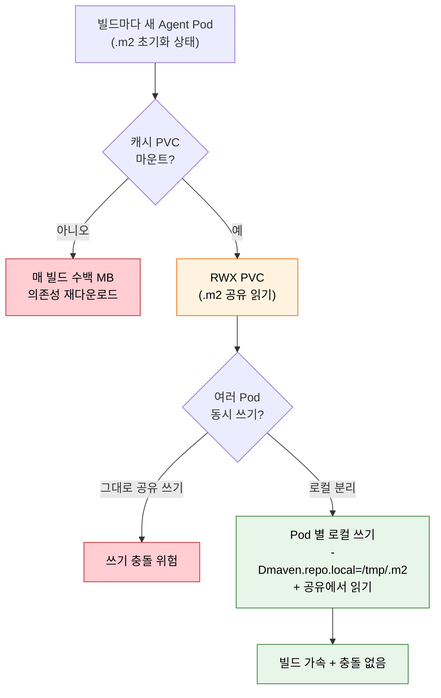
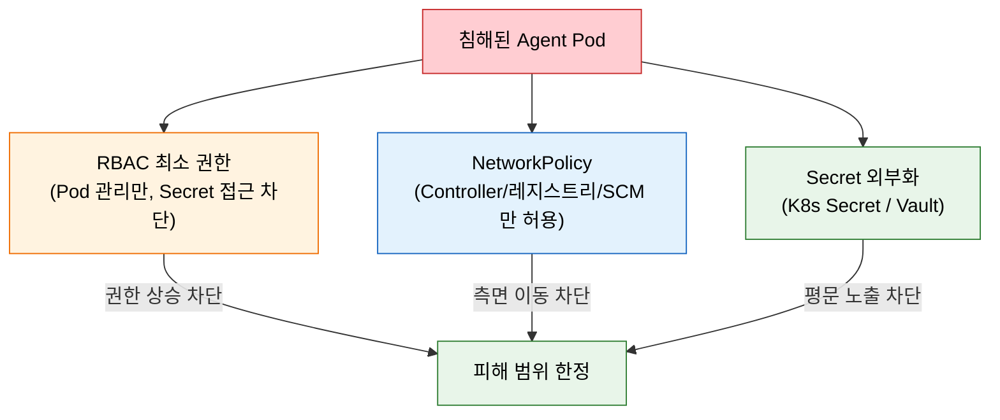

# Kubernetes Jenkins 운영

---

> Helm 배포, 빌드 캐시, 보안 강화 등 K8s Jenkins 운영의 핵심을 다룹니다.

## §학습 목표

> 이 문서를 읽고 나면 Helm `values.yaml` 로 Jenkins 를 배포하는 핵심 설정을 *설명* 할 수 있고, 동적 Agent 의 빌드 캐시 문제를 PVC + 로컬/공유 분리 전략으로 *해결* 할 수 있으며, K8s Jenkins 보안 3축(RBAC / NetworkPolicy / Secret) 과 모니터링·중앙 로깅의 필요성을 *예측* 할 수 있습니다.

## §사전 지식

> 본 문서는 "Helm 패키지 배포", "PVC 기반 캐시 + RWX/로컬 분리", "ServiceAccount 최소 권한 RBAC", "Prometheus 메트릭 + 중앙 로깅" 같은 일반 K8s 운영 개념을 Jenkins Helm Chart·Pod Template·Agent 운영 단위로 좁혀 본 것입니다.

## 1. Helm으로 Jenkins 배포

> 본 절은 *수십 개 매니페스트를 `values.yaml` 하나로* 묶는 Helm 배포 패턴을 다룹니다. `numExecutors: 0` + persistence 가 보안·영속성의 기본값입니다.

> Helm은 Kubernetes 패키지 매니저로, 복잡한 Jenkins 배포를 values.yaml 하나로 관리합니다.

Kubernetes에 Jenkins를 배포하는 표준 방법은 공식 Helm 차트를 쓰는 것입니다. Helm은 수십 개의 YAML 매니페스트를 하나의 차트로 묶고, `values.yaml`로 설정을 주입합니다.

```bash
helm repo add jenkins https://charts.jenkins.io
helm install jenkins jenkins/jenkins -n jenkins -f values.yaml
```

핵심 `values.yaml` 구성은 다음과 같습니다:

```yaml
controller:
  numExecutors: 0          # 왜 0: Controller 에서 빌드 실행 금지 — secrets/ 노출 차단 (보안)
  installPlugins:
    - kubernetes
    - workflow-aggregator
    - git
    - configuration-as-code
  resources:
    requests:
      cpu: "1"
      memory: "2Gi"
    limits:
      cpu: "2"
      memory: "4Gi"
  JCasC:
    defaultConfig: true
persistence:
  enabled: true            # 왜 enabled: PVC 로 JENKINS_HOME 영속화 — Pod 재시작에도 설정 보존
  size: "20Gi"
agent:
  enabled: true
  podTemplates: {}
```

- `numExecutors: 0`은 Controller에서 빌드를 실행하지 않게 합니다. 보안의 기본입니다.
- `persistence`는 PVC를 생성해 `JENKINS_HOME`을 영속화합니다.
- `installPlugins`로 필수 플러그인을 자동 설치합니다.


## 2. 빌드 캐시 전략

> 본 절은 동적 Agent 의 *가장 큰 단점인 캐시 초기화* 와 그 해법을 다룹니다. RWX PVC 공유 + Pod 별 로컬 쓰기 분리가 충돌 회피의 핵심입니다.

> 동적 Agent는 매번 새로 생성되므로, 캐시 없이는 매 빌드마다 의존성을 새로 받습니다.

Kubernetes 동적 Agent의 가장 큰 단점은 빌드 캐시입니다. Pod이 매번 새로 생성되므로, 의존성 캐시(Maven `.m2`, Gradle `.gradle`, npm `node_modules`)가 빌드마다 초기화됩니다. 해결책은 PVC를 캐시로 마운트하는 것입니다.

```yaml
# Pod Template에 캐시 볼륨 마운트
spec:
  containers:
  - name: maven
    image: maven:3.9-eclipse-temurin-17
    volumeMounts:
    - name: maven-cache
      mountPath: /root/.m2   # 왜 .m2 마운트: 의존성을 빌드 간에 유지해 재다운로드 방지
  volumes:
  - name: maven-cache
    persistentVolumeClaim:
      claimName: maven-cache-pvc
```

- PVC를 `.m2`에 마운트하면 의존성이 빌드 간에 유지됩니다.
- 단, 여러 Pod이 동시에 같은 PVC에 쓰면 충돌이 발생할 수 있습니다.
- ReadWriteMany(RWX)를 지원하는 스토리지(NFS, EFS)가 필요합니다.

동시 쓰기 충돌을 피하려면 Pod별로 로컬 저장소를 분리하고 읽기만 공유하는 전략을 씁니다:

```groovy
// 왜 -Dmaven.repo.local=/tmp/.m2: Pod 별 로컬 쓰기로 분리해 동시 쓰기 충돌 회피
sh 'mvn -Dmaven.repo.local=/tmp/.m2 dependency:go-offline'
```

### 동적 Agent 캐시 흐름 한눈에

> *왜 캐시가 필요하고, 공유와 충돌을 어떻게 양립* 시키는지를 한 그림으로 정리합니다.



> 빨간색은 *사고 경로* — 캐시 없으면 재다운로드, 공유에 그대로 쓰면 충돌. 초록색이 정답 — *공유 캐시에서 읽되 쓰기는 Pod 별 로컬* 로 분리하면 가속과 안전을 동시에 얻습니다.


## 3. 보안 강화

> 본 절은 K8s Jenkins 보안 3축(RBAC 최소 권한 / NetworkPolicy / Secret) 을 다룹니다. Controller SA 에 *Agent Pod 관리 권한만* 주는 게 최소 권한의 핵심입니다.

> K8s Jenkins는 RBAC, NetworkPolicy, Secret 관리로 공격 표면을 줄입니다.

Kubernetes Jenkins의 보안은 세 가지 축으로 강화합니다.

첫째, ServiceAccount와 RBAC로 권한을 최소화합니다. Jenkins Controller가 Agent Pod을 생성·삭제할 수 있는 최소 권한만 부여합니다.

```yaml
apiVersion: rbac.authorization.k8s.io/v1
kind: Role
metadata:
  name: jenkins-agent
  namespace: jenkins
rules:
# 왜 pods 만: Controller 가 Agent Pod 만 관리하면 되고 Secret/타 네임스페이스는 불필요
- apiGroups: [""]
  resources: ["pods"]
  verbs: ["create", "delete", "get", "list", "watch"]
- apiGroups: [""]
  resources: ["pods/exec"]
  verbs: ["create"]
- apiGroups: [""]
  resources: ["pods/log"]
  verbs: ["get", "list"]
```

둘째, NetworkPolicy로 네트워크를 격리합니다. Agent Pod이 불필요한 외부와 통신하지 못하게 막습니다.

세 보안 축이 *각각 다른 공격 경로* 를 막는 모습은 다음과 같습니다.

> RBAC 는 *권한*, NetworkPolicy 는 *네트워크 도달*, Secret 외부화는 *노출* 을 막습니다 — 겹쳐야 깊은 방어가 됩니다.



> 침해된 Pod(빨간색) 가 세 방어선에 각각 막힙니다 — RBAC 은 *권한 상승*, NetworkPolicy 는 *내부망 측면 이동*, Secret 외부화는 *시크릿 평문 노출* 을 차단합니다. 한 축만으로는 다른 경로가 열리므로 셋을 함께 둡니다.

셋째, Secret을 안전하게 관리합니다. Kubernetes Secret이나 외부 Secret 매니저(Vault, AWS Secrets Manager)를 씁니다.

```yaml
# Kubernetes Secret을 환경변수로 주입
spec:
  containers:
  - name: build
    env:
    - name: DB_PASSWORD
      valueFrom:
        # 왜 secretKeyRef: 평문 대신 K8s Secret 에서 참조 주입 — 매니페스트에 비밀값 미노출
        secretKeyRef:
          name: db-secret
          key: password
```


## 4. 모니터링과 로깅

> 본 절은 *동적 Agent 의 휘발성* 때문에 모니터링·중앙 로깅이 *필수* 인 이유를 다룹니다. Pod 삭제 = 로그 소멸이라 외부 보존이 사후 분석의 전제입니다.

> Prometheus로 메트릭을 수집하고, 중앙 로깅으로 빌드 로그를 보존합니다.

Kubernetes Jenkins 운영에는 모니터링이 필수입니다. Prometheus Plugin으로 Jenkins 메트릭을 노출하고, Prometheus가 수집합니다.

```yaml
# Prometheus Plugin 메트릭 노출
controller:
  prometheus:
    enabled: true
    serviceMonitorAdditionalLabels:
      release: prometheus
```

- Jenkins 큐 길이, 빌드 시간, Executor 사용률 등을 메트릭으로 수집합니다.
- Grafana 대시보드로 시각화하면 빌드 병목을 한눈에 파악할 수 있습니다.
- 빌드 로그는 Pod 삭제와 함께 사라지므로, 중앙 로깅(EFK, Loki)으로 보존합니다.

중앙 로깅이 중요한 이유는 동적 Agent의 특성 때문입니다. 빌드가 끝나면 Pod이 삭제되고, Pod 안의 로그도 함께 사라집니다. 빌드 실패를 사후 분석하려면 로그가 외부에 보존되어야 합니다.


## 5. 정리

> 본 절의 결론 한 줄은 *K8s Jenkins 운영 = 캐시 · 보안 · 모니터링 세 균형* 이고, 셋이 갖춰지면 VM 기반보다 효율적이고 안전한 플랫폼이 된다는 것입니다.

> K8s Jenkins 운영은 캐시, 보안, 모니터링의 균형입니다.

동적 Agent는 효율적이지만 운영 복잡도가 따라옵니다. 캐시로 빌드 속도를 확보하고, RBAC·NetworkPolicy로 보안을 지키며, 모니터링·중앙 로깅으로 가시성을 확보해야 합니다. 이 세 가지가 갖춰지면 K8s Jenkins는 VM 기반보다 효율적이고 안전한 CI/CD 플랫폼이 됩니다.

---

## §면접 질문

> 자기 답을 떠올린 뒤 `§정답` 절을 펼쳐 비교합니다.

1. Helm `values.yaml` 에서 `controller.numExecutors: 0` 과 `persistence.enabled: true` 가 각각 *어떤 운영 위험* 을 막습니까?
2. 동적 Agent 캐시에서 *RWX PVC 를 그대로 공유 쓰기* 하면 어떤 문제가 생기고, *Pod 별 로컬 쓰기 분리* 는 이를 어떻게 해결합니까?
3. Jenkins Controller ServiceAccount 에 *Secret 접근 권한을 주지 않는* 게 왜 최소 권한 원칙에 맞습니까?
4. 동적 Agent 환경에서 *중앙 로깅이 없으면* 정확히 어떤 운영 시나리오에서 곤란해집니까?

## §정답

### Q1 정답

(a) **`numExecutors: 0`** — Controller 에서 빌드가 실행되는 것을 막습니다. Controller 위에서 빌드 스크립트가 돌면 `JENKINS_HOME/secrets/`·다른 잡 기록·크레덴셜에 직접 접근할 수 있으므로, 0 으로 두면 *빌드 실행 면을 Agent 로 완전히 격리* 해 이 위험을 차단합니다. (b) **`persistence.enabled: true`** — PVC 로 `JENKINS_HOME` 을 영속화해 *Pod 재시작 시 설정·잡·빌드 기록이 사라지는* 위험을 막습니다. K8s 는 Pod 를 언제든 재스케줄하므로 영속 볼륨 없이는 재시작 = 전체 초기화입니다.

### Q2 정답

RWX PVC 를 여러 빌드 Pod 가 *동시에 같은 `.m2` 에 쓰면* 같은 의존성 파일을 동시에 다운로드·기록하다 *파일 손상·부분 쓰기* 충돌이 납니다. 해결은 *읽기는 공유, 쓰기는 분리* — `-Dmaven.repo.local=/tmp/.m2` 로 각 Pod 가 *자기 로컬 경로에 쓰고*, 공유 캐시는 *읽기 전용 베이스* 로만 활용합니다. 그러면 가속(이미 받은 의존성 재사용) 과 안전(쓰기 충돌 없음) 을 동시에 얻습니다.

### Q3 정답

Controller 가 하는 일은 *Agent Pod 를 생성·삭제·조회* 하는 것뿐이라 *Secret 읽기 권한이 업무에 불필요* 하기 때문입니다. 최소 권한 원칙은 *업무에 필요한 권한만* 부여하는 것 — Controller SA 에 Secret 접근을 주면, Controller 가 침해됐을 때 *클러스터의 모든 Secret 이 노출* 됩니다. Pod 관리 권한만 주면 침해 시에도 *피해가 Pod 조작* 으로 한정됩니다. 시크릿은 *Agent Pod 가 자기 spec 의 `secretKeyRef` 로 직접 받는* 구조라 Controller 가 중계할 이유도 없습니다.

### Q4 정답

*빌드 실패 사후 분석* 시나리오에서 곤란해집니다. 동적 Agent 는 빌드가 끝나면 *Pod 가 즉시 삭제* 되고 *Pod 안의 빌드 로그도 함께 사라집니다*. 중앙 로깅(EFK/Loki) 이 없으면 (a) 실패한 빌드의 로그를 *Pod 가 살아 있는 짧은 순간에만* 볼 수 있고, (b) *간헐적/재현 어려운 실패* 는 로그가 이미 사라져 원인 추적 불가, (c) *컴플라이언스 감사* 에서 과거 빌드 기록을 요구해도 제출 불가. 그래서 로그를 *Pod 수명과 무관하게* 외부에 보존하는 게 동적 환경의 전제입니다.
