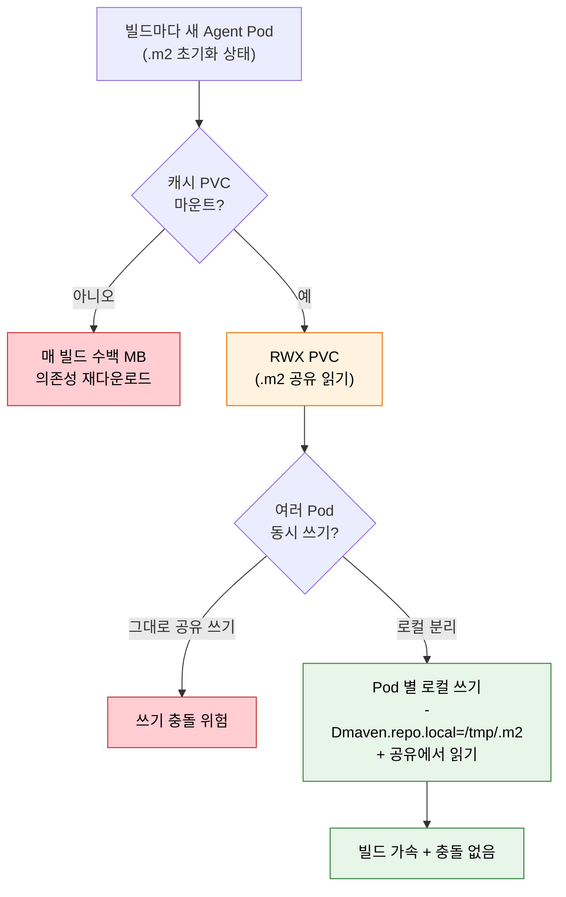
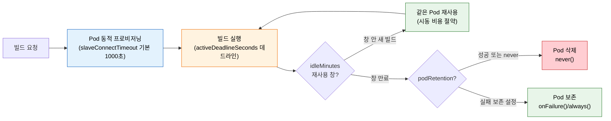
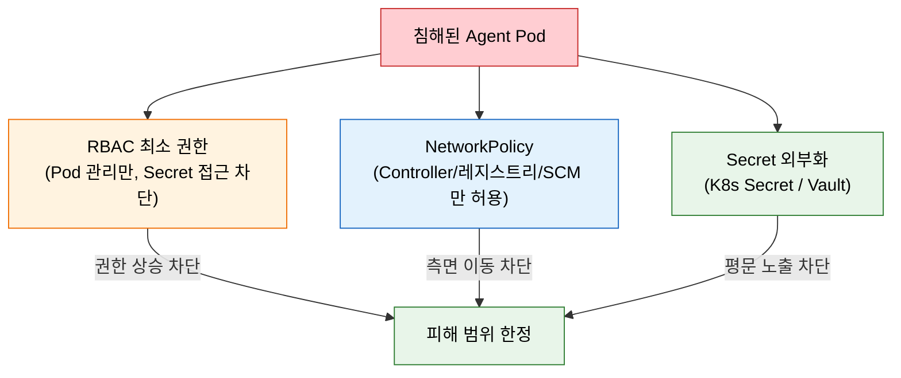

# Kubernetes Jenkins 운영

---

> 이 문서를 읽고 나면 Helm `values.yaml` 로 Jenkins 를 배포하는 핵심 설정을 *설명* 하고, 동적 Agent 의 빌드 캐시 문제를 PVC + 로컬/공유 분리 전략으로 *해결* 하며, `podRetention`·`idleMinutes`·`slaveConnectTimeout` 같은 Pod 수명 옵션을 *비교* 해 운영 상황에 맞게 *선택* 할 수 있습니다. K8s Jenkins 보안 3축(RBAC / NetworkPolicy / Secret) 과 중앙 로깅이 없을 때의 실패 시나리오도 *예측* 할 수 있습니다.


## 사전 지식

> 본 문서는 "Helm 패키지 배포", "PVC 기반 캐시 + RWX/로컬 분리", "ServiceAccount 최소 권한 RBAC", "Prometheus 메트릭 + 중앙 로깅" 같은 일반 K8s 운영 개념을 Jenkins Helm Chart·Pod Template·Agent 운영 단위로 좁혀 본 것입니다. 동적 Agent 생명주기(01-01)와 K8s Jenkins 구축 절차(02-01)를 먼저 읽고 오면 본문이 매끄럽게 이어집니다.


## 진입 — 왜 운영 단계가 따로 필요한가

> 구축이 "돌아가게 만드는 것"이라면, 운영은 "돌아간 뒤에도 빠르고 안전하게 유지하는 것"입니다.

K8s Jenkins 를 구축(02-01)하면 빌드는 일단 돕니다. 그런데 동적 Agent 는 빌드가 끝날 때마다 Pod 를 통째로 버리는 구조라, 구축만으로는 세 가지 운영 비용이 그대로 남습니다. 첫째, 매 빌드가 의존성을 처음부터 다시 받아 느립니다. 둘째, 빌드 컨테이너 안에서 임의 스크립트가 도는데 그 컨테이너가 클러스터 권한을 쥐고 있으면 침해 시 피해가 클러스터 전체로 번집니다. 셋째, Pod 가 사라지면 로그도 함께 사라져 실패를 사후에 분석할 수 없습니다. 운영 단계는 이 세 비용을 캐시·보안·관측성으로 각각 갚는 작업입니다.


## 1. 운영 관점에서 다시 보는 values.yaml

> 본 절은 *설치 그 자체* 가 아니라, 설치 이후 운영하며 다시 손대는 `values.yaml` 키를 다룹니다. Helm 차트 배포 절차(`helm install` + `numExecutors: 0`·persistence 기본값)는 [02-01. Kubernetes Jenkins 구축](02-01.Kubernetes%20Jenkins%20구축.md) § "Helm으로 Jenkins 설치" 가 정본입니다.

구축 단계에서 한 번 잡은 `values.yaml` 은 운영 중에도 자원·수명·보안 설정을 조정하며 계속 다시 엽니다. 그 중 운영자가 가장 자주 헷갈리는 키 하나가 `resources` 입니다.

```yaml
controller:
  resources:
    requests:
      cpu: "1"
      memory: "2Gi"        # 왜 request 기준: Controller JVM heap 은 request 메모리에서 유도되므로 limit 만 키워도 heap 은 안 늘어남
    limits:
      cpu: "2"
      memory: "4Gi"
```

- `resources` 의 `requests`/`limits` 는 단순 스케줄링 힌트가 아닙니다. Jenkins Kubernetes plugin 은 Agent Pod 의 JVM heap 을 *memory request 에서 유도* 하므로, request 를 너무 낮게 잡으면 limit 가 커도 heap 이 작아 OOM 이 납니다 (출처: plugins.jenkins.io/kubernetes). 운영 중 "limit 를 올렸는데도 OOM 이 계속 난다" 면 거의 이 함정입니다 — request 를 함께 올려야 heap 이 커집니다.
- `numExecutors: 0`·`persistence` 같은 보안·영속성 기본값의 근거는 02-01 § "Helm으로 Jenkins 설치" 를 참조합니다. 운영 단계에서 이 두 값은 *바꾸지 않는 고정값* 으로 두고, 자원·수명·보안 정책만 조정하는 것이 안전합니다.


## 2. 빌드 캐시 전략

> 본 절은 동적 Agent 의 *가장 큰 단점인 캐시 초기화* 와 그 해법을 다룹니다. RWX PVC 공유 + Pod 별 로컬 쓰기 분리가 충돌 회피의 핵심입니다.

Kubernetes 동적 Agent의 가장 큰 단점은 빌드 캐시입니다. Pod이 매번 새로 생성되므로, 의존성 캐시(Maven `.m2`, Gradle `.gradle`, npm `node_modules`)가 빌드마다 초기화됩니다. 해결책은 PVC를 캐시로 마운트하는 것입니다.

빌드마다 Pod 를 새로 띄우는 방식은 *호텔 객실* 에 비유할 수 있습니다. 매번 깨끗하게 청소된 빈 방(새 워크스페이스)을 받으니 이전 손님 흔적이 남지 않아 격리는 완벽합니다. 그런데 짐(의존성 캐시)도 같이 비워지므로 매번 풀어야 합니다. 이 비유는 *격리와 청결* 까지는 잘 들어맞지만, *공용 창고(RWX PVC)를 여러 방이 동시에 뒤지는* 상황에서는 깨집니다 — 호텔 객실은 서로 독립이지만, 여러 Pod 가 같은 PVC 에 동시에 쓰면 파일이 충돌합니다.

```yaml
# Pod Template에 캐시 볼륨 마운트
spec:
  containers:
  - name: maven
    image: maven:3.9-eclipse-temurin-17
    volumeMounts:
    - name: maven-cache
      mountPath: /root/.m2   # 왜 .m2 마운트: 의존성을 빌드 간에 유지해 재다운로드 방지 (매 빌드 수백 MB 절약)
  volumes:
  - name: maven-cache
    persistentVolumeClaim:
      claimName: maven-cache-pvc   # 왜 PVC: Pod 가 사라져도 캐시는 볼륨에 남아 다음 빌드가 재사용
```

- PVC를 `.m2`에 마운트하면 의존성이 빌드 간에 유지됩니다.
- 단, 여러 Pod이 동시에 같은 PVC에 쓰면 충돌이 발생할 수 있습니다.
- ReadWriteMany(RWX)를 지원하는 스토리지(NFS, EFS)가 필요합니다.

동시 쓰기 충돌을 피하려면 Pod별로 로컬 저장소를 분리하고 읽기만 공유하는 전략을 씁니다:

```groovy
// 왜 -Dmaven.repo.local=/tmp/.m2: Pod 별 로컬 쓰기로 분리해 동시 쓰기 충돌 회피 (공유는 읽기 베이스로만)
sh 'mvn -Dmaven.repo.local=/tmp/.m2 dependency:go-offline'
```

Kaniko 를 쓰는 이미지 빌드라면 캐시 단위가 *의존성 디렉토리* 가 아니라 *Dockerfile 레이어* 로 바뀝니다(Kaniko 의 레이어 빌드 메커니즘은 [01-03](01-03.빌드%20도구%20비교와%20선택.md) § "OCI 관점의 근본 차이" 참조). 운영에서는 `--cache=true` 로 RUN/COPY 레이어를 `--cache-repo`(원격 레지스트리)나 `--cache-dir`(로컬 PVC)에 캐시하고, base 이미지 캐시는 warmer 이미지로 미리 채우며 `--cache-ttl` 로 만료를 둡니다 (출처: github.com/GoogleContainerTools/kaniko).

### 동적 Agent 캐시 흐름 한눈에

> *왜 캐시가 필요하고, 공유와 충돌을 어떻게 양립* 시키는지를 한 그림으로 정리합니다.



> 빨간색은 *사고 경로* — 캐시 없으면 재다운로드, 공유에 그대로 쓰면 충돌. 초록색이 정답 — *공유 캐시에서 읽되 쓰기는 Pod 별 로컬* 로 분리하면 가속과 안전을 동시에 얻습니다.


## 3. Pod 수명·재사용 운영

> 본 절은 빌드마다 Pod 를 버리는 동적 프로비저닝을 *얼마나 오래 살리고, 언제 버릴지* 를 조율하는 옵션을 다룹니다. `podRetention`·`idleMinutes`·`activeDeadlineSeconds`·`slaveConnectTimeout` 이 운영 손잡이입니다.

Kubernetes plugin 은 빌드가 들어오면 Pod 를 동적으로 프로비저닝하고 빌드가 끝나면 Pod 를 종료합니다 (출처: plugins.jenkins.io/kubernetes). 기본값이 "끝나면 버린다"이므로 격리는 좋지만, 캐시 워밍업이나 빠른 연속 빌드에서는 매번 Pod 를 새로 띄우는 비용이 큽니다. 이때 수명·재사용 옵션으로 균형을 잡습니다.

`idleMinutes` 는 *마지막 step 이 끝난 뒤에도 Pod 를 그 분 수만큼 살려 두어 다음 빌드가 같은 Pod 를 재사용* 하게 합니다 (출처: plugins.jenkins.io/kubernetes). 이는 *택시의 빈차 대기시간* 에 비유할 수 있습니다 — 손님을 내려준 택시가 곧바로 차고로 가지 않고 잠시 그 자리에 머물면, 근처에서 바로 다음 손님을 태울 수 있어 출고 시간을 아낍니다. 이 비유는 *재사용으로 시동 비용을 아낀다* 까지는 정확하지만, *대기 중에도 미터기(클러스터 리소스)가 돈다* 는 점에서 깨집니다 — idleMinutes 동안 Pod 는 CPU/메모리를 점유하므로, 너무 길게 잡으면 유휴 Pod 가 자원을 묶습니다.

`podRetention` 은 빌드 종료 후 Pod 처리 정책입니다 (출처: plugins.jenkins.io/kubernetes).

| 값 | 동작 | 쓰는 상황 |
|----|------|-----------|
| `never()` | 빌드 후 Pod 즉시 삭제 | 기본 격리 우선, 자원 회수 빠름 |
| `onFailure()` | 실패한 빌드의 Pod 만 보존 | 실패 디버깅용 — 로그·상태를 Pod 에서 직접 확인 |
| `always()` | 성공·실패 무관하게 보존 | 모든 빌드 사후 분석 (자원 소모 큼) |
| `default()` | 글로벌 기본 정책 따름 | 템플릿별로 다르게 두지 않을 때 |

`activeDeadlineSeconds` 는 *Pod 가 그 초를 넘기면 무조건 삭제* 하는 데드라인이라, 행이 걸린 빌드가 Pod 를 무한정 점유하는 사고를 막습니다. `slaveConnectTimeout` 은 *Agent 가 Controller 에 연결되기까지 기다리는 타임아웃* 으로 기본값은 1000 초입니다 (출처: plugins.jenkins.io/kubernetes). 이미지 pull 이 오래 걸리는 환경에서 이 값이 너무 작으면 정상 Pod 도 연결 실패로 처리되므로, pull 시간을 고려해 조정합니다.

운영에서 자주 놓치는 두 가지가 더 있습니다. 첫째, *orphaned Pod 를 정리하는 GC 는 기본 비활성* 입니다 (출처: plugins.jenkins.io/kubernetes). Controller 가 재시작되는 등으로 추적이 끊긴 Pod 가 남을 수 있으므로, 장기 운영에서는 GC 를 켜거나 주기적으로 점검합니다. 둘째, Pod Template 은 `inheritFrom` 으로 다른 템플릿을 상속해 공통 설정(볼륨·SA·resources)을 한 곳에 모으고 차이만 덮어쓸 수 있습니다 (출처: plugins.jenkins.io/kubernetes).



> Pod 는 프로비저닝 → 실행 → (idleMinutes 재사용) → podRetention 처리 순으로 생멸합니다. 재사용 창과 보존 정책을 어떻게 두느냐가 *속도(시동 절약)* 와 *자원·격리* 의 균형점을 정합니다.


## 4. 보안 강화

> 본 절은 K8s Jenkins 보안 3축(RBAC 최소 권한 / NetworkPolicy / Secret) 을 다룹니다. Controller SA 에 *Agent Pod 관리 권한만* 주는 게 최소 권한의 핵심입니다.

Kubernetes Jenkins의 보안은 세 가지 축으로 강화합니다.

첫째, ServiceAccount와 RBAC로 권한을 최소화합니다. Jenkins Controller가 Agent Pod을 생성·삭제할 수 있는 최소 권한만 부여합니다. Kubernetes plugin 도 Controller SA 가 Pod 를 생성·관리할 *충분한 권한* 을 갖추되 그 이상은 주지 말 것을 전제로 합니다 (출처: plugins.jenkins.io/kubernetes).

```yaml
apiVersion: rbac.authorization.k8s.io/v1
kind: Role
metadata:
  name: jenkins-agent
  namespace: jenkins
rules:
# 왜 pods 만: Controller 가 Agent Pod 만 관리하면 되고 Secret/타 네임스페이스는 불필요 — 침해 시 피해를 Pod 조작으로 한정
- apiGroups: [""]
  resources: ["pods"]
  verbs: ["create", "delete", "get", "list", "watch"]
- apiGroups: [""]
  resources: ["pods/exec"]   # 왜 exec: plugin 이 Pod 컨테이너에 명령을 주입해 빌드를 실행하기 때문
  verbs: ["create"]
- apiGroups: [""]
  resources: ["pods/log"]    # 왜 log: 빌드 출력을 Controller 가 스트리밍해 가져오기 때문
  verbs: ["get", "list"]
```

RBAC 가 Controller SA 의 *권한* 을 좁히는 것이라면, Agent Pod 쪽에는 한 가지 보완이 더 필요합니다. Kubernetes 는 Pod 에 ServiceAccount 토큰을 *자동으로 마운트* 합니다. Agent Pod 안에서 빌드 스크립트가 임의 코드를 실행하는데, 그 컨테이너에 `/var/run/secrets/kubernetes.io/serviceaccount/token` 이 들어 있으면 침해된 빌드가 그 토큰으로 API 서버를 직접 호출할 수 있습니다. RBAC 가 "할 수 있는 일" 을 줄여도, 빌드가 토큰을 *손에 쥐고 있다는 사실 자체* 가 공격 표면입니다.

Agent Pod 가 API 서버와 통신할 필요가 없다면 토큰 자동 마운트를 끕니다.

```yaml
# Pod Template — Agent 컨테이너에 SA 토큰을 주지 않음
apiVersion: v1
kind: Pod
spec:
  # 왜 false: Agent 는 Controller 와 inbound(JNLP) 로만 통신하면 되고 API 서버 호출이 불필요
  automountServiceAccountToken: false
  containers:
  - name: jnlp                       # 왜 jnlp: plugin 이 이 이름의 컨테이너를 inbound agent 로 인식 (이름 다르면 기본 jnlp 와 중복 생성)
    image: jenkins/inbound-agent
```

이 한 줄이 RBAC 와 다른 층을 막습니다. RBAC 는 *토큰이 무엇을 할 수 있는가* 를 제한하고, `automountServiceAccountToken: false` 는 *토큰을 애초에 컨테이너에 넣지 않습니다*. 빌드가 kubectl 이나 Helm 으로 클러스터를 조작해야 하는 경우라면 토큰이 필요하므로, 그때는 마운트를 유지하되 *그 Agent 전용 SA* 에 최소 권한만 묶습니다. 모든 Agent 가 Controller SA 를 공유하면 빌드 하나의 침해가 전체 권한으로 번지므로, 권한이 필요한 빌드는 *분리된 SA* 로 가두는 편이 안전합니다.

둘째, NetworkPolicy로 네트워크를 격리합니다. Agent Pod이 불필요한 외부와 통신하지 못하게 막습니다.

세 보안 축이 *각각 다른 공격 경로* 를 막는 모습은 다음과 같습니다.

> RBAC 는 *권한*, NetworkPolicy 는 *네트워크 도달*, Secret 외부화는 *노출* 을 막습니다 — 겹쳐야 깊은 방어가 됩니다.



> 침해된 Pod(빨간색) 가 세 방어선에 각각 막힙니다 — RBAC 은 *권한 상승*, NetworkPolicy 는 *내부망 측면 이동*, Secret 외부화는 *시크릿 평문 노출* 을 차단합니다. 한 축만으로는 다른 경로가 열리므로 셋을 함께 둡니다.

셋째, Secret을 안전하게 관리합니다. Kubernetes Secret이나 외부 Secret 매니저(Vault, AWS Secrets Manager)를 씁니다.

```yaml
# Kubernetes Secret을 환경변수로 주입
spec:
  containers:
  - name: build
    env:
    - name: DB_PASSWORD
      valueFrom:
        # 왜 secretKeyRef: 평문 대신 K8s Secret 에서 참조 주입 — 매니페스트에 비밀값 미노출
        secretKeyRef:
          name: db-secret
          key: password
```


## 5. 모니터링과 로깅

> 본 절은 *동적 Agent 의 휘발성* 때문에 모니터링·중앙 로깅이 *필수* 인 이유를 다룹니다. Pod 삭제 = 로그 소멸이라 외부 보존이 사후 분석의 전제입니다.

Kubernetes Jenkins 운영에는 모니터링이 필수입니다. Prometheus Plugin으로 Jenkins 메트릭을 노출하고, Prometheus가 수집합니다.

```yaml
# Prometheus Plugin 메트릭 노출
controller:
  prometheus:
    enabled: true
    serviceMonitorAdditionalLabels:
      release: prometheus    # 왜 라벨: Prometheus Operator 가 ServiceMonitor 를 selector 로 잡으려면 release 라벨이 일치해야 함
```

- Jenkins 큐 길이, 빌드 시간, Executor 사용률 등을 메트릭으로 수집합니다.
- Grafana 대시보드로 시각화하면 빌드 병목을 한눈에 파악할 수 있습니다.
- 빌드 로그는 Pod 삭제와 함께 사라지므로, 중앙 로깅(EFK, Loki)으로 보존합니다.

중앙 로깅이 중요한 이유는 동적 Agent의 특성 때문입니다. 빌드가 끝나면 Pod이 삭제되고, Pod 안의 로그도 함께 사라집니다. 빌드 실패를 사후 분석하려면 로그가 외부에 보존되어야 합니다. 특히 `podRetention: never()`(기본) 환경에서는 실패 Pod 도 즉시 사라지므로, 중앙 로깅 없이는 간헐적 실패의 원인 추적이 사실상 불가능합니다.


## 6. 정리

> 본 절의 결론 한 줄은 *K8s Jenkins 운영 = 캐시 · 수명/보안 · 모니터링 세 균형* 이고, 셋이 갖춰지면 VM 기반보다 효율적이고 안전한 플랫폼이 된다는 것입니다.

동적 Agent는 효율적이지만 운영 복잡도가 따라옵니다. 캐시로 빌드 속도를 확보하고, `podRetention`·`idleMinutes` 로 수명을 조율하며, RBAC·NetworkPolicy로 보안을 지키고, 모니터링·중앙 로깅으로 가시성을 확보해야 합니다. 이 네 가지가 갖춰지면 K8s Jenkins는 VM 기반보다 효율적이고 안전한 CI/CD 플랫폼이 됩니다.


## 면접 질문

> 답을 떠올린 뒤 §정답 절에서 같은 번호로 대조하세요. 각 질문 뒤의 *심화*까지 답할 수 있으면 충분합니다.

1. Helm `values.yaml` 에서 `controller.numExecutors: 0` 과 `persistence.enabled: true` 가 각각 *어떤 운영 위험* 을 막습니까? *(심화: numExecutors: 0 만으로 부족한 상황은 언제이며, 그때 추가로 무엇이 필요합니까?)*
2. 동적 Agent 캐시에서 *RWX PVC 를 그대로 공유 쓰기* 하면 어떤 문제가 생기고, *Pod 별 로컬 쓰기 분리* 는 이를 어떻게 해결합니까? *(심화: Kaniko 가 DinD 없이 이미지를 빌드할 때 캐시 레이어를 어떻게 다룹니까?)*
3. Jenkins Controller ServiceAccount 에 *Secret 접근 권한을 주지 않는* 게 왜 최소 권한 원칙에 맞습니까? *(심화: Agent Pod 에 `automountServiceAccountToken: false` 를 두어야 하는 이유는 무엇입니까?)*
4. 동적 Agent 환경에서 *중앙 로깅이 없으면* 정확히 어떤 운영 시나리오에서 곤란해집니까? *(심화: Kubernetes Jenkins plugin 의 `jnlp` 컨테이너 역할은 무엇이며, 이름을 바꾸면 어떻게 됩니까?)*
5. `podRetention: never()` 와 `onFailure()` 는 빌드 종료 후 Pod 를 *각각 어떻게 처리* 하며, `idleMinutes` 는 이와 무엇이 다릅니까? *(심화: `slaveConnectTimeout` 의 기본값은 얼마이고, 이미지 pull 이 느린 환경에서 너무 작게 잡으면 어떤 증상이 납니까?)*

### 빈칸 채우기 — Pod 수명·연결 옵션

다음 빈칸을 채우세요. (정답은 §정답 절 끝 "빈칸 정답"에서 대조)

1. Kubernetes plugin 은 빌드가 들어오면 Pod 를 ______ 프로비저닝하고, 빌드가 끝나면 Pod 를 ______ 합니다.
2. `______` 는 마지막 step 이 끝난 뒤에도 Pod 를 그 분 수만큼 살려 다음 빌드가 같은 Pod 를 재사용하게 합니다.
3. `slaveConnectTimeout` 의 기본값은 ______ 초이며, 이는 Agent 가 Controller 에 ______ 되기까지 기다리는 시간입니다.
4. `activeDeadlineSeconds` 는 Pod 가 그 초를 넘기면 무조건 ______ 하는 데드라인입니다.
5. orphaned Pod 를 제거하는 GC 는 기본적으로 ______ 상태이며, Pod Template 은 `______` 로 다른 템플릿을 상속할 수 있습니다.


## 정답

> 위 질문을 스스로 설명해 본 뒤에 펼치세요.

### 정답 1 — numExecutors·persistence 운영 위험 차단

(a) **`numExecutors: 0`** — Controller 에서 빌드가 실행되는 것을 막습니다. Controller 위에서 빌드 스크립트가 돌면 `JENKINS_HOME/secrets/`·다른 잡 기록·크레덴셜에 직접 접근할 수 있으므로, 0 으로 두면 *빌드 실행 면을 Agent 로 완전히 격리* 해 이 위험을 차단합니다. (b) **`persistence.enabled: true`** — PVC 로 `JENKINS_HOME` 을 영속화해 *Pod 재시작 시 설정·잡·빌드 기록이 사라지는* 위험을 막습니다. K8s 는 Pod 를 언제든 재스케줄하므로 영속 볼륨 없이는 재시작 = 전체 초기화입니다.

### 정답 1 심화 — Agent 격리 보완

`numExecutors: 0` 은 Controller 에서 빌드가 *시작* 되지 않게 막지만, Groovy 스크립트 실행 같은 Controller 내부 코드 경로는 별도입니다. 스크립트 콘솔을 통한 임의 코드 실행 위험을 막으려면 Jenkins 보안 설정에서 스크립트 승인(Script Security) 과 CSRF 보호를 함께 활성화해야 합니다. 또한 `numExecutors: 0` 만으로는 Controller 가 Agent 와 같은 네임스페이스에서 과도한 권한을 갖는 문제는 해결되지 않으므로, RBAC 최소 권한 부여와 함께 적용해야 의미가 있습니다.

### 정답 2 — RWX 공유 쓰기 충돌과 로컬 분리 해결

RWX PVC 를 여러 빌드 Pod 가 *동시에 같은 `.m2` 에 쓰면* 같은 의존성 파일을 동시에 다운로드·기록하다 *파일 손상·부분 쓰기* 충돌이 납니다. 해결은 *읽기는 공유, 쓰기는 분리* — `-Dmaven.repo.local=/tmp/.m2` 로 각 Pod 가 *자기 로컬 경로에 쓰고*, 공유 캐시는 *읽기 전용 베이스* 로만 활용합니다. 그러면 가속(이미 받은 의존성 재사용) 과 안전(쓰기 충돌 없음) 을 동시에 얻습니다.

### 정답 2 심화 — Kaniko userspace 스냅샷과 캐시 레이어

Kaniko 는 daemon 없이 userspace 에서 빌드하므로 캐시 단위가 *Dockerfile 레이어* 입니다(동작 메커니즘·보안 캐비엇 정본은 [01-03. 빌드 도구 비교와 선택](01-03.빌드%20도구%20비교와%20선택.md) § "OCI 관점의 근본 차이" · "Kaniko 보안 캐비엇"). 이 편의 몫은 *운영 관점의 캐시 레이어 관리* 입니다 — `--cache=true` 로 RUN/COPY 레이어를 원격 레지스트리(`--cache-repo`)에 저장하거나 PVC 로컬(`--cache-dir`)에 유지하고, base 캐시는 warmer 이미지로 미리 채우며 `--cache-ttl` 로 만료를 둡니다 (출처: [github.com/GoogleContainerTools/kaniko](https://github.com/GoogleContainerTools/kaniko)).

### 정답 3 — Controller SA 최소 권한 원칙

Controller 가 하는 일은 *Agent Pod 를 생성·삭제·조회* 하는 것뿐이라 *Secret 읽기 권한이 업무에 불필요* 하기 때문입니다. 최소 권한 원칙은 *업무에 필요한 권한만* 부여하는 것 — Controller SA 에 Secret 접근을 주면, Controller 가 침해됐을 때 *클러스터의 모든 Secret 이 노출* 됩니다. Pod 관리 권한만 주면 침해 시에도 *피해가 Pod 조작* 으로 한정됩니다. 시크릿은 *Agent Pod 가 자기 spec 의 `secretKeyRef` 로 직접 받는* 구조라 Controller 가 중계할 이유도 없습니다.

### 정답 3 심화 — automountServiceAccountToken: false 이유

Kubernetes 는 Pod 에 ServiceAccount 토큰을 *자동으로 마운트* 합니다. Agent Pod 안에서 빌드 스크립트가 임의 코드를 실행하는데, 그 컨테이너에 `/var/run/secrets/kubernetes.io/serviceaccount/token` 이 들어 있으면 침해된 빌드가 그 토큰으로 API 서버를 직접 호출할 수 있습니다. RBAC 가 "할 수 있는 일" 을 줄여도 빌드가 토큰을 *손에 쥐고 있다는 사실 자체* 가 공격 표면이므로, Agent Pod 가 API 서버와 통신할 필요가 없다면 `automountServiceAccountToken: false` 로 토큰을 애초에 컨테이너에 넣지 않는 것이 두 번째 방어선입니다. 빌드가 kubectl 이나 Helm 으로 클러스터를 조작해야 하는 경우라면 토큰이 필요하므로, 그때는 마운트를 유지하되 *그 Agent 전용 SA* 에 최소 권한만 묶습니다.

### 정답 4 — 중앙 로깅 없을 때 곤란한 시나리오

*빌드 실패 사후 분석* 시나리오에서 곤란해집니다. 동적 Agent 는 빌드가 끝나면 *Pod 가 즉시 삭제* 되고 *Pod 안의 빌드 로그도 함께 사라집니다*. 중앙 로깅(EFK/Loki) 이 없으면 (a) 실패한 빌드의 로그를 *Pod 가 살아 있는 짧은 순간에만* 볼 수 있고, (b) *간헐적/재현 어려운 실패* 는 로그가 이미 사라져 원인 추적 불가, (c) *컴플라이언스 감사* 에서 과거 빌드 기록을 요구해도 제출 불가. 그래서 로그를 *Pod 수명과 무관하게* 외부에 보존하는 게 동적 환경의 전제입니다.

### 정답 4 심화 — jnlp 컨테이너 역할

Jenkins Kubernetes plugin 은 podTemplate 에 `jnlp` 이름의 컨테이너를 자동으로 생성해 Jenkins inbound agent 를 실행합니다. 이 inbound agent 는 `JENKINS_URL`·`JENKINS_SECRET`·`JENKINS_AGENT_NAME` 환경변수로 Controller 에 연결되며(외부 클러스터에서는 WebSocket 연결도 지원), `jenkinsTunnel` 로 인바운드 연결 엔드포인트를 지정합니다. 기본 agent 이미지를 교체하려면 컨테이너 이름을 반드시 `jnlp` 로 선언해야 합니다. 이름을 다르게 지정하면 plugin 이 자동 생성한 기본 `jnlp` 컨테이너와 *두 개가 공존* 해 의도치 않은 동작이 생깁니다(컨테이너 이름은 커스터마이즈 가능). 출처: [plugins.jenkins.io/kubernetes](https://plugins.jenkins.io/kubernetes/)

### 정답 5 — podRetention·idleMinutes 차이

`podRetention: never()` 는 *성공·실패 무관하게 빌드 종료 직후 Pod 를 삭제* 해 자원을 즉시 회수합니다(기본 격리 우선). `onFailure()` 는 *실패한 빌드의 Pod 만 보존* 해 실패 디버깅에서 Pod 의 로그·상태를 직접 들여다볼 수 있게 합니다. `always()` 는 둘 다 보존하지만 자원 소모가 큽니다. `idleMinutes` 는 *처리 정책이 아니라 재사용 창* 입니다 — 마지막 step 후 그 분 수 동안 Pod 를 살려 두어, 그 창 안에 새 빌드가 오면 *시동 비용 없이 같은 Pod 를 재사용* 합니다. podRetention 이 "끝난 뒤 어떻게 처리할지"라면 idleMinutes 는 "끝났다고 바로 끄지 말지"를 정합니다. 출처: [plugins.jenkins.io/kubernetes](https://plugins.jenkins.io/kubernetes/)

### 정답 5 심화 — slaveConnectTimeout 기본값과 증상

`slaveConnectTimeout` 의 기본값은 *1000 초* 로, Agent 가 Controller 에 연결되기까지 기다리는 타임아웃입니다. 이미지 pull 이 느린 환경(대용량 커스텀 이미지, 캐시 미스, 느린 레지스트리)에서 이 값을 너무 작게 잡으면, Pod 가 정상적으로 뜨는 중인데도 *연결 타임아웃으로 빌드가 실패* 처리됩니다. 증상은 "Pod 는 Running 인데 Jenkins 가 Agent 를 못 잡고 빌드를 abort" 하는 형태로 나타나므로, pull 에 걸리는 실제 시간을 측정해 그보다 넉넉하게 잡습니다. 출처: [plugins.jenkins.io/kubernetes](https://plugins.jenkins.io/kubernetes/)

### 빈칸 정답 — Pod 수명·연결 옵션

1. *동적으로* 프로비저닝하고, 빌드가 끝나면 *종료(삭제)* 합니다.
2. `idleMinutes` 입니다.
3. *1000* 초이며, Agent 가 Controller 에 *연결* 되기까지 기다리는 시간입니다.
4. *삭제* 하는 데드라인입니다.
5. *비활성(disabled)* 상태이며, Pod Template 은 `inheritFrom` 으로 다른 템플릿을 상속할 수 있습니다.


## 관련 문서

> 이 편은 K8s Jenkins 구축(02-01)을 전제로 운영 단계(캐시·수명·보안·모니터링)를 다룹니다. Agent/Executor 개념(01-01)과 이미지 빌드·캐시 전략(01-03)이 본문의 동적 Agent 캐시 흐름 및 Kaniko 심화와 직접 연결됩니다.

  - [02-01. Kubernetes Jenkins 구축](02-01.Kubernetes%20Jenkins%20구축.md) — K8s Jenkins 구축 절차 (이 편의 전제 단계)
  - [01-01. 실행환경으로서의 Agent](01-01.실행환경으로서의%20Agent.md) — Agent/Executor 개념 § "동적 Agent 생명주기"
  - [01-04. 컨테이너 이미지 빌드](01-04.컨테이너%20이미지%20빌드.md) — 이미지 빌드·캐시 전략 (Kaniko 캐시 레이어 심화 참조)
