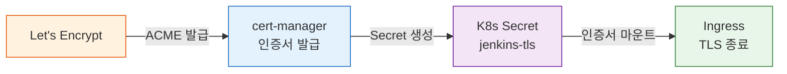

# Kubernetes Jenkins 운영

---

> K8s 위의 Jenkins를 안정적으로 운영하기 위한 실전 가이드다.

## 1. SSL/TLS와 Ingress

> Ingress Controller에서 TLS를 종료하는 표준 구성과 cert-manager 인증서 자동화 흐름을 다룬다.

Kubernetes에서 Jenkins에 HTTPS를 적용하는 가장 일반적인 방법은 Ingress Controller에서 TLS를 종료(terminate)하는 것이다. Jenkins 자체는 HTTP로 동작하고, 앞단의 Ingress가 인증서를 처리한다. nginx-ingress + cert-manager 조합이 사실상 표준이다.

인증서 전략은 두 가지다. Let's Encrypt는 공개 도메인에서 무료로 자동 갱신되어 프로덕션에 적합하다. 자체 서명 인증서는 인터넷 없는 사내 환경에서 사용하지만, 브라우저 경고를 수동으로 처리해야 한다. 어느 쪽이든 cert-manager가 인증서 발급과 갱신을 자동화해준다.

**cert-manager 인증서 발급 흐름**



Ingress 리소스는 다음과 같이 구성한다:

```yaml
apiVersion: networking.k8s.io/v1
kind: Ingress
metadata:
  name: jenkins
  namespace: jenkins
  annotations:
    cert-manager.io/cluster-issuer: letsencrypt-prod
    nginx.ingress.kubernetes.io/proxy-body-size: "50m"
    nginx.ingress.kubernetes.io/proxy-read-timeout: "3600"
spec:
  ingressClassName: nginx
  tls:
  - hosts:
    - jenkins.example.com
    secretName: jenkins-tls
  rules:
  - host: jenkins.example.com
    http:
      paths:
      - path: /
        pathType: Prefix
        backend:
          service:
            name: jenkins
            port:
              number: 8080
```

`proxy-read-timeout: 3600`은 빌드 콘솔 로그의 장시간 스트리밍을 위해 필요하다. 기본값인 60초면 장시간 빌드의 로그가 중간에 끊긴다. Jenkins 측에서는 `values.yaml`에 `controller.jenkinsUrl`을 반드시 명시해야 한다. 이 설정이 빠지면 Jenkins가 생성하는 빌드 링크와 Webhook 콜백 URL이 내부 Pod IP로 만들어져 외부에서 접근할 수 없다.

## 2. 백업과 복원 전략

> 백업 대상별 전략을 나눠서 조합하는 것이 핵심이며, JCasC + Git이 가장 중요한 레이어다.

Jenkins의 백업 대상은 크게 세 가지다. 각각에 맞는 전략이 다르므로 조합하여 사용한다.

| 백업 대상 | 전략 | 복원 시간 |
|----------|------|----------|
| Job 정의, 플러그인 목록, 보안 설정 | JCasC + Git | 즉시 (`helm install` 한 번) |
| 빌드 히스토리 + 아티팩트 | PVC 스냅샷 / Velero | 5~15분 |
| 전체 클러스터 리소스 | Velero 스케줄 백업 | 10~30분 |

JCasC + Git 기반 백업이 가장 중요하다. 설정을 모두 코드로 관리하면 Jenkins를 언제든 재구성할 수 있다. 빌드 히스토리는 복원할 수 없지만, 장애 복구 상황에서 가장 시급한 것은 설정 복원이다.

핵심 백업 대상 디렉토리는 세 곳이다:

- `jobs/`: 모든 Job의 `config.xml` — 파이프라인 정의와 빌드 히스토리가 들어있다.
- `secrets/`: 마스터 키와 자격증명 — 이것이 없으면 암호화된 시크릿을 복호화할 수 없다.
- `config.xml`: Jenkins 전역 설정 — 보안 설정, 플러그인 설정, 에이전트 설정이 들어있다.

Kubernetes CronJob으로 JENKINS_HOME을 주기적으로 외부에 백업한다. 아래는 매일 새벽 2시에 tar.gz로 압축하여 별도 PVC에 저장하는 예시다:

```yaml
apiVersion: batch/v1
kind: CronJob
metadata:
  name: jenkins-backup
  namespace: jenkins
spec:
  schedule: "0 2 * * *"
  successfulJobsHistoryLimit: 7   # 최근 7일치 보관
  failedJobsHistoryLimit: 3
  jobTemplate:
    spec:
      template:
        spec:
          containers:
          - name: backup
            image: alpine:3.19
            command:
            - sh
            - -c
            - |
              BACKUP_FILE="/backup/jenkins-$(date +%Y%m%d).tar.gz"
              tar czf "$BACKUP_FILE" \
                /var/jenkins_home/jobs \
                /var/jenkins_home/secrets \
                /var/jenkins_home/config.xml
              echo "Backup completed: $BACKUP_FILE"
              # 30일 이상 된 백업 자동 삭제
              find /backup -name "jenkins-*.tar.gz" -mtime +30 -delete
            volumeMounts:
            - name: jenkins-home
              mountPath: /var/jenkins_home
              readOnly: true
            - name: backup-storage
              mountPath: /backup
          restartPolicy: OnFailure
          volumes:
          - name: jenkins-home
            persistentVolumeClaim:
              claimName: jenkins
          - name: backup-storage
            persistentVolumeClaim:
              claimName: jenkins-backup
```

Velero를 사용하면 PVC 스냅샷 방식으로 JENKINS_HOME 전체를 백업할 수 있다. Velero는 클러스터 리소스(Deployment, ConfigMap 등)와 PVC 볼륨을 함께 백업하므로 전체 Jenkins 환경을 다른 클러스터로 이식하는 데도 활용할 수 있다:

```bash
# Velero 스케줄 백업 등록 (매일 새벽 3시)
velero schedule create jenkins-daily \
  --schedule="0 3 * * *" \
  --include-namespaces jenkins \
  --ttl 720h   # 30일 보관

# 수동 복원
velero restore create --from-backup jenkins-daily-<timestamp>
```

## 3. 리소스 사이징과 모니터링

> 컨트롤러와 에이전트의 리소스를 규모별로 분리하여 설정하는 기준과 Prometheus/Grafana 연동 방법을 다룬다.

컨트롤러의 메모리는 플러그인 수에 비례하여 증가한다. 플러그인 30개 이상이면 `requests`를 최소 1Gi로 잡는다. `javaOpts`의 `-Xmx`는 컨테이너 limits의 60~70%로 설정한다. 나머지 30~40%는 JVM 메타스페이스와 OS 캐시가 사용한다.

**규모별 권장 리소스 사양**

| 규모 | 동시 빌드 | 컨트롤러 requests/limits | 에이전트 requests/limits | PVC |
|------|----------|------------------------|------------------------|-----|
| 소규모 (1~5명) | 1~3 | 500m / 1Gi · 1 / 2Gi | 250m / 512Mi · 500m / 1Gi | 10Gi |
| 중규모 (5~20명) | 5~15 | 1 / 2Gi · 2 / 4Gi | 500m / 1Gi · 1 / 2Gi | 30Gi |
| 대규모 (20~100명) | 15~50 | 2 / 4Gi · 4 / 8Gi | 1 / 2Gi · 2 / 4Gi | 100Gi |

모니터링은 Jenkins Prometheus Metrics 플러그인으로 `/prometheus` 엔드포인트를 열고, `values.yaml`에서 ServiceMonitor를 활성화한다:

```yaml
controller:
  prometheus:
    enabled: true
    serviceMonitorEnabled: true
    serviceMonitorNamespace: monitoring
```

Grafana 대시보드 ID `9964`(Jenkins Performance and Health Overview)를 임포트하면 빌드 현황, 큐 상태, JVM 메트릭을 한눈에 볼 수 있다. 운영에 실질적으로 영향을 주는 핵심 알림 임계값은 다음과 같다:

- `jenkins_queue_size_value` > 10이 5분 이상 지속되면 에이전트 부족 신호다.
- `jvm_memory_used_bytes`가 heap의 80%를 초과하면 OOM 위험 신호다.
- `jenkins_node_offline_value` > 0이 10분 이상 지속되면 에이전트 연결 문제다.

## 4. 보안 경화와 업그레이드

> 최소 권한 RBAC 구성, NetworkPolicy 격리, LTS 기반 업그레이드 절차를 다룬다.

**RBAC 최소 권한 원칙**

Kubernetes Plugin이 에이전트 Pod를 관리하려면 Kubernetes API 권한이 필요하다. Jenkins 컨트롤러에는 `jenkins` namespace 내에서 Pod 생성·삭제·조회, PVC 생성, Secret 조회 권한만 부여한다. 클러스터 전체에 대한 ClusterRole은 부여하지 않는다:

```yaml
apiVersion: v1
kind: ServiceAccount
metadata:
  name: jenkins
  namespace: jenkins
---
apiVersion: rbac.authorization.k8s.io/v1
kind: Role
metadata:
  name: jenkins
  namespace: jenkins
rules:
- apiGroups: [""]
  resources: ["pods", "pods/exec", "pods/log"]
  verbs: ["get", "list", "watch", "create", "delete"]
- apiGroups: [""]
  resources: ["persistentvolumeclaims"]
  verbs: ["get", "list", "create", "delete"]
- apiGroups: [""]
  resources: ["secrets"]
  verbs: ["get"]
---
apiVersion: rbac.authorization.k8s.io/v1
kind: RoleBinding
metadata:
  name: jenkins
  namespace: jenkins
roleRef:
  apiGroup: rbac.authorization.k8s.io
  kind: Role
  name: jenkins
subjects:
- kind: ServiceAccount
  name: jenkins
  namespace: jenkins
```

**보안 경화 체크리스트**

- **NetworkPolicy 격리**: 에이전트 Pod의 네트워크를 격리하면 빌드 컨테이너가 내부 인프라에 무분별하게 접근하는 것을 차단할 수 있다. 컨트롤러에는 Ingress에서 오는 `8080` 트래픽과 에이전트에서 오는 `50000` 트래픽만 허용한다.
- **Secret 관리**: Jenkins Credentials에 저장된 시크릿은 K8s Secret으로 외부화한다. `credentials()`로 파이프라인에서 참조하고 평문 노출을 방지한다.
- **에이전트 privileged 최소화**: Docker-in-Docker가 필요한 스테이지만 `securityContext.privileged: true`를 허용하고, 나머지 컨테이너에는 적용하지 않는다.
- **플러그인 감사**: 사용하지 않는 플러그인은 주기적으로 제거한다. 플러그인은 Jenkins 내부에 깊이 접근하므로 공격 표면이 된다.

**업그레이드 절차**

Jenkins 버전 업그레이드는 LTS(Long-Term Support) 라인을 추적하는 것이 기본이다. LTS는 짝수 주차마다 보안 패치가 발행되며, Weekly 릴리스보다 안정적이다. 업그레이드 전 체크리스트를 매번 확인한다:

- 현재 실행 중인 빌드가 없는지 확인한다. 빌드 중 업그레이드하면 빌드가 유실된다.
- 타겟 Jenkins 버전의 릴리스 노트에서 Breaking Change를 확인한다.
- 사용 중인 플러그인이 새 버전과 호환되는지 Plugin Compatibility Matrix를 확인한다.
- PVC 스냅샷 또는 Velero 백업이 최신 상태인지 확인한다.

업그레이드 자체는 `helm upgrade`로 간단히 실행할 수 있다. 문제가 발생하면 `helm rollback`으로 Kubernetes 리소스를 이전 상태로 되돌린다. 단, Helm 롤백은 PVC 데이터를 되돌리지 않으므로 플러그인 업그레이드로 인한 데이터 마이그레이션이 발생한 경우에는 PVC 스냅샷 기반 롤백이 필요하다:

```bash
# 특정 Chart 버전으로 업그레이드
helm upgrade jenkins jenkins/jenkins \
  -n jenkins -f values.yaml --version 5.8.0

# 이전 리비전으로 롤백
helm rollback jenkins 1 -n jenkins
```
