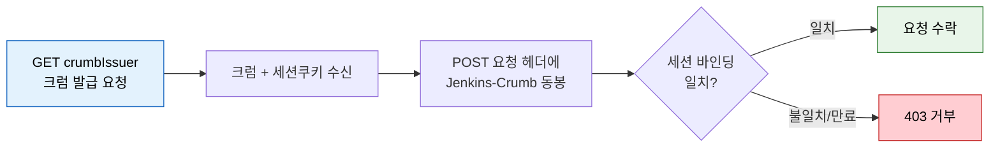
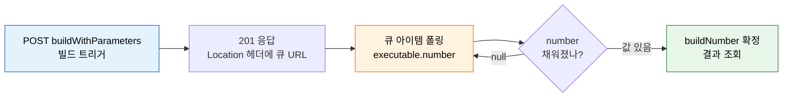

# 5단계 점검 — Jenkins API 핵심 질문

---

> 이 질문들에 막힘없이 답할 수 있으면 Jenkins API 단계 학습이 끝난 것입니다. 막히는 질문이 있으면 괄호 안 본편으로 돌아가 다시 읽으세요.
> 다루는 문서: 02-01~09-03. Jenkins REST API 구조와 연동, 인증 모델, 파이프라인 CRUD, 빌드 트리거·Queue 추적, 상태 추적(wfapi), 로그 조회, 크레덴셜 관리, 쿼리 최적화, 배포 승인과 운영 관리

## 점검 사용법

> 질문 절은 질문만 봅니다. 답이 떠오르면 아래 정답 절에서 같은 번호로 대조하세요. 먼저 답을 보면 인출 연습(active recall)이 무너집니다.

이 문서는 질문 절과 정답 절을 의도적으로 떼어 놓았습니다. 본 답안과 심화 질문 답을 모두 뒤쪽 정답 절로 옮긴 이유는, 질문을 보는 순간 바로 아래 답이 눈에 들어오면 "안다고 착각"하기 쉽기 때문입니다. 답을 가린 채 스스로 설명해 본 뒤 대조해야 진짜 아는 것과 모르는 것이 갈립니다.

## Q1: Jenkins REST API 인증에서 비밀번호 대신 API Token을 사용하는 이유는?

> 토큰과 비밀번호의 차이를 폐기 범위·계정 독립성·추적성 세 축으로 설명할 수 있는지 점검합니다.

- 본 질문: API Token이 비밀번호보다 나은 점 세 가지를 드세요.
- 심화: 토큰을 환경변수가 아닌 Jenkinsfile 평문에 하드코딩하면 어떤 문제가 발생하는가?

답은 정답 1 참조. (본편: 03-01, 03-02, 03-03)

## Q2: Jenkins CSRF Protection이 동작하는 원리는? crumb는 왜 필요한가?

> CSRF 공격이 성립하는 조건과 crumb가 그 고리를 어디서 끊는지 흐름으로 설명할 수 있는지 점검합니다.

- 본 질문: crumb 방어 흐름을 발급→첨부→검증 순서로 설명하세요.
- 심화: crumb 만료 시 자동화 스크립트에서 어떻게 처리하는가?

답은 정답 2 참조. (본편: 03-01)

## Q3: `tree` 파라미터와 `depth` 파라미터의 차이는?

> 응답 크기 제어 방식 두 가지를 구분하고, 폴링·모니터링에서 무엇을 우선할지 판단할 수 있는지 점검합니다.

- 본 질문: `tree`와 `depth`의 동작 방식과 각각의 특징을 비교하세요.
- 심화: 빌드 결과를 polling할 때 exponential backoff를 써야 하는 이유는?

답은 정답 3 참조. (본편: 09-03)

## Q4: 파라미터 빌드 트리거 후 Queue Item → Build Number를 어떻게 추적하는가?

> 빌드가 즉시 실행되지 않고 큐를 거친다는 사실과, 큐 아이템에서 빌드 번호를 끌어오는 4단계를 설명할 수 있는지 점검합니다.

- 본 질문: crumb 발급부터 빌드 결과 조회까지 4단계 추적 흐름을 설명하세요.
- 심화: Queue에서 빌드가 영원히 빠지지 않는 원인 3가지는?

답은 정답 4 참조. (본편: 05-01, 05-03, 05-04, 05-06)

## Q5: Generic Webhook Trigger와 SCM Webhook은 어떤 상황에서 각각 선택하는가?

> 두 webhook의 용도·엔드포인트·파싱·인증을 구분하고 상황에 맞게 고를 수 있는지 점검합니다.

- 본 질문: SCM Webhook과 Generic Webhook Trigger를 네 축(용도·엔드포인트·파싱·인증)으로 비교하세요.
- 심화: Generic Webhook Trigger에서 동일 이벤트가 중복 전달될 때 어떻게 멱등성을 보장하는가?

답은 정답 5 참조. (본편: 05-01, 09-01)

## Q6: `/build`와 `/buildWithParameters`의 차이는?

> 파라미터 유무에 따라 두 엔드포인트가 어떻게 갈리는지, 잘못 호출하면 무엇이 반환되는지 설명할 수 있는지 점검합니다.

- 본 질문: `/build`와 `/buildWithParameters`의 대상 Job과 동작을 비교하세요.
- 심화: Jenkins API로 배포 승인(Input step)을 프로그래밍 방식으로 처리하려면 어떤 엔드포인트를 사용하는가?

답은 정답 6 참조. (본편: 05-01, 09-01)

## 정답

> 위 질문을 스스로 설명해 본 뒤에 펼치세요. 본 답안과 심화 답을 같은 번호로 묶어 둡니다.

### 정답 1 — API Token을 쓰는 이유

API Token이 비밀번호보다 나은 이유는 다음 세 가지입니다.

- **개별 폐기 가능**: 토큰이 유출되면 해당 토큰만 폐기하면 되므로 영향 범위가 최소화됩니다.
- **계정 비밀번호와 독립**: Jenkins 계정 비밀번호를 바꿔도 토큰 기반 스크립트는 깨지지 않습니다.
- **사용 기록 추적 가능**: 토큰별로 API 호출 기록을 남길 수 있습니다.

| 전달 방식 | 형식 |
|-----------|------|
| HTTP 헤더 | `Authorization: Basic base64(username:apiToken)` |
| curl 축약 | `-u admin:API_TOKEN` |

TLS 없이 사용하면 토큰이 평문으로 노출되므로 HTTPS 적용은 필수입니다.

**심화 답**: 토큰을 Jenkinsfile 평문에 하드코딩하면 SCM 저장소에 그대로 커밋되어 누구나 읽을 수 있게 됩니다. 저장소 접근 권한을 가진 모든 사람이 그 토큰으로 Jenkins를 호출할 수 있고, 이력에 남으므로 토큰을 지워도 과거 커밋에서 복구됩니다. 그래서 토큰은 Credentials에 저장하고 환경변수로 주입합니다.

### 정답 2 — CSRF Protection과 crumb

CSRF 공격 시나리오는 이렇습니다.

- 악의적인 웹 페이지가 `<form action="http://jenkins/job/deploy/build" method="POST">`를 삽입하면, Jenkins에 로그인된 사용자의 브라우저가 세션 쿠키를 자동으로 첨부해 빌드를 트리거할 수 있습니다.

crumb 방어 흐름은 다음 세 단계입니다.

1. `GET /crumbIssuer/api/json` → `{"crumb": "abc123", "crumbRequestField": "Jenkins-Crumb"}` 수신
2. 이후 모든 POST 요청에 `Jenkins-Crumb: abc123` 헤더 포함
3. crumb는 사용자 세션에 바인딩되므로 다른 세션의 crumb로는 요청이 거부됩니다.

**심화 답**: crumb가 만료되면 POST 요청이 403으로 거부됩니다. 자동화 스크립트는 이를 catch해 `crumbIssuer`를 다시 호출하고 새 crumb로 한 번 재시도하는 방식으로 처리합니다. 매 요청 직전에 crumb를 새로 받는 방법도 안전하지만 호출 수가 늘어납니다.

> API Token 인증 요청은 이 발급 단계를 건너뜁니다 — crumb 면제 대상이라 `Authorization` 헤더 한 줄로 끝납니다(출처: jenkins.io/doc/book/security/csrf-protection).

### 정답 3 — `tree` vs `depth`

| 파라미터 | 동작 방식 | 특징 |
|----------|-----------|------|
| `depth=N` | 응답 JSON 중첩 깊이를 숫자로 제어 | 예측하기 쉬움, 불필요한 필드도 포함 |
| `tree=필드명` | 반환할 필드를 명시적으로 지정 | 정밀 제어, 응답 크기 최소화 |

- `?tree=builds[number,result]{0,5}` 형태로 필드명과 배열 범위를 함께 지정할 수 있습니다.
- 대량 빌드 목록 조회나 모니터링 폴링에는 `tree`를 우선합니다. Controller 직렬화 부하도 낮아집니다.

**심화 답**: 빌드 폴링에 고정 간격을 쓰면 빌드가 길어질수록 무의미한 호출이 쌓여 Controller에 부하를 줍니다. exponential backoff는 처음엔 짧게 조회하다 점점 간격을 늘려, 결과가 늦게 나오는 빌드에서 호출 수를 줄이면서도 빠른 빌드는 빠르게 감지합니다.

### 정답 4 — Queue Item → Build Number 추적

빌드는 즉시 실행되지 않고 큐에 등록되므로 4단계 추적이 필요합니다.

1. **crumb 발급**: `GET /crumbIssuer/api/json`
2. **빌드 트리거**: `POST /job/my-pipeline/buildWithParameters` → 응답 `201 Created`의 `Location` 헤더에 큐 아이템 URL이 담깁니다.
3. **빌드 번호 확인**: 큐 아이템 URL에 `api/json`을 붙여 `.executable.number`가 null이 아닐 때까지 폴링합니다.
4. **빌드 결과 조회**: `/job/my-pipeline/{BUILD_NUM}/api/json?tree=result,duration`

- `result`가 null이면 아직 실행 중입니다.
- `SUCCESS`, `FAILURE`, `ABORTED` 중 하나가 채워지면 완료된 것입니다.

**심화 답**: 큐에서 빌드가 빠지지 않는 원인은 보통 세 가지입니다. ① 실행할 수 있는 Executor가 없음(노드 오프라인 또는 동시 실행 한도 초과), ② label이 일치하는 Agent가 없어 배정 자체가 불가능, ③ `throttle`·`lockable resource` 같은 차단 조건이 풀리지 않음. 큐 아이템의 `why` 필드가 어느 경우인지 알려 줍니다.

> 큐에 머무는 동안 `executable.number`는 null입니다. 이 값이 채워지는 순간이 queueId가 실제 buildNumber로 전환되는 지점입니다.

### 정답 5 — SCM Webhook vs Generic Webhook Trigger

| 구분 | SCM Webhook | Generic Webhook Trigger |
|------|-------------|------------------------|
| 용도 | GitHub/GitLab 코드 변경 이벤트 전용 | 비-SCM 이벤트 (Slack, AlertManager, JIRA 등) |
| 엔드포인트 | `/github-webhook/` | `/generic-webhook-trigger/invoke` |
| 파싱 | 플러그인이 자동 파싱 | JSONPath로 직접 파싱, 환경 변수 추출 |
| 인증 | GitHub Secret Token으로 payload 서명 검증 | URL의 `token` 파라미터 (URL에 노출, 상대적으로 취약) |

- SCM Webhook + Multibranch Pipeline 조합이면 브랜치 자동 감지와 PR 빌드가 기본 제공됩니다.
- Generic Webhook은 어떤 시스템과도 연동되지만 설정이 복잡합니다.

**심화 답**: 동일 이벤트 중복 전달은 payload에서 고유 키(예: 커밋 SHA, 이벤트 ID)를 JSONPath로 뽑아 멱등 키로 삼아 막습니다. 같은 키로 이미 빌드가 돌았으면 새 빌드를 띄우지 않도록 Job 안에서 비교하거나, `regexpFilter`로 중복 패턴을 걸러 트리거 자체를 막습니다.

### 정답 6 — `/build` vs `/buildWithParameters`

| 엔드포인트 | 대상 Job | 동작 |
|------------|----------|------|
| `/build` | 파라미터 없는 Job | 즉시 실행 |
| `/buildWithParameters` | 파라미터가 정의된 Job | `--data-urlencode 'KEY=VALUE'` 형태로 파라미터 전달 |

- 파라미터가 있는 Job에 `/build`를 호출하면 기본값으로 실행되거나 `400 Bad Request`가 반환됩니다.

**심화 답**: 배포 승인(Input step)은 `POST /job/.../{BUILD_NUM}/input/{inputId}/proceedEmpty`(또는 파라미터가 있으면 `proceed`)로 처리합니다. 거부는 `abort` 엔드포인트를 씁니다. 자세한 흐름은 09-01에서 다룹니다.

## 관련 문서

이 점검 문서에서 막힌 질문이 있으면 해당 본편으로 돌아가 다시 읽습니다. 아래는 질문별로 직접 연결되는 스펙 본편들입니다.

- [02-02. REST API 구조와 연동](02-02.REST%20API%20%EA%B5%AC%EC%A1%B0%EC%99%80%20%EC%97%B0%EB%8F%99.md) § "tree·depth 파라미터" — Q3의 응답 크기 제어 두 방식이 정의되는 곳
- [03-01. 인증 API 스펙 (ID-Password + Crumb)](03-01.%EC%9D%B8%EC%A6%9D%20API%20%EC%8A%A4%ED%8E%99%20%28ID-Password%20%2B%20Crumb%29.md) § "Crumb 발급" — Q1·Q2의 API Token과 crumb 발급·검증 흐름
- [05-01. 빌드 실행·큐 API 스펙](05-01.%EB%B9%8C%EB%93%9C%20%EC%8B%A4%ED%96%89%C2%B7%ED%81%90%20API%20%EC%8A%A4%ED%8E%99.md) § "build vs buildWithParameters" — Q4·Q6의 트리거 엔드포인트와 큐 응답
- [05-03. Queue 적재 이후 실행 흐름과 데이터 추적](05-03.Queue%20%EC%A0%81%EC%9E%AC%20%EC%9D%B4%ED%9B%84%20%EC%8B%A4%ED%96%89%20%ED%9D%90%EB%A6%84%EA%B3%BC%20%EB%8D%B0%EC%9D%B4%ED%84%B0%20%EC%B6%94%EC%A0%81.md) § "Queue Item → Build Number" — Q4의 큐 아이템에서 빌드 번호를 끌어오는 추적
- [09-01. API 배포 승인과 운영 관리](09-01.API%20%EB%B0%B0%ED%8F%AC%20%EC%8A%B9%EC%9D%B8%EA%B3%BC%20%EC%9A%B4%EC%98%81%20%EA%B4%80%EB%A6%AC.md) § "Input step 처리" — Q5·Q6 심화의 webhook 선택과 배포 승인 엔드포인트
