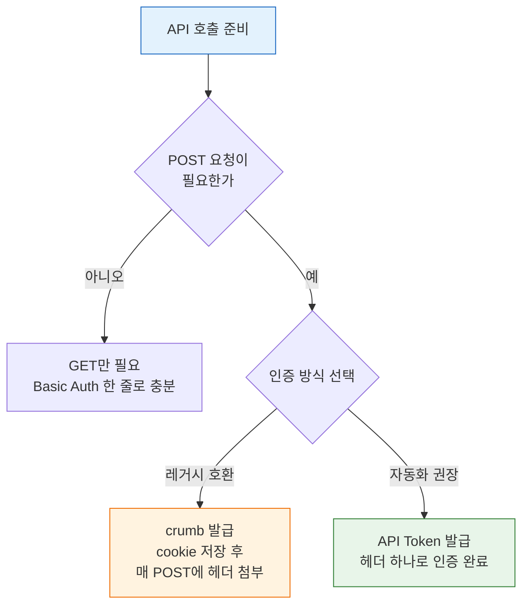
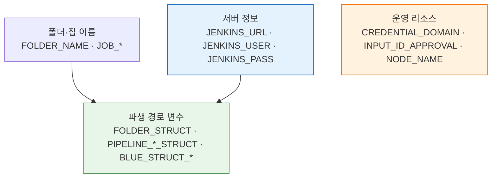

# 젠킨스 API 사전 준비
---
> 이 문서는 `05-*` Jenkins API 문서를 보기 전에 한 번만 준비하면 되는 공통 환경설정과 파일 규칙을 정리합니다.
>
> - 서버 URL, 계정, 공통 파일명, 실습용 리소스 이름, 기본 응답 확인 규칙을 다룹니입니다.
> - 개별 API 호출과 인증 흐름 자체는 각 스펙 문서에서 다룹니입니다.

## §학습 목표

> 이 문서를 읽고 나면 Jenkins API 실습에 필요한 서버·인증·리소스 변수를 한 번에 설정하고, 이후 모든 스펙 문서의 curl 예시를 수정 없이 실행할 수 있습니다.

## §사전 지식

> 셸 환경변수(`export`)와 `curl`의 기본 옵션(`-u`, `-H`, `-d`)을 안다면, 이 문서는 그 지식을 "Jenkins라는 한 서버에 반복 인증하는 표준 묶음"으로 일반화한 것입니다.

## 1. 이 문서의 목적

> `01-02`부터 `01-08`까지의 문서에서 반복되는 공통 준비를 한 곳으로 모읍니입니다. 같은 설정을 문서마다 다시 쓰지 않으려는 것입니다.
>
> - 서버와 파일명을 한 번만 설정하면 이후 문서에서 반복 설명 없이 바로 시작할 수 있습니다.
> - 실습용 리소스 이름도 여기서 한 번만 정의합니다.

이 문서를 먼저 보면 다음 문서에서 반복 설명을 줄일 수 있습니다:

- `01-02. 젠킨스 인증 API 스펙 (ID-Password + Crumb).md`
- `01-02b. 젠킨스 API 토큰 발급·회전·수명 점검.md`
- `01-03. 젠킨스 파이프라인 CRUD API 스펙.md`
- `01-04. 젠킨스 빌드 실행·큐 API 스펙.md`
- `01-05. 젠킨스 빌드 상태 추적 API 스펙.md`
- `01-06. 젠킨스 API 로그 조회와 적재.md`
- `01-07. 젠킨스 API 크레덴셜 관리.md`
- `01-08. 젠킨스 API 배포 승인과 운영 관리.md`


## 2. 서버 전환이 쉬운 기본 설정

> 가장 자주 바뀌는 값은 서버 주소와 계정입니다. `JENKINS_TARGET` 한 줄만 바꾸면 나머지 변수는 자동으로 설정됩니다.
>
> - 지원 환경: `company`, `k8s`, `docker2`, `custom`
> - 환경이 바뀌어도 이후 문서의 curl 예시를 그대로 사용할 수 있습니다.

macOS/Linux용 예시는 다음과 같습니다:

```bash
export JENKINS_TARGET='k8s'
# export JENKINS_TARGET='k8s'
# export JENKINS_TARGET='docker2'
# export JENKINS_TARGET='custom'

case "$JENKINS_TARGET" in
  company)
    export JENKINS_URL='https://jenkins.bok.trombone.okestro.cloud'
    export JENKINS_USER='admin'
    export JENKINS_PASS='cloud1234'
    ;;
  k8s)
    export JENKINS_URL='http://34.47.74.0:31080'
    export JENKINS_USER='admin'
    export JENKINS_PASS='admin'
    ;;
  docker2)
    export JENKINS_URL='http://34.22.78.240:29080'
    export JENKINS_USER='admin'
    export JENKINS_PASS='admin'
    ;;
  custom)
    export JENKINS_URL='https://jenkins.example.com'
    export JENKINS_USER='<YOUR_JENKINS_USER>'
    export JENKINS_PASS='<YOUR_JENKINS_PASSWORD>'
    ;;
  *)
    echo "Unknown JENKINS_TARGET: $JENKINS_TARGET" >&2
    return 1 2>/dev/null || exit 1
    ;;
esac
```

Windows PowerShell용 예시는 다음과 같습니다:

```powershell
$env:JENKINS_TARGET = 'k8s'
# $env:JENKINS_TARGET = 'k8s'
# $env:JENKINS_TARGET = 'docker2'
# $env:JENKINS_TARGET = 'custom'

switch ($env:JENKINS_TARGET) {
  'company' {
    $env:JENKINS_URL = 'https://jenkins.bok.trombone.okestro.cloud'
    $env:JENKINS_USER = 'admin'
    $env:JENKINS_PASS = 'cloud1234'
  }
  'k8s' {
    $env:JENKINS_URL = 'http://34.47.74.0:31080'
    $env:JENKINS_USER = 'admin'
    $env:JENKINS_PASS = 'admin'
  }
  'docker2' {
    $env:JENKINS_URL = 'http://34.22.78.240:29080'
    $env:JENKINS_USER = 'admin'
    $env:JENKINS_PASS = 'admin'
  }
  'custom' {
    $env:JENKINS_URL = 'https://jenkins.example.com'
    $env:JENKINS_USER = '<YOUR_JENKINS_USER>'
    $env:JENKINS_PASS = '<YOUR_JENKINS_PASSWORD>'
  }
  default {
    throw "Unknown JENKINS_TARGET: $env:JENKINS_TARGET"
  }
}
```

빠르게 확인할 때는 다음 세 값만 보면 됩니다:

```bash
echo "$JENKINS_TARGET"
echo "$JENKINS_URL"
echo "$JENKINS_USER"
printf 'PASS_LEN=%s\n' "${#JENKINS_PASS}"
```


## 3. 공통 응답 파일명

> `05-*` 문서 전체에서 응답 파일명을 일관되게 쓰는 편이 좋습니다. 이름을 고정해 두면 서버만 바뀌어도 문서 예시를 그대로 따라가기 쉬워집니다.

기본 파일명은 다음을 기준으로 합니다:

| 파일 | 용도 |
|------|------|
| `headers.txt` | 응답 헤더 저장 |
| `body.txt` | 일반 텍스트 응답 저장 |
| `body.json` | JSON 응답 저장 |
| `crumb.json` | crumb 발급 응답 저장 |
| `cookies.txt` | 세션 cookie 저장 |

기본 확인 패턴은 다음과 같습니다:

```bash
curl -k -sS -D headers.txt -o body.txt -w 'HTTP_STATUS=%{http_code}\n' \
  -u "${JENKINS_USER}:${JENKINS_PASS}" \
  "<GET URL>"

cat headers.txt
head -n 20 body.txt
```

JSON 응답은 다음처럼 보는 편이 읽기 쉽습니다:

```bash
curl -k -sS -D headers.txt -o body.json -w 'HTTP_STATUS=%{http_code}\n' \
  -u "${JENKINS_USER}:${JENKINS_PASS}" \
  "<GET URL>"

cat headers.txt
jq '.' body.json
```


## 4. 인증 준비 — crumb 발급과 API Token

> Jenkins API는 인증 없이 호출할 수 없습니다. 여기서는 실습에 바로 쓸 수 있도록 crumb 발급과 API Token 생성을 모두 다룹니입니다.
>
> - **API Token 방식을 권장**합니다(자동화에서는 stateless라 재시작·세션 관리에서 자유롭기 때문입니다). crumb은 레거시 호환이 필요할 때만 사용합니다.
> - 각 방식의 상세 스펙과 이론은 `01-02`, `01-02a`, `01-02b`에서 다룹니입니다.

두 방식이 갈라지는 지점을 흐름으로 보면 다음과 같습니다:



### 방식 비교

| 항목 | ID/Password + crumb | API Token |
|------|---------------------|-----------|
| POST 요청 시 | crumb 헤더 + 세션 cookie 필요 | Token만으로 인증 완료 |
| Jenkins 재시작 시 | crumb 무효화 → 재발급 필요 | 영향 없음 |
| 자동화 적합성 | 낮음 (세션 관리 복잡) | **높음 (stateless)** |
| Jenkins 권장 | 레거시 호환용 | **권장 방식** (2.96+) |

### crumb 발급 (ID/Password 방식)

crumb은 CSRF 방어용 일회성 토큰입니다. 모든 POST 요청에 crumb 헤더와 세션 cookie를 함께 보내야 합니다.

```bash
# 1단계: crumb 발급 + 세션 cookie 저장
curl -k -sSf \
  -u "${JENKINS_USER}:${JENKINS_PASS}" \
  -c cookies.txt \
  -o crumb.json \
  "${JENKINS_URL}/crumbIssuer/api/json"

# crumb 값과 헤더 이름 추출
CRUMB=$(jq -r '.crumb' crumb.json)
CRUMB_FIELD=$(jq -r '.crumbRequestField' crumb.json)

echo "CRUMB=${CRUMB}"
echo "CRUMB_FIELD=${CRUMB_FIELD}"
```

```bash
# 2단계: crumb을 사용한 POST 요청 예시
curl -k -sSf -X POST \
  -u "${JENKINS_USER}:${JENKINS_PASS}" \
  -H "${CRUMB_FIELD}:${CRUMB}" \
  -b cookies.txt \
  "${JENKINS_URL}/job/my-job/build"
```

- `-c cookies.txt`: crumb 발급 시 세션 cookie를 파일에 저장합니다.
- `-b cookies.txt`: POST 요청 시 저장된 cookie를 함께 보냅니다. cookie 없이 crumb만 보내면 `403`이 반환됩니다.
- Jenkins가 재시작되면 crumb과 cookie가 모두 무효화되므로 1단계부터 다시 실행해야 합니다.

### API Token 발급

API Token은 한 번 발급하면 Jenkins 재시작과 무관하게 계속 사용할 수 있습니다. crumb/cookie 관리가 필요 없으므로 자동화에 적합합니다.

**UI에서 발급:**

- Jenkins 로그인 → 우측 상단 사용자명 클릭 → Configure → API Token > Add new Token
- 이름을 입력하고 Generate 클릭 → **이 시점에만 토큰 값이 표시**되므로 즉시 복사합니다.

**API로 발급 (crumb 필요):**

```bash
# crumb이 이미 발급된 상태에서 실행
curl -k -sSf -X POST \
  -u "${JENKINS_USER}:${JENKINS_PASS}" \
  -H "${CRUMB_FIELD}:${CRUMB}" \
  -b cookies.txt \
  -d 'newTokenName=api-practice' \
  "${JENKINS_URL}/user/${JENKINS_USER}/descriptorByName/jenkins.security.ApiTokenProperty/generateNewToken" \
  | jq '.'
```

응답에서 `tokenValue`가 발급된 토큰입니다:

```json
{
  "status": "ok",
  "data": {
    "tokenName": "api-practice",
    "tokenUuid": "a1b2c3d4-...",
    "tokenValue": "11abcdef1234567890abcdef1234567890"
  }
}
```

```bash
# 발급받은 토큰을 환경변수에 저장
export API_TOKEN='11abcdef1234567890abcdef1234567890'
```

### API Token으로 요청하기

Token을 사용하면 crumb/cookie 없이 바로 POST가 가능합니다:

```bash
# GET 요청
curl -sSf -u "${JENKINS_USER}:${API_TOKEN}" \
  "${JENKINS_URL}/api/json?tree=mode,nodeDescription"

# POST 요청 — crumb/cookie 불필요
curl -sSf -X POST \
  -u "${JENKINS_USER}:${API_TOKEN}" \
  "${JENKINS_URL}/job/my-job/build"
```

- `JENKINS_PASS` 대신 `API_TOKEN`을 사용한다는 점만 다릅니입니다. curl 문법은 동일합니다.
- Token은 발급 시 한 번만 표시되므로 분실하면 재발급해야 합니다.
- 용도별로 토큰을 분리 발급하는 것이 보안상 안전합니다 (→ 03-02 "관리자 토큰의 빚" 참조).

### 연결 문서

`01-03` 이후 문서에서 나오는 아래 값은 이 문서에서 설정합니다:

- `JENKINS_URL`, `JENKINS_USER`, `JENKINS_PASS` — 섹션 2
- `cookies.txt`, `crumb.json`, `CRUMB`, `CRUMB_FIELD` — 이 섹션
- `API_TOKEN` — 이 섹션

상세 스펙:

- Basic Auth + crumb 상세 → `01-02`
- 인증 모델과 API Token 이론 → `01-02a`
- 토큰 발급·회전·수명 점검 → `01-02b`


## 5. 공통 실습용 리소스 이름

> `01-03` 이후 문서들은 실습용 폴더, 파이프라인, 크레덴셜, 승인 ID를 여러 번 재사용합니다. 이름을 한 곳에서 정해 두면 이후 문서에서 동적 변수만 추가하면 됩니다.
>
> - 서버나 프로젝트가 달라져도 세 묶음(서버 정보 / 폴더·잡 이름 / 운영 리소스)만 바꾸면 됩니다.

macOS/Linux용 예시는 다음과 같습니다:

```bash
export FOLDER_NAME='SBH'
export FOLDER_STRUCT="/job/${FOLDER_NAME}"

export PIPELINE_NAME='TEST'
export PIPELINE_STRUCT="${FOLDER_STRUCT}/job/${PIPELINE_NAME}"
export PARENT_STRUCT="${FOLDER_STRUCT}"

export JOB_NORMAL='API-NORMAL'
export JOB_PARAM='API-PARAM'
export JOB_SLEEP10='API-SLEEP10'
export JOB_FAIL='API-FAIL'
export JOB_NORMAL_2='API-NORMAL-2'
export JOB_APPROVAL='API-APPROVAL'

export PIPELINE_NORMAL_STRUCT="${FOLDER_STRUCT}/job/${JOB_NORMAL}"
export PIPELINE_PARAM_STRUCT="${FOLDER_STRUCT}/job/${JOB_PARAM}"
export PIPELINE_SLEEP10_STRUCT="${FOLDER_STRUCT}/job/${JOB_SLEEP10}"
export PIPELINE_FAIL_STRUCT="${FOLDER_STRUCT}/job/${JOB_FAIL}"
export PIPELINE_NORMAL_2_STRUCT="${FOLDER_STRUCT}/job/${JOB_NORMAL_2}"
export PIPELINE_APPROVAL_STRUCT="${FOLDER_STRUCT}/job/${JOB_APPROVAL}"

export PARAM_BRANCH='main'
export PARAM_ENV='dev'

export BLUE_STRUCT_NORMAL="pipelines/${FOLDER_NAME}/pipelines/${JOB_NORMAL}"
export BLUE_STRUCT_FAIL="pipelines/${FOLDER_NAME}/pipelines/${JOB_FAIL}"

export CREDENTIAL_DOMAIN='TASK001'
export INPUT_ID_APPROVAL='deploy-approval'
export NODE_NAME='slave1'
```

Windows PowerShell용 예시는 다음과 같습니다:

```powershell
$env:FOLDER_NAME = 'SBH'
$env:FOLDER_STRUCT = "/job/$($env:FOLDER_NAME)"

$env:PIPELINE_NAME = 'TEST'
$env:PIPELINE_STRUCT = "$($env:FOLDER_STRUCT)/job/$($env:PIPELINE_NAME)"
$env:PARENT_STRUCT = $env:FOLDER_STRUCT

$env:JOB_NORMAL = 'API-NORMAL'
$env:JOB_PARAM = 'API-PARAM'
$env:JOB_SLEEP10 = 'API-SLEEP10'
$env:JOB_FAIL = 'API-FAIL'
$env:JOB_NORMAL_2 = 'API-NORMAL-2'
$env:JOB_APPROVAL = 'API-APPROVAL'

$env:PIPELINE_NORMAL_STRUCT = "$($env:FOLDER_STRUCT)/job/$($env:JOB_NORMAL)"
$env:PIPELINE_PARAM_STRUCT = "$($env:FOLDER_STRUCT)/job/$($env:JOB_PARAM)"
$env:PIPELINE_SLEEP10_STRUCT = "$($env:FOLDER_STRUCT)/job/$($env:JOB_SLEEP10)"
$env:PIPELINE_FAIL_STRUCT = "$($env:FOLDER_STRUCT)/job/$($env:JOB_FAIL)"
$env:PIPELINE_NORMAL_2_STRUCT = "$($env:FOLDER_STRUCT)/job/$($env:JOB_NORMAL_2)"
$env:PIPELINE_APPROVAL_STRUCT = "$($env:FOLDER_STRUCT)/job/$($env:JOB_APPROVAL)"

$env:PARAM_BRANCH = 'main'
$env:PARAM_ENV = 'dev'

$env:BLUE_STRUCT_NORMAL = "pipelines/$($env:FOLDER_NAME)/pipelines/$($env:JOB_NORMAL)"
$env:BLUE_STRUCT_FAIL = "pipelines/$($env:FOLDER_NAME)/pipelines/$($env:JOB_FAIL)"

$env:CREDENTIAL_DOMAIN = 'TASK001'
$env:INPUT_ID_APPROVAL = 'deploy-approval'
$env:NODE_NAME = 'slave1'
```

환경 변경에 대비하기 위해 바꿔야 할 값은 다음 세 묶음으로 나뉩니입니다:

- **서버 정보**: `JENKINS_TARGET`, `JENKINS_URL`, `JENKINS_USER`, `JENKINS_PASS`
- **실습 폴더/파이프라인 이름**: `FOLDER_NAME`, `JOB_*`
- **운영 리소스 이름**: `CREDENTIAL_DOMAIN`, `INPUT_ID_APPROVAL`, `NODE_NAME`

세 묶음과 그로부터 파생되는 경로 변수의 관계는 다음과 같습니다. 위쪽 세 묶음만 바꾸면 아래 경로 변수는 자동으로 따라옵니다:




## 6. 각 문서에서 남겨 둘 값의 기준

> 이 문서를 만든 이유는 공통 값과 문서별 동적 값을 구분하기 위해서입니다.
>
> - 매번 바뀌는 동적 값은 각 문서에서 따로 설정합니다.
> - 공통 값은 이 문서에서 한 번만 설정하고 이후 문서에서 반복하지 않습니다.

각 문서에서 그대로 남겨 둘 것은 보통 다음과 같습니다:

- 현재 실행에서 달라지는 `BUILD_NUMBER_*`
- 현재 실행에서 달라지는 `QUEUE_ID_*`
- 현재 실패 stage에서 달라지는 `NODE_ID_FAILED`, `STEP_ID_FAILED`
- 현재 토큰 발급 결과처럼 매번 바뀌는 `TOKEN_UUID`, `JENKINS_TOKEN`

반대로 각 문서에서 반복 설명하지 않을 공통값은 다음과 같습니다:

- 서버 URL과 계정
- crumb/cookie 파일명
- 공통 실습 폴더/파이프라인 이름
- 공통 credential domain, approval input ID, node 이름


## 7. 다음 순서

> 이 문서를 기준으로 다음 순서로 보면 됩니다.
>
> - `01-00`에서 공통값을 한 번 설정하면 이후 문서에서 바로 API 호출로 진입할 수 있습니다.

1. `01-00`에서 서버와 공통 변수 설정
2. `01-02`에서 Basic Auth와 crumb/cookie 발급
3. `01-03` 이후 문서에서 문서별 동적 값만 추가 설정


## 8. 참고 링크

> 인증 흐름과 토큰 관련 상세는 아래 문서에서 다룹니입니다.

- `01-02. 젠킨스 인증 API 스펙 (ID-Password + Crumb).md`
- `01-02a. 젠킨스 인증 모델과 TPS 패턴 (2.222+).md`
- `01-02b. 젠킨스 API 토큰 발급·회전·수명 점검.md`
