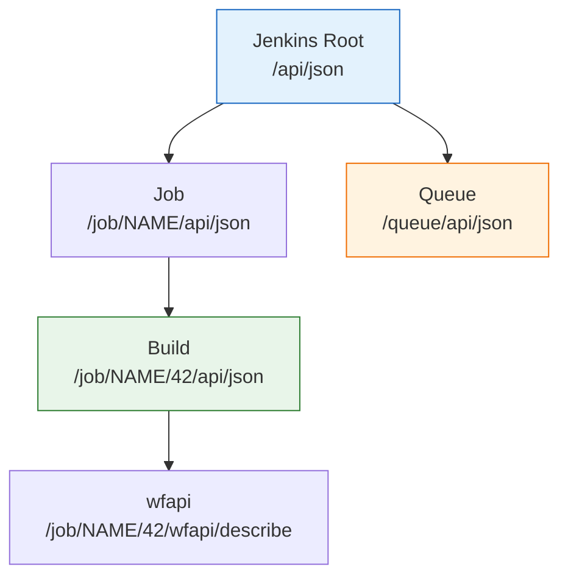
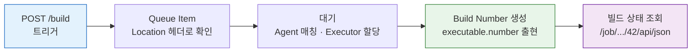

# 젠킨스 API를 사용하는 이유와 주의점
---
> Jenkins REST API로 파이프라인 CRUD, 빌드 실행 제어, 로그 조회, 크레덴셜 관리를 수행한다. 이 문서는 API 사용 전에 알아야 할 구조적 특성과 실전 주의사항을 정리한다.
>
> 실습 환경 설정은 `01-00. 젠킨스 API 실습 환경 설정` 참조

## 1. Jenkins API로 무엇을 하는가

> Jenkins REST API의 목적은 UI 클릭 없이 Jenkins를 프로그래밍 방식으로 제어하는 것이다.
>
> - 외부 시스템(배포 플랫폼, 모니터링 도구, 자체 관리 시스템)이 Jenkins와 연동할 때 API가 유일한 인터페이스가 된다.
> - 이 시리즈는 인증부터 운영 관리까지 8개 영역을 순서대로 다룬다.

이 시리즈에서 다루는 API 영역은 다음과 같다:

| 영역 | 하는 일 | 상세 문서 |
|------|--------|----------|
| **인증** | Basic Auth, API Token, CSRF crumb 확보 | 01-02, 01-02a, 01-02b |
| **파이프라인 CRUD** | Job 생성, 조회, 수정, 삭제, Folder 관리 | 01-03, 01-03a |
| **빌드 실행 제어** | 빌드 트리거, Queue 추적, 빌드 중지 | 01-04, 01-04a, 01-04b, 01-04c |
| **상태 추적** | 빌드 결과, Pipeline stage 상태, wfapi | 01-05, 01-05a, 01-05b |
| **로그 조회** | Console 출력, Progressive 로그, Blue Ocean 로그, `wfapi` node 로그, Blue Ocean-like 구현 판단 | 01-06, 01-06a, 01-06b, 01-06c |
| **크레덴셜** | 시크릿 등록, 조회, 수정, 삭제 | 01-07, 01-07a |
| **운영 관리** | 배포 승인, 노드 상태, 시스템 헬스체크 | 01-08, 01-08a |
| **쿼리 최적화** | depth/tree 파라미터, Artifact, System Restart | 01-09 |


## 2. Jenkins API의 구조적 특성

> Jenkins API는 일반적인 REST API와 다른 구조를 가진다. 단일 엔드포인트(`/api/v1/...`) 대신 각 리소스 경로 뒤에 `/api/json`을 붙이는 방식이다.
>
> - Jenkins UI에서 보이는 URL이 곧 API 경로의 기반이 된다.
> - Folder Plugin을 사용하면 경로가 중첩되므로 구성 규칙을 미리 파악해야 한다.

### 리소스 기반 URL 구조

Jenkins API는 단일 엔드포인트가 아니라, 각 리소스 경로 뒤에 `/api/json`을 붙이는 구조다.

```
# UI에서 보이는 경로            → API 경로
/job/my-pipeline/              → /job/my-pipeline/api/json
/job/my-pipeline/42/           → /job/my-pipeline/42/api/json
/job/folder/job/sub-job/       → /job/folder/job/sub-job/api/json
/queue/                        → /queue/api/json
```

리소스 간 계층 관계는 다음과 같다:



Folder Plugin을 사용하면 경로가 중첩된다. `프로젝트/프리셋/잡` 구조라면 `/job/PROJECT/job/PRESET/job/JOB`이 된다. 이 경로 구성 규칙을 모르면 API 호출 시 404를 만나게 된다.

### 응답 형식

Jenkins API는 JSON, XML, Python 세 가지 형식을 지원한다. `/api/json`, `/api/xml`, `/api/python`으로 형식을 선택한다. 이 시리즈에서는 JSON만 사용한다. XML은 XPath 필터를 지원하지만, JSON의 `tree` 파라미터가 더 실용적이다.

### tree 파라미터

API 응답에서 필요한 필드만 선택적으로 가져올 수 있다. 이것을 모르면 불필요한 데이터를 매번 전체로 받게 되어 응답이 수 MB에 달할 수 있다. 상세는 01-09에서 다룬다.

```bash
# 전체 응답 (불필요한 필드 포함, 수 KB~MB)
curl -sSf -u "${JENKINS_USER}:${JENKINS_PASS}" \
  "${JENKINS_URL}/job/my-pipeline/api/json"

# 필요한 필드만 (수백 바이트)
curl -sSf -u "${JENKINS_USER}:${JENKINS_PASS}" \
  "${JENKINS_URL}/job/my-pipeline/api/json?tree=name,buildable,lastBuild[number,result]"
```


## 3. API 사용 시 참고사항

> 인증 방식, Queue 전환 구간, Polling 설계, wfapi 선택 기준을 미리 파악하면 자동화 스크립트 작성 시 흔한 실수를 피할 수 있다.

### 인증: crumb vs API Token

Jenkins API 호출에는 인증이 필요하다. 두 가지 방식이 있으며 선택 기준이 다르다:

| 방식 | 특징 | 적합한 상황 |
|------|------|-----------|
| ID/Password + crumb | 모든 POST에 crumb 헤더와 세션 cookie 필요 | 레거시 환경, crumb만 지원하는 경우 |
| API Token | crumb/cookie 불필요, 헤더 하나로 인증 완료 | 자동화 스크립트, 외부 시스템 연동 |

API Token이 가능하다면 반드시 Token을 사용한다. crumb 방식은 세션 cookie 관리가 필요하고, Jenkins 재시작 시 crumb이 무효화되는 등 운영상 번거롭다. 상세는 01-02에서 다룬다.

### Queue → Build 전환 구간

빌드를 트리거하면 즉시 실행되는 것이 아니다. 이 구간을 이해하지 못하면 자동화 스크립트에서 `null`을 참조하게 된다.



흐름을 단계별로 정리하면 다음과 같다:

1. `POST /job/.../build` → 응답 헤더 `Location`에 **Queue Item URL** 반환
2. Queue에서 대기 → Agent 매칭 → Executor 할당
3. Executor에 배정되면 **build number** 생성
4. 이후부터 `/job/.../42/api/json`으로 빌드 상태 조회 가능

핵심: 트리거 직후 받는 값은 **build number가 아니라 queue item ID**다. queue item을 폴링하여 `executable.number`가 나타날 때까지 기다려야 한다. 상세는 01-04b에서 다룬다.

### Polling 설계

빌드 상태를 확인하기 위해 API를 반복 호출(polling)할 때 주의할 점이 있다:

- **간격**: 1초 미만 polling은 Jenkins Controller에 부하를 준다. 최소 3-5초 간격을 권장한다.
- **tree 파라미터**: 매번 전체 응답을 받지 말고, `tree=building,result` 같이 필요한 필드만 요청한다.
- **종료 조건**: `building=false`이면 빌드가 끝난 것이다. `result`가 `null`이면 아직 실행 중이다.
- **타임아웃**: 무한 polling을 방지하기 위해 스크립트에 최대 대기 시간을 반드시 설정한다.

### wfapi vs 기본 API

Pipeline 빌드의 상태를 볼 때 두 가지 API가 있다:

| API | 경로 | 보여주는 것 |
|-----|------|-----------|
| 기본 Build API | `/{buildNumber}/api/json` | `building`, `result`, `duration` — 빌드 전체 상태 |
| wfapi | `/{buildNumber}/wfapi/describe` | `status`, `stages[]` — 각 stage별 상태와 진행률 |

"빌드가 성공했는가?"만 확인하려면 기본 API로 충분하다. "어느 stage에서 실패했는가?", "현재 어느 stage가 실행 중인가?"를 알려면 wfapi를 사용해야 한다. 상태 추적 중심 설명은 `01-05`, 엔드포인트 전체 설명은 `01-06b`에서 다룬다.


## 4. API 사용 시 주의점

> Folder 경로 구성 오류, 멱등성 부재, 비표준 에러 응답, 플러그인 버전 의존성은 Jenkins API에서 자주 만나는 함정이다.

### Folder 경로 구성

Folder Plugin을 사용하면 API 경로가 깊어진다. 잘못된 경로를 구성하면 404나 엉뚱한 리소스에 접근하게 된다.

```
# Folder 없는 Job
/job/my-pipeline/api/json

# 1단계 Folder
/job/PROJECT/job/my-pipeline/api/json

# 2단계 Folder (프로젝트 > 프리셋 > 잡)
/job/PROJECT/job/PRESET/job/my-pipeline/api/json
```

프로그래밍 방식으로 경로를 구성할 때는 각 세그먼트를 `/job/` 접두사로 연결해야 한다. 이 규칙은 01-03에서 상세하게 다룬다.

### 멱등성과 부작용

Jenkins API는 일부 엔드포인트에서 멱등성을 보장하지 않는다:

- `POST /build`: 호출할 때마다 새 빌드가 큐에 추가된다. 네트워크 재시도 로직이 있으면 중복 빌드가 발생할 수 있다.
- `POST /job/.../config.xml`: Job 설정을 덮어쓴다. 동시에 두 클라이언트가 설정을 수정하면 한쪽이 유실된다.
- `POST /credentials/...`: 같은 ID로 중복 생성하면 에러가 발생한다. 존재 여부를 먼저 확인해야 한다.

자동화 스크립트에서 재시도 로직을 구현할 때 이 특성을 반드시 고려해야 한다.

### 에러 응답 해석

Jenkins API의 에러 응답은 일반적인 REST API와 다르다:

- **403**: 인증은 됐지만 권한이 없거나, crumb이 누락/만료된 경우. crumb 문제인지 권한 문제인지 구분하려면 GET 요청(crumb 불필요)을 먼저 시도한다.
- **404**: 리소스가 없거나, Folder 경로가 잘못된 경우. UI에서 해당 Job이 보이는지 먼저 확인한다.
- **500**: Jenkins 내부 오류. 플러그인 충돌이나 설정 오류일 가능성이 높다. Jenkins 로그(`/log/api/json`)를 확인한다.
- **503**: Jenkins가 시작 중이거나 quietDown 모드. `X-Jenkins` 응답 헤더가 없으면 Jenkins가 아직 준비되지 않은 것이다.

### 버전 호환성

Jenkins API는 플러그인 버전에 따라 동작이 달라질 수 있다. 특히 `wfapi`를 제공하는 `Pipeline: REST API Plugin`과 Blue Ocean API는 플러그인 버전에 의존한다. API 호출 전에 `X-Jenkins` 응답 헤더로 Jenkins 버전을 확인하고, 필요한 플러그인이 설치되어 있는지 `/pluginManager/api/json`으로 검증하는 것이 안전하다.


## 5. 이 시리즈의 읽는 순서

> 모든 문서를 순서대로 읽을 필요는 없다. 목적에 따라 필요한 문서를 선택한다.

- **처음 API를 쓴다** → 01-00(환경 설정) → 01-02(인증) → 01-04(빌드 트리거) → 01-05(상태 확인)
- **파이프라인 자동 관리** → 01-03(CRUD) → 01-07(크레덴셜)
- **운영 자동화** → 01-06(로그) → 01-08(승인/노드) → 01-09(쿼리 최적화/Restart)
- **TPS 패턴 참조** → 각 문서의 `a` 변형 (01-02a, 01-03a, 01-04a, 01-05a)
