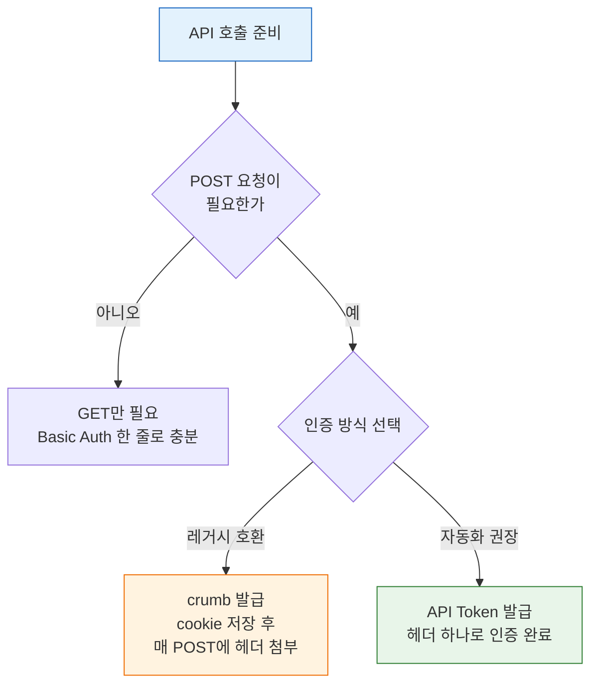
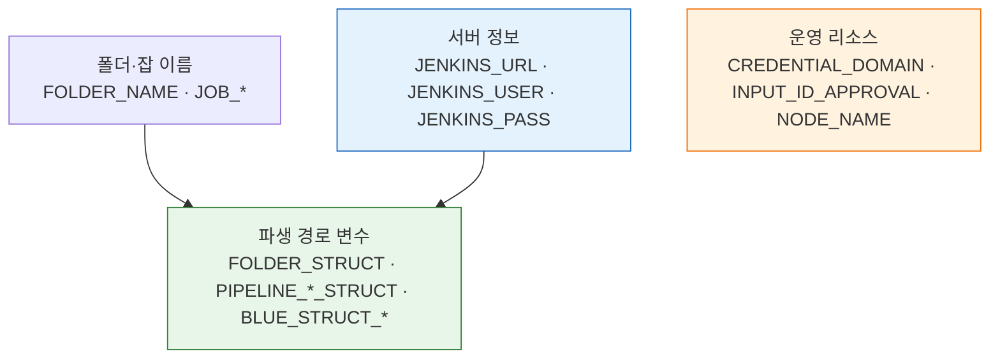

# 젠킨스 API 사전 준비
---
> 이 문서를 읽고 나면 Jenkins API 실습에 필요한 서버·인증·리소스 변수를 한 번에 설정하고, crumb과 API Token 두 인증 방식을 비교해 자동화에 맞는 쪽을 선택하며, 이후 모든 스펙 문서의 curl 예시를 수정 없이 실행할 수 있습니다.

## 진입 — 왜 환경설정을 한 문서로 모으는가

> Jenkins API 실습은 한 번의 호출로 끝나지 않습니다. `03-*`부터 `09-*`까지 수십 개의 curl 예시가 같은 서버 주소, 같은 계정, 같은 파일명을 반복 사용합니다. 이 값들을 문서마다 다시 적으면 서버 한 대를 바꿀 때 모든 문서를 손대야 합니다.

그래서 자주 바뀌는 값(서버·계정·인증)과 거의 안 바뀌는 값(파일명·리소스 이름)을 한 곳에 묶어 두고, 이후 스펙 문서는 그 변수만 참조합니다. 이렇게 하면 서버를 `k8s`에서 `docker2`로 옮길 때 `JENKINS_TARGET` 한 줄만 바꾸면 끝납니다. 환경설정을 한 문서로 모으는 까닭은 반복 제거가 아니라 변경 지점을 한 곳으로 좁히는 데 있습니다.

## 사전 지식

> 셸 환경변수(`export`)와 `curl`의 기본 옵션(`-u`, `-H`, `-d`)을 안다면, 이 문서는 그 지식을 "Jenkins라는 한 서버에 반복 인증하는 표준 묶음"으로 일반화한 것입니다.

## 1. 이 문서의 목적

> `03-01`부터 `09-01`까지의 문서에서 반복되는 공통 준비를 한 곳으로 모읍니다. 같은 설정을 문서마다 다시 쓰지 않으려는 것입니다.
>
> - 서버와 파일명을 한 번만 설정하면 이후 문서에서 반복 설명 없이 바로 시작할 수 있습니다.
> - 실습용 리소스 이름도 여기서 한 번만 정의합니다.

> 이 "공통 설정 묶음"은 이미 아는 셸 프로파일(`.bashrc`·`.zshenv`)의 환경설정 측면입니다. 셸을 열 때마다 같은 `export`를 다시 치지 않고 한 파일에 모아 두는 것과 똑같이, 여기서는 여러 API 문서가 공유하는 변수를 한 문서에 모아 둡니다.

이 문서를 먼저 보면 다음 문서에서 반복 설명을 줄일 수 있습니다:

- `03-01.인증 API 스펙 (ID-Password + Crumb).md`
- `03-03.API 토큰 발급·회전·수명 점검.md`
- `04-01.파이프라인 CRUD API 스펙.md`
- `05-01.빌드 실행·큐 API 스펙.md`
- `06-01.빌드 상태 추적 API 스펙.md`
- `07-01.API 로그 조회와 적재.md`
- `08-01.API 크레덴셜 관리.md`
- `09-01.API 배포 승인과 운영 관리.md`


## 2. 서버 전환이 쉬운 기본 설정

> 가장 자주 바뀌는 값은 서버 주소와 계정입니다. `JENKINS_TARGET` 한 줄만 바꾸면 나머지 변수는 자동으로 설정됩니다.
>
> - 지원 환경: `company`, `k8s`, `docker2`, `custom`
> - 환경이 바뀌어도 이후 문서의 curl 예시를 그대로 사용할 수 있습니다.

macOS/Linux용 예시는 다음과 같습니다:

```bash
# 바꾸는 값은 이 한 줄뿐 — 나머지는 case 가 자동으로 채운다
export JENKINS_TARGET='k8s'
# export JENKINS_TARGET='k8s'
# export JENKINS_TARGET='docker2'
# export JENKINS_TARGET='custom'

# case 분기로 서버별 URL·계정을 한 곳에 모아 두면 전환 시 오타 위험이 준다
case "$JENKINS_TARGET" in
  company)
    export JENKINS_URL='https://jenkins.bok.trombone.okestro.cloud'
    export JENKINS_USER='admin'
    export JENKINS_PASS='cloud1234'
    ;;
  k8s)
    export JENKINS_URL='http://34.47.74.0:31080'
    export JENKINS_USER='admin'
    export JENKINS_PASS='admin'
    ;;
  docker2)
    export JENKINS_URL='http://34.22.78.240:29080'
    export JENKINS_USER='admin'
    export JENKINS_PASS='admin'
    ;;
  custom)
    # 자기 환경은 placeholder 를 실제 값으로 교체해서 쓴다
    export JENKINS_URL='https://jenkins.example.com'
    export JENKINS_USER='<YOUR_JENKINS_USER>'
    export JENKINS_PASS='<YOUR_JENKINS_PASSWORD>'
    ;;
  *)
    # 오타 난 TARGET 으로 엉뚱한 서버를 치는 사고를 막으려 즉시 중단한다
    echo "Unknown JENKINS_TARGET: $JENKINS_TARGET" >&2
    # source 로 읽었으면 return, 직접 실행이면 exit — 둘 다 대응
    return 1 2>/dev/null || exit 1
    ;;
esac
```

Windows PowerShell용 예시는 다음과 같습니다:

```powershell
$env:JENKINS_TARGET = 'k8s'
# $env:JENKINS_TARGET = 'k8s'
# $env:JENKINS_TARGET = 'docker2'
# $env:JENKINS_TARGET = 'custom'

switch ($env:JENKINS_TARGET) {
  'company' {
    $env:JENKINS_URL = 'https://jenkins.bok.trombone.okestro.cloud'
    $env:JENKINS_USER = 'admin'
    $env:JENKINS_PASS = 'cloud1234'
  }
  'k8s' {
    $env:JENKINS_URL = 'http://34.47.74.0:31080'
    $env:JENKINS_USER = 'admin'
    $env:JENKINS_PASS = 'admin'
  }
  'docker2' {
    $env:JENKINS_URL = 'http://34.22.78.240:29080'
    $env:JENKINS_USER = 'admin'
    $env:JENKINS_PASS = 'admin'
  }
  'custom' {
    $env:JENKINS_URL = 'https://jenkins.example.com'
    $env:JENKINS_USER = '<YOUR_JENKINS_USER>'
    $env:JENKINS_PASS = '<YOUR_JENKINS_PASSWORD>'
  }
  default {
    throw "Unknown JENKINS_TARGET: $env:JENKINS_TARGET"
  }
}
```

빠르게 확인할 때는 다음 세 값만 보면 됩니다:

```bash
echo "$JENKINS_TARGET"
echo "$JENKINS_URL"
echo "$JENKINS_USER"
printf 'PASS_LEN=%s\n' "${#JENKINS_PASS}"
```


## 3. 공통 응답 파일명

> `05-*` 문서 전체에서 응답 파일명을 일관되게 쓰는 편이 좋습니다. 이름을 고정해 두면 서버만 바뀌어도 문서 예시를 그대로 따라가기 쉬워집니다.

기본 파일명은 다음을 기준으로 합니다:

| 파일 | 용도 |
|------|------|
| `headers.txt` | 응답 헤더 저장 |
| `body.txt` | 일반 텍스트 응답 저장 |
| `body.json` | JSON 응답 저장 |
| `crumb.json` | crumb 발급 응답 저장 |
| `cookies.txt` | 세션 cookie 저장 |

기본 확인 패턴은 다음과 같습니다:

```bash
# -D 로 헤더를, -o 로 본문을 따로 저장해 실패 시 둘을 나눠 본다
# -w 로 종료 직후 HTTP 코드를 출력해 200/403/404 를 즉시 구분한다
curl -k -sS -D headers.txt -o body.txt -w 'HTTP_STATUS=%{http_code}\n' \
  -u "${JENKINS_USER}:${JENKINS_PASS}" \
  "<GET URL>"

cat headers.txt           # X-Jenkins 헤더로 서버 버전을 확인할 수 있다
head -n 20 body.txt       # 본문 전체 대신 앞부분만 봐 터미널 오염을 막는다
```

JSON 응답은 다음처럼 보는 편이 읽기 쉽습니다:

```bash
curl -k -sS -D headers.txt -o body.json -w 'HTTP_STATUS=%{http_code}\n' \
  -u "${JENKINS_USER}:${JENKINS_PASS}" \
  "<GET URL>"

cat headers.txt
jq '.' body.json
```


## 4. 인증 준비 — crumb 발급과 API Token

> Jenkins API는 인증 없이 호출할 수 없습니다. 여기서는 실습에 바로 쓸 수 있도록 crumb 발급과 API Token 생성을 모두 다룹니다.
>
> - **API Token 방식을 권장**합니다(자동화에서는 stateless라 재시작·세션 관리에서 자유롭기 때문입니다). crumb은 레거시 호환이 필요할 때만 사용합니다.
> - 각 방식의 상세 스펙과 이론은 `03-01`, `03-02`, `03-03`에서 다룹니다.

두 방식이 갈라지는 지점을 흐름으로 보면 다음과 같습니다:



### 방식 비교

| 항목 | ID/Password + crumb | API Token |
|------|---------------------|-----------|
| POST 요청 시 | crumb 헤더 + 세션 cookie 필요 | Token만으로 인증 완료 |
| Jenkins 재시작 시 | crumb 무효화 → 재발급 필요 | 영향 없음 |
| 자동화 적합성 | 낮음 (세션 관리 복잡) | **높음 (stateless)** |
| Jenkins 권장 | 레거시 호환용 | **권장 방식** (2.96+) |

### crumb 발급 (ID/Password 방식)

실습에서는 crumb을 발급받아 세션 cookie와 짝지어 POST에 첨부합니다. crumb이 CSRF 방어 토큰인 이유와 Default Crumb Issuer의 인코딩 원리는 [03-01. 인증 API 스펙](03-01.%EC%9D%B8%EC%A6%9D%20API%20%EC%8A%A4%ED%8E%99%20%28ID-Password%20%2B%20Crumb%29.md) § "crumb 발급"에서 다룹니다.

```bash
# 1단계: crumb 발급 + 세션 cookie 저장
# -c 로 세션 cookie 를 파일에 받아 둬야 2단계 POST 에서 crumb 과 짝을 맞춘다
curl -k -sSf \
  -u "${JENKINS_USER}:${JENKINS_PASS}" \
  -c cookies.txt \
  -o crumb.json \
  "${JENKINS_URL}/crumbIssuer/api/json"

# crumb 값과 헤더 이름을 응답에서 뽑아 변수로 둔다
# 헤더 이름은 설정에 따라 다를 수 있어 하드코딩하지 않고 응답에서 읽는다
CRUMB=$(jq -r '.crumb' crumb.json)
CRUMB_FIELD=$(jq -r '.crumbRequestField' crumb.json)

echo "CRUMB=${CRUMB}"
echo "CRUMB_FIELD=${CRUMB_FIELD}"
```

```bash
# 2단계: crumb을 사용한 POST 요청 예시
curl -k -sSf -X POST \
  -u "${JENKINS_USER}:${JENKINS_PASS}" \
  -H "${CRUMB_FIELD}:${CRUMB}" \
  -b cookies.txt \
  "${JENKINS_URL}/job/my-job/build"
```

- `-c cookies.txt`: crumb 발급 시 세션 cookie를 파일에 저장합니다.
- `-b cookies.txt`: POST 요청 시 저장된 cookie를 함께 보냅니다. cookie 없이 crumb만 보내면 `403`이 반환됩니다.
- Jenkins가 재시작되면 crumb과 cookie가 모두 무효화되므로 1단계부터 다시 실행해야 합니다.

### API Token 발급

API Token은 한 번 발급하면 Jenkins 재시작과 무관하게 계속 사용할 수 있고, **crumb(CSRF) 검증에서 면제**되어 crumb/cookie 관리 없이 바로 POST가 가능하므로 자동화에 적합합니다. CSRF 면제 원리는 [03-01. 인증 API 스펙](03-01.%EC%9D%B8%EC%A6%9D%20API%20%EC%8A%A4%ED%8E%99%20%28ID-Password%20%2B%20Crumb%29.md), 토큰을 비밀번호 대신 쓰는 회전·폐기 이점은 [03-03. API 토큰 발급·회전·수명 점검](03-03.API%20%ED%86%A0%ED%81%B0%20%EB%B0%9C%EA%B8%89%C2%B7%ED%9A%8C%EC%A0%84%C2%B7%EC%88%98%EB%AA%85%20%EC%A0%90%EA%B2%80.md)에서 다룹니다.

**UI에서 발급:**

- Jenkins 로그인 → 우측 상단 사용자명 클릭 → Configure → API Token > Add new Token
- 이름을 입력하고 Generate 클릭 → **이 시점에만 토큰 값이 표시**되므로 즉시 복사합니다.

**API로 발급 (crumb 필요):**

```bash
# crumb이 이미 발급된 상태에서 실행
curl -k -sSf -X POST \
  -u "${JENKINS_USER}:${JENKINS_PASS}" \
  -H "${CRUMB_FIELD}:${CRUMB}" \
  -b cookies.txt \
  -d 'newTokenName=api-practice' \
  "${JENKINS_URL}/user/${JENKINS_USER}/descriptorByName/jenkins.security.ApiTokenProperty/generateNewToken" \
  | jq '.'
```

응답에서 `tokenValue`가 발급된 토큰입니다:

```json
{
  "status": "ok",
  "data": {
    "tokenName": "api-practice",
    "tokenUuid": "a1b2c3d4-...",
    "tokenValue": "11abcdef1234567890abcdef1234567890"
  }
}
```

```bash
# 발급받은 토큰을 환경변수에 저장
export API_TOKEN='11abcdef1234567890abcdef1234567890'
```

### API Token으로 요청하기

Token을 사용하면 crumb/cookie 없이 바로 POST가 가능합니다:

```bash
# GET 요청 — tree= 로 필요한 필드만 골라 응답을 줄인다 (상세는 09-03 참조)
curl -sSf -u "${JENKINS_USER}:${API_TOKEN}" \
  "${JENKINS_URL}/api/json?tree=mode,nodeDescription"

# POST 요청 — API token 은 crumb 검증에서 면제되어 crumb/cookie 가 불필요
curl -sSf -X POST \
  -u "${JENKINS_USER}:${API_TOKEN}" \
  "${JENKINS_URL}/job/my-job/build"
```

- `JENKINS_PASS` 대신 `API_TOKEN`을 사용한다는 점만 다릅니다. curl 문법은 동일합니다(HTTP BASIC `--user USER:TOKEN` 형식 — 출처: jenkins.io/doc/book/using/remote-access-api).
- 어떤 객체 URL에도 `/api/json`, `/api/xml`, `/api/python`을 붙여 같은 방식으로 조회할 수 있습니다. `tree=`·`depth=`로 응답 형태를 줄이는 상세는 [09-03. API 쿼리 최적화와 운영](09-03.API%20%EC%BF%BC%EB%A6%AC%20%EC%B5%9C%EC%A0%81%ED%99%94%EC%99%80%20%EC%9A%B4%EC%98%81.md)을 참조합니다.
- Token은 발급 시 한 번만 표시되므로 분실하면 재발급해야 합니다.
- 용도별로 토큰을 분리 발급하는 것이 보안상 안전합니다 (→ 03-02 "관리자 토큰의 빚" 참조).

### 연결 문서

`04-01` 이후 문서에서 나오는 아래 값은 이 문서에서 설정합니다:

- `JENKINS_URL`, `JENKINS_USER`, `JENKINS_PASS` — 섹션 2
- `cookies.txt`, `crumb.json`, `CRUMB`, `CRUMB_FIELD` — 이 섹션
- `API_TOKEN` — 이 섹션

상세 스펙:

- Basic Auth + crumb 상세 → `03-01`
- 인증 모델과 API Token 이론 → `03-02`
- 토큰 발급·회전·수명 점검 → `03-03`


## 5. 공통 실습용 리소스 이름

> `04-01` 이후 문서들은 실습용 폴더, 파이프라인, 크레덴셜, 승인 ID를 여러 번 재사용합니다. 이름을 한 곳에서 정해 두면 이후 문서에서 동적 변수만 추가하면 됩니다.
>
> - 서버나 프로젝트가 달라져도 세 묶음(서버 정보 / 폴더·잡 이름 / 운영 리소스)만 바꾸면 됩니다.

macOS/Linux용 예시는 다음과 같습니다:

```bash
export FOLDER_NAME='SBH'
export FOLDER_STRUCT="/job/${FOLDER_NAME}"

export PIPELINE_NAME='TEST'
export PIPELINE_STRUCT="${FOLDER_STRUCT}/job/${PIPELINE_NAME}"
export PARENT_STRUCT="${FOLDER_STRUCT}"

export JOB_NORMAL='API-NORMAL'
export JOB_PARAM='API-PARAM'
export JOB_SLEEP10='API-SLEEP10'
export JOB_FAIL='API-FAIL'
export JOB_NORMAL_2='API-NORMAL-2'
export JOB_APPROVAL='API-APPROVAL'

export PIPELINE_NORMAL_STRUCT="${FOLDER_STRUCT}/job/${JOB_NORMAL}"
export PIPELINE_PARAM_STRUCT="${FOLDER_STRUCT}/job/${JOB_PARAM}"
export PIPELINE_SLEEP10_STRUCT="${FOLDER_STRUCT}/job/${JOB_SLEEP10}"
export PIPELINE_FAIL_STRUCT="${FOLDER_STRUCT}/job/${JOB_FAIL}"
export PIPELINE_NORMAL_2_STRUCT="${FOLDER_STRUCT}/job/${JOB_NORMAL_2}"
export PIPELINE_APPROVAL_STRUCT="${FOLDER_STRUCT}/job/${JOB_APPROVAL}"

export PARAM_BRANCH='main'
export PARAM_ENV='dev'

export BLUE_STRUCT_NORMAL="pipelines/${FOLDER_NAME}/pipelines/${JOB_NORMAL}"
export BLUE_STRUCT_FAIL="pipelines/${FOLDER_NAME}/pipelines/${JOB_FAIL}"

export CREDENTIAL_DOMAIN='TASK001'
export INPUT_ID_APPROVAL='deploy-approval'
export NODE_NAME='slave1'
```

Windows PowerShell용 예시는 다음과 같습니다:

```powershell
$env:FOLDER_NAME = 'SBH'
$env:FOLDER_STRUCT = "/job/$($env:FOLDER_NAME)"

$env:PIPELINE_NAME = 'TEST'
$env:PIPELINE_STRUCT = "$($env:FOLDER_STRUCT)/job/$($env:PIPELINE_NAME)"
$env:PARENT_STRUCT = $env:FOLDER_STRUCT

$env:JOB_NORMAL = 'API-NORMAL'
$env:JOB_PARAM = 'API-PARAM'
$env:JOB_SLEEP10 = 'API-SLEEP10'
$env:JOB_FAIL = 'API-FAIL'
$env:JOB_NORMAL_2 = 'API-NORMAL-2'
$env:JOB_APPROVAL = 'API-APPROVAL'

$env:PIPELINE_NORMAL_STRUCT = "$($env:FOLDER_STRUCT)/job/$($env:JOB_NORMAL)"
$env:PIPELINE_PARAM_STRUCT = "$($env:FOLDER_STRUCT)/job/$($env:JOB_PARAM)"
$env:PIPELINE_SLEEP10_STRUCT = "$($env:FOLDER_STRUCT)/job/$($env:JOB_SLEEP10)"
$env:PIPELINE_FAIL_STRUCT = "$($env:FOLDER_STRUCT)/job/$($env:JOB_FAIL)"
$env:PIPELINE_NORMAL_2_STRUCT = "$($env:FOLDER_STRUCT)/job/$($env:JOB_NORMAL_2)"
$env:PIPELINE_APPROVAL_STRUCT = "$($env:FOLDER_STRUCT)/job/$($env:JOB_APPROVAL)"

$env:PARAM_BRANCH = 'main'
$env:PARAM_ENV = 'dev'

$env:BLUE_STRUCT_NORMAL = "pipelines/$($env:FOLDER_NAME)/pipelines/$($env:JOB_NORMAL)"
$env:BLUE_STRUCT_FAIL = "pipelines/$($env:FOLDER_NAME)/pipelines/$($env:JOB_FAIL)"

$env:CREDENTIAL_DOMAIN = 'TASK001'
$env:INPUT_ID_APPROVAL = 'deploy-approval'
$env:NODE_NAME = 'slave1'
```

환경 변경에 대비하기 위해 바꿔야 할 값은 다음 세 묶음으로 나뉩니다:

- **서버 정보**: `JENKINS_TARGET`, `JENKINS_URL`, `JENKINS_USER`, `JENKINS_PASS`
- **실습 폴더/파이프라인 이름**: `FOLDER_NAME`, `JOB_*`
- **운영 리소스 이름**: `CREDENTIAL_DOMAIN`, `INPUT_ID_APPROVAL`, `NODE_NAME`

세 묶음과 그로부터 파생되는 경로 변수의 관계는 다음과 같습니다. 위쪽 세 묶음만 바꾸면 아래 경로 변수는 자동으로 따라옵니다:




## 6. 각 문서에서 남겨 둘 값의 기준

> 이 문서를 만든 이유는 공통 값과 문서별 동적 값을 구분하기 위해서입니다.
>
> - 매번 바뀌는 동적 값은 각 문서에서 따로 설정합니다.
> - 공통 값은 이 문서에서 한 번만 설정하고 이후 문서에서 반복하지 않습니다.

각 문서에서 그대로 남겨 둘 것은 보통 다음과 같습니다:

- 현재 실행에서 달라지는 `BUILD_NUMBER_*`
- 현재 실행에서 달라지는 `QUEUE_ID_*`
- 현재 실패 stage에서 달라지는 `NODE_ID_FAILED`, `STEP_ID_FAILED`
- 현재 토큰 발급 결과처럼 매번 바뀌는 `TOKEN_UUID`, `JENKINS_TOKEN`

반대로 각 문서에서 반복 설명하지 않을 공통값은 다음과 같습니다:

- 서버 URL과 계정
- crumb/cookie 파일명
- 공통 실습 폴더/파이프라인 이름
- 공통 credential domain, approval input ID, node 이름


## 7. 다음 순서

> 이 문서를 기준으로 다음 순서로 보면 됩니다.
>
> - `02-01`에서 공통값을 한 번 설정하면 이후 문서에서 바로 API 호출로 진입할 수 있습니다.

1. `02-01`에서 서버와 공통 변수 설정
2. `03-01`에서 Basic Auth와 crumb/cookie 발급
3. `04-01` 이후 문서에서 문서별 동적 값만 추가 설정


## 8. 참고 링크

> 인증 흐름과 토큰 관련 상세는 아래 문서에서 다룹니다.

- `03-01.인증 API 스펙 (ID-Password + Crumb).md`
- `03-02.인증 모델과 TPS 패턴 (2.222+).md`
- `03-03.API 토큰 발급·회전·수명 점검.md`


## 면접 질문

> 환경설정 문서의 결정들은 면접에서 "왜 그 방식을 택했는가"로 자주 이어집니다. 답을 보지 말고 먼저 스스로 설명해 보십시오.

1. crumb은 무엇을 막기 위한 토큰이며, crumb 헤더만 보내고 세션 cookie를 빼면 어떤 응답이 돌아옵니까? 그 이유는 무엇입니까?
2. 자동화 스크립트에서 crumb 방식 대신 API Token을 권장하는 이유를 Jenkins 재시작 시나리오와 CSRF 면제 관점에서 설명해 보십시오.
3. 여러 서버(`company`·`k8s`·`docker2`)를 오가며 실습할 때 `JENKINS_TARGET` 한 줄만 바꾸도록 설계한 의도는 무엇이며, 이 방식이 줄여 주는 사고 유형은 무엇입니까?
4. `headers.txt`·`body.json`·`crumb.json`처럼 응답 파일명을 문서 전체에서 고정해 두는 것이 실습에 주는 이점은 무엇입니까?


## 정답

### 정답 1 — crumb과 세션 cookie의 짝

crumb은 CSRF(Cross-Site Request Forgery) 공격을 막기 위한 토큰입니다. Default Crumb Issuer는 사용자명, 웹 세션 ID, 인스턴스 고유 salt를 인코딩해 crumb을 만들기 때문에, crumb은 그 crumb을 발급받은 세션에 묶여 있습니다(출처: jenkins.io/doc/book/security/csrf-protection). 그래서 crumb 헤더만 보내고 발급 당시의 세션 cookie를 함께 보내지 않으면 Jenkins는 crumb과 세션이 짝이 맞지 않는다고 판단해 `403`을 반환합니다. crumb 발급(`-c cookies.txt`)과 POST 요청(`-b cookies.txt`)에서 같은 cookie 파일을 쓰는 까닭이 여기에 있습니다.

### 정답 2 — API Token을 권장하는 이유

첫째, crumb은 세션과 salt에 묶여 있어 Jenkins가 재시작되면 무효화되고 1단계 발급부터 다시 해야 합니다. API Token은 세션과 무관한 stateless 자격이라 재시작 후에도 그대로 동작합니다. 둘째, API token으로 인증한 요청은 crumb(CSRF) 검증에서 면제되므로 crumb 발급·cookie 저장·헤더 첨부라는 세 단계를 통째로 생략할 수 있습니다(출처: jenkins.io/doc/book/using/remote-access-api, jenkins.io/doc/book/security/csrf-protection). 셋째, 토큰을 비밀번호 대신 쓰면 노출 시 그 토큰만 폐기하면 되고 계정 비밀번호는 바꾸지 않아도 됩니다(출처: jenkins.io/doc/book/security/managing-security). 자동화는 사람이 매번 개입하지 않으므로 이 세 가지가 운영 비용을 직접 낮춥니다.

### 정답 3 — JENKINS_TARGET 단일 스위치

서버별 URL과 계정을 case 분기에 모아 두고 `JENKINS_TARGET` 한 줄만 바꾸게 하면, 전환 시 사람이 손대는 곳이 한 군데로 줄어듭니다. 여러 줄을 직접 고치면 URL은 `k8s`로 바꿔 놓고 계정은 `company`용을 그대로 둬 엉뚱한 서버에 잘못된 자격으로 요청하는 사고가 납니다. 알 수 없는 TARGET에는 `Unknown JENKINS_TARGET`을 출력하고 즉시 중단(`return 1 || exit 1`)하도록 해, 오타 난 환경 이름으로 미설정 변수를 들고 API를 치는 일도 막습니다. 변경 지점을 한 곳으로 좁히는 것이 핵심 의도입니다.

### 정답 4 — 응답 파일명 고정의 이점

`headers.txt`·`body.txt`·`body.json`·`crumb.json`·`cookies.txt`처럼 이름을 고정하면, 서버나 리소스가 바뀌어도 문서의 curl 예시와 후속 `cat`·`jq` 명령을 한 글자도 고치지 않고 그대로 따라갈 수 있습니다. 문서마다 파일명이 다르면 예시를 복사할 때마다 `-o` 대상과 그 뒤의 조회 명령을 함께 바꿔야 하고, 그 과정에서 헤더 파일과 본문 파일을 헷갈리는 실수가 끼어듭니다. 이름 고정은 실습의 인지 부담을 줄이는 단순한 규약입니다.

### 빈칸 채우기 — 인증 준비

다음 빈칸을 채워 보십시오.

1. crumb은 _______ 공격을 막기 위한 토큰이며, `${JENKINS_URL}/_______/api/json` 엔드포인트로 발급합니다.
2. crumb 방식의 POST 요청에는 crumb 헤더와 함께 _______ 파일(`-b` 옵션)을 보내야 하며, 빼면 `_______` 상태 코드가 돌아옵니다.
3. API token으로 인증한 요청은 _______(CSRF) 검증에서 _______되므로 crumb/cookie가 필요 없습니다.
4. 응답에서 서버 버전은 `_______` 헤더로 확인하며, `/api/json?_______=mode,nodeDescription`처럼 필드를 골라 응답을 줄입니다.


### 빈칸 정답 — 인증 준비

1. CSRF(Cross-Site Request Forgery) / `crumbIssuer`
2. 세션 cookie(`cookies.txt`) / `403`
3. crumb / 면제
4. `X-Jenkins` / `tree`


## 관련 문서

> 이 문서에서 설정한 변수와 인증 자격이 실제 API 호출로 이어지는 경로입니다. 인증 상세부터 보고, 그다음 변수를 쓰는 첫 CRUD 문서로 넘어가면 흐름이 끊기지 않습니다.

- [03-01. 인증 API 스펙 (ID-Password + Crumb)](03-01.인증%20API%20스펙%20%28ID-Password%20%2B%20Crumb%29.md) § "crumb 발급" — 이 문서에서 한 번에 다룬 crumb/cookie 흐름의 단계별 상세
- [03-03. API 토큰 발급·회전·수명 점검](03-03.API%20토큰%20발급·회전·수명%20점검.md) § "토큰 발급" — `API_TOKEN` 발급 이후의 회전·만료 운영
- [02-02. REST API 구조와 연동](02-02.REST%20API%20구조와%20연동.md) § "응답 형식" — `/api/json`·`tree=`·`depth=`로 응답을 조절하는 구조
- [04-01. 파이프라인 CRUD API 스펙](04-01.파이프라인%20CRUD%20API%20스펙.md) § "잡 생성" — 여기서 정의한 `FOLDER_NAME`·`JOB_*` 변수를 처음 사용하는 문서
- [05-01. 빌드 실행·큐 API 스펙](05-01.빌드%20실행·큐%20API%20스펙.md) § "빌드 트리거" — crumb/Token으로 인증한 POST가 실제로 동작하는 지점
