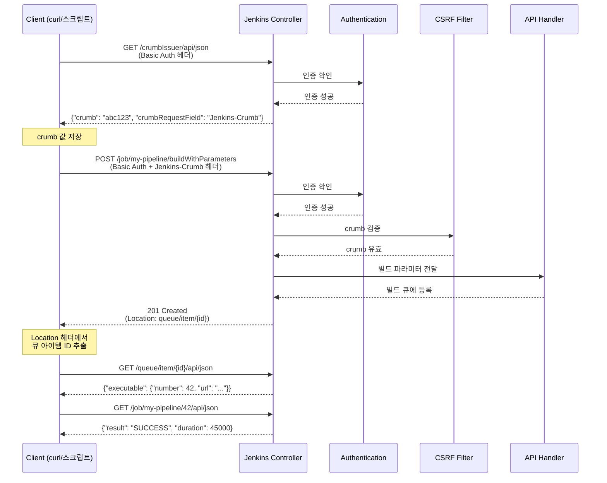
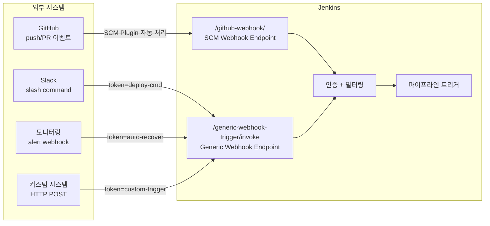

# 젠킨스 REST API 구조와 연동

---

> Jenkins REST API의 전체 구조와 고급 API, Webhook 연동, CLI, 외부 시스템 연동 패턴을 다룬다.
> 실습 환경 설정은 01-00 참조

## 3. Jenkins REST API 상세

> Jenkins REST API의 핵심 설계 원칙은 "모든 UI 페이지가 API 엔드포인트를 가진다"는 것이다.
>
> - 브라우저에서 보는 URL 끝에 `/api/json`을 붙이면 해당 리소스의 JSON 표현을 얻을 수 있다.
> - 별도의 API 문서 없이도 UI를 탐색하면서 엔드포인트를 파악할 수 있다.

### 주요 API 엔드포인트

| 엔드포인트 | 메서드 | 설명 |
| --- | --- | --- |
| `/api/json` | GET | Jenkins 루트 정보 (잡 목록, 뷰 등) |
| `/job/{name}/api/json` | GET | 특정 잡의 상태, 최근 빌드 번호, 설정 정보 |
| `/job/{name}/build` | POST | 파라미터 없는 빌드 트리거 |
| `/job/{name}/buildWithParameters` | POST | 파라미터를 포함한 빌드 트리거 |
| `/job/{name}/{buildNumber}/api/json` | GET | 특정 빌드의 상세 정보 (결과, 소요시간, 변경사항) |
| `/job/{name}/{buildNumber}/consoleText` | GET | 특정 빌드의 콘솔 로그 전체 |
| `/job/{name}/lastBuild/api/json` | GET | 가장 최근 빌드 정보 (lastSuccessfulBuild, lastFailedBuild도 가능) |
| `/queue/api/json` | GET | 현재 빌드 큐에 대기 중인 작업 목록 |
| `/computer/api/json` | GET | 모든 Agent(노드)의 상태, Executor 사용률 |
| `/crumbIssuer/api/json` | GET | CSRF 방지용 crumb 토큰 발급 |

### 인증 방식

**API Token (권장)**

사용자별로 발급하는 토큰으로, Jenkins UI의 `사용자 설정 → API Token`에서 생성한다. 비밀번호 대신 토큰을 사용하는 이유는 다음과 같다:

- 토큰은 개별 폐기가 가능하다
- Jenkins 로그인 비밀번호 변경과 독립적으로 유효하다
- 토큰별로 사용 기록을 추적할 수 있다

**Basic Auth**

HTTP 요청의 Authorization 헤더에 `username:apiToken`을 Base64 인코딩하여 전달한다. curl에서는 `-u admin:API_TOKEN` 플래그로 간편하게 사용할 수 있다.

**CSRF Protection (crumb)**

Jenkins는 POST 요청에 대해 CSRF(Cross-Site Request Forgery) 방지를 적용한다. POST 요청을 보내기 전에 `/crumbIssuer/api/json`에서 crumb 값을 발급받고, 이후 요청의 헤더에 `Jenkins-Crumb: {crumb값}`을 포함해야 한다. 이 메커니즘이 필요한 이유는 악의적인 웹 페이지가 사용자 브라우저의 Jenkins 세션을 이용하여 빌드를 트리거하는 공격을 방지하기 위해서다.

### curl 사용 예시

```bash
# 1. CSRF crumb 발급
CRUMB=$(curl -s -u admin:API_TOKEN \
  'http://localhost:8080/crumbIssuer/api/json' | jq -r '.crumb')

# 2. 파라미터 빌드 트리거
curl -X POST -u admin:API_TOKEN \
  -H "Jenkins-Crumb: $CRUMB" \
  'http://localhost:8080/job/my-pipeline/buildWithParameters' \
  --data-urlencode 'DEPLOY_ENV=staging' \
  --data-urlencode 'IMAGE_TAG=v1.2.3'

# 3. 빌드 상태 조회 (결과만 추출)
curl -s -u admin:API_TOKEN \
  'http://localhost:8080/job/my-pipeline/lastBuild/api/json' \
  | jq '{result: .result, duration: .duration, timestamp: .timestamp}'

# 4. 특정 필드만 조회 (tree 파라미터로 응답 경량화)
curl -s -u admin:API_TOKEN \
  'http://localhost:8080/job/my-pipeline/api/json?tree=builds[number,result,timestamp]{0,5}'

# 5. 빌드 로그 조회
curl -s -u admin:API_TOKEN \
  'http://localhost:8080/job/my-pipeline/lastBuild/consoleText'
```

`tree` 파라미터는 Jenkins API에서 특히 중요하다. 기본 응답은 모든 필드를 포함하여 데이터가 크기 때문에, `tree`로 필요한 필드만 지정하면 네트워크 전송량과 파싱 시간을 크게 줄일 수 있다.

아래 시퀀스는 API를 통해 파라미터 빌드를 트리거하고 결과를 확인하는 전체 과정을 보여준다. 핵심은 crumb 발급 → POST 요청 → 큐 아이템 조회 → 빌드 결과 확인의 4단계 흐름이다. `201 Created` 응답의 `Location` 헤더에서 큐 아이템 URL을 얻을 수 있다는 점이 실무에서 자주 놓치는 부분이다.



## 3.5 프로덕션에서 사용하는 고급 API

> 실제 프로덕션 환경에서는 기본 REST API만으로는 부족한 경우가 많다.
>
> - 스테이지별 로그 조회, 배포 승인 자동화, 자격증명 관리 등은 Jenkins가 별도로 제공하는 고급 API를 필요로 한다.
> - 이 섹션에서는 실무에서 흔히 사용하지만 공식 문서에서 찾기 어려운 API들을 정리한다.

### Blue Ocean REST API

Blue Ocean REST API는 파이프라인의 스테이지/스텝 구조를 트리 형태로 조회할 수 있는 API이다. 기본 REST API의 `/api/json`은 빌드 전체의 결과만 제공하지만, Blue Ocean API는 **각 스테이지(node)와 스텝의 상태, 소요시간, 로그를 개별적으로 조회**할 수 있다.

```
# 기본 경로
/blue/rest/organizations/jenkins/pipelines/{pipeline}/runs/{runNumber}

# 스테이지(노드) 목록
GET /blue/rest/organizations/jenkins/pipelines/{pipeline}/runs/{runNumber}/nodes/

# 특정 스테이지의 스텝 목록
GET /blue/rest/organizations/jenkins/pipelines/{pipeline}/runs/{runNumber}/nodes/{nodeId}/steps/

# 특정 스텝의 로그
GET /blue/rest/organizations/jenkins/pipelines/{pipeline}/runs/{runNumber}/nodes/{nodeId}/steps/{stepId}/log/
```

이 API가 필요한 이유는 배포 모니터링 대시보드에서 "어느 스테이지에서 실패했는가?"를 사용자에게 보여주려면 스테이지별 상태를 개별 조회해야 하기 때문이다. 기본 API의 `consoleText`는 전체 로그를 텍스트 덩어리로 반환하므로 스테이지 단위 파싱이 불가능하다.

**폴더 구조의 파이프라인**일 경우 경로에 폴더를 포함해야 한다:

```
# 폴더 내 파이프라인: folder1/folder2/my-pipeline
/blue/rest/organizations/jenkins/pipelines/folder1/pipelines/folder2/pipelines/my-pipeline/runs/1/nodes/
```

> **주의**: Blue Ocean Plugin이 설치되어 있어야 이 API를 사용할 수 있다. 최근 Jenkins 환경에서는 기본 번들로 항상 포함된다고 가정하지 않는 편이 안전하다.

### Workflow API (wfapi)

Workflow API는 Blue Ocean보다 가볍고, 파이프라인 실행의 전체 구조를 한 번의 호출로 조회할 수 있는 API이다. 최근 Jenkins에서는 이 endpoint 집합을 보통 `Pipeline: REST API Plugin`이 제공하는 `wfapi`로 이해하는 편이 정확하다. Blue Ocean API가 nodes → steps → log를 3번 호출해야 한다면, wfapi는 `/wfapi/describe`로 스테이지 목록과 상태를 한 번에 가져올 수 있다.

```
# 빌드의 전체 워크플로우 구조 (스테이지 목록 + 상태 + 소요시간)
GET /job/{name}/{buildNumber}/wfapi/describe

# 응답 예시 (핵심 필드):
{
  "id": "42",
  "status": "SUCCESS",
  "stages": [
    {
      "id": "6",
      "name": "Build",
      "status": "SUCCESS",
      "durationMillis": 12340
    },
    {
      "id": "12",
      "name": "Deploy",
      "status": "PAUSED_PENDING_INPUT",
      "durationMillis": 0
    }
  ]
}
```

Blue Ocean API와 wfapi 중 어느 것을 선택할지는 용도에 따라 다르다:

- 스테이지 **목록과 상태**만 필요하면 wfapi가 효율적이다
- 스텝별 **상세 로그**까지 필요하면 Blue Ocean API를 사용한다
- 두 API를 조합하여 wfapi로 전체 구조를 파악한 뒤, 실패한 스테이지의 로그만 Blue Ocean API로 조회하는 패턴이 실무에서 일반적이다

### Input/Approval API (배포 승인 자동화)

Jenkins 파이프라인의 `input` 스텝은 사람의 승인을 기다리는 게이트이다. 웹 UI에서 "Proceed" 버튼을 클릭하는 대신, API로 프로그래밍 방식의 승인/거부가 가능하다. 이 API가 중요한 이유는 ChatOps(Slack 봇)나 외부 승인 시스템과 연동하여 배포 승인을 자동화할 수 있기 때문이다.

```bash
# 1. 대기 중인 input 목록 조회 (wfapi 활용)
curl -s -u admin:API_TOKEN \
  'http://localhost:8080/job/my-pipeline/42/wfapi/describe' \
  | jq '.stages[] | select(.status == "PAUSED_PENDING_INPUT")'

# 2. input ID 확인 (wfapi의 pendingInputActions 필드)
curl -s -u admin:API_TOKEN \
  'http://localhost:8080/job/my-pipeline/42/wfapi/pendingInputActions'

# 3. 승인 (proceed)
curl -X POST -u admin:API_TOKEN \
  -H "Jenkins-Crumb: $CRUMB" \
  'http://localhost:8080/job/my-pipeline/42/input/{inputId}/proceedEmpty'

# 4. 거부 (abort)
curl -X POST -u admin:API_TOKEN \
  -H "Jenkins-Crumb: $CRUMB" \
  'http://localhost:8080/job/my-pipeline/42/input/{inputId}/abort'
```

`proceedEmpty`는 파라미터 없이 승인할 때 사용하고, 파라미터가 있는 input은 `/input/{inputId}/submit`에 JSON body를 전달한다.

### Credentials REST API (자격증명 CRUD)

Jenkins Credentials Plugin은 시크릿(비밀번호, SSH 키, 토큰 등)을 중앙 관리하는 플러그인이다. REST API로 자격증명의 생성/조회/수정/삭제가 가능하여, 인프라 자동화 시 프로그래밍 방식으로 시크릿을 등록할 수 있다.

```bash
# 자격증명 목록 조회 (글로벌 도메인)
GET /credentials/store/system/domain/_/api/json?tree=credentials[id,displayName]

# 특정 자격증명 상세 조회
GET /credentials/store/system/domain/_/credential/{id}/api/json

# 자격증명 생성 (XML 형식)
curl -X POST -u admin:API_TOKEN \
  -H "Jenkins-Crumb: $CRUMB" \
  -H "Content-Type: application/xml" \
  'http://localhost:8080/credentials/store/system/domain/_/createCredentials' \
  --data '<com.cloudbees.plugins.credentials.impl.UsernamePasswordCredentialsImpl>
    <scope>GLOBAL</scope>
    <id>my-credential-id</id>
    <username>deploy-user</username>
    <password>secret123</password>
  </com.cloudbees.plugins.credentials.impl.UsernamePasswordCredentialsImpl>'

# 자격증명 삭제
DELETE /credentials/store/system/domain/_/credential/{id}/
```

> **보안 주의**: Credentials API는 시크릿 값을 반환하지 않는다(마스킹됨). 생성/수정은 가능하지만 읽기는 메타데이터만 제공한다. 이는 의도적인 보안 설계이다.

### Agent/Computer API (노드 관리)

Agent(과거 Slave) 상태를 모니터링하는 API이다. Executor 사용률, 오프라인 여부, 디스크 공간 등을 조회할 수 있어 운영 대시보드 구축에 활용된다.

```bash
# 전체 노드 목록 + 상태
GET /computer/api/json?tree=computer[displayName,offline,numExecutors,idle]

# 특정 노드 상세
GET /computer/{nodeName}/api/json
```

### 고급 API 요약

| API | 엔드포인트 | 용도 | 플러그인 의존 |
| --- | --- | --- | --- |
| Blue Ocean | `/blue/rest/organizations/jenkins/...` | 스테이지/스텝별 상태·로그 조회 | Blue Ocean Plugin |
| Workflow (wfapi) | `/job/{name}/{build}/wfapi/describe` | 파이프라인 구조 일괄 조회 | Pipeline: REST API Plugin |
| Input/Approval | `/job/{name}/{build}/input/{id}/...` | 배포 승인/거부 자동화 | Pipeline (기본 내장) |
| Credentials | `/credentials/store/system/domain/_/...` | 시크릿 CRUD | Credentials Plugin |
| Computer | `/computer/api/json` | 에이전트 상태 모니터링 | 기본 내장 |

## 4. Webhook 연동

> Jenkins를 외부 시스템과 연결하는 방법은 두 가지 방향이 있다.
>
> - **SCM Webhook**: GitHub/GitLab이 코드 변경 이벤트를 Jenkins에 알린다.
> - **Generic Webhook Trigger**: 어떤 시스템이든 HTTP POST로 Jenkins를 트리거한다.

### Generic Webhook Trigger Plugin

Generic Webhook Trigger Plugin은 외부 시스템에서 보내는 HTTP POST 요청을 받아 Jenkins 파이프라인을 트리거하는 플러그인이다. GitHub/GitLab 같은 특정 SCM에 종속되지 않고, **어떤 시스템이든** JSON/XML payload를 보낼 수 있으면 Jenkins를 트리거할 수 있다는 점이 핵심이다.

외부 시스템이 `http://JENKINS_URL/generic-webhook-trigger/invoke?token=my-token`으로 POST 요청을 보내면, 플러그인이 payload를 파싱하여 `genericVariables`에 정의된 JSONPath 매핑에 따라 환경 변수를 추출하고, 해당 토큰에 매칭되는 파이프라인을 트리거한다.

```groovy
// Jenkinsfile에서 Generic Webhook Trigger 설정
pipeline {
    triggers {
        GenericTrigger(
            genericVariables: [
                [key: 'REPO_NAME', value: '$.repository.name'],
                [key: 'BRANCH', value: '$.ref'],
                [key: 'COMMIT_SHA', value: '$.after']
            ],
            token: 'my-webhook-token',
            causeString: 'Triggered by webhook: $REPO_NAME',
            printContributedVariables: true,
            printPostContent: true,
            // 특정 브랜치만 트리거 (선택)
            regexpFilterText: '$BRANCH',
            regexpFilterExpression: '^refs/heads/(main|develop)$'
        )
    }
    stages {
        stage('Build') {
            steps {
                echo "Building ${REPO_NAME} on branch ${BRANCH}"
                echo "Commit: ${COMMIT_SHA}"
            }
        }
    }
}
```

`regexpFilterText`와 `regexpFilterExpression`을 조합하면 payload 내용을 기반으로 트리거 여부를 필터링할 수 있다. 위 예시에서는 main 또는 develop 브랜치에 대한 push 이벤트만 파이프라인을 실행한다. 이 필터링이 중요한 이유는 webhook은 모든 이벤트에 대해 호출되기 때문에, 불필요한 빌드를 방지하려면 Jenkins 측에서 조건을 걸러야 하기 때문이다.

### SCM Webhook (GitHub/GitLab)

SCM Webhook은 GitHub/GitLab이 제공하는 네이티브 이벤트 알림 메커니즘이다. Jenkins의 GitHub Plugin이나 GitLab Plugin이 이 이벤트를 수신하여 자동으로 해당 브랜치의 빌드를 트리거한다.

GitHub 설정 흐름:

- GitHub 저장소 → Settings → Webhooks → Add webhook
- Payload URL: `http://JENKINS_URL/github-webhook/`
- Content type: `application/json`
- 이벤트 선택: `push`, `pull_request` 등
- Jenkins에서 GitHub Plugin이 요청을 수신하여 해당 Job을 트리거

### SCM Webhook vs Generic Webhook Trigger 비교

| 항목 | SCM Webhook | Generic Webhook Trigger |
| --- | --- | --- |
| **설정 방식** | 플러그인이 자동으로 endpoint 생성 | 수동으로 token, 변수 매핑 설정 |
| **소스 시스템** | GitHub/GitLab/Bitbucket 전용 | 모든 HTTP 클라이언트 (Slack, JIRA, 커스텀 앱) |
| **Payload 처리** | SCM 이벤트 구조에 최적화, 자동 파싱 | JSONPath/XPath로 자유롭게 매핑 |
| **필터링** | 브랜치 필터 (Branch Source 설정) | 정규식 기반 조건 필터 |
| **인증** | GitHub App 또는 Secret Token | URL에 포함된 token 파라미터 |
| **적합한 상황** | 코드 변경(push/PR)에 의한 빌드 트리거 | 외부 시스템 이벤트 연동, 비-SCM 트리거 |
| **디버깅** | GitHub Webhook delivery 로그 확인 가능 | `printPostContent: true`로 payload 로그 확인 |

SCM Webhook을 사용해야 하는 기본 이유는 코드 변경에 의한 트리거는 SCM 플러그인이 이미 최적화된 처리를 제공하기 때문이다. Generic Webhook Trigger를 선택해야 하는 경우는 Slack 커맨드로 배포를 트리거하거나, 외부 모니터링 시스템이 알림을 보내면 자동 복구 파이프라인을 실행하는 등 비-SCM 이벤트를 처리할 때이다.



## 5. Jenkins CLI

> Jenkins CLI는 REST API와 동일한 작업을 수행하지만, 빌드 완료 대기나 Job 마이그레이션처럼 반복 로직이 필요한 경우에 REST API보다 간결하다.
>
> - `jenkins-cli.jar`는 Jenkins 서버에서 직접 다운로드할 수 있다.
> - `-w` 플래그 하나로 빌드 완료까지 대기하는 polling 로직을 대체한다.

### jenkins-cli.jar

Jenkins는 서버 자체에서 CLI 도구를 다운로드할 수 있도록 제공한다. `http://JENKINS_URL/jnlpJars/jenkins-cli.jar`에서 jar 파일을 받아 사용한다.

```bash
# CLI 다운로드
curl -O http://localhost:8080/jnlpJars/jenkins-cli.jar

# 빌드 트리거 + 완료까지 대기 (-w 플래그)
java -jar jenkins-cli.jar -s http://localhost:8080/ \
  -auth admin:API_TOKEN \
  build my-pipeline -p DEPLOY_ENV=prod -w

# 잡 목록 조회
java -jar jenkins-cli.jar -s http://localhost:8080/ \
  -auth admin:API_TOKEN \
  list-jobs

# 잡 설정 XML 내보내기 (백업/마이그레이션)
java -jar jenkins-cli.jar -s http://localhost:8080/ \
  -auth admin:API_TOKEN \
  get-job my-pipeline > my-pipeline-config.xml

# 잡 설정 가져오기
java -jar jenkins-cli.jar -s http://localhost:8080/ \
  -auth admin:API_TOKEN \
  create-job new-pipeline < my-pipeline-config.xml

# 플러그인 설치
java -jar jenkins-cli.jar -s http://localhost:8080/ \
  -auth admin:API_TOKEN \
  install-plugin docker-workflow -restart
```

### CLI를 사용하는 상황

CLI는 REST API로도 할 수 있는 작업을 제공하지만, 다음 상황에서 더 편리하다:

- **자동화 스크립트**: 빌드 트리거 후 완료까지 대기하는 `-w` 플래그는 REST API로 구현하려면 polling 로직을 직접 작성해야 하지만, CLI는 한 줄로 해결된다.
- **Jenkins 마이그레이션**: `get-job`으로 모든 Job 설정을 XML로 추출하고 `create-job`으로 새 Jenkins에 복원하는 작업은 CLI가 가장 효율적이다.
- **플러그인 관리**: 여러 플러그인을 한 번에 설치하거나 업데이트하는 스크립트를 작성할 때 CLI가 적합하다.
- **다른 CI/CD 도구에서 Jenkins 연동**: GitLab CI에서 특정 단계에서 Jenkins 빌드를 트리거하고 결과를 기다려야 할 때, CLI의 `-w` 플래그가 유용하다.

## 6. 외부 시스템 연동 패턴

> Jenkins의 진정한 가치는 단독 실행이 아니라 조직 내 다른 시스템들과 연동할 때 발휘된다.
>
> - **Push 패턴**: Jenkins가 외부로 알린다 (Slack, JIRA, 모니터링 마커).
> - **Pull 패턴**: 외부가 Jenkins를 트리거한다 (ChatOps, 자동 복구, 스케줄러).

### Jenkins → 외부 알림 (Push)

**Slack/Teams 알림**

```groovy
pipeline {
    agent any
    stages {
        stage('Deploy') {
            steps {
                sh './deploy.sh'
            }
        }
    }
    post {
        success {
            slackSend(
                channel: '#deployments',
                color: 'good',
                message: "배포 성공: ${env.JOB_NAME} #${env.BUILD_NUMBER}\n환경: ${params.DEPLOY_ENV}"
            )
        }
        failure {
            slackSend(
                channel: '#alerts',
                color: 'danger',
                message: "배포 실패: ${env.JOB_NAME} #${env.BUILD_NUMBER}\n로그: ${env.BUILD_URL}console"
            )
        }
    }
}
```

성공과 실패를 다른 채널로 보내는 이유는 `#deployments`는 정보성 채널이고, `#alerts`는 즉시 대응이 필요한 채널이기 때문이다. 실패 알림에 빌드 로그 URL을 포함시키면 담당자가 바로 원인을 파악할 수 있다.

**JIRA/이슈 트래커**

빌드 결과에 따라 JIRA 이슈의 상태를 자동으로 변경하는 패턴이다. 예를 들어 배포가 성공하면 관련 이슈를 "배포완료" 상태로 전이하고, 빌드 번호와 환경 정보를 코멘트로 추가한다. JIRA Plugin 또는 REST API를 `httpRequest` 스텝으로 호출하여 구현한다.

**모니터링 배포 마커**

배포 이벤트를 Datadog이나 Grafana에 마커(annotation)로 전송하면, 메트릭 그래프에서 "이 시점에 배포가 발생했다"는 것을 시각적으로 확인할 수 있다. 이 패턴이 중요한 이유는 배포 후 성능이 저하되었을 때 "어느 배포가 원인인가?"를 즉시 파악할 수 있기 때문이다.

```groovy
// Datadog에 배포 이벤트 전송 예시
post {
    success {
        httpRequest(
            url: 'https://api.datadoghq.com/api/v1/events',
            httpMode: 'POST',
            customHeaders: [[name: 'DD-API-KEY', value: "${env.DD_API_KEY}"]],
            requestBody: """{
                "title": "Deployment: ${env.JOB_NAME} #${env.BUILD_NUMBER}",
                "text": "Deployed to ${params.DEPLOY_ENV}",
                "tags": ["environment:${params.DEPLOY_ENV}", "service:my-app"],
                "alert_type": "success"
            }"""
        )
    }
}
```

### 외부 → Jenkins (Pull)

이 방향의 연동은 앞서 다룬 REST API와 Webhook이 담당한다. 대표적인 시나리오는 다음과 같다:

- **ChatOps**: Slack에서 `/deploy staging v1.2.3` 명령을 입력하면, Slack Bot이 Jenkins API를 호출하여 배포 파이프라인을 트리거한다.
- **모니터링 자동 복구**: Prometheus AlertManager가 특정 조건에서 webhook을 발송하면, Jenkins가 자동 복구 파이프라인(롤백, 스케일 아웃 등)을 실행한다.
- **스케줄링 시스템 연동**: 외부 스케줄러(Airflow 등)가 전체 워크플로우의 한 단계로 Jenkins 빌드를 트리거한다.

### 연동 시 주의사항

연동 패턴을 적용할 때 공통으로 지켜야 할 원칙들이 있다:

- **크레덴셜 분리**: 각 외부 시스템의 API 키/토큰은 Jenkins Credentials Store에 별도로 저장하고, 파이프라인에서 `credentials()` 바인딩으로 접근한다. 평문으로 Jenkinsfile에 넣으면 저장소에 시크릿이 노출된다.
- **타임아웃 설정**: 외부 시스템 호출 시 반드시 타임아웃을 설정한다. 모니터링 API가 응답하지 않는다고 배포 파이프라인이 멈춰서는 안 된다.
- **실패 격리**: 알림 전송 실패가 전체 파이프라인을 실패시키면 안 된다. `try-catch`로 감싸거나 `post` 액션 내에서 처리하여, 알림 실패가 배포 결과에 영향을 주지 않도록 한다.
- **멱등성 고려**: webhook이 중복 전달될 수 있다. 동일한 이벤트로 같은 빌드가 두 번 실행되지 않도록, 파이프라인에서 중복 체크 로직을 고려해야 한다.
