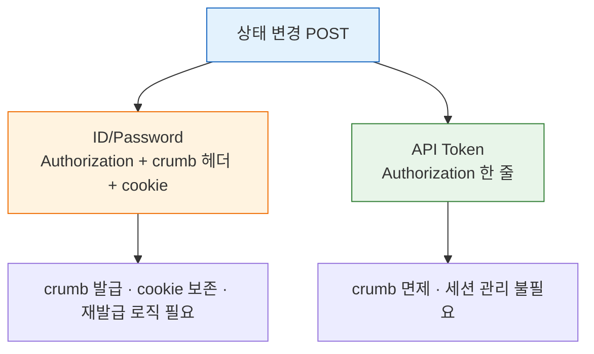
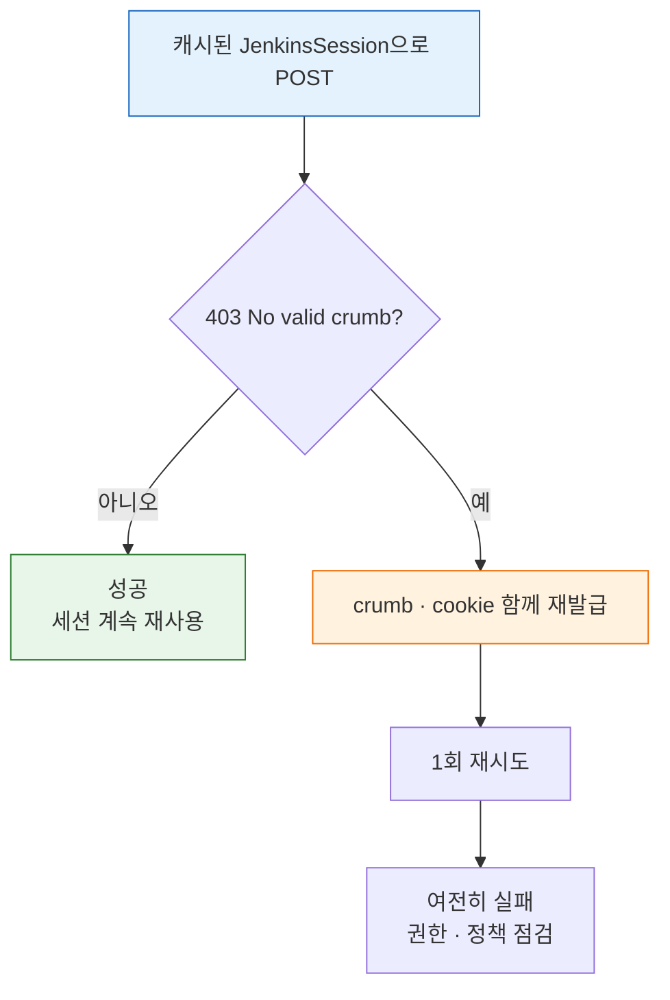

# 젠킨스 인증 모델과 TPS 패턴 (2.222+)

> **본 문서는 spec(`01-02.md`)을 읽었다고 가정한 코드 패턴 모음**입니다. 인증 API의 호출 순서, crumb·cookie의 발급 절차, 응답 필드 구조는 spec에 있습니다. 이 문서는 그 위에서 "왜 인증 모델이 단순해졌는지"와 "TPS 코드에서 어떤 패턴이 자리 잡았는지"를 정리합니다.

## §학습 목표

> 이 문서를 읽고 나면 Jenkins 2.222+에서 API Token이 crumb를 면제받는 이유를 설명하고, `JenkinsSession`·Feign URI override·공통 `FeignJenkinsConfig` 세 패턴이 인증 복잡도를 어떻게 격리하는지 코드로 보이며, crumb·cookie 만료 시 재시도 전략을 설계할 수 있습니다.

## §사전 지식

> 01-02의 crumb + cookie 인증 흐름을 알고 있다면, 이 문서는 그 흐름을 "객체 하나로 캡슐화하고, 인증 수단이 Token으로 바뀌면 필드가 줄어드는" 코드 진화로 일반화한 것입니다.

## 1. Jenkins 2.222+에서 바뀐 점 — 짧게

> API Token 인증은 crumb 검증을 면제받습니다. crumb 자체가 사라진 게 아니라 Token 호출이 그 단계를 건너뛴다는 뜻입니다.

Jenkins 2.222부터 **API Token 인증 요청은 CSRF crumb 검증 대상에서 제외**됩니다(공식 문구: "Requests authenticating with an API token are exempt from CSRF protection in Jenkins"). `/crumbIssuer/api/json` 자체가 사라진 것이 아니라, API Token 기반 호출은 crumb 발급 단계를 건너뛸 수 있다는 뜻입니다.

| 인증 방식 | POST에서 crumb | cookie | 특징 |
|-----------|----------------|--------|------|
| ID/Password | 필요 | 필요 | 현재 TPS 검증 환경 (`01-02` 흐름 유지) |
| API Token | 불필요 | 불필요 | 2.222+ 권장 — GET/POST 인증 헤더 통일 가능 |

이 차이는 코드 구조에 직접 영향을 줍니다. ID/Password는 GET/POST 분기, crumb 캐시, cookie 보존 로직을 모두 가져야 하지만, API Token은 `Authorization: Basic <user:token>` 한 줄로 통일됩니다.

두 인증 수단이 POST에서 요구하는 재료를 비교하면 다음과 같습니다:



> 주의: 운영 환경이 ID/Password 인증이면 2.462.3·2.504 같은 최신 LTS여도 `01-02` crumb + cookie 흐름이 여전히 맞습니다. "최신 버전 = 자동 단순화"가 아니라 "**인증 수단**과 **`useCrumbs` 정책**"이 결정합니다.

## 2. JenkinsAuthVo / JenkinsSession 패턴

> 인증 재료를 호출마다 흩뿌리지 않고 객체 하나에 묶어, 사용처는 세 헤더만 꺼내 쓰게 만드는 패턴입니다.

핵심은 인증 재료를 호출마다 흩뿌리지 않고 하나의 객체로 캡슐화하는 것입니다. ID/Password 환경에서는 `JenkinsSession` 형태로 세션 문맥을 통째로 다룹니다.

```java
public record JenkinsSession(
    URI baseUrl,
    String basicAuth,
    String crumbRequestField,
    String crumb,
    String cookie
) {}
```

발급 흐름은 응답 본문에서 `crumb`/`crumbRequestField`를, 응답 헤더 `Set-Cookie`에서 `JSESSIONID`를 추출해 한 번에 묶습니다.

```java
ResponseEntity<CrumbResponse> response =
    jenkinsFeignClient.getCrumb(baseUrl, basicAuth);

String cookie = response.getHeaders()
    .getValuesAsList(HttpHeaders.SET_COOKIE)
    .stream()
    .map(value -> value.split(";", 2)[0])
    .collect(Collectors.joining("; "));

JenkinsSession session = new JenkinsSession(
    baseUrl,
    basicAuth,
    response.getBody().crumbRequestField(),
    response.getBody().crumb(),
    cookie
);
```

이후 POST는 `Authorization` + `session.crumbRequestField(): session.crumb()` + `Cookie: session.cookie()` 세 헤더만 다시 꺼내 씁니다. crumb·cookie 발급 메커니즘 자체는 `01-02` §3을 참조합니다.

API Token 환경으로 전환되면 객체는 두 필드로 줄어듭니다.

```java
public record JenkinsAuth(String basicAuth, URI jenkinsUrl) {}
```

## 3. Feign URI Override 패턴

> 하나의 Feign Client로 여러 Jenkins 서버를 호출하기 위해, 첫 파라미터로 받은 URI로 대상 서버를 런타임에 덮어쓰는 패턴입니다.

TPS는 하나의 Feign Client로 다수의 Jenkins 서버를 호출해야 하므로, 첫 번째 파라미터로 `URI baseUrl`을 받아 런타임에 실제 Jenkins URL을 덮어씁니다.

```java
@FeignClient(
    name = "jenkins",
    url = "https://",
    configuration = FeignJenkinsConfig.class
)
public interface JenkinsFeignClient {

    @GetMapping("/crumbIssuer/api/json")
    ResponseEntity<JenkinsAuthVo> getCrumb(
        URI baseUrl,
        @RequestHeader("Authorization") String basicAuth
    );
}
```

이 패턴 덕분에 DB에 저장된 Jenkins URL을 그대로 활용할 수 있고, 인증 정보와 대상 서버를 한 요청 문맥 안에서 다룰 수 있습니다.

`FeignJenkinsConfig`는 단순 HTTP 설정이 아니라 Jenkins 연동 규칙(요청·응답 로깅 통일, 자체 서명 인증서 대응, 공통 헤더 정책)의 집합입니다. 검증 환경에서 `curl -k`가 필요한 것과 같은 이유로, 코드에서도 개발/운영의 SSL 처리 정책을 분리하는 것이 핵심입니다.

## 4. 현대화 시 줄일 수 있는 것

> Token 환경으로 통일하면 crumb 관련 필드·메서드·캐시·헤더 분기가 통째로 사라집니다. "현대화"의 실효는 개념이 아니라 코드 복잡도 감소입니다.

API Token 환경으로 통일되면 다음 요소를 모두 제거할 수 있습니다 — `crumb`·`cookie`·`crumbRequestField` 필드, crumb 조회 메서드, crumb 캐시, POST 전용 헤더 분기.

```java
// Before — ID/Password
private HttpHeaders buildPostHeaders(long jenkinsInstanceId) {
    var headers = buildGetHeaders(jenkinsInstanceId);
    var crumb = getCrumb(jenkinsInstanceId);
    if (crumb != null) {
        headers.set(crumb.crumbRequestField, ...);
        headers.set("Cookie", crumb.cookie);
    }
    return headers;
}

// After — API Token
private HttpHeaders buildHeaders(long jenkinsInstanceId) {
    var headers = new HttpHeaders();
    headers.set("Authorization", "Basic " + getBasicAuth(jenkinsInstanceId));
    return headers;
}
```

"현대화"의 실질적 효과는 인증 개념 변화가 아니라 **코드 복잡도 감소**입니다.

## 5. crumb·cookie 만료와 갱신 전략

> crumb는 세션·IP에 묶인 CSRF 값이라 환경이 바뀌면 무효화됩니다. 매번 새로 받지 말고 캐시한 뒤 403이 나면 한 번만 재발급하는 전략이 현실적입니다.

crumb은 "고정 토큰"이 아니라 사용자·세션 ID·IP·instance salt에 묶인 CSRF 값이라, 세션이 바뀌거나 IP가 변하면(프록시 환경) 무효화될 수 있습니다. cookie는 일반 세션 만료(`--sessionTimeout`, 미설정 시 기본 60분)로 끊깁니다. `Enable proxy compatibility`를 켜면 IP 조건은 제외할 수 있습니다.

운영 코드의 현실적인 전략은 다음과 같습니다.

- 매 POST마다 crumb을 새로 받지 않습니다 — `JenkinsSession`을 메모리에 캐시합니다.
- POST에서 `403 No valid crumb was included in the request`가 나오면 crumb·cookie를 함께 재발급하고 1회만 재시도합니다.
- Jenkins 세션 타임아웃을 알고 있다면 그보다 조금 이르게 선제 갱신합니다.

매 요청마입니다 `GET /crumbIssuer/api/json`을 선행하거나, crumb·cookie를 파일에 장기 보관해 재사용하는 방식은 비효율적입니다.

캐시된 세션으로 POST를 보내다 403이 나면 한 번만 재발급해 재시도하는 흐름은 다음과 같습니다:



## 6. 버전별 기억할 것

> 버전 번호 자체보다 "지금 무엇으로 인증하는가"와 "현재 보안 정책"이 crumb 필요 여부를 결정합니다.

| Jenkins 버전 | 인증 영향 |
|-------------|----------|
| 2.222 | API Token 인증 시 crumb 면제 도입 |
| 2.462.3 | 현재 검증 환경. 비밀번호 인증이면 crumb 흐름 유지 |
| 2.504 | 최근 LTS — crumb 면제 원칙 유지 |

버전 자체보다 중요한 건 **지금 무엇으로 인증하는가**와 **현재 Jenkins의 보안 정책**입니다.

## 7. 문서 사용 가이드

- `01-02`: 현재 환경에서 인증 API를 어떻게 호출하는가 (spec)
- `01-02a` (이 문서): 인증 모델이 왜 달라지는가, TPS 코드에서 무엇이 패턴인가
- `01-02b`: API Token을 실제로 어떻게 발급하고 회전할 것인가
- `01-04`: 인증이 끝난 뒤 빌드 실행 POST를 어떻게 보내는가
- `01-05`: 빌드 이후 상태를 어떻게 추적하는가

## 8. 핵심 정리

1. Jenkins 2.222+에서 API Token 인증은 crumb 검증에서 면제됩니다 — 그래서 GET/POST 인증 규칙을 통합할 수 있습니다.
2. 다만 ID/Password 환경에서는 spec의 crumb + cookie 흐름이 여전히 맞습니다. crumb·cookie는 인증 대체재가 아니라 비밀번호 POST의 세션·CSRF 검증 보조 재료입니다.
3. TPS 코드는 `JenkinsSession`(또는 `JenkinsAuth`) + Feign URI override + 공통 `FeignJenkinsConfig` 세 패턴을 축으로 인증 복잡도를 격리합니다.

## 9. 면접 질문

> 답을 떠올린 뒤 §정답 절에서 같은 번호로 대조하세요.

1. Jenkins 2.222+에서 API Token이 crumb 면제를 받는데도, 어떤 환경에서는 여전히 crumb + cookie 흐름을 써야 합니다. 그 환경은 무엇이고 왜인가요?
2. `JenkinsSession` 같은 객체로 인증 재료를 캡슐화하면 사용처 코드에서 무엇이 줄어드나요?
3. 하나의 Feign Client로 여러 Jenkins 서버를 호출하려면 어떤 패턴을 쓰며, 그 덕분에 무엇을 그대로 활용할 수 있나요?

## 정답

> 위 질문을 스스로 설명해 본 뒤에 펼치세요.

### 정답 1 — crumb 흐름이 여전히 맞는 환경

운영이 **ID/Password 인증 + `useCrumbs: true`** 환경이면, 2.462.3·2.504 같은 최신 LTS여도 crumb + cookie 흐름이 맞습니다. crumb 면제는 어디까지나 **API Token 인증 요청**에만 적용되기 때문입니다. 버전이 아니라 "인증 수단과 `useCrumbs` 정책"이 결정합니다.

### 정답 2 — 캡슐화가 줄이는 것

인증 재료(Basic Auth·crumb·crumbRequestField·cookie)를 호출마다 따로 조립하지 않고 `JenkinsSession` 하나에서 꺼내 쓰므로, POST 헤더 구성 코드가 단순해지고 crumb 캐시·cookie 보존 로직이 한곳으로 모입니다. Token 환경으로 바뀌면 같은 자리에서 객체만 두 필드로 줄이면 됩니다.

### 정답 3 — Feign URI override

`@FeignClient`의 첫 파라미터로 `URI baseUrl`을 받아 런타임에 대상 Jenkins URL을 덮어쓰는 패턴을 씁니다. 덕분에 DB에 저장된 Jenkins URL을 그대로 호출 대상에 쓸 수 있고, 인증 정보와 대상 서버를 한 요청 문맥 안에서 함께 다룰 수 있습니다.

## 참고 링크

- [Jenkins CSRF Protection](https://www.jenkins.io/doc/book/security/csrf-protection/)
- [Jenkins Initial Settings](https://www.jenkins.io/doc/book/installing/initial-settings/)
- [Jenkins Remote Access API](https://www.jenkins.io/doc/book/using/remote-access-api/)
- [Jenkins LTS Changelog](https://www.jenkins.io/changelog-stable/)
