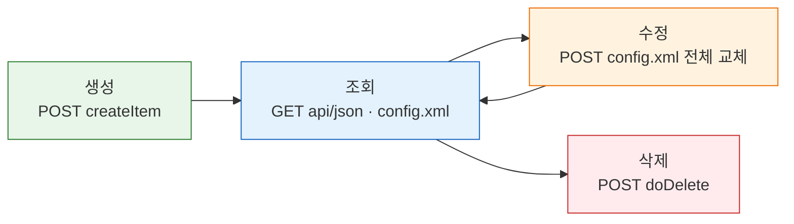
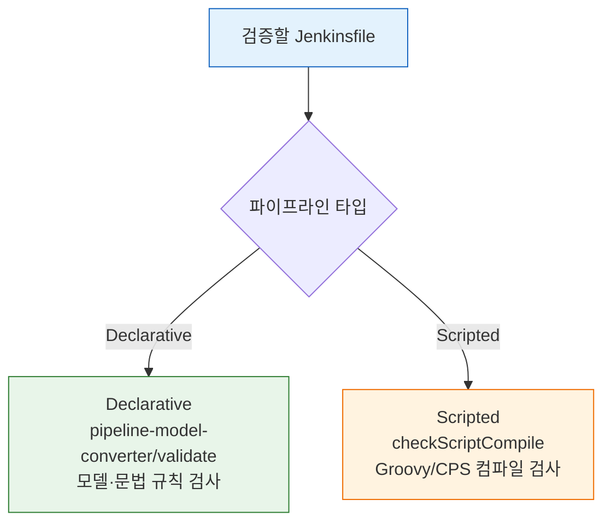

# 젠킨스 파이프라인 CRUD API 스펙
---
> 이 문서는 Jenkins 파이프라인(Job) CRUD API 자체를 설명하는 스펙 문서입니다.
>
> - 조회, 생성, 수정, 삭제, Jenkinsfile 검증 엔드포인트를 다룹니다.
> - TPS 패턴과 현대화 이론은 `01-03a`에서 별도로 다룹니다.

## §학습 목표

> 이 문서를 읽고 나면 Job의 조회·생성·수정·삭제를 REST로 수행하고, `config.xml` 전체 교체 방식의 수정 모델을 설명하며, Declarative와 Scripted에 맞는 Jenkinsfile 검증 API(`pipeline-model-converter/validate` vs `checkScriptCompile`)를 골라 쓸 수 있습니다.

## §사전 지식

> 01-01에서 본 "UI 경로 + `/api/json`" 구조와 01-02의 crumb + cookie 인증을 알고 있다면, 이 문서는 그 위에서 Job 리소스를 CRUD로 다루는 구체적 엔드포인트를 일반화한 것입니다.

## 1. 이 문서의 범위

> 이 문서는 파이프라인(Job)을 다루는 아래 API만 설명합니다.

| 메서드 | 경로 | 목적 |
|------|------|------|
| GET | `/{pipelineStruct}/api/json` | Job 존재 여부, 메타데이터, 빌드 가능 상태 조회 |
| GET | `/{pipelineStruct}/config.xml` | Job 원본 XML 백업 및 수정 전 원본 확인 |
| POST | `/{parent}/createItem?name={newItemName}` | 폴더 또는 파이프라인 생성 |
| POST | `/{pipelineStruct}/config.xml` | 기존 Job XML 전체 덮어쓰기 |
| POST | `/{pipelineStruct}/doDelete` | Job 또는 폴더 삭제 |
| POST | `/{pipelineStruct}/descriptorByName/.../checkScriptCompile` | Groovy/CPS 컴파일 가능 여부 검증 |
| POST | `/pipeline-model-converter/validate` | Declarative Pipeline 모델/문법 검증 |

인증 헤더와 crumb/cookie 흐름은 별도 문서에서 다룹니다:

- `01-02. 젠킨스 인증 API 스펙 (ID-Password + Crumb).md`
- `01-02a. 젠킨스 인증 모델과 TPS 패턴 (2.222+).md`

### 1-1. 공통 경로 규칙

`{pipelineStruct}`는 Jenkins URL 경로 구조를 그대로 따릅니다.

- 단일 Job: `/job/{name}`
- 폴더 중첩 Job: `/job/{folder}/job/{subfolder}/job/{name}`

`{parent}`는 새 아이템을 생성할 상위 경로입니다.

- 루트에 생성: `/createItem`
- 폴더 아래 생성: `/{folderStruct}/createItem`

예시는 다음과 같습니다:

```text
/job/my-pipeline
/job/SBH/job/TEST
/job/SBH/createItem?name=TEST
```

### 1-2. 공통 요청 규칙

모든 예시는 `01-02`에서 기본 인증 준비가 끝났다는 전제입니다. 즉 이 문서에서는 아래 내용을 다시 설명하지 않는입니다.

- `JENKINS_URL`
-  `JENKINS_USER`
-  `JENKINS_PASS`
-  `cookies.txt`
-  `crumb.json`
-  `CRUMB`
-  `CRUMB_FIELD`

예시에서 Job 경로처럼 환경마다 달라지는 값은 먼저 환경 변수로 빼두는 편이 좋습니다. 이후 문서들도 동적인 경로값, 이름값, 상위 폴더값이 나오면 같은 방식으로 `export`해서 재사용하는 것을 기본 원칙으로 봅니다.

macOS/Linux용 예시는 다음과 같습니다:

```bash
export PIPELINE_STRUCT='/job/SBH/job/TEST'
export PARENT_STRUCT='/job/SBH'
export PIPELINE_NAME='TEST'
export FOLDER_NAME='SBH'
```

Windows PowerShell용 예시는 다음과 같습니다:

```powershell
$env:PIPELINE_STRUCT = '/job/SBH/job/TEST'
$env:PARENT_STRUCT = '/job/SBH'
$env:PIPELINE_NAME = 'TEST'
$env:FOLDER_NAME = 'SBH'
```

이 문서에서 의미하는 값은 다음과 같습니다:

| 변수 | 의미 | 예시 |
|------|------|------|
| `PIPELINE_STRUCT` | 조회/수정/삭제/검증 대상 파이프라인 경로 | `/job/SBH/job/TEST` |
| `PARENT_STRUCT` | 새 파이프라인을 생성할 상위 폴더 경로 | `/job/SBH` |
| `PIPELINE_NAME` | 생성할 파이프라인 이름 | `TEST` |
| `FOLDER_NAME` | 생성할 폴더 이름 | `SBH` |

현재 환경처럼 비밀번호 인증을 쓴다면 POST 전에 crumb과 cookie도 같이 준비해야 합니다. 이 문서의 POST 예시는 아래 준비가 끝났다는 전제로 작성합니다:

```bash
# 01-02에서 이미 준비
# cookies.txt
# crumb.json
export CRUMB=$(jq -r '.crumb' crumb.json)
export CRUMB_FIELD=$(jq -r '.crumbRequestField' crumb.json)
```

- 아직 준비하지 않았다면 `01-02. 젠킨스 인증 API 스펙 (ID-Password + Crumb).md`의 crumb 발급 절차를 먼저 실행합니다.
- 사용 규칙은 다음과 같습니다:
  - `CRUMB`, `CRUMB_FIELD`는 shell 변수로 사용합니다.
  - session cookie는 `cookies.txt` 파일로 유지하고 POST에서 `-b cookies.txt`로 전달합니다.

이후 POST 예시에서는 기본값이 `Jenkins-Crumb`라고 가정해도 되지만, 가장 안전한 방식은 헤더 이름도 같이 변수로 쓰는 것입니다:

```bash
export CRUMB=$(jq -r '.crumb' crumb.json)
export CRUMB_FIELD=$(jq -r '.crumbRequestField' crumb.json)

-H "${CRUMB_FIELD}: ${CRUMB}"
```

공통 헤더는 다음과 같습니다:

| 헤더 | 사용 시점 | 설명 |
|------|-----------|------|
| `Authorization` | GET, POST 공통 | Basic Auth 인증 정보 |
| `Jenkins-Crumb` 또는 `crumbRequestField` | 비밀번호 인증 POST | CSRF crumb |
| `Cookie` | 비밀번호 인증 POST | 세션 cookie |
| `Content-Type: application/xml` | XML 전송 POST | config.xml 또는 Folder XML 전송 |
| `Content-Type: application/x-www-form-urlencoded` | form 전송 POST | `--data-urlencode` 사용 시 |

응답 확인 원칙은 다음과 같습니다:

- JSON 응답은 `jq`로 바로 읽기 좋게 정리합니다.
- XML 응답은 파일로 저장한 뒤 확인합니다.
- HTML 응답은 원문 그대로 확인합니다.


파이프라인 하나가 거치는 CRUD 흐름과 각 단계의 엔드포인트를 한눈에 보면 다음과 같습니다:



## 2. 파이프라인 GET API 스펙

### 2-1. `GET /{pipelineStruct}/api/json`

> 파이프라인 Job의 메타데이터를 조회하는 API입니다.

요청 형식은 다음과 같습니다:

```http
GET /{pipelineStruct}/api/json HTTP/1.1
Authorization: Basic <...>
Accept: application/json
```

예시는 다음과 같습니다:

```bash
curl -k -sS -u "${JENKINS_USER}:${JENKINS_PASS}" \
  "${JENKINS_URL}${PIPELINE_STRUCT}/api/json" \
  | jq '{
      name,
      url,
      color,
      buildable,
      nextBuildNumber,
      lastBuild: (
        .lastBuild
        | if . == null then null else {number, url} end
      )
    }'
```

상태 코드까지 같이 보고 싶다면 다음처럼 나눠서 봅니다:

```bash
curl -k -sS -D headers.txt -o body.json \
  -u "${JENKINS_USER}:${JENKINS_PASS}" \
  "${JENKINS_URL}${PIPELINE_STRUCT}/api/json"

cat headers.txt
jq '{
  name,
  url,
  color,
  buildable,
  nextBuildNumber,
  lastBuild: (
    .lastBuild
    | if . == null then null else {number, url} end
  )
}' body.json
```

주요 응답 필드는 다음과 같습니다:

| 필드 | 타입 | 의미 |
|------|------|------|
| `name` | String | Job 이름 |
| `url` | String | Job URL |
| `color` | String | 최근 상태 색상 |
| `buildable` | Boolean | 빌드 가능 여부 |
| `nextBuildNumber` | Integer | 다음 빌드 번호 |
| `lastBuild` | Object | 최근 빌드 정보 |
| `builds` | Array | 빌드 이력 목록 |

응답 예시는 다음과 같습니다:

```json
{
  "_class": "org.jenkinsci.plugins.workflow.job.WorkflowJob",
  "name": "TEST",
  "url": "https://jenkins.example.com/job/SBH/job/TEST/",
  "color": "blue",
  "buildable": true,
  "nextBuildNumber": 42,
  "lastBuild": {
    "_class": "org.jenkinsci.plugins.workflow.job.WorkflowRun",
    "number": 41,
    "url": "https://jenkins.example.com/job/SBH/job/TEST/41/"
  }
}
```

에러 케이스는 다음과 같습니다:

| 상태 코드 | 의미 | 대응 |
|-----------|------|------|
| `401` | 인증 실패 | 인증 정보 확인 |
| `403` | 조회 권한 부족 | Jenkins 권한 확인 |
| `404` | Job 경로 오류 또는 미존재 | `pipelineStruct` 확인 |

### 2-2. `GET /{pipelineStruct}/config.xml`

Job의 전체 설정 XML을 조회하는 API입니다.

요청 형식은 다음과 같습니다:

```http
GET /{pipelineStruct}/config.xml HTTP/1.1
Authorization: Basic <...>
Accept: application/xml
```

예시는 다음과 같습니다:

```bash
curl -k -sS -D headers.txt -o config.xml -w 'HTTP_STATUS=%{http_code}\n' \
  -u "${JENKINS_USER}:${JENKINS_PASS}" \
  "${JENKINS_URL}${PIPELINE_STRUCT}/config.xml"

cat headers.txt
cat config.xml
```

이 응답은 XML이므로 `jq`가 아니라 원문이나 XML 포매터로 확인합니다.

응답 특성은 다음과 같습니다:

| 항목 | 값 |
|------|----|
| 형식 | XML |
| 대표 Content-Type | `application/xml` 또는 `text/xml` |
| 용도 | 수정 전 원본 조회, 백업, diff 비교 |

에러 케이스는 다음과 같습니다:

| 상태 코드 | 의미 | 대응 |
|-----------|------|------|
| `401` | 인증 실패 | 인증 정보 확인 |
| `403` | 조회 권한 부족 | Jenkins 권한 확인 |
| `404` | Job 경로 오류 또는 미존재 | `pipelineStruct` 확인 |


## 3. 파이프라인 POST API 스펙

### 3-1.`POST /{parent}/createItem?name={newItemName}`

폴더와 파이프라인을 생성하는 API입니다. 생성 타입은 요청 본문의 XML 구조로 결정됩니다.

요청 형식은 다음과 같습니다:

```http
POST /{parent}/createItem?name={newItemName} HTTP/1.1
Authorization: Basic <...>
Jenkins-Crumb: <crumb>
Cookie: <session-cookie>
Content-Type: application/xml
```

폴더 생성 예시는 다음과 같습니다:

```bash
curl -k -sS -i -w '\nHTTP_STATUS=%{http_code}\n' -X POST -b cookies.txt \
  -u "${JENKINS_USER}:${JENKINS_PASS}" \
  -H "${CRUMB_FIELD}: ${CRUMB}" \
  -H "Content-Type: application/xml" \
  -d '<com.cloudbees.hudson.plugins.folder.Folder>
    <actions/>
    <description></description>
    <properties/>
  </com.cloudbees.hudson.plugins.folder.Folder>' \
  "${JENKINS_URL}/createItem?name=${FOLDER_NAME}"
```

이 요청은 보통 본문이 거의 없거나 리다이렉트 중심이므로 `jq`보다 상태 코드와 헤더를 우선 확인합니다.

루트 폴더를 만들 때는 예를 들어 다음처럼 잡는입니다:

```bash
export FOLDER_NAME='SBH'
```

파이프라인 생성 예시는 다음과 같습니다:

```bash
curl -k -sS -i -w '\nHTTP_STATUS=%{http_code}\n' -X POST -b cookies.txt \
  -u "${JENKINS_USER}:${JENKINS_PASS}" \
  -H "${CRUMB_FIELD}: ${CRUMB}" \
  -H "Content-Type: application/xml" \
  --data-binary @01-03.sample-pipeline-config.xml \
  "${JENKINS_URL}${PARENT_STRUCT}/createItem?name=${PIPELINE_NAME}"
```

이 요청도 성공 여부는 본문보다 상태 코드와 헤더가 더 중요합니다.

바로 테스트할 수 있도록 최소 원본 파일도 같이 둡니다:

- `01-03.sample-pipeline-config.xml`

이 파일은 Declarative Pipeline 최소 예제입니다. 현재 디렉토리에서 바로 사용할 수 있고, 필요하면 `<description>`과 `<script>`만 수정해서 재사용하면 됩니다.

현재 샘플은 `<script>` 안에 한 줄 Declarative Pipeline을 `CDATA`로 감싼 형태입니다. Jenkins가 줄바꿈을 공백처럼 처리하는 환경에서도 깨지지 않게 하려는 목적입니다.

XML 파일 업로드는 `-d @file`가 아니라 `--data-binary @file`를 사용합니다. `-d @file`는 줄바꿈 원문을 보존하지 않아 Jenkinsfile 스크립트가 한 줄 공백 문자열처럼 바뀔 수 있습니다.

이미 예전 샘플로 파이프라인을 만들었다면 다음 중 하나로 반영합니다:

- 기존 파이프라인을 삭제하고 다시 생성합니다.
- 아래 `POST /{pipelineStruct}/config.xml` 예시로 설정 XML을 덮어씁니다.

파일이 없다면 아래 명령으로 바로 생성할 수 있습니다.

macOS/Linux:

```bash
cat > 01-03.sample-pipeline-config.xml <<'EOF'
<?xml version='1.1' encoding='UTF-8'?>
<flow-definition plugin="workflow-job">
  <actions/>
  <description>Sample pipeline created by Jenkins REST API</description>
  <keepDependencies>false</keepDependencies>
  <properties/>
  <definition class="org.jenkinsci.plugins.workflow.cps.CpsFlowDefinition" plugin="workflow-cps">
    <script><![CDATA[pipeline { agent any; stages { stage('Hello') { steps { echo 'Hello from Jenkins REST API' } } } }]]></script>
    <sandbox>true</sandbox>
  </definition>
  <triggers/>
  <disabled>false</disabled>
</flow-definition>
EOF
```

Windows PowerShell:

```powershell
@'
<?xml version='1.1' encoding='UTF-8'?>
<flow-definition plugin="workflow-job">
  <actions/>
  <description>Sample pipeline created by Jenkins REST API</description>
  <keepDependencies>false</keepDependencies>
  <properties/>
  <definition class="org.jenkinsci.plugins.workflow.cps.CpsFlowDefinition" plugin="workflow-cps">
    <script><![CDATA[pipeline { agent any; stages { stage('Hello') { steps { echo 'Hello from Jenkins REST API' } } } }]]></script>
    <sandbox>true</sandbox>
  </definition>
  <triggers/>
  <disabled>false</disabled>
</flow-definition>
'@ | Set-Content -Encoding utf8 01-03.sample-pipeline-config.xml
```

에러 케이스는 다음과 같습니다:

| 상태 코드 | 의미 | 대응 |
|-----------|------|------|
| `200` | 생성 성공 | 없음 |
| `400` | 같은 이름 존재 또는 XML 오류 | 이름 중복, XML 확인 |
| `403` | 권한 부족 또는 crumb 문제 | 인증/권한 확인 |

### 3-2.`POST /{pipelineStruct}/config.xml`

Job 설정 전체를 교체하는 수정 API입니다. 부분 수정은 지원하지 않으며, 전체 config.xml을 다시 전송해야 합니다.

요청 형식은 다음과 같습니다:

```http
POST /{pipelineStruct}/config.xml HTTP/1.1
Authorization: Basic <...>
Jenkins-Crumb: <crumb>
Cookie: <session-cookie>
Content-Type: application/xml
```

예시는 다음과 같습니다:

```bash
curl -k -sS -D headers.txt -o config.xml -w 'HTTP_STATUS=%{http_code}\n' \
  -u "${JENKINS_USER}:${JENKINS_PASS}" \
  "${JENKINS_URL}${PIPELINE_STRUCT}/config.xml"

cat headers.txt
cat config.xml
```

현재 문서의 샘플 XML로 바로 덮어쓰려면 다음처럼 실행합니다:

```bash
curl -k -sS -i -w '\nHTTP_STATUS=%{http_code}\n' -X POST -b cookies.txt \
  -u "${JENKINS_USER}:${JENKINS_PASS}" \
  -H "${CRUMB_FIELD}: ${CRUMB}" \
  -H "Content-Type: application/xml" \
  --data-binary @01-03.sample-pipeline-config.xml \
  "${JENKINS_URL}${PIPELINE_STRUCT}/config.xml"
```

조회한 `config.xml`을 수정해서 다시 반영하려면 다음처럼 실행합니다:

```bash
curl -k -sS -i -w '\nHTTP_STATUS=%{http_code}\n' -X POST -b cookies.txt \
  -u "${JENKINS_USER}:${JENKINS_PASS}" \
  -H "${CRUMB_FIELD}: ${CRUMB}" \
  -H "Content-Type: application/xml" \
  --data-binary @config.xml \
  "${JENKINS_URL}${PIPELINE_STRUCT}/config.xml"
```

조회 응답은 XML이므로 `jq` 대상이 아니고, 수정 응답은 상태 코드 확인이 우선입니다.

`Started by user Jenkins Admin ... Expected a symbol ... Missing required section "agent"` 같은 오류가 계속 나오면 먼저 전송 옵션을 확인합니다. 이 경우는 Jenkins가 아니라 `curl -d @config.xml` 때문에 스크립트 줄바꿈이 깨진 사례일 가능성이 큽니다.

에러 케이스는 다음과 같습니다:

| 상태 코드 | 의미 | 대응 |
|-----------|------|------|
| `200` | 수정 성공 | 없음 |
| `400` | XML 오류 | config.xml 확인 |
| `403` | 권한 부족 또는 crumb 문제 | 인증/권한 확인 |
| `404` | 대상 Job 없음 | `pipelineStruct` 확인 |

### 3-3.`POST /{pipelineStruct}/doDelete`

Job 또는 폴더를 삭제하는 API입니다.

요청 형식은 다음과 같습니다:

```http
POST /{pipelineStruct}/doDelete HTTP/1.1
Authorization: Basic <...>
Jenkins-Crumb: <crumb>
Cookie: <session-cookie>
```

예시는 다음과 같습니다:

```bash
curl -k -sS -i -w '\nHTTP_STATUS=%{http_code}\n' -X POST -b cookies.txt \
  -u "${JENKINS_USER}:${JENKINS_PASS}" \
  -H "${CRUMB_FIELD}: ${CRUMB}" \
  "${JENKINS_URL}${PIPELINE_STRUCT}/doDelete"
```

삭제도 JSON 본문을 기대하지 않으므로 `jq` 대신 상태 코드와 `Location` 헤더를 봅니다.

에러 케이스는 다음과 같습니다:

| 상태 코드 | 의미 | 대응 |
|-----------|------|------|
| `302` | 삭제 성공 후 리다이렉트 | 보통 성공으로 해석 |
| `404` | 대상 없음 | 경로 확인 |
| `403` | 권한 부족 또는 crumb 문제 | 인증/권한 확인 |

### 3-4. Jenkinsfile 검증 API

Jenkins에는 Jenkinsfile을 실행 없이 검증하는 API가 두 개 있습니다. 이 둘은 검증 관점이 다르므로, 목적에 따라 골라야 합니다.

| 항목 | `checkScriptCompile` | `pipeline-model-converter/validate` |
|------|----------------------|-------------------------------------|
| 초점 | Groovy/CPS 컴파일 가능 여부 | Declarative Pipeline 모델·문법 규칙 |
| 경로 | Job 경로 아래 (기존 Job 필요) | 루트 엔드포인트 (Job 불필요) |
| 파라미터 키 | `value` | `jenkinsfile` |
| 응답 형식 | JSON | 텍스트(결과 메시지) |
| Scripted Pipeline | 더 자연스러움 | 목적 외 |
| Declarative Pipeline | 일부 구조 오류는 통과 가능 | 더 적합 |

Jenkinsfile 타입에 따라 어느 검증 API로 갈지 흐름으로 보면 다음과 같습니다:



**언제 어떤 것을 쓰는가:**

- Declarative Jenkinsfile 검증 → `pipeline-model-converter/validate` 우선
- Scripted Pipeline 검증 → `checkScriptCompile`
- 혼합 환경 → 파이프라인 타입을 먼저 구분해서 검증 경로를 나눕니다

**3-4-1. `POST /{pipelineStruct}/descriptorByName/.../checkScriptCompile`**

> Groovy/CPS 컴파일 관점에서 검증합니다. 스크립트가 Jenkins Pipeline Groovy로서 컴파일 가능한지를 봅니다.
>
> - 기존 Job 경로 아래에서 호출하므로 대상 Job이 먼저 존재해야 합니다.
> - `workflow-cps` 플러그인 내부 descriptor 경로에 의존하는 구조입니다.

전체 경로는 다음과 같습니다:

```text
/{pipelineStruct}/descriptorByName/org.jenkinsci.plugins.workflow.cps.CpsFlowDefinition/checkScriptCompile
```

요청 형식은 다음과 같습니다:

```http
POST /{pipelineStruct}/descriptorByName/.../checkScriptCompile HTTP/1.1
Authorization: Basic <...>
Jenkins-Crumb: <crumb>
Cookie: <session-cookie>
Content-Type: application/x-www-form-urlencoded
```

파라미터는 `value`로 전달합니다:

```bash
curl -k -sS -i -w '\nHTTP_STATUS=%{http_code}\n' -X POST -b cookies.txt \
  -u "${JENKINS_USER}:${JENKINS_PASS}" \
  -H "${CRUMB_FIELD}: ${CRUMB}" \
  --data-urlencode 'value=
pipeline {
    agent any
    stages {
        stage("Build") {
            steps {
                sh "echo Hello"
            }
        }
    }
}' \
  "${JENKINS_URL}${PIPELINE_STRUCT}/descriptorByName/org.jenkinsci.plugins.workflow.cps.CpsFlowDefinition/checkScriptCompile"
```

현재 검증 환경에서는 JSON을 반환합니다:

```json
{
  "line": 0,
  "column": 0,
  "message": "",
  "status": "success"
}
```

`jq`로 확인하려면 다음처럼 씁니다:

```bash
curl -k -sS -X POST -b cookies.txt \
  -u "${JENKINS_USER}:${JENKINS_PASS}" \
  -H "${CRUMB_FIELD}: ${CRUMB}" \
  --data-urlencode 'value=
pipeline {
    agent any
    stages {
        stage("Build") {
            steps {
                sh "echo Hello"
            }
        }
    }
}' \
  "${JENKINS_URL}${PIPELINE_STRUCT}/descriptorByName/org.jenkinsci.plugins.workflow.cps.CpsFlowDefinition/checkScriptCompile" \
  | jq '{status, line, column, message}'
```

성공이면 `status == "success"`, 실패면 `line`/`column`/`message`에 오류 위치와 내용이 담긴입니다.

| 결과 | 응답 형식 | 확인 방법 |
|------|-----------|----------|
| 성공 | JSON | `status == "success"` |
| 실패 | JSON 또는 HTML | `status`, `message` 또는 HTML 본문 확인 |

에러 케이스는 다음과 같습니다:

| 상태 코드 | 의미 | 대응 |
|-----------|------|------|
| `200` | 검증 요청 처리 성공 | 본문에서 `status` 필드로 성공·실패 구분 |
| `403` | 권한 부족 또는 crumb 문제 | 인증/권한 확인 |
| `404` | 대상 Job 없음 또는 descriptor 경로 오류 | `pipelineStruct`와 경로 확인 |

**3-4-2. `POST /pipeline-model-converter/validate`**

> Declarative Pipeline 모델·문법 규칙 관점에서 검증합니다. 공식 문서에서 Jenkinsfile validation endpoint로 안내하는 경로입니다.
>
> - 루트 엔드포인트이므로 기존 Job이 없어도 호출할 수 있습니다.
> - `pipeline { ... }` 구조, `stages`/`stage`/`steps` 배치, Declarative에서 허용되지 않는 위치의 구문 같은 모델 규칙을 검사합니다.
> - Groovy 문법만 맞으면 통과하는 `checkScriptCompile`과 달리, Declarative 모델 위반은 실패로 잡는입니다.

요청 형식은 다음과 같습니다:

```http
POST /pipeline-model-converter/validate HTTP/1.1
Authorization: Basic <...>
Jenkins-Crumb: <crumb>
Cookie: <session-cookie>
Content-Type: application/x-www-form-urlencoded
```

파라미터는 `jenkinsfile`로 전달합니다:

```bash
curl -k -sS -i -w '\nHTTP_STATUS=%{http_code}\n' -X POST -b cookies.txt \
  -u "${JENKINS_USER}:${JENKINS_PASS}" \
  -H "${CRUMB_FIELD}: ${CRUMB}" \
  --data-urlencode 'jenkinsfile=
pipeline {
    agent any
    stages {
        stage("Build") {
            steps {
                sh "echo Hello"
            }
        }
    }
}' \
  "${JENKINS_URL}/pipeline-model-converter/validate"
```

파일로 전달하고 싶다면 다음처럼 씁니다:

```bash
curl -k -sS -i -w '\nHTTP_STATUS=%{http_code}\n' -X POST -b cookies.txt \
  -u "${JENKINS_USER}:${JENKINS_PASS}" \
  -H "${CRUMB_FIELD}: ${CRUMB}" \
  --data-urlencode "jenkinsfile@Jenkinsfile" \
  "${JENKINS_URL}/pipeline-model-converter/validate"
```

응답은 텍스트 형식입니다. 성공이면 다음처럼 보인입니다:

```text
Jenkinsfile successfully validated.
```

실패하면 오류 내용이 텍스트로 반환됩니다. 예를 들어 `agent` 섹션이 없으면 다음처럼 보인입니다:

```text
Errors encountered validating Jenkinsfile:
WorkflowScript: 1: Missing required section "agent" @ line 1, column 1.
```

에러 케이스는 다음과 같습니다:

| 상태 코드 | 의미 | 대응 |
|-----------|------|------|
| `200` | 검증 요청 처리 성공 | 본문 텍스트에서 성공·실패 구분 |
| `403` | 권한 부족 또는 crumb 문제 | 인증/권한 확인 |
| `404` | `pipeline-model-definition` 플러그인 미설치 | 플러그인 설치 확인 |

> **주의**: HTTP 상태 코드 `200`은 요청 처리 성공을 뜻할 뿐입니다. Jenkinsfile 자체가 유효한지는 응답 본문 텍스트로 확인해야 합니다.

**3-4-3. 두 API 비교: 무엇이 "통과되고/막히는가"**

**경우 A. Groovy 문법은 맞지만 Declarative 구조가 틀린 경우**

- `checkScriptCompile` → 통과할 수 있음
- `pipeline-model-converter/validate` → 실패

예: `agent` 섹션이 없거나 `stages` 배치가 잘못된 경우.

**경우 B. Groovy 문법 자체가 깨진 경우**

- `checkScriptCompile` → 실패
- `pipeline-model-converter/validate` → 실패 (이유가 다를 수 있음)

**경우 C. Scripted Pipeline**

- `checkScriptCompile` → Scripted에도 직접적으로 동작
- `pipeline-model-converter/validate` → Declarative 중심으로 설계됐으므로 Scripted 검증에는 맞지 않음


## 4. 면접 질문

> 답을 떠올린 뒤 §정답 절에서 같은 번호로 대조하세요.

1. Jenkins Job 수정은 부분 수정이 아니라 `config.xml` 전체 교체입니다. 이 모델이 동시 수정 상황에서 어떤 위험을 만드나요?
2. `createItem`으로 폴더와 파이프라인을 모두 만드는데, 둘은 무엇으로 구분되나요?
3. `config.xml`을 올릴 때 `-d @file`이 아니라 `--data-binary @file`을 써야 하는 이유는?
4. `checkScriptCompile`은 통과했는데 빌드가 "Missing required section agent"로 실패합니다. 어느 검증 API를 썼어야 하나요?

## 정답

> 위 질문을 스스로 설명해 본 뒤에 펼치세요.

### 정답 1 — 전체 교체 모델의 위험

`POST config.xml`은 Job 설정 전체를 덮어씁니다. 두 클라이언트가 같은 Job을 거의 동시에 수정하면, 나중에 올린 쪽이 먼저 올린 쪽의 변경을 통째로 덮어 유실시킵니다(lost update). 그래서 수정 전 `GET config.xml`로 원본을 받고, 가능하면 변경 충돌을 막는 락이나 재조회-후-반영 절차가 필요합니다.

### 정답 2 — 폴더 vs 파이프라인 구분

엔드포인트는 같은 `createItem`이지만, **요청 본문 XML의 루트 엘리먼트**로 타입이 갈립니다. 폴더는 `<com.cloudbees.hudson.plugins.folder.Folder>`, 파이프라인은 `<flow-definition>`입니다. 즉 무엇을 만들지는 URL이 아니라 body가 결정합니다.

### 정답 3 — --data-binary를 쓰는 이유

`-d @file`은 줄바꿈을 보존하지 않아 여러 줄 Jenkinsfile 스크립트가 한 줄 공백 문자열처럼 합쳐질 수 있습니다. 그러면 Jenkins가 `Missing required section "agent"` 같은 엉뚱한 파싱 오류를 냅니다. `--data-binary @file`은 원문 바이트를 그대로 전송해 줄바꿈을 보존합니다.

### 정답 4 — 어느 검증 API였어야 하는가

`checkScriptCompile`은 Groovy/CPS 컴파일만 보므로, `agent` 누락 같은 **Declarative 모델 위반은 통과**시킬 수 있습니다. Declarative Jenkinsfile은 `pipeline-model-converter/validate`로 검증해야 모델·문법 규칙 위반을 잡습니다.

## 5. 관련 문서

- `01-02. 젠킨스 인증 API 스펙 (ID-Password + Crumb).md`
- `01-02a. 젠킨스 인증 모델과 TPS 패턴 (2.222+).md`
- `01-03a. 젠킨스 파이프라인 CRUD 모델과 TPS 패턴 (2.222+).md`
- `01-04. 젠킨스 빌드 실행·큐 API 스펙.md`
- `01-07. 젠킨스 API 크레덴셜 관리.md`


## 6. 참고 링크

- Jenkins Remote Access API
