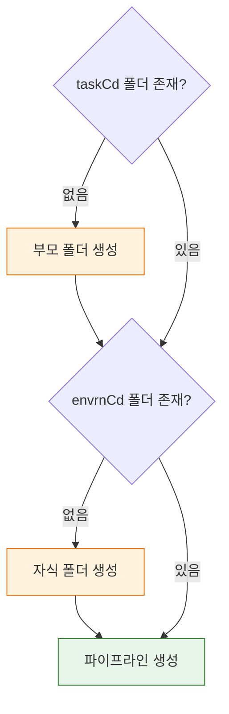
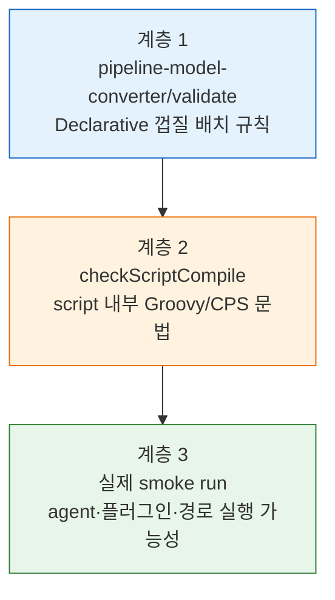

# 젠킨스 파이프라인 CRUD 모델과 TPS 패턴 (2.222+)

> **본 문서는 spec(`01-03.md`)을 읽었다고 가정한 동작 모델·TPS 구현 패턴·검증 전략 모음**입니다. CRUD endpoint 자체와 요청·응답 형식, `checkScriptCompile`/`pipeline-model-converter/validate`의 호출 형식은 spec에 있습니다. 이 문서는 그 위에서 다음 네 질문에 답합니다.
>
> - 왜 파이프라인 CRUD가 단순 REST CRUD보다 복잡한가
> - TPS는 폴더 자동 생성·upsert·403 보정을 어떤 패턴으로 구현했는가
> - Jenkins 2.222+ 이후 어떤 코드를 줄일 수 있는가
> - Jenkinsfile 검증을 단일 API로 끝낼 수 없는 이유와 3계층 조합 전략

## §학습 목표

> 이 문서를 읽고 나면 Jenkins CRUD가 단순 REST CRUD와 다른 이유를 설명하고, TPS의 다섯 패턴(pipelineStruct·autoCreateFolder·upsert·returnBooleanWithOut403·Freemarker XML)을 코드로 식별하며, Jenkinsfile 검증을 3계층(Declarative 껍질·script 내부·실제 run)으로 조합하는 전략을 세울 수 있습니다.

## §사전 지식

> 01-03에서 본 CRUD·검증 API 스펙을 알고 있다면, 이 문서는 그 엔드포인트들을 "폴더 자동 생성·upsert·403 보정까지 포함한 실무 구현 패턴"으로 일반화한 것입니다.

## 1. 왜 일반 CRUD와 다른가

Jenkins 파이프라인 CRUD는 "레코드 하나를 저장"하는 작업이 아니다 — 생성 대상이 파일이 아니라 Job 설정 XML이고, 상위 폴더가 없으면 먼저 만들어야 하며, 수정은 patch가 아니라 전체 `config.xml` 교체이고, 삭제는 리다이렉트나 폴더 삭제 부작용을 동반할 수 있습니다. CRUD라는 외피 안에 구조 관리·XML 생성·보안 헤더 처리가 함께 들어 있습니다.

## 2. TPS에서 사용한 핵심 패턴

### 2-1. pipelineStruct 경로 모델

TPS는 Jenkins 경로를 문자열 하나로 보지 않고, 도메인 규칙이 반영된 구조로 봅니다.

- 일반 파이프라인: `/job/{taskCd}/job/{envrnCd}/job/{bizNm}`
- 트리거 파이프라인: `/job/{taskCd}/job/{taskCd}-{envrnCd}`

CRUD API 호출 전에 먼저 경로 모델을 결정해야 하고, 같은 비즈니스 파이프라인이라도 종류에 따라 생성 경로가 달라집니다. 구버전 TPS v3의 `JenkinsService`는 `PipelineStructVo`를 입력 모델로 받아 `returnPipelineFullPath()` / `returnTriggerPipelineFullPath()`로 경로를 일관되게 계산했습니다.

```java
// 일반
return "/job/" + pipelineStructVo.getTaskCd()
        + "/job/" + pipelineStructVo.getEnvrnCd()
        + "/job/" + pipelineStructVo.getBizNm();

// 트리거
return "/job/" + pipelineStructVo.getTaskCd()
        + "/job/" + pipelineStructVo.getTaskCd() + "-" + pipelineStructVo.getEnvrnCd();
```

`redpanda-playground`는 같은 아이디어를 더 단순화해 `JenkinsJobSpec.toApiPath()`에 경로 책임을 넣었습니다. 핵심은 같다 — 경로는 호출부에서 임시로 만들지 않고 도메인 객체가 책임진입니다.

### 2-2. autoCreateFolder 패턴

Jenkins는 중간 폴더를 자동으로 만들지 않으므로, 경로 모델이 깊을수록 폴더 생성 책임을 애플리케이션이 갖습니다. TPS의 `autoCreateFolder()`는 "존재 확인 → 부모 폴더 생성 → 자식 폴더 생성 → Job 생성"을 코드로 고정한 절차입니다.

일반 파이프라인 기준 흐름은 ① `taskCd`만 채운 `PipelineStructVo`로 존재 확인 → ② `envrnCd`까지 채운 VO로 다시 확인 → ③ 둘 다 없으면 두 폴더를 순차 생성 → ④ `taskCd`만 있으면 `envrnCd` 폴더만 생성 → ⑤ 둘 다 있으면 바로 파이프라인 생성으로 진행입니다. 폴더 생성은 form 파라미터로 보냅니다.

```java
Map<String, String> bodyData = new HashMap<>();
bodyData.put("mode", "com.cloudbees.hudson.plugins.folder.Folder");
bodyData.put("name", folderName);
bodyData.put("from", "");
// → POST {folderPath}/createItem
```

`redpanda-playground`의 `CreateJenkinsJobService`는 같은 구조를 더 읽기 쉽게 드러냅니다.

```java
if (!jenkinsApiPort.exists(spec, spec.projectFolderApiPath())) {
    jenkinsApiPort.createFolder(spec, "", spec.projectId());
}
if (!jenkinsApiPort.exists(spec, spec.presetFolderApiPath())) {
    jenkinsApiPort.createFolder(spec, spec.projectFolderApiPath(), spec.presetId());
}
jenkinsApiPort.createPipelineJob(spec, spec.presetFolderApiPath(), spec.jobId());
```

autoCreateFolder가 "존재 확인 → 부모 폴더 → 자식 폴더 → Job"을 고정하는 흐름을 그림으로 보면 다음과 같습니다:



### 2-3. upsert 패턴

TPS의 `createPipeline()`은 순수한 create가 아니라 upsert다 — 먼저 존재 여부를 확인하고, 이미 있으면 update로 위임하며, 반대로 update도 대상이 없으면 create로 되돌린입니다.

```java
// createPipeline
if (!this.existCheck(jenkinsToolVo, pipelineStructVo, triggerAt)) {
    return jenkinsFeignClient.createPipeline(...);
} else {
    return this.updatePipeline(jenkinsToolVo, jenkinsJobVo);
}

// updatePipeline
if (this.existCheck(jenkinsToolVo, pipelineStructVo, triggerAt)) {
    return jenkinsFeignClient.updatePipeline(...);
} else {
    return this.createPipeline(jenkinsToolVo, jenkinsJobVo);
}
```

이 구조 덕에 외부에서 보면 CRUD가 분리돼 있어도 내부 동작은 사실상 reconciliation에 가까운 upsert가 됩니다. 중복 생성 실패가 줄고, Jenkinsfile 변경을 실행 시점에 자연스럽게 반영할 수 있어 마이그레이션 배치 없이 정의를 최신 상태로 유지합니다.

### 2-4. returnBooleanWithOut403 패턴

Jenkins는 삭제·일부 생성 작업 뒤 `302` 리다이렉트를 반환할 수 있고, 클라이언트가 이를 따라가입니다 `403`처럼 보이는 응답을 받을 수 있습니다. TPS는 이 구간을 그대로 오류로 보지 않고 작업 특성에 맞게 성공으로 간주하는 보정을 둡니다.

```java
private boolean returnBooleanWithOut403(Response response) {
    HttpStatus httpStatus = HttpStatus.valueOf(response.status());
    if (httpStatus.isSameCodeAs(HttpStatusCode.valueOf(403))) return true;
    return !httpStatus.is4xxClientError() && !httpStatus.is5xxServerError();
}
```

위험도 있습니다. 현대화 이후에는 "모든 403을 성공으로 본다"보다 어떤 endpoint에서만 이 보정을 허용할지 좁히는 편이 낫습니다.

### 2-5. Freemarker 기반 config.xml 생성

`config.xml`을 문자열 이어붙이기로 만들면 XML 구조 누락이나 escaping 실수가 생긴입니다. v3은 Freemarker로 Jenkinsfile·파라미터·트리거·보관 정책을 변수로 주입했고, 템플릿 로딩 경로를 `/template/jenkins/v3`로 고정한 뒤 Job 종류에 따라 다른 템플릿을 선택했습니다.

```java
return this.processFreemarkerHandler(
    objectMap,
    isDevYn ? "JenkinsJobConfigXml.ftl" : "JenkinsJobConfigXmlWithTicket.ftl"
);
```

일반 Jenkins 기반 Job 템플릿은 `<flow-definition>`, `BuildDiscarderProperty`, 파라미터 시 `ParametersDefinitionProperty`, `CpsFlowDefinition`, `<script><![CDATA[...]]></script>`, `<sandbox>true</sandbox>`를 고정했습니다. Git 기반 Job 템플릿은 `CpsScmFlowDefinition`으로 바뀌면서 `cloneUrl`/`branch`/`credentialsId`/`scriptPath`를 주입했다 — TPS가 렌더링한 건 단순 Jenkinsfile 문자열이 아니라 Jenkins가 해석할 XML 루트 구조 자체였습니다.

`redpanda-playground`의 `JenkinsJobSpec`은 이 부분을 더 작게 가져간다 — Freemarker 없이 `toConfigXml()`에서 최소 `flow-definition` XML을 직접 만듭니입니다. 이 차이는 역할 차이에서 나옵니다. TPS는 다양한 파이프라인 유형과 파라미터 정책을 다뤄야 했고, playground는 create-only라 최소 XML만으로 충분했습니다.

## 3. 현대 Jenkins 환경이 CRUD 코드에 주는 영향

### 3-1. 인증 단순화 — endpoint는 그대로, 호출 전 코드가 얇아진입니다

API Token 환경(2.222+)에서는 POST마다 crumb·cookie를 따로 관리할 필요가 줄어들어 생성·수정·삭제 POST와 Jenkinsfile 검증 POST 코드가 동시에 단순해진입니다. CRUD endpoint 자체는 그대로이고, 호출 전 인증 준비가 얇아지는 것이 핵심입니다. 자세한 모델 비교는 `01-02a.md` 참조.

부수 효과로 `403` 해석이 단순해진다 — 이전에는 crumb 누락과 권한 부족 둘 다 후보였지만 Token 환경에서는 권한 문제를 더 직접 의심할 수 있습니다.

### 3-2. Groovy Libraries 플러그인 분리 (2.442+)

`Pipeline: Groovy Libraries`가 코어에서 별도 플러그인으로 분리되었습니다. CRUD와 연결되는 지점은 `checkScriptCompile`이다 — `@Library('my-lib')` 사용 시 플러그인이 미설치면 검증 실패가 납니다. config.xml 구조가 아니라 검증 단계에서 차이가 먼저 드러나므로, Jenkinsfile 템플릿이 공유 라이브러리를 전제한다면 운영 환경의 플러그인 상태를 같이 봐야 합니다.

버전 숫자보다 더 중요한 건 **현재 인증 수단**, **필요한 플러그인 설치 여부**, **응답 해석 방식**입니다. CRUD 안정성은 endpoint 스펙보다 운영 환경 조합에 더 크게 영향을 받습니다.

## 4. 코드 구조 — 실제 클래스 기준 책임 분리

CRUD를 안정적으로 구현하려면 책임을 다섯 갈래로 나눈다 — 경로 조립·인증 컨텍스트 준비·XML 렌더링·Jenkins 호출·응답 해석. 각각이 독립적이어야 경로 규칙이나 인증 방식, XML 템플릿이 바뀌어도 전부를 다시 고치지 않을 수 있습니다.

| 책임 | TPS v3 | redpanda-playground |
|------|--------|---------------------|
| CRUD 오케스트레이션, 폴더 순서, 응답 해석 | `JenkinsService` | `CreateJenkinsJobService` |
| Jenkins endpoint 선언 | `JenkinsFeignClient` | `JenkinsRestAdapter` |
| config.xml과 Groovy 렌더링 | `FreemarkerService` | `JenkinsJobSpec.toConfigXml()` |
| Jenkins 경로 조립 입력 모델 | `PipelineStructVo` | `JenkinsJobSpec` (+ `JenkinsPathBuilder`) |
| Basic Auth, crumb, cookie 묶음 | `JenkinsAuthVo` | (인증 어댑터 외부 주입) |

문서에서 말한 책임 분리는 추상 설계가 아니라 실제 코드에서도 클래스로 나뉘어 있습니다.

## 5. Jenkinsfile 검증 3계층 모델

> Spec(`01-03` §3-4)에서 `checkScriptCompile`과 `pipeline-model-converter/validate`의 요청·응답 형식을 다뤘입니다. 이 절은 **두 API가 실제로 무엇을 잡고 무엇을 놓치는지**, 그리고 어떻게 조합해야 하는지를 다룬입니다.

### 5-1. 핵심 모델 — 3개의 검증 계층

Jenkinsfile 검증은 단일 API로 완결되지 않는입니다. Declarative Pipeline 안에 `script {}` 블록이 들어가면 두 가지 문법 세계가 공존하기 때문입니다. Jenkins 공식 Declarative AST 문서는 `script` 블록을 "Declarative subset 검증 없이 실행되는 special step"으로 설명한다([ModelASTScriptBlock Javadoc](https://javadoc.jenkins.io/plugin/pipeline-model-api/org/jenkinsci/plugins/pipeline/modeldefinition/ast/package-summary.html)) — 즉 `pipeline-model-converter/validate`는 `script {}` 안쪽을 깊게 보지 않는입니다.

| 계층 | 검증 대상 | 도구 |
|------|----------|------|
| 1. Declarative 껍질 | `pipeline/stages/stage/steps/agent` 배치 규칙 | `pipeline-model-converter/validate` |
| 2. script {} 내부 문법 | Groovy/CPS 컴파일 가능성 | `checkScriptCompile` |
| 3. 실행 가능성 | agent 존재, Docker 설치, 디렉터리·권한·플러그인 | 실제 run (smoke test) |

세 계층이 각각 무엇을 잡는지 흐름으로 보면 다음과 같습니다. 위 계층이 통과해도 아래 계층이 빈틈을 메웁니입니다:



### 5-2. 계층 1이 잘 잡는 것 — Declarative 구조 위반

`steps {}` 위치 누락(stage 안에 `sh`를 직접 둠), 잘못된 `environment` 식별자(숫자로 시작), Declarative 규칙상 허용되지 않는 배치(parallel 포함 stage에 `agent` 지정)는 모두 `validate`에서 잡히지만 `checkScriptCompile`은 통과시킬 수 있습니다.

```groovy
// 예시: parallel stage에 agent 배치 → validate 실패
stage('Parallel') {
    agent { label 'linux' }   // "agent is not allowed in stage as it contains parallel stages"
    parallel {
        stage('A') { steps { echo 'a' } }
        stage('B') { steps { echo 'b' } }
    }
}
```

### 5-3. 계층 2가 잘 잡는 것 — script 내부 문법

`script {}` 내부의 Groovy/CPS 문법 오류 — 괄호·중괄호 누락, Groovy에서 유효하지 않은 `=>` 연산자, 따옴표 미종료 — 는 `checkScriptCompile`에서 잡히지만 `validate`는 바깥 Declarative 구조만 맞으면 통과시킬 수 있습니다.

```groovy
// 예시: 괄호 누락
script {
    def services = ['api', 'web', 'worker'   // 닫는 ] 누락
    services.each { svc -> ... }
}
```

### 5-4. 계층 3이 필요한 것 — 두 API 모두 못 잡는 영역

런타임 null 참조(`null.each {}`), step 이름 오타(`parllel builds`는 Groovy 메서드 호출로 보여 컴파일 통과), CPS 변환 비호환(`@NonCPS` 없는 직렬화 불가 객체), 환경/플러그인/경로 부재(`./api` 디렉터리 부재, Docker 미설치)는 검증 API가 구조적으로 알 수 없는 영역이라 실제 run으로만 확인됩니다.

### 5-5. 케이스 요약

| # | 수정 내용 | `validate` | `checkScriptCompile` | 실제 run |
|---|----------|------------|----------------------|---------|
| A | `steps {}` 누락 | **실패** | 통과 가능 | 실패 |
| B | 숫자 시작 env 식별자 | **실패** | 결과 다를 수 있음 | 실패 |
| C | parallel stage에 agent 배치 | **실패** | 통과 가능 | 실패 |
| D | 괄호 누락 (script 내부) | 통과 가능 | **실패** | 실패 |
| E | `=>` 잘못된 연산자 | 통과 가능 | **실패** | 실패 |
| F | 따옴표 미종료 | 통과 가능 | **실패** | 실패 |
| G | `null.each {}` | 통과 | 통과 | **실패** |
| H | step 이름 오타 | 통과 | 통과 가능 | **실패** |
| I | CPS 비호환 Groovy | 통과 | 통과 | **실패** |
| J | Docker/디렉터리 부재 | 통과 | 통과 | **실패** |

### 5-6. 실무 권장 — 3단계 검증 파이프라인

```text
1. pipeline-model-converter/validate  →  Declarative 껍질 검증
2. checkScriptCompile                 →  script {} 내부 Groovy/CPS 보조 검증
3. 짧은 smoke run                     →  실제 agent에서 최소 1개 분기 실행 확인
```

각 계층이 잡는 영역이 겹치지 않으면서 빈틈을 줄입니다. 1번과 2번은 API 호출이라 수 초 내 끝나고, 3번만 실제 빌드 비용이 듭니다. TPS처럼 외부 시스템이 Jenkinsfile을 생성·주입하는 구조라면 1번은 필수, 2번은 `script {}` 블록이 포함된 경우에 추가하는 것이 현실적입니다.

> **관련 소스코드:**
> - [`CpsFlowDefinition.DescriptorImpl`](https://javadoc.jenkins.io/plugin/workflow-cps/org/jenkinsci/plugins/workflow/cps/CpsFlowDefinition.DescriptorImpl.html) — `checkScriptCompile` 구현 클래스
> - [`ModelValidatorImpl`](https://javadoc.jenkins.io/plugin/pipeline-model-definition/org/jenkinsci/plugins/pipeline/modeldefinition/Messages.html) — Declarative validator 메시지 정의
> - [Pipeline Development Tools](https://www.jenkins.io/doc/book/pipeline/development/) — Jenkinsfile validation 공식 안내
> - [Pipeline Syntax](https://www.jenkins.io/doc/book/pipeline/syntax/) — Declarative vs Scripted 문법 공식 레퍼런스

## 6. 핵심 정리

1. Jenkins 파이프라인 CRUD는 단순 REST CRUD가 아니라 경로 관리·XML 렌더링·보안 처리가 결합된 작업입니다.
2. TPS는 이를 `pipelineStruct` + `autoCreateFolder` + `upsert` + `returnBooleanWithOut403` + 템플릿 기반 XML 생성 다섯 패턴으로 다룬입니다.
3. 현대 Jenkins 환경에서는 endpoint보다 인증 준비 코드가 더 크게 단순화됩니다.
4. Jenkinsfile 검증은 단일 API로 완결되지 않는다 — Declarative 껍질(`validate`) → script 내부 문법(`checkScriptCompile`) → 실제 run의 3계층으로 빈틈을 메운입니다.

## 7. 면접 질문

> 답을 떠올린 뒤 §정답 절에서 같은 번호로 대조하세요.

1. Jenkins 파이프라인 CRUD가 "레코드 하나 저장"하는 일반 REST CRUD와 다른 점을 두 가지 이상 드세요.
2. TPS의 `createPipeline()`이 순수 create가 아니라 upsert로 구현된 이유는?
3. Declarative Pipeline 안에 `script {}` 블록이 있으면 왜 단일 검증 API로 충분하지 않나요?
4. `returnBooleanWithOut403` 같은 403 보정을 "모든 endpoint에 일괄 적용"하면 안 되는 이유는?

## 정답

> 위 질문을 스스로 설명해 본 뒤에 펼치세요.

### 정답 1 — 일반 CRUD와 다른 점

생성 대상이 레코드가 아니라 Job 설정 XML이고, 상위 폴더가 없으면 먼저 만들어야 하며(중간 폴더 자동 생성 안 됨), 수정이 patch가 아니라 `config.xml` 전체 교체이고, 삭제가 302 리다이렉트나 폴더 삭제 부작용을 동반할 수 있습니다. CRUD 외피 안에 경로·구조 관리, XML 렌더링, 보안 헤더 처리가 함께 들어 있습니다.

### 정답 2 — upsert로 구현한 이유

외부에서는 create/update가 분리돼 보여도, 같은 정의를 여러 번 적용해도 안전하도록(reconciliation) 하기 위해서입니다. create는 이미 있으면 update로, update는 대상이 없으면 create로 위임합니다. 그 덕에 중복 생성 실패가 줄고, Jenkinsfile 변경을 실행 시점에 자연스럽게 반영해 별도 마이그레이션 배치 없이 최신 상태를 유지합니다.

### 정답 3 — script 블록과 단일 검증의 한계

`pipeline-model-converter/validate`는 Declarative 껍질만 보고 `script {}` 안쪽 Groovy는 깊게 검사하지 않습니다(공식 문서상 script는 Declarative subset 검증 없이 실행되는 special step). 반대로 `checkScriptCompile`은 Groovy 컴파일만 보고 Declarative 배치 규칙은 통과시킬 수 있습니다. 그래서 껍질·내부·실제 run의 3계층 조합이 필요합니다.

### 정답 4 — 403 보정을 일괄 적용하면 안 되는 이유

삭제·일부 생성 뒤의 302 리다이렉트가 403처럼 보이는 구간을 성공으로 보정하는 것은 그 특정 작업에 한해 타당합니다. 하지만 "모든 403을 성공"으로 보면 진짜 권한 부족·crumb 문제까지 성공으로 삼켜 버려, 실패가 조용히 숨습니다. 그래서 어떤 endpoint에서만 보정할지 좁혀야 합니다.

## 8. 관련 문서

- `01-03.md` — CRUD 및 검증 API 스펙
- `01-02a.md` — 인증 모델 변화와 TPS 인증 패턴
- `99_ETC/01-jenkins-analysis.md`
- [Pipeline Syntax](https://www.jenkins.io/doc/book/pipeline/syntax/)
- [Pipeline Development Tools](https://www.jenkins.io/doc/book/pipeline/development/)
- [CpsFlowDefinition.DescriptorImpl Javadoc](https://javadoc.jenkins.io/plugin/workflow-cps/org/jenkinsci/plugins/workflow/cps/CpsFlowDefinition.DescriptorImpl.html)
