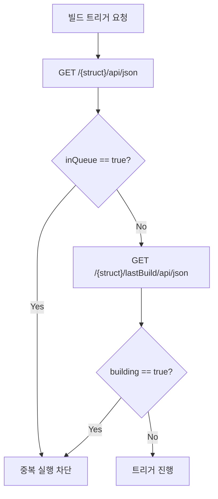

# 젠킨스 빌드 실행·큐 모델과 TPS 패턴 (2.222+)

> **본 문서는 spec(`01-04.md`)을 읽었다고 가정한 TPS 패턴 모음**이다. 빌드 실행 API의 요청·응답 형식, `Location → queueId → executable.number` 흐름은 spec에 있다. 이 문서는 그 위에서 TPS가 운영 환경에서 마주친 의사결정 — Pre-trigger Guard, `nextBuildNumber` 최적화, controller 실행 해석, Queue 운영 판단, 중복 트리거 dedupe — 을 정리한다.
>
> 인접 문서 분담:
> - 인증 모델 변화 (ID/Password ↔ API Token): `01-02a.md`
> - 큐-빌드 전환 흐름과 K8s/VM 실행기 환경: `01-04b.md`
> - 큐 내부 메커니즘 (상태 전이, maintain 루프): `01-04c.md`

## 1. Pre-trigger Guard — 트리거 직전 중복 차단

Jenkins는 같은 Job에 대해 중복 빌드 트리거를 허용한다. TPS는 트리거를 보내기 **전에** 큐 대기와 실행 중 여부를 확인해 큐 자체에 진입하지 않도록 막는다.

검사 대상은 두 값이다 — `GET /{pipelineStruct}/api/json`의 `inQueue`, `GET /{pipelineStruct}/lastBuild/api/json`의 `building`. 두 값이 모두 `false`일 때만 트리거하고, 하나라도 `true`면 `JENKINS_IN_PROGRESS_ERROR`로 처리한다.



Jenkins 자체에도 `disableConcurrentBuilds()`나 "Abort previous builds"가 있지만 이들은 큐 등록 **이후** 작동한다. TPS Guard는 큐 등록 자체를 줄이고, UI에 "이미 실행 중" 메시지를 즉시 돌려주기 위해 별도로 둔다.

## 2. `nextBuildNumber` 트릭 — 큐 폴링 없이 빌드 번호 추정

Jenkins 빌드 트리거는 비동기다. spec의 표준 흐름은 `Location → queueId → /queue/item/{id}/api/json`을 폴링해 `executable.number`를 얻는 것이지만, TPS는 트리거 직전 `nextBuildNumber`를 읽어 곧 시작될 빌드 번호를 미리 추정한다.

```json
GET /{pipelineStruct}/api/json
{
  "name": "TEST",
  "buildable": true,
  "inQueue": false,
  "nextBuildNumber": 9
}
```

이 값을 트리거 전에 저장해두면 큐 폴링 없이 곧바로 `/{pipelineStruct}/9/api/json`을 조회할 수 있다.

다만 절대 보장은 아니다 — 동시에 다른 사용자가 같은 Job을 트리거하면 번호 경쟁이 생긴다. 그래서 일반화된 흐름은 spec의 queueId 폴링이 기본이고, `nextBuildNumber`는 TPS 내부 최적화로만 쓴다.

## 3. `agent any`와 controller 실행 해석

"Jenkins가 K8s 위에 있다"와 "빌드가 K8s 동적 Pod에서 돈다"는 다른 문제다. `agent any`는 사용 가능한 아무 executor나 쓰겠다는 뜻이라, controller built-in node에 executor가 열려 있고 K8s label을 명시하지 않으면 controller에서 실행될 수 있다. 판별 기준은 controller 배포 위치가 아니라 **에이전트 프로비저닝 방식**이다.

| 상황 | 해석 |
|------|------|
| Jenkins가 K8s Pod로 배포됨 | controller 배포 위치일 뿐, 빌드 실행 위치와 무관 |
| `agent any`로 빌드 성공 | 사용 가능한 executor에서 실행됨 |
| 동적 agent가 모두 죽었는데 빌드 성공 | controller built-in node 또는 정적 agent에서 실행 |
| K8s Pod 실행을 강제하고 싶음 | `agent { kubernetes { ... } }` 또는 K8s label 명시 필요 |

## 4. Queue 운영 판단 — 무엇을 추적하고 무엇을 포기할 것인가

운영 관점에서 "정확한 실행기 추적"보다 "중복 실행을 얼마나 단순하게 막을 것인가"가 더 중요할 수 있다.

**Queue 지속성에 대한 현실적 해석.** Jenkins Queue는 정상 종료·재시작 시 복원되지만 완전한 영속 저장소는 아니다. `Queue.Saver`가 변경분을 "가까운 시점에" 저장하는 구조라, 급작스러운 프로세스 종료나 Pod 강제 종료에서는 최근 변경이 손실될 수 있다(`2.332.2`에는 재시작 시 큐가 비워지는 회귀가 있었고 `2.343`에서 수정).

**정확한 실행기 추적의 비용.** K8s 동적 에이전트는 Pod 생명주기에 따라 `/computer/api/json` 결과가 흔들린다 — Pod가 없을 땐 executor `0`, 생성됐지만 agent 연결 전이면 `offline=true`, 빌드 종료 직후 사라짐. dispatch 제어 목적이라면 `queue + computer + label + cloud + Pod` 전부를 합쳐 해석하는 비용이 과하다.

**현실적인 최소안 — Job 단위 Pre-check 1회.** 전역 executor 추적이나 전역 Queue 빈 상태 체크 대신, 대상 Job에 가벼운 GET 1회만 한다.

```bash
curl -k -sS -u "${JENKINS_USER}:${JENKINS_PASS}" \
  "${JENKINS_URL}${PIPELINE_STRUCT}/api/json?tree=name,buildable,inQueue,nextBuildNumber,lastBuild[number,building,result,url]"
```

| 전략 | 적합 환경 |
|------|-----------|
| 대상 Job `api/json` 1회 조회 후 트리거 | 여러 Job이 섞인 Jenkins (권장) |
| Job 설정에서 동시 실행 금지 후 결과만 추적 | Job 설정 권한이 있을 때 |
| 전역 Queue만 보고 트리거 | 단일 용도 전용 Jenkins에서만 |

전역 Queue 체크는 다른 팀 Job 때문에 dispatch가 막힐 수 있고, 비어 있어도 해당 Job이 이미 실행 중일 수 있어 신호 품질이 낮다.

## 5. 동일 Job 중복 트리거와 Queue 병합

같은 Job에 짧은 간격으로 여러 번 `build`를 호출했는데 `Location`이 계속 같은 `queue/item/{id}`로 보이면 비정상이 아니라 Jenkins Queue **병합** 동작일 가능성이 높다. `schedule2(...)`는 새 item을 만들 수도, 이미 대기 중인 같은 task에 merge할 수도, 정책상 거부할 수도 있다.

이 현상은 Quiet Period가 있을 때 더 잘 드러난다 — item이 `WaitingItem` 상태로 잠깐 머무는 동안 같은 Job 요청이 또 들어오면 새 item 대신 기존 item에 붙는다. `HTTP 201`이 여러 번 나왔는데 `Location`이 같다면 "실패"가 아니라 "Queue dedupe"로 먼저 해석한다.

확인은 다음 API로 한다.

```bash
curl -k -sS -u "${JENKINS_USER}:${JENKINS_PASS}" \
  "${JENKINS_URL}/queue/item/${QUEUE_ID}/api/json" \
  | jq '{id, why, cancelled, stuck, task: .task.name, executable}'
```

병합을 줄이고 싶다면 `build?delay=0sec`로 Quiet Period를 짧게 하거나, 첫 요청이 실행에 들어간 뒤 두 번째를 보내거나, 파라미터를 다르게 주거나, 애초에 TPS Pre-trigger Guard로 차단한다.

## 6. Quiet Period와 `delay=0sec`

Jenkins 빌드 트리거는 기본적으로 Quiet Period를 거칠 수 있다. TPS처럼 API가 명시적으로 트리거하는 환경에서는 이 지연이 불필요할 때가 있고, 요청 단위로 무시하려면 `?delay=0sec`를 붙인다.

```bash
curl -X POST -u admin:apiToken \
  "https://jenkins.example.com/job/my-pipeline/build?delay=0sec"
```

표준 호출을 기준으로 설명하고, 이 옵션은 운영 최적화 포인트로 분리해두는 편이 읽기 쉽다.

## 7. 인증 모델 차이가 트리거 코드에 미치는 영향

ID/Password 환경에서는 `build`/`buildWithParameters`/`stop` POST에 `crumb` + `cookie` + `Basic Auth`를 모두 실어야 한다. API Token 환경(2.222+)에서는 `Authorization: Basic <user:token>` 한 줄로 통일되어 crumb·cookie를 제거할 수 있다. 다만 실제 면제 여부는 인스턴스 설정에 따라 갈리므로 TPS는 환경 메타데이터로 인증 모델을 분리하는 편이 안전하다. 자세한 모델 비교는 `01-02a.md` §1 참조.

## 8. 전체 흐름 재정리

ID/Password 환경 기준 흐름은 spec과 일치한다.

1. `01-02`에서 인증과 crumb/cookie 준비
2. `01-04`의 `build` 또는 `buildWithParameters` 호출
3. `Location` 헤더에서 `queueId` 추출
4. `/queue/item/{queueId}/api/json`에서 `executable.number` 확인 (또는 §2의 `nextBuildNumber` 트릭)
5. 상태 추적은 `01-05`로 이어짐

API Token 환경에서는 1단계가 단순해진다.

## 9. 관련 문서

- `01-02.md`, `01-02a.md` — 인증 spec과 모델 변화
- `01-04.md` — 빌드 실행·큐 API 스펙
- `01-04b.md` — 큐-빌드 전환 흐름, K8s/VM 실행기
- `01-04c.md` — 큐 내부 메커니즘
- `01-05.md` — 빌드 상태 추적

## 10. 참고 링크

- Jenkins Remote Access API
- Persistent Build Queue plugin page
- Jenkins Queue Javadoc / ScheduleResult Javadoc
- JENKINS-68254
