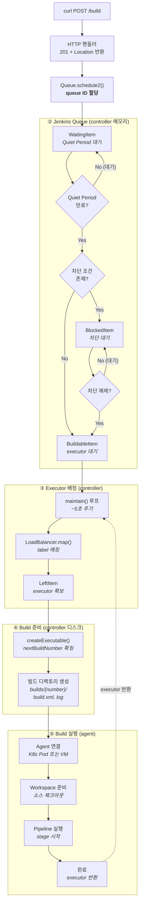
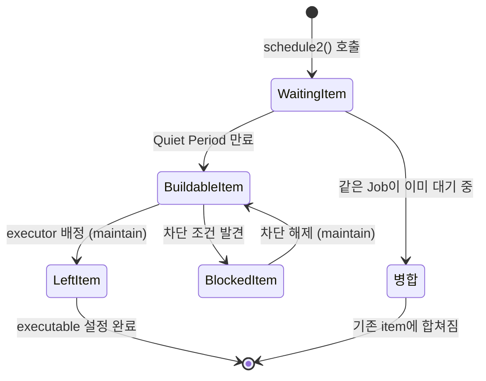
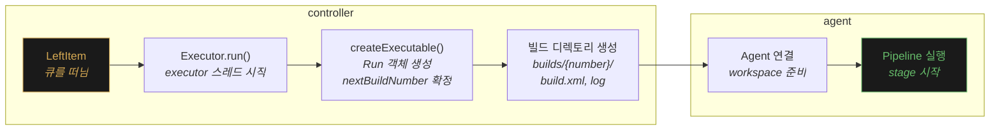
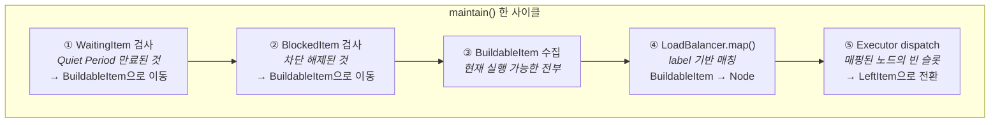
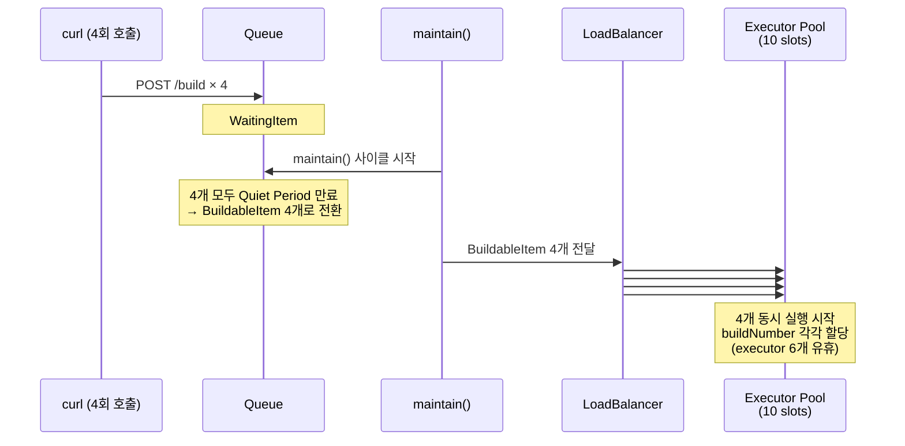
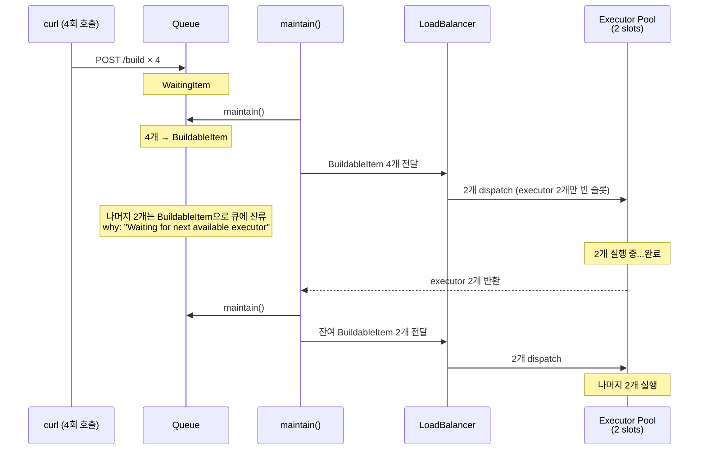
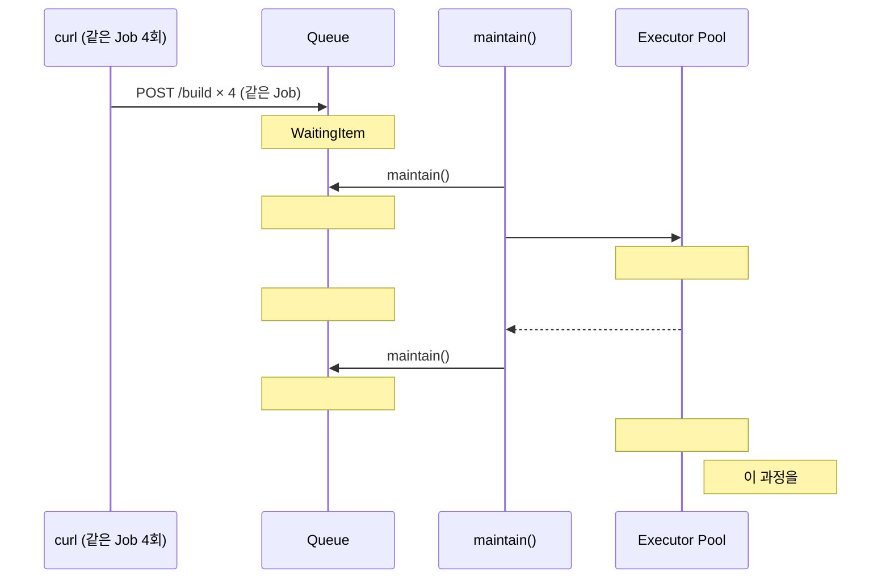
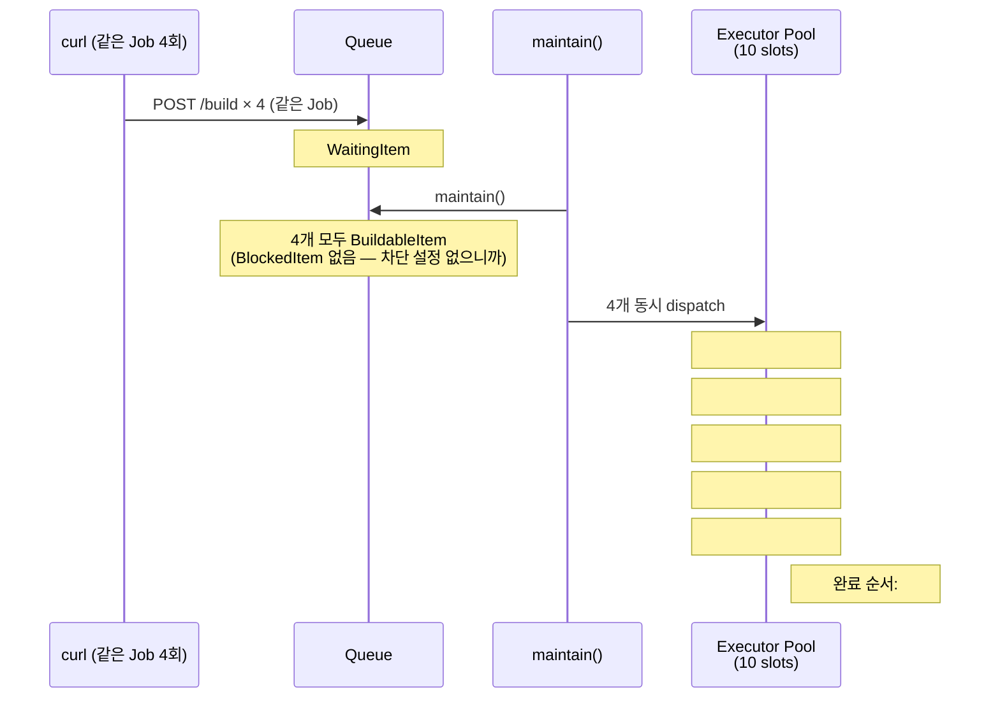
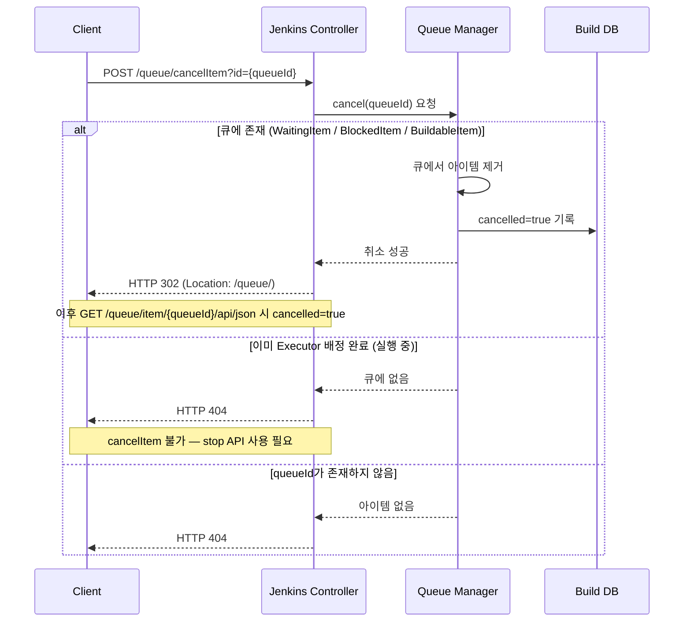

# 젠킨스 큐 내부 흐름과 실행 순서
---
> 이 문서는 Jenkins 내부에서 빌드 요청이 큐를 거쳐 executor에 도달하기까지의 데이터 흐름을 Jenkins 소스 코드 수준에서 설명한다.
>
> 인접 문서와의 분담은 다음과 같다.
>
> - 입문자 관점의 lifecycle 다이어그램, 단계별 값(queueId/buildNumber/env vars) 타임라인, 자동화 함정: `01-02.md` §2-§3.
> - REST API 요청/응답 형식: `01-04.md`. TPS 운영 패턴(Pre-trigger Guard, nextBuildNumber 트릭): `01-04a.md`.
> - VM 정적 vs K8s 동적 에이전트의 executor 해석 차이, TPS 최소 저장 데이터: `01-04b.md`.
>
> 이 문서가 단독으로 다루는 것은 Queue ID 할당 메커니즘, 상태 전이(WaitingItem → BuildableItem → BlockedItem → LeftItem), `maintain()` 루프, `createExecutable()`과 `nextBuildNumber` 확정 시점, Quiet Period의 동작 원리, 실행 순서 보장 여부, `cancelItem` 내부 처리다.


## 1. 이 문서가 답하는 질문

> 4개 서로 다른 Job(API-NORMAL, API-NORMAL-2, API-FAIL, API-SLEEP10)을 거의 동시에 API로 트리거했을 때, 다음 두 가지가 궁금해졌다.
>
> 1. 이 4개 Job은 큐에 들어간 순서(215 → 216 → 217 → 218)대로 실행되는가?
> 2. queue ID는 트리거 즉시 할당되는데, 내부에서 어떤 흐름으로 데이터가 이동하고 어디서 대기하는가?

실험 데이터는 다음과 같다:

```bash
# 1차 트리거
API-NORMAL    → queue/item/215/  (04:24:07)
API-NORMAL-2  → queue/item/216/  (04:24:08)
API-FAIL      → queue/item/217/  (04:24:08)
API-SLEEP10   → queue/item/218/  (04:24:09)

# 2차 트리거 (약 10초 후)
API-NORMAL    → queue/item/223/  (04:24:18)
API-NORMAL-2  → queue/item/224/  (04:24:18)
API-FAIL      → queue/item/225/  (04:24:19)
API-SLEEP10   → queue/item/226/  (04:24:19)
```


## 2. 전체 그림: 요청에서 실행까지

> 먼저 큰 그림부터 본다. `POST /build`가 호출된 뒤 Jenkins 내부에서 일어나는 일을 한 눈에 그리면 다음과 같다.



이 흐름에서 핵심은 다음 세 가지다:

- **queue ID**는 `Queue.schedule2()` 시점에 즉시 할당된다. HTTP 201 응답의 `Location` 헤더가 이 값이다.
- **buildNumber**는 executor가 배정된 뒤에야 할당된다. 그 사이에는 `WaitingItem` → `BuildableItem` 전이 구간이 있다.
- **maintain() 루프**가 큐 아이템을 주기적으로 꺼내서 executor에 매핑한다. 이 루프가 "대기 → 실행" 전환의 실제 엔진이다.


## 3. Queue 아이템 상태 전이

> 큐 아이템은 Jenkins 소스 코드에서 다음 4가지 상태를 가진다. 각 상태는 Java 내부 클래스이고, REST API 응답의 `_class` 필드로 식별할 수 있다.



각 상태의 의미와 API 응답 매핑은 다음과 같다:

| 상태 | `_class` 값 | 진입 조건 | 탈출 조건 | `why` 필드 예시 |
|------|------------|----------|----------|----------------|
| WaitingItem | `Queue$WaitingItem` | `schedule2()` 호출 | Quiet Period 만료 | `In the quiet period` |
| BuildableItem | `Queue$BuildableItem` | Quiet Period 만료 + 차단 없음 | executor 배정 | `Waiting for next available executor` |
| BlockedItem | `Queue$BlockedItem` | `disableConcurrentBuilds` 등 차단 | 선행 빌드 완료 | `Build #8 is already in progress` |
| LeftItem | `Queue$LeftItem` | executor 배정 완료 | `executable` 설정 | (큐에서 빠져나감) |

- WaitingItem에서 BuildableItem으로 넘어가는 시점은 Quiet Period에 달려 있다. 
- Jenkins 전역 설정이나 Job별 설정으로 0~수십 초까지 지정할 수 있고, `build?delay=0sec`를 쓰면 요청 단위로 건너뛸 수 있다.

### 3-1.Quiet Period가 존재하는 이유

Quiet Period는 **짧은 간격으로 연속 발생하는 트리거를 하나의 빌드로 병합**하기 위해 설계됐다. 가장 대표적인 상황은 SCM 폴링이다.

개발자가 3개의 커밋을 10초 간격으로 push한다고 하자. Quiet Period가 없으면 Jenkins는 커밋마다 빌드를 하나씩, 총 3개를 큐에 넣는다. 하지만 Quiet Period가 30초로 설정되어 있으면, 첫 번째 트리거 이후 30초 동안 추가 트리거가 들어올 때마다 타이머가 리셋된다. 결과적으로 3개 커밋이 하나의 빌드로 합쳐진다.

```text
Quiet Period 없을 때:
  commit A → 빌드 #1
  commit B → 빌드 #2
  commit C → 빌드 #3     (3개 빌드, executor 3개 소비)

Quiet Period 30초일 때:
  commit A → WaitingItem 생성 (타이머 30초)
  commit B → 타이머 리셋 (30초 재시작)
  commit C → 타이머 리셋 (30초 재시작)
  30초 경과 → BuildableItem → 빌드 #1  (1개 빌드, A+B+C 포함)
```

이 메커니즘이 의미 있는 상황은 다음과 같다:

- **SCM 폴링/Webhook**: 짧은 간격의 push를 하나의 빌드로 합친다.
- **대규모 Jenkins**: executor 경합을 줄여 큐 적체를 방지한다.
- **무거운 빌드**: 30분짜리 빌드를 커밋마다 3번 돌리는 것은 낭비다.

반대로 **API로 명시적 트리거**하는 TPS 같은 환경에서는 Quiet Period가 불필요할 수 있다. 이미 외부에서 "지금 이 빌드를 시작하라"고 결정한 것이므로, `build?delay=0sec`로 건너뛰거나 Job 설정에서 Quiet Period를 0으로 두는 편이 응답 지연을 줄인다.

### 3-2. LeftItem은 "큐를 떠남"이지 "실행 중"이 아니다

LeftItem이 되었다고 해서 pipeline stage가 바로 돌기 시작하는 것은 아니다. LeftItem은 "executor가 소유권을 가져갔으므로 큐에서 빠졌다"는 뜻이다. 실제 실행까지는 다음 단계를 더 거친다:



| 단계 | 무엇이 일어나는가 | 실행 위치 | 실제 실행? |
|------|-------------------|----------|-----------|
| `LoadBalancer.map()` | BuildableItem → Node 매핑 결정 | controller | 배정만 |
| `Executor.run()` 시작 | executor 스레드가 큐에서 아이템을 가져감 → LeftItem | controller | 가져갔지만 아직 |
| `createExecutable()` | Run 객체 생성, **nextBuildNumber 확정** | controller | 빌드 객체만 생성 |
| 빌드 디렉토리 생성 | `$JENKINS_HOME/jobs/{name}/builds/{number}/` 생성 | controller | 디스크 기록 |
| Agent 연결 + workspace | agent 프로비저닝, workspace 체크아웃 | agent | 준비 단계 |
| Pipeline stage 실행 | `stages { ... }` 블록 시작 | agent | 여기서부터 실행 |

### 3-3. nextBuildNumber 확정 시점

`nextBuildNumber`는 **controller에서 `createExecutable()` 호출 시** 확정된다. 흐름은 다음과 같다:

1. Job 객체가 `nextBuildNumber` 값을 메모리에 유지한다 (예: 현재 값 12).
2. `Executor.run()` → `task.createExecutable()` 호출 시, Job이 `nextBuildNumber`를 읽어 Run 객체에 할당한다.
3. `nextBuildNumber`가 13으로 증가하고, `$JENKINS_HOME/jobs/{name}/nextBuildNumber` 파일에 기록된다.
4. 이 시점에서 빌드 번호가 확정되므로, 이후 같은 Job의 다른 트리거가 들어오면 13번을 받는다.

즉 `nextBuildNumber`는 **executor 배정 후 controller에서 확정**되는 값이다. agent는 이미 결정된 번호를 받을 뿐이다.

### 3-4. 빌드 디렉토리 구조

`createExecutable()` 직후, controller는 빌드 번호에 해당하는 디렉토리를 `$JENKINS_HOME` 아래에 생성한다:

```text
$JENKINS_HOME/jobs/SBH/jobs/API-NORMAL/
├── nextBuildNumber          ← 13 (다음 빌드용, createExecutable 시 증가)
├── builds/
│   ├── 11/                  ← 이전 빌드
│   └── 12/                  ← 방금 생성된 빌드
│       ├── build.xml        ← 빌드 메타데이터 (파라미터, 시작 시각 등)
│       ├── log              ← 콘솔 로그 (실행 중 계속 기록)
│       └── workflow/        ← Pipeline 실행 상태 (CPS FlowDef)
└── config.xml               ← Job 설정
```

- 이 디렉토리는 **agent가 아닌 controller 디스크**에 생성된다. agent의 workspace(`/home/jenkins/workspace/{name}/`)와는 별개다. 
- agent workspace는 소스 체크아웃과 빌드 산출물을 위한 공간이고, `$JENKINS_HOME/builds/`는 Jenkins가 빌드 이력과 로그를 관리하는 공간이다.

| 경로 | 위치 | 용도 |
|------|------|------|
| `$JENKINS_HOME/jobs/{name}/builds/{number}/` | controller | 빌드 이력, 로그, 메타데이터 |
| `$JENKINS_HOME/jobs/{name}/nextBuildNumber` | controller | 다음 빌드 번호 (파일 1줄) |
| `/home/jenkins/workspace/{name}/` | agent | 소스 체크아웃, 빌드 산출물 |

이 갭이 실무에서 중요한 이유는 환경에 따라 크기가 다르기 때문이다:

- **정적 VM agent**: Agent가 이미 연결되어 있으므로 LeftItem → stage 실행까지 수 초 이내다.
- **K8s 동적 agent**: Pod 생성 → container 시작 → Jenkins agent 연결까지 수십 초가 걸릴 수 있다. 이 구간에서 `/queue/item/{queueId}/api/json`의 `executable`은 이미 채워져 있지만, `wfapi/describe`에서는 아직 stage가 `NOT_EXECUTED`로 보일 수 있다.

즉 `executable.number`가 보인다고 해서 pipeline이 실행 중이라고 단정할 수 없다. 실제 실행 여부는 `building=true`나 `wfapi` 상태로 확인해야 한다.


## 4. Queue ID와 Build Number는 다른 식별자다

>  이 두 값을 혼동하면 큐 흐름을 오해하기 쉽다. 차이는 다음과 같다:

| 구분 | Queue ID | Build Number |
|------|----------|-------------|
| 할당 시점 | `schedule2()` 즉시 | executor 배정 후 |
| 범위 | 전역 (모든 Job 공유) | Job별 독립 카운터 |
| 소스 | `WaitingItem.id` (AtomicLong) | `nextBuildNumber` |
| 의미 | 큐 등록 순서 | 실행(시작) 순서 |
| API에서 얻는 곳 | `Location` 헤더 | `executable.number` |

- 실험 데이터에서 215, 216, 217, 218은 전역 Queue ID다. 
- 이 번호는 4개 서로 다른 Job이 공유하는 전역 카운터에서 순차 할당된 것이므로, "API-NORMAL이 215번, API-NORMAL-2가 216번"이라는 등록 순서만 보장한다. 
- 각 Job의 Build Number(예: API-NORMAL의 #12, API-FAIL의 #8)는 executor 배정 시점에 독립적으로 결정된다.


## 5. maintain() 루프: 대기에서 실행으로 넘기는 엔진

> `Queue.maintain()`은 Jenkins controller가 주기적으로 실행하는 메서드다. 
>
> - 큐에 쌓인 아이템을 검사하고 executor에 배정하는 실제 엔진이다.

### 5-0. 배정 결정은 controller에서 일어난다

큐 관리와 executor 배정에 관여하는 컴포넌트는 전부 controller(master) JVM 안에서 동작한다. agent는 배정 결정에 관여하지 않고, 배정된 작업을 받아서 실행만 한다.

| 단계 | 실행 위치 | 컴포넌트 | 역할 |
|------|----------|---------|------|
| 큐 상태 전이 | **controller** | `Queue.maintain()` | WaitingItem → BuildableItem 등 상태 판단 |
| dispatch 순서 결정 | **controller** | `QueueSorter` | BuildableItem 리스트 정렬 (기본 FIFO) |
| 노드 매핑 | **controller** | `LoadBalancer.map()` | 어떤 노드의 executor에 배정할지 결정 |
| 빌드 실행 | **agent** | `Executor.run()` | 배정받은 작업을 실제 실행 |

즉 agent가 10대 있어도 "어떤 Job을 어떤 agent에 보낼지"는 controller 혼자 결정한다. agent는 controller로부터 작업을 수신하는 수동적 역할이다.



동작 특성은 다음과 같다:

- **주기**: 기본 약 5초(`Queue.MAINTENANCE_PERIOD`). 새 아이템이 `schedule2()`로 등록되면 즉시 한 번 트리거되기도 한다.
- **일괄 처리**: 한 사이클에서 여러 BuildableItem을 한꺼번에 처리할 수 있다. 4개 BuildableItem이 있고 executor가 10개면, 한 사이클에서 4개 모두 dispatch할 수 있다.
- **LoadBalancer**: 기본 구현은 `ConsistentHashLoadBalancer`다. label이 매칭되는 노드 중 빈 executor가 있는 곳에 배정한다. 큐 등록 순서가 아니라 label 매칭과 노드 가용성이 기준이다.


## 6. 실행 순서는 큐 등록 순서와 같은가

> **답: dispatch 순서는 FIFO이지만, 실제 실행 시작 순서는 보장되지 않는다.**

### 6-1. dispatch 순서는 FIFO다 (공식 문서 근거)

Jenkins는 `QueueSorter`라는 extension point로 BuildableItem의 dispatch 순서를 결정한다. 기본 구현인 `AbstractQueueSorterImpl`의 Javadoc에 다음과 같이 명시되어 있다:

> "The default implementation does FIFO."

즉 별도 플러그인을 설치하지 않으면, 큐에 먼저 들어간 아이템이 먼저 executor에 배정된다. Priority Sorter 플러그인의 설명문도 이를 역으로 확인해준다: "allows jobs in the build queue to be sorted by priority **rather than just FIFO**."

| 컴포넌트 | 역할 | 순서 관여 여부 |
|---------|------|-------------|
| `QueueSorter` | BuildableItem 리스트의 **순서** 결정 | 관여 (기본 FIFO) |
| `LoadBalancer` | 어떤 **노드**에 배정할지 결정 | 순서 무관 |

### 6-2. 그래도 "실행 시작 순서"는 보장되지 않는다

dispatch 순서가 FIFO라 해도, 실제 pipeline stage가 시작되는 순서는 다를 수 있다. 이유는 세 가지다.

첫째, executor가 충분하면 여러 BuildableItem이 **한 maintain 사이클에서 동시에 dispatch**된다. FIFO 순서로 하나씩 꺼내더라도, 한 사이클 안에서 4개가 거의 같은 시각에 executor를 잡으므로 "순서"라는 개념 자체가 의미 없어진다.

둘째, **agent 프로비저닝 시간이 다를 수 있다.** K8s 동적 agent 환경에서는 Pod 생성 → container 시작 → agent 연결까지의 시간이 각 빌드마다 다르다. queue ID 215가 216보다 먼저 dispatch되더라도, 215의 Pod가 늦게 뜨면 216이 먼저 stage를 시작할 수 있다.

셋째, **label이 다른 Job은 서로 다른 노드에 배정**될 수 있다. 노드마다 성능이 다르면 dispatch 순서와 실행 시작 순서가 달라진다.

### 6-3. 실무 정리

| 질문 | 답 |
|------|-----|
| 큐에서 꺼내는 순서(dispatch)가 FIFO인가? | 기본 구현에서 **맞다** |
| 실제 빌드 시작 순서가 FIFO인가? | **아니다** (프로비저닝 시간 차이) |
| 순서를 바꾸고 싶으면? | Priority Sorter 플러그인 설치 |
| 순서에 의존하는 로직을 만들어도 되는가? | **안 된다** |

참고 링크:

- `AbstractQueueSorterImpl` Javadoc — "default implementation does FIFO"
- `QueueSorter` Javadoc — extension point, Jenkins 1.343+
- Priority Sorter 플러그인 — FIFO 기본 동작을 우선순위 기반으로 교체


## 7. 세 가지 시나리오별 내부 흐름

> executor 수와 Job 설정에 따라 큐 내부 흐름이 달라진다. 아래 세 시나리오가 핵심이다.

### 7-1. executor 충분 (현재 환경: 10 executor, 4 Job)



- 현재 실험 환경은 `slave1`에 executor가 10개 있다. Job 4개를 트리거하면 한 `maintain()` 사이클 안에서 4개 모두 executor를 잡는다. 실질적 대기 시간은 Quiet Period + maintain 사이클 타이밍뿐이다.
- "이전 queue ID가 끝날 때까지 기다린다"는 인상은 착시일 가능성이 높다. 4개가 거의 동시에 시작되지만, curl 호출 자체에 1~2초 간격이 있으므로(04:24:07 → 04:24:09) Quiet Period 만료 시점도 약간 다를 수 있다.

### 7-2. executor 부족 (2 executor, 4 Job)



- executor가 2개뿐이면 `maintain()`이 한 사이클에서 2개만 dispatch하고 나머지 2개는 BuildableItem 상태로 큐에 남는다. 
- 앞선 빌드가 끝나서 executor가 반환되면, 다음 maintain 사이클에서 나머지를 dispatch한다.
- 이때 "어떤 2개가 먼저 dispatch되는가"는 LoadBalancer가 결정한다. queue ID 순서를 따르지 않을 수 있다.

### 7-3. 같은 Job 반복 + disableConcurrentBuilds



- `disableConcurrentBuilds()` 설정이 있는 같은 Job을 4회 트리거하면, 첫 번째만 BuildableItem으로 전환되고 나머지는 BlockedItem 상태로 대기한다. 

- 선행 빌드가 완료된 뒤에야 다음 BlockedItem이 BuildableItem → LeftItem으로 전환된다. 이 경우에만 진정한 순차 실행이 보장된다.

- 추가로, 같은 Job을 짧은 간격으로 트리거하면 `01-04` 섹션 7에서 설명한 큐 병합(Queue coalescence)이 발생할 수 있다. 이 경우 4번 호출해도 실제 queue item은 1~2개만 생길 수 있다.

### 7-4. 같은 Job 반복 + disableConcurrentBuilds 없음

`disableConcurrentBuilds`가 없으면 같은 Job이라도 동시 실행이 허용된다. 이 경우 **완료 순서는 보장되지 않는다.**



`disableConcurrentBuilds` 유무에 따른 차이를 정리하면 다음과 같다:

| 설정 | dispatch 순서 | 동시 실행 | 완료 순서 | workspace 충돌 |
|------|-------------|----------|----------|---------------|
| `disableConcurrentBuilds` **있음** | FIFO | 불가 (BlockedItem 대기) | **보장** | 없음 (순차) |
| `disableConcurrentBuilds` **없음** | FIFO | **가능** | **미보장** | **위험** |

완료 순서가 달라지는 원인은 다음과 같다:

- 같은 Job이라도 agent 성능, 네트워크 지연, 리소스 경합에 따라 실행 시간이 달라진다.
- 서로 다른 agent에 배정되면 노드 성능 차이가 직접적으로 영향을 준다.
- 같은 agent에 배정되더라도 CPU/IO 경합으로 실행 시간이 달라질 수 있다.

추가로, 같은 Job이 동시 실행되면 **workspace를 공유하는 문제**가 생길 수 있다. 

- 빌드 #12가 쓰는 파일을 #13이 동시에 덮어쓰면 빌드 결과가 오염된다. 
- Jenkins는 이를 자동으로 방지하지 않으므로, 동시 실행을 허용하려면 `ws()` 블록이나 `@tmp` workspace 분리를 직접 설정해야 한다.


### 7-5. disableConcurrentBuilds 설정 방법

`disableConcurrentBuilds`는 **전역 설정이 아니라 Job별 설정**이다. Jenkinsfile의 `options` 블록에 선언한다.

```groovy
pipeline {
    agent any
    options {
        disableConcurrentBuilds()
    }
    stages {
        stage('Build') {
            steps {
                echo 'Only one build at a time'
            }
        }
    }
}
```

설정 위치와 범위는 다음과 같다:

| 설정 방식 | 범위 | 설명 |
|----------|------|------|
| `options { disableConcurrentBuilds() }` | **해당 Job만** | Jenkinsfile에 선언 |
| Jenkins UI → Job 설정 → "Do not allow concurrent builds" | **해당 Job만** | UI에서 체크박스 |
| 전역 설정 | **없음** | Jenkins에 전역 동시 실행 금지 옵션은 없다 |

- 즉 Job A에 `disableConcurrentBuilds`를 설정해도 Job B에는 영향이 없다. 
- 모든 Job에 적용하고 싶다면 각 Job의 Jenkinsfile이나 UI에서 개별 설정해야 한다.

`abortPrevious` 옵션을 추가하면 동작이 달라진다:

```groovy
options {
    // 기본: 새 빌드가 BlockedItem에서 대기
    disableConcurrentBuilds()

    // 변형: 실행 중인 이전 빌드를 중단하고 새 빌드 실행
    disableConcurrentBuilds(abortPrevious: true)
}
```

| 옵션 | 이전 빌드 | 새 빌드 |
|------|----------|--------|
| `disableConcurrentBuilds()` | 계속 실행 | BlockedItem 대기 |
| `disableConcurrentBuilds(abortPrevious: true)` | **중단(ABORTED)** | 즉시 실행 |

- `abortPrevious: true`는 "항상 최신 커밋만 빌드하면 된다"는 환경에서 유용하다. 
- PR 빌드에서 새 push가 오면 이전 빌드를 중단하는 방식이 대표적이다.


## 8. cancelItem 호출 시 큐 내부 동작 흐름

> `POST /queue/cancelItem?id={queueId}`가 호출됐을 때 Jenkins 내부에서 일어나는 일을 나타낸 흐름이다.



### 8-1. 큐 상태별 cancelItem 가능 여부

| 큐 상태 (`_class`) | 설명 | `cancelItem` 가능 여부 |
|---------------------|------|------------------------|
| `Queue$WaitingItem` | Quiet Period 대기 중 | 가능 |
| `Queue$BlockedItem` | 이전 빌드나 정책에 의해 차단됨 | 가능 |
| `Queue$BuildableItem` | Executor를 기다리는 중 | 가능 |
| Executor 배정 완료 (`LeftItem` 이후) | `executable.number` 생성됨 | 불가 (`stop` 사용) |

### 8-2. 취소 타이밍 주의

Quiet Period가 짧거나 Executor 여유가 즉시 있는 환경에서는 큐 대기 시간이 수십 ms로 짧아 취소 타이밍을 놓칠 수 있다. `cancelItem` 호출 직전에 `executable` 필드가 `null`인지 확인하고 분기하는 것이 안전하다.

`cancelItem`과 `stop` 중 어느 것을 써야 하는지 판단하는 방법과 실제 API 호출 방법은 `01-04` 섹션 5를 참조한다.


## 9. 핵심 정리

- **Queue ID는 등록 순서를 보장하지만, 실행 순서는 보장하지 않는다.** executor 배정은 `maintain()` → `LoadBalancer`가 결정하며, queue ID 순서는 이 결정에 쓰이지 않는다.
- **서로 다른 Job + executor 충분 → 동시 시작.** 현재 실험 환경(executor 10, Job 4)에서는 4개가 사실상 동시에 executor를 잡는다. "순차 대기"는 발생하지 않는다.
- **순차 실행은 명시적 설정이 필요하다.** `disableConcurrentBuilds()`가 설정된 같은 Job을 반복 트리거할 때만 BlockedItem 메커니즘으로 순차 실행이 보장된다.


## 10. 관련 문서

- `01-04. 젠킨스 빌드 실행·큐 API 스펙.md` — REST API 요청/응답 형식, cancelItem·stop API
- `01-04a. 젠킨스 빌드 실행·큐 모델과 TPS 패턴 (2.222+).md` — Pre-trigger Guard, Queue 운영 판단
- `01-04b. 젠킨스 큐-빌드 전환 흐름과 실행기 환경.md` — VM/K8s 실행기 환경, 데이터 추적
- `01-05a. 젠킨스 빌드 상태 추적 모델과 TPS 패턴.md` — 큐 상태와 빌드 상태의 매핑

  


## 11. 참고 링크

- Jenkins Queue Javadoc: `hudson.model.Queue` 클래스 — `schedule2()`, `maintain()`, `WaitingItem`, `BuildableItem`, `BlockedItem`, `LeftItem`
- Jenkins LoadBalancer Javadoc: `hudson.model.LoadBalancer` — `map()` 메서드, `ConsistentHashLoadBalancer`
- Jenkins 소스 코드: `core/src/main/java/hudson/model/Queue.java` — maintain 루프 구현
- JENKINS-68processing: Queue persistence 관련 이슈 (2.332.2 → 2.343 수정)
