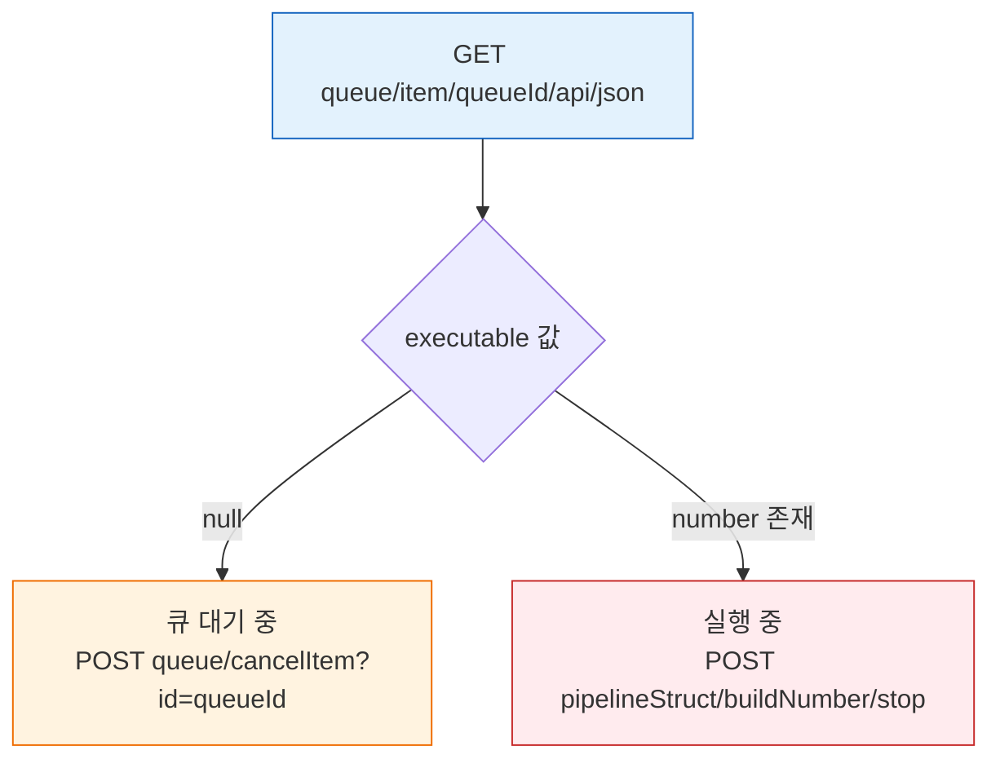

# 젠킨스 빌드 중지·취소 API 스펙
---
> 이 문서는 `01-04. 젠킨스 빌드 실행·큐 API 스펙` 에서 분할된 제어용 API 편입니다.
>
> - 실행 중인 빌드 중지, 큐 대기 빌드 취소 API를 다룹니입니다.
> - 빌드 트리거·큐 조회·실행기 조회 API는 `01-04. 젠킨스 빌드 실행·큐 API 스펙`에서 다룹니입니다.

## §학습 목표

> 이 문서를 읽고 나면 실행 중인 빌드를 `stop`으로 중단하고 큐 대기 빌드를 `cancelItem`으로 취소하며, `executable` 필드를 기준으로 둘 중 어느 API를 써야 할지 정확히 분기할 수 있습니다.

## §사전 지식

> 01-04의 큐-빌드 전환(queue → executor 배정 → 실행)을 알고 있다면, 이 문서는 그 전환 어느 지점에 있느냐에 따라 중지·취소 API가 갈린다는 사실로 구체화한 것입니다.

## 5. 제어용 API: 빌드 중지 · 큐 취소 POST

### 5-1. `POST /{pipelineStruct}/{buildNumber}/stop`

> 실행 중인 빌드를 중단하는 API입니다.

이 섹션은 30초 대기 파이프라인 `API-SLEEP10`을 대상으로 보는 편이 가장 안정적입니다.

요청 형식은 다음과 같습니다:

```http
POST /{pipelineStruct}/{buildNumber}/stop HTTP/1.1
Authorization: Basic <...>
Jenkins-Crumb: <crumb>
Cookie: <session-cookie>
```

예시는 다음과 같습니다:

```bash
curl -k -sS -D headers.txt -o /dev/null -w 'HTTP_STATUS=%{http_code}\n' \
  -X POST -b cookies.txt \
  -u "${JENKINS_USER}:${JENKINS_PASS}" \
  -H "${CRUMB_FIELD}: ${CRUMB}" \
  "${JENKINS_URL}${PIPELINE_SLEEP10_STRUCT}/${BUILD_NUMBER}/stop"

cat headers.txt
```

직접 재현하려면, 먼저 `API-SLEEP10`을 실행하고 `BUILD_NUMBER`를 확보한 뒤 중지하는 순서가 가장 안전합니다:

```bash
curl -k -sS -D headers.txt -o /dev/null -w 'HTTP_STATUS=%{http_code}\n' \
  -X POST -b cookies.txt \
  -u "${JENKINS_USER}:${JENKINS_PASS}" \
  -H "${CRUMB_FIELD}: ${CRUMB}" \
  "${JENKINS_URL}${PIPELINE_SLEEP10_STRUCT}/build"

cat headers.txt

export QUEUE_ID=$(awk 'BEGIN{IGNORECASE=1} /^Location:/ {gsub("\r","",$2); print $2}' headers.txt | sed -E 's#.*/queue/item/([0-9]+)/?#\1#')
export QUEUE_ID_SLEEP10="${QUEUE_ID}"
echo "$QUEUE_ID_SLEEP10"

export BUILD_NUMBER=$(curl -k -sS -u "${JENKINS_USER}:${JENKINS_PASS}" \
  "${JENKINS_URL}/queue/item/${QUEUE_ID_SLEEP10}/api/json" \
  | jq -r '.executable.number')
echo "$BUILD_NUMBER"

curl -k -sS -D headers.txt -o /dev/null -w 'HTTP_STATUS=%{http_code}\n' \
  -X POST -b cookies.txt \
  -u "${JENKINS_USER}:${JENKINS_PASS}" \
  -H "${CRUMB_FIELD}: ${CRUMB}" \
  "${JENKINS_URL}${PIPELINE_SLEEP10_STRUCT}/${BUILD_NUMBER}/stop"

cat headers.txt
```

`stop` 요청 직후 곧바로 `ABORTED`가 확정되는 것은 아닙니다.

stop 요청부터 최종 상태 확정까지의 흐름은 다음과 같습니다:

```mermaid
flowchart LR
    REQ["POST buildNumber/stop"]
    ACK["200 또는 302 중지 요청 접수"]
    GRACE["파이프라인 정리 post 블록 등"]
    DONE["01-05 상태 조회 ABORTED 확정"]

    REQ --> ACK
    ACK --> GRACE
    GRACE --> DONE

    style REQ fill:#ffebee,stroke:#c62828,color:#333
    style DONE fill:#e8f5e9,stroke:#2e7d32,color:#333
``` 최종 결과는 `01-05`의 빌드 상태 조회 API에서 확인합니다.

에러 케이스는 다음과 같습니다:

| 상태 코드 | 의미 | 대응 |
|-----------|------|------|
| `200` 또는 `302` | 중지 요청 접수 | 이후 상태 API에서 결과 확인 |
| `403` | 권한 부족 또는 crumb 문제 | 인증/권한 확인 |
| `404` | 대상 빌드 없음 | `BUILD_NUMBER` 확인 |

---

### 5-2. `POST /queue/cancelItem?id={queueId}`

> 아직 Executor에 배정되지 않은, 큐 대기 중인 빌드를 취소하는 API입니다.
>
> - `stop`과 달리 빌드 번호(`BUILD_NUMBER`)가 없어도 됩니다. 큐 아이템 ID(`queueId`)만 있으면 됩니다.
> - 빌드가 이미 Executor에 배정되어 실행 중이면 이 API로는 취소할 수 없습니다.

요청 형식은 다음과 같습니다:

```http
POST /queue/cancelItem?id={queueId} HTTP/1.1
Authorization: Basic <...>
Jenkins-Crumb: <crumb>
Cookie: <session-cookie>
```

예시는 다음과 같습니다:

```bash
curl -k -sS -D headers.txt -o /dev/null -w 'HTTP_STATUS=%{http_code}\n' \
  -X POST -b cookies.txt \
  -u "${JENKINS_USER}:${JENKINS_PASS}" \
  -H "${CRUMB_FIELD}: ${CRUMB}" \
  "${JENKINS_URL}/queue/cancelItem?id=${QUEUE_ID_SLEEP10}"

cat headers.txt
```

직접 재현하려면, `API-SLEEP10`을 실행한 뒤 큐에 있는 동안 취소하는 순서가 안전합니다:

```bash
# 1. 빌드 트리거 후 queueId 확보
curl -k -sS -D headers.txt -o /dev/null -w 'HTTP_STATUS=%{http_code}\n' \
  -X POST -b cookies.txt \
  -u "${JENKINS_USER}:${JENKINS_PASS}" \
  -H "${CRUMB_FIELD}: ${CRUMB}" \
  "${JENKINS_URL}${PIPELINE_SLEEP10_STRUCT}/build"

export QUEUE_ID_SLEEP10=$(awk 'BEGIN{IGNORECASE=1} /^Location:/ {gsub("\r","",$2); print $2}' headers.txt \
  | sed -E 's#.*/queue/item/([0-9]+)/?#\1#')
echo "queueId: $QUEUE_ID_SLEEP10"

# 2. 큐에 있는 동안 취소 (executable이 null인 상태에서 실행해야 한다)
curl -k -sS -D headers.txt -o /dev/null -w 'HTTP_STATUS=%{http_code}\n' \
  -X POST -b cookies.txt \
  -u "${JENKINS_USER}:${JENKINS_PASS}" \
  -H "${CRUMB_FIELD}: ${CRUMB}" \
  "${JENKINS_URL}/queue/cancelItem?id=${QUEUE_ID_SLEEP10}"

cat headers.txt

# 3. 취소 확인
curl -k -sS -u "${JENKINS_USER}:${JENKINS_PASS}" \
  "${JENKINS_URL}/queue/item/${QUEUE_ID_SLEEP10}/api/json" \
  | jq '{id, cancelled, why}'
```

취소 후 `GET /queue/item/{queueId}/api/json`을 조회하면 다음처럼 나옵니다:

```json
{
  "id": 218,
  "cancelled": true,
  "why": null
}
```

에러 케이스는 다음과 같습니다:

| 상태 코드 | 의미 | 대응 |
|-----------|------|------|
| `302` | 취소 성공 | `Location: /queue/` 헤더 확인 |
| `404` | 큐에 없음 | 이미 Executor에 배정되어 실행 중이면 `stop` API 사용 |
| `403` | 권한 부족 또는 crumb 문제 | 인증/권한 확인 |

---

### 5-3. 큐 취소 vs 빌드 중지: 판단 기준

판단 기준은 `GET /queue/item/{queueId}/api/json`의 `executable` 필드입니다.

`executable` 값에 따라 어느 API로 갈지 흐름으로 보면 다음과 같습니다:



| 상황 | `executable` 값 | 사용 API |
|------|-----------------|----------|
| 빌드가 아직 큐에 있음 | `null` | `POST /queue/cancelItem?id={queueId}` |
| 빌드가 이미 실행 중 | `{"number": N, "url": "..."}` | `POST /{pipelineStruct}/{buildNumber}/stop` |

다음 명령으로 현재 상태를 조회하고 분기할 수 있습니다:

```bash
EXECUTABLE=$(curl -k -sS -u "${JENKINS_USER}:${JENKINS_PASS}" \
  "${JENKINS_URL}/queue/item/${QUEUE_ID_SLEEP10}/api/json" \
  | jq -r '.executable')

if [ "$EXECUTABLE" = "null" ]; then
  echo "큐 대기 중 → cancelItem 사용"
else
  BUILD_NUMBER=$(echo "$EXECUTABLE" | jq -r '.number')
  echo "실행 중 (buildNumber=$BUILD_NUMBER) → stop 사용"
fi
```


> `cancelItem` 호출 시 Jenkins 내부에서 일어나는 WaitingItem/BlockedItem/BuildableItem 상태 전이, DB 기록 흐름은 `01-04c. 젠킨스 큐 내부 흐름과 실행 순서`에서 다룹니입니다.


## 6. 관련 문서

- `01-04. 젠킨스 빌드 실행·큐 API 스펙.md` (트리거·큐 조회·실행기 조회 본편)
- `01-02. 젠킨스 인증 API 스펙 (ID-Password + Crumb).md`
- `01-02a. 젠킨스 인증 모델과 TPS 패턴 (2.222+).md`
- `01-03. 젠킨스 파이프라인 CRUD API 스펙.md`
- `01-04a. 젠킨스 빌드 실행·큐 모델과 TPS 패턴 (2.222+).md`
- `01-04b. 젠킨스 큐-빌드 전환 흐름과 실행기 환경.md`
- `01-04c. 젠킨스 큐 내부 흐름과 실행 순서.md`
- `01-05. 젠킨스 빌드 상태 추적 API 스펙.md`


## 7. 참고 링크

- Jenkins Remote Access API
