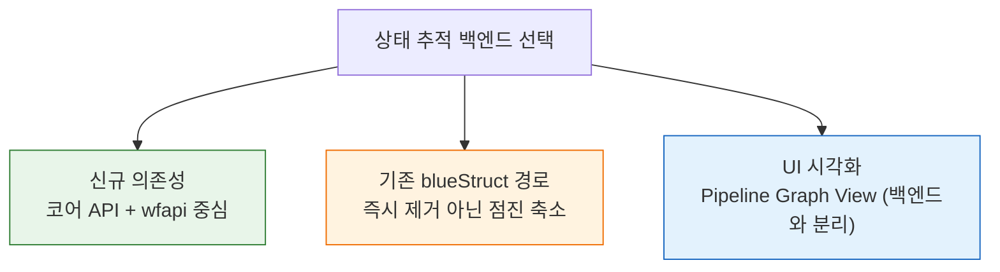
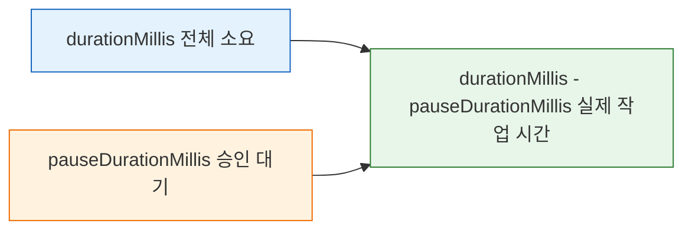

# 젠킨스 상태 추적 API 현대화와 Blue Ocean 해석
---
> 이 문서는 Jenkins 빌드 상태 추적 관점에서 Blue Ocean, Workflow API, 현대 Jenkins 플러그인 생태계를 어떻게 해석해야 하는지 설명합니다.
>
> - Blue Ocean UI 유지보수 모드, `wfapi` 중심 전환, Workflow API 개선 사항을 다룬입니다.
> - TPS 상태 저장과 매핑 자체는 `01-05a`, 순수 조회 API 스펙은 `01-05`에서 별도로 다룬입니다.

## §학습 목표

> 이 문서를 읽고 나면 Blue Ocean UI 유지보수 모드와 Blue Ocean REST API 폐기를 구분하고, 상태 추적을 코어 API + wfapi 중심으로 가져가는 판단 근거를 대며, `pauseDurationMillis`로 승인 대기 시간을 분리해 읽을 수 있습니다.

## §사전 지식

> 01-05·01-05a에서 본 wfapi 기반 상태 추적을 알고 있다면, 이 문서는 그 선택을 현대 Jenkins 플러그인 생태계(Blue Ocean 유지보수 모드 등) 위에서 정당화하는 판단 편입니다.

## 1. Blue Ocean과 Workflow API 해석

> 상태 추적에서 중요한 것은 Blue Ocean UI 자체보다 어떤 API를 안정적으로 쓸 수 있는가입니다.

### 1-1. Blue Ocean UI 지원 중단

Jenkins 프로젝트는 2022년부터 Blue Ocean UI를 유지보수 모드로 두고 있습니다. 즉 신규 UI 투자 관점에서는 deprecated로 보는 편이 맞습니다.

- 다만 **Blue Ocean REST API(`/blue/rest/...`)가 곧바로 무효라는 뜻은 아닙니다.** 
- 이 API는 후속 UI나 다른 시각화 플러그인에서도 여전히 활용될 수 있습니다.

### 1-2. 현재 TPS 관점의 판단

TPS 관점에서는 다음처럼 보는 편이 현실적입니다:

- 신규 의존성은 코어 API + `wfapi` 중심으로 두는 편이 낫습니다.
- 기존 `blueStruct` 경로 변환이 이미 있다면 바로 걷어낼 필요는 없습니다.
- 다만 장기적으로는 Blue Ocean 전용 경로보입니다 `wfapi/describe`와 코어 API 조합이 더 안정적입니다.

상태 추적 의존성을 어디에 둘지 판단하는 흐름을 그림으로 보면 다음과 같습니다:

### 1-3. Pipeline Graph View Plugin

Blue Ocean UI의 대안으로 Pipeline Graph View Plugin이 있습니다. 이건 Jenkins 웹 UI 쪽 대안이지, TPS 백엔드 상태 조회 방식 자체를 당장 바꾸는 요소는 아닙니다.

## 2. Workflow API 개선 사항

> 이 문서에서 말하는 "개선"은 새로운 endpoint가 대거 생겼다는 뜻보다, 기존 `wfapi` 응답을 운영 판단에 더 신뢰할 수 있게 됐다는 뜻에 가깝습니다.

특히 TPS 관점에서 중요했던 비교 포인트는 다음과 같습니다:

| 비교 축 | 예전 해석 | 지금 해석 | 실무 의미 |
|------|------|------|------|
| 승인 대기 시간 | `pauseDurationMillis`를 보더라도 값이 거칠 수 있어서 참고용에 가까웠다 | `pauseDurationMillis`를 예전보다 더 믿고 승인 대기 시간을 읽을 수 있다 | 승인 대기 시간 표시, SLA 계산, 장기 대기 탐지에 더 적합하다 |
| `wfapi`의 역할 | 스테이지 구조를 보는 보조 API 성격이 강했다 | run 단위 상태 확인 API로 더 실용적이다 | TPS 폴링 잡이나 상태 동기화에서 `wfapi` 비중을 높이기 쉬워졌다 |
| Blue Ocean 대비 위치 | Blue Ocean이 더 풍부한 구조/시각화 API처럼 느껴졌다 | 상태 추적 자체는 코어 API + `wfapi`로도 충분한 경우가 많다 | 신규 백엔드 구현은 Blue Ocean 의존 없이도 갈 수 있다 |
| 승인/중단 같은 중간 상태 해석 | 코어 build API만으로는 빈틈이 있었다 | `wfapi`가 `PAUSED_PENDING_INPUT`, stage 상태를 더 잘 드러낸다 | 단순 성공/실패 외의 중간 상태를 더 자연스럽게 모델링할 수 있다 |

- 즉 개선의 본질은 "기능이 완전히 새로 생겼다"보다, `wfapi`를 운영 상태 추적에 써도 되는 근거가 더 강해졌다는 쪽입니다.

### 2-1. `pauseDurationMillis`가 왜 중요해졌는가

승인 대기나 `input` 스텝이 있는 파이프라인에서는 "실행 시간"과 "실제 작업 시간"을 구분해야 합니다. 예전에는 `pauseDurationMillis`를 보더라도 얼마나 믿어야 하는지가 애매했습니다.

지금 문서에서 말하는 개선은 이 지점입니다:

- **예전**
  - 승인 대기 시간이 대략적으로만 보일 수 있었습니다.
  - 운영 화면에 노출해도 참고용 성격이 강했습니다.
- **지금**
  - `pauseDurationMillis`를 예전보다 더 신뢰할 수 있습니다.
  - 승인 대기 시간과 순수 실행 시간을 나눠 읽기가 쉬워졌입니다.

예를 들어 같은 build라도 다음처럼 해석할 수 있습니다:

| 필드 | 예전 해석 | 지금 해석 |
|------|------|------|
| `durationMillis` | 전체 걸린 시간 정도로만 봄 | 전체 소요 시간으로 계속 사용 |
| `pauseDurationMillis` | 값이 있어도 엄밀한 운영 지표로 쓰기 조심스러움 | 승인 대기 시간으로 적극 활용 가능 |
| `durationMillis - pauseDurationMillis` | 보조 계산 정도 | 실제 작업 시간 추정에 더 유용 |

- 즉 승인 프로세스가 끼어 있는 Jenkins 파이프라인에서는 `pauseDurationMillis` 개선이 생각보다 중요합니다.

승인 대기가 낀 빌드에서 전체 시간을 작업 시간과 대기 시간으로 분해하는 관계를 그림으로 보면 다음과 같습니다:

### 2-2. 무엇이 안 바뀐 것인지도 같이 봐야 합니다

개선됐다고 해서 `wfapi`가 만능이 된 것은 아닙니다.

- `/{pipelineStruct}/wfapi/describe`는 현재 실습 Jenkins에서 job-level 응답처럼 보일 수 있습니다.
- 그래서 실제 상태 추적은 여전히 `/{pipelineStruct}/{buildNumber}/wfapi/describe`를 기준으로 보는 편이 안전합니다.
- 실행 중 여부 자체는 여전히 코어 build API의 `building=true`가 더 직관적입니다.

즉 비교를 정리하면 다음과 같습니다:

| 항목 | 지금도 코어 API가 더 나은 부분 | 지금 `wfapi`가 더 나은 부분 |
|------|------|------|
| 실행 중 여부 | `building` 필드 확인이 가장 직관적 | - |
| 최종 결과 | `result` 확인이 단순하고 안정적 | - |
| 승인 대기 상태 | - | `PAUSED_PENDING_INPUT` 표현이 더 좋다 |
| 스테이지 상태 | - | `stages[]` 구조로 한 번에 보기 쉽다 |
| 승인 대기 시간 | - | `pauseDurationMillis` 활용 가치가 커졌다 |

즉 최근 개선을 반영한 실무 판단은 다음처럼 요약할 수 있습니다:

- build 전체 생명주기는 코어 API가 중심입니다.
- 파이프라인 내부 진행 상태와 승인 대기 해석은 `wfapi`가 중심입니다.
- Blue Ocean은 선택적 보조 수단으로 남기고, 신규 의존성은 줄이는 편이 낫습니다.

## 3. 실무 판단 기준

현대 Jenkins 관점에서 상태 추적 API를 고를 때는 다음 기준으로 보면 됩니다:

- 신규 구현은 코어 build API + `wfapi`를 우선합니다.
- 기존 Blue Ocean 의존성은 즉시 제거 대상이라기보다 점진적 축소 대상으로 봅니다.
- UI 대체 플러그인 도입 여부와 백엔드 상태 추적 API 선택은 분리해서 판단합니다.

즉 "Blue Ocean UI 유지보수 모드"와 "Blue Ocean API 즉시 폐기"를 같은 뜻으로 보면 안 됩니다.

## 면접 질문

> 답을 떠올린 뒤 §정답 절에서 같은 번호로 대조하세요.

1. "Blue Ocean UI 유지보수 모드"와 "Blue Ocean API 즉시 폐기"를 같은 뜻으로 보면 안 되는 이유는?
2. 승인(`input`) 스텝이 있는 파이프라인에서 `pauseDurationMillis`가 왜 중요한가요?
3. 실행 중 여부와 최종 결과는 wfapi와 코어 API 중 어느 것이 더 직관적인가요?

## 정답

> 위 질문을 스스로 설명해 본 뒤에 펼치세요.

### 정답 1 — UI 모드 ≠ API 폐기

Blue Ocean UI는 2022년부터 유지보수 모드(신규 UI 투자 중단)지만, Blue Ocean REST API(`/blue/rest/...`)가 곧바로 무효라는 뜻은 아닙니다. 그 API는 후속 UI나 다른 시각화 플러그인에서 여전히 활용될 수 있습니다. 다만 신규 백엔드 의존성은 코어 API + wfapi 중심으로 두는 것이 더 안정적입니다.

### 정답 2 — pauseDurationMillis의 중요성

승인 대기가 끼면 "전체 소요 시간(`durationMillis`)"과 "실제 작업 시간"이 달라집니다. `pauseDurationMillis`로 승인 대기 시간을 분리하면 `durationMillis - pauseDurationMillis`로 실제 작업 시간을 추정할 수 있어, SLA 계산이나 장기 대기 탐지에 유용합니다.

### 정답 3 — 실행 여부·결과는 코어 API

실행 중 여부는 코어 빌드 API의 `building` 필드가 가장 직관적이고, 최종 결과는 `result` 확인이 단순·안정적입니다. 반면 승인 대기 상태나 stage 진행은 wfapi가 더 잘 드러냅니다. 즉 빌드 전체 생명주기는 코어 API, 파이프라인 내부 진행은 wfapi로 역할을 나눕니입니다.

## 4. 관련 문서

- `01-05. 젠킨스 빌드 상태 추적 API 스펙.md`
- `01-05a. 젠킨스 빌드 상태 추적 모델과 TPS 패턴 (2.222+).md`
- [Pipeline Graph View Plugin](https://plugins.jenkins.io/pipeline-graph-view/)
- [Pipeline: REST API Plugin](https://plugins.jenkins.io/pipeline-rest-api/)
