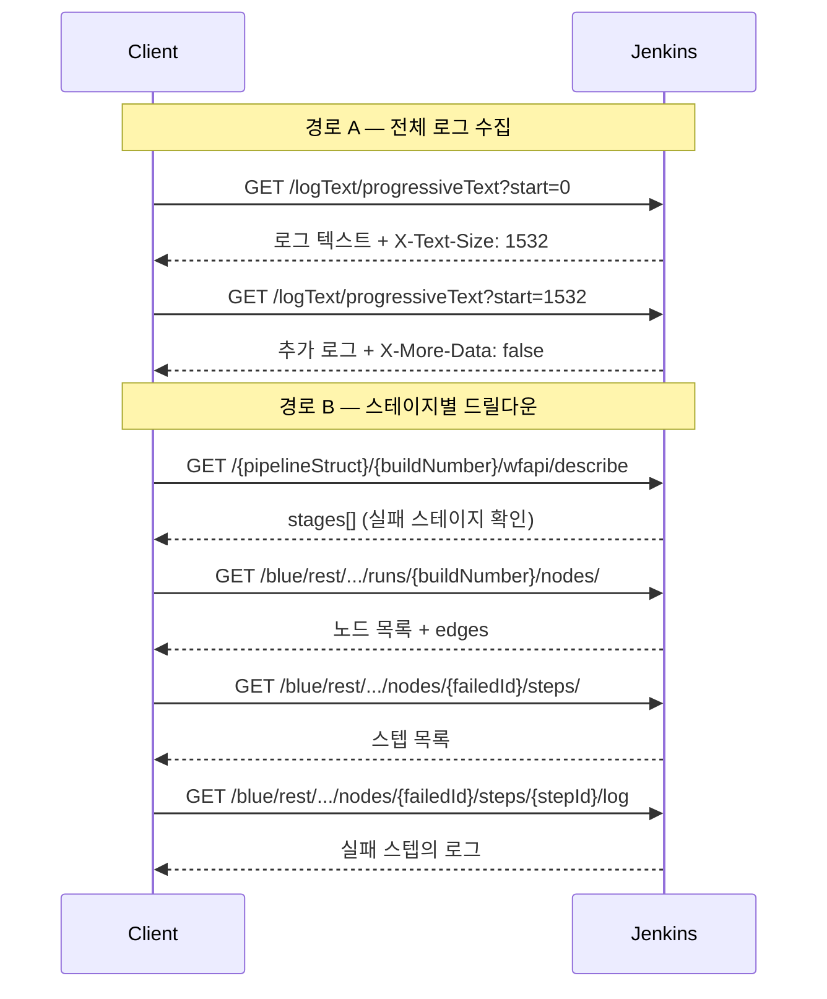

# 젠킨스 API 로그 조회와 적재
---
> 이 문서는 Jenkins 빌드 로그 조회와, 완료된 빌드 로그를 파일시스템에 적재하는 흐름을 설명하는 스펙 문서입니다.
>
> - 전체 콘솔 로그, 증분 로그, stage/node 단위 로그, Blue Ocean 드릴다운, 완료 빌드의 전체 로그 조회 API를 다룹니다.
> - 로그 적재 구현 패턴, 파일 저장 구조, 모듈 역할 분리, 최근 버전 변화는 `01-06a`에서 별도로 다룹니다.

## 1. 이 문서의 범위

> 이 문서는 로그 조회와 적재에 직접 사용하는 아래 API와 흐름만 설명합니다.

| 메서드 | 경로 | 목적 |
|------|------|------|
| GET | `/{pipelineStruct}/{buildNumber}/consoleText` | 특정 빌드의 전체 콘솔 로그 조회 |
| GET | `/{pipelineStruct}/{buildNumber}/logText/progressiveText?start={n}` | 증분 로그 조회 |
| GET | `/{pipelineStruct}/{buildNumber}/execution/node/{nodeId}/wfapi/log` | 특정 stage/node 로그 조회 |
| GET | `/blue/rest/.../runs/{buildNumber}/nodes/` | Blue Ocean 노드 목록 조회 |
| GET | `/blue/rest/.../runs/{buildNumber}/nodes/{nodeId}/steps/` | Blue Ocean 스텝 목록 조회 |
| GET | `/blue/rest/.../runs/{buildNumber}/nodes/{nodeId}/log` | Blue Ocean 노드 로그 조회 |
| GET | `/blue/rest/.../runs/{buildNumber}/nodes/{nodeId}/steps/{stepId}/log` | Blue Ocean 스텝 로그 조회 |

인증과 crumb/cookie 준비는 별도 문서에서 다룹니다:

- `01-02. 젠킨스 인증 API 스펙 (ID-Password + Crumb).md`
- `01-02a. 젠킨스 인증 모델과 TPS 패턴 (2.222+).md`

빌드 실행과 상태 추적은 이 문서 범위가 아닙니다. 그 내용은 별도 문서에서 다룹니다:

- `01-04. 젠킨스 빌드 실행·큐 API 스펙.md`
- `01-05. 젠킨스 빌드 상태 추적 API 스펙.md`

### 1-1. 공통 경로 규칙

코어 Jenkins 로그 API는 `pipelineStruct + buildNumber` 조합을 기본으로 씁니다.

- 코어 Job 경로: `/job/{folder}/job/{name}`
- 특정 build 경로: `/{pipelineStruct}/{buildNumber}/...`
- 특정 stage/node 경로: `/{pipelineStruct}/{buildNumber}/execution/node/{nodeId}/...`

Blue Ocean 로그 API는 코어 Jenkins와 경로 구조가 다릅니다.

- 코어 Jenkins: `/job/{taskCd}/job/{envrnCd}/job/{bizNm}`
- Blue Ocean: `/blue/rest/organizations/jenkins/pipelines/{taskCd}/pipelines/{envrnCd}/pipelines/{bizNm}`

예시는 다음과 같습니다:

```text
/job/SBH/job/API-SLEEP10/12/consoleText
/job/SBH/job/API-SLEEP10/12/logText/progressiveText?start=0
/job/SBH/job/API-SLEEP10/12/execution/node/12/wfapi/log
/blue/rest/organizations/jenkins/pipelines/SBH/pipelines/API-SLEEP10/runs/12/nodes/
```

### 1-2. 공통 요청 규칙

모든 예시는 [01-00. 젠킨스 API 사전 준비.md](/Users/simbohyeon/Library/CloudStorage/GoogleDrive-tscofet@gmail.com/내%20드라이브/study/runners-high/write/07_devops/02_Jenkins/04_api/01-00.%20젠킨스%20API%20사전%20준비.md) 와 `01-04`, `01-05`까지의 준비가 끝났다는 전제입니다.

즉 이 문서에서는 아래 공통값을 다시 설명하지 않습니다:

- `JENKINS_URL`
- `JENKINS_USER`
- `JENKINS_PASS`
- `PIPELINE_NORMAL_STRUCT`
- `PIPELINE_PARAM_STRUCT`
- `PIPELINE_SLEEP10_STRUCT`
- `PIPELINE_FAIL_STRUCT`
- `PIPELINE_NORMAL_2_STRUCT`
- `BLUE_STRUCT_FAIL`

이 문서에서는 build 번호와 stage/node 식별자처럼 현재 실행마다 바뀌는 값만 추가로 준비합니다:

```bash
export BUILD_NUMBER_NORMAL=''
export BUILD_NUMBER_FAIL=''
export BUILD_NUMBER_SLEEP10=''
export BUILD_NUMBER_PARAM=''

export NODE_ID_FAILED='12'
export STEP_ID_FAILED='7'
```

이 문서에서 의미하는 값은 다음과 같습니다:

| 변수 | 의미 | 예시 |
|------|------|------|
| `BUILD_NUMBER_NORMAL` | `API-NORMAL`의 최근 빌드 번호 | `8` |
| `BUILD_NUMBER_FAIL` | `API-FAIL`의 최근 빌드 번호 | `3` |
| `BUILD_NUMBER_SLEEP10` | `API-SLEEP10`의 최근 빌드 번호 | `12` |
| `BUILD_NUMBER_PARAM` | `API-PARAM`의 최근 빌드 번호 | `5` |
| `NODE_ID_FAILED` | 실패 stage/node ID | `12` |
| `STEP_ID_FAILED` | 실패 스텝 ID | `7` |
| `BLUE_STRUCT_FAIL` | `API-FAIL`의 Blue Ocean 경로 | `pipelines/SBH/pipelines/API-FAIL` |

빠른 로그 실습용 build 번호는 먼저 이렇게 잡아두면 됩니다:

```bash
export BUILD_NUMBER_NORMAL=$(curl -k -sS -u "${JENKINS_USER}:${JENKINS_PASS}" \
  "${JENKINS_URL}${PIPELINE_NORMAL_STRUCT}/lastBuild/api/json" \
  | jq -r '.number')

export BUILD_NUMBER_SLEEP10=$(curl -k -sS -u "${JENKINS_USER}:${JENKINS_PASS}" \
  "${JENKINS_URL}${PIPELINE_SLEEP10_STRUCT}/lastBuild/api/json" \
  | jq -r '.number')

export BUILD_NUMBER_FAIL=$(curl -k -sS -u "${JENKINS_USER}:${JENKINS_PASS}" \
  "${JENKINS_URL}${PIPELINE_FAIL_STRUCT}/lastBuild/api/json" \
  | jq -r '.number')

echo "$BUILD_NUMBER_NORMAL"
echo "$BUILD_NUMBER_SLEEP10"
echo "$BUILD_NUMBER_FAIL"
```

GET 로그 API도 POST와 마찬가지로 HTTP 상태 코드, 헤더, 본문을 분리해서 확인할 수 있습니다. 기본 패턴은 다음과 같습니다:

```bash
curl -k -sS -D headers.txt -o body.txt -w 'HTTP_STATUS=%{http_code}\n' \
  -u "${JENKINS_USER}:${JENKINS_PASS}" \
  "<GET URL>"

cat headers.txt
head -n 20 body.txt
```

- plain text 로그 API는 본문이 그대로 텍스트 파일에 저장됩니다.
- JSON 로그 API는 `body.json`으로 저장한 뒤 `jq`로 확인하면 됩니다.
- 정상 조회라면 보통 `HTTP_STATUS=200`이 내려옵니다.

### 1-3. 권장 실행 순서

이 문서는 로그 API를 개별로 설명하지만, 실제 실습은 아래 순서로 보는 편이 자연스럽습니다.

| 순서 | 먼저 하는 일 | 이어서 보는 API | 목적 |
|------|------|------|------|
| 1 | build 번호를 확보한다 | `GET /{pipelineStruct}/{buildNumber}/consoleText` | 가장 단순한 전체 로그 확인 |
| 2 | 실행 중 로그를 본다 | `GET /logText/progressiveText?start={n}` | 증분 로그 추적 |
| 3 | 실패 지점을 좁힌다 | `GET /execution/node/{nodeId}/wfapi/log` | 특정 stage/node 로그 확인 |
| 4 | 더 세밀한 드릴다운이 필요하면 | `GET /blue/rest/...` | 노드/스텝 단위 로그 추적 |
| 5 | 빌드 완료 후 | `GET /logText/progressiveText?start=0` + 적재 흐름 | 전체 로그 저장 |


## 2. 전체 콘솔 로그

### 2-1. 상태 준비: `consoleText` 조회 전에 성공 build를 만듭니다

가장 단순한 `consoleText` 조회는 완료된 성공 build를 기준으로 보는 편이 읽기 쉽습니다.

먼저 성공한 build 하나를 만들어 두면 `consoleText` 확인이 쉽습니다:

```bash
curl -k -sS -D headers.txt -o /dev/null -w 'HTTP_STATUS=%{http_code}\n' \
  -X POST -b cookies.txt \
  -u "${JENKINS_USER}:${JENKINS_PASS}" \
  -H "${CRUMB_FIELD}: ${CRUMB}" \
  "${JENKINS_URL}${PIPELINE_NORMAL_STRUCT}/build"

export BUILD_NUMBER_NORMAL=$(curl -k -sS -u "${JENKINS_USER}:${JENKINS_PASS}" \
  "${JENKINS_URL}${PIPELINE_NORMAL_STRUCT}/lastBuild/api/json" \
  | jq -r '.number')

echo "$BUILD_NUMBER_NORMAL"
```

### 2-2. `GET /{pipelineStruct}/{buildNumber}/consoleText`

> 가장 단순한 방식입니다. 특정 빌드의 전체 콘솔 출력을 plain text로 반환합니다:

```bash
curl -k -sS -D headers.txt -o consoleText.txt -w 'HTTP_STATUS=%{http_code}\n' \
  -u "${JENKINS_USER}:${JENKINS_PASS}" \
  "${JENKINS_URL}${PIPELINE_NORMAL_STRUCT}/${BUILD_NUMBER_NORMAL}/consoleText"

cat headers.txt
head -n 300 consoleText.txt
```

- 장점은 단순함입니다. 
- 단점은 로그가 수 MB에 달하는 빌드에서 매 요청마다 전체를 다시 내려받는다는 것입니다. 실행 중인 빌드의 실시간 추적에는 부적합합니다.


## 3. 증분 로그 (Progressive Text)

### 3-1. 상태 준비: 실행 중 build를 먼저 만듭니다

증분 로그는 실행 중 상태에서 볼 때 의미가 가장 큽니다.

먼저 실행 중 상태를 만들려면 `API-SLEEP10`을 다시 실행한 뒤 build 번호를 잡아두면 됩니다:

```bash
curl -k -sS -D headers.txt -o /dev/null -w 'HTTP_STATUS=%{http_code}\n' \
  -X POST -b cookies.txt \
  -u "${JENKINS_USER}:${JENKINS_PASS}" \
  -H "${CRUMB_FIELD}: ${CRUMB}" \
  "${JENKINS_URL}${PIPELINE_SLEEP10_STRUCT}/build"

export BUILD_NUMBER_SLEEP10=$(curl -k -sS -u "${JENKINS_USER}:${JENKINS_PASS}" \
  "${JENKINS_URL}${PIPELINE_SLEEP10_STRUCT}/lastBuild/api/json" \
  | jq -r '.number')

echo "$BUILD_NUMBER_SLEEP10"
```

### 3-2. `GET /{pipelineStruct}/{buildNumber}/logText/progressiveText?start={n}`

> 실시간에 가까운 로그 추적이 필요하면 `progressiveText`를 사용합니다.
>
> 이미 읽은 바이트 수를 `start` 파라미터로 전달하면, Jenkins가 새로 추가된 로그만 내려줍니다:

```bash
curl -k -sS -D headers.txt -o progressiveText.txt -w 'HTTP_STATUS=%{http_code}\n' \
  -u "${JENKINS_USER}:${JENKINS_PASS}" \
  "${JENKINS_URL}${PIPELINE_SLEEP10_STRUCT}/${BUILD_NUMBER_SLEEP10}/logText/progressiveText?start=0"

cat headers.txt
cat progressiveText.txt
```

응답 본문에는 로그 텍스트가 담기고, 핵심 정보는 응답 헤더에 있습니다:

| 헤더 | 설명 |
|------|------|
| `X-Text-Size` | 현재까지 출력된 총 바이트 수. 다음 요청의 `start` 값으로 사용한다 |
| `X-More-Data` | `true`면 아직 로그가 더 남아 있습니다. `false`이거나 헤더가 없으면 빌드가 종료된 것이다 |

### 3-3. 폴링 패턴

`start=0`으로 시작하여 응답의 `X-Text-Size`를 다음 `start`로 넘기고, `X-More-Data`가 `false`가 될 때까지 반복하는 bash 폴링 스크립트입니다:

```bash
START=0
while true; do
  RESPONSE_HEADERS=$(mktemp)
  BODY=$(curl -k -sS -D "$RESPONSE_HEADERS" -u "${JENKINS_USER}:${JENKINS_PASS}" \
    "${JENKINS_URL}${PIPELINE_SLEEP10_STRUCT}/${BUILD_NUMBER_SLEEP10}/logText/progressiveText?start=${START}")

  printf "%s" "$BODY"

  START=$(grep -i '^X-Text-Size:' "$RESPONSE_HEADERS" | awk '{print $2}' | tr -d '\r')
  MORE=$(grep -i '^X-More-Data:' "$RESPONSE_HEADERS" | awk '{print $2}' | tr -d '\r')

  rm -f "$RESPONSE_HEADERS"
  [ "$MORE" != "true" ] && break
  sleep 2
done
```


## 4. Pipeline Stage/Node 단위 로그

> **Pipeline: REST API 플러그인**(pipeline-rest-api)이 제공하는 API 그룹입니다.
>
> - 기존 Jenkins Remote Access API(/api/json)와 별도로, **Pipeline의 Stage·Step 구조**를 쉽게 조회할 수 있도록 설계되었습니다.
> - **Pipeline Stage View**와 **Blue Ocean**에서 내부적으로 많이 사용하는 API입니다.

### 4-1. 상태 준비: 실패 build와 stage ID를 먼저 확인합니다

전체 로그 대신 실패 stage만 보려면, 실패 build와 `nodeId`를 먼저 잡아두는 편이 좋습니다.

먼저 실패 build를 만들어 두면 `wfapi/log` 예시를 재현하기 쉽습니다. `nodeId`가 아직 없다면 같은 build의 `wfapi/describe`에서 stage ID를 같이 확인합니다:

```bash
curl -k -sS -D headers.txt -o /dev/null -w 'HTTP_STATUS=%{http_code}\n' \
  -X POST -b cookies.txt \
  -u "${JENKINS_USER}:${JENKINS_PASS}" \
  -H "${CRUMB_FIELD}: ${CRUMB}" \
  "${JENKINS_URL}${PIPELINE_FAIL_STRUCT}/build"

export BUILD_NUMBER_FAIL=$(curl -k -sS -u "${JENKINS_USER}:${JENKINS_PASS}" \
  "${JENKINS_URL}${PIPELINE_FAIL_STRUCT}/lastBuild/api/json" \
  | jq -r '.number')

curl -k -sS -u "${JENKINS_USER}:${JENKINS_PASS}" \
  "${JENKINS_URL}${PIPELINE_FAIL_STRUCT}/${BUILD_NUMBER_FAIL}/wfapi/describe" \
  | jq '{name, status, stages: [.stages[]? | {id, name, status}]}'
```

### 4-2. `GET /{pipelineStruct}/{buildNumber}/execution/node/{nodeId}/wfapi/log`

> 전체 로그가 아니라 특정 스테이지의 로그만 보고 싶다면, `Pipeline: REST API` 플러그인의 node별 로그 엔드포인트를 사용합니다:

```bash
curl -k -sS -D headers.txt -o body.json -w 'HTTP_STATUS=%{http_code}\n' \
  -u "${JENKINS_USER}:${JENKINS_PASS}" \
  "${JENKINS_URL}${PIPELINE_FAIL_STRUCT}/${BUILD_NUMBER_FAIL}/execution/node/${NODE_ID_FAILED}/wfapi/log"

cat headers.txt
jq '.' body.json
```

응답 예시:

```json
{
  "nodeId": "12",
  "nodeStatus": "FAILED",
  "length": 295,
  "hasMore": false,
  "text": "npm ci\nnpm test\nERROR: Test suite failed...",
  "consoleUrl": "/job/SBH/job/API-FAIL/3/execution/node/12/log"
}
```

### 4-3. 응답 필드

| 필드 | 타입 | 설명 |
|------|------|------|
| `nodeId` | string | 스테이지/스텝의 노드 ID |
| `nodeStatus` | string | 해당 노드의 실행 상태 |
| `length` | int | 로그 텍스트의 바이트 수 |
| `hasMore` | boolean | 아직 더 읽을 로그가 남아 있는지 여부 |
| `text` | string | 로그 내용 |
| `consoleUrl` | string | 웹 UI에서 해당 로그를 볼 수 있는 경로 |

중요한 점은 `wfapi/log`의 범위가 build 전체가 아니라 **특정 node 로그**라는 것입니다.

- build 전체 로그가 필요하면 `consoleText`, `progressiveText`
- 특정 stage 로그가 필요하면 `execution/node/{nodeId}/wfapi/log`
- stage보다 더 세부적으로 보려면 `execution/node/{nodeId}/wfapi/describe`의 `stageFlowNodes[]`에서 하위 node ID를 찾아 다시 `wfapi/log`

즉 `wfapi`도 `stages[]` 아래로 더 내려갈 수는 있지만, 공식 문서 기준 최소 단위는 보통 `stageFlowNodes[]` 쪽에 가깝습니다.


## 5. Blue Ocean API 드릴다운

> Blue Ocean API 드릴다운은 Jenkins Blue Ocean의 REST API를 사용해 파이프라인(Pipeline)의 상세 정보를 계층적으로 파고들어(Drill-down) 조회하는 기능을 의미합니다.

### 5-1. 상태 준비: 실패 build와 `nodeId`, `stepId`를 먼저 잡습니다

Blue Ocean 드릴다운은 실패 build를 하나 기준으로 두는 편이 자연스럽습니다.

`nodeId`, `stepId`를 아직 모르면 먼저 nodes와 steps를 조회해 잡습니다:

```bash
export BUILD_NUMBER_FAIL=$(curl -k -sS -u "${JENKINS_USER}:${JENKINS_PASS}" \
  "${JENKINS_URL}${PIPELINE_FAIL_STRUCT}/lastBuild/api/json" \
  | jq -r '.number')

curl -k -sS -u "${JENKINS_USER}:${JENKINS_PASS}" \
  "${JENKINS_URL}/blue/rest/organizations/jenkins/${BLUE_STRUCT_FAIL}/runs/${BUILD_NUMBER_FAIL}/nodes/?limit=10000" \
  | jq '[.[] | {id, displayName, result, state}]'

curl -k -sS -u "${JENKINS_USER}:${JENKINS_PASS}" \
  "${JENKINS_URL}/blue/rest/organizations/jenkins/${BLUE_STRUCT_FAIL}/runs/${BUILD_NUMBER_FAIL}/nodes/${NODE_ID_FAILED}/steps/" \
  | jq '[.[] | {id, displayName, result, state}]'
```

### 5-2. 주요 `GET /blue/rest/...` 경로

> Blue Ocean REST API는 `/blue/rest/` 경로 아래에 위치합니다. 주요 엔드포인트는 다음과 같습니다:

```bash
# 노드(스테이지) 목록 조회
curl -k -sS -D headers.txt -o nodes.json -w 'HTTP_STATUS=%{http_code}\n' \
  -u "${JENKINS_USER}:${JENKINS_PASS}" \
  "${JENKINS_URL}/blue/rest/organizations/jenkins/${BLUE_STRUCT_FAIL}/runs/${BUILD_NUMBER_FAIL}/nodes/?limit=10000"
cat headers.txt
jq '.' nodes.json

# 특정 노드의 스텝 목록 조회
curl -k -sS -D headers.txt -o steps.json -w 'HTTP_STATUS=%{http_code}\n' \
  -u "${JENKINS_USER}:${JENKINS_PASS}" \
  "${JENKINS_URL}/blue/rest/organizations/jenkins/${BLUE_STRUCT_FAIL}/runs/${BUILD_NUMBER_FAIL}/nodes/${NODE_ID_FAILED}/steps/"
cat headers.txt
jq '.' steps.json

# 특정 노드의 로그 조회
curl -k -sS -D headers.txt -o node-log.txt -w 'HTTP_STATUS=%{http_code}\n' \
  -u "${JENKINS_USER}:${JENKINS_PASS}" \
  "${JENKINS_URL}/blue/rest/organizations/jenkins/${BLUE_STRUCT_FAIL}/runs/${BUILD_NUMBER_FAIL}/nodes/${NODE_ID_FAILED}/log/?start=0"
cat headers.txt
head -n 20 node-log.txt

# 특정 스텝의 로그 조회
curl -k -sS -D headers.txt -o step-log.txt -w 'HTTP_STATUS=%{http_code}\n' \
  -u "${JENKINS_USER}:${JENKINS_PASS}" \
  "${JENKINS_URL}/blue/rest/organizations/jenkins/${BLUE_STRUCT_FAIL}/runs/${BUILD_NUMBER_FAIL}/nodes/${NODE_ID_FAILED}/steps/${STEP_ID_FAILED}/log"
cat headers.txt
head -n 20 step-log.txt
```

### 5-3. 노드 응답 필드

노드 목록 조회 응답은 각 스테이지의 상세 정보를 담고 있습니다:

```json
[
  {
    "id": "6",
    "displayName": "Checkout",
    "result": "SUCCESS",
    "state": "FINISHED",
    "type": "STAGE",
    "firstParent": null,
    "restartable": true,
    "edges": [{"id": "13", "type": "STAGE"}],
    "durationInMillis": 8500
  },
  {
    "id": "13",
    "displayName": "Build",
    "result": "FAILURE",
    "state": "FINISHED",
    "type": "STAGE",
    "firstParent": "6",
    "restartable": true,
    "edges": [],
    "durationInMillis": 45000
  }
]
```

| 필드 | 타입 | 설명 |
|------|------|------|
| `id` | string | 노드 고유 ID |
| `displayName` | string | 스테이지 이름 |
| `result` | string | `SUCCESS`, `FAILURE`, `UNKNOWN` |
| `state` | string | `FINISHED`, `RUNNING`, `PAUSED`, `QUEUED`, `NOT_BUILT` |
| `type` | string | `STAGE` 또는 `PARALLEL` |
| `edges` | array | 다음 노드 목록. DAG 구조를 표현한다 |
| `firstParent` | string | 부모 노드 ID. 최상위 노드는 `null` |
| `restartable` | boolean | 이 스테이지부터 재시작할 수 있는지 여부 |

### 5-4. 폴더 구조와 Blue Ocean 경로

Jenkins에서 폴더 안에 잡을 중첩하면, 코어 API와 Blue Ocean API의 경로 구조가 달라집니다. 이 차이를 모르면 404 에러를 만나게 됩니다.

| 구분 | 경로 구조 |
|------|----------|
| 코어 Jenkins | `/job/{taskCd}/job/{envrnCd}/job/{bizNm}` |
| Blue Ocean | `/pipelines/{taskCd}/pipelines/{envrnCd}/pipelines/{bizNm}` |

- 코어 API는 폴더마다 `/job/`을 반복하지만, Blue Ocean은 `/pipelines/`를 반복합니다. 

### 5-5. 로그 조회 전체 흐름

전체 로그를 수집하는 경로(A)와 스테이지별로 드릴다운하는 경로(B), 두 가지 접근이 가능합니다:



- 경로 A는 단순하지만 전체 로그에서 실패 원인을 직접 찾아야 합니다. 
- 경로 B는 API 호출이 많지만 실패 지점의 로그만 정확히 추출할 수 있습니다. 


## 6. 빌드 완료 후 로그 적재

> 로그 적재의 핵심은 단 하나의 Jenkins API 호출입니다

```
GET /{pipelineStruct}/{buildNumber}/logText/progressiveText?start=0
```

- `start=0`으로 호출하면 빌드의 전체 콘솔 로그를 한 번에 가져옵니다. 
- `### 3-2`에서 설명한 증분 로그 API와 동일한 엔드포인트이지만, 빌드가 이미 종료된 상태이므로 한 번의 호출로 전체 로그를 수집합니다.

이 API는 완료된 build가 있어야 의미가 있으므로, 실습용으로는 `API-FAIL`이나 `API-NORMAL` 같은 짧은 파이프라인이 편합니다. 예를 들어 실패 build를 하나 더 만들고 10초 정도 기다린 뒤 build 번호를 다시 잡아두면 됩니다:

```bash
curl -k -sS -D headers.txt -o /dev/null -w 'HTTP_STATUS=%{http_code}\n' \
  -X POST -b cookies.txt \
  -u "${JENKINS_USER}:${JENKINS_PASS}" \
  -H "${CRUMB_FIELD}: ${CRUMB}" \
  "${JENKINS_URL}${PIPELINE_FAIL_STRUCT}/build"

sleep 12

export BUILD_NUMBER_FAIL=$(curl -k -sS -u "${JENKINS_USER}:${JENKINS_PASS}" \
  "${JENKINS_URL}${PIPELINE_FAIL_STRUCT}/lastBuild/api/json" \
  | jq -r '.number')

echo "$BUILD_NUMBER_FAIL"
```

실습 예시는 다음과 같습니다:

```bash
curl -k -sS -D headers.txt -o full-log.txt -w 'HTTP_STATUS=%{http_code}\n' \
  -u "${JENKINS_USER}:${JENKINS_PASS}" \
  "${JENKINS_URL}${PIPELINE_FAIL_STRUCT}/${BUILD_NUMBER_FAIL}/logText/progressiveText?start=0"

cat headers.txt
head -n 200 full-log.txt
```

- GET 요청이므로 CSRF crumb은 불필요합니다. Basic Auth 헤더만으로 인증이 완료됩니다.

  

## 7. 참고 링크

- Jenkins Remote Access API: https://www.jenkins.io/doc/book/using/remote-access-api/
- Pipeline: REST API Plugin: https://plugins.jenkins.io/pipeline-rest-api
- Blue Ocean REST API: https://plugins.jenkins.io/blueocean-rest/
- `01-06a. 젠킨스 API 로그 조회 현대화.md`
