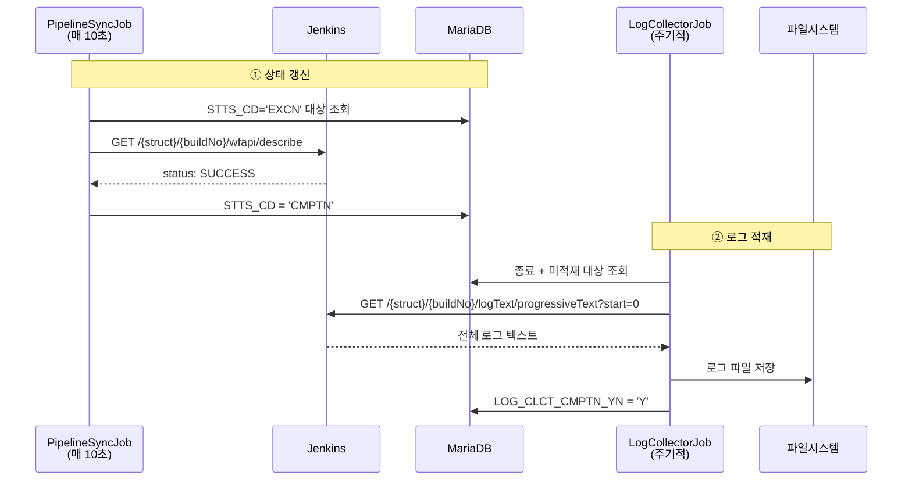
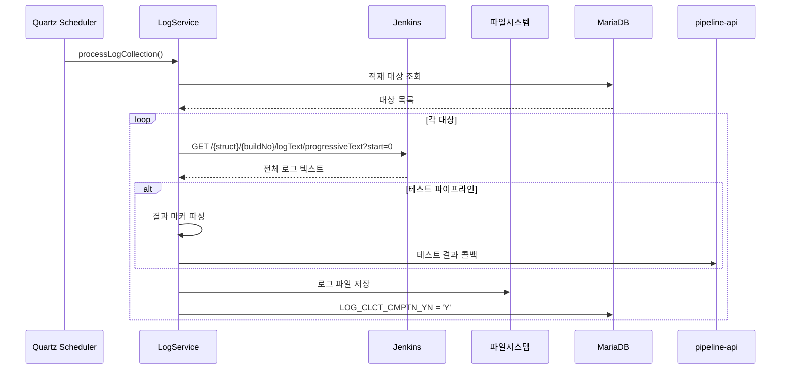

# 젠킨스 API 로그 조회 현대화

> **본 문서는 spec(`01-06.md`)을 읽었다고 가정한 현대화 판단과 TPS 적재 패턴**이다. wfapi/`progressiveText`/Blue Ocean 같은 endpoint 자체의 호출 형식은 spec에 있다. 이 문서는 그 위에서 "최근 Jenkins에서 무엇이 달라졌는지"와 "TPS의 ppln-logging-api가 그 API를 어떻게 조합하는지"를 정리한다.
>
> wfapi endpoint 세부 스펙은 `01-06b.md` 참조.

## 1. 로그 인코딩 UTF-8 표준화 (2.462+)

Jenkins 2.462 이전에는 콘솔 로그 인코딩이 시스템 기본 인코딩에 의존했다. Linux는 대부분 UTF-8이지만 Windows·일부 컨테이너 환경에서는 한글이 깨질 수 있었다. 2.462부터는 `consoleText`, `progressiveText`, Blue Ocean `/log`까지 UTF-8로 표준화된다.

| API | 2.462 이전 | 2.462+ |
|------|-----------|--------|
| `consoleText` / `progressiveText` | 시스템 인코딩 | UTF-8 보장 |
| Blue Ocean `/log` | 시스템 인코딩 | UTF-8 보장 |

TPS의 `LogHandlerImpl`은 `Files.newBufferedWriter()`로 UTF-8을 명시 저장하므로, 2.462 이후에는 입력·저장 양쪽이 UTF-8로 맞아 인코딩 변환 이슈를 따로 의심할 일이 줄었다.

## 2. Blue Ocean REST API 지원 현황

`01-06`의 nodes → steps → log 드릴다운 흐름은 여전히 유효하다. 다만 "UI 유지보수 모드"를 "REST API 즉시 폐기"로 보면 안 된다 — `/blue/rest/`는 UI와 별개로 일부 시각화·보조 용도에서 살아 있고, 신규 백엔드는 코어 API + `wfapi` 우선이 더 자연스럽다.

| 용도 | Blue Ocean API | 코어/wfapi 대안 | 대체 수준 |
|------|---------------|-----------------|----------|
| 스테이지 상태 | `GET /blue/.../nodes/` | `GET /{struct}/{build}/wfapi/describe` | 대부분 대체 가능 |
| 스테이지 로그 | `GET /blue/.../nodes/{id}/log/` | `GET /{struct}/{build}/execution/node/{id}/wfapi/log` | 대부분 대체 가능 |
| 스텝별 드릴다운 | `GET /blue/.../nodes/{id}/steps/` | 직접 대체 없음 | Blue Ocean 필요 |
| 스텝 로그 | `GET /blue/.../nodes/{id}/steps/{stepId}/log` | 직접 대체 없음 | Blue Ocean 필요 |

stage 레벨까지는 코어 API + wfapi로 대체 가능하지만 step 레벨 상세는 Blue Ocean이 더 풍부하다. TPS의 ppln-logging-api는 경로 A(전체 로그 수집)를 주로 쓰므로 Blue Ocean 의존도가 낮은 편이다. 결론적으로 Blue Ocean은 "완전 제거"보다 "필요 범위만 축소 유지"가 현실적이다.

## 3. POST 콜백의 crumb 영향 범위

로그 조회 API는 대부분 GET이라 crumb이 원래 불필요하다. 인증 모델 변화의 영향이 걸리는 곳은 적재 후속의 **테스트 결과 콜백 POST**다 — `endJunitTest()`, `endAnalysisTest()` 같은 Feign POST 호출이 ID/Password 환경에서는 crumb이 필요하고 API Token 환경에서는 면제될 수 있다. 자세한 인증 모델 비교는 `01-02a.md` 참조.

## 4. 버전별 변경 요약

| 버전/시점 | 변경 | 로그 조회 영향 |
|-----------|------|---------------|
| 2.222 (2020) | API Token crumb 면제 | 로그 GET 무관, 테스트 콜백 POST에서 crumb 부담 감소 |
| Blue Ocean Plugin (2022~) | UI deprecated | `/blue/rest/`는 남았으나 신규 핵심 의존성에서는 부담 |
| 2.462 (2024) | 로그 인코딩 UTF-8 표준화 | 한글 깨짐 위험 감소 |

## 5. TPS 로그 적재 — 상태 갱신과 적재의 분리

TPS는 로그 수집을 실행 중에 잡고 있지 않는다. 상태 추적 계층이 빌드 종료를 확인한 뒤, 적재 계층이 완료된 build의 전체 로그를 한 번에 가져오는 구조다.



| Job | 주기 | Jenkins API | DB 갱신 |
|------|------|-------------|---------|
| `PipelineSyncJob` | 10초 | `wfapi/describe` | `STTS_CD` |
| `LogCollectorV2Job` | 설정값 | `logText/progressiveText?start=0` | `LOG_CLCT_CMPTN_YN` |

## 6. 적재 대상 선택과 흐름

`LogCollectorV2Job`은 종료됐지만 아직 적재되지 않은 내부 파이프라인만 고른다.

```sql
WHERE A.STTS_CD NOT IN ('WAIT', 'RTRCN', 'EXCN', 'SKIP')
  AND A.LOG_CLCT_CMPTN_YN = 'N'
  AND B.INOUT_SE = 'IN'
```



## 7. 파일 저장 구조와 읽기 전략

```text
{pipeline.middleware.jenkins.logPath}/
  └── pipeline/
      └── {taskCd}/{envrnCd}/{bizNm}/
          └── {pplnNo}_{excnHstryNo}_0
```

`LogHandlerImpl`이 UTF-8로 기록하며, 확장자 없이 `{파이프라인번호}_{실행이력번호}_0` 형식이다. 부모 디렉토리는 자동 생성하고 동일 파일은 덮어쓴다. 읽기 전략은 파일 크기에 따라 갈린다.

| 크기 | 방식 | 이유 |
|------|------|------|
| 1MB 미만 | `Files.readString()` | 단순·빠름 |
| 1MB 이상 | `BufferedReader` 스트리밍 | 메모리 절감 |

## 8. 테스트 결과 파싱과 모듈 역할

테스트 파이프라인은 적재 시 추가 후처리가 있다. Jenkins 로그에 다음 마커가 있으면 파싱 후 콜백한다.

```text
##@#UNIT_TEST_RESULT##@#{total}#{success}#{failed}#{failedCheck}##@#
```

| 테스트 유형 | 콜백 | 전달 |
|-------------|------|------|
| 단위 테스트 | `endJunitTest()` | 전체/성공/실패 건수 |
| SonarQube | `endAnalysisTest()` | 분석 완료 상태 |
| 수동 분석 | `endManualAnalysisTest()` | 분석 완료 상태 |

| 클래스/모듈 | 역할 |
|------------|------|
| `LogCollectorV2Job` | Quartz 진입점 |
| `LogService` | 수집 오케스트레이션 |
| `LogWriterImpl` | Jenkins 수집 + 테스트 콜백 |
| `LogHandlerImpl` | 파일시스템 I/O |
| `RealTimeLogHandler` | 실시간 WebSocket 스트리밍 (영구 저장 X) |

`pipeline-api`의 `RealTimeLogHandler`는 실행 중 스트리밍만, 영구 저장은 `ppln-logging-api`가 맡는다. "실시간 표시"와 "종료 후 적재"를 분리해서 운영한다.

## 9. 참고 링크

- `01-06.md` — 로그 조회 API 스펙
- `01-06b.md` — wfapi 상세 스펙
- `01-02a.md` — 인증 모델 변화
- `01-05a.md` — 빌드 상태 추적 패턴
- [Pipeline: REST API Plugin](https://plugins.jenkins.io/pipeline-rest-api/)
