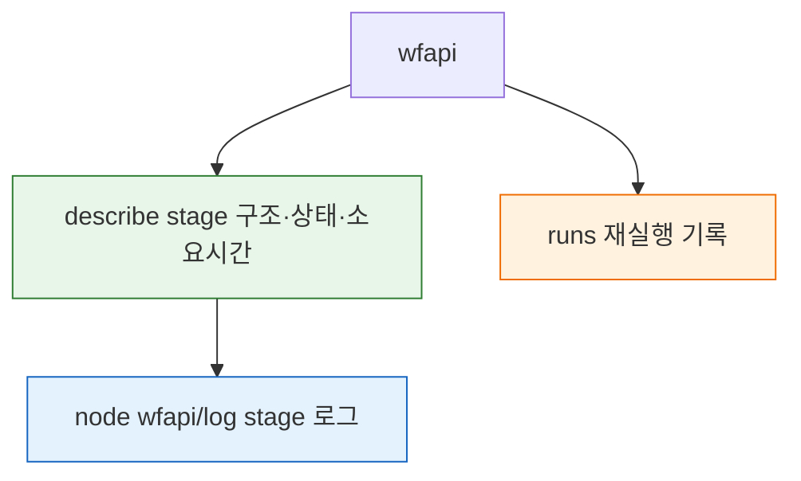
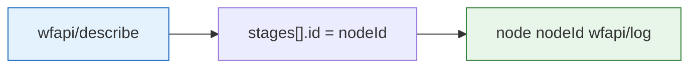

# 젠킨스 wfapi 상세 스펙과 활용
---
> 이 문서는 Jenkins의 `wfapi`를 별도 API 제품처럼 이해할 수 있도록 엔드포인트 집합, 응답 구조, Blue Ocean 대체 범위를 한 번에 정리한 스펙 문서입니다.
>
> - `01-05`와 `01-06`에서 부분적으로 사용한 `wfapi`를 한 문서로 묶어 설명합니다.
> - job 단위, run 단위, node 단위 조회와 `pendingInputActions`, `artifacts`, `wfapi/log`까지 다룹니다.
>
> `wfapi` 로그 범위, `nodeId` 의미, Blue Ocean-like UI/저장 전략 판단은 `01-06c. 젠킨스 wfapi 로그 모델과 Blue Ocean 구현 판단.md`에서 별도로 정리합니다.

## §학습 목표

> 이 문서를 읽고 나면 `wfapi/describe`로 stage 구조·상태를, `wfapi/runs`로 재실행 기록을, stage 로그 경로로 stage 로그를 조회하고, 진행률 계산·실패 stage 식별·병목 분석에 wfapi를 활용하며 그 한계까지 설명할 수 있습니다.

## §사전 지식

> 01-05에서 본 기본 빌드 API와 wfapi의 관계를 알고 있다면, 이 문서는 wfapi 엔드포인트 집합의 상세 스펙과 실전 활용으로 파고든 편입니다.

## 1. 이 문서의 범위

> 이 문서는 Jenkins Pipeline REST API Plugin이 제공하는 `wfapi` 엔드포인트만 별도로 정리합니다.

| 메서드 | 경로 | 목적 |
|------|------|------|
| GET | `/{pipelineStruct}/wfapi` | Pipeline job 기본 설명 조회 |
| GET | `/{pipelineStruct}/wfapi/runs` | 최근 실행 목록 조회 |
| GET | `/{pipelineStruct}/{buildNumber}/wfapi/describe` | 특정 실행 1건의 전체 상태 조회 |
| GET | `/{pipelineStruct}/{buildNumber}/wfapi/pendingInputActions` | 승인 대기 입력 액션 조회 |
| GET | `/{pipelineStruct}/{buildNumber}/wfapi/artifacts` | archived artifacts 목록 조회 |
| GET | `/{pipelineStruct}/{buildNumber}/execution/node/{nodeId}/wfapi/describe` | 특정 stage/node 상세 조회 |
| GET | `/{pipelineStruct}/{buildNumber}/execution/node/{nodeId}/wfapi/log` | 특정 node 로그 조회 |

이 문서는 다음 문서와 역할이 다릅니다:

- `01-05. 젠킨스 빌드 상태 추적 API 스펙.md`
  - `wfapi/describe`를 상태 추적 시나리오 안에서 설명합니다.
- `01-06. 젠킨스 API 로그 조회와 적재.md`
  - `wfapi/log`를 로그 수집 흐름 안에서 설명합니다.
- `01-06a. 젠킨스 API 로그 조회 현대화.md`
  - Blue Ocean 축소와 `wfapi` 전환 방향을 설명합니다.

즉 이 문서는 "언제 `wfapi`를 쓰는가"보다 "`wfapi` 자체가 어떤 API 묶음인가"를 설명하는 데 집중합니다.

### 1-1. 공통 경로 규칙

`wfapi`는 일반 Jenkins 코어 API의 `/api/json`과 별도 경로 계층입니다.

- 코어 build API: `/{pipelineStruct}/{buildNumber}/api/json`
- Workflow run API: `/{pipelineStruct}/{buildNumber}/wfapi/describe`
- Workflow node API: `/{pipelineStruct}/{buildNumber}/execution/node/{nodeId}/wfapi/describe`

예시는 다음과 같습니다:

```text
/job/SBH/job/API-FAIL/wfapi
/job/SBH/job/API-FAIL/wfapi/runs
/job/SBH/job/API-FAIL/7/wfapi/describe
/job/SBH/job/API-FAIL/7/wfapi/pendingInputActions
/job/SBH/job/API-FAIL/7/execution/node/12/wfapi/describe
/job/SBH/job/API-FAIL/7/execution/node/12/wfapi/log
```

`{pipelineStruct}`와 `{buildNumber}` 확보 방식은 이 시리즈 앞 문서를 그대로 따릅니다.

### 1-2. 공통 요청 규칙

모든 예시는 `01-05`, `01-06`까지의 준비가 끝났다는 전제입니다.

즉 이 문서에서는 다음 값을 다시 자세히 설명하지 않는입니다:

- `JENKINS_URL`
- `JENKINS_USER`
- `JENKINS_PASS`
- `PIPELINE_NORMAL_STRUCT`
- `PIPELINE_FAIL_STRUCT`
- `PIPELINE_APPROVAL_STRUCT`
- `BUILD_NUMBER_NORMAL`
- `BUILD_NUMBER_FAIL`
- `BUILD_NUMBER_APPROVAL`

추가로 이 문서에서 자주 쓰는 값은 다음 정도입니다:

```bash
export NODE_ID_FAILED='12'
export NODE_ID_BUILD='5'
```

`curl` 예시는 모두 GET 조회이므로 crumb 없이 Basic Auth만 사용합니다:

```bash
curl -k -sS -u "${JENKINS_USER}:${JENKINS_PASS}" \
  "<wfapi URL>"
```

### 1-3. 이 문서를 읽는 순서

처음부터 모든 endpoint를 다 외울 필요는 없습니다. 보통은 아래 순서로 이해하면 됩니다:

1. `/{pipelineStruct}/wfapi`로 job 단위 루트와 `_links`를 확인합니다.
2. `/{pipelineStruct}/wfapi/runs`로 최근 실행 목록과 stage 요약을 봅니다.
3. `/{pipelineStruct}/{buildNumber}/wfapi/describe`로 특정 run의 전체 상태를 봅니다.
4. `stages[].id`를 뽑아 `execution/node/{nodeId}/wfapi/describe`로 stage 내부를 봅니다.
5. 마지막으로 `execution/node/{nodeId}/wfapi/log`로 node 로그를 읽습니다.


wfapi가 제공하는 엔드포인트가 무엇을 주는지 그림으로 보면 다음과 같습니다:



## 2. `wfapi`가 무엇인가

> `wfapi`는 Blue Ocean API도 아니고, Jenkins 코어 `/api/json`도 아닙니다. Pipeline용 보조 REST 계층으로 보는 편이 정확하입니다.

2026년 4월 24일 기준 Jenkins 공식 플러그인 문서에서 `wfapi`는 `Pipeline: REST API` Plugin이 제공하는 endpoint 집합으로 소개됩니다. 이 플러그인은 당시 버전 `2.41`, 최소 Jenkins `2.479.1`을 요구합니다.

핵심 비교는 다음과 같습니다:

| 구분 | 코어 Build API | `wfapi` | Blue Ocean REST API |
|------|------|------|------|
| 대표 경로 | `/{build}/api/json` | `/{build}/wfapi/describe` | `/blue/rest/.../runs/{build}` |
| 강점 | `building`, `result`, 기본 메타데이터 | stage 구조, 승인 대기, node drill-down | step 단위 드릴다운, Blue Ocean UI 연계 |
| 로그 단위 | 전체 콘솔 로그 중심 | node 로그 | node 로그 + step 로그 |
| 의존 플러그인 | Jenkins 코어 | `pipeline-rest-api` | Blue Ocean |

실무에서 중요한 점은 다음과 같습니다:

- `wfapi`는 Blue Ocean이 없어도 별도로 동작할 수 있습니다.
- Blue Ocean을 줄이더라도 `wfapi`까지 같이 없애는 것은 아닙니다.
- stage 상태 추적과 node 로그 조회는 `wfapi`로 상당 부분 대체 가능합니다.

### 2-1. 플러그인 존재 여부 확인

`wfapi`는 Jenkins 코어 API가 아니라 플러그인 제공 기능이므로, 실제 컨트롤러에 설치됐는지 먼저 확인하는 편이 안전합니다.

```bash
curl -k -sS -u "${JENKINS_USER}:${JENKINS_PASS}" \
  "${JENKINS_URL}/pluginManager/api/json?depth=1&tree=plugins[shortName,displayName,version,active,enabled]" \
  | jq '.plugins[] | select(.shortName == "pipeline-rest-api" or .shortName == "blueocean")'
```

출력 해석은 다음과 같습니다:

| `shortName` | 의미 |
|------|------|
| `pipeline-rest-api` | `wfapi` endpoint 제공 플러그인 |
| `blueocean` | Blue Ocean UI/REST 제공 플러그인 |

즉 `blueocean`이 없어도 `pipeline-rest-api`만 있으면 `wfapi`는 계속 쓸 수 있습니다.

### 2-2. HAL 스타일 `_links`

`wfapi` 응답의 특징은 `_links`다. 공식 문서는 이 API가 HAL 스타일 hyperlink 구조를 따른다고 설명합니다.

즉 클라이언트가 모든 하위 URL을 문자열 조합으로 만들기보다, 응답의 `_links`를 따라가며 다음 리소스로 이동할 수 있습니다.

예를 들면:

- run 응답의 `_links.pendingInputActions`
- run 응답의 `_links.artifacts`
- node 응답의 `stageFlowNodes[]._links.log`

실무에서는 문자열 조합도 자주 하지만, 응답에 있는 링크를 신뢰하면 플러그인 구현 차이에 덜 민감해진입니다.


describe에서 stage 로그까지 도달하는 경로를 그림으로 보면 다음과 같습니다:



## 3. Job 단위 `wfapi`

> job 단위 endpoint는 build 번호를 모를 때 진입점 역할을 합니다.

### 3-1. `GET /{pipelineStruct}/wfapi`

이 endpoint는 특정 Pipeline job 자체를 설명합니다.

```bash
curl -k -sS -u "${JENKINS_USER}:${JENKINS_PASS}" \
  "${JENKINS_URL}${PIPELINE_FAIL_STRUCT}/wfapi" \
  | jq
```

대표 응답 구조는 다음과 같습니다:

```json
{
  "_links": {
    "self": {
      "href": "/job/SBH/job/API-FAIL/wfapi/describe"
    },
    "runs": {
      "href": "/job/SBH/job/API-FAIL/wfapi/runs"
    }
  },
  "name": "API-FAIL",
  "runCount": 7
}
```

필드 해석은 다음과 같습니다:

| 필드 | 의미 |
|------|------|
| `_links.self.href` | job 설명 URL |
| `_links.runs.href` | 실행 목록 URL |
| `name` | Pipeline job 이름 |
| `runCount` | 누적 실행 수 |

이 endpoint의 역할은 단순합니다:

- "이 job에 `wfapi`가 붙어 있는가" 확인
- 실행 목록으로 이동할 링크 확보
- UI 이름과 실행 수를 빠르게 확인

### 3-2. `GET /{pipelineStruct}/wfapi/runs`

이 endpoint는 run 목록을 배열로 반환합니다.

```bash
curl -k -sS -u "${JENKINS_USER}:${JENKINS_PASS}" \
  "${JENKINS_URL}${PIPELINE_FAIL_STRUCT}/wfapi/runs" \
  | jq '.[0:5] | map({
      name,
      id,
      status,
      startTimeMillis,
      endTimeMillis,
      stages: [.stages[] | {id, name, status}]
    })'
```

실무적으로 중요한 점은 run 배열의 각 원소가 이미 stage 요약을 포함한다는 것입니다. 즉 "최근 실행 여러 건의 stage 상태를 훑어보기"에는 `runs`가 꽤 효율적입니다.

주요 필드는 다음과 같습니다:

| 필드 | 의미 |
|------|------|
| `id` | 실행 식별 문자열 |
| `name` | 보통 `#7` 같은 빌드 표시 이름 |
| `status` | run 단위 상태 |
| `startTimeMillis` | 시작 시각 |
| `endTimeMillis` | 종료 시각 |
| `durationMillis` | 총 소요 시간 |
| `stages[]` | 각 stage의 요약 정보 |

또한 run 원소의 `_links`는 추가 drill-down 힌트를 줍니다:

- `_links.self.href`
  - 해당 run의 `wfapi/describe`
- `_links.pendingInputActions.href`
  - 승인 대기 run일 때 존재할 수 있습니다
- `_links.artifacts.href`
  - archived artifact가 있을 때 존재할 수 있습니다


## 4. Run 단위 `wfapi`

> 실무에서 가장 많이 쓰는 핵심 endpoint는 결국 `/{buildNumber}/wfapi/describe`다.

### 4-1. `GET /{pipelineStruct}/{buildNumber}/wfapi/describe`

이 endpoint는 특정 실행 1건의 전체 상태를 반환합니다.

```bash
curl -k -sS -u "${JENKINS_USER}:${JENKINS_PASS}" \
  "${JENKINS_URL}${PIPELINE_FAIL_STRUCT}/${BUILD_NUMBER_FAIL}/wfapi/describe" \
  | jq '{
      name,
      status,
      startTimeMillis,
      endTimeMillis,
      durationMillis,
      stages: [.stages[] | {id, name, status, durationMillis}]
    }'
```

대표적으로 읽는 필드는 다음과 같습니다:

| 필드 | 의미 | 실무 해석 |
|------|------|------|
| `name` | 보통 `#빌드번호` | 운영 화면 표시용 |
| `status` | run 상태 | 성공/실패/진행 중/승인 대기 판단 |
| `startTimeMillis` | 시작 시각 | 실행 시작 시점 |
| `endTimeMillis` | 종료 시각 | 종료된 경우 완료 시점 |
| `durationMillis` | 총 소요 시간 | SLA, 실행 시간 계산 |
| `stages[]` | stage 배열 | 실패 stage 식별의 핵심 |

`stages[]` 각 원소에서 바로 읽는 값은 다음과 같습니다:

| 필드 | 의미 |
|------|------|
| `id` | 이후 node 조회에 쓰는 `nodeId` |
| `name` | stage 이름 |
| `status` | 해당 stage 상태 |
| `startTimeMillis` | stage 시작 시각 |
| `durationMillis` | stage 소요 시간 |
| `_links.self.href` | node 상세 조회 링크 |

이 endpoint 하나로 보통 다음 질문에 답할 수 있습니다:

- 현재 pipeline이 아직 실행 중인가
- 어느 stage에서 실패했는가
- 승인 대기 상태인가
- stage별 소요 시간은 어느 정도인가

### 4-2. 구조 깊이: `stages[]` 아래로 어디까지 내려가는가

`wfapi/describe`의 `stages[]`가 끝이 아닙니다. 각 stage는 다시 node 상세 조회로 내려갈 수 있습니다.

구조를 단순화하면 다음과 같습니다:

```text
run
  -> stages[]
    -> execution/node/{nodeId}/wfapi/describe
      -> stageFlowNodes[]
        -> execution/node/{flowNodeId}/wfapi/log
```

즉 `wfapi`는 보통 다음 두 단계까지 본다고 이해하면 됩니다:

| 레벨 | 어디서 보나 | 의미 |
|------|------|------|
| run | `/{build}/wfapi/describe` | 파이프라인 전체 상태와 stage 목록 |
| stage | `stages[]` | 상위 stage 단위 |
| flow node | `execution/node/{nodeId}/wfapi/describe.stageFlowNodes[]` | stage 내부의 더 작은 실행 단위 |

실제 공식 예시에서도 stage 하나 아래에 `Git`, `Shell Script` 같은 하위 node가 들어갑니다.

다만 공식 `wfapi` 문서 기준으로는 여기서 한계가 있습니다:

- `stageFlowNodes[]` 아래를 `stepId` 같은 별도 REST 자원으로 더 쪼개는 endpoint는 문서화되어 있지 않입니다.
- 즉 Blue Ocean의 `nodes/{id}/steps/{stepId}/log`와 같은 step 전용 drill-down은 `wfapi`의 표준 endpoint 집합에 없습니다.

그래서 판단은 다음처럼 하는 편이 정확하입니다:

- stage와 stage 내부 flow node 수준까지는 `wfapi`
- step 전용 API까지는 Blue Ocean 쪽이 더 세밀함

### 4-3. run 상태값 해석

실습과 기존 시리즈 문서 기준으로 자주 보는 상태는 다음과 같습니다:

| 상태 | 의미 |
|------|------|
| `IN_PROGRESS` | 현재 실행 중 |
| `SUCCESS` | 정상 완료 |
| `FAILED` | 실패 완료 |
| `ABORTED` | 사용자 중단 또는 강제 종료 |
| `PAUSED_PENDING_INPUT` | `input` 스텝 승인 대기 |
| `NOT_EXECUTED` | 조건 미충족이나 선행 실패로 실행되지 않음 |

중요한 점은 코어 API의 `result`와 `wfapi`의 `status`가 완전히 같은 층위가 아니라는 것입니다.

- 코어 `result`
  - build 전체 최종 결과에 가깝습니다.
- `wfapi status`
  - run 진행 상태와 stage 상태를 더 세밀하게 보여줍니다.

### 4-4. `GET /{pipelineStruct}/{buildNumber}/wfapi/pendingInputActions`

이 endpoint는 승인 대기 중인 `input` 액션을 반환합니다.

```bash
curl -k -sS -u "${JENKINS_USER}:${JENKINS_PASS}" \
  "${JENKINS_URL}${PIPELINE_APPROVAL_STRUCT}/${BUILD_NUMBER_APPROVAL}/wfapi/pendingInputActions" \
  | jq
```

응답은 보통 다음 필드를 포함합니다:

| 필드 | 의미 |
|------|------|
| `id` | input 액션 식별자 |
| `message` | 승인 메시지 |
| `proceedUrl` | 승인 진행 URL |
| `abortUrl` | 거절 URL |

이 endpoint는 아무 때나 무조건 쓰는 것이 아니라, 보통 `wfapi/describe.status == "PAUSED_PENDING_INPUT"`일 때만 이어서 호출합니다.

즉 권장 패턴은 다음과 같습니다:

1. 먼저 `wfapi/describe`를 조회합니다.
2. `status`가 `PAUSED_PENDING_INPUT`인지 확인합니다.
3. 맞으면 `pendingInputActions`를 호출해 `proceedUrl`과 `abortUrl`을 얻는입니다.

### 4-5. `GET /{pipelineStruct}/{buildNumber}/wfapi/artifacts`

이 endpoint는 archived artifacts를 반환합니다.

```bash
curl -k -sS -u "${JENKINS_USER}:${JENKINS_PASS}" \
  "${JENKINS_URL}${PIPELINE_NORMAL_STRUCT}/${BUILD_NUMBER_NORMAL}/wfapi/artifacts" \
  | jq
```

응답 필드는 다음과 같습니다:

| 필드 | 의미 |
|------|------|
| `id` | artifact 식별자 |
| `name` | 파일명 |
| `path` | artifact 내부 경로 |
| `url` | 다운로드 URL |
| `size` | 바이트 크기 |

이 endpoint는 모든 run에서 항상 의미가 있는 것은 아닙니다.

- artifact를 아카이브하지 않은 run
  - 링크 자체가 없거나 빈 결과일 수 있습니다.
- artifact를 저장한 run
  - `_links.artifacts`를 따라가면 됩니다.


## 5. Node 단위 `wfapi`

> run 단위 `stages[]`가 stage 지도라면, node 단위 endpoint는 그 stage 안을 더 파고드는 상세 지도입니다.

### 5-1. `GET /{pipelineStruct}/{buildNumber}/execution/node/{nodeId}/wfapi/describe`

이 endpoint는 특정 stage/node의 상세 구조를 보여줍니다.

먼저 run-level `stages[]`에서 `id`를 하나 뽑는입니다:

```bash
export NODE_ID_FAILED=$(curl -k -sS -u "${JENKINS_USER}:${JENKINS_PASS}" \
  "${JENKINS_URL}${PIPELINE_FAIL_STRUCT}/${BUILD_NUMBER_FAIL}/wfapi/describe" \
  | jq -r '.stages[] | select(.status == "FAILED") | .id' | head -n 1)

echo "$NODE_ID_FAILED"
```

그 다음 node 상세를 봅니다:

```bash
curl -k -sS -u "${JENKINS_USER}:${JENKINS_PASS}" \
  "${JENKINS_URL}${PIPELINE_FAIL_STRUCT}/${BUILD_NUMBER_FAIL}/execution/node/${NODE_ID_FAILED}/wfapi/describe" \
  | jq '{
      id,
      name,
      status,
      durationMillis,
      stageFlowNodes: [.stageFlowNodes[] | {
        id,
        name,
        status,
        parentNodes,
        error
      }]
    }'
```

핵심 필드는 다음과 같습니다:

| 필드 | 의미 |
|------|------|
| `id` | 현재 stage/node ID |
| `name` | stage 또는 node 이름 |
| `status` | 현재 stage/node 상태 |
| `durationMillis` | 소요 시간 |
| `stageFlowNodes[]` | 이 stage 내부에서 실제 실행된 flow node 목록 |

`stageFlowNodes[]`에서 중요하게 보는 값은 다음과 같습니다:

| 필드 | 의미 |
|------|------|
| `id` | 하위 flow node ID |
| `name` | `Git`, `Shell Script` 같은 실제 실행 단위 |
| `status` | 하위 node 상태 |
| `parentNodes[]` | 이전 node와의 연결 관계 |
| `error.message` | 실패 원인 메시지 |
| `_links.log.href` | 해당 node 로그 링크 |

즉 stage 하나가 실패했을 때는 보통 다음 순서로 봅니다:

1. run-level `stages[]`에서 실패 stage의 `id`를 찾는입니다.
2. node-level `wfapi/describe`로 들어갑니다.
3. `stageFlowNodes[]`에서 실제 실패한 하위 node와 `error.message`를 찾는입니다.

### 5-2. `GET /{pipelineStruct}/{buildNumber}/execution/node/{nodeId}/wfapi/log`

이 endpoint는 특정 node의 로그를 JSON으로 반환합니다.

```bash
curl -k -sS -u "${JENKINS_USER}:${JENKINS_PASS}" \
  "${JENKINS_URL}${PIPELINE_FAIL_STRUCT}/${BUILD_NUMBER_FAIL}/execution/node/${NODE_ID_FAILED}/wfapi/log" \
  | jq
```

대표 응답 필드는 다음과 같습니다:

| 필드 | 의미 |
|------|------|
| `nodeId` | 로그 대상 node ID |
| `nodeStatus` | 해당 node 상태 |
| `length` | 현재 로그 길이 |
| `hasMore` | 로그가 더 남아 있는지 여부 |
| `text` | 실제 로그 본문 |
| `consoleUrl` | classic UI 로그 URL |

이 endpoint가 무엇을 주고 무엇을 주지 않는지는 범위로 이해하는 편이 쉽습니다:

| API | 범위 | 용도 |
|------|------|------|
| `consoleText` | build 전체 로그 | 전체 원문 저장, 완료 후 아카이브 |
| `progressiveText` | build 전체 증분 로그 | 실행 중 tail |
| `wfapi/log` | 특정 node 로그 | 실패 지점 축소, stage 내부 문제 확인 |

즉 `wfapi/log`는 build 전체 로그를 대체하지 않는입니다. 특정 stage 또는 flow node에 매달린 로그를 잘라서 보는 API입니다.

또한 `wfapi/log`는 Blue Ocean step 로그와도 다릅니다:

- `wfapi/log`
  - `execution/node/{nodeId}` 기준
- Blue Ocean step log
  - `steps/{stepId}` 기준

따라서 실패 지점을 좁히는 용도에는 `wfapi/log`가 더 적합하입니다.

### 5-3. `hasMore`와 로그 수집 판단

`wfapi/log` 응답의 `hasMore`는 이 node 로그가 아직 더 이어질 수 있는지를 보여줍니다.

실무적으로는 다음처럼 해석하면 됩니다:

| 값 | 의미 |
|------|------|
| `true` | 아직 node 실행 중이거나 로그가 더 남았다 |
| `false` | 현재 시점 기준 로그가 끝까지 내려왔다 |

다만 build 전체 실시간 tail은 여전히 `progressiveText`가 더 자연스럽습니다. `wfapi/log`는 "어느 node가 문제였는지"를 좁히는 데 더 적합하입니다.

### 5-4. `stageFlowNodes[]`별 로그로 더 쪼개 보기

`wfapi`에서 `stages[]`보다 더 세부적으로 로그를 보고 싶다면, stage 자체의 `nodeId`만 보지 말고 `stageFlowNodes[]`의 각 `id`를 다시 로그 대상으로 삼으면 됩니다.

흐름은 다음과 같습니다:

1. `/{build}/wfapi/describe`에서 실패 stage의 `id`를 찾는입니다.
2. `execution/node/{stageId}/wfapi/describe`로 들어갑니다.
3. `stageFlowNodes[]`에서 하위 `id`와 `_links.log.href`를 확인합니다.
4. 그 하위 `id`로 `execution/node/{flowNodeId}/wfapi/log`를 호출합니다.

즉 `wfapi`도 stage보다 더 세부적으로 내려갈 수는 있습니다. 다만 그 최소 단위는 보통 `flow node` 수준이며, 공식 문서 기준으로 Blue Ocean처럼 step 자원을 별도 계층으로 노출하지는 않는입니다.


## 6. Blue Ocean과의 대응 관계

> `wfapi`는 Blue Ocean을 많이 대체하지만, step 단위까지 완전히 치환하지는 못합니다.

2026년 4월 24일 기준 Jenkins 공식 Blue Ocean 문서는 Blue Ocean이 2026년 7월 deprecated 예정이라고 안내합니다. 플러그인 페이지도 기능 추가 없이 선택적 보안/결함 수정만 제공한다고 설명합니다.

그래서 현재 기준의 대응 관계를 정리하면 다음과 같습니다:

| 보고 싶은 것 | Blue Ocean API | `wfapi` 대안 | 판단 |
|------|------|------|------|
| 최근 실행 목록 | `/blue/rest/.../runs/` | `/{pipelineStruct}/wfapi/runs` | 대부분 대체 가능 |
| pipeline 전체 상태 | `/blue/rest/.../runs/{build}` | `/{build}/wfapi/describe` | 대부분 대체 가능 |
| stage 목록/상태 | `/blue/rest/.../nodes/` | `/{build}/wfapi/describe.stages[]` | 대부분 대체 가능 |
| stage 내부 node 구조 | `/blue/rest/.../nodes/{id}` 계열 | `execution/node/{id}/wfapi/describe` | 상당 부분 대체 가능 |
| stage/node 로그 | `/blue/rest/.../nodes/{id}/log` | `execution/node/{id}/wfapi/log` | 대부분 대체 가능 |
| step 목록 | `/blue/rest/.../nodes/{id}/steps/` | 직접 대체 없음 | Blue Ocean 쪽이 더 풍부 |
| step 로그 | `/blue/rest/.../steps/{stepId}/log` | 직접 대체 없음 | Blue Ocean 필요 |

즉 현재 판단은 이렇게 정리하는 편이 맞습니다:

- stage 상태, 승인 대기, node 로그는 `wfapi` 우선
- step 단위 드릴다운은 Blue Ocean 유지
- 전체 콘솔 원문 수집은 `consoleText` 또는 `progressiveText` 유지


## 7. 권장 활용 패턴

> 실제 운영에서는 `wfapi` 하나만 쓰기보다 코어 API와 조합하는 편이 가장 안정적입니다.

가장 실용적인 조합은 다음과 같습니다:

1. 빌드 실행 직후에는 `queue/api/json`으로 `buildNumber`를 확보합니다.
2. 실행 여부와 최종 결과는 `/{buildNumber}/api/json`으로 봅니다.
3. stage 상태와 승인 대기는 `/{buildNumber}/wfapi/describe`로 봅니다.
4. 실패한 stage의 `id`를 얻어 `execution/node/{nodeId}/wfapi/describe`로 들어갑니다.
5. 해당 node 로그는 `execution/node/{nodeId}/wfapi/log`로 읽습니다.
6. step 수준까지 더 쪼개야 하면 그때만 Blue Ocean API를 호출합니다.

이 흐름을 짧게 쓰면 다음과 같습니다:

```text
queue -> build api -> wfapi/describe -> node/wfapi/describe -> node/wfapi/log -> 필요 시 blue/rest step
```

즉 `wfapi`는 Blue Ocean의 완전한 대체물이 아니라, "대부분의 백엔드 상태 추적과 로그 축소 조회를 담당하는 중간 계층"으로 이해하면 가장 실무적입니다.


## 면접 질문

> 답을 떠올린 뒤 §정답 절에서 같은 번호로 대조하세요.

1. `wfapi/describe`의 `stages[].id`는 어디에 다시 쓰이나요?
2. wfapi로 진행률을 계산하려면 어떤 stage 상태를 세나요?
3. wfapi의 한계 두 가지와, step 단위가 필요할 때의 대안은?

## 정답

> 위 질문을 스스로 설명해 본 뒤에 펼치세요.

### 정답 1 — stages[].id = nodeId

`stages[].id`는 FlowNode의 ID이며, stage 로그 조회 경로의 `nodeId`로 그대로 씁니다. 즉 describe로 구조를 받고, 그 id로 해당 stage 로그에 진입합니다.

### 정답 2 — 진행률 계산

전체 stage 수 대비 `status == "SUCCESS"`인 stage 수의 비율로 진행률을 계산하고, `status == "IN_PROGRESS"`인 stage 이름으로 현재 단계를 표시합니다.

### 정답 3 — wfapi 한계와 대안

① Pipeline 전용이라 Freestyle Job에는 stage 개념이 없고, ② `Pipeline: REST API Plugin` 설치가 필요하며 step 단위 정보가 제한적입니다. step 단위 로그가 필요하면 Blue Ocean API가 더 정밀합니다.

## 8. 관련 문서

- `01-05. 젠킨스 빌드 상태 추적 API 스펙.md` — run 상태 추적 시나리오 안에서 `wfapi/describe`를 사용합니다.
- `01-05b. 젠킨스 상태 추적 API 현대화와 Blue Ocean 해석.md` — Blue Ocean 축소와 `wfapi` 중심 전환 배경을 설명합니다.
- `01-06. 젠킨스 API 로그 조회와 적재.md` — `wfapi/log`와 전체 로그 적재를 함께 봅니다.
- `01-06a. 젠킨스 API 로그 조회 현대화.md` — Blue Ocean 로그 API를 줄이고 `wfapi`로 넘어가는 현재 판단을 정리합니다.
- `01-06c. 젠킨스 wfapi 로그 모델과 Blue Ocean 구현 판단.md` — `wfapi` 로그 범위, `nodeId`, UI 구현과 저장 전략을 FAQ처럼 정리합니다.
- [Pipeline: REST API Plugin](https://plugins.jenkins.io/pipeline-rest-api/) — `wfapi` 공식 endpoint 목록과 샘플 응답.
- [Blue Ocean Getting Started](https://www.jenkins.io/doc/book/blueocean/getting-started/) — 2026년 7월 deprecated 예정 안내.
- [Blue Ocean Plugin](https://plugins.jenkins.io/blueocean) — 기능 업데이트 중단과 대체 UI 안내.
