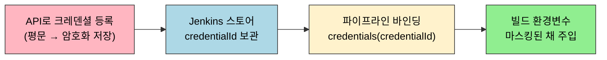
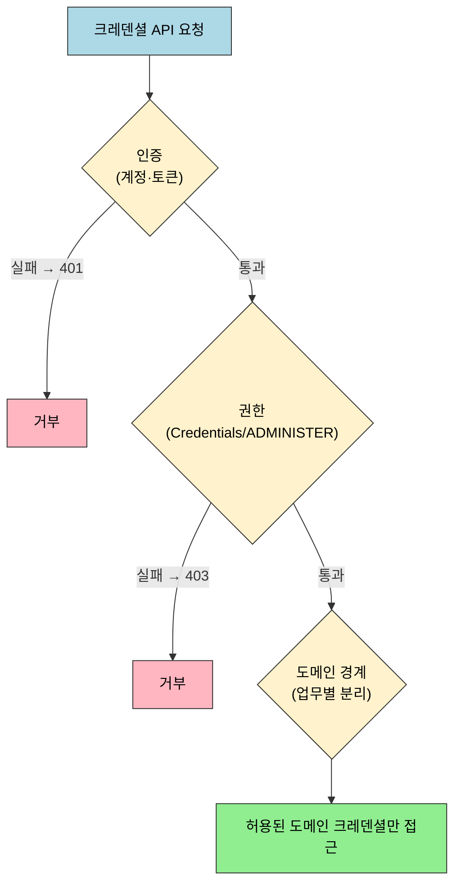

# 젠킨스 API 크레덴셜 관리 현대화 (2.222+)

> **본 문서는 spec(`01-07.md`)을 읽었다고 가정한 운영 해석과 TPS 패턴**입니다. 도메인/크레덴셜 CRUD endpoint와 요청 형식은 spec에 있습니다. 이 문서는 그 위에서 권한 모델, 도메인 분리, upsert 전략, 응답 해석, Provider API 위치를 정리합니다.

## §학습 목표

> 이 문서를 읽고 나면 API Token 환경에서 `403`을 권한 문제로 더 분명히 해석하고, `taskCd → domainName` 도메인 분리의 운영 이점을 설명하며, `updateSubmit` 직접 수정과 삭제-후-재생성 upsert 중 언제 무엇을 택할지 판단할 수 있습니다.

## §사전 지식

> spec(`01-07`)의 도메인·크레덴셜 CRUD 경로와 요청 형식, `01-02a`의 인증 모델 변화(crumb/cookie → API Token)를 먼저 알고 있으면 이 문서의 운영 해석이 자연스럽게 이어집니다.

## 1. POST 인증 단순화

`01-07`의 생성·수정·삭제 예시는 ID/Password + crumb + cookie 전제입니다. API Token 환경(2.222+)에서는 crumb·cookie 부담이 사라져 `403`이 crumb 문제인지 권한 문제인지 혼동하지 않게 된다 — `403`은 더 직접 권한 문제로 해석할 수 있습니다. 인증 모델 차이의 자세한 배경과 코드 영향은 `01-02a.md` 참조.

크레덴셜 API 경로 자체는 그대로이고, 달라지는 것은 호출 전에 준비해야 하는 인증 컨텍스트입니다.

크레덴셜을 한 번 등록해 두면, 이후 빌드는 원문을 다루지 않고 바인딩을 통해 값을 받습니다.

등록(쓰기)과 사용(바인딩)이 분리돼 있어, 빌드 코드에는 `credentialId`만 노출되고 원문은 끝까지 드러나지 않습니다.

## 2. 권한 모델 강화

Credentials Plugin은 최근 버전으로 오면서 `/manage/credentials/` 와 `/credentials/store/...` 아래의 권한 해석이 더 엄격해졌습니다. 예전에는 일부 읽기 API가 비교적 느슨하게 보일 수 있었지만, 현재는 읽기 작업도 별도 권한을 더 분명히 요구하는 편으로 이해하는 것이 안전합니다.

운영상 해석은 다음과 같습니다:

| 상황 | 먼저 의심할 것 | 이유 |
|------|------|------|
| `401` | 인증 정보 자체 | 사용자명, 비밀번호, 토큰 오류 가능성 |
| `403` | Credentials 또는 ADMINISTER 권한 | crumb보다 권한 모델 문제일 수 있음 |
| 도메인 목록 조회만 실패 | 읽기 권한 범위 | 쓰기만 아니라 읽기에도 권한이 걸릴 수 있음 |

TPS나 자동화 계정이 크레덴셜 API를 계속 써야 한다면, 최소한 다음을 확인하는 편이 안전합니다:

- Jenkins 계정이 실제로 Credentials 관련 권한을 가지고 있는지
- 도메인 목록 조회와 단건 조회가 모두 가능한지
- 운영 서버와 개발 서버의 권한 정책이 같은지

크레덴셜 접근은 한 겹이 아니라 인증·권한·도메인 경계가 차례로 막아 줍니다.

`401`은 첫 번째 방어선(인증)에서, `403`은 두 번째 방어선(권한)에서 걸립니다. 도메인 분리는 통과한 뒤에도 접근 범위를 업무 경계로 좁히는 세 번째 겹입니다.

## 3. 도메인 분리와 프로젝트 경계

Jenkins는 기본 도메인 `_` 하나만 써도 동작합니다. 하지만 프로젝트 운영 관점에서는 업무별 도메인을 나누는 편이 훨씬 해석이 쉽습니다.

도메인 분리의 장점은 다음과 같습니다:

- 어떤 업무가 어떤 크레덴셜을 쓰는지 경계가 분명해집니다.
- 목록 조회 결과가 짧아져서 운영 확인이 쉬워집니다.
- 잘못된 삭제나 덮어쓰기 범위를 줄이기 쉽습니다.

특히 TPS처럼 `taskCd` 개념이 이미 있으면, `taskCd -> domainName` 으로 그대로 맵핑하는 방식이 자연스럽습니다. 즉 `_` 도메인을 기술적으로 못 쓰는 것이 아니라, 프로젝트가 경계를 더 잘 관리하려고 별도 도메인을 택하는 것입니다.

## 4. `updateSubmit`와 upsert 패턴

Jenkins Credentials API에는 `updateSubmit`가 존재합니다. 따라서 "수정 API가 없다"는 해석은 맞지 않습니다. 다만 프로젝트 코드에서 항상 `updateSubmit`을 바로 쓰는 것이 최선인지는 별개 문제입니다.

비교하면 다음과 같습니다:

| 방식 | 흐름 | 장점 | 주의점 |
|------|------|------|------|
| 직접 수정 | 조회 -> `updateSubmit` | 호출 수가 적다 | 타입 변경 분기 처리가 필요할 수 있음 |
| upsert | 조회 -> 있으면 삭제 -> 생성 | 타입이 달라도 같은 로직으로 맞추기 쉽다 | 삭제/생성 두 단계를 관리해야 함 |

TPS가 삭제 후 재생성 패턴을 택하는 이유는 보통 다음과 같습니다:

- Username/Password를 SSH Key로 바꾸는 식의 타입 변경을 한 흐름으로 처리하고 싶기 때문
- "최종 상태를 원하는 값으로 덮어쓴다"는 관점이 더 단순하기 때문
- 프로젝트 코드에서 타입별 분기를 줄이고 싶기 때문

즉 `updateSubmit`는 API 차원에서는 유효한 수정 경로이고, upsert는 프로젝트 차원의 동기화 전략입니다. 이 둘은 대체 관계라기보다 계층이 다릅니다.

## 5. 응답 해석 주의점

크레덴셜 API는 일반적인 JSON REST API처럼 보이지만, 실제로는 Jenkins UI 폼 제출 성격이 강합니다. 그래서 응답 해석도 일반 JSON API와 조금 다르게 봐야 합니다.

주요 해석 포인트는 다음과 같습니다:

- 생성, 수정, 삭제 POST는 본문보다 헤더와 상태 코드를 먼저 봅니다.
- 단건 조회 JSON이 와도 secret 원문 값은 그대로 기대하지 않는 편이 안전합니다.
- 성공 후 redirect 계열 응답이 나와도 Jenkins UI 흐름상 정상일 수 있습니다.

즉 이 영역은 "깨끗한 REST 자원 모델"보다 "Jenkins UI 액션을 HTTP로 호출한다"는 감각으로 보는 편이 맞습니다.

## 6. Provider API와 REST API의 위치

최근 Credentials Plugin은 Provider API 같은 더 프로그래밍적인 확장 경로도 제공합니다. 하지만 TPS처럼 HTTP 호출 기반 자동화에서는 여전히 `createCredentials`, `updateSubmit`, `doDelete` 같은 기존 경로가 직접 대상입니다.

정리하면 다음과 같습니다:

| 방식 | 주 사용 위치 | TPS 연관성 |
|------|------|------|
| REST/폼 기반 API | 외부 시스템, curl, Feign | 직접 연관 |
| Provider API | Jenkins 내부 확장, Groovy, 플러그인 | 직접 연관 낮음 |

따라서 프로젝트 문서에서는 Provider API를 "존재하는 대안" 정도로만 보고, 실제 운영 스펙은 `01-07`의 HTTP 경로를 기준으로 삼는 편이 맞습니다.

## 7. 언제 어떤 문서를 봐야 하는가

문서 구분은 다음처럼 보면 됩니다:

- `01-02`: 인증 API 자체를 확인할 때
- `01-02a`: 인증 현대화와 crumb 해석을 볼 때
- `01-07`: 도메인/크레덴셜 CRUD 경로와 요청 형식을 확인할 때
- `01-07a`: 도메인 분리 이유, upsert 전략, 권한 모델, 현대 Jenkins 해석을 볼 때

## 면접 질문

> 답을 떠올린 뒤 §정답 절에서 같은 번호로 대조하세요.

1. API Token 환경(2.222+)으로 오면 `403`을 해석하기가 왜 더 쉬워질까요? crumb 환경과 무엇이 달라지나요?
2. Jenkins에는 `updateSubmit`라는 수정 API가 분명히 있는데, TPS는 왜 삭제 후 재생성(upsert) 패턴을 택할까요?
3. 크레덴셜 API 응답을 일반 REST JSON처럼 다루면 안 되는 이유는 무엇인가요?

## 정답

> 위 질문을 스스로 설명해 본 뒤에 펼치세요.

### 정답 1 — 403 해석이 쉬워지는 이유

crumb + cookie 환경에서는 `403`이 crumb 누락·만료 때문인지 실제 권한 부족인지 섞여 헷갈립니다. API Token 환경에서는 crumb·cookie 부담 자체가 사라지므로, `403`이 나오면 원인을 권한 문제로 더 직접 좁혀 볼 수 있습니다.

### 정답 2 — updateSubmit이 있어도 upsert를 쓰는 이유

`updateSubmit`은 API 차원의 유효한 수정 경로이고, upsert는 프로젝트 차원의 동기화 전략이라 계층이 다릅니다. Username/Password를 SSH Key로 바꾸는 식의 타입 변경까지 한 흐름으로 처리하려면, "최종 상태를 원하는 값으로 덮어쓴다"는 삭제-후-재생성이 타입별 분기를 줄여 줍니다. 호출 수를 아끼는 게 목적이면 직접 `updateSubmit`이 낫습니다.

### 정답 3 — REST가 아니라 UI 폼 액션이라는 감각

크레덴셜 API는 겉보기엔 JSON REST지만 실제로는 Jenkins UI 폼 제출에 가깝습니다. 그래서 생성·수정·삭제 POST는 본문보다 상태 코드·헤더(redirect 포함)를 먼저 보고, 단건 조회 JSON이 와도 secret 원문은 기대하지 않습니다. "깨끗한 자원 모델"보다 "UI 액션을 HTTP로 호출한다"는 감각으로 응답을 읽어야 오해가 없습니다.

## 8. 참고 링크

- `01-07. 젠킨스 API 크레덴셜 관리.md`
- `01-02a. 젠킨스 인증 모델과 TPS 패턴 (2.222+).md`
- [Credentials Plugin Changelog](https://plugins.jenkins.io/credentials/)
