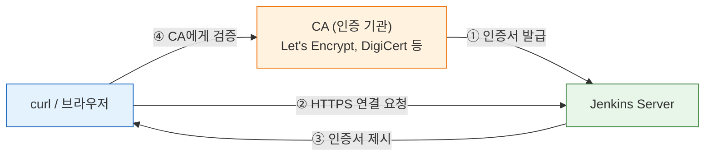
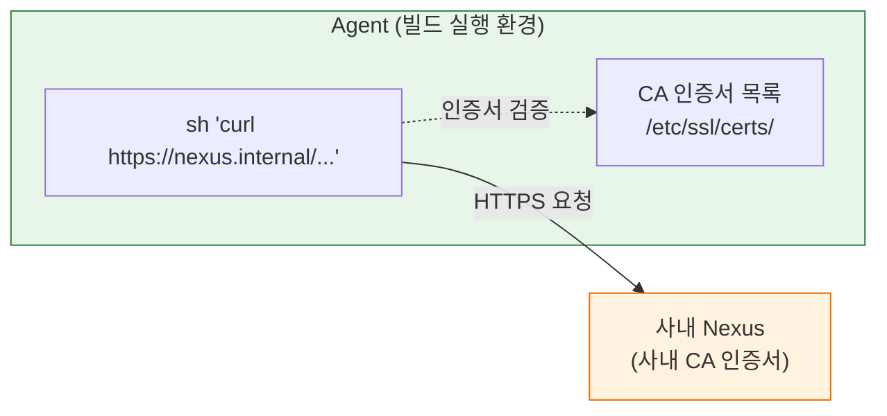
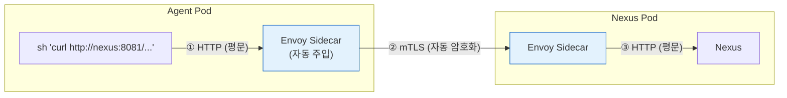

# 젠킨스 SSL 적용과 인증서 관리

---

> Jenkins API를 HTTPS로 호출할 때 만나는 SSL 인증서 문제를 이해하고, 환경별 대응 방법을 정리합니다.
>
> 실습 환경 설정은 `01-00. 젠킨스 API 실습 환경 설정` 참조

## 1. SSL이란 무엇인가

> SSL(Secure Sockets Layer)은 클라이언트와 서버 사이의 통신을 암호화하는 프로토콜입니다. 현재는 TLS(Transport Layer Security)로 대체되었지만, 관례적으로 "SSL"이라 부릅니다.
>
> - HTTP는 평문 통신이므로 중간에서 데이터를 볼 수 있다 (Man-in-the-Middle).
> - HTTPS = HTTP + TLS로, 통신 내용을 암호화하여 도청과 위변조를 방지합니다.

SSL/TLS가 보호하는 것은 세 가지입니다:

- **기밀성**: 통신 내용을 제3자가 볼 수 없습니다. Jenkins API로 크레덴셜을 전송할 때 평문이 네트워크에 노출되지 않는입니다.
- **무결성**: 전송 중 데이터가 변조되지 않았음을 보장합니다.
- **인증**: 접속한 서버가 진짜 해당 서버인지 확인합니다. 인증서가 이 역할을 합니다.

### 인증서의 역할

인증서는 "이 서버가 진짜 이 도메인의 소유자다"라는 것을 제3자(CA, Certificate Authority)가 보증하는 디지털 문서입니다.



- 브라우저/curl은 서버가 제시한 인증서를 **신뢰하는 CA 목록**과 대조합니다.
- CA가 발급한 인증서면 신뢰하고, 그렇지 않으면 "신뢰할 수 없는 인증서" 경고를 띄운입니다.

### 인증서 종류

| 종류 | 발급자 | 비용 | 신뢰 여부 | 적합한 환경 |
|------|--------|------|----------|-----------|
| **공인 인증서** | CA (Let's Encrypt, DigiCert 등) | 무료~유료 | 모든 클라이언트가 신뢰 | 운영 환경, 외부 접근 |
| **자체 서명 인증서** | 직접 생성 | 무료 | 기본적으로 불신뢰 → `-k` 필요 | 개발/테스트, 내부망 |
| **사내 CA 인증서** | 조직 내부 CA | 무료 | 사내 장비만 신뢰 | 엔터프라이즈 내부 |


## 2. Jenkins에서 SSL이 적용되는 위치

> Jenkins 자체가 HTTPS를 직접 처리할 수도 있고, 앞단의 리버스 프록시(Nginx, Ingress)가 SSL을 종료(terminate)할 수도 있습니다.

| 방식 | SSL 처리 위치 | Jenkins 설정 | 적합한 환경 |
|------|-------------|-------------|-----------|
| **Jenkins 직접** | Jenkins JVM (Jetty) | `--httpsPort`, `--httpsKeyStore` | 단독 서버, 간단한 구성 |
| **리버스 프록시** | Nginx / Apache / HAProxy | Jenkins는 HTTP, 프록시가 HTTPS | VM 환경, 멀티 서비스 |
| **K8s Ingress** | Ingress Controller + cert-manager | Jenkins는 HTTP, Ingress가 HTTPS | Kubernetes 환경 |

대부분의 운영 환경에서는 **리버스 프록시 또는 Ingress에서 SSL을 종료**하는 방식을 사용합니다. Jenkins 자체에 인증서를 넣으면 갱신 시 Jenkins를 재시작해야 하기 때문입니다.

### Jenkins 직접 SSL 설정 (JVM)

```bash
# Java KeyStore 생성 (자체 서명 인증서)
keytool -genkeypair \
  -alias jenkins \
  -keyalg RSA -keysize 2048 \
  -validity 365 \
  -keystore /var/lib/jenkins/jenkins.jks \
  -storepass changeit \
  -dname "CN=jenkins.example.com"

# Jenkins 시작 시 옵션
java -jar jenkins.war \
  --httpsPort=8443 \
  --httpsKeyStore=/var/lib/jenkins/jenkins.jks \
  --httpsKeyStorePassword=changeit \
  --httpPort=-1    # HTTP 비활성화
```

### Nginx 리버스 프록시 SSL 설정

```nginx
server {
    listen 443 ssl;
    server_name jenkins.example.com;

    ssl_certificate     /etc/nginx/ssl/jenkins.crt;
    ssl_certificate_key /etc/nginx/ssl/jenkins.key;

    location / {
        proxy_pass http://localhost:8080;   # Jenkins는 HTTP로 동작
        proxy_set_header Host $host;
        proxy_set_header X-Real-IP $remote_addr;
        proxy_set_header X-Forwarded-For $proxy_add_x_forwarded_for;
        proxy_set_header X-Forwarded-Proto https;
    }
}
```

- `X-Forwarded-Proto https`를 설정해야 Jenkins가 자신이 HTTPS 뒤에 있다는 것을 인식합니다.
- Jenkins > Manage Jenkins > System > Jenkins URL을 `https://...`로 설정해야 리다이렉트가 올바르게 동작합니다.

### K8s Ingress + cert-manager

```yaml
apiVersion: networking.k8s.io/v1
kind: Ingress
metadata:
  name: jenkins-ingress
  annotations:
    cert-manager.io/cluster-issuer: "letsencrypt-prod"
spec:
  tls:
  - hosts:
    - jenkins.example.com
    secretName: jenkins-tls
  rules:
  - host: jenkins.example.com
    http:
      paths:
      - path: /
        pathType: Prefix
        backend:
          service:
            name: jenkins
            port:
              number: 8080
```

- cert-manager가 Let's Encrypt 인증서를 자동 발급·갱신합니다.
- Jenkins Pod는 HTTP(8080)로만 동작하고, Ingress Controller가 HTTPS를 처리합니다.


## 3. API 호출 시 SSL 관련 문제와 대응

> Jenkins가 HTTPS로 동작할 때 curl이나 자동화 스크립트에서 만나는 SSL 문제와 해결 방법을 정리합니다.

### 자체 서명 인증서 환경 (-k 옵션)

자체 서명 인증서를 사용하는 Jenkins에 curl로 요청하면 다음 에러가 발생합니다:

```
curl: (60) SSL certificate problem: self-signed certificate
```

대응 방법은 두 가지입니다:

```bash
# 방법 1: -k (--insecure) — 인증서 검증을 건너뛴다
curl -k -sSf -u "${JENKINS_USER}:${JENKINS_PASS}" \
  "${JENKINS_URL}/api/json"

# 방법 2: --cacert — 자체 서명 CA 인증서를 명시적으로 신뢰
curl --cacert /path/to/ca.crt -sSf -u "${JENKINS_USER}:${JENKINS_PASS}" \
  "${JENKINS_URL}/api/json"
```

| 방법 | 보안 수준 | 적합한 환경 |
|------|----------|-----------|
| `-k` | 낮음 (MITM 취약) | 개발/테스트, 로컬 네트워크 |
| `--cacert` | 높음 (CA 명시 신뢰) | 사내 CA, 운영 자동화 |

- `-k`는 모든 인증서를 무조건 수락하므로, 운영 환경에서는 사용하지 않는 것이 원칙입니다.
- 01-00의 환경변수에서 `JENKINS_OPTS='-k'`를 설정하면 모든 실습 curl에 자동 적용됩니다.

### Java 클라이언트에서 SSL (Jenkins 플러그인/CLI)

Jenkins CLI나 Java 기반 클라이언트에서 자체 서명 인증서를 사용하려면 JVM의 truststore에 인증서를 추가해야 합니다:

```bash
# 서버 인증서 다운로드
openssl s_client -connect jenkins.example.com:443 -showcerts \
  < /dev/null 2>/dev/null | openssl x509 -outform PEM > jenkins.pem

# JVM truststore에 추가
keytool -importcert \
  -alias jenkins-self-signed \
  -file jenkins.pem \
  -keystore $JAVA_HOME/lib/security/cacerts \
  -storepass changeit \
  -noprompt
```

### 인증서 만료 확인

인증서 만료로 인해 API 호출이 갑자기 실패하는 것은 운영에서 흔한 장애입니다. 만료일을 확인하는 스크립트입니다:

```bash
# 인증서 만료일 확인
echo | openssl s_client -connect jenkins.example.com:443 2>/dev/null \
  | openssl x509 -noout -dates

# 출력 예시:
# notBefore=Apr 11 00:00:00 2026 GMT
# notAfter=Jul 10 23:59:59 2026 GMT
```

- Let's Encrypt 인증서는 90일마다 갱신됩니다. cert-manager를 사용하면 자동이지만, 수동 환경에서는 cron으로 갱신을 걸어두어야 합니다.


## 4. Agent 내부에서 실행되는 curl/HTTP의 인증서 처리

> Pipeline의 `sh` step에서 외부 HTTPS 서비스(사내 API, Nexus, Harbor, SonarQube 등)를 호출할 때 인증서 문제가 발생합니다.
>
> - Agent가 VM이든, Docker 컨테이너든, K8s Pod이든 **Agent 환경의 CA 인증서 목록**이 기준이 됩니다.
> - Controller의 인증서 설정과는 무관하입니다. Agent는 독립적인 환경입니다.

### 왜 Agent에서 인증서 문제가 생기는가



- Agent에서 `sh 'curl https://nexus.internal/...'`를 실행하면, **Agent OS의 CA 목록**에서 인증서를 검증합니다.
- 사내 서비스가 사내 CA 인증서를 사용하면 Agent에 해당 CA가 없으므로 `SSL certificate problem` 에러가 발생합니다.
- Docker/K8s Agent는 매번 새로 생성되므로, 이미지에 CA를 포함시키거나 볼륨으로 마운트해야 합니다.

### 환경별 대응 방법

**VM Agent (정적)**

VM Agent는 한 번 설정하면 유지되므로 OS 레벨에서 CA를 추가합니다:

```bash
# Ubuntu/Debian
sudo cp internal-ca.crt /usr/local/share/ca-certificates/
sudo update-ca-certificates

# RHEL/CentOS
sudo cp internal-ca.crt /etc/pki/ca-trust/source/anchors/
sudo update-ca-trust
```

- 이후 해당 Agent에서 실행되는 모든 curl, wget, git 등이 사내 CA를 신뢰합니다.

**Docker Agent**

Docker Agent는 매 빌드마다 새 컨테이너가 생성되므로, 이미지에 CA를 포함시키거나 파이프라인에서 주입해야 합니다:

```dockerfile
# 방법 1: 커스텀 이미지에 CA 포함
FROM maven:3.9-eclipse-temurin-17
COPY internal-ca.crt /usr/local/share/ca-certificates/
RUN update-ca-certificates
```

```groovy
// 방법 2: Pipeline에서 동적으로 CA 주입
pipeline {
    agent {
        docker {
            image 'maven:3.9-eclipse-temurin-17'
            args '-v /etc/ssl/certs/internal-ca.crt:/usr/local/share/ca-certificates/internal-ca.crt'
        }
    }
    stages {
        stage('Setup CA') {
            steps {
                sh 'update-ca-certificates 2>/dev/null || true'
                sh 'curl https://nexus.internal/api/status'  // 이제 성공
            }
        }
    }
}
```

**K8s Pod Agent**

K8s Pod에서는 ConfigMap이나 Secret으로 CA 인증서를 마운트합니다:

```bash
# ConfigMap으로 CA 인증서 등록
kubectl create configmap internal-ca \
  --from-file=internal-ca.crt=./internal-ca.crt \
  -n jenkins
```

```yaml
# Pod Template에서 CA 마운트
spec:
  containers:
  - name: maven
    image: maven:3.9-eclipse-temurin-17
    command: ['sh', '-c', 'update-ca-certificates && sleep infinity']
    volumeMounts:
    - name: ca-certs
      mountPath: /usr/local/share/ca-certificates/internal-ca.crt
      subPath: internal-ca.crt
  volumes:
  - name: ca-certs
    configMap:
      name: internal-ca
```

### Pipeline에서 인증서 문제를 우회하는 안티패턴

다음은 자주 쓰이지만 **운영 환경에서 피해야 하는** 패턴입니다:

```groovy
// ❌ 안티패턴 1: 모든 curl에 -k 붙이기
sh 'curl -k https://nexus.internal/...'
// 문제: MITM 공격에 취약, 모든 인증서를 무조건 수락

// ❌ 안티패턴 2: Git SSL 검증 비활성화
sh 'git -c http.sslVerify=false clone https://...'
// 문제: Git 통신 전체의 서버 인증을 포기

// ❌ 안티패턴 3: 환경변수로 전역 비활성화
withEnv(['GIT_SSL_NO_VERIFY=true', 'NODE_TLS_REJECT_UNAUTHORIZED=0']) {
    sh 'npm install'  // 모든 HTTPS 검증 비활성화
}
// 문제: 해당 step의 모든 HTTPS 통신이 무방비
```

올바른 대응은 **Agent 이미지에 CA를 포함시키거나 볼륨으로 마운트**하여, 정상적인 인증서 체인을 구성하는 것입니다.

| 방법 | 보안 | 유지보수 | 권장 |
|------|------|---------|------|
| Agent 이미지에 CA 포함 | 높음 | CA 갱신 시 이미지 재빌드 | VM/Docker ✅ |
| ConfigMap/Volume 마운트 | 높음 | CA 갱신 시 ConfigMap만 업데이트 | K8s ✅ |
| `-k` / `sslVerify=false` | 없음 | 유지보수 없음 | ❌ 개발 전용 |

### Service Mesh 환경에서의 SSL 처리

Istio나 Linkerd 같은 Service Mesh를 사용하면 Agent 내부의 인증서 문제가 **대부분 사라진다**. Service Mesh가 Pod 간 통신에 mTLS(mutual TLS)를 자동으로 적용하기 때문입니다.



핵심은 **애플리케이션(curl)은 HTTP로 요청**하지만, Sidecar Proxy가 자동으로 mTLS를 적용한다는 점입니다:

- Agent의 `sh 'curl http://nexus:8081/...'`은 평문 HTTP로 요청합니다.
- Envoy Sidecar가 이 요청을 가로채서 상대 Pod의 Sidecar와 mTLS로 통신합니다.
- 인증서 발급·갱신·검증은 Service Mesh의 CA(Istio는 istiod)가 자동으로 처리합니다.
- 따라서 Agent 이미지에 CA를 넣거나 `-k`를 쓸 필요가 없습니다.

| 항목 | Service Mesh 없음 | Service Mesh 있음 |
|------|-------------------|-------------------|
| Agent에서 curl | `https://` + CA 인증서 필요 | `http://` 가능 (Sidecar가 암호화) |
| CA 인증서 관리 | 이미지에 포함 또는 ConfigMap | 불필요 (Mesh CA가 자동 관리) |
| 인증서 갱신 | 수동 또는 cert-manager | 자동 (24시간 단위 회전) |
| 적용 범위 | 설정한 서비스만 | Mesh 내 모든 Pod 간 통신 |

주의할 점이 두 가지 있습니다:

- **Mesh 외부 서비스**(외부 Docker Registry, GitHub 등)에 접근할 때는 여전히 공인 인증서 또는 CA 설정이 필요합니다. Service Mesh는 클러스터 내부 통신만 보호합니다.
- **Jenkins Controller가 Mesh 밖에 있으면** Agent Pod → Controller 통신에 mTLS가 적용되지 않는입니다. Controller도 Mesh 안에 있어야 전체 통신이 보호됩니다.


## 5. SSL과 크레덴셜의 관계

> SSL이 없으면 Jenkins API로 크레덴셜을 전송할 때 **네트워크에서 평문으로 노출**됩니다.

```bash
# HTTP (암호화 없음) — 비밀번호가 네트워크에 평문으로 전송된다
curl -u "admin:my-password" http://jenkins:8080/credentials/...

# HTTPS (암호화) — 비밀번호가 TLS로 암호화되어 전송된다
curl -u "admin:my-password" https://jenkins:8443/credentials/...
```

이것이 중요한 이유:

- `credentials()` 함수로 Jenkins 내부에서 사용할 때는 Jenkins가 내부적으로 복호화하므로 네트워크 전송이 없습니다.
- 그러나 **API로 크레덴셜을 생성·수정**할 때는 HTTP 요청에 시크릿 값이 포함됩니다. 이 요청이 HTTP(평문)로 나가면 네트워크 스니핑으로 시크릿이 탈취될 수 있습니다.
- 따라서 크레덴셜 관리 API를 사용하는 환경에서는 HTTPS가 사실상 필수입니다.

정리하면:

| 상황 | HTTP | HTTPS |
|------|------|-------|
| 빌드 트리거 (`/build`) | 비밀번호 노출 위험 | 안전 |
| 크레덴셜 생성 (`createCredentials`) | **시크릿 평문 전송** — 노출 위험 | 안전 |
| 상태 조회 (`/api/json`) | 인증 헤더 노출 위험 | 안전 |
| 로컬 개발 (127.0.0.1) | 허용 가능 (루프백) | 불필요 |
