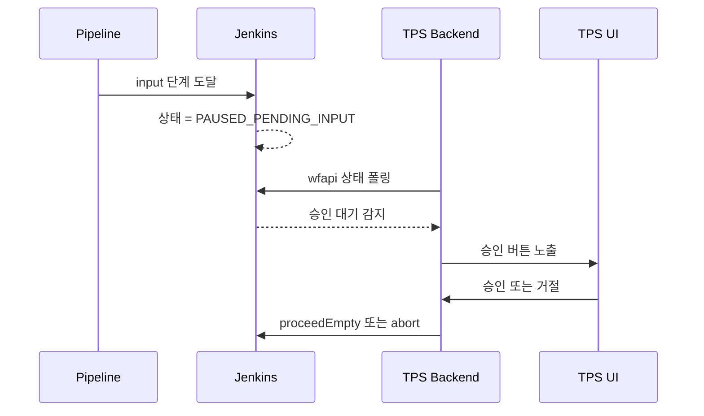

# 젠킨스 API 배포 승인과 운영 관리 현대화

> **본 문서는 spec(`01-08.md`)을 읽었다고 가정한 운영 해석과 TPS 패턴**이다. 승인 API(`proceedEmpty`/`abort`)와 운영 조회 endpoint(`/api/json`, `/computer/api/json`)는 spec에 있다. 이 문서는 그 위에서 `input` 상태 해석, 승인자 제어, liveness/readiness 분리, 노드 상태 해석, Metrics Plugin 위치를 정리한다.


## 1. `PAUSED_PENDING_INPUT` 상태 해석

> Jenkins Pipeline의 `input` 스텝은 단순한 sleep이 아니다. 외부 승인 이벤트를 기다리는 명시적 정지 상태이며, 운영상 "대기 중"이 아니라 "승인 대기 중"으로 별도 해석해야 한다.

이 상태는 보통 `wfapi/describe`에서 `PAUSED_PENDING_INPUT` 으로 읽는다. 운영상 핵심은 다음과 같다:

- 빌드가 실패한 것이 아니다.
- executor를 계속 점유하는지 여부는 파이프라인 구조와 단계 위치에 따라 달라질 수 있다.
- 외부 시스템은 이 상태를 별도 업무 상태로 취급해야 한다.

즉 승인 API 자체보다 먼저 중요한 것은, 이 상태를 별도 업무 상태로 취급하는 운영 해석이다.


## 2. 승인자 제어 강화

> 최근 Input Step Plugin에서는 승인 가능 주체와 승인자 기록을 Jenkinsfile 레벨에서 더 분명히 제어할 수 있다.

### 3-1. `submitter`

```groovy
input id: 'deploy-approval',
      message: '배포를 승인하시겠습니까?',
      submitter: 'admin,deploy-team'
```

의미는 다음과 같다:

- 지정된 사용자나 그룹만 승인 가능
- 허용되지 않은 사용자가 승인 API를 치면 `403` 가능
- TPS UI 권한 체크와 별개로 Jenkins 자체에서도 방어 가능

### 3-2. `submitterParameter`

```groovy
input id: 'deploy-approval',
      message: '배포를 승인하시겠습니까?',
      submitter: 'admin,deploy-team',
      submitterParameter: 'APPROVER'
```

이 옵션을 쓰면 승인한 사용자를 후속 스테이지에서 환경 변수로 읽을 수 있다. 즉 "승인됐는가"만이 아니라 "누가 승인했는가"까지 Jenkins 파이프라인 안에 남길 수 있다.

이 기능은 API 경로를 바꾸지 않지만, 운영 감사와 승인 이력 설계에는 큰 차이를 만든다.


## 3. 승인 감지와 프로젝트 패턴

> TPS 같은 외부 시스템은 `input` 단계에 도달했는지 먼저 감지해야 UI에 승인 버튼을 노출할 수 있다. 핵심은 승인 API를 먼저 치는 것이 아니라, 상태 추적 계층이 `PAUSED_PENDING_INPUT` 을 읽는 것이다.

흐름을 단순화하면 다음과 같다:



프로젝트 구현에서 중요한 것은 아래 세 가지를 분리하는 것이다:

- 승인 API 호출기
- 승인 대기 상태 감지기
- UI 노출 조건


## 4. liveness와 readiness를 분리해서 보기

> Jenkins 코어는 Spring Boot Actuator처럼 단일 `/health` 엔드포인트를 기본 제공하지 않는다. 운영에서는 "살아 있는가"와 "빌드를 받을 준비가 됐는가"를 별도 질문으로 분리해야 한다.

### 4-1. Liveness

"프로세스가 살아 있는가?"에 가까운 질문이다. 후보는 다음과 같다:

- `/login` — 인증 없이도 접근 가능한 경우가 많아 인프라 레벨 probe에 유리하다.
- `/api/json` — Jenkins 본체가 실제로 JSON 응답을 줄 수 있는지 더 직접 확인한다.
- `X-Jenkins` 헤더 존재 여부

### 4-2. Readiness

"지금 빌드를 받을 준비가 되었는가?"에 가까운 질문이다. 이 판단에는 보통 다음 요소가 들어간다:

- `/api/json` 이 정상 응답하는가
- `totalExecutors > 0` 인가
- offline 노드 비율이 너무 높지 않은가
- 특정 핵심 에이전트가 살아 있는가

즉 readiness는 Jenkins가 단일 값으로 주는 것이 아니라, 운영 정책이 만드는 조합 값에 가깝다.


## 5. 노드 상태 조회를 어떻게 읽어야 하는가

> `/computer/api/json` 결과는 단순한 "현재 실행 중 빌드 수"가 아니다. `busyExecutors` 와 `totalExecutors` 는 자주 헷갈리는 필드이므로 해석 기준을 명확히 잡아야 한다.

핵심 해석은 다음과 같다:

- `busyExecutors`: 지금 사용 중인 executor 수
- `totalExecutors`: Jenkins 전체에서 사용할 수 있는 executor 슬롯 수
- `idle`: 해당 노드가 현재 유휴 상태인지
- `offline`: 해당 노드가 스케줄 대상에서 빠졌는지

따라서 `busyExecutors=0`, `totalExecutors=10` 은 이상한 상태가 아니라, "지금은 아무 것도 돌지 않지만 10개 슬롯이 준비돼 있다"는 뜻이다.


## 6. Metrics Plugin의 위치

> Metrics Plugin은 Jenkins 코어가 기본 제공하지 않는 운영 친화적인 상태 확인 경로를 제공한다. 운영 대시보드나 고급 헬스체크가 필요하면 유용하지만, 가장 기본 기준은 여전히 코어 API다.

비교하면 다음과 같다:

| 방식 | 장점 | 주의점 |
|------|------|------|
| `/api/json` | 기본 제공, 범용적 | readiness를 직접 판정해 주진 않음 |
| `/computer/api/json` | executor와 노드 상태까지 확인 가능 | 해석 로직을 직접 작성해야 함 |
| `/metrics/currentUser/ping` | 매우 가벼움 | 플러그인 설치 필요 |
| `/metrics/currentUser/healthcheck` | 상세 항목별 상태 제공 | 플러그인 의존, 권한 영향 가능 |


## 7. TPS 운영 패턴

> TPS 관점에서 이 문서와 연결되는 운영 패턴은 승인 대기 감지와 노드 모니터링 두 갈래다. `01-08`이 "무슨 API를 치는가"라면, `01-08a`는 "그 API를 운영에서 어떤 의미로 읽는가"에 가깝다.

첫째는 승인 대기 감지다:

- 상태 추적 계층이 `PAUSED_PENDING_INPUT` 감지
- UI가 승인 버튼 노출
- 승인/거절 API를 backend가 대신 호출

둘째는 노드 모니터링이다:

- `/computer/api/json` 으로 전체 노드 상태 수집
- 가용 executor 수 확인
- 빌드 전 사용 가능 자원 판단


## 8. 버전별 변경 요약

| 버전/시점 | 변경 | 운영 영향 |
|------|------|------|
| Jenkins 2.222 (2020) | API Token crumb 면제 | 승인/거절 POST 호출 단순화 |
| Input Step Plugin 477.v+ (2023) | `submitter`, `submitterParameter` 강화 | 승인 권한과 승인자 추적 강화 |
| Jenkins 2.462 (2024) | Java 17 최소 요구 | 승인/운영 API 자체보다 런타임 환경 영향 |
| Jenkins 2.504 (2025) | SameSite=Lax 쿠키 | 브라우저 세션 영향은 있으나 API Token 흐름 영향은 제한적 |


## 9. 참고 링크

- `01-08. 젠킨스 API 배포 승인과 운영 관리.md`
- `01-02a. 젠킨스 인증 모델과 TPS 패턴 (2.222+).md`
- `01-05a. 젠킨스 빌드 상태 추적 모델과 TPS 패턴 (2.222+).md`
- [Pipeline: Input Step Plugin](https://plugins.jenkins.io/pipeline-input-step/)
- [Metrics Plugin](https://plugins.jenkins.io/metrics/)
