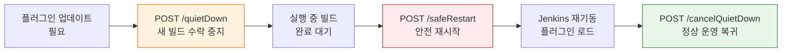

# 젠킨스 API 쿼리 최적화와 운영

---

> Jenkins API 응답을 효율적으로 다루고, 아티팩트와 시스템 상태를 관리하는 방법을 다룬입니다.
> 실습 환경 설정은 01-00 참조

## 1. depth와 tree 파라미터

> Jenkins API는 기본적으로 요청한 리소스에 연결된 모든 하위 객체를 포함하여 응답합니다.
>
> - `depth`는 하위 객체를 몇 단계까지 포함할지 결정합니다. `depth=0`이면 최상위 객체만, `depth=2`면 손자 객체까지 포함합니다.
> - `tree`는 응답에 포함할 필드를 직접 지정합니다. `tree=jobs[name,color]` 형태로 쓰면 name과 color 두 필드만 가져옵니다.

단순한 잡 목록 조회 하나가 수십 KB에서 수 MB에 달하는 JSON을 반환할 수 있습니다. `depth`와 `tree` 파라미터는 이 응답 크기를 제어하는 두 가지 핵심 도구입니다.

| 파라미터 | 용도 | 응답 크기 | 성능 | 권장 사용 |
| --- | --- | --- | --- | --- |
| `depth=0` | 최상위만 | 작음 | 빠름 | 존재 확인 |
| `depth=1` | 1단계 하위 | 중간 | 보통 | 목록 조회 |
| `depth=2+` | 전체 트리 | 큼 (수 MB) | 느림 | 비권장 |
| `tree=...` | 필요 필드만 | 최소 | 빠름 | 운영 polling |

`tree` 문법은 중첩 구조, 범위 지정, 다중 필드 선택을 조합할 수 있습니다:

- `jobs[name,color]` — 중첩 필드 선택
- `builds[number,result]{0,5}` — 처음 5개 항목만
- `name,color,builds[number]` — 여러 필드를 함께 선택

depth와 tree를 비교하는 예시입니다:

```bash
# depth=2 — 전체 트리 (응답이 크고 느림)
curl -sSf ${JENKINS_OPTS} -u "${JENKINS_USER}:${JENKINS_PASS}" \
  "${JENKINS_URL}/api/json?depth=2"

# tree — 필요한 필드만 정확히 지정 (운영 권장)
curl -sSf ${JENKINS_OPTS} -u "${JENKINS_USER}:${JENKINS_PASS}" \
  "${JENKINS_URL}/api/json?tree=jobs[name,color,lastBuild[number,result]]"
```

polling 스크립트에서 빌드 결과만 확인할 때는 `tree`로 최소 필드만 요청하는 것이 원칙입니다. 전체 빌드 객체를 받아서 클라이언트에서 필터링하는 방식은 불필요한 데이터를 네트워크로 전송하기 때문에 피해야 합니다.


## 2. Artifact 조회와 다운로드

> 배포 자동화 스크립트에서 "가장 최근에 성공한 빌드의 JAR을 가져와서 배포한다"는 시나리오가 아티팩트 API의 대표적인 활용 사례입니다.
>
> - `lastSuccessfulBuild`는 결과가 SUCCESS인 가장 최근 빌드를 가리킨입니다.
> - `lastCompletedBuild`는 성공/실패 여부와 관계없이 완료된 가장 최근 빌드를 가리킨입니다. 배포 스크립트에서는 반드시 `lastSuccessfulBuild`를 사용해야 합니다.

아티팩트 목록을 조회하는 방법은 다음과 같습니다:

```bash
# 최근 성공 빌드의 아티팩트 목록 조회
curl -sSf ${JENKINS_OPTS} -u "${JENKINS_USER}:${JENKINS_PASS}" \
  "${JENKINS_URL}/job/my-pipeline/lastSuccessfulBuild/api/json?tree=artifacts[fileName,relativePath]" \
  | jq '.artifacts[]'

# 특정 빌드 번호의 아티팩트 목록
curl -sSf ${JENKINS_OPTS} -u "${JENKINS_USER}:${JENKINS_PASS}" \
  "${JENKINS_URL}/job/my-pipeline/42/api/json?tree=artifacts[fileName,relativePath]" \
  | jq '.artifacts[] | .relativePath'
```

아티팩트를 실제로 다운로드할 때는 `artifact/{relativePath}` 경로를 사용합니다:

```bash
# relativePath가 "target/app.jar"인 아티팩트 다운로드
curl -sSf ${JENKINS_OPTS} -u "${JENKINS_USER}:${JENKINS_PASS}" \
  -O "${JENKINS_URL}/job/my-pipeline/lastSuccessfulBuild/artifact/target/app.jar"

# 빌드 번호와 파일명을 동적으로 구성하여 다운로드
BUILD_NUMBER=$(curl -sSf ${JENKINS_OPTS} -u "${JENKINS_USER}:${JENKINS_PASS}" \
  "${JENKINS_URL}/job/my-pipeline/lastSuccessfulBuild/api/json?tree=number" \
  | jq -r '.number')

curl -sSf ${JENKINS_OPTS} -u "${JENKINS_USER}:${JENKINS_PASS}" \
  -o "app-${BUILD_NUMBER}.jar" \
  "${JENKINS_URL}/job/my-pipeline/${BUILD_NUMBER}/artifact/target/app.jar"
```

아티팩트 보존 정책은 빌드 설정에서 "오래된 빌드 삭제" 옵션으로 제어합니다. 보존 기간이 지난 빌드의 아티팩트는 API로 접근해도 `404` 오류가 반환됩니다. 배포 스크립트에서 특정 빌드 번호를 하드코딩하면 아티팩트가 만료되었을 때 배포가 실패하므로, 항상 `lastSuccessfulBuild` 같은 심볼릭 참조를 사용하는 것이 안전합니다.


## 3. System Restart와 운영 API

> Jenkins 운영 중에는 플러그인 업데이트, 설정 변경, 메모리 정리 등의 이유로 재시작이 필요합니다. 실행 중인 빌드를 보호하면서 안전하게 재시작하려면 올바른 순서가 중요합니다.
>
> - `quietDown` → 빌드 완료 대기 → `safeRestart` 순서로 진행해야 합니다.
> - `safeRestart`만 단독으로 호출하면 그 사이에 새 빌드가 계속 유입될 수 있습니다.

운영 API의 핵심 3가지는 다음과 같습니다:

- `safeRestart`: 현재 실행 중인 빌드가 모두 완료될 때까지 기다린 뒤 재시작합니다. 진행 중인 빌드를 강제 중단하지 않는입니다.
- `quietDown`: 새 빌드 수락을 중지하고 유지보수 모드로 진입합니다. 이미 실행 중인 빌드는 계속 진행됩니다.
- `cancelQuietDown`: 유지보수 모드를 해제하고 정상 운영으로 복귀합니다. 취소하지 않으면 Jenkins가 영구적으로 새 빌드를 받지 않는입니다.

플러그인 업데이트처럼 "더 이상 새 빌드가 들어오지 않는 깨끗한 상태에서 재시작"이 필요하다면, 아래 흐름을 따릅니다.



`safeRestart` 단독 호출:

```bash
# 실행 중인 빌드 완료 후 재시작
curl -sSf ${JENKINS_OPTS} -X POST \
  -u "${JENKINS_USER}:${JENKINS_PASS}" \
  -H "${CRUMB_HEADER}:${CRUMB}" \
  "${JENKINS_URL}/safeRestart"
```

유지보수 모드 진입 및 해제:

```bash
# 유지보수 모드 진입 (새 빌드 수락 중지)
curl -sSf ${JENKINS_OPTS} -X POST \
  -u "${JENKINS_USER}:${JENKINS_PASS}" \
  -H "${CRUMB_HEADER}:${CRUMB}" \
  "${JENKINS_URL}/quietDown"

# 유지보수 모드 해제
curl -sSf ${JENKINS_OPTS} -X POST \
  -u "${JENKINS_USER}:${JENKINS_PASS}" \
  -H "${CRUMB_HEADER}:${CRUMB}" \
  "${JENKINS_URL}/cancelQuietDown"
```

플러그인 업데이트 시 권장하는 전체 운영 시나리오:

```bash
# 1. 유지보수 모드 진입
curl -sSf ${JENKINS_OPTS} -X POST \
  -u "${JENKINS_USER}:${JENKINS_PASS}" \
  -H "${CRUMB_HEADER}:${CRUMB}" \
  "${JENKINS_URL}/quietDown"

echo "유지보수 모드 진입 완료. 실행 중인 빌드 완료를 기다린다."

# 2. 실행 중인 빌드가 0개가 될 때까지 대기
while true; do
  RUNNING=$(curl -sSf ${JENKINS_OPTS} -u "${JENKINS_USER}:${JENKINS_PASS}" \
    "${JENKINS_URL}/computer/api/json?tree=computer[executors[idle]]" \
    | jq '[.computer[].executors[] | select(.idle == false)] | length')

  if [ "$RUNNING" -eq 0 ]; then
    echo "모든 빌드 완료. 재시작한다."
    break
  fi

  echo "실행 중인 빌드: ${RUNNING}개. 10초 후 재확인."
  sleep 10
done

# 3. safeRestart (실질적으로 즉시 재시작)
curl -sSf ${JENKINS_OPTS} -X POST \
  -u "${JENKINS_USER}:${JENKINS_PASS}" \
  -H "${CRUMB_HEADER}:${CRUMB}" \
  "${JENKINS_URL}/safeRestart"

echo "재시작 요청 완료. Jenkins가 재기동될 때까지 대기한다."
```

이 시나리오가 중요한 이유는 Jenkins를 운영 환경에서 갑자기 재시작하면 실행 중이던 배포 파이프라인이 중단되어 애플리케이션이 불완전한 상태로 남을 수 있기 때문입니다. `quietDown`으로 새 빌드 유입을 막고, 기존 빌드가 모두 끝난 뒤 재시작하면 이런 위험을 피할 수 있습니다.
