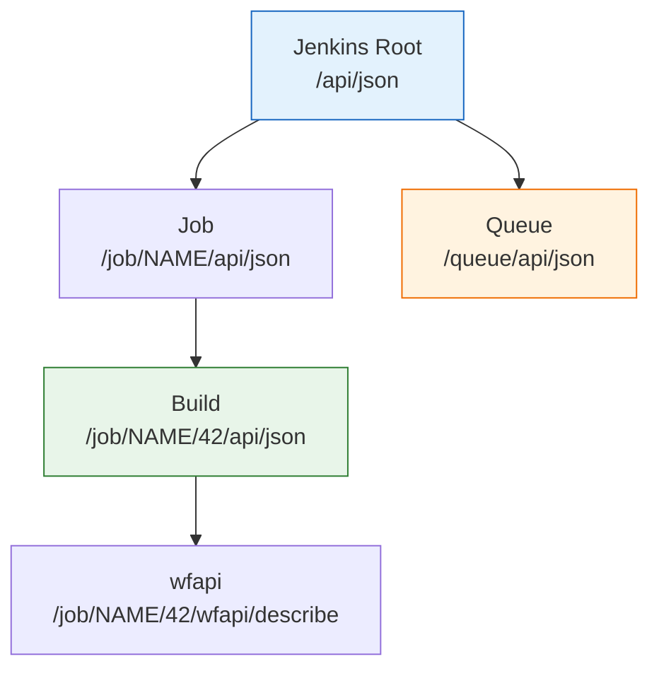
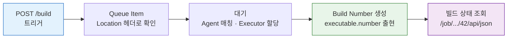

# 젠킨스 API를 사용하는 이유와 주의점
---
> Jenkins REST API로 파이프라인 CRUD, 빌드 실행 제어, 로그 조회, 크레덴셜 관리를 수행합니다. 이 문서는 API 사용 전에 알아야 할 구조적 특성과 실전 주의사항을 정리합니다.
>
> Jenkins REST API의 리소스 기반 URL 구조를 설명하고, crumb과 API Token 중 어느 인증을 쓸지 선택하며, Queue→Build 전환 구간에서 흔히 나는 `null` 참조 실수를 예측해 피할 수 있습니다.
>
> 실습 환경 설정은 `01-01.API 실습 환경 설정` 참조


## 사전 지식

> 일반적인 REST API(`/api/v1/users` 같은 단일 엔드포인트)를 써 봤다면, Jenkins API는 그 모델을 "UI 경로 뒤에 `/api/json`을 붙이는 방식"으로 비틀어 일반화한 것입니다.


## 진입 — 왜 Jenkins API가 따로 필요한가

> Jenkins는 사람이 브라우저에서 버튼을 누르도록 설계된 도구입니다. 외부 시스템이 자동으로 빌드를 걸고 결과를 받아 가려면, 그 버튼들이 누르는 동작을 프로그래밍으로 호출할 통로가 있어야 합니다. 그 통로가 REST API입니다.

TPS 같은 배포 플랫폼이 Jenkins와 연동할 때, 사람이 매번 UI에 들어가 빌드 버튼을 누를 수는 없습니다. 외부 시스템은 화면을 보지 못하므로 화면 대신 호출할 인터페이스가 필요합니다. Jenkins REST API는 UI가 내부적으로 호출하던 동작(빌드 트리거, 상태 조회, 로그 수신)을 외부에서도 동일하게 호출할 수 있도록 노출한 통로입니다. 이 문서는 그 통로를 본격적으로 쓰기 전에, 일반 REST API와 다른 구조적 특성과 실전 함정을 먼저 짚습니다.


## 1. Jenkins API로 무엇을 하는가

> Jenkins REST API의 목적은 UI 클릭 없이 Jenkins를 프로그래밍 방식으로 제어하는 것입니다.
>
> 이 개념은 이미 아는 "웹 UI가 버튼 클릭으로 호출하던 동작"을 프로그래밍 인터페이스 측면에서 다시 본 것입니다.
>
> - 외부 시스템(배포 플랫폼, 모니터링 도구, 자체 관리 시스템)이 Jenkins와 연동할 때 API가 유일한 인터페이스가 됩니다.
> - 이 시리즈는 인증부터 운영 관리까지 8개 영역을 순서대로 다룹니다.

Jenkins REST API를 UI에 비유하면, 화면의 모든 버튼·목록·상태 표시 뒤에는 동일한 데이터를 반환하는 API 엔드포인트가 짝으로 존재합니다. UI는 그 API를 호출해 화면을 그릴 뿐이고, API는 그 호출을 화면 없이 그대로 노출합니다. 이 비유는 "UI에 보이는 것 = API로 얻을 수 있는 것"이라는 지점까지 유효하지만, UI 전용 자바스크립트 동작(폼 검증, 실시간 새로고침)이나 일부 화면이 여러 API를 조합해 만든 합성 뷰에서는 깨집니다. 한 화면이 곧 한 엔드포인트로 1:1 대응하지는 않습니다.

이 시리즈에서 다루는 API 영역은 다음과 같습니다:

| 영역 | 하는 일 | 상세 문서 |
|------|--------|----------|
| **인증** | Basic Auth, API Token, CSRF crumb 확보 | 03-01, 03-02, 03-03 |
| **파이프라인 CRUD** | Job 생성, 조회, 수정, 삭제, Folder 관리 | 04-01, 04-02 |
| **빌드 실행 제어** | 빌드 트리거, Queue 추적, 빌드 중지 | 05-01, 05-02, 05-03, 05-04 |
| **상태 추적** | 빌드 결과, Pipeline stage 상태, wfapi | 06-01, 06-02, 06-03 |
| **로그 조회** | Console 출력, Progressive 로그, Blue Ocean 로그, `wfapi` node 로그, Blue Ocean-like 구현 판단 | 07-01, 07-01, 07-02, 07-03 |
| **크레덴셜** | 시크릿 등록, 조회, 수정, 삭제 | 08-01, 08-02 |
| **운영 관리** | 배포 승인, 노드 상태, 시스템 헬스체크 | 09-01, 09-02 |
| **쿼리 최적화** | depth/tree 파라미터, Artifact, System Restart | 09-03 |


## 2. Jenkins API의 구조적 특성

> Jenkins API는 일반적인 REST API와 다른 구조를 가집니다. 단일 엔드포인트(`/api/v1/...`) 대신 각 리소스 경로 뒤에 `/api/json`을 붙이는 방식입니다.
>
> - Jenkins UI에서 보이는 URL이 곧 API 경로의 기반이 됩니다.
> - Folder Plugin을 사용하면 경로가 중첩되므로 구성 규칙을 미리 파악해야 합니다.

### 리소스 기반 URL 구조

Jenkins API는 단일 엔드포인트가 아니라, 각 리소스 경로 뒤에 `/api/json`을 붙이는 구조입니다.

```
# UI에서 보이는 경로            → API 경로
/job/my-pipeline/              → /job/my-pipeline/api/json
/job/my-pipeline/42/           → /job/my-pipeline/42/api/json
/job/folder/job/sub-job/       → /job/folder/job/sub-job/api/json
/queue/                        → /queue/api/json
```

리소스 간 계층 관계는 다음과 같습니다:



Folder Plugin을 사용하면 경로가 중첩됩니다. `프로젝트/프리셋/잡` 구조라면 `/job/PROJECT/job/PRESET/job/JOB`이 됩니다. 이 경로 구성 규칙을 모르면 API 호출 시 404를 만나게 됩니다.

### 응답 형식

어떤 객체의 URL이든 뒤에 `/api/`를 붙이면 API로 접근할 수 있고, Jenkins는 JSON, XML, Python 세 가지 형식을 지원합니다. `/api/json`, `/api/xml`, `/api/python`으로 형식을 선택합니다(출처: jenkins.io/doc/book/using/remote-access-api). 이 시리즈에서는 JSON만 사용합니다. XML은 `xpath=`로 특정 노드만 선택하거나 `exclude=`로 노드를 제거할 수 있지만(출처: jenkins.io/doc/book/using/remote-access-api), JSON의 `tree` 파라미터가 더 실용적입니다.

응답 헤더 `X-Jenkins`에는 Jenkins 버전이 담겨 있어(출처: jenkins.io/doc/book/using/remote-access-api), 호출 전 버전·플러그인 호환성을 판별하는 신호로 씁니다.

### tree와 depth 파라미터

응답이 일반 REST API보다 쉽게 커지는 만큼, `tree=`로 필드를 좁히고 `depth=`로 깊이를 제어하는 두 파라미터를 API 사용 전에 알아 둬야 합니다. 다음은 좁히기 전후를 한눈에 보는 예시입니다.

```bash
# 전체 응답: tree 없이 Job 객체의 모든 필드를 받음.
# build 목록·파라미터·trigger 설정까지 끌려와 수 KB~MB가 됩니다.
curl -sSf -u "${JENKINS_USER}:${JENKINS_PASS}" \
  "${JENKINS_URL}/job/my-pipeline/api/json"

# 필요한 필드만: tree= 로 name·buildable·lastBuild 하위 number/result만 지정.
# 대괄호 [ ]는 서브객체 안에서 다시 필드를 좁히는 문법이라
# lastBuild 통째가 아니라 두 필드만 와서 응답이 수백 바이트로 줄어듭니다.
curl -sSf -u "${JENKINS_USER}:${JENKINS_PASS}" \
  "${JENKINS_URL}/job/my-pipeline/api/json?tree=name,buildable,lastBuild[number,result]"
```

`tree=`·`depth=`의 동작 원리와 "수십 KB→수백 바이트" 응답 축소 효과의 상세는 [09-03. API 쿼리 최적화와 운영](09-03.API%20%EC%BF%BC%EB%A6%AC%20%EC%B5%9C%EC%A0%81%ED%99%94%EC%99%80%20%EC%9A%B4%EC%98%81.md)에서 다룹니다.


## 3. API 사용 시 참고사항

> 인증 방식, Queue 전환 구간, Polling 설계, wfapi 선택 기준을 미리 파악하면 자동화 스크립트 작성 시 흔한 실수를 피할 수 있습니다.

### 인증: crumb vs API Token

Jenkins API 호출에는 인증이 필요합니다. 두 가지 방식이 있으며 선택 기준이 다릅니다:

| 방식 | 특징 | 적합한 상황 |
|------|------|-----------|
| ID/Password + crumb | 모든 POST에 crumb 헤더와 세션 cookie 필요 | 레거시 환경, crumb만 지원하는 경우 |
| API Token | crumb/cookie 불필요, 헤더 하나로 인증 완료 | 자동화 스크립트, 외부 시스템 연동 |

활용 판단의 결론은 단순합니다. API Token이 가능하면 반드시 Token을 씁니다 — crumb 방식은 세션 cookie 관리가 필요하고 Jenkins 재시작 시 crumb이 무효화되는 등 운영상 번거롭기 때문입니다. crumb의 CSRF 원리·`/crumbIssuer/api` 발급 절차·API token이 CSRF 검사를 면제받는 이유는 [03-01. 인증 API 스펙 (ID-Password + Crumb)](03-01.%EC%9D%B8%EC%A6%9D%20API%20%EC%8A%A4%ED%8E%99%20%28ID-Password%20%2B%20Crumb%29.md)에서 다룹니다.

### Queue → Build 전환 구간

빌드를 트리거하면 즉시 실행되는 것이 아닙니다. 이 구간을 이해하지 못하면 자동화 스크립트에서 `null`을 참조하게 됩니다.



흐름을 단계별로 정리하면 다음과 같습니다:

1. `POST /job/.../build` → 응답 헤더 `Location`에 **Queue Item URL** 반환
2. Queue에서 대기 → Agent 매칭 → Executor 할당
3. Executor에 배정되면 **build number** 생성
4. 이후부터 `/job/.../42/api/json`으로 빌드 상태 조회 가능

이 전환 구간은 음식점 대기표에 비유할 수 있습니다. 빌드 트리거(`build`, `buildWithParameters`는 모두 POST입니다 — 출처: jenkins.io/doc/book/using/remote-access-api)를 보내면 곧바로 자리(Executor)가 나는 게 아니라 먼저 **대기표(queue item)** 를 받습니다. 자리가 비어 안내(Executor 할당)를 받은 다음에야 **테이블 번호(build number)** 가 정해집니다. 대기표 번호로 테이블 번호를 조회하려 들면 아직 없는 값을 참조하게 됩니다. 이 비유는 "대기표 → 테이블 번호로 ID가 한 번 바뀐다"는 지점까지 유효하지만, 대기표를 받자마자 취소(queue cancel)가 가능하고 같은 Job에 여러 대기표가 동시에 쌓일 수 있다는 점에서 단순 식당 대기열과 달라집니다.

핵심: 트리거 직후 받는 값은 **build number가 아니라 queue item ID**입니다. queue item을 폴링하여 `executable.number`가 나타날 때까지 기다려야 합니다. 상세는 05-03에서 다룹니다.

### Polling 설계

빌드 상태를 확인하기 위해 API를 반복 호출(polling)할 때 주의할 점이 있습니다:

- **간격**: 1초 미만 polling은 Jenkins Controller에 부하를 줍니다. 최소 3-5초 간격을 권장합니다.
- **tree 파라미터**: 매번 전체 응답을 받지 말고, `tree=building,result` 같이 필요한 필드만 요청합니다.
- **종료 조건**: `building=false`이면 빌드가 끝난 것입니다. `result`가 `null`이면 아직 실행 중입니다.
- **타임아웃**: 무한 polling을 방지하기 위해 스크립트에 최대 대기 시간을 반드시 설정합니다.

### wfapi vs 기본 API

Pipeline 빌드의 상태를 볼 때 두 가지 API가 있습니다:

| API | 경로 | 보여주는 것 |
|-----|------|-----------|
| 기본 Build API | `/{buildNumber}/api/json` | `building`, `result`, `duration` — 빌드 전체 상태 |
| wfapi | `/{buildNumber}/wfapi/describe` | `status`, `stages[]` — 각 stage별 상태와 진행률 |

"빌드가 성공했는가?"만 확인하려면 기본 API로 충분합니다. "어느 stage에서 실패했는가?", "현재 어느 stage가 실행 중인가?"를 알려면 wfapi를 사용해야 합니다. 상태 추적 중심 설명은 `06-01`, 엔드포인트 전체 설명은 `07-02`에서 다룹니다.


## 4. API 사용 시 주의점

> Folder 경로 구성 오류, 멱등성 부재, 비표준 에러 응답, 플러그인 버전 의존성은 Jenkins API에서 자주 만나는 함정입니다.

### Folder 경로 구성

Folder Plugin을 사용하면 API 경로가 깊어집니다. 잘못된 경로를 구성하면 404나 엉뚱한 리소스에 접근하게 됩니다.

```
# Folder 없는 Job
/job/my-pipeline/api/json

# 1단계 Folder
/job/PROJECT/job/my-pipeline/api/json

# 2단계 Folder (프로젝트 > 프리셋 > 잡)
/job/PROJECT/job/PRESET/job/my-pipeline/api/json
```

프로그래밍 방식으로 경로를 구성할 때는 각 세그먼트를 `/job/` 접두사로 연결해야 합니다. 이 규칙은 04-01에서 상세하게 다룹니다.

### 멱등성과 부작용

Jenkins API는 일부 엔드포인트에서 멱등성을 보장하지 않습니다:

- `POST /build`: 호출할 때마다 새 빌드가 큐에 추가됩니다. 네트워크 재시도 로직이 있으면 중복 빌드가 발생할 수 있습니다.
- `POST /job/.../config.xml`: Job 설정을 덮어씁니다. 동시에 두 클라이언트가 설정을 수정하면 한쪽이 유실됩니다.
- `POST /credentials/...`: 같은 ID로 중복 생성하면 에러가 발생합니다. 존재 여부를 먼저 확인해야 합니다.

자동화 스크립트에서 재시도 로직을 구현할 때 이 특성을 반드시 고려해야 합니다.

### 에러 응답 해석

Jenkins API의 에러 응답은 일반적인 REST API와 다릅니다:

- **403**: 인증은 됐지만 권한이 없거나, crumb이 누락/만료된 경우입니다. crumb 문제인지 권한 문제인지 구분하려면 GET 요청(crumb 불필요)을 먼저 시도합니다.
- **404**: 리소스가 없거나, Folder 경로가 잘못된 경우입니다. UI에서 해당 Job이 보이는지 먼저 확인합니다.
- **500**: Jenkins 내부 오류입니다. 플러그인 충돌이나 설정 오류일 가능성이 높습니다. Jenkins 로그(`/log/api/json`)를 확인합니다.
- **503**: Jenkins가 시작 중이거나 quietDown 모드입니다. `X-Jenkins` 응답 헤더가 없으면 Jenkins가 아직 준비되지 않은 것입니다.

### 버전 호환성

Jenkins API는 플러그인 버전에 따라 동작이 달라질 수 있습니다. 특히 `wfapi`를 제공하는 `Pipeline: REST API Plugin`과 Blue Ocean API는 플러그인 버전에 의존합니다. API 호출 전에 `X-Jenkins` 응답 헤더로 Jenkins 버전을 확인하고, 필요한 플러그인이 설치되어 있는지 `/pluginManager/api/json`으로 검증하는 것이 안전합니다.


## 5. 이 시리즈의 읽는 순서

> 모든 문서를 순서대로 읽을 필요는 없습니다. 목적에 따라 필요한 문서를 선택합니다.

- **처음 API를 쓴다** → 02-01(환경 설정) → 03-01(인증) → 05-01(빌드 트리거) → 06-01(상태 확인)
- **파이프라인 자동 관리** → 04-01(CRUD) → 08-01(크레덴셜)
- **운영 자동화** → 07-01(로그) → 09-01(승인/노드) → 09-03(쿼리 최적화/Restart)
- **TPS 패턴 참조** → 각 문서의 `a` 변형 (03-02, 04-02, 05-02, 06-02)


## 6. 면접 질문

> 답을 떠올린 뒤 §정답 절에서 같은 번호로 대조하세요.

1. Jenkins REST API의 URL 구조는 일반적인 REST API와 어떻게 다른가요? UI 경로와의 관계로 설명해 보세요.
2. 빌드를 트리거한 직후 받는 값은 무엇이며, build number를 얻으려면 어떤 단계를 더 거쳐야 하나요?
3. `POST /build`가 멱등하지 않다는 사실이 자동화 스크립트의 재시도 로직에 어떤 영향을 주나요?
4. 같은 Pipeline 빌드를 보는데 기본 Build API 대신 wfapi를 써야 하는 상황은 언제인가요?

### 빈칸 채우기 — API 구조와 인증

아래 빈칸을 채워 보고, 답은 문서 끝 `빈칸 정답` 절에서 대조하세요.

1. 어떤 객체든 그 URL 뒤에 `______`를 붙이면 API로 접근할 수 있고, 형식은 `json`·`xml`·`______` 셋 중에서 고릅니다.
2. 응답에서 가져올 필드를 좁히는 파라미터는 `______=`이고, 서브트리를 얼마나 깊이 펼칠지 정하는 파라미터는 `______=`입니다.
3. 공식 문서는 CSRF 보호 측면에서 crumb보다 `__________`을 권장하며, 이 방식으로 인증한 요청은 crumb 검사를 `______`받습니다.
4. 응답 헤더 `__________`에는 Jenkins 버전이 담겨 있어 호환성 판별 신호로 씁니다.


## 정답

> 위 질문을 스스로 설명해 본 뒤에 펼치세요.

### 정답 1 — 리소스 기반 URL 구조

Jenkins API는 `/api/v1/...` 같은 단일 엔드포인트가 아니라, UI에서 보이는 각 리소스 경로 뒤에 `/api/json`을 붙이는 구조입니다. `/job/my-pipeline/`이 UI 경로라면 `/job/my-pipeline/api/json`이 API 경로가 됩니다. Folder Plugin을 쓰면 `/job/PROJECT/job/JOB/api/json`처럼 `/job/` 세그먼트가 중첩됩니다.

### 정답 2 — Queue Item ID → Build Number

트리거 직후 응답 `Location` 헤더로 받는 값은 build number가 아니라 **queue item ID**입니다. queue item을 `executable.number`가 null이 아닐 때까지 폴링해야 비로소 build number가 나옵니다. 그 전에는 빌드 상태 경로(`/job/.../42/api/json`)가 아직 존재하지 않습니다.

### 정답 3 — 멱등성 부재와 재시도

`POST /build`는 호출할 때마다 새 빌드를 큐에 추가합니다. 네트워크 타임아웃 후 무조건 재시도하면 같은 빌드가 두 번 큐에 쌓일 수 있습니다. 그래서 재시도 전에 직전 트리거의 queue item이 이미 잡혔는지 확인하거나, 멱등 키를 두고 중복을 거르는 설계가 필요합니다.

### 정답 4 — wfapi가 필요한 상황

"빌드가 성공했는가?"만 보면 기본 Build API의 `result`로 충분합니다. 하지만 "어느 stage에서 실패했는가?", "지금 어느 stage가 실행 중인가?"처럼 stage 단위 상태가 필요하면 wfapi(`/wfapi/describe`)의 `stages[]`를 봐야 합니다.

### 빈칸 정답 — API 구조와 인증

1. `/api/` / `python`
2. `tree` / `depth`
3. `API token` / `면제`
4. `X-Jenkins`


## 관련 문서

> API의 구조적 특성과 활용 판단을 잡았다면, 다음은 각 영역의 실제 스펙으로 들어갈 차례입니다. 인증·CRUD·빌드 실행 순으로 이어 읽으면 이 문서가 던진 함정들이 구체적인 엔드포인트로 풀립니다.

- [02-02. REST API 구조와 연동](02-02.REST%20API%20%EA%B5%AC%EC%A1%B0%EC%99%80%20%EC%97%B0%EB%8F%99.md) § "리소스 기반 URL" — 본 문서가 개관한 URL 구조와 응답 형식을 연동 관점에서 더 깊이 다룹니다
- [03-01. 인증 API 스펙 (ID-Password + Crumb)](03-01.%EC%9D%B8%EC%A6%9D%20API%20%EC%8A%A4%ED%8E%99%20%28ID-Password%20%2B%20Crumb%29.md) § "crumb vs API Token" — 본 문서의 인증 선택 기준을 발급·헤더 수준 스펙으로 확장합니다
- [05-01. 빌드 실행·큐 API 스펙](05-01.%EB%B9%8C%EB%93%9C%20%EC%8B%A4%ED%96%89%C2%B7%ED%81%90%20API%20%EC%8A%A4%ED%8E%99.md) § "Queue → Build" — Queue 전환 구간의 폴링 흐름을 엔드포인트 단위로 설명합니다
- [09-03. API 쿼리 최적화와 운영](09-03.API%20%EC%BF%BC%EB%A6%AC%20%EC%B5%9C%EC%A0%81%ED%99%94%EC%99%80%20%EC%9A%B4%EC%98%81.md) § "tree/depth 파라미터" — 본 문서가 소개한 응답 축소 기법을 최적화 관점에서 정리합니다
- [01-01. API 실습 환경 설정](01-01.API%20%EC%8B%A4%EC%8A%B5%20%ED%99%98%EA%B2%BD%20%EC%84%A4%EC%A0%95.md) § "환경 변수" — 본 문서 예제의 `JENKINS_URL`·token 설정을 직접 실습하는 출발점입니다
