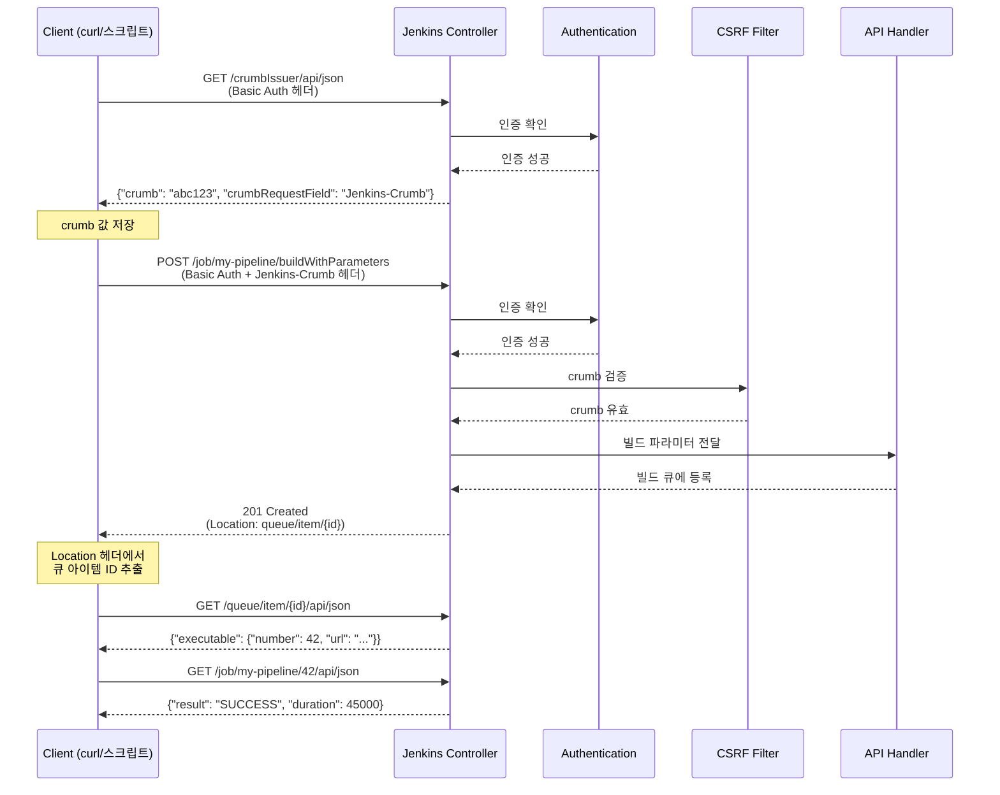
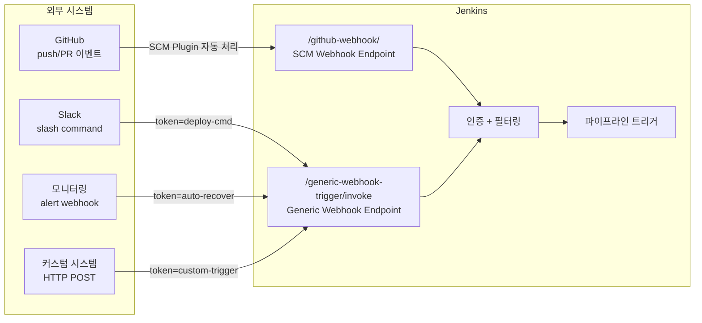

# 젠킨스 REST API 구조와 연동

---

> Blue Ocean·wfapi·Input·Credentials·Computer 고급 API를 용도별로 **선택**하고, SCM Webhook과 Generic Webhook Trigger 중 상황에 맞는 연동을 **비교·선택**하며, `tree=`·`depth=`로 응답 크기를 **예측**하고, Jenkins를 외부 시스템과 Push/Pull 두 방향으로 연결하는 패턴을 설계할 수 있습니다.

## 사전 지식

> 02-01에서 본 "UI 경로 + `/api/json`" 기본 구조를 알고 있다면, 이 문서는 그 기본 위에 stage 단위 조회·승인 자동화·시크릿 CRUD 같은 실무 API를 얹어 일반화한 것입니다. crumb·API token 인증의 세부 스펙은 03-01·03-02에서 다루고, 여기서는 연동 흐름 안에서 어떻게 끼워 쓰는지를 봅니다.

## 진입 — 왜 "URL + `/api/`" 한 가지 규칙이 모든 연동의 출발점인가

> Jenkins는 별도 API 명세서를 따로 펼쳐 보지 않아도, 브라우저에서 보던 UI 주소 뒤에 `/api/`를 붙이는 한 가지 규칙으로 거의 모든 리소스를 기계가 읽을 수 있는 형태로 노출합니다.

운영 자동화를 만들 때 가장 먼저 부딪히는 질문은 "이 화면의 데이터를 스크립트로 어떻게 가져오는가"입니다. Jenkins의 답은 단순합니다. "어떤 객체의 URL에도 `/api/`를 붙이면 원격 접근 API가 된다"는 규칙 하나입니다(출처: jenkins.io/doc/book/using/remote-access-api). 잡 페이지면 `/job/{name}/api/json`, 큐 페이지면 `/queue/api/json`처럼 화면을 탐색하다 주소에 `/api/json`만 덧붙이면 그 화면의 JSON 표현이 나옵니다. 이 규칙성 덕분에 별도 SDK 없이도 curl 한 줄로 연동을 시작할 수 있고, 응답 포맷(`json`/`xml`/`python`), 필드 선택(`tree=`), 깊이 제어(`depth=`)라는 세 손잡이만 익히면 나머지 고급 API와 Webhook 연동은 그 위에 얹히는 응용이 됩니다.

## 1. Jenkins REST API 상세

> Jenkins REST API의 핵심 설계 원칙은 "모든 UI 페이지가 API 엔드포인트를 가진다"는 것입니다.
>
> - 브라우저에서 보는 URL 끝에 `/api/json`을 붙이면 해당 리소스의 JSON 표현을 얻을 수 있습니다.
> - 별도의 API 문서 없이도 UI를 탐색하면서 엔드포인트를 파악할 수 있습니다.

> 이 개념은 이미 아는 "웹 페이지에는 사람이 보는 HTML과 기계가 읽는 표현이 한 쌍으로 있다"는 발상의 Jenkins 버전입니다. 같은 리소스를 사람용(HTML)과 기계용(`/api/json`)으로 동시에 노출하는 측면만 떼어 본 것입니다.

### 응답 포맷과 세 가지 손잡이

Jenkins 원격 접근 API는 같은 리소스를 세 가지 포맷으로 돌려줍니다(출처: jenkins.io/doc/book/using/remote-access-api).

| 접미사 | 포맷 | 쓰임 |
| --- | --- | --- |
| `/api/json` | JSON | 스크립트·jq 파싱에 가장 흔함 |
| `/api/xml` | XML | `xpath=`로 노드 선택, `exclude=`로 노드 제거(반복 가능) |
| `/api/python` | Python literal | Python 클라이언트가 `eval` 없이 안전 파싱 |

응답 크기를 다루는 손잡이는 `depth=`(펼침)와 `tree=`(필드 선택) 두 개이고, 연동 코드를 짜기 전에 응답 크기를 예측하는 출발점이 됩니다. 두 파라미터의 동작 방향·필드 선택 문법·"수십 KB→수백 바이트" 같은 축소 수치와 jq 대비 차이는 [09-03. API 쿼리 최적화와 운영](09-03.API%20%EC%BF%BC%EB%A6%AC%20%EC%B5%9C%EC%A0%81%ED%99%94%EC%99%80%20%EC%9A%B4%EC%98%81.md)에서 다룹니다. 한편 응답 헤더 `X-Jenkins`에는 인스턴스의 버전이 실려 오므로, 클라이언트가 버전별 분기를 할 때 본문을 파싱하지 않고 헤더 한 줄로 판별할 수 있습니다(출처: jenkins.io/doc/book/using/remote-access-api).

### 주요 API 엔드포인트

| 엔드포인트 | 메서드 | 설명 |
| --- | --- | --- |
| `/api/json` | GET | Jenkins 루트 정보 (잡 목록, 뷰 등) |
| `/job/{name}/api/json` | GET | 특정 잡의 상태, 최근 빌드 번호, 설정 정보 |
| `/job/{name}/build` | POST | 파라미터 없는 빌드 트리거 |
| `/job/{name}/buildWithParameters` | POST | 파라미터를 포함한 빌드 트리거 |
| `/job/{name}/{buildNumber}/api/json` | GET | 특정 빌드의 상세 정보 (결과, 소요시간, 변경사항) |
| `/job/{name}/{buildNumber}/consoleText` | GET | 특정 빌드의 콘솔 로그 전체 |
| `/job/{name}/lastBuild/api/json` | GET | 가장 최근 빌드 정보 (lastSuccessfulBuild, lastFailedBuild도 가능) |
| `/queue/api/json` | GET | 현재 빌드 큐에 대기 중인 작업 목록 |
| `/computer/api/json` | GET | 모든 Agent(노드)의 상태, Executor 사용률 |
| `/crumbIssuer/api/json` | GET | CSRF 방지용 crumb 토큰 발급 |

### 인증 방식

**API Token (권장)**

사용자별로 발급하는 토큰으로, Jenkins UI의 `사용자 설정 → API Token`에서 생성합니다. 공식 문서도 비밀번호 대신 API token을 권장하는데, 노출되더라도 그 토큰만 폐기하면 되고 로그인 비밀번호는 그대로 유효하기 때문입니다(출처: jenkins.io/doc/book/security/managing-security). 정리하면 토큰을 쓰는 이유는 다음과 같습니다:

- 토큰은 개별 폐기가 가능합니다
- Jenkins 로그인 비밀번호 변경과 독립적으로 유효합니다
- 토큰별로 사용 기록을 추적할 수 있습니다

**Basic Auth**

HTTP BASIC 인증으로 사용자와 토큰을 함께 보냅니다. curl에서는 `--user USER:TOKEN`(축약형 `-u admin:API_TOKEN`) 플래그로 전달하면, curl이 알아서 `username:token`을 Base64로 인코딩해 Authorization 헤더에 넣습니다(출처: jenkins.io/doc/book/using/remote-access-api).

**CSRF Protection (crumb)**

Jenkins는 POST 요청에 대해 CSRF(Cross-Site Request Forgery) 방지를 적용합니다. crumb은 username + 웹 세션 ID + 인스턴스 고유 salt를 인코딩한 토큰으로, `/crumbIssuer/api`(json/xml)에서 발급받아 이후 POST 헤더에 `Jenkins-Crumb: {crumb값}`과 세션 쿠키를 함께 동반합니다(출처: jenkins.io/doc/book/security/csrf-protection). 이 메커니즘이 필요한 이유는 악의적인 웹 페이지가 사용자 브라우저의 Jenkins 세션을 이용하여 빌드를 트리거하는 공격을 막기 위해서입니다.

다만 한 가지를 헷갈리면 안 됩니다. **API token으로 인증한 요청은 CSRF(crumb) 검사가 면제됩니다.** 공식 문서가 "crumb보다 API token이 CSRF 보호 측면에서 권장된다"고 적는 이유가 여기 있습니다(출처: jenkins.io/doc/book/using/remote-access-api, jenkins.io/doc/book/security/csrf-protection). crumb이 막으려는 공격은 "브라우저가 자동으로 실어 보내는 세션 쿠키"를 노린 것인데, API token은 브라우저가 자동으로 붙이지 않으므로 위조 요청의 전제 자체가 성립하지 않기 때문입니다. 즉 스크립트가 토큰으로 인증하면 굳이 crumb을 먼저 받지 않아도 POST가 통과합니다. crumb 발급 단계가 꼭 필요한 경우는 토큰 없이 세션 쿠키로 인증하는 흐름입니다.

### curl 사용 예시

```bash
# 1. CSRF crumb 발급 — 토큰 인증이면 생략 가능하나, 세션 쿠키 흐름이면 선발급 필요
CRUMB=$(curl -s -u admin:API_TOKEN \
  'http://localhost:8080/crumbIssuer/api/json' | jq -r '.crumb')

# 2. 파라미터 빌드 트리거 — build/buildWithParameters 는 반드시 POST (GET 불가)
curl -X POST -u admin:API_TOKEN \
  -H "Jenkins-Crumb: $CRUMB" \
  'http://localhost:8080/job/my-pipeline/buildWithParameters' \
  --data-urlencode 'DEPLOY_ENV=staging' \
  --data-urlencode 'IMAGE_TAG=v1.2.3'
  # --data-urlencode 를 쓰는 이유: 값에 공백·&·= 가 들어가도 안전하게 인코딩

# 3. 빌드 상태 조회 — jq 로 받은 응답에서 3필드만 추출(전송량은 그대로)
curl -s -u admin:API_TOKEN \
  'http://localhost:8080/job/my-pipeline/lastBuild/api/json' \
  | jq '{result: .result, duration: .duration, timestamp: .timestamp}'

# 4. tree= 로 서버 단계에서 필드 선택 — 전송 바이트 자체를 줄임(jq 와 다른 지점)
curl -s -u admin:API_TOKEN \
  'http://localhost:8080/job/my-pipeline/api/json?tree=builds[number,result,timestamp]{0,5}'
  # {0,5} 는 builds 배열을 앞 5개로 슬라이스 — 빌드 수백 건 잡에서 페이지네이션 역할

# 5. 빌드 로그 조회 — consoleText 는 전체 로그를 텍스트 한 덩어리로 반환
curl -s -u admin:API_TOKEN \
  'http://localhost:8080/job/my-pipeline/lastBuild/consoleText'
```

위 예시 4번의 `tree=`는 폴링 주기가 짧은 운영 대시보드에서 전송량·파싱 부하를 줄이는 핵심 손잡이입니다. 필드 선택 문법과 축소 수치 상세는 [09-03. API 쿼리 최적화와 운영](09-03.API%20%EC%BF%BC%EB%A6%AC%20%EC%B5%9C%EC%A0%81%ED%99%94%EC%99%80%20%EC%9A%B4%EC%98%81.md)을 참조합니다.

아래 시퀀스는 API를 통해 파라미터 빌드를 트리거하고 결과를 확인하는 전체 과정을 보여줍니다. 핵심은 crumb 발급 → POST 요청 → 큐 아이템 조회 → 빌드 결과 확인의 4단계 흐름입니다. `201 Created` 응답의 `Location` 헤더에서 큐 아이템 URL을 얻을 수 있다는 점이 실무에서 자주 놓치는 부분입니다.



## 2. 프로덕션에서 사용하는 고급 API

> 실제 프로덕션 환경에서는 기본 REST API만으로는 부족한 경우가 많습니다.
>
> - 스테이지별 로그 조회, 배포 승인 자동화, 자격증명 관리 등은 Jenkins가 별도로 제공하는 고급 API를 필요로 합니다.
> - 이 섹션에서는 실무에서 흔히 사용하지만 공식 문서에서 찾기 어려운 API들을 정리합니다.

### Blue Ocean REST API

Blue Ocean REST API는 파이프라인의 스테이지/스텝 구조를 트리 형태로 조회할 수 있는 API입니다. 기본 REST API의 `/api/json`은 빌드 전체의 결과만 제공하지만, Blue Ocean API는 **각 스테이지(node)와 스텝의 상태, 소요시간, 로그를 개별적으로 조회**할 수 있습니다.

```
# 기본 경로
/blue/rest/organizations/jenkins/pipelines/{pipeline}/runs/{runNumber}

# 스테이지(노드) 목록
GET /blue/rest/organizations/jenkins/pipelines/{pipeline}/runs/{runNumber}/nodes/

# 특정 스테이지의 스텝 목록
GET /blue/rest/organizations/jenkins/pipelines/{pipeline}/runs/{runNumber}/nodes/{nodeId}/steps/

# 특정 스텝의 로그
GET /blue/rest/organizations/jenkins/pipelines/{pipeline}/runs/{runNumber}/nodes/{nodeId}/steps/{stepId}/log/
```

이 API가 필요한 이유는 배포 모니터링 대시보드에서 "어느 스테이지에서 실패했는가?"를 사용자에게 보여주려면 스테이지별 상태를 개별 조회해야 하기 때문입니다. 기본 API의 `consoleText`는 전체 로그를 텍스트 덩어리로 반환하므로 스테이지 단위 파싱이 불가능합니다.

**폴더 구조의 파이프라인**일 경우 경로에 폴더를 포함해야 합니다:

```
# 폴더 내 파이프라인: folder1/folder2/my-pipeline
/blue/rest/organizations/jenkins/pipelines/folder1/pipelines/folder2/pipelines/my-pipeline/runs/1/nodes/
```

> **주의**: Blue Ocean Plugin이 설치되어 있어야 이 API를 사용할 수 있습니다. 최근 Jenkins 환경에서는 기본 번들로 항상 포함된다고 가정하지 않는 편이 안전합니다.

### Workflow API (wfapi)

Workflow API는 Blue Ocean보다 가볍고, 파이프라인 실행의 전체 구조를 한 번의 호출로 조회할 수 있는 API입니다. 최근 Jenkins에서는 이 endpoint 집합을 보통 `Pipeline: REST API Plugin`이 제공하는 `wfapi`로 이해하는 편이 정확합니다. Blue Ocean API가 nodes → steps → log를 3번 호출해야 한다면, wfapi는 `/wfapi/describe`로 스테이지 목록과 상태를 한 번에 가져올 수 있습니다.

wfapi의 `describe` 응답을 일상에 빗대면 **건물 입구의 층별 안내판**과 같습니다. 안내판 한 장이면 "어느 층(stage)에 무엇이 있고 지금 운영 중인지"를 한눈에 보여 주듯, `describe` 한 번이면 stage 목록·상태·소요시간이 모두 들어옵니다. 이 비유는 "층 단위 개요"까지 유효하고, 특정 매장 안에서 일어나는 일(스텝별 로그)을 보려면 그 층으로 직접 올라가야 하듯 wfapi로는 step 단위 상세 로그를 못 받아 Blue Ocean API로 내려가야 한다는 점에서 깨집니다.

```
# 빌드의 전체 워크플로우 구조 (스테이지 목록 + 상태 + 소요시간)
GET /job/{name}/{buildNumber}/wfapi/describe

# 응답 예시 (핵심 필드):
{
  "id": "42",
  "status": "SUCCESS",
  "stages": [
    {
      "id": "6",
      "name": "Build",
      "status": "SUCCESS",
      "durationMillis": 12340
    },
    {
      "id": "12",
      "name": "Deploy",
      "status": "PAUSED_PENDING_INPUT",
      "durationMillis": 0
    }
  ]
}
```

Blue Ocean API와 wfapi 중 어느 것을 선택할지는 용도에 따라 다릅니다:

- 스테이지 **목록과 상태**만 필요하면 wfapi가 효율적입니다
- 스텝별 **상세 로그**까지 필요하면 Blue Ocean API를 사용합니다
- 두 API를 조합하여 wfapi로 전체 구조를 파악한 뒤, 실패한 스테이지의 로그만 Blue Ocean API로 조회하는 패턴이 실무에서 일반적입니다

### Input/Approval API (배포 승인 자동화)

Jenkins 파이프라인의 `input` 스텝은 사람의 승인을 기다리는 게이트입니다. 웹 UI에서 "Proceed" 버튼을 클릭하는 대신, API로 프로그래밍 방식의 승인/거부가 가능합니다. 이 API가 중요한 이유는 ChatOps(Slack 봇)나 외부 승인 시스템과 연동하여 배포 승인을 자동화할 수 있기 때문입니다.

```bash
# 1. 대기 중인 input 목록 조회 (wfapi 활용)
curl -s -u admin:API_TOKEN \
  'http://localhost:8080/job/my-pipeline/42/wfapi/describe' \
  | jq '.stages[] | select(.status == "PAUSED_PENDING_INPUT")'

# 2. input ID 확인 (wfapi의 pendingInputActions 필드)
curl -s -u admin:API_TOKEN \
  'http://localhost:8080/job/my-pipeline/42/wfapi/pendingInputActions'

# 3. 승인 (proceed)
curl -X POST -u admin:API_TOKEN \
  -H "Jenkins-Crumb: $CRUMB" \
  'http://localhost:8080/job/my-pipeline/42/input/{inputId}/proceedEmpty'

# 4. 거부 (abort)
curl -X POST -u admin:API_TOKEN \
  -H "Jenkins-Crumb: $CRUMB" \
  'http://localhost:8080/job/my-pipeline/42/input/{inputId}/abort'
```

`proceedEmpty`는 파라미터 없이 승인할 때 사용하고, 파라미터가 있는 input은 `/input/{inputId}/submit`에 JSON body를 전달합니다.

### Credentials REST API (자격증명 CRUD)

Jenkins Credentials Plugin은 시크릿(비밀번호, SSH 키, 토큰 등)을 중앙 관리하는 플러그인입니다. REST API로 자격증명의 생성/조회/수정/삭제가 가능하여, 인프라 자동화 시 프로그래밍 방식으로 시크릿을 등록할 수 있습니다.

```bash
# 자격증명 목록 조회 (글로벌 도메인)
GET /credentials/store/system/domain/_/api/json?tree=credentials[id,displayName]

# 특정 자격증명 상세 조회
GET /credentials/store/system/domain/_/credential/{id}/api/json

# 자격증명 생성 (XML 형식)
curl -X POST -u admin:API_TOKEN \
  -H "Jenkins-Crumb: $CRUMB" \
  -H "Content-Type: application/xml" \
  'http://localhost:8080/credentials/store/system/domain/_/createCredentials' \
  --data '<com.cloudbees.plugins.credentials.impl.UsernamePasswordCredentialsImpl>
    <scope>GLOBAL</scope>
    <id>my-credential-id</id>
    <username>deploy-user</username>
    <password>secret123</password>
  </com.cloudbees.plugins.credentials.impl.UsernamePasswordCredentialsImpl>'

# 자격증명 삭제
DELETE /credentials/store/system/domain/_/credential/{id}/
```

> **보안 주의**: Credentials API는 시크릿 값을 반환하지 않습니다(마스킹됨). 생성/수정은 가능하지만 읽기는 메타데이터만 제공합니다. 이는 의도적인 보안 설계입니다.

### Agent/Computer API (노드 관리)

Agent(과거 Slave) 상태를 모니터링하는 API입니다. Executor 사용률, 오프라인 여부, 디스크 공간 등을 조회할 수 있어 운영 대시보드 구축에 활용됩니다.

```bash
# 전체 노드 목록 + 상태
GET /computer/api/json?tree=computer[displayName,offline,numExecutors,idle]

# 특정 노드 상세
GET /computer/{nodeName}/api/json
```

### 고급 API 요약

| API | 엔드포인트 | 용도 | 플러그인 의존 |
| --- | --- | --- | --- |
| Blue Ocean | `/blue/rest/organizations/jenkins/...` | 스테이지/스텝별 상태·로그 조회 | Blue Ocean Plugin |
| Workflow (wfapi) | `/job/{name}/{build}/wfapi/describe` | 파이프라인 구조 일괄 조회 | Pipeline: REST API Plugin |
| Input/Approval | `/job/{name}/{build}/input/{id}/...` | 배포 승인/거부 자동화 | Pipeline (기본 내장) |
| Credentials | `/credentials/store/system/domain/_/...` | 시크릿 CRUD | Credentials Plugin |
| Computer | `/computer/api/json` | 에이전트 상태 모니터링 | 기본 내장 |

## 3. Webhook 연동

> Jenkins를 외부 시스템과 연결하는 방법은 두 가지 방향이 있습니다.
>
> - **SCM Webhook**: GitHub/GitLab이 코드 변경 이벤트를 Jenkins에 알립니다.
> - **Generic Webhook Trigger**: 어떤 시스템이든 HTTP POST로 Jenkins를 트리거합니다.

### Generic Webhook Trigger Plugin

Generic Webhook Trigger Plugin은 외부 시스템에서 보내는 HTTP POST 요청을 받아 Jenkins 파이프라인을 트리거하는 플러그인입니다. GitHub/GitLab 같은 특정 SCM에 종속되지 않고, **어떤 시스템이든** JSON/XML payload를 보낼 수 있으면 Jenkins를 트리거할 수 있다는 점이 핵심입니다.

외부 시스템이 `http://JENKINS_URL/generic-webhook-trigger/invoke?token=my-token`으로 POST 요청을 보내면, 플러그인이 payload를 파싱하여 `genericVariables`에 정의된 JSONPath 매핑에 따라 환경 변수를 추출하고, 해당 토큰에 매칭되는 파이프라인을 트리거합니다.

```groovy
// Jenkinsfile에서 Generic Webhook Trigger 설정
pipeline {
    triggers {
        GenericTrigger(
            genericVariables: [
                [key: 'REPO_NAME', value: '$.repository.name'],
                [key: 'BRANCH', value: '$.ref'],
                [key: 'COMMIT_SHA', value: '$.after']
            ],
            token: 'my-webhook-token',
            causeString: 'Triggered by webhook: $REPO_NAME',
            printContributedVariables: true,
            printPostContent: true,
            // 특정 브랜치만 트리거 (선택)
            regexpFilterText: '$BRANCH',
            regexpFilterExpression: '^refs/heads/(main|develop)$'
        )
    }
    stages {
        stage('Build') {
            steps {
                echo "Building ${REPO_NAME} on branch ${BRANCH}"
                echo "Commit: ${COMMIT_SHA}"
            }
        }
    }
}
```

`regexpFilterText`와 `regexpFilterExpression`을 조합하면 payload 내용을 기반으로 트리거 여부를 필터링할 수 있습니다. 위 예시에서는 main 또는 develop 브랜치에 대한 push 이벤트만 파이프라인을 실행합니다. 이 필터링이 중요한 이유는 webhook은 모든 이벤트에 대해 호출되기 때문에, 불필요한 빌드를 방지하려면 Jenkins 측에서 조건을 걸러야 하기 때문입니다.

### SCM Webhook (GitHub/GitLab)

SCM Webhook은 GitHub/GitLab이 제공하는 네이티브 이벤트 알림 메커니즘입니다. Jenkins의 GitHub Plugin이나 GitLab Plugin이 이 이벤트를 수신하여 자동으로 해당 브랜치의 빌드를 트리거합니다.

GitHub 설정 흐름:

- GitHub 저장소 → Settings → Webhooks → Add webhook
- Payload URL: `http://JENKINS_URL/github-webhook/`
- Content type: `application/json`
- 이벤트 선택: `push`, `pull_request` 등
- Jenkins에서 GitHub Plugin이 요청을 수신하여 해당 Job을 트리거

### SCM Webhook vs Generic Webhook Trigger 비교

| 항목 | SCM Webhook | Generic Webhook Trigger |
| --- | --- | --- |
| **설정 방식** | 플러그인이 자동으로 endpoint 생성 | 수동으로 token, 변수 매핑 설정 |
| **소스 시스템** | GitHub/GitLab/Bitbucket 전용 | 모든 HTTP 클라이언트 (Slack, JIRA, 커스텀 앱) |
| **Payload 처리** | SCM 이벤트 구조에 최적화, 자동 파싱 | JSONPath/XPath로 자유롭게 매핑 |
| **필터링** | 브랜치 필터 (Branch Source 설정) | 정규식 기반 조건 필터 |
| **인증** | GitHub App 또는 Secret Token | URL에 포함된 token 파라미터 |
| **적합한 상황** | 코드 변경(push/PR)에 의한 빌드 트리거 | 외부 시스템 이벤트 연동, 비-SCM 트리거 |
| **디버깅** | GitHub Webhook delivery 로그 확인 가능 | `printPostContent: true`로 payload 로그 확인 |

SCM Webhook을 사용해야 하는 기본 이유는 코드 변경에 의한 트리거는 SCM 플러그인이 이미 최적화된 처리를 제공하기 때문입니다. Generic Webhook Trigger를 선택해야 하는 경우는 Slack 커맨드로 배포를 트리거하거나, 외부 모니터링 시스템이 알림을 보내면 자동 복구 파이프라인을 실행하는 등 비-SCM 이벤트를 처리할 때입니다.



## 4. Jenkins CLI

> Jenkins CLI는 REST API와 동일한 작업을 수행하지만, 빌드 완료 대기나 Job 마이그레이션처럼 반복 로직이 필요한 경우에 REST API보다 간결합니다.
>
> - `jenkins-cli.jar`는 Jenkins 서버에서 직접 다운로드할 수 있습니다.
> - `-w` 플래그 하나로 빌드 완료까지 대기하는 polling 로직을 대체합니다.

### jenkins-cli.jar

Jenkins는 서버 자체에서 CLI 도구를 다운로드할 수 있도록 제공합니다. `http://JENKINS_URL/jnlpJars/jenkins-cli.jar`에서 jar 파일을 받아 사용합니다.

```bash
# CLI 다운로드
curl -O http://localhost:8080/jnlpJars/jenkins-cli.jar

# 빌드 트리거 + 완료까지 대기 (-w 플래그)
java -jar jenkins-cli.jar -s http://localhost:8080/ \
  -auth admin:API_TOKEN \
  build my-pipeline -p DEPLOY_ENV=prod -w

# 잡 목록 조회
java -jar jenkins-cli.jar -s http://localhost:8080/ \
  -auth admin:API_TOKEN \
  list-jobs

# 잡 설정 XML 내보내기 (백업/마이그레이션)
java -jar jenkins-cli.jar -s http://localhost:8080/ \
  -auth admin:API_TOKEN \
  get-job my-pipeline > my-pipeline-config.xml

# 잡 설정 가져오기
java -jar jenkins-cli.jar -s http://localhost:8080/ \
  -auth admin:API_TOKEN \
  create-job new-pipeline < my-pipeline-config.xml

# 플러그인 설치
java -jar jenkins-cli.jar -s http://localhost:8080/ \
  -auth admin:API_TOKEN \
  install-plugin docker-workflow -restart
```

### CLI를 사용하는 상황

CLI는 REST API로도 할 수 있는 작업을 제공하지만, 다음 상황에서 더 편리합니다:

- **자동화 스크립트**: 빌드 트리거 후 완료까지 대기하는 `-w` 플래그는 REST API로 구현하려면 polling 로직을 직접 작성해야 하지만, CLI는 한 줄로 해결됩니다.
- **Jenkins 마이그레이션**: `get-job`으로 모든 Job 설정을 XML로 추출하고 `create-job`으로 새 Jenkins에 복원하는 작업은 CLI가 가장 효율적입니다.
- **플러그인 관리**: 여러 플러그인을 한 번에 설치하거나 업데이트하는 스크립트를 작성할 때 CLI가 적합합니다.
- **다른 CI/CD 도구에서 Jenkins 연동**: GitLab CI에서 특정 단계에서 Jenkins 빌드를 트리거하고 결과를 기다려야 할 때, CLI의 `-w` 플래그가 유용합니다.

## 5. 외부 시스템 연동 패턴

> Jenkins의 진정한 가치는 단독 실행이 아니라 조직 내 다른 시스템들과 연동할 때 발휘됩니다.
>
> - **Push 패턴**: Jenkins가 외부로 알립니다 (Slack, JIRA, 모니터링 마커).
> - **Pull 패턴**: 외부가 Jenkins를 트리거합니다 (ChatOps, 자동 복구, 스케줄러).

### Jenkins → 외부 알림 (Push)

**Slack/Teams 알림**

```groovy
pipeline {
    agent any
    stages {
        stage('Deploy') {
            steps {
                sh './deploy.sh'
            }
        }
    }
    post {
        success {
            slackSend(
                channel: '#deployments',
                color: 'good',
                message: "배포 성공: ${env.JOB_NAME} #${env.BUILD_NUMBER}\n환경: ${params.DEPLOY_ENV}"
            )
        }
        failure {
            slackSend(
                channel: '#alerts',
                color: 'danger',
                message: "배포 실패: ${env.JOB_NAME} #${env.BUILD_NUMBER}\n로그: ${env.BUILD_URL}console"
            )
        }
    }
}
```

성공과 실패를 다른 채널로 보내는 이유는 `#deployments`는 정보성 채널이고, `#alerts`는 즉시 대응이 필요한 채널이기 때문입니다. 실패 알림에 빌드 로그 URL을 포함시키면 담당자가 바로 원인을 파악할 수 있습니다.

**JIRA/이슈 트래커**

빌드 결과에 따라 JIRA 이슈의 상태를 자동으로 변경하는 패턴입니다. 예를 들어 배포가 성공하면 관련 이슈를 "배포완료" 상태로 전이하고, 빌드 번호와 환경 정보를 코멘트로 추가합니다. JIRA Plugin 또는 REST API를 `httpRequest` 스텝으로 호출하여 구현합니다.

**모니터링 배포 마커**

배포 이벤트를 Datadog이나 Grafana에 마커(annotation)로 전송하면, 메트릭 그래프에서 "이 시점에 배포가 발생했다"는 것을 시각적으로 확인할 수 있습니다. 이 패턴이 중요한 이유는 배포 후 성능이 저하되었을 때 "어느 배포가 원인인가?"를 즉시 파악할 수 있기 때문입니다.

```groovy
// Datadog에 배포 이벤트 전송 예시
post {
    success {
        httpRequest(
            url: 'https://api.datadoghq.com/api/v1/events',
            httpMode: 'POST',
            customHeaders: [[name: 'DD-API-KEY', value: "${env.DD_API_KEY}"]],
            requestBody: """{
                "title": "Deployment: ${env.JOB_NAME} #${env.BUILD_NUMBER}",
                "text": "Deployed to ${params.DEPLOY_ENV}",
                "tags": ["environment:${params.DEPLOY_ENV}", "service:my-app"],
                "alert_type": "success"
            }"""
        )
    }
}
```

### 외부 → Jenkins (Pull)

이 방향의 연동은 앞서 다룬 REST API와 Webhook이 담당합니다. 대표적인 시나리오는 다음과 같습니다:

- **ChatOps**: Slack에서 `/deploy staging v1.2.3` 명령을 입력하면, Slack Bot이 Jenkins API를 호출하여 배포 파이프라인을 트리거합니다.
- **모니터링 자동 복구**: Prometheus AlertManager가 특정 조건에서 webhook을 발송하면, Jenkins가 자동 복구 파이프라인(롤백, 스케일 아웃 등)을 실행합니다.
- **스케줄링 시스템 연동**: 외부 스케줄러(Airflow 등)가 전체 워크플로우의 한 단계로 Jenkins 빌드를 트리거합니다.

### 연동 시 주의사항

연동 패턴을 적용할 때 공통으로 지켜야 할 원칙들이 있습니다:

- **크레덴셜 분리**: 각 외부 시스템의 API 키/토큰은 Jenkins Credentials Store에 별도로 저장하고, 파이프라인에서 `credentials()` 바인딩으로 접근합니다. 평문으로 Jenkinsfile에 넣으면 저장소에 시크릿이 노출됩니다.
- **타임아웃 설정**: 외부 시스템 호출 시 반드시 타임아웃을 설정합니다. 모니터링 API가 응답하지 않는다고 배포 파이프라인이 멈춰서는 안 됩니다.
- **실패 격리**: 알림 전송 실패가 전체 파이프라인을 실패시키면 안 됩니다. `try-catch`로 감싸거나 `post` 액션 내에서 처리하여, 알림 실패가 배포 결과에 영향을 주지 않도록 합니다.
- **멱등성 고려**: webhook이 중복 전달될 수 있습니다. 동일한 이벤트로 같은 빌드가 두 번 실행되지 않도록, 파이프라인에서 중복 체크 로직을 고려해야 합니다.

## 6. 면접 질문

> 답을 떠올린 뒤 정답 절에서 같은 번호로 대조하세요.

1. Blue Ocean API와 wfapi는 같은 파이프라인 구조를 보는데, 둘을 조합해 쓰는 실무 패턴은 무엇이고 왜 그렇게 하나요?
2. Credentials REST API로 시크릿을 읽으려 하면 값이 나오지 않습니다. 이것이 버그가 아니라 설계인 이유는?
3. SCM Webhook 대신 Generic Webhook Trigger를 골라야 하는 상황을 한 가지 들고, 그때 인증이 왜 상대적으로 취약한지 설명해 보세요.
4. 외부 알림(Slack 등) 전송이 실패해도 배포 파이프라인 자체는 실패하지 않게 하려면 어떻게 설계하나요?
5. 스크립트가 API token으로 인증해 POST를 보낼 때 crumb을 먼저 발급받지 않아도 통과하는 경우가 있습니다. 왜 그런지, 반대로 crumb이 꼭 필요한 흐름은 무엇인지 설명해 보세요.

### 빈칸 채우기 — 응답 포맷과 손잡이

다음 문장의 빈칸을 채워 보세요. 정답은 맨 끝 "빈칸 정답" 절에 있습니다.

1. 어떤 객체의 URL에도 `______`를 붙이면 원격 접근 API가 되며, 응답 포맷은 `json`·`xml`·`______` 세 가지입니다.
2. 서브트리를 얼마나 깊이 펼칠지는 `______=` 파라미터로, 반환할 필드만 골라 응답을 줄이는 것은 `______=` 파라미터로 제어합니다.
3. XML 응답에서 특정 노드만 고르려면 `______=`를, 특정 노드를 제거하려면 `______=`를 씁니다(제거는 반복 가능).
4. 응답 헤더 `______`에는 Jenkins 인스턴스의 버전이 실려 와, 본문을 파싱하지 않고도 버전 분기를 할 수 있습니다.
5. `build`와 `buildWithParameters` 엔드포인트는 반드시 HTTP 메서드 `______`로 호출해야 합니다.


## 정답

> 위 질문을 스스로 설명해 본 뒤에 펼치세요.

### 정답 1 — Blue Ocean + wfapi 조합

wfapi의 `/wfapi/describe`로 stage 목록과 상태를 한 번에 받아 전체 구조를 빠르게 파악한 뒤, 실패한 stage의 **상세 로그만** Blue Ocean API(nodes → steps → log)로 조회합니다. wfapi는 한 번 호출로 가볍게 구조를 보고, Blue Ocean은 호출이 많지만 stage·step 단위 로그를 주므로, 필요한 stage에만 비싼 조회를 쓰는 것입니다.

### 정답 2 — Credentials 읽기 마스킹

Credentials API는 생성·수정은 되지만 읽기는 메타데이터만 주고 시크릿 값은 마스킹합니다. 만약 API로 평문 시크릿을 그대로 반환한다면, API 접근 권한이 곧 모든 시크릿 유출로 직결됩니다. 그래서 값을 절대 돌려주지 않는 것이 의도된 보안 설계입니다.

### 정답 3 — Generic Webhook을 고르는 상황

Slack slash command, AlertManager, JIRA 같은 비-SCM 시스템이 Jenkins를 트리거해야 할 때 Generic Webhook Trigger를 씁니다. 다만 인증이 URL의 `token` 파라미터에 의존하므로, 그 URL이 로그·프록시·브라우저 히스토리에 남으면 토큰이 노출될 수 있어 SCM Webhook의 서명 검증보다 상대적으로 취약합니다.

### 정답 4 — 알림 실패 격리

알림 전송을 `post` 액션 안에서 처리하고 `try-catch`로 감싸, 전송이 실패해도 예외가 파이프라인 결과로 전파되지 않게 합니다. 외부 호출에는 타임아웃을 걸어, 알림 시스템이 응답하지 않아도 배포가 그 자리에서 멈추지 않도록 합니다.

### 정답 5 — API token 의 crumb 면제

API token으로 인증한 요청은 CSRF(crumb) 검사가 면제되기 때문에 crumb을 먼저 발급받지 않아도 POST가 통과합니다(출처: jenkins.io/doc/book/using/remote-access-api). crumb이 막으려는 공격은 브라우저가 자동으로 실어 보내는 세션 쿠키를 노린 위조인데, API token은 브라우저가 자동으로 붙이지 않으므로 위조의 전제 자체가 없습니다. 반대로 토큰 없이 세션 쿠키로 인증하는 흐름(예: UI 세션을 그대로 쓰는 스크립트)에서는 crumb을 먼저 `/crumbIssuer/api`에서 받아 POST 헤더에 동반해야 합니다.

### 빈칸 정답 — 응답 포맷과 손잡이

1. `/api/` / `python`
2. `depth` / `tree`
3. `xpath` / `exclude`
4. `X-Jenkins`
5. `POST`

## 관련 문서

> 이 문서가 다룬 URL 체계·인증 흐름·연동 패턴은 같은 04_api 장의 스펙·모델 문서들과 짝을 이룹니다. 인증 세부, 빌드 실행, 상태 추적, 크레덴셜로 더 깊이 들어가려면 아래를 참고하세요.

- [02-01. API 개요와 활용 판단](02-01.API%20개요와%20활용%20판단.md) § "활용 판단" — 이 문서의 상위 개요로, 어떤 API를 언제 쓸지 판단 기준 제공
- [03-01. 인증 API 스펙 (ID-Password + Crumb)](03-01.%EC%9D%B8%EC%A6%9D%20API%20%EC%8A%A4%ED%8E%99%20%28ID-Password%20%2B%20Crumb%29.md) § "Crumb 발급" — 본문이 요약한 crumb·토큰 인증의 전체 스펙
- [05-01. 빌드 실행·큐 API 스펙](05-01.%EB%B9%8C%EB%93%9C%20%EC%8B%A4%ED%96%89%C2%B7%ED%81%90%20API%20%EC%8A%A4%ED%8E%99.md) § "buildWithParameters" — POST 트리거 이후 queue→buildNumber 전환의 상세
- [06-03. 상태 추적 API 현대화와 Blue Ocean 해석](06-03.%EC%83%81%ED%83%9C%20%EC%B6%94%EC%A0%81%20API%20%ED%98%84%EB%8C%80%ED%99%94%EC%99%80%20Blue%20Ocean%20%ED%95%B4%EC%84%9D.md) § "wfapi vs Blue Ocean" — 본문이 비교한 두 API의 현대화 관점 심화
- [07-02. wfapi 상세 스펙과 활용](07-02.wfapi%20%EC%83%81%EC%84%B8%20%EC%8A%A4%ED%8E%99%EA%B3%BC%20%ED%99%9C%EC%9A%A9.md) § "describe" — wfapi describe 응답 구조와 stage 트리 활용의 상세
- [09-03. API 쿼리 최적화와 운영](09-03.API%20%EC%BF%BC%EB%A6%AC%20%EC%B5%9C%EC%A0%81%ED%99%94%EC%99%80%20%EC%9A%B4%EC%98%81.md) § "tree·depth" — 본문이 요약한 `tree=`·`depth=` 응답 축소의 문법·수치 상세
