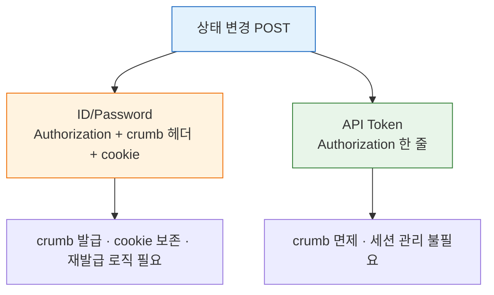
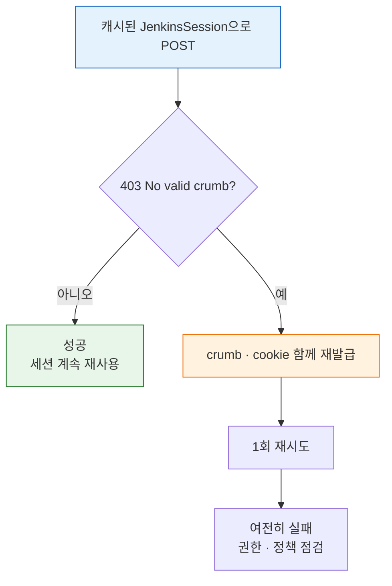

# 젠킨스 인증 모델과 TPS 패턴 (2.222+)

> **본 문서는 spec(`03-01.md`)을 읽었다고 가정한 코드 패턴 모음**입니다. 인증 API의 호출 순서, crumb·cookie의 발급 절차, 응답 필드 구조는 spec에 있습니다. 이 문서는 그 위에서 "왜 인증 모델이 단순해졌는지"와 "TPS 코드에서 어떤 패턴이 자리 잡았는지"를 정리합니다.

## 학습 목표

> 이 문서를 읽고 나면 Jenkins 2.222+에서 API Token이 crumb를 면제받는 이유를 **설명하고**, `JenkinsSession`·Feign URI override·공통 `FeignJenkinsConfig` 세 패턴이 인증 복잡도를 어떻게 격리하는지 코드로 **비교하며**, crumb·cookie 만료 시 403 재시도 전략을 **설계할** 수 있습니다.

## 사전 지식

> 03-01의 crumb + cookie 인증 흐름을 알고 있다면, 이 문서는 그 흐름을 "객체 하나로 캡슐화하고, 인증 수단이 Token으로 바뀌면 필드가 줄어드는" 코드 진화로 일반화한 것입니다.

## 진입 — 같은 호출을 두 인증 수단으로 짜면 코드가 갈라진다

> 같은 빌드 트리거 POST 하나를 ID/Password로 짜느냐 API Token으로 짜느냐에 따라, 한쪽은 crumb 발급·cookie 보존·재발급 분기를 모두 안고 가야 하고 다른 쪽은 헤더 한 줄로 끝납니다.

spec(`03-01`)은 "현재 환경에서 인증 API를 어떻게 호출하는가"를 다뤘습니다. 그런데 인증 *수단*이 무엇이냐에 따라 같은 상태 변경 POST의 코드 형상이 통째로 달라집니다. ID/Password는 GET/POST 분기, crumb 캐시, cookie 보존을 모두 짊어지지만 API Token은 `Authorization` 헤더 하나로 통일됩니다. 이 문서는 그 갈림길을 코드로 보이고, TPS가 인증 복잡도를 어떻게 한곳에 가둬 사용처를 깨끗하게 유지하는지 정리합니다.

## 1. Jenkins 2.222+에서 바뀐 점 — 짧게

> API Token 인증은 crumb 검증을 면제받습니다. crumb 자체가 사라진 게 아니라 Token 호출이 그 단계를 건너뛴다는 뜻입니다.

> 이 면제는 이미 아는 "HTTP BASIC 인증"의 **CSRF 측면**입니다. BASIC 자격증명을 `--user USER:TOKEN`으로 보내는 것은 동일하고, 달라지는 건 그 요청이 crumb 단계를 거치는가뿐입니다.

Jenkins 2.222부터 **API Token 인증 요청은 CSRF crumb 검증 대상에서 제외**됩니다. 공식 문서도 "API token 인증 요청은 CSRF 보호(crumb)에서 면제된다"고 명시합니다(출처: jenkins.io/doc/book/security/csrf-protection). 같은 이유로 Remote Access API 문서는 crumb보다 API token을 권장합니다 — "API tokens are preferred instead of crumbs for CSRF protection."(출처: jenkins.io/doc/book/using/remote-access-api). `/crumbIssuer/api/json` 자체가 사라진 것이 아니라, API Token 기반 호출은 crumb 발급 단계를 건너뛸 수 있다는 뜻입니다.

API token이 권장되는 또 다른 이유는 폐기 비용입니다. 토큰이 노출되면 그 토큰만 폐기하면 되고 비밀번호는 그대로 둘 수 있습니다. 비밀번호를 직접 쓰면 노출 시 비밀번호 자체를 바꿔야 합니다(출처: jenkins.io/doc/book/security/managing-security).

| 인증 방식 | POST에서 crumb | cookie | 특징 |
|-----------|----------------|--------|------|
| ID/Password | 필요 | 필요 | 현재 TPS 검증 환경 (`03-01` 흐름 유지) |
| API Token | 불필요 | 불필요 | 2.222+ 권장 — GET/POST 인증 헤더 통일 가능 |

이 차이는 코드 구조에 직접 영향을 줍니다. ID/Password는 GET/POST 분기, crumb 캐시, cookie 보존 로직을 모두 가져야 하지만, API Token은 `Authorization: Basic <user:token>` 한 줄로 통일됩니다.

두 인증 수단이 POST에서 요구하는 재료를 비교하면 다음과 같습니다:



> 주의: 운영 환경이 ID/Password 인증이면 2.462.3·2.504 같은 최신 LTS여도 `03-01` crumb + cookie 흐름이 여전히 맞습니다. "최신 버전 = 자동 단순화"가 아니라 "**인증 수단**과 **`useCrumbs` 정책**"이 결정합니다.

## 2. JenkinsAuthVo / JenkinsSession 패턴

> 인증 재료를 호출마다 흩뿌리지 않고 객체 하나에 묶어, 사용처는 세 헤더만 꺼내 쓰게 만드는 패턴입니다.

> 이 캡슐화는 이미 아는 "DTO로 흩어진 파라미터를 한 객체에 모으는" 발상의 인증 재료 버전입니다.

`JenkinsSession`은 출입증 지갑에 비유할 수 있습니다. 신분증(Basic Auth)·일회용 출입 도장(crumb)·당일 방문 스티커(cookie)를 지갑 하나에 넣어 두면, 문을 지날 때마다 지갑만 꺼내면 됩니다. 이 비유는 "재료를 한곳에 묶는다"까지 유효하고, **스티커가 시간이 지나면 떼져 버린다는 점**(cookie·crumb 만료)에서 깨집니다 — 지갑은 그대로인데 안의 스티커만 무효가 되므로, §5의 재발급 전략이 별도로 필요합니다.

핵심은 인증 재료를 호출마다 흩뿌리지 않고 하나의 객체로 캡슐화하는 것입니다. ID/Password 환경에서는 `JenkinsSession` 형태로 세션 문맥을 통째로 다룹니다.

```java
public record JenkinsSession(
    URI baseUrl,
    String basicAuth,
    String crumbRequestField,
    String crumb,
    String cookie
) {}
```

발급 흐름은 응답 본문에서 `crumb`/`crumbRequestField`를, 응답 헤더 `Set-Cookie`에서 `JSESSIONID`를 추출해 한 번에 묶습니다.

```java
ResponseEntity<CrumbResponse> response =
    jenkinsFeignClient.getCrumb(baseUrl, basicAuth);

String cookie = response.getHeaders()
    .getValuesAsList(HttpHeaders.SET_COOKIE)
    .stream()
    // crumb는 발급 응답을 준 그 세션에 묶이므로, 같은 JSESSIONID를
    // 후속 POST에 동반해야 검증을 통과한다. 속성(; 이후)은 버리고 값만 남긴다
    .map(value -> value.split(";", 2)[0])
    .collect(Collectors.joining("; "));

JenkinsSession session = new JenkinsSession(
    baseUrl,
    basicAuth,
    response.getBody().crumbRequestField(),  // 헤더 이름이 인스턴스마다 다를 수 있어 함께 보관
    response.getBody().crumb(),
    cookie
);
```

이후 POST는 `Authorization` + `session.crumbRequestField(): session.crumb()` + `Cookie: session.cookie()` 세 헤더만 다시 꺼내 씁니다. crumb·cookie 발급 메커니즘 자체는 `03-01` §3을 참조합니다.

API Token 환경으로 전환되면 객체는 두 필드로 줄어듭니다.

```java
public record JenkinsAuth(String basicAuth, URI jenkinsUrl) {}
```

## 3. Feign URI Override 패턴

> 하나의 Feign Client로 여러 Jenkins 서버를 호출하기 위해, 첫 파라미터로 받은 URI로 대상 서버를 런타임에 덮어쓰는 패턴입니다.

TPS는 하나의 Feign Client로 다수의 Jenkins 서버를 호출해야 하므로, 첫 번째 파라미터로 `URI baseUrl`을 받아 런타임에 실제 Jenkins URL을 덮어씁니다.

```java
@FeignClient(
    name = "jenkins",
    url = "https://",
    configuration = FeignJenkinsConfig.class
)
public interface JenkinsFeignClient {

    // 첫 파라미터 URI는 Feign이 url="https://" 더미를 런타임에 덮어쓰게 한다.
    // 덕분에 Client 하나로 DB에 저장된 서로 다른 Jenkins 서버를 모두 호출한다
    @GetMapping("/crumbIssuer/api/json")
    ResponseEntity<JenkinsAuthVo> getCrumb(
        URI baseUrl,
        @RequestHeader("Authorization") String basicAuth  // Basic 자격증명을 호출 문맥에 직접 실어 인스턴스별 인증 분기를 없앤다
    );
}
```

이 패턴 덕분에 DB에 저장된 Jenkins URL을 그대로 활용할 수 있고, 인증 정보와 대상 서버를 한 요청 문맥 안에서 다룰 수 있습니다.

`FeignJenkinsConfig`는 단순 HTTP 설정이 아니라 Jenkins 연동 규칙(요청·응답 로깅 통일, 자체 서명 인증서 대응, 공통 헤더 정책)의 집합입니다. 검증 환경에서 `curl -k`가 필요한 것과 같은 이유로, 코드에서도 개발/운영의 SSL 처리 정책을 분리하는 것이 핵심입니다.

## 4. 현대화 시 줄일 수 있는 것

> Token 환경으로 통일하면 crumb 관련 필드·메서드·캐시·헤더 분기가 통째로 사라집니다. "현대화"의 실효는 개념이 아니라 코드 복잡도 감소입니다.

API Token 환경으로 통일되면 다음 요소를 모두 제거할 수 있습니다 — `crumb`·`cookie`·`crumbRequestField` 필드, crumb 조회 메서드, crumb 캐시, POST 전용 헤더 분기.

```java
// Before — ID/Password
private HttpHeaders buildPostHeaders(long jenkinsInstanceId) {
    var headers = buildGetHeaders(jenkinsInstanceId);
    var crumb = getCrumb(jenkinsInstanceId);
    if (crumb != null) {
        headers.set(crumb.crumbRequestField, ...);
        headers.set("Cookie", crumb.cookie);
    }
    return headers;
}

// After — API Token
private HttpHeaders buildHeaders(long jenkinsInstanceId) {
    var headers = new HttpHeaders();
    headers.set("Authorization", "Basic " + getBasicAuth(jenkinsInstanceId));
    return headers;
}
```

"현대화"의 실질적 효과는 인증 개념 변화가 아니라 **코드 복잡도 감소**입니다.

## 5. crumb·cookie 만료와 갱신 전략

> crumb는 세션·IP에 묶인 CSRF 값이라 환경이 바뀌면 무효화됩니다. 매번 새로 받지 말고 캐시한 뒤 403이 나면 한 번만 재발급하는 전략이 현실적입니다.

crumb은 "고정 토큰"이 아닙니다. 기본 Crumb Issuer는 **사용자 이름 + 웹 세션 ID + 인스턴스 고유 salt**를 인코딩해 만듭니다(출처: jenkins.io/doc/book/security/csrf-protection). 그래서 세션이 바뀌거나 IP가 변하면(프록시 환경) 무효화될 수 있습니다. cookie는 일반 세션 만료(`--sessionTimeout`, 미설정 시 기본 60분)로 끊깁니다. `Enable proxy compatibility`를 켜면 IP 조건은 제외할 수 있습니다.

crumb 한 개를 캐시해 60분 세션 동안 N번의 POST에 재사용하면, 매 POST마다 `GET /crumbIssuer/api/json`을 선행하는 방식 대비 crumb 발급 왕복을 N−1번 절약합니다. 예를 들어 한 세션에서 빌드 트리거를 20번 보낸다면 crumb 발급 호출은 20번에서 1번으로 줄어듭니다.

운영 코드의 현실적인 전략은 다음과 같습니다.

- 매 POST마다 crumb을 새로 받지 않습니다 — `JenkinsSession`을 메모리에 캐시합니다.
- POST에서 `403 No valid crumb was included in the request`가 나오면 crumb·cookie를 함께 재발급하고 1회만 재시도합니다.
- Jenkins 세션 타임아웃을 알고 있다면 그보다 조금 이르게 선제 갱신합니다.

매 요청마다 `GET /crumbIssuer/api/json`을 선행하거나, crumb·cookie를 파일에 장기 보관해 재사용하는 방식은 비효율적입니다.

캐시된 세션으로 POST를 보내다 403이 나면 한 번만 재발급해 재시도하는 흐름은 다음과 같습니다:



## 6. 버전별 기억할 것

> 버전 번호 자체보다 "지금 무엇으로 인증하는가"와 "현재 보안 정책"이 crumb 필요 여부를 결정합니다.

| Jenkins 버전 | 인증 영향 |
|-------------|----------|
| 2.222 | API Token 인증 시 crumb 면제 도입 |
| 2.462.3 | 현재 검증 환경. 비밀번호 인증이면 crumb 흐름 유지 |
| 2.504 | 최근 LTS — crumb 면제 원칙 유지 |

버전 자체보다 중요한 건 **지금 무엇으로 인증하는가**와 **현재 Jenkins의 보안 정책**입니다.

## 7. 문서 사용 가이드

- `03-01`: 현재 환경에서 인증 API를 어떻게 호출하는가 (spec)
- `03-02` (이 문서): 인증 모델이 왜 달라지는가, TPS 코드에서 무엇이 패턴인가
- `03-03`: API Token을 실제로 어떻게 발급하고 회전할 것인가
- `05-01`: 인증이 끝난 뒤 빌드 실행 POST를 어떻게 보내는가
- `06-01`: 빌드 이후 상태를 어떻게 추적하는가

## 8. 핵심 정리

1. Jenkins 2.222+에서 API Token 인증은 crumb 검증에서 면제됩니다 — 그래서 GET/POST 인증 규칙을 통합할 수 있습니다.
2. 다만 ID/Password 환경에서는 spec의 crumb + cookie 흐름이 여전히 맞습니다. crumb·cookie는 인증 대체재가 아니라 비밀번호 POST의 세션·CSRF 검증 보조 재료입니다.
3. TPS 코드는 `JenkinsSession`(또는 `JenkinsAuth`) + Feign URI override + 공통 `FeignJenkinsConfig` 세 패턴을 축으로 인증 복잡도를 격리합니다.

## 9. 면접 질문

> 답을 떠올린 뒤 §정답 절에서 같은 번호로 대조하세요.

1. Jenkins 2.222+에서 API Token이 crumb 면제를 받는데도, 어떤 환경에서는 여전히 crumb + cookie 흐름을 써야 합니다. 그 환경은 무엇이고 왜인가요?
2. `JenkinsSession` 같은 객체로 인증 재료를 캡슐화하면 사용처 코드에서 무엇이 줄어드나요?
3. 하나의 Feign Client로 여러 Jenkins 서버를 호출하려면 어떤 패턴을 쓰며, 그 덕분에 무엇을 그대로 활용할 수 있나요?

### 빈칸 채우기 — 인증 모델 전환

1. Jenkins 공식 문서는 CSRF 보호 목적에서 crumb 대신 ___을 권장하며, 그 이유 중 하나는 노출 시 ___만 폐기하면 되고 ___은 그대로 둘 수 있기 때문입니다.
2. 기본 Crumb Issuer가 만드는 crumb는 사용자 이름 + ___ + 인스턴스 고유 ___를 인코딩한 값이라, 세션이나 IP가 바뀌면 ___될 수 있습니다.
3. ID/Password 환경에서 POST가 `403 No valid crumb`를 반환하면, crumb·cookie를 함께 재발급하고 ___회만 재시도하는 전략이 현실적입니다.

## 정답

> 위 질문을 스스로 설명해 본 뒤에 펼치세요.

### 정답 1 — crumb 흐름이 여전히 맞는 환경

운영이 **ID/Password 인증 + `useCrumbs: true`** 환경이면, 2.462.3·2.504 같은 최신 LTS여도 crumb + cookie 흐름이 맞습니다. crumb 면제는 어디까지나 **API Token 인증 요청**에만 적용되기 때문입니다. 버전이 아니라 "인증 수단과 `useCrumbs` 정책"이 결정합니다.

### 정답 2 — 캡슐화가 줄이는 것

인증 재료(Basic Auth·crumb·crumbRequestField·cookie)를 호출마다 따로 조립하지 않고 `JenkinsSession` 하나에서 꺼내 쓰므로, POST 헤더 구성 코드가 단순해지고 crumb 캐시·cookie 보존 로직이 한곳으로 모입니다. Token 환경으로 바뀌면 같은 자리에서 객체만 두 필드로 줄이면 됩니다.

### 정답 3 — Feign URI override

`@FeignClient`의 첫 파라미터로 `URI baseUrl`을 받아 런타임에 대상 Jenkins URL을 덮어쓰는 패턴을 씁니다. 덕분에 DB에 저장된 Jenkins URL을 그대로 호출 대상에 쓸 수 있고, 인증 정보와 대상 서버를 한 요청 문맥 안에서 함께 다룰 수 있습니다.

### 빈칸 정답 — 인증 모델 전환

1. **API token** / **토큰** / **비밀번호**. 공식 문서가 crumb 대신 API token을 권장하는 근거 중 하나가 폐기 비용입니다(출처: jenkins.io/doc/book/using/remote-access-api, managing-security).
2. **웹 세션 ID** / **salt** / **무효화**. 기본 Crumb Issuer 구성 요소이므로 세션·IP 변화에 취약합니다(출처: jenkins.io/doc/book/security/csrf-protection).
3. **1**. 캐시된 세션이 만료됐을 수 있으니 한 번 재발급해 재시도하고, 그래도 실패하면 권한·정책 문제로 봅니다.

## 참고 링크

- [Jenkins CSRF Protection](https://www.jenkins.io/doc/book/security/csrf-protection/)
- [Jenkins Initial Settings](https://www.jenkins.io/doc/book/installing/initial-settings/)
- [Jenkins Remote Access API](https://www.jenkins.io/doc/book/using/remote-access-api/)
- [Jenkins LTS Changelog](https://www.jenkins.io/changelog-stable/)

## 관련 문서

> 이 문서는 인증 모델의 "왜"와 TPS 패턴을 다룹니다. 호출 절차의 정확한 스펙, 토큰 운영, 인증 이후 단계는 아래 문서로 이어집니다.

- [03-01. 인증 API 스펙 (ID-Password + Crumb)](03-01.%EC%9D%B8%EC%A6%9D%20API%20%EC%8A%A4%ED%8E%99%20%28ID-Password%20%2B%20Crumb%29.md) § "crumb 발급 흐름" — 이 문서가 전제하는 호출 순서·응답 필드 스펙
- [03-03. API 토큰 발급·회전·수명 점검](03-03.API%20%ED%86%A0%ED%81%B0%20%EB%B0%9C%EA%B8%89%C2%B7%ED%9A%8C%EC%A0%84%C2%B7%EC%88%98%EB%AA%85%20%EC%A0%90%EA%B2%80.md) § "토큰 회전" — crumb 면제를 누리는 API token을 실제로 발급·회전하는 점검
- [05-02. 빌드 실행·큐 모델과 TPS 패턴 (2.222+)](05-02.%EB%B9%8C%EB%93%9C%20%EC%8B%A4%ED%96%89%C2%B7%ED%81%90%20%EB%AA%A8%EB%8D%B8%EA%B3%BC%20TPS%20%ED%8C%A8%ED%84%B4%20%282.222%2B%29.md) § "빌드 트리거 POST" — 인증이 끝난 뒤 상태 변경 POST를 보내는 다음 단계
- [08-02. API 크레덴셜 관리 현대화 (2.222+)](08-02.API%20%ED%81%AC%EB%A0%88%EB%8D%B4%EC%85%9C%20%EA%B4%80%EB%A6%AC%20%ED%98%84%EB%8C%80%ED%99%94%20%282.222%2B%29.md) § "크레덴셜 저장" — Jenkins 측 자격증명을 다루는 인접 주제
- [../02_security/ — 인증·인가 학습 MOC](../02_security/README.md) — Basic 인증·SSL·자체 서명 인증서 처리의 보안 배경
