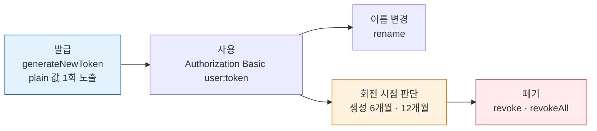
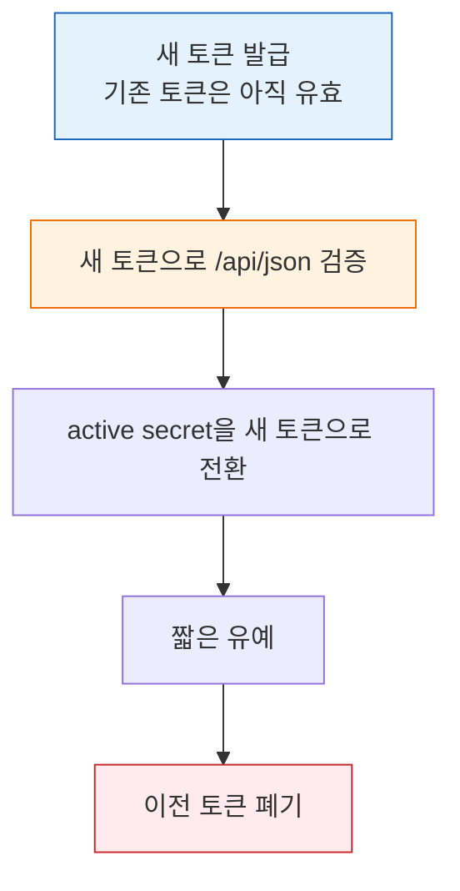

# 젠킨스 API 토큰 발급·회전·수명 점검
---
> 이 문서를 읽고 나면 `generateNewToken`으로 토큰을 **발급**하고, `rename`·`revoke`·`revokeAll`로 **관리**하며, 2.462.3에는 "자동 만료 시각"이 없다는 사실 위에서 이름 규칙·중첩 회전 전략을 **선택**해 수명을 점검할 수 있습니다.
>
> - 현재 검증 기준은 Jenkins `2.462.3`입니다.
> - 현재 버전에서는 토큰 "만료 시각"을 다루는 표준 REST 흐름보다 발급·회전 중심으로 보는 편이 맞습니다.

## 사전 지식

> 02-01에서 본 API Token 발급(`generateNewToken`)을 알고 있다면, 이 문서는 그 한 번의 발급을 "이름 변경·폐기·회전까지 포함한 수명 주기 관리"로 확장한 것입니다.

## 진입 — 한 번 발급한 토큰을 왜 "수명 주기"로 다뤄야 하는가

> 토큰을 한 번 발급하고 끝낸다고 가정하면 노출 사고·장기 잔존 토큰·회전 누락이 누적됩니다. 발급은 시작점일 뿐이고, 실제 운영 리스크는 그 뒤의 이름·폐기·회전을 관리하지 못할 때 생깁니다.

비밀번호는 노출되면 비밀번호 자체를 바꿔야 하지만, API 토큰은 노출돼도 그 토큰만 폐기하면 됩니다. Jenkins 공식 보안 가이드가 비밀번호 대신 API token을 권장하는 핵심 이유가 이 점입니다. "노출 시 해당 토큰만 폐기하면 되고 비밀번호는 그대로 유지된다"는 격리성이 토큰의 가치입니다(출처: jenkins.io/doc/book/security/managing-security). 그래서 토큰은 "한 번 만든 비밀값"이 아니라 발급·사용·이름변경·회전·폐기로 이어지는 수명 주기 객체로 다루는 편이 맞고, 이 문서는 그 전체 흐름을 2.462.3 기준 endpoint와 묶어 정리합니다.

## 1. 이 문서의 결론

> 토큰 수명 주기는 이미 아는 "발급(`generateNewToken`)"의 *시간 축* 측면입니다. 02-01의 한 번짜리 발급에 "그 뒤 어떻게 이름 붙이고, 언제 회전하고, 어떻게 폐기하는가"를 더한 것입니다.

현재 Jenkins `2.462.3` 기준으로 먼저 결론부터 정리하면 다음과 같습니다:

- 토큰 발급, 이름 변경, 폐기용 endpoint는 있습니다.
- 현재 버전 기준으로 토큰 발급 요청은 `newTokenName`만 받습니다.
- 현재 버전 기준으로 "토큰 만료 시각"을 직접 지정하거나 조회하는 표준 REST 흐름은 문서화하기 어렵습니다.
- 대신 Jenkins는 토큰의 생성 시점과 마지막 사용 시점 기반으로 회전을 유도합니다.
- 공식 안내 기준으로 토큰은 6개월이 지나면 회전을 고려하고, 12개월이 지나면 더 강하게 교체를 권장합니다.

즉 현재 문서에서 말하는 "만료 체크"는 보통 아래 의미로 봅니다:

- 이 토큰이 언제 만들어졌는가
- 마지막으로 언제 사용됐는가
- 내부 정책상 언제 교체할 것인가

자동 만료 시간이 박혀 있는 형태와는 다릅니다.

토큰 하나가 거치는 수명 주기를 한눈에 보면 다음과 같습니다:




## 2. 이 문서의 범위

> 이 문서는 API Token 관련 아래 흐름만 설명합니다.
>
> - 토큰 발급
> - 토큰 이름 변경
> - 특정 토큰 폐기
> - 전체 토큰 폐기
> - 현재 버전에서 수명 점검을 어떻게 해석할지

기본 인증 확인과 crumb/cookie 준비는 별도 문서에서 다룹니다:

- `03-01.인증 API 스펙 (ID-Password + Crumb).md`
- `03-02.인증 모델과 TPS 패턴 (2.222+).md`

이 문서의 endpoint 경로는 Jenkins 공식 `DescriptorImpl` 메서드명과 Stapler URL 규칙을 바탕으로 정리했습니다. 즉 아래 경로 구성은 공식 Java API에서 `doGenerateNewToken`, `doRename`, `doRevoke`, `doRevokeAll` 메서드가 존재한다는 점을 근거로 한 실무형 정리입니다.


## 3. 공통 요청 규칙

> 현재 환경처럼 아직 토큰이 주력이 아니고 `ID/Password + crumb + cookie`가 기본이면, 토큰 발급 요청도 같은 인증 재료로 보냅니다.

먼저 변수부터 준비합니다:

```bash
export TOKEN_API_PATH="/user/${JENKINS_USER}/descriptorByName/jenkins.security.ApiTokenProperty"
export TOKEN_NAME='api-doc-token-1'
export TOKEN_UUID=''
```

`03-01`를 먼저 수행했다면 아래 값은 이미 준비된 상태입니다:

- `JENKINS_URL`
- `JENKINS_USER`
- `JENKINS_PASS`
- `cookies.txt`
- `crumb.json`
- `CRUMB`
- `CRUMB_FIELD`

현재 문서에서 의미하는 값은 다음과 같습니다:

| 변수 | 의미 | 예시 |
|------|------|------|
| `TOKEN_API_PATH` | 현재 사용자 기준 API Token 관리 경로 | `/user/admin/descriptorByName/jenkins.security.ApiTokenProperty` |
| `TOKEN_NAME` | 새로 만들 토큰 이름 | `api-doc-token-1` |
| `TOKEN_UUID` | 기존 토큰 식별자 | `3b1d...` |

응답 확인 원칙은 다음과 같습니다:

- 토큰 발급은 body를 파일로 저장해서 확인합니다.
- 이름 변경/폐기는 본문보다 상태 코드가 중요합니다.
- 새 plain token 값은 발급 직후 응답에서만 확인하고, 이후 다시 조회되지 않는다고 보는 편이 안전합니다.
- 발급 직후에는 실제 읽기 또는 쓰기 API 하나로 토큰이 바로 동작하는지 확인하는 편이 안전합니다.


## 4. 토큰 발급 API

### 4-1. `POST /user/{userId}/descriptorByName/jenkins.security.ApiTokenProperty/generateNewToken`

> 현재 사용자 기준 새 API Token을 발급합니다.

요청 형식은 다음과 같습니다:

```http
POST /user/{userId}/descriptorByName/jenkins.security.ApiTokenProperty/generateNewToken HTTP/1.1
Authorization: Basic <...>
Jenkins-Crumb: <crumb>
Cookie: <session-cookie>
Content-Type: application/x-www-form-urlencoded
```

현재 버전 기준으로 가장 중요한 입력값은 `newTokenName`입니다.

```bash
# -o token-create-response.json: plain token 값은 발급 직후 응답에만 있으므로 파일로 박제해 둔다
# -b cookies.txt + crumb: 아직 비밀번호 인증이므로 CSRF crumb + 세션 cookie를 동반해야 한다
# --data-urlencode: 공식 입력값은 newTokenName 단 하나(2.462.3엔 expirationDate 입력이 없다)
curl -k -sS -D headers.txt -o token-create-response.json -w 'HTTP_STATUS=%{http_code}\n' \
  -X POST -b cookies.txt \
  -u "${JENKINS_USER}:${JENKINS_PASS}" \
  -H "${CRUMB_FIELD}: ${CRUMB}" \
  --data-urlencode "newTokenName=${TOKEN_NAME}" \
  "${JENKINS_URL}${TOKEN_API_PATH}/generateNewToken"

cat headers.txt
cat token-create-response.json
```

응답이 JSON이면 다음처럼 볼 수 있습니다:

```bash
jq . token-create-response.json
```

현재 Jenkins `2.462.3` 계열 환경에서는 성공 응답이 다음처럼 내려올 수 있습니다:

```json
{
  "status": "ok",
  "data": {
    "tokenName": "api-doc-token-1",
    "tokenUuid": "0b7f3d2a-4c67-4c2d-9c0e-123456789abc",
    "tokenValue": "11b6d5d2b4f84f5f9a0c8f2b9d1e3a4c56"
  }
}
```

위 응답에서 `tokenUuid`는 이후 rename·revoke가 토큰을 식별하는 키이고, `tokenValue`는 평문 원문입니다. Jenkins는 발급 이후 토큰을 해시로만 보관하므로 `tokenValue`를 다시 내려주는 조회 API가 없습니다. 그래서 발급 응답을 파일에 저장해 둔 위 흐름이 사실상 원문을 확보할 마지막 기회입니다.

환경이나 래핑 방식에 따라 JSON 최상위에 `status`, `data`가 한 번 더 감싸질 수 있습니다. 따라서 실무에서는 최소한 아래 3개 값을 기준으로 응답을 읽는 편이 안전합니다:

- `tokenUuid`: 이후 rename/revoke 시 식별자로 사용
- `tokenName`: 사람이 보는 표시 이름
- `tokenValue`: 발급 직후 한 번만 확인 가능한 plain token 값

현재 Jenkins 구현상 plain token 값은 발급 직후에만 확인 가능한 것으로 이해하는 편이 맞습니다. 따라서 발급 직후 응답 body를 바로 확인해야 합니다.

### 4-2. 발급한 토큰으로 실제 API 호출 예시

토큰이 실제 호출에 바로 쓸 수 있는지 확인하려면, 발급 직후 가벼운 읽기 API나 단순한 설정 변경 API를 한 번 호출해 보는 편이 안전합니다.

먼저 발급 응답에서 `tokenValue`를 꺼내 shell 변수로 저장합니다:

```bash
export JENKINS_TOKEN=$(jq -r '.tokenValue // .data.tokenValue' token-create-response.json)
```

`401 Unauthorized`가 나오면 가장 먼저 이 값을 확인합니다:

```bash
printf 'TOKEN_LEN=%s\n' "${#JENKINS_TOKEN}"
printf 'TOKEN_PREVIEW=%s\n' "${JENKINS_TOKEN:0:8}"
```

길이가 `0`이거나 `null` 문자열이면 `jq` 경로를 잘못 읽은 것입니다. 실제 응답이 `{"status":"ok","data":{...}}` 형태라면 반드시 `.data.tokenValue`를 꺼내야 합니다.

예를 들어 기존 파이프라인의 `config.xml`을 토큰으로 바로 덮어쓰는 예시는 다음과 같습니다:

```bash
export PIPELINE_STRUCT='/job/SBH/job/TEST'

# -u user:TOKEN: API token은 HTTP BASIC으로 비밀번호 자리에 넣는다(출처: jenkins.io/.../remote-access-api)
# crumb·cookie를 붙이지 않는 이유: API token 인증 요청은 CSRF crumb 면제 대상이라 POST에도 crumb이 불필요하다
curl -k -sS -i -w '\nHTTP_STATUS=%{http_code}\n' -X POST \
  -u "${JENKINS_USER}:${JENKINS_TOKEN}" \
  -H "Content-Type: application/xml" \
  --data-binary @04-01.sample-pipeline-config.xml \
  "${JENKINS_URL}${PIPELINE_STRUCT}/config.xml"
```

- Jenkins 공식 안내 기준으로 API 토큰 인증 요청은 CSRF crumb 면제 대상입니다. 공식 문서는 CSRF 보호 측면에서 "crumb보다 API token이 선호된다"고 명시합니다(출처: jenkins.io/doc/book/using/remote-access-api, jenkins.io/doc/book/security/csrf-protection). 따라서 일반적인 구성에서는 이 요청에 crumb과 session cookie를 따로 붙이지 않습니다.
- 즉 비밀번호 인증 POST는 `Authorization + crumb + cookie` 조합으로 보고, API 토큰 POST는 보통 `Authorization + Content-Type`만 있으면 된다고 이해하면 됩니다. 비밀번호 인증은 crumb 발급(`/crumbIssuer/api`)과 세션 쿠키 동반이 필요하지만, 토큰 인증은 이 단계가 통째로 사라집니다(출처: jenkins.io/doc/book/security/csrf-protection).

에러 케이스는 다음과 같습니다:

| 상태 코드 | 의미 | 대응 |
|-----------|------|------|
| `200` | 발급 요청 처리 성공 | 응답 body에서 토큰 값 확인 |
| `400` | 요청 형식 오류 | `newTokenName` 확인 |
| `403` | 권한 부족 또는 crumb 문제 | 인증/권한 확인 |
| `404` | 경로 오류 | `TOKEN_API_PATH` 확인 |


## 5. 토큰 이름 변경 API

### 5-1. `POST /user/{userId}/descriptorByName/jenkins.security.ApiTokenProperty/rename`

> 기존 토큰의 표시 이름을 바꿉니다.

요청 형식은 다음과 같습니다:

```http
POST /user/{userId}/descriptorByName/jenkins.security.ApiTokenProperty/rename HTTP/1.1
Authorization: Basic <...>
Jenkins-Crumb: <crumb>
Cookie: <session-cookie>
Content-Type: application/x-www-form-urlencoded
```

예시는 다음과 같습니다:

```bash
export TOKEN_UUID='PUT_TOKEN_UUID_HERE'
export TOKEN_NAME='api-doc-token-renamed'

curl -k -sS -D headers.txt -o /dev/null -w 'HTTP_STATUS=%{http_code}\n' \
  -X POST -b cookies.txt \
  -u "${JENKINS_USER}:${JENKINS_PASS}" \
  -H "${CRUMB_FIELD}: ${CRUMB}" \
  --data-urlencode "tokenUuid=${TOKEN_UUID}" \
  --data-urlencode "newName=${TOKEN_NAME}" \
  "${JENKINS_URL}${TOKEN_API_PATH}/rename"

cat headers.txt
```


## 6. 토큰 폐기 API

### 6-1. `POST /user/{userId}/descriptorByName/jenkins.security.ApiTokenProperty/revoke`

> 특정 토큰 하나를 폐기합니다.

예시는 다음과 같습니다:

```bash
export TOKEN_UUID='PUT_TOKEN_UUID_HERE'

curl -k -sS -D headers.txt -o /dev/null -w 'HTTP_STATUS=%{http_code}\n' \
  -X POST -b cookies.txt \
  -u "${JENKINS_USER}:${JENKINS_PASS}" \
  -H "${CRUMB_FIELD}: ${CRUMB}" \
  --data-urlencode "tokenUuid=${TOKEN_UUID}" \
  "${JENKINS_URL}${TOKEN_API_PATH}/revoke"

cat headers.txt
```

### 6-2. `POST /user/{userId}/descriptorByName/jenkins.security.ApiTokenProperty/revokeAll`

> 현재 사용자의 토큰을 전부 폐기합니다.

예시는 다음과 같습니다:

```bash
curl -k -sS -D headers.txt -o /dev/null -w 'HTTP_STATUS=%{http_code}\n' \
  -X POST -b cookies.txt \
  -u "${JENKINS_USER}:${JENKINS_PASS}" \
  -H "${CRUMB_FIELD}: ${CRUMB}" \
  "${JENKINS_URL}${TOKEN_API_PATH}/revokeAll"

cat headers.txt
```

`revokeAll`은 영향이 크므로 실습 환경에서만 실행하는 편이 맞습니다.


## 7. 만료 시간 체크는 어떻게 보나

### 7-1. 현재 Jenkins 2.462.3 기준

현재 버전 기준으로는 토큰이 "몇 시 몇 분에 자동 만료된다"는 식의 표준 REST 흐름으로 보기 어렵습니다.

공식 근거는 두 가지입니다:

- Jenkins `2.462.3`의 `ApiTokenProperty` Java API는 `generateNewToken(String name)`까지만 보입니다.
- 같은 버전의 `DescriptorImpl`도 `doGenerateNewToken(User u, String newTokenName)`까지만 보입니다.

즉 현재 버전 기준으로는 발급 시점에 `expirationDate`를 같이 넣는 인터페이스가 보이지 않습니다.

### 7-2. 현재 버전에서 실제로 점검할 것

현재 버전에서 수명 점검은 보통 아래 기준으로 해석합니다:

- 생성된 지 얼마나 지났는가
- 마지막으로 언제 사용됐는가
- 조직 정책상 몇 개월 주기로 교체할 것인가

Jenkins 공식 안내는 다음과 같습니다:

- 6개월이 지나면 회전 필요성을 더 강하게 드러냅니다.
- 12개월이 지나면 더 강하게 교체를 권장합니다.

즉 현재 환경에서는 "절대 만료 시각"보다는 "회전 권장 시점"으로 이해하는 편이 정확합니다. 수치로 옮기면, `2026-04`에 발급한 토큰은 `2026-10`(6개월) 시점에 회전 후보로 표시하고, `2027-04`(12개월)을 넘기면 교체 우선순위를 올립니다. 만료 시각이 박혀 있다면 시스템이 자동으로 끊지만, 박혀 있지 않은 2.462.3에서는 이 6/12개월 경계를 *운영 메타데이터의 발급 시각과 비교하는 배치*로 직접 만들어야 한다는 뜻입니다.

### 7-3. 운영에서 권장하는 방법

현재 버전 기준으로는 다음 방식이 가장 실용적입니다:

- 토큰 이름에 용도와 발급월을 넣습니다.
  - 예: `tps-api-202604`
- 발급 시점을 별도 문서나 시스템 메타데이터에 기록합니다.
- 6개월 주기로 재발급 후 이전 토큰을 폐기합니다.
- 장기 미사용 토큰은 last-use 기준으로 정리합니다.

### 7-4. 최신 버전과의 차이

최신 Jenkins Java API 문서에는 `generateNewToken(String name, LocalDate expirationDate)` 형태가 보입니다. 따라서 더 최신 버전에서는 만료일 개념이 코어 레벨에 들어간 것으로 읽힙니다.

다만 현재 검증 환경은 `2.462.3`이므로, 이 문서에서는 최신 코어 시그니처를 바로 실사용 전제로 쓰지 않습니다. 버전 업그레이드 후 실제 endpoint와 응답 형식을 다시 검증하는 편이 맞습니다.


## 8. 운영 설계 의견

> 여러 Jenkins 인스턴스를 운영하면서 토큰 기반 호출로 전환하려면, 토큰 발급 API 자체보다 저장 구조와 회전 전략을 먼저 분리해서 설계하는 편이 맞습니다.

최종 판단은 다음처럼 정리할 수 있습니다:

- 여러 Jenkins + DB 메타관리: 좋습니다.
- 헬스 체크 별도 관리: 좋습니다.
- 토큰으로 crumb 제거 시도: 좋습니다.
- 토큰 원문을 DB 저장: 비추천입니다.
- 헬스 체크와 토큰 회전 결합: 비추천입니다.
- 비밀번호 완전 제거: 가능하지만 부트스트랩/복구 수단 설계 후 진행하는 편이 맞습니다.

### 8-1. 왜 DB 메타관리는 괜찮은가

여러 Jenkins를 운영하면 인스턴스별 URL, 계정, 버전, 인증 방식, capability를 DB 메타데이터로 관리하는 것은 자연스럽습니다.

예를 들어 DB에는 아래 같은 정보가 들어갈 수 있습니다:

- Jenkins base URL
- username
- 현재 인증 모드
- 버전
- 마지막 헬스 체크 시각
- 마지막 토큰 회전 시각

이 정보는 운영 메타데이터라서 DB 저장이 적절합니다.

### 8-2. 왜 토큰 원문 DB 저장은 비추천인가

토큰 원문은 사실상 비밀번호와 비슷한 비밀값입니다. 따라서 DB 평문 저장은 비밀번호를 DB에 넣는 것과 보안 성격이 크게 다르지 않습니다.

더 안전한 방식은 다음과 같습니다:

- DB에는 `secret_ref`만 둡니다.
- 실제 토큰 원문은 Vault, KMS, Secret Manager 같은 비밀 저장소에 둡니다.
- 애플리케이션은 `secret_ref`를 통해 실제 토큰을 읽습니다.

즉 DB는 "관리 정보", 비밀 저장소는 "실제 비밀값"으로 분리하는 편이 맞습니다.

### 8-3. 왜 헬스 체크와 회전을 분리해야 하는가

헬스 체크와 토큰 회전은 주기와 실패 성격이 다릅니다.

- 헬스 체크: 짧은 주기로 계속 확인하는 운영 상태 점검
- 토큰 회전: 월 단위나 정책 단위로 수행하는 보안 작업

이 둘을 같은 스케줄러나 같은 실패 정책으로 묶으면 다음 문제가 생길 수 있습니다:

- 일시적인 네트워크 장애가 토큰 회전 실패로 이어집니다.
- 회전 실패가 헬스 상태 이상으로 과도하게 전파됩니다.
- 운영 상태 수집 로직과 보안 변경 로직이 한 곳에 섞입니다.

따라서 보통은 다음처럼 나누는 편이 낫습니다:

- 헬스 체크 작업: `/api/json` 같은 읽기 API로 생존 확인
- 토큰 회전 작업: 발급 -> 검증 -> 전환 -> 이전 토큰 폐기

### 8-4. 토큰 회전은 어떻게 보는가

중첩 회전은 *외줄 타기 중에 다음 줄을 먼저 거는 곡예사*에 비유할 수 있습니다. 다음 줄을 잡았다는 사실을 확인하기 전까지는 잡고 있던 줄을 놓지 않습니다. 새 토큰을 검증하기 전까지 이전 토큰을 살려 두는 것이 같은 안전망입니다. 다만 이 비유는 "두 줄을 동시에 잡는 순간"까지만 유효합니다. 토큰은 곡예사의 양손과 달리 *애플리케이션 active secret이 어느 토큰을 가리키는지*가 핵심이라, 두 토큰이 모두 유효한 유예 구간에서 누가 어떤 토큰을 쓰는지를 추적해야 한다는 점에서 비유가 깨집니다.

토큰 회전은 "새 토큰을 만들자마자 기존 토큰을 바로 지우는 방식"보다 중첩 전환 방식이 안전합니다.

권장 순서는 다음과 같습니다:

1. 기존 인증 수단으로 새 토큰을 발급합니다.
2. 새 토큰으로 `/api/json` 같은 가벼운 호출을 검증합니다.
3. 애플리케이션의 active secret을 새 토큰으로 전환합니다.
4. 짧은 유예 후 이전 토큰을 폐기합니다.

이렇게 해야 발급 성공 이후 저장 실패, 저장 성공 이후 인증 실패 같은 중간 장애를 견딜 수 있습니다.

이 중첩 전환 흐름을 그림으로 보면, 새 토큰이 검증될 때까지 이전 토큰이 살아 있어 중간 장애를 견딥니다:



### 8-5. 왜 비밀번호 완전 제거 전에 부트스트랩 설계가 필요한가

토큰 기반으로 운영 호출을 단순화하는 것은 좋습니다. 하지만 토큰 발급 자체는 이미 인증 가능한 수단이 있어야 가능합니다.

즉 다음 질문이 반드시 남습니다:

- 새 토큰을 누가 발급하는가
- 현재 active token이 망가지면 무엇으로 복구하는가
- 전체 토큰이 폐기되면 어떤 자격증명으로 다시 들어가는가

이 문제를 해결하는 최소 설계가 부트스트랩/복구 수단입니다.

실무적으로는 다음 중 하나가 필요합니다:

- Jenkins 관리자 비밀번호를 별도 비밀 저장소에 보관
- 회전 전용 관리자 토큰을 따로 두고 일반 호출 토큰과 분리
- 수동 복구 절차와 운영 문서 마련

즉 운영 호출은 토큰으로 단순화하더라도, 복구 경로까지 토큰 하나에 전부 의존하는 구조는 피하는 편이 안전합니다.


## 9. 면접 질문

> 답을 떠올린 뒤 §정답 절에서 같은 번호로 대조하세요.

1. 발급 응답의 `tokenValue`를 나중에 다시 조회하려면 어떻게 하나요?
2. Jenkins 2.462.3에는 토큰 "자동 만료 시각"이 없는데, 그러면 수명 관리는 무엇을 기준으로 하나요?
3. 토큰을 회전할 때 "새 토큰 발급 즉시 기존 토큰 삭제"가 위험한 이유와, 더 안전한 순서는?
4. 토큰 원문을 DB에 평문 저장하면 안 되는 이유와 대안은?

### 빈칸 채우기 — 토큰 수명 주기

다음 빈칸을 채워 보세요. 정답은 문서 끝 "빈칸 정답" 절에 있습니다.

1. API token 발급·관리 endpoint는 `/user/{userId}/descriptorByName/jenkins.security.______/`(클래스명) 아래에 붙습니다.
2. 토큰 발급 요청이 받는 공식 입력값은 `______` 하나이고, rename은 추가로 `tokenUuid`와 `______`를 받습니다.
3. API token 인증 요청은 CSRF `______` 면제 대상이라, 토큰 POST에는 crumb·세션 쿠키를 동반하지 않습니다.
4. 공식 회전 권장 경계는 생성 후 `______`개월(회전 고려)과 `______`개월(더 강한 교체 권장)입니다.
5. 중첩 회전 순서는 발급 → 검증 → active secret 전환 → `______ 후 이전 토큰 폐기`입니다.

## 정답

> 위 질문을 스스로 설명해 본 뒤에 펼치세요.

### 정답 1 — tokenValue 재조회

다시 조회할 수 없습니다. plain token 값은 `generateNewToken` 직후 응답에서 **단 한 번만** 노출되고, 이후에는 Jenkins가 해시만 보관하므로 어떤 조회 API로도 원문이 나오지 않습니다. 그래서 발급 직후 응답 body에서 즉시 꺼내 안전한 저장소에 넣어야 하고, 잃어버리면 재발급하는 수밖에 없습니다.

### 정답 2 — 자동 만료가 없는 환경의 수명 관리

2.462.3 기준 `ApiTokenProperty`에는 `expirationDate`를 넣는 인터페이스가 없습니다. 그래서 "절대 만료 시각" 대신 **회전 권장 시점**으로 관리합니다 — 생성 6개월이 지나면 회전을 고려하고 12개월이 지나면 더 강하게 교체합니다. 실무에서는 토큰 이름에 발급월(`tps-api-202604`)을 넣고, 6개월 주기로 재발급 후 이전 토큰을 폐기하며, 장기 미사용 토큰은 last-use 기준으로 정리합니다.

### 정답 3 — 중첩 회전

새 토큰을 만들자마자 기존 토큰을 지우면, 발급 후 저장 실패나 인증 실패 같은 중간 장애가 났을 때 두 토큰 다 못 쓰는 상태가 됩니다. 안전한 순서는 ① 기존 수단으로 새 토큰 발급 → ② 새 토큰으로 `/api/json` 같은 가벼운 호출 검증 → ③ 애플리케이션 active secret을 새 토큰으로 전환 → ④ 짧은 유예 후 이전 토큰 폐기, 즉 **중첩 전환**입니다.

### 정답 4 — 토큰 평문 DB 저장 금지

토큰 원문은 사실상 비밀번호급 비밀값이라, DB 평문 저장은 비밀번호를 평문으로 넣는 것과 보안 성격이 같습니다. 대안은 DB에는 `secret_ref`만 두고 실제 원문은 Vault·KMS·Secret Manager 같은 비밀 저장소에 보관해, 애플리케이션이 `secret_ref`로 원문을 읽도록 분리하는 것입니다. DB는 "관리 정보", 비밀 저장소는 "실제 비밀값"으로 나눕니다.

### 빈칸 정답 — 토큰 수명 주기

1. `ApiTokenProperty` — 발급·rename·revoke·revokeAll endpoint가 모두 이 클래스의 `descriptorByName` 경로 아래 붙습니다.
2. `newTokenName` / `newName` — 발급은 `newTokenName`, rename은 `tokenUuid` + `newName`을 받습니다.
3. `crumb` — API token 인증 요청은 CSRF crumb 면제 대상입니다(출처: jenkins.io/doc/book/security/csrf-protection).
4. `6` / `12` — 6개월에 회전을 고려하고 12개월을 넘기면 더 강하게 교체를 권장합니다.
5. `짧은 유예` — active secret 전환 직후 곧바로 폐기하지 않고 짧은 유예를 둔 뒤 이전 토큰을 폐기합니다.

## 10. 참고 링크

- [Jenkins Remote Access API](https://www.jenkins.io/doc/book/using/remote-access-api/)
- [CSRF Protection](https://www.jenkins.io/doc/book/security/csrf-protection/)
- [Managing Security](https://www.jenkins.io/doc/book/security/managing-security/)
- [Security Hardening: New API token system in Jenkins 2.129+](https://www.jenkins.io/blog/2018/07/02/new-api-token-system/)
- [ApiTokenProperty (Jenkins core 2.462.3 API)](https://javadoc.jenkins.io/archive/jenkins-2.462.3/jenkins/security/ApiTokenProperty.html)
- [ApiTokenProperty.DescriptorImpl (Jenkins core 2.462.3 API)](https://javadoc.jenkins.io/archive/jenkins-2.462.3/jenkins/security/ApiTokenProperty.DescriptorImpl.html)
- [ApiTokenProperty (latest Jenkins core API)](https://javadoc.jenkins.io/jenkins/security/ApiTokenProperty.html)

## 관련 문서

> 토큰은 인증의 한 갈래이므로 인증 스펙·모델 편과 함께 보고, 발급한 토큰을 실제로 쓰는 CRUD·실행·크레덴셜 편으로 이어 보면 수명 주기가 전체 운영 흐름에 어떻게 끼워지는지 잡힙니다.

- [03-01. 인증 API 스펙 (ID-Password + Crumb)](03-01.%EC%9D%B8%EC%A6%9D%20API%20%EC%8A%A4%ED%8E%99%20%28ID-Password%20%2B%20Crumb%29.md) § "Crumb 발급" — 이 편이 전제로 삼는 crumb·cookie 준비 절차
- [03-02. 인증 모델과 TPS 패턴 (2.222+)](03-02.%EC%9D%B8%EC%A6%9D%20%EB%AA%A8%EB%8D%B8%EA%B3%BC%20TPS%20%ED%8C%A8%ED%84%B4%20%282.222%2B%29.md) § "토큰 인증 전환" — 비밀번호→토큰 전환의 TPS 적용 맥락
- [02-02. REST API 구조와 연동](02-02.REST%20API%20%EA%B5%AC%EC%A1%B0%EC%99%80%20%EC%97%B0%EB%8F%99.md) § "인증 헤더" — 토큰을 HTTP BASIC으로 싣는 REST 연동 기본
- [08-01. API 크레덴셜 관리](08-01.API%20%ED%81%AC%EB%A0%88%EB%8D%B4%EC%85%9C%20%EA%B4%80%EB%A6%AC.md) § "비밀값 저장" — 토큰 원문을 비밀 저장소로 분리하는 운영과 연결
- [08-02. API 크레덴셜 관리 현대화 (2.222+)](08-02.API%20%ED%81%AC%EB%A0%88%EB%8D%B4%EC%85%9C%20%EA%B4%80%EB%A6%AC%20%ED%98%84%EB%8C%80%ED%99%94%20%282.222%2B%29.md) § "회전 전략" — 토큰·크레덴셜 회전 설계의 현대화 관점
