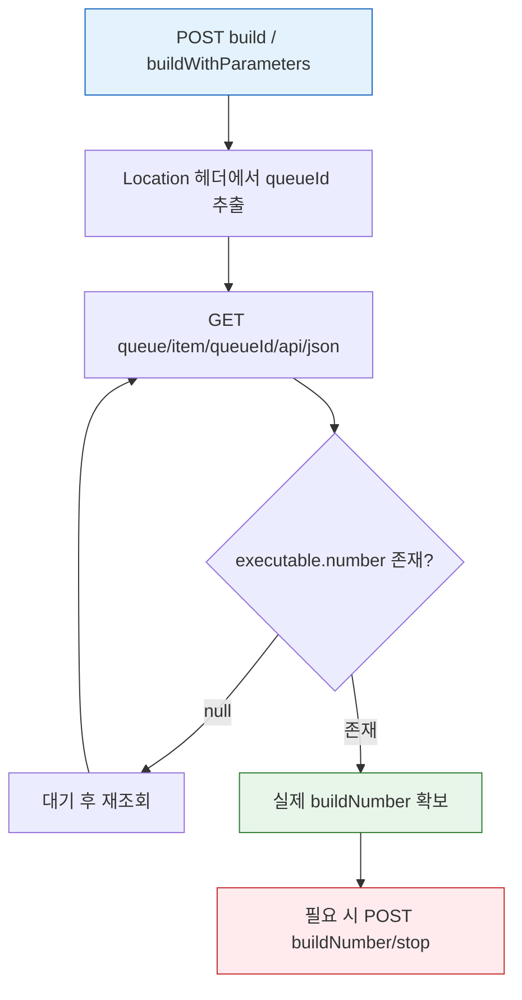
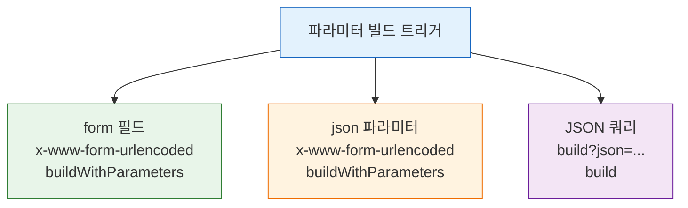

# 젠킨스 빌드 실행·큐 API 스펙
---
> 이 문서는 Jenkins 빌드 실행과 큐 관련 REST API 자체를 설명하는 스펙 문서입니다.
>
> - 빌드 트리거, 큐 아이템 조회, 전체 큐 조회, 실행기 조회, 빌드 중지·취소 API를 다룹니다.
> - TPS 운영 패턴, Pre-trigger Guard, controller 실행 해석은 `05-02`에서 별도로 다룹니다.
> - K8s/VM 실행기 환경, 큐-빌드 전환 흐름은 `05-03`에서 별도로 다룹니다.
> - 큐 내부 메커니즘, 실행 순서, 취소 동작 흐름은 `05-04`에서 별도로 다룹니다.

> 이 문서를 끝내면 `build`/`buildWithParameters`로 빌드를 트리거하고, 응답 `Location` 헤더의 `queueId`로 큐 아이템을 추적해 실제 `buildNumber`를 얻으며, `buildWithParameters`의 세 가지 파라미터 전달 방식(form 필드·json·JSON 쿼리)을 구분해 선택할 수 있습니다.

## 사전 지식

> 02-01에서 본 "트리거 직후 받는 값은 build number가 아니라 queue item ID"라는 사실과 03-01의 crumb + cookie POST 준비를 알고 있다면, 이 문서는 그 큐 전환 구간을 실제 엔드포인트와 curl 예시로 구체화한 것입니다.

## 진입 — 왜 빌드 트리거는 곧바로 빌드 번호를 주지 않는가

> 다른 REST API라면 "생성 요청 → 생성된 자원 ID 반환"이 한 번에 끝납니다. 그런데 Jenkins의 `build`는 빌드를 *즉시 실행*하지 않고 일단 큐에 *적재*만 합니다. 적재 시점에는 어느 실행기가 언제 잡을지 정해지지 않았으니 빌드 번호 자체가 아직 존재하지 않습니다. 그래서 응답은 빌드 번호 대신 "대기표"에 해당하는 `queueId`만 돌려주고, 실제 빌드 번호는 큐 아이템을 다시 조회해 얻어야 합니다. 이 한 번의 우회가 빌드 API 연동의 모든 비동기 처리(폴링·재시도·타임아웃)를 만들어 냅니다.

이 두 단계 전환을 `build`가 POST 메서드라는 점과 함께 본다면, Jenkins 빌드 연동의 골격은 거의 다 잡힌 셈입니다. (출처: jenkins.io/doc/book/using/remote-access-api — `build` / `buildWithParameters` 는 POST)

## 1. 이 문서의 범위

> 빌드 실행·큐 조회 API는 이미 아는 "POST로 자원 생성, GET으로 상태 조회"라는 REST 패턴을, "생성과 실행이 분리된 비동기 작업"이라는 측면에서 다시 보는 것입니다.

> 이 문서는 빌드 실행과 큐 처리에 직접 사용하는 아래 API만 설명합니다.

| 메서드 | 경로 | 목적 |
|------|------|------|
| POST | `/{pipelineStruct}/build` | 파라미터 없는 빌드 실행 |
| POST | `/{pipelineStruct}/buildWithParameters` | 파라미터 빌드 실행 |
| GET | `/queue/item/{queueId}/api/json` | 큐 아이템 상태와 실제 빌드 번호 조회 |
| GET | `/queue/api/json` | Jenkins 전체 큐 조회 |
| GET | `/computer/api/json` | 전체 실행기 상태 조회 |
| GET | `/computer/{agentId}/api/json` | 특정 에이전트 단건 상세 조회 |
| POST | `/{pipelineStruct}/{buildNumber}/stop` | 실행 중인 빌드 중지 |
| POST | `/queue/cancelItem?id={queueId}` | 큐 대기 중인 빌드 취소 |

인증 헤더와 crumb/cookie 준비는 별도 문서에서 다룹니다:

- `03-01.인증 API 스펙 (ID-Password + Crumb).md`
- `03-02.인증 모델과 TPS 패턴 (2.222+).md`

빌드 상세 상태 추적은 이 문서 범위가 아닙니다. 그 내용은 별도 문서에서 다룹니다:

- `06-01.빌드 상태 추적 API 스펙.md`

### 1-1. 공통 경로 규칙

`{pipelineStruct}`는 Jenkins Job URL 경로 구조를 그대로 따릅니다.

- 단일 Job: `/job/{name}`
- 폴더 중첩 Job: `/job/{folder}/job/{subfolder}/job/{name}`

`{queueId}`는 빌드 트리거 응답의 `Location` 헤더에서 얻습니다. `queue/item/151/`이라면 `151`이 `queueId`입니다.

`queueId`는 식당 대기표 번호와 같습니다. 손님이 입장 요청을 하면(=`build` POST) 식당은 먼저 번호표(=`queueId`)를 건네고, 자리가 나면 그때 테이블 번호(=`buildNumber`)를 부릅니다. 번호표만 있을 때는 아직 어느 테이블에 앉을지 정해지지 않았듯, `queueId` 시점에는 빌드 번호가 비어 있습니다. 이 비유는 "발급 → 호출" 두 단계를 설명하는 데까지 유효하고, *번호표는 자리가 나면 폐기되지만 `queueId`는 빌드가 시작된 뒤에도 한동안 조회 가능*하다는 점에서 깨집니다 — Jenkins는 큐 아이템에 실행 결과(`executable.number`)를 채워 일정 시간 보존합니다.

`{buildNumber}`는 큐 아이템 응답의 `executable.number`나 `lastBuild.number`에서 얻습니다.

예시는 다음과 같습니다:

```text
/job/SBH/job/API-NORMAL/build
/job/SBH/job/API-PARAM/buildWithParameters
/queue/item/151/api/json
/job/SBH/job/API-SLEEP10/8/stop
```

### 1-2. 공통 요청 규칙

모든 예시는 `03-01`에서 기본 인증 준비가 끝났다는 전제입니다. 즉 이 문서에서는 아래 내용을 다시 설명하지 않습니다.

- `JENKINS_URL`
- `JENKINS_USER`
- `JENKINS_PASS`
- `cookies.txt`
- `crumb.json`
- `CRUMB`
- `CRUMB_FIELD`

이 문서에서 추가로 쓰는 동적 값은 먼저 환경 변수로 빼두는 편이 좋습니다.

macOS/Linux용 예시는 다음과 같습니다:

```bash
export PIPELINE_NORMAL_STRUCT='/job/SBH/job/API-NORMAL'
export PIPELINE_PARAM_STRUCT='/job/SBH/job/API-PARAM'
export PIPELINE_SLEEP10_STRUCT='/job/SBH/job/API-SLEEP10'
export PIPELINE_FAIL_STRUCT='/job/SBH/job/API-FAIL'
export PIPELINE_NORMAL_2_STRUCT='/job/SBH/job/API-NORMAL-2'

export QUEUE_ID='151'
export BUILD_NUMBER='8'
export PARAM_BRANCH='main'
export PARAM_ENV='dev'
export QUEUE_ID_NORMAL=''
export QUEUE_ID_NORMAL_2=''
export QUEUE_ID_FAIL=''
export QUEUE_ID_SLEEP10=''
export QUEUE_ID_PARAM=''
```

Windows PowerShell용 예시는 다음과 같습니다:

```powershell
$env:PIPELINE_NORMAL_STRUCT = '/job/SBH/job/API-NORMAL'
$env:PIPELINE_PARAM_STRUCT = '/job/SBH/job/API-PARAM'
$env:PIPELINE_SLEEP10_STRUCT = '/job/SBH/job/API-SLEEP10'
$env:PIPELINE_FAIL_STRUCT = '/job/SBH/job/API-FAIL'
$env:PIPELINE_NORMAL_2_STRUCT = '/job/SBH/job/API-NORMAL-2'

$env:QUEUE_ID = '151'
$env:BUILD_NUMBER = '8'
$env:PARAM_BRANCH = 'main'
$env:PARAM_ENV = 'dev'
$env:QUEUE_ID_NORMAL = ''
$env:QUEUE_ID_NORMAL_2 = ''
$env:QUEUE_ID_FAIL = ''
$env:QUEUE_ID_SLEEP10 = ''
$env:QUEUE_ID_PARAM = ''
```

이 문서에서 의미하는 값은 다음과 같습니다:

| 변수 | 의미 | 예시 |
|------|------|------|
| `PIPELINE_NORMAL_STRUCT` | 일반 성공 파이프라인 경로 | `/job/SBH/job/API-NORMAL` |
| `PIPELINE_PARAM_STRUCT` | 파라미터 파이프라인 경로 | `/job/SBH/job/API-PARAM` |
| `PIPELINE_SLEEP10_STRUCT` | 30초 대기 파이프라인 경로 | `/job/SBH/job/API-SLEEP10` |
| `PIPELINE_FAIL_STRUCT` | 무조건 실패 파이프라인 경로 | `/job/SBH/job/API-FAIL` |
| `PIPELINE_NORMAL_2_STRUCT` | 일반 성공 보조 파이프라인 경로 | `/job/SBH/job/API-NORMAL-2` |
| `QUEUE_ID` | 빌드 트리거 후 생성된 큐 아이템 ID | `151` |
| `BUILD_NUMBER` | 실제 Jenkins 빌드 번호 | `8` |
| `PARAM_BRANCH` | 파라미터 빌드용 브랜치 값 | `main` |
| `PARAM_ENV` | 파라미터 빌드용 환경 값 | `dev` |

현재 환경처럼 비밀번호 인증을 쓴다면 POST 전에 crumb과 cookie도 같이 준비해야 합니다. 이 문서의 POST 예시는 아래 준비가 끝났다는 전제로 작성합니다:

```bash
export CRUMB=$(jq -r '.crumb' crumb.json)
export CRUMB_FIELD=$(jq -r '.crumbRequestField' crumb.json)
```

- 아직 준비하지 않았다면 `03-01.인증 API 스펙 (ID-Password + Crumb).md`의 crumb 발급 절차를 먼저 실행합니다.
- 사용 규칙은 다음과 같습니다:
  - `CRUMB`, `CRUMB_FIELD`는 shell 변수로 사용합니다.
  - session cookie는 `cookies.txt` 파일로 유지하고 POST에서 `-b cookies.txt`로 전달합니다.

`build`/`buildWithParameters`/`stop`은 모두 POST이므로 CSRF 보호 대상입니다. 비밀번호 인증으로 호출할 때는 crumb 토큰과 세션 쿠키를 함께 보내야 하고, API token 인증이면 crumb이 면제되어 이 준비 단계를 건너뜁니다. CSRF 보호 원리와 API token이 crumb을 면제받는 근거는 [03-01. 인증 API 스펙 (ID-Password + Crumb)](03-01.%EC%9D%B8%EC%A6%9D%20API%20%EC%8A%A4%ED%8E%99%20%28ID-Password%20%2B%20Crumb%29.md) § "crumb 발급"에서 다룹니다.

응답 확인 원칙은 다음과 같습니다:

- `build`, `buildWithParameters`, `stop`처럼 본문보다 헤더가 중요한 POST는 `-D headers.txt`와 `HTTP_STATUS`를 같이 봅니다.
- JSON 응답은 `jq`로 바로 읽기 좋게 정리합니다.
- `Location` 헤더에서 `queueId`를 추출한 뒤 다음 API에 이어서 사용합니다.

`tree=` 파라미터에 `[]`가 들어가는 Jenkins API는 `curl`이 URL range로 오해할 수 있습니다. 이 경우에는 다음 둘 중 하나를 사용합니다:

- `curl -g`
- `[` `]`를 `%5B`, `%5D`로 URL 인코딩

예를 들어 `?tree=jobs[name,url,color]` 같은 형식은 `curl -g`를 붙이는 편이 안전합니다.

이 문서의 조회 예시는 `tree=jobs[name,url,color]`로 필요한 필드만 골라 응답을 줄입니다. `tree=`(반환 필드 선택)·`depth=`(서브트리 깊이 제어)로 응답 크기를 다루는 상세는 [09-03. API 쿼리 최적화와 운영](09-03.API%20%EC%BF%BC%EB%A6%AC%20%EC%B5%9C%EC%A0%81%ED%99%94%EC%99%80%20%EC%9A%B4%EC%98%81.md)을 참조합니다.

### 1-3. 사전 준비: `SBH` 폴더에 실습용 파이프라인 5개 생성

`05-01` 실습 전, `SBH` 폴더 아래에 실행 가능한 파이프라인 5개를 먼저 만듭니다. 구성은 다음과 같습니다:

| 이름 | 성격 | 용도 |
|------|------|------|
| `API-NORMAL` | 10초 대기 후 성공 | 기본 `build` 테스트 |
| `API-PARAM` | 파라미터 빌드 | `buildWithParameters` 테스트 |
| `API-SLEEP10` | 30초 대기 후 성공 | 큐/중지(`stop`) 테스트 |
| `API-FAIL` | 10초 대기 후 실패 | 실패 상태 흐름 테스트 |
| `API-NORMAL-2` | 10초 대기 후 성공(보조) | 큐/실행기 비교 테스트 |

먼저 변수부터 준비합니다:

```bash
export FOLDER_NAME='SBH'
export FOLDER_STRUCT='/job/SBH'

export JOB_NORMAL='API-NORMAL'
export JOB_PARAM='API-PARAM'
export JOB_SLEEP10='API-SLEEP10'
export JOB_FAIL='API-FAIL'
export JOB_NORMAL_2='API-NORMAL-2'
```

다음 명령으로 샘플 XML 4개를 현재 작업 디렉토리에 바로 만듭니다:

```bash
cat > 05-01.sample-pipeline-normal.xml <<'EOF'
<?xml version='1.1' encoding='UTF-8'?>
<flow-definition plugin="workflow-job">
  <actions/>
  <description>10-second success pipeline for Jenkins build API test</description>
  <keepDependencies>false</keepDependencies>
  <properties/>
  <definition class="org.jenkinsci.plugins.workflow.cps.CpsFlowDefinition" plugin="workflow-cps">
    <script><![CDATA[pipeline { agent any; stages { stage('Wait 10 sec') { steps { sleep time: 10, unit: 'SECONDS'; echo 'Finished after 10 seconds' } } } }]]></script>
    <sandbox>true</sandbox>
  </definition>
  <triggers/>
  <disabled>false</disabled>
</flow-definition>
EOF

cat > 05-01.sample-pipeline-parameterized.xml <<'EOF'
<?xml version='1.1' encoding='UTF-8'?>
<flow-definition plugin="workflow-job">
  <actions/>
  <description>10-second parameterized pipeline for Jenkins buildWithParameters API test</description>
  <keepDependencies>false</keepDependencies>
  <properties>
    <hudson.model.ParametersDefinitionProperty>
      <parameterDefinitions>
        <hudson.model.StringParameterDefinition>
          <name>BRANCH</name>
          <description>Branch name</description>
          <defaultValue>main</defaultValue>
          <trim>false</trim>
        </hudson.model.StringParameterDefinition>
        <hudson.model.StringParameterDefinition>
          <name>ENV</name>
          <description>Environment name</description>
          <defaultValue>dev</defaultValue>
          <trim>false</trim>
        </hudson.model.StringParameterDefinition>
      </parameterDefinitions>
    </hudson.model.ParametersDefinitionProperty>
  </properties>
  <definition class="org.jenkinsci.plugins.workflow.cps.CpsFlowDefinition" plugin="workflow-cps">
    <script><![CDATA[pipeline { agent any; stages { stage('Wait and Show Parameters') { steps { sleep time: 10, unit: 'SECONDS'; echo "BRANCH=${params.BRANCH}"; echo "ENV=${params.ENV}" } } } }]]></script>
    <sandbox>true</sandbox>
  </definition>
  <triggers/>
  <disabled>false</disabled>
</flow-definition>
EOF

cat > 05-01.sample-pipeline-sleep10.xml <<'EOF'
<?xml version='1.1' encoding='UTF-8'?>
<flow-definition plugin="workflow-job">
  <actions/>
  <description>30-second pipeline for Jenkins stop and queue API test</description>
  <keepDependencies>false</keepDependencies>
  <properties/>
  <definition class="org.jenkinsci.plugins.workflow.cps.CpsFlowDefinition" plugin="workflow-cps">
    <script><![CDATA[pipeline { agent any; stages { stage('Wait 30 sec') { steps { sleep time: 30, unit: 'SECONDS'; echo 'Finished after 30 seconds' } } } }]]></script>
    <sandbox>true</sandbox>
  </definition>
  <triggers/>
  <disabled>false</disabled>
</flow-definition>
EOF

cat > 05-01.sample-pipeline-fail.xml <<'EOF'
<?xml version='1.1' encoding='UTF-8'?>
<flow-definition plugin="workflow-job">
  <actions/>
  <description>10-second fail pipeline for Jenkins build result API test</description>
  <keepDependencies>false</keepDependencies>
  <properties/>
  <definition class="org.jenkinsci.plugins.workflow.cps.CpsFlowDefinition" plugin="workflow-cps">
    <script><![CDATA[pipeline { agent any; stages { stage('Wait and Fail') { steps { sleep time: 10, unit: 'SECONDS'; error 'Forced failure for API test' } } } }]]></script>
    <sandbox>true</sandbox>
  </definition>
  <triggers/>
  <disabled>false</disabled>
</flow-definition>
EOF
```

`SBH` 폴더가 없으면 먼저 생성합니다:

```bash
curl -k -sS -i -w '\nHTTP_STATUS=%{http_code}\n' -X POST -b cookies.txt \
  -u "${JENKINS_USER}:${JENKINS_PASS}" \
  -H "${CRUMB_FIELD}: ${CRUMB}" \
  -H "Content-Type: application/xml" \
  --data-binary '<com.cloudbees.hudson.plugins.folder.Folder><actions/><description></description><properties/></com.cloudbees.hudson.plugins.folder.Folder>' \
  "${JENKINS_URL}/createItem?name=${FOLDER_NAME}"
```

이제 `SBH` 아래 5개 파이프라인을 생성합니다:

```bash
curl -k -sS -i -w '\nHTTP_STATUS=%{http_code}\n' -X POST -b cookies.txt \
  -u "${JENKINS_USER}:${JENKINS_PASS}" \
  -H "${CRUMB_FIELD}: ${CRUMB}" \
  -H "Content-Type: application/xml" \
  --data-binary @05-01.sample-pipeline-normal.xml \
  "${JENKINS_URL}${FOLDER_STRUCT}/createItem?name=${JOB_NORMAL}"

curl -k -sS -i -w '\nHTTP_STATUS=%{http_code}\n' -X POST -b cookies.txt \
  -u "${JENKINS_USER}:${JENKINS_PASS}" \
  -H "${CRUMB_FIELD}: ${CRUMB}" \
  -H "Content-Type: application/xml" \
  --data-binary @05-01.sample-pipeline-parameterized.xml \
  "${JENKINS_URL}${FOLDER_STRUCT}/createItem?name=${JOB_PARAM}"

curl -k -sS -i -w '\nHTTP_STATUS=%{http_code}\n' -X POST -b cookies.txt \
  -u "${JENKINS_USER}:${JENKINS_PASS}" \
  -H "${CRUMB_FIELD}: ${CRUMB}" \
  -H "Content-Type: application/xml" \
  --data-binary @05-01.sample-pipeline-sleep10.xml \
  "${JENKINS_URL}${FOLDER_STRUCT}/createItem?name=${JOB_SLEEP10}"

curl -k -sS -i -w '\nHTTP_STATUS=%{http_code}\n' -X POST -b cookies.txt \
  -u "${JENKINS_USER}:${JENKINS_PASS}" \
  -H "${CRUMB_FIELD}: ${CRUMB}" \
  -H "Content-Type: application/xml" \
  --data-binary @05-01.sample-pipeline-fail.xml \
  "${JENKINS_URL}${FOLDER_STRUCT}/createItem?name=${JOB_FAIL}"

curl -k -sS -i -w '\nHTTP_STATUS=%{http_code}\n' -X POST -b cookies.txt \
  -u "${JENKINS_USER}:${JENKINS_PASS}" \
  -H "${CRUMB_FIELD}: ${CRUMB}" \
  -H "Content-Type: application/xml" \
  --data-binary @05-01.sample-pipeline-normal.xml \
  "${JENKINS_URL}${FOLDER_STRUCT}/createItem?name=${JOB_NORMAL_2}"
```

생성 확인은 다음처럼 조회합니다:

```bash
curl -g -k -sS -u "${JENKINS_USER}:${JENKINS_PASS}" \
  "${JENKINS_URL}${FOLDER_STRUCT}/api/json?tree=jobs[name,url,color]" \
  | jq '{
      numJobs: (.jobs | length),
      jobs: [.jobs[]? | {name, color, url}]
    }'
```

이미 같은 이름이 존재하면 `createItem`이 `400`을 반환할 수 있습니다. 이 경우 이름을 바꾸거나 기존 Job을 삭제한 뒤 다시 생성합니다.

샘플 XML 내용을 바꿨고 기존 Job에 그대로 반영하고 싶다면, 삭제보다 `config.xml` 덮어쓰기가 더 빠릅니다:

```bash
curl -k -sS -i -w '\nHTTP_STATUS=%{http_code}\n' -X POST -b cookies.txt \
  -u "${JENKINS_USER}:${JENKINS_PASS}" \
  -H "${CRUMB_FIELD}: ${CRUMB}" \
  -H "Content-Type: application/xml" \
  --data-binary @05-01.sample-pipeline-normal.xml \
  "${JENKINS_URL}${PIPELINE_NORMAL_STRUCT}/config.xml"

curl -k -sS -i -w '\nHTTP_STATUS=%{http_code}\n' -X POST -b cookies.txt \
  -u "${JENKINS_USER}:${JENKINS_PASS}" \
  -H "${CRUMB_FIELD}: ${CRUMB}" \
  -H "Content-Type: application/xml" \
  --data-binary @05-01.sample-pipeline-parameterized.xml \
  "${JENKINS_URL}${PIPELINE_PARAM_STRUCT}/config.xml"

curl -k -sS -i -w '\nHTTP_STATUS=%{http_code}\n' -X POST -b cookies.txt \
  -u "${JENKINS_USER}:${JENKINS_PASS}" \
  -H "${CRUMB_FIELD}: ${CRUMB}" \
  -H "Content-Type: application/xml" \
  --data-binary @05-01.sample-pipeline-sleep10.xml \
  "${JENKINS_URL}${PIPELINE_SLEEP10_STRUCT}/config.xml"

curl -k -sS -i -w '\nHTTP_STATUS=%{http_code}\n' -X POST -b cookies.txt \
  -u "${JENKINS_USER}:${JENKINS_PASS}" \
  -H "${CRUMB_FIELD}: ${CRUMB}" \
  -H "Content-Type: application/xml" \
  --data-binary @05-01.sample-pipeline-fail.xml \
  "${JENKINS_URL}${PIPELINE_FAIL_STRUCT}/config.xml"

curl -k -sS -i -w '\nHTTP_STATUS=%{http_code}\n' -X POST -b cookies.txt \
  -u "${JENKINS_USER}:${JENKINS_PASS}" \
  -H "${CRUMB_FIELD}: ${CRUMB}" \
  -H "Content-Type: application/xml" \
  --data-binary @05-01.sample-pipeline-normal.xml \
  "${JENKINS_URL}${PIPELINE_NORMAL_2_STRUCT}/config.xml"
```

기존 Job을 아예 지우고 다시 만들고 싶다면, 먼저 삭제 후 위의 `createItem` 명령을 다시 실행합니다:

```bash
curl -k -sS -i -w '\nHTTP_STATUS=%{http_code}\n' -X POST -b cookies.txt \
  -u "${JENKINS_USER}:${JENKINS_PASS}" \
  -H "${CRUMB_FIELD}: ${CRUMB}" \
  "${JENKINS_URL}${PIPELINE_NORMAL_STRUCT}/doDelete"

curl -k -sS -i -w '\nHTTP_STATUS=%{http_code}\n' -X POST -b cookies.txt \
  -u "${JENKINS_USER}:${JENKINS_PASS}" \
  -H "${CRUMB_FIELD}: ${CRUMB}" \
  "${JENKINS_URL}${PIPELINE_PARAM_STRUCT}/doDelete"

curl -k -sS -i -w '\nHTTP_STATUS=%{http_code}\n' -X POST -b cookies.txt \
  -u "${JENKINS_USER}:${JENKINS_PASS}" \
  -H "${CRUMB_FIELD}: ${CRUMB}" \
  "${JENKINS_URL}${PIPELINE_SLEEP10_STRUCT}/doDelete"

curl -k -sS -i -w '\nHTTP_STATUS=%{http_code}\n' -X POST -b cookies.txt \
  -u "${JENKINS_USER}:${JENKINS_PASS}" \
  -H "${CRUMB_FIELD}: ${CRUMB}" \
  "${JENKINS_URL}${PIPELINE_FAIL_STRUCT}/doDelete"

curl -k -sS -i -w '\nHTTP_STATUS=%{http_code}\n' -X POST -b cookies.txt \
  -u "${JENKINS_USER}:${JENKINS_PASS}" \
  -H "${CRUMB_FIELD}: ${CRUMB}" \
  "${JENKINS_URL}${PIPELINE_NORMAL_2_STRUCT}/doDelete"
```

일반적으로는 다음 기준으로 고르면 됩니다:

- 스크립트만 바뀜: `config.xml` 덮어쓰기
- 이름 구조까지 바꾸고 싶음: 삭제 후 재생성
- 큐 ID나 과거 빌드 이력을 유지하고 싶음: `config.xml` 덮어쓰기

### 1-4. 권장 실행 순서

이 문서는 API 종류별 설명도 포함하지만, 실제 실습은 아래 순서로 보는 편이 가장 자연스럽습니다:

1. `build` 또는 `buildWithParameters`로 빌드를 시작합니다.
2. 응답의 `Location` 헤더에서 `queueId`를 추출합니다.
3. `GET /queue/item/{queueId}/api/json`으로 실제 큐 상태와 `executable.number`를 확인합니다.
4. 필요하면 `GET /queue/api/json`, `GET /computer/api/json`으로 주변 상태를 봅니다.
5. 실행 중인 빌드를 멈추고 싶을 때만 `POST /{pipelineStruct}/{buildNumber}/stop`을 호출합니다.


트리거부터 실제 빌드 번호 확보, 선택적 중지까지의 권장 흐름을 그림으로 보면 다음과 같습니다:



## 2. 시작점: 빌드 실행 POST API

### 2-1. `POST /{pipelineStruct}/build`

> 파라미터 없는 빌드를 실행하는 API입니다.

권장 실습 대상은 다음과 같습니다:

- 기본 성공 테스트: `API-NORMAL`
- 보조 성공 테스트: `API-NORMAL-2`
- 실패 흐름 테스트: `API-FAIL`
- 중지(`stop`) 연계 테스트: `API-SLEEP10`

요청 형식은 다음과 같습니다:

```http
POST /{pipelineStruct}/build HTTP/1.1
Authorization: Basic <...>
Jenkins-Crumb: <crumb>
Cookie: <session-cookie>
```

예시는 다음과 같습니다:

```bash
curl -k -sS -D headers.txt -o /dev/null -w 'HTTP_STATUS=%{http_code}\n' \
  -X POST -b cookies.txt \
  -u "${JENKINS_USER}:${JENKINS_PASS}" \
  -H "${CRUMB_FIELD}: ${CRUMB}" \
  "${JENKINS_URL}${PIPELINE_STRUCT}/build"

cat headers.txt
```

성공 시 가장 먼저 볼 값은 `Location` 헤더입니다. 여기서 큐 아이템 URL을 얻습니다.

파이프라인별 독립 실행 예시는 다음과 같습니다.

```bash
# API-NORMAL 실행
curl -k -sS -D headers.txt -o /dev/null -w 'HTTP_STATUS=%{http_code}\n' \
  -X POST -b cookies.txt \
  -u "${JENKINS_USER}:${JENKINS_PASS}" \
  -H "${CRUMB_FIELD}: ${CRUMB}" \
  "${JENKINS_URL}${PIPELINE_NORMAL_STRUCT}/build"

cat headers.txt

# API-NORMAL-2 실행
curl -k -sS -D headers.txt -o /dev/null -w 'HTTP_STATUS=%{http_code}\n' \
  -X POST -b cookies.txt \
  -u "${JENKINS_USER}:${JENKINS_PASS}" \
  -H "${CRUMB_FIELD}: ${CRUMB}" \
  "${JENKINS_URL}${PIPELINE_NORMAL_2_STRUCT}/build"

cat headers.txt

# API-FAIL 실행
curl -k -sS -D headers.txt -o /dev/null -w 'HTTP_STATUS=%{http_code}\n' \
  -X POST -b cookies.txt \
  -u "${JENKINS_USER}:${JENKINS_PASS}" \
  -H "${CRUMB_FIELD}: ${CRUMB}" \
  "${JENKINS_URL}${PIPELINE_FAIL_STRUCT}/build"

cat headers.txt

# API-SLEEP10 실행
curl -k -sS -D headers.txt -o /dev/null -w 'HTTP_STATUS=%{http_code}\n' \
  -X POST -b cookies.txt \
  -u "${JENKINS_USER}:${JENKINS_PASS}" \
  -H "${CRUMB_FIELD}: ${CRUMB}" \
  "${JENKINS_URL}${PIPELINE_SLEEP10_STRUCT}/build"

cat headers.txt
```

주요 응답 특성은 다음과 같습니다:

| 항목 | 값 | 의미 |
|------|------|------|
| HTTP 상태 | `201` | 큐 등록 성공 |
| `Location` 헤더 | `/queue/item/{id}/` 또는 절대 URL | 큐 아이템 위치 |
| 본문 | 거의 없음 | 후속 처리는 큐 조회 API에서 진행 |

- 같은 Job에 대해 아주 짧은 간격으로 같은 빌드 요청을 보내면, Jenkins가 새 queue item을 계속 만들지 않고 기존 queue item에 병합할 수 있습니다. 
- 이 경우 여러 번 호출해도 `Location` 헤더가 같은 `queue/item/{id}`로 반복될 수 있습니다.

에러 케이스는 다음과 같습니다:

| 상태 코드 | 의미 | 대응 |
|-----------|------|------|
| `201` | 큐 등록 성공 | `Location` 헤더 확인 |
| `400` | 잘못된 요청 | Job 설정과 호출 경로 확인 |
| `403` | 권한 부족 또는 crumb 문제 | 인증/권한 확인 |
| `404` | 대상 Job 없음 | `PIPELINE_STRUCT` 확인 |

### 2-2. `POST /{pipelineStruct}/buildWithParameters`

> 파라미터가 정의된 파이프라인을 실행하는 API입니다.

이 섹션은 파라미터 파이프라인 `API-PARAM`을 대상으로 봅니다.

요청 형식은 다음과 같습니다:

```http
POST /{pipelineStruct}/buildWithParameters HTTP/1.1
Authorization: Basic <...>
Jenkins-Crumb: <crumb>
Cookie: <session-cookie>
Content-Type: application/x-www-form-urlencoded
```

이 API의 핵심은 "JSON 본문"이 아니라 "form 필드"라는 점입니다. Jenkins는 보통 파라미터 이름과 같은 form 필드를 읽습니다.

- `BRANCH=main`
- `ENV=dev`

즉 현재 문서 예시는 아래와 같은 form body를 보내는 것과 같습니다:

```text
BRANCH=main&ENV=dev
```

전달 형식은 다음처럼 이해하면 됩니다:

| 형식 | 예시 | 사용 가능 여부 | 비고 |
|------|------|------|------|
| `application/x-www-form-urlencoded` | `BRANCH=main&ENV=dev` | 가능 | 현재 문서의 기본 방식 |
| `application/x-www-form-urlencoded` + `json=...` | `json={parameter:[...]}` | 가능 | Jenkins UI 호환 방식 |
| `multipart/form-data` | 파일 파라미터 업로드 | 가능 | 파일 파라미터 Job에서 사용 |
| `application/json` | `{"BRANCH":"main"}` | 보통 불가 | 일반 REST JSON API처럼 동작하지 않음 |

가장 단순하고 실전에서 자주 쓰는 방식은 파라미터 이름을 그대로 맞춰 `--data-urlencode`를 반복하는 것입니다. 현재 `API-PARAM` 샘플도 이 방식으로 호출합니다.

#### 방식 1: form 필드 (기본)

form 필드 방식의 규칙은 다음과 같습니다

```bash
# -D headers.txt: 빌드 번호가 본문이 아니라 Location 헤더로 오므로 헤더를 파일로 떠서 본다
# -o /dev/null: 본문은 거의 비어 있어 버린다 (헤더만 의미 있음)
# -H crumb: 비밀번호 인증 POST는 CSRF crumb 헤더가 없으면 403으로 막힌다
# --data-urlencode: 값에 공백·/·한글이 와도 form 인코딩을 curl이 대신 해 준다
curl -k -sS -D headers.txt -o /dev/null -w 'HTTP_STATUS=%{http_code}\n' \
  -X POST -b cookies.txt \
  -u "${JENKINS_USER}:${JENKINS_PASS}" \
  -H "${CRUMB_FIELD}: ${CRUMB}" \
  --data-urlencode "BRANCH=${PARAM_BRANCH}" \
  --data-urlencode "ENV=${PARAM_ENV}" \
  "${JENKINS_URL}${PIPELINE_PARAM_STRUCT}/buildWithParameters"

cat headers.txt
```

- 필드 이름은 Jenkins Job에 정의된 파라미터 이름과 정확히 같아야 합니다.
- 현재 샘플에서는 `BRANCH`, `ENV` 두 개가 정의되어 있으므로 같은 이름으로 보내야 합니다.
- `--data-urlencode`를 쓰면 공백, 특수문자, 한글이 들어가도 안전하게 인코딩됩니다. 예를 들어 `PARAM_BRANCH='feature/api-doc'`처럼 `/`가 들어가도 문제없습니다.

#### 방식 2: json 파라미터 (Jenkins UI 호환)

Jenkins UI가 내부적으로 쓰는 `json={parameter:[...]}` 형태입니다. `Content-Type`은 여전히 `application/x-www-form-urlencoded`이지만, 파라미터 값을 JSON 구조체로 묶어서 보냅니다.

```bash
curl -k -sS -D headers.txt -o /dev/null -w 'HTTP_STATUS=%{http_code}\n' \
  -X POST -b cookies.txt \
  -u "${JENKINS_USER}:${JENKINS_PASS}" \
  -H "${CRUMB_FIELD}: ${CRUMB}" \
  --data-urlencode 'json={
    "parameter": [
      {"name": "BRANCH", "value": "main"},
      {"name": "ENV", "value": "dev"}
    ]
  }' \
  "${JENKINS_URL}${PIPELINE_PARAM_STRUCT}/buildWithParameters"

cat headers.txt
```

이 방식이 유용한 경우는 다음과 같습니다:

- 파라미터 수가 많을 때 하나의 JSON으로 관리하기 편합니다.
- 프로그래밍 언어에서 파라미터 목록을 동적으로 생성할 때 JSON 직렬화가 자연스럽습니다.
- Jenkins UI의 form submission과 동일한 형식이므로 호환성이 높습니다.

#### 방식 3: application/json (순수 JSON 본문)

순수 `application/json` 본문을 `buildWithParameters`에 직접 보내는 방식은 Jenkins 기본 동작에서 지원하지 않습니다. 

- Jenkins의 `buildWithParameters` 엔드포인트는 form 파라미터를 읽도록 설계되어 있어서, `Content-Type: application/json`으로 JSON 본문을 보내면 파라미터를 인식하지 못합니다.
- 대신 `/build` 엔드포인트에 `json` 쿼리 파라미터를 사용하면 JSON 형태로 파라미터를 전달할 수 있습니다:

```bash
curl -k -sS -D headers.txt -o /dev/null -w 'HTTP_STATUS=%{http_code}\n' \
  -X POST -b cookies.txt \
  -u "${JENKINS_USER}:${JENKINS_PASS}" \
  -H "${CRUMB_FIELD}: ${CRUMB}" \
  "${JENKINS_URL}${PIPELINE_PARAM_STRUCT}/build?json=$(python3 -c "
import urllib.parse, json
print(urllib.parse.quote(json.dumps({
    'parameter': [
        {'name': 'BRANCH', 'value': 'main'},
        {'name': 'ENV', 'value': 'dev'}
    ]
})))
")"

cat headers.txt
```

- 엔드포인트가 `buildWithParameters`가 아니라 `build`입니다.
- JSON을 URL 인코딩해서 쿼리 파라미터로 전달합니다.
- 파라미터가 정의된 Job에서 `build`를 호출하면 Jenkins가 자동으로 `buildWithParameters`처럼 처리합니다.
- URL 길이 제한(보통 8KB)이 있으므로 파라미터가 많거나 값이 길면 방식 1이나 2가 안전합니다.

#### 방식 정리

파라미터 전달 방식 세 가지가 어느 엔드포인트로 가는지 그림으로 보면 다음과 같습니다:




| 방식 | Content-Type | 엔드포인트 | 사용 시점 |
|------|-------------|-----------|----------|
| form 필드 | `x-www-form-urlencoded` | `buildWithParameters` | 기본 방식, 단순하고 안정적 |
| json 파라미터 | `x-www-form-urlencoded` | `buildWithParameters` | 동적 파라미터 생성, UI 호환 |
| JSON 쿼리 | (쿼리스트링) | `build` | REST 클라이언트에서 JSON 선호 시 |

이 요청도 성공 여부는 본문보다 상태 코드와 `Location` 헤더가 더 중요합니다.

에러 케이스는 다음과 같습니다:

| 상태 코드 | 의미 | 대응 |
|-----------|------|------|
| `201` | 큐 등록 성공 | `Location` 헤더 확인 |
| `400` | 파라미터 형식 오류 | 파라미터 이름과 타입 확인 |
| `403` | 권한 부족 또는 crumb 문제 | 인증/권한 확인 |
| `404` | 대상 Job 없음 | `PIPELINE_STRUCT` 확인 |


## 3. 큐·실행기 조회 API (분할)

> 큐 상태 조회, 전체 큐 조회, 실행기 조회 API는 분량 분리를 위해 `05-06.큐·실행기 조회 API 스펙` 으로 옮겼습니다.

## 5. 제어용 API (분할)

> 빌드 중지·취소 제어용 API는 분량 분리를 위해 `05-05.빌드 중지·취소 API 스펙` 으로 옮겼습니다.


## 면접 질문

> 답을 떠올린 뒤 §정답 절에서 같은 번호로 대조하세요.

1. `POST /build` 응답에서 곧바로 `buildNumber`를 읽을 수 없는 이유와, 대신 무엇을 받아 어떻게 빌드 번호에 도달하나요?
2. `buildWithParameters`에 `Content-Type: application/json`으로 순수 JSON 본문을 보내면 왜 파라미터가 인식되지 않나요? 대안은?
3. 같은 Job에 아주 짧은 간격으로 동일 빌드를 여러 번 트리거하면 `Location`이 같은 queue item으로 반복되는 이유는?

### 빈칸 채우기 — 빌드 트리거와 큐 전환

아래 빈칸을 스스로 채운 뒤 `### 빈칸 정답` 절에서 대조하세요.

1. `build`/`buildWithParameters`는 HTTP 메서드로 `______`를 쓰며, 성공 시 HTTP 상태 `______`과 함께 큐 아이템 위치가 담긴 `______` 헤더를 돌려줍니다.
2. 트리거 직후 받는 값은 빌드 번호가 아니라 `______`이고, 실제 빌드 번호는 `GET /queue/item/{queueId}/api/json` 응답의 `______` 필드가 null이 아닐 때 얻습니다.
3. 응답을 줄이려면 필드를 고르는 `______=` 파라미터를, 서브트리를 더 깊이 펼치려면 `______=` 파라미터를 씁니다.
4. 비밀번호 인증 POST에는 CSRF 토큰인 `______`이 필요하지만, `______`(으)로 인증하면 그 토큰이 면제됩니다.

## 정답

> 위 질문을 스스로 설명해 본 뒤에 펼치세요.

### 정답 1 — queueId → buildNumber

`POST /build`는 빌드를 큐에 등록만 하고 즉시 실행하지 않으므로, 응답에는 build number가 아니라 `Location` 헤더의 **queue item URL(queueId)**이 담깁니다. `GET /queue/item/{queueId}/api/json`을 `executable.number`가 null이 아닐 때까지 폴링하면 그 값이 실제 buildNumber입니다.

### 정답 2 — JSON 본문이 안 되는 이유

`buildWithParameters`는 form 파라미터를 읽도록 설계돼 있어 `application/json` 본문은 파라미터로 인식하지 못합니다. 대안은 form 필드(`--data-urlencode BRANCH=...`), `x-www-form-urlencoded`의 `json={parameter:[...]}` 형태, 또는 `build?json=...` 쿼리 방식입니다. 순수 JSON 본문을 일반 REST처럼 보내는 방식만 동작하지 않습니다.

### 정답 3 — queue item 병합

Jenkins는 같은 Job의 동일한 빌드 요청이 아주 짧은 간격으로 들어오면 새 queue item을 만들지 않고 기존 대기 항목에 병합(quiet period 동안 합침)할 수 있습니다. 그래서 여러 번 호출해도 `Location`이 같은 `queue/item/{id}`로 반복될 수 있습니다.

### 빈칸 정답 — 빌드 트리거와 큐 전환

1. `POST` / `201` / `Location`
2. `queueId`(큐 아이템 ID) / `executable.number`
3. `tree` / `depth`
4. `crumb`(CSRF 토큰) / `API token`

## 7. 참고 링크

- Jenkins Remote Access API (jenkins.io/doc/book/using/remote-access-api)
- Jenkins CSRF Protection (jenkins.io/doc/book/security/csrf-protection)

## 관련 문서

> 이 문서는 빌드 트리거와 큐 전환의 *엔드포인트 스펙*만 다룹니다. 같은 장의 운영 패턴·실행 흐름과 인증 준비는 아래 문서에서 이어집니다.

- [05-02. 빌드 실행·큐 모델과 TPS 패턴 (2.222+)](05-02.빌드%20실행·큐%20모델과%20TPS%20패턴%20%282.222%2B%29.md) § "TPS 운영 패턴" — 본 스펙을 TPS 운영에서 어떻게 감싸 쓰는지
- [05-03. Queue 적재 이후 실행 흐름과 데이터 추적](05-03.Queue%20적재%20이후%20실행%20흐름과%20데이터%20추적.md) § "큐-빌드 전환" — `queueId`가 `buildNumber`로 바뀌는 실제 흐름
- [05-05. 빌드 중지·취소 API 스펙](05-05.빌드%20중지·취소%20API%20스펙.md) § "stop / cancelItem" — 이 문서에서 분리한 제어용 API
- [05-06. 큐·실행기 조회 API 스펙](05-06.큐·실행기%20조회%20API%20스펙.md) § "queue / computer" — 이 문서에서 분리한 큐·실행기 조회 API
- [03-01. 인증 API 스펙 (ID-Password + Crumb)](03-01.인증%20API%20스펙%20%28ID-Password%20%2B%20Crumb%29.md) § "crumb 발급" — 빌드 POST 전 crumb·cookie 준비
- [06-01. 빌드 상태 추적 API 스펙](06-01.빌드%20상태%20추적%20API%20스펙.md) § "빌드 상태 조회" — 빌드 번호 확보 다음 단계인 상태 추적
