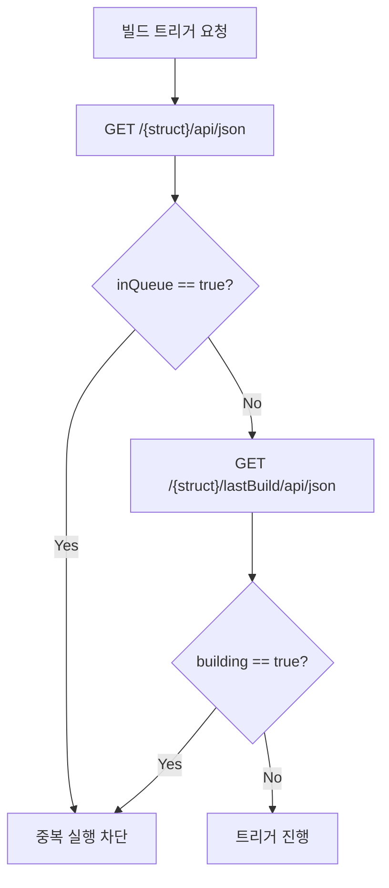
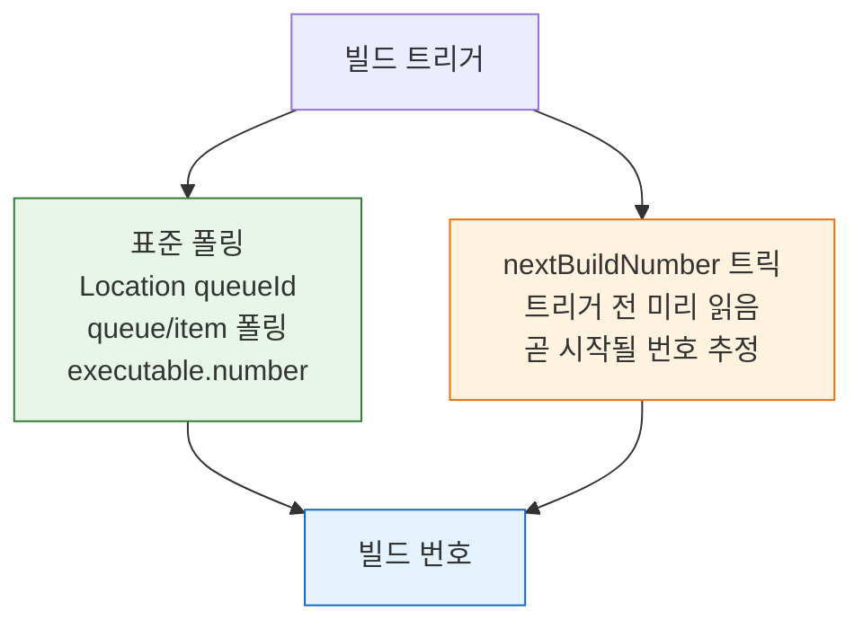

# 젠킨스 빌드 실행·큐 모델과 TPS 패턴 (2.222+)

> **본 문서는 spec(`05-01.md`)을 읽었다고 가정한 TPS 패턴 모음**입니다. 빌드 실행 API의 요청·응답 형식, `Location → queueId → executable.number` 흐름은 spec에 있습니다. 이 문서는 그 위에서 TPS가 운영 환경에서 마주친 의사결정 — Pre-trigger Guard, `nextBuildNumber` 최적화, controller 실행 해석, Queue 운영 판단, 중복 트리거 dedupe — 을 정리합니다.
>
> 인접 문서 분담:
> - 인증 모델 변화 (ID/Password ↔ API Token): `03-02.md`
> - 큐-빌드 전환 흐름과 K8s/VM 실행기 환경: `05-03.md`
> - 큐 내부 메커니즘 (상태 전이, maintain 루프): `05-04.md`

> 학습 목표
> 이 문서를 읽고 나면 트리거 전 중복을 막는 Pre-trigger Guard를 **설계**하고, `nextBuildNumber` 트릭과 표준 queueId 폴링의 트레이드오프를 **비교**하며, `agent any`의 실행 위치를 **예측**하고 Queue 병합·운영 판단을 코드 수준에서 **디버깅**할 수 있습니다.


## 사전 지식

> 05-01에서 본 `Location → queueId → executable.number` 표준 흐름을 알고 있다면, 이 문서는 그 위에서 TPS가 운영하며 마주친 의사결정(중복 차단·번호 추정·실행기 해석)을 일반화한 것입니다.


## 진입 — 왜 트리거 코드에 운영 판단이 따라붙는가

> spec(`05-01.md`)이 알려주는 것은 "어떻게 빌드를 트리거하고 번호를 얻는가"까지입니다. 그러나 운영 환경에서는 같은 트리거가 중복으로 날아오고, 번호 폴링이 느리며, 빌드가 어디서 도는지 헷갈리는 상황이 반복됩니다. 이 문서는 spec이 다루지 않는 그 회색지대 — 트리거 전후의 의사결정 — 을 TPS 사례로 채웁니다. 즉 spec은 "성공 경로"를, 이 문서는 "성공 경로를 둘러싼 방어와 추정"을 담당합니다.


## 1. Pre-trigger Guard — 트리거 직전 중복 차단

> 이 개념은 이미 아는 입력 검증(요청을 받기 전에 거를지 판단)의 분산 작업 큐 측면입니다. 폼 제출 전에 중복 클릭을 막는 디바운스를 빌드 큐 진입 지점으로 옮긴 것입니다.

Jenkins는 같은 Job에 대해 중복 빌드 트리거를 허용합니다. TPS는 트리거를 보내기 **전에** 큐 대기와 실행 중 여부를 확인해 큐 자체에 진입하지 않도록 막습니다.

검사 대상은 두 값입니다 — `GET /{pipelineStruct}/api/json`의 `inQueue`, `GET /{pipelineStruct}/lastBuild/api/json`의 `building`. 두 값이 모두 `false`일 때만 트리거하고, 하나라도 `true`면 `JENKINS_IN_PROGRESS_ERROR`로 처리합니다.

이 두 값을 한 번에 좁혀 받으려면 `tree=` 파라미터로 필요한 필드만 선택합니다. 전체 `api/json`은 빌드 이력·파라미터·SCM 정보까지 포함해 응답이 수십 KB에 이르지만, `tree=inQueue,buildable,lastBuild[building]`처럼 좁히면 수백 바이트로 줄어 폴링 비용이 작아집니다(출처: jenkins.io/doc/book/using/remote-access-api). `tree=`는 반환 필드를 선택하고, 더 깊은 중첩이 필요하면 `depth=` 값을 키워 서브트리 깊이를 늘립니다.



Jenkins 자체에도 `disableConcurrentBuilds()`나 "Abort previous builds"가 있지만 이들은 큐 등록 **이후** 작동합니다. TPS Guard는 큐 등록 자체를 줄이고, UI에 "이미 실행 중" 메시지를 즉시 돌려주기 위해 별도로 둡니다.


## 2. `nextBuildNumber` 트릭 — 큐 폴링 없이 빌드 번호 추정

Jenkins 빌드 트리거는 비동기입니다. spec의 표준 흐름은 `Location → queueId → /queue/item/{id}/api/json`을 폴링해 `executable.number`를 얻는 것이지만, TPS는 트리거 직전 `nextBuildNumber`를 읽어 곧 시작될 빌드 번호를 미리 추정합니다.

`queueId → buildNumber` 전환은 식당의 대기표 번호와 테이블 번호 관계와 같습니다. 대기표(queueId)는 "줄에 섰다"는 사실만 알려주고, 실제로 앉을 테이블(buildNumber)은 자리가 날 때 배정됩니다. `nextBuildNumber` 트릭은 "다음 손님은 9번 테이블에 앉을 것"이라고 미리 짐작하는 것입니다. 이 비유는 손님이 한 명씩 들어올 때까지 유효하고, 두 사람이 동시에 문을 밀고 들어오면(동시 트리거) 누가 9번을 받을지 확정되지 않으므로 깨집니다.

```json
GET /{pipelineStruct}/api/json
{
  "name": "TEST",
  "buildable": true,
  "inQueue": false,
  // nextBuildNumber: 아직 시작 안 된 "다음" 번호 — 트리거 후 이 번호가 배정될 가능성이 높음
  "nextBuildNumber": 9
}
```

이 값을 트리거 전에 저장해두면 큐 폴링 없이 곧바로 `/{pipelineStruct}/9/api/json`을 조회할 수 있습니다. queueId 폴링은 보통 2~5초 간격으로 여러 번 반복해야 `executable.number`가 채워지는데, 이 트릭은 트리거 전 GET 1회로 추정을 끝내 왕복을 절약합니다.

두 방식이 빌드 번호에 도달하는 경로를 비교하면 다음과 같습니다:



다만 절대 보장은 아닙니다 — 동시에 다른 사용자가 같은 Job을 트리거하면 번호 경쟁이 생깁니다. 그래서 일반화된 흐름은 spec의 queueId 폴링이 기본이고, `nextBuildNumber`는 TPS 내부 최적화로만 씁니다.


## 3. `agent any`와 controller 실행 해석

"Jenkins가 K8s 위에 있다"와 "빌드가 K8s 동적 Pod에서 돈다"는 다른 문제입니다. `agent any`는 사용 가능한 아무 executor나 쓰겠다는 뜻이라, controller built-in node에 executor가 열려 있고 K8s label을 명시하지 않으면 controller에서 실행될 수 있습니다. 판별 기준은 controller 배포 위치가 아니라 **에이전트 프로비저닝 방식**입니다.

| 상황 | 해석 |
|------|------|
| Jenkins가 K8s Pod로 배포됨 | controller 배포 위치일 뿐, 빌드 실행 위치와 무관 |
| `agent any`로 빌드 성공 | 사용 가능한 executor에서 실행됨 |
| 동적 agent가 모두 죽었는데 빌드 성공 | controller built-in node 또는 정적 agent에서 실행 |
| K8s Pod 실행을 강제하고 싶음 | `agent { kubernetes { ... } }` 또는 K8s label 명시 필요 |


## 4. Queue 운영 판단 — 무엇을 추적하고 무엇을 포기할 것인가

운영 관점에서 "정확한 실행기 추적"보다 "중복 실행을 얼마나 단순하게 막을 것인가"가 더 중요할 수 있습니다.

**Queue 지속성에 대한 현실적 해석.** Jenkins Queue는 정상 종료·재시작 시 복원되지만 완전한 영속 저장소는 아닙니다. `Queue.Saver`가 변경분을 "가까운 시점에" 저장하는 구조라, 급작스러운 프로세스 종료나 Pod 강제 종료에서는 최근 변경이 손실될 수 있습니다(`2.332.2`에는 재시작 시 큐가 비워지는 회귀가 있었고 `2.343`에서 수정).

**정확한 실행기 추적의 비용.** K8s 동적 에이전트는 Pod 생명주기에 따라 `/computer/api/json` 결과가 흔들립니다 — Pod가 없을 땐 executor `0`, 생성됐지만 agent 연결 전이면 `offline=true`, 빌드 종료 직후 사라짐. dispatch 제어 목적이라면 `queue + computer + label + cloud + Pod` 전부를 합쳐 해석하는 비용이 과합니다.

**현실적인 최소안 — Job 단위 Pre-check 1회.** 전역 executor 추적이나 전역 Queue 빈 상태 체크 대신, 대상 Job에 가벼운 GET 1회만 합니다.

```bash
# tree= 로 필드를 좁혀 전체 응답(수십 KB)을 수백 바이트로 줄임 — 폴링 비용 최소화
# Basic Auth 의 PASS 자리에는 API token 을 권장(노출 시 토큰만 폐기하면 됨)
curl -k -sS -u "${JENKINS_USER}:${JENKINS_PASS}" \
  "${JENKINS_URL}${PIPELINE_STRUCT}/api/json?tree=name,buildable,inQueue,nextBuildNumber,lastBuild[number,building,result,url]"
```

| 전략 | 적합 환경 |
|------|-----------|
| 대상 Job `api/json` 1회 조회 후 트리거 | 여러 Job이 섞인 Jenkins (권장) |
| Job 설정에서 동시 실행 금지 후 결과만 추적 | Job 설정 권한이 있을 때 |
| 전역 Queue만 보고 트리거 | 단일 용도 전용 Jenkins에서만 |

전역 Queue 체크는 다른 팀 Job 때문에 dispatch가 막힐 수 있고, 비어 있어도 해당 Job이 이미 실행 중일 수 있어 신호 품질이 낮습니다.


## 5. 동일 Job 중복 트리거와 Queue 병합

같은 Job에 짧은 간격으로 여러 번 `build`를 호출했는데 `Location`이 계속 같은 `queue/item/{id}`로 보이면 비정상이 아니라 Jenkins Queue **병합** 동작일 가능성이 높습니다. `schedule2(...)`는 새 item을 만들 수도, 이미 대기 중인 같은 task에 merge할 수도, 정책상 거부할 수도 있습니다.

이 현상은 Quiet Period가 있을 때 더 잘 드러납니다 — item이 `WaitingItem` 상태로 잠깐 머무는 동안 같은 Job 요청이 또 들어오면 새 item 대신 기존 item에 붙습니다. `HTTP 201`이 여러 번 나왔는데 `Location`이 같다면 "실패"가 아니라 "Queue dedupe"로 먼저 해석합니다.

확인은 다음 API로 합니다.

```bash
# why: 대기 사유(null 이면 곧 실행), executable: 이미 실행 전환됐는지 — dedupe 여부 판별의 핵심 두 필드
# jq 로 핵심 필드만 뽑아 같은 item 인지(id) 와 실행 전환 여부(executable) 를 한눈에 비교
curl -k -sS -u "${JENKINS_USER}:${JENKINS_PASS}" \
  "${JENKINS_URL}/queue/item/${QUEUE_ID}/api/json" \
  | jq '{id, why, cancelled, stuck, task: .task.name, executable}'
```

병합을 줄이고 싶다면 `build?delay=0sec`로 Quiet Period를 짧게 하거나, 첫 요청이 실행에 들어간 뒤 두 번째를 보내거나, 파라미터를 다르게 주거나, 애초에 TPS Pre-trigger Guard로 차단합니다.


## 6. Quiet Period와 `delay=0sec`

Jenkins 빌드 트리거는 기본적으로 Quiet Period를 거칠 수 있습니다. TPS처럼 API가 명시적으로 트리거하는 환경에서는 이 지연이 불필요할 때가 있고, 요청 단위로 무시하려면 `?delay=0sec`를 붙입니다. `build`와 `buildWithParameters`는 GET이 아니라 POST로 호출해야 합니다(출처: jenkins.io/doc/book/using/remote-access-api).

```bash
# -X POST: build/buildWithParameters 는 상태를 바꾸는 동작이라 POST 가 필수(GET 불가)
# delay=0sec: Quiet Period 를 이 요청만 건너뛰어 즉시 큐 등록 — API 직접 트리거에 적합
curl -X POST -u admin:apiToken \
  "https://jenkins.example.com/job/my-pipeline/build?delay=0sec"
```

표준 호출을 기준으로 설명하고, 이 옵션은 운영 최적화 포인트로 분리해두는 편이 읽기 쉽습니다.


## 7. 인증 모델 차이가 트리거 코드에 미치는 영향

ID/Password 환경에서는 `build`/`buildWithParameters`/`stop` POST에 `crumb` + `cookie` + `Basic Auth`를 모두 실어야 합니다. crumb은 CSRF 방지 토큰으로 `/crumbIssuer/api`(json/xml)에서 발급하며, 발급받은 crumb과 세션 쿠키를 이후 POST에 함께 동반해야 합니다(출처: jenkins.io/doc/book/security/csrf-protection).

API Token 환경(2.222+)에서는 `Authorization: Basic <user:token>` 한 줄로 통일되어 crumb·cookie를 제거할 수 있습니다. 공식 문서는 CSRF 보호 목적으로 crumb보다 API token을 권장하며, **API token 인증 요청은 CSRF(crumb) 검사가 면제**됩니다(출처: jenkins.io/doc/book/using/remote-access-api, jenkins.io/doc/book/security/csrf-protection). 토큰을 비밀번호 대신 쓰면 노출 시 해당 토큰만 폐기하면 되고 비밀번호는 그대로 둘 수 있어 안전합니다(출처: jenkins.io/doc/book/security/managing-security). 다만 실제 면제 여부는 인스턴스 설정에 따라 갈리므로 TPS는 환경 메타데이터로 인증 모델을 분리하는 편이 안전합니다. 자세한 모델 비교는 `03-02.md` §1 참조.


## 8. 전체 흐름 재정리

ID/Password 환경 기준 흐름은 spec과 일치합니다.

1. `03-01`에서 인증과 crumb/cookie 준비
2. `05-01`의 `build` 또는 `buildWithParameters` 호출
3. `Location` 헤더에서 `queueId` 추출
4. `/queue/item/{queueId}/api/json`에서 `executable.number` 확인 (또는 §2의 `nextBuildNumber` 트릭)
5. 상태 추적은 `06-01`로 이어짐

API Token 환경에서는 1단계가 단순해집니다.


## 면접 질문

> 답을 떠올린 뒤 §정답 절에서 같은 번호로 대조하세요.

1. Jenkins에 `disableConcurrentBuilds()`가 있는데도 TPS가 Pre-trigger Guard를 별도로 두는 이유는?
2. `nextBuildNumber`로 빌드 번호를 미리 추정하는 방식의 한계는 무엇이고, 그래서 기본 흐름은 무엇인가요?
3. Jenkins controller가 K8s Pod로 떠 있으면 빌드도 K8s Pod에서 도는 것으로 단정할 수 있나요? 판별 기준은?

### 빈칸 채우기 — 트리거·큐·인증

1. Pre-trigger Guard는 `GET /{struct}/api/json`의 `______` 필드와 `lastBuild/api/json`의 `______` 필드가 모두 `false`일 때만 트리거합니다.
2. 응답 크기를 줄이려면 `______=` 파라미터로 반환 필드를 선택하고, 더 깊은 중첩이 필요하면 `______=` 값을 키워 서브트리 깊이를 늘립니다.
3. `build`와 `buildWithParameters`는 상태를 바꾸는 동작이라 HTTP 메서드로 `______`를 써야 합니다.
4. 공식 문서상 CSRF 보호에는 crumb보다 `______`이 권장되며, 그 인증 요청은 CSRF 검사가 `______`됩니다.
5. 같은 Job을 짧게 여러 번 트리거했는데 `Location`이 같으면 실패가 아니라 Queue `______` 동작으로 먼저 해석합니다.


## 정답

> 위 질문을 스스로 설명해 본 뒤에 펼치세요.

### 정답 1 — Guard를 따로 두는 이유

`disableConcurrentBuilds()`나 "Abort previous builds"는 큐 등록 **이후**에 작동합니다. TPS Pre-trigger Guard는 `inQueue`와 `building`을 트리거 **전에** 확인해 큐 진입 자체를 줄이고, UI에 "이미 실행 중"을 즉시 돌려주기 위한 것입니다. 작동 시점과 목적이 다릅니다.

### 정답 2 — nextBuildNumber의 한계

동시에 다른 사용자가 같은 Job을 트리거하면 번호 경쟁이 생겨 추정이 어긋날 수 있습니다. 그래서 절대 보장이 아니고, 일반화된 기본 흐름은 spec의 `queueId` 폴링이며 `nextBuildNumber`는 TPS 내부 최적화로만 씁니다.

### 정답 3 — 실행 위치 판별

단정할 수 없습니다. controller 배포 위치와 빌드 실행 위치는 별개입니다. `agent any`는 사용 가능한 아무 executor나 쓰므로 controller built-in node에서 돌 수도 있습니다. 판별 기준은 배포 위치가 아니라 **에이전트 프로비저닝 방식**(`KubernetesComputer` 생성·소멸이 빌드 생명주기와 함께 움직이는지 등)입니다.

### 빈칸 정답 — 트리거·큐·인증

1. `inQueue` / `building`
2. `tree` / `depth`
3. `POST`
4. API token / 면제
5. dedupe(병합)


## 9. 참고 링크

- Jenkins Remote Access API
- Persistent Build Queue plugin page
- Jenkins Queue Javadoc / ScheduleResult Javadoc
- JENKINS-68254


## 관련 문서

> 같은 05장의 spec·실행 흐름 문서와, 트리거 코드에 직결되는 인접 장(인증·상태 추적)을 함께 봅니다. spec이 "어떻게"를, 이 문서가 "운영 판단"을, 아래 문서들이 "그 전후 맥락"을 채웁니다.

- [05-01. 빌드 실행·큐 API 스펙](05-01.빌드%20실행·큐%20API%20스펙.md) § "build/buildWithParameters" — 이 문서가 전제하는 표준 트리거·queueId 흐름의 spec
- [05-03. Queue 적재 이후 실행 흐름과 데이터 추적](05-03.Queue%20적재%20이후%20실행%20흐름과%20데이터%20추적.md) § "큐-빌드 전환" — queueId → buildNumber 전환과 K8s/VM 실행기 환경의 후속 흐름
- [05-04. 큐 내부 흐름과 실행 순서](05-04.큐%20내부%20흐름과%20실행%20순서.md) § "상태 전이" — WaitingItem·maintain 루프 등 Queue 병합·dedupe의 내부 메커니즘
- [03-02. 인증 모델과 TPS 패턴 (2.222+)](03-02.인증%20모델과%20TPS%20패턴%20%282.222%2B%29.md) § "인증 모델 비교" — crumb/cookie ↔ API token 면제가 트리거 코드에 미치는 영향
- [06-02. 빌드 상태 추적 모델과 TPS 패턴 (2.222+)](06-02.빌드%20상태%20추적%20모델과%20TPS%20패턴%20%282.222%2B%29.md) § "상태 폴링" — 빌드 번호 확보 이후 result·building 추적으로 이어지는 다음 단계
