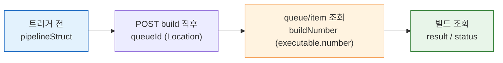
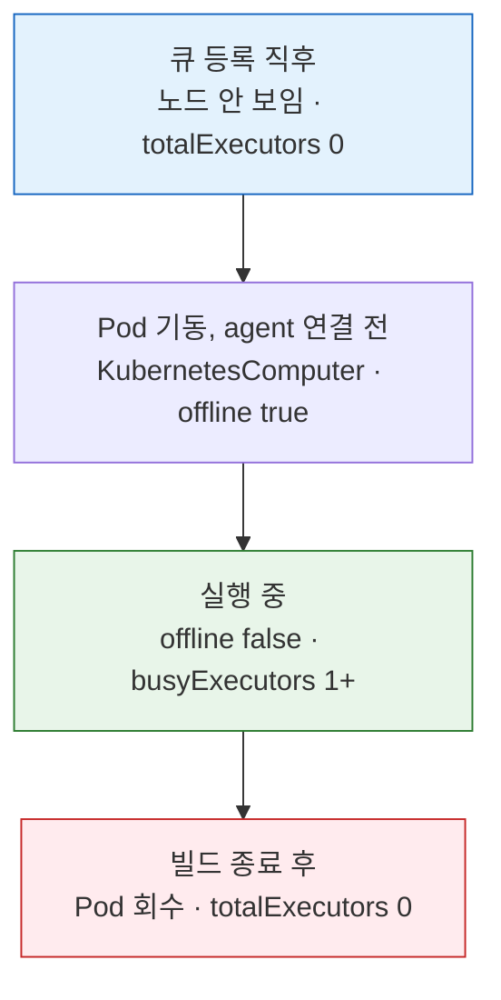

# 젠킨스 큐-빌드 전환과 실행기 환경 차이

> 이 문서는 큐-빌드 전환 흐름 자체보다 **그 흐름이 VM 정적 에이전트와 K8s 동적 에이전트에서 어떻게 다르게 보이는지**, 그리고 **TPS가 그 차이를 흡수하기 위해 무엇을 저장하는지**를 설명합니다.
>
> 다음은 다른 문서로 분담했습니다.
>
> - 큐 등록 → 대기 → executor 배정 → buildNumber 확정으로 이어지는 **개념적 두 단계 흐름과 입문 다이어그램**: `03-01.빌드 요청에서 실행까지.md` §2-§3 (queueId vs buildNumber, 단계별 값 타임라인, 자동화 함정 포함).
> - 큐 아이템 상태 전이(WaitingItem / BuildableItem / BlockedItem / LeftItem), `maintain()` 루프, `createExecutable()`과 빌드 디렉토리 생성, Quiet Period 동작, Queue ID와 Build Number의 정의 차이 같은 **Jenkins 소스 코드 수준의 큐 메커니즘**: `05-04.md` §2-§5.
> - 빌드 실행 API 자체: `05-01.md`. TPS 운영 패턴(Pre-trigger Guard, nextBuildNumber 트릭, dedupe): `05-02.md`.
>
> 이 문서가 단독으로 다루는 영역은 두 가지입니다 — **1절 TPS가 저장해야 하는 최소 데이터**, **2절 VM/K8s 실행기 환경 차이**.

## 학습 목표

> 이 문서를 읽고 나면 외부 실행 관리 서비스가 빌드 추적에 저장할 최소 4개 데이터를 식별하고, VM 정적 에이전트와 K8s 동적 에이전트에서 같은 `/computer`·`/queue` 응답이 다르게 해석되는 이유를 설명하며, controller 배포 위치와 빌드 실행 위치를 혼동하지 않고 판별할 수 있습니다.

## 사전 지식

> 05-01의 큐-빌드 전환 흐름을 알고 있다면, 이 문서는 그 흐름이 VM과 K8s 두 실행기 환경에서 어떻게 다르게 관측되는지로 확장한 것입니다.

## 진입 — 같은 큐 응답을 환경별로 다르게 읽어야 하는 이유

> 큐에 빌드가 적재된 다음부터가 자동화의 진짜 시작점입니다. `queueId` 하나를 손에 쥐었어도, 그 다음에 무엇을 저장하고 어떤 시점에 무엇을 조회할지가 정해져 있지 않으면 추적이 끊깁니다. 더 까다로운 점은 같은 `/computer`·`/queue` 응답이 VM 정적 에이전트와 K8s 동적 에이전트에서 정반대 의미로 읽힌다는 사실입니다. VM에서 `totalExecutors=0`은 "실행 불가"지만, K8s에서는 "아직 Pod가 안 떴다"일 수 있습니다. 이 문서는 그 해석 차이를 흡수하기 위해 외부 서비스가 무엇을 저장하고 어떻게 판별해야 하는지를 정리합니다.

## 1. TPS 기준으로 저장해야 하는 최소 데이터

> 이 개념은 이미 아는 "REST API 응답에서 필요한 식별자만 추려 DB에 박제하는" 작업의, 빌드 추적 측면입니다.

TPS나 외부 실행 관리 서비스가 빌드 추적을 위해 최소한으로 저장해야 하는 값은 네 개입니다. 이 네 값을 비유하면 택배 추적 번호와 같습니다 — `pipelineStruct`는 보내는 사람(어느 Job), `queueId`는 접수 번호(아직 트럭에 안 실림), `buildNumber`는 실제 운송장 번호(트럭에 실려 출발), `result`는 배송 완료 상태입니다. 접수 번호만으로는 물건이 어디 있는지 추적할 수 없고 운송장 번호로 넘어가야 하듯, `queueId`에서 `buildNumber`로 식별자가 전환됩니다. 이 비유는 식별자 전환까지 유효하고, "접수 번호가 영구 보존된다"는 점에서 깨집니다 — `queueId`는 큐를 떠나면 일정 시간 후 만료되므로 `buildNumber` 확보 전에 반드시 저장해야 합니다.

| 저장 값 | 확보 시점 | 이유 |
|---------|----------|------|
| `pipelineStruct` | 트리거 전 | 어떤 Job인지 식별 |
| `queueId` | `POST /build` 직후 `Location` 헤더 | queue 추적 시작점 |
| `buildNumber` | `/queue/item/{queueId}/api/json`의 `executable.number` | 실제 실행 추적 시작점 |
| `result` 또는 `status` | `/{pipelineStruct}/{buildNumber}/api/json` 또는 `wfapi/describe` | 완료 여부와 후속 처리 판단 |

큐 적재 이후 저장 데이터가 확보되는 시점을 흐름으로 보면 다음과 같습니다:



큐 적재 이후 데이터 흐름의 핵심은 "queueId로 시작해서 buildNumber로 넘어간다"는 한 줄로 요약됩니다. 두 식별자의 정의·범위·할당 시점 차이는 `05-04.md` §4 참조.

`buildNumber`를 확보하려고 `/queue/item/{queueId}/api/json` 전체를 받으면 큐 아이템 메타데이터가 수 KB 단위로 따라옵니다. 폴링이 잦은 추적 루프에서는 `executable.number` 한 필드만 필요할 때 `tree=executable[number]`로 응답을 수백 바이트 수준으로 줄여야 트래픽 비용이 줄어듭니다. `tree=`·`depth=`로 응답을 축소하는 원리와 수치(수십 KB→수백 바이트)는 [09-03. API 쿼리 최적화와 운영](09-03.API%20%EC%BF%BC%EB%A6%AC%20%EC%B5%9C%EC%A0%81%ED%99%94%EC%99%80%20%EC%9A%B4%EC%98%81.md)에서 다룹니다.

```bash
# tree= 로 executable.number 단일 필드만 요청 — 큐 아이템 메타데이터 전체(수 KB)를
# 받지 않고 수백 바이트로 축소. 폴링 루프에서 트래픽을 줄이는 핵심
curl -s --user "$USER:$TOKEN" \
  "$JENKINS/queue/item/$QUEUE_ID/api/json?tree=executable[number]"
# => {"executable":{"number":42}}  (number 가 null 이면 아직 buildNumber 미할당 = 대기 중)
```

## 2. VM / K8s 실행기 환경과 큐-빌드 전환 차이

에이전트 유형에 따라 executor 해석 방식이 달라집니다. VM 정적 에이전트는 숫자가 비교적 고정이지만, K8s 동적 에이전트는 Pod 생명주기 때문에 응답이 시점마다 달라집니다. 큰 그림은 다음과 같습니다.

- **VM 정적**: `/computer/api/json`의 노드와 executor 수가 평소에도 계속 보입니다.
- **K8s 동적**: 평소에는 안 보이다가, 빌드 요청 시 Pod가 뜨면서 노드와 executor가 잠시 나타납니다. `totalExecutors` 하나만 보면 오판하기 쉽습니다.

### 2-1. `totalExecutors`만으로 부족한 이유

K8s 동적 Pod는 빌드 시작 전에는 `/computer/api/json`에 executor가 거의 보이지 않을 수 있습니다. 그래서 `busyExecutors < totalExecutors` 비교만으로는 "지금 빌드를 더 받을 수 있는가"를 정확히 설명하지 못합니다.

| 환경 | `totalExecutors` | `busyExecutors` | 실제 의미 |
|------|------------------|-----------------|-----------|
| VM 정적 | 2 | 0 | 이미 떠 있는 노드가 바로 실행 준비 완료 |
| K8s 동적 (유휴) | 0 | 0 | Pod가 없고, 큐 등록 후 프로비저닝이 시작됨 |

### 2-2. 같은 API, 다른 해석

| 관점 | VM 정적 | K8s 동적 |
|------|---------|----------|
| `computer[]` | VM 노드가 평소에도 계속 보임 | 유휴 시 built-in node만 보일 수 있음 |
| `totalExecutors` | 빌드 없어도 1 이상 | 유휴 시 `0`이어도 "실행 불가"가 아님 |
| `offline` | `false`인 노드가 고정적으로 존재 | Pod가 뜨기 전에는 노드 자체가 없음 |
| 큐 비었을 때 | 바로 실행 가능한 정적 슬롯 있음 | 큐 등록 후 Pod 프로비저닝부터 시작 |

판단에 쓰는 API와 K8s에서의 해석 주의점은 다음과 같습니다.

| API | 핵심 필드 | K8s에서의 해석 주의점 |
|-----|-----------|----------------------|
| `/computer/api/json` | `busyExecutors`, `totalExecutors`, `computer[]._class`, `offline` | 유휴 시 `totalExecutors=0`이어도 실행 불가가 아님. `KubernetesComputer` 클래스로 식별 |
| `/queue/api/json` | `items[].why`, `items[].stuck` | "Waiting for next available executor"는 K8s에서 프로비저닝 진행 중일 수 있음 |
| `/label/{label}/api/json` | `clouds` | `KubernetesCloud`가 보이면 동적 프로비저닝 가능 |

### 2-3. K8s Pod 생명주기와 조회 시점

K8s 동적 Pod의 생명주기는 식당의 임시 주방 보조에 비유할 수 있습니다. 손님이 없을 때는 보조가 아예 없어서 인력 명부에 0명으로 보이고(`totalExecutors=0`), 주문이 들어오면 보조를 부르고(Pod 기동), 도착해 앞치마를 두르는 동안은 명부엔 있어도 일은 못 하며(`offline=true`), 조리를 시작해야 비로소 가동 인력이 됩니다(`busyExecutors≥1`). 주문이 끝나면 보조는 돌려보내져 다시 명부에서 사라집니다. 이 비유는 "인력이 0이라고 가게가 닫힌 게 아니다"라는 핵심까지 유효하고, "보조를 부르는 데 시간이 걸린다"는 프로비저닝 지연이 명부 숫자에 안 드러난다는 점에서 깨집니다 — 그래서 숫자 한 컷이 아니라 빌드 전후의 변화를 같이 봐야 합니다.

| 단계 | `/computer` 상태 | `/queue` 상태 | 해석 |
|------|------------------|---------------|------|
| 큐 등록 직후 | K8s 노드 안 보일 수 있음. `totalExecutors=0` 가능 | item 보임 | "실행기 없음"이 아니라 "프로비저닝 전" |
| Pod 기동, agent 연결 전 | `KubernetesComputer` 보이기 시작. `offline=true` 가능 | item 대기 중 | "노드가 보인다" ≠ "executor 즉시 사용 가능" |
| 실행 중 | `offline=false`, `busyExecutors≥1` | `executable.number` 채워짐 | executor가 잡혔다고 확실히 말할 수 있음 |
| 빌드 종료 후 | `KubernetesComputer` 사라짐. `totalExecutors` 다시 `0` | item 없음 | 실행 실패가 아니라 동적 에이전트 회수 |

`executable.number`가 보인다고 해서 pipeline stage가 실행 중이라고 단정할 수 없습니다. 실제 실행 여부는 `building=true`나 `wfapi` 상태로 확인해야 합니다.

K8s 동적 Pod가 큐 등록부터 회수까지 거치는 단계와 그때 `/computer`가 어떻게 보이는지를 흐름으로 보면 다음과 같습니다:



### 2-4. K8s 동적 Pod인지 VM인지 판단

Jenkins controller가 K8s 위에 배포돼 있다는 사실만으로 빌드가 K8s Pod에서 돈다고 결론 내리면 안 됩니다. 실제 판단은 controller 위치가 아니라 노드 상태와 queue 상태를 함께 읽습니다.

| 신호 | K8s 동적 Pod 가능성 | 정적 VM 가능성 |
|------|---------------------|----------------|
| `computer[]._class` | `KubernetesComputer` 계열이 보임 | `hudson.slaves.SlaveComputer` 계열이 계속 보임 |
| 노드 존재 시점 | 빌드 시점에만 잠깐 나타났다 사라짐 | 평상시에도 계속 보임 |
| `totalExecutors` | 유휴 시 `0`일 수 있음 | 유휴 시에도 1 이상인 경우가 많음 |
| `offline` | Pod 연결 전 `true`로 흔들릴 수 있음 | 고정 노드라면 상태 변화가 상대적으로 적음 |
| queue `why` | `Waiting for next available executor`가 프로비저닝 대기일 수 있음 | 실제로 고정 executor 부족일 가능성이 큼 |

빠르게 결론 내려야 할 때는 다음 세 가지만 봅니다 — `KubernetesComputer`의 생성·소멸이 빌드 생명주기와 함께 움직이는가, 고정 이름 노드가 평소에도 보이는가, `numExecutors`가 유지되는가. Jenkins controller 자체가 K8s에 떠 있다는 사실은 빌드 실행기가 K8s라는 근거가 아닙니다.

### 2-5. 운영 관점의 최소 판단 조합

실무에서 가장 단순하게는 다음 세 단계로 충분합니다.

1. `/computer/api/json`에서 `computer[]._class`, `displayName`, `offline` 확인
2. `/queue/api/json`에서 `why` 확인
3. 빌드 시작·종료 시점 전후로 노드가 생겼다 사라지는지 비교

이 조합만으로도 ① 정적 VM 슬롯 중심인지 ② K8s 동적 Pod 프로비저닝을 실제로 쓰는지 ③ queue 대기가 단순 슬롯 부족인지 동적 agent 기동 대기인지를 구분할 수 있습니다.

피해야 할 오해는 셋입니다.

- "Jenkins가 K8s에 있으니 빌드도 K8s Pod다"는 성립하지 않습니다.
- "`agent any`면 자동으로 K8s Pod를 쓴다"도 성립하지 않습니다.
- `totalExecutors=0`은 K8s 환경에서 "실행 불가"가 아니라 "아직 Pod가 안 떴다"일 수 있습니다.

## 면접 질문

> 답을 떠올린 뒤 §정답 절에서 같은 번호로 대조하세요.

1. K8s 동적 에이전트 환경에서 `totalExecutors=0`을 "실행 불가"로 해석하면 안 되는 이유는?
2. `executable.number`가 채워졌으면 pipeline stage가 실행 중이라고 단정할 수 있나요?
3. controller가 K8s에 떠 있는지와 빌드가 K8s Pod에서 도는지를 구분하려면 무엇을 봐야 하나요?

### 빈칸 채우기 — 큐-빌드 전환과 실행기 추적

다음 빈칸을 채워 보세요. 정답은 문서 끝 "빈칸 정답" 절에 있습니다.

1. 외부 실행 관리 서비스가 빌드 추적에 저장하는 네 값은 `pipelineStruct`, `______`(트리거 직후 `Location` 헤더), `buildNumber`, `result`입니다.
2. `buildNumber`는 `/queue/item/{queueId}/api/json` 응답의 `executable.______` 필드에서 확보합니다.
3. 큐 아이템에서 단일 필드만 받아 응답을 축소하려면 `______=executable[number]` 쿼리 파라미터를 씁니다.
4. K8s 동적 Pod가 실행 중일 때 `/computer` 응답의 노드 클래스는 `______Computer` 계열로 나타납니다.

## 정답

> 위 질문을 스스로 설명해 본 뒤에 펼치세요.

### 정답 1 — totalExecutors=0의 의미

K8s 동적 Pod는 빌드 요청 전에는 Pod가 없어 executor가 0으로 보일 수 있습니다. 이는 "실행 불가"가 아니라 "아직 Pod가 안 떴다(프로비저닝 전)"는 뜻입니다. 큐 등록 후 Pod가 뜨면서 executor가 잠시 나타나므로, `totalExecutors` 하나만 보면 오판합니다.

### 정답 2 — executable.number와 실행 여부

단정할 수 없습니다. `executable.number`가 보이는 것은 큐 아이템이 빌드로 전환됐다는 신호일 뿐, stage가 실제 실행 중인지는 `building=true`나 `wfapi` 상태로 따로 확인해야 합니다.

### 정답 3 — controller 위치 vs 실행 위치

`computer[]._class`가 `KubernetesComputer` 계열인지, 그 노드의 생성·소멸이 빌드 생명주기와 함께 움직이는지, 고정 이름 노드가 평소에도 보이는지를 봅니다. controller가 K8s에 떠 있다는 사실은 빌드 실행기가 K8s라는 근거가 되지 못합니다.

### 빈칸 정답 — 큐-빌드 전환과 실행기 추적

1. `queueId` — `POST /build` 직후 `Location` 헤더로 확보하는 큐 추적 시작점입니다.
2. `number` — `executable.number`가 `buildNumber`에 해당합니다. `null`이면 아직 실행으로 전환되지 않은 대기 상태입니다.
3. `tree` — `tree=executable[number]`로 반환 필드를 좁혀 응답을 수백 바이트로 축소합니다. 원리·수치 상세는 [09-03. API 쿼리 최적화와 운영](09-03.API%20%EC%BF%BC%EB%A6%AC%20%EC%B5%9C%EC%A0%81%ED%99%94%EC%99%80%20%EC%9A%B4%EC%98%81.md) 참조.
4. `Kubernetes` — `KubernetesComputer` 계열 노드가 빌드 생명주기와 함께 생성·소멸합니다.

## 관련 문서

> 큐 적재 이후의 식별자 전환과 실행기 환경 차이를 더 깊이 보려면, 큐 메커니즘 원본과 빌드 실행·상태 추적 스펙을 함께 읽으면 맥락이 이어집니다.

- [05-01. 빌드 실행·큐 API 스펙](05-01.%EB%B9%8C%EB%93%9C%20%EC%8B%A4%ED%96%89%C2%B7%ED%81%90%20API%20%EC%8A%A4%ED%8E%99.md) § "POST build / buildWithParameters" — 이 문서가 추적하는 `queueId`가 어디서 생기는지의 원본 스펙
- [05-02. 빌드 실행·큐 모델과 TPS 패턴 (2.222+)](05-02.%EB%B9%8C%EB%93%9C%20%EC%8B%A4%ED%96%89%C2%B7%ED%81%90%20%EB%AA%A8%EB%8D%B8%EA%B3%BC%20TPS%20%ED%8C%A8%ED%84%B4%20%282.222%2B%29.md) § "Pre-trigger Guard / nextBuildNumber" — 저장 데이터를 TPS가 실제로 어떻게 운영에 쓰는지
- [05-04. 큐 내부 흐름과 실행 순서](05-04.%ED%81%90%20%EB%82%B4%EB%B6%80%20%ED%9D%90%EB%A6%84%EA%B3%BC%20%EC%8B%A4%ED%96%89%20%EC%88%9C%EC%84%9C.md) § "상태 전이 / createExecutable" — queueId→buildNumber 전환이 Jenkins 소스에서 일어나는 지점
- [05-06. 큐·실행기 조회 API 스펙](05-06.%ED%81%90%C2%B7%EC%8B%A4%ED%96%89%EA%B8%B0%20%EC%A1%B0%ED%9A%8C%20API%20%EC%8A%A4%ED%8E%99.md) § "/computer / /queue" — 2절의 VM/K8s 해석에 쓰는 조회 API의 필드 정의
- [06-01. 빌드 상태 추적 API 스펙](06-01.%EB%B9%8C%EB%93%9C%20%EC%83%81%ED%83%9C%20%EC%B6%94%EC%A0%81%20API%20%EC%8A%A4%ED%8E%99.md) § "building / result" — `buildNumber` 확보 이후 완료 여부를 판단하는 다음 단계
