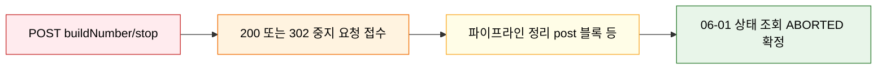
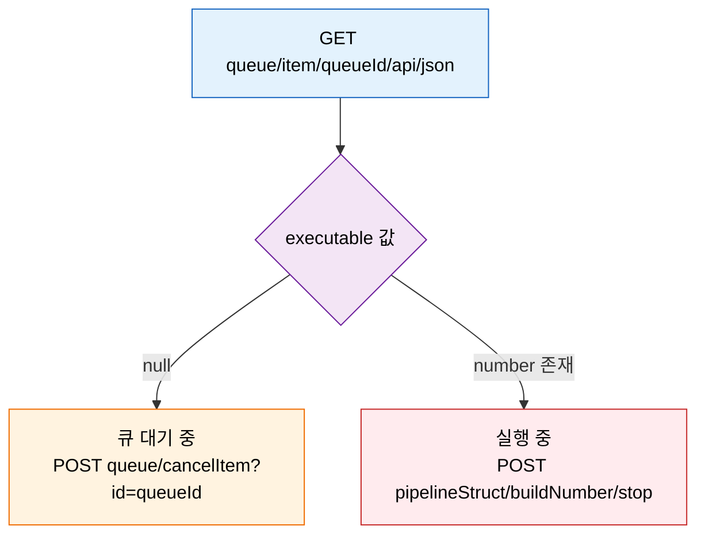

# 젠킨스 빌드 중지·취소 API 스펙
---
> 이 문서를 읽고 나면 실행 중인 빌드를 `stop`으로 중단하고 큐 대기 빌드를 `cancelItem`으로 취소하며, `executable` 필드를 기준으로 둘 중 어느 API를 써야 할지 정확히 분기하고, 두 API의 차이를 면접에서 설명할 수 있습니다.


## 사전 지식

> 05-01의 큐-빌드 전환(queue → executor 배정 → 실행)을 알고 있다면, 이 문서는 그 전환 어느 지점에 있느냐에 따라 중지·취소 API가 갈린다는 사실로 구체화한 것입니다.
>
> - 이 문서는 `05-01.빌드 실행·큐 API 스펙` 에서 분할된 제어용 API 편입니다.
> - 실행 중인 빌드 중지, 큐 대기 빌드 취소 API를 다룹니다.
> - 빌드 트리거·큐 조회·실행기 조회 API는 `05-01.빌드 실행·큐 API 스펙`에서 다룹니다.


## 진입 — 왜 중지와 취소를 두 API로 나누는가

> 하나의 "빌드를 멈춰라"라는 의도가 Jenkins에서는 대상이 어디 있느냐에 따라 두 개의 다른 엔드포인트로 갈라집니다. 이 갈림길을 모르면 404를 받고도 원인을 못 찾습니다.

사용자 입장에서는 "이 빌드 멈춰"라는 요청 하나입니다. 그런데 Jenkins 내부에서는 그 빌드가 큐에서 Executor 배정을 기다리는 중인지, 이미 Executor를 잡고 실행 중인지가 전혀 다른 상태입니다. 큐 대기 항목에는 빌드 번호조차 아직 없고, 실행 중 빌드에는 큐 아이템이 더 이상 존재하지 않습니다. 그래서 멈추는 조작도 두 개로 갈라집니다. 큐 대기 항목은 `/queue/cancelItem?id={queueId}`로 취소하고, 실행 중 빌드는 `/{pipelineStruct}/{buildNumber}/stop`으로 중지합니다. 이 편은 그 두 엔드포인트의 스펙과, 어느 쪽을 골라야 할지 판단하는 기준을 다룹니다.


## 1. 제어용 API: 빌드 중지 · 큐 취소 POST

> 이 두 API는 이미 아는 빌드 트리거(`build`/`buildWithParameters`)의 *역방향* 조작입니다. 트리거가 상태를 만든다면, 중지·취소는 그 상태를 거두어들이는 같은 POST 계열 호출입니다.

빌드 중지(`stop`)와 큐 취소(`cancelItem`)는 모두 상태를 바꾸는 쓰기 작업이므로 POST 메서드를 사용하고, 따라서 CSRF crumb이 필요합니다. POST 쓰기에 crumb이 붙는 원리는 [03-01. 인증 API 스펙](03-01.%EC%9D%B8%EC%A6%9D%20API%20%EC%8A%A4%ED%8E%99%20%28ID-Password%20%2B%20Crumb%29.md)에서 다룹니다.

### 1-1. `POST /{pipelineStruct}/{buildNumber}/stop`

> 실행 중인 빌드를 중단하는 API입니다.

이 섹션은 10초 대기 파이프라인 `API-SLEEP10`을 대상으로 보는 편이 가장 안정적입니다. 즉시 끝나는 빌드는 중지 요청을 보내기 전에 완료되어 버려서, 멈출 대상이 살아 있는 시간 창을 확보하기 어렵기 때문입니다.

요청 형식은 다음과 같습니다:

```http
POST /{pipelineStruct}/{buildNumber}/stop HTTP/1.1
Authorization: Basic <...>
Jenkins-Crumb: <crumb>
Cookie: <session-cookie>
```

예시는 다음과 같습니다:

```bash
curl -k -sS -D headers.txt -o /dev/null -w 'HTTP_STATUS=%{http_code}\n' \
  -X POST -b cookies.txt \
  -u "${JENKINS_USER}:${JENKINS_PASS}" \
  -H "${CRUMB_FIELD}: ${CRUMB}" \
  "${JENKINS_URL}${PIPELINE_SLEEP10_STRUCT}/${BUILD_NUMBER}/stop"

# 헤더만 봐야 결과 코드를 알 수 있어 -o /dev/null 로 본문은 버린다
cat headers.txt
```

직접 재현하려면, 먼저 `API-SLEEP10`을 실행하고 `BUILD_NUMBER`를 확보한 뒤 중지하는 순서가 가장 안전합니다:

```bash
# 1. 빌드 트리거 → Location 헤더에 큐 아이템 URL 이 실린다
curl -k -sS -D headers.txt -o /dev/null -w 'HTTP_STATUS=%{http_code}\n' \
  -X POST -b cookies.txt \
  -u "${JENKINS_USER}:${JENKINS_PASS}" \
  -H "${CRUMB_FIELD}: ${CRUMB}" \
  "${JENKINS_URL}${PIPELINE_SLEEP10_STRUCT}/build"

cat headers.txt

# 2. Location 헤더에서 queueId 만 추출 (정규식으로 마지막 숫자 캡처)
export QUEUE_ID=$(awk 'BEGIN{IGNORECASE=1} /^Location:/ {gsub("\r","",$2); print $2}' headers.txt | sed -E 's#.*/queue/item/([0-9]+)/?#\1#')
export QUEUE_ID_SLEEP10="${QUEUE_ID}"
echo "$QUEUE_ID_SLEEP10"

# 3. 큐 아이템이 Executor 에 배정되면 executable.number 가 곧 buildNumber 다
export BUILD_NUMBER=$(curl -k -sS -u "${JENKINS_USER}:${JENKINS_PASS}" \
  "${JENKINS_URL}/queue/item/${QUEUE_ID_SLEEP10}/api/json" \
  | jq -r '.executable.number')
echo "$BUILD_NUMBER"

# 4. 확보한 buildNumber 로 stop — 큐 ID 가 아니라 빌드 번호가 키다
curl -k -sS -D headers.txt -o /dev/null -w 'HTTP_STATUS=%{http_code}\n' \
  -X POST -b cookies.txt \
  -u "${JENKINS_USER}:${JENKINS_PASS}" \
  -H "${CRUMB_FIELD}: ${CRUMB}" \
  "${JENKINS_URL}${PIPELINE_SLEEP10_STRUCT}/${BUILD_NUMBER}/stop"

cat headers.txt
```

`stop` 요청 직후 곧바로 `ABORTED`가 확정되는 것은 아닙니다. 이 비동기성은 일상의 비유로 보면 화재경보 버튼과 같습니다. 버튼을 누르는 순간(요청 접수)과 건물이 실제로 비는 순간(상태 확정) 사이에는 대피 시간이 있습니다. 파이프라인의 `post` 정리 블록이 그 대피 시간에 해당합니다. 이 비유는 "버튼을 눌렀으니 즉시 끝난 것이 아니다"까지 유효하고, 버튼은 한 번 누르면 끝이지만 `stop`은 정리 도중 다시 호출해야 강제 종료되는 경우가 있다는 점에서 깨집니다.

stop 요청부터 최종 상태 확정까지의 흐름은 다음과 같습니다:



최종 결과는 `06-01`의 빌드 상태 조회 API에서 확인합니다.

에러 케이스는 다음과 같습니다:

| 상태 코드 | 의미 | 대응 |
|-----------|------|------|
| `200` 또는 `302` | 중지 요청 접수 | 이후 상태 API에서 결과 확인 |
| `403` | 권한 부족 또는 crumb 문제 | 인증/권한 확인 |
| `404` | 대상 빌드 없음 | `BUILD_NUMBER` 확인 |

`403`은 crumb 누락일 때 자주 나오는데, API token 인증으로 호출하면 crumb이 면제되므로 이 클래스의 실패를 줄일 수 있습니다. crumb·CSRF 보호와 API token 면제의 원리는 [03-01. 인증 API 스펙](03-01.%EC%9D%B8%EC%A6%9D%20API%20%EC%8A%A4%ED%8E%99%20%28ID-Password%20%2B%20Crumb%29.md)에서 다룹니다.

### 1-2. `POST /queue/cancelItem?id={queueId}`

> 아직 Executor에 배정되지 않은, 큐 대기 중인 빌드를 취소하는 API입니다.
>
> - `stop`과 달리 빌드 번호(`BUILD_NUMBER`)가 없어도 됩니다. 큐 아이템 ID(`queueId`)만 있으면 됩니다.
> - 빌드가 이미 Executor에 배정되어 실행 중이면 이 API로는 취소할 수 없습니다.

`cancelItem`과 `stop`의 차이는 좌석 예약 비유로 정리됩니다. `queueId`는 대기열 번호표이고 `buildNumber`는 배정된 좌석 번호입니다. 번호표를 들고 줄에 서 있는 동안에는 번호표(`cancelItem`)로 취소하지만, 일단 좌석에 앉으면 번호표는 회수되고 좌석 번호(`stop`)로만 일어나게 할 수 있습니다. 이 비유는 "대기 단계와 점유 단계의 식별자가 다르다"까지 유효하고, 실제 Jenkins에서는 좌석에 앉는 순간 번호표가 사라져 `cancelItem`이 `404`를 반환한다는 점에서 단순한 좌석 비유보다 비대칭적입니다.

요청 형식은 다음과 같습니다:

```http
POST /queue/cancelItem?id={queueId} HTTP/1.1
Authorization: Basic <...>
Jenkins-Crumb: <crumb>
Cookie: <session-cookie>
```

예시는 다음과 같습니다:

```bash
curl -k -sS -D headers.txt -o /dev/null -w 'HTTP_STATUS=%{http_code}\n' \
  -X POST -b cookies.txt \
  -u "${JENKINS_USER}:${JENKINS_PASS}" \
  -H "${CRUMB_FIELD}: ${CRUMB}" \
  "${JENKINS_URL}/queue/cancelItem?id=${QUEUE_ID_SLEEP10}"

cat headers.txt
```

직접 재현하려면, `API-SLEEP10`을 실행한 뒤 큐에 있는 동안 취소하는 순서가 안전합니다:

```bash
# 1. 빌드 트리거 후 queueId 확보 (executable 이 아직 null 인 시점이 취소 가능 창)
curl -k -sS -D headers.txt -o /dev/null -w 'HTTP_STATUS=%{http_code}\n' \
  -X POST -b cookies.txt \
  -u "${JENKINS_USER}:${JENKINS_PASS}" \
  -H "${CRUMB_FIELD}: ${CRUMB}" \
  "${JENKINS_URL}${PIPELINE_SLEEP10_STRUCT}/build"

export QUEUE_ID_SLEEP10=$(awk 'BEGIN{IGNORECASE=1} /^Location:/ {gsub("\r","",$2); print $2}' headers.txt \
  | sed -E 's#.*/queue/item/([0-9]+)/?#\1#')
echo "queueId: $QUEUE_ID_SLEEP10"

# 2. 큐에 있는 동안 취소 — executable 이 null 이어야 성공한다
curl -k -sS -D headers.txt -o /dev/null -w 'HTTP_STATUS=%{http_code}\n' \
  -X POST -b cookies.txt \
  -u "${JENKINS_USER}:${JENKINS_PASS}" \
  -H "${CRUMB_FIELD}: ${CRUMB}" \
  "${JENKINS_URL}/queue/cancelItem?id=${QUEUE_ID_SLEEP10}"

cat headers.txt

# 3. 취소 확인 — cancelled:true 면 큐에서 제거된 것이다
curl -k -sS -u "${JENKINS_USER}:${JENKINS_PASS}" \
  "${JENKINS_URL}/queue/item/${QUEUE_ID_SLEEP10}/api/json" \
  | jq '{id, cancelled, why}'
```

취소 후 `GET /queue/item/{queueId}/api/json`을 조회하면 다음처럼 나옵니다:

```json
{
  "id": 218,
  "cancelled": true,
  "why": null
}
```

`why`는 큐 대기 중일 때 "왜 아직 실행 못 했는지"(예: 비어 있는 Executor 대기)를 담는 필드인데, 취소되어 더 이상 대기하지 않으므로 `null`이 됩니다.

에러 케이스는 다음과 같습니다:

| 상태 코드 | 의미 | 대응 |
|-----------|------|------|
| `302` | 취소 성공 | `Location: /queue/` 헤더 확인 |
| `404` | 큐에 없음 | 이미 Executor에 배정되어 실행 중이면 `stop` API 사용 |
| `403` | 권한 부족 또는 crumb 문제 | 인증/권한 확인 |

### 1-3. 큐 취소 vs 빌드 중지: 판단 기준

판단 기준은 `GET /queue/item/{queueId}/api/json`의 `executable` 필드입니다. 이 필드 하나만 확인하면 분기가 결정되므로, 두 API를 순서대로 시도하며 404를 받아보는 시행착오를 피할 수 있습니다. 폴링 비용을 줄이려면 `tree=executable[number]`로 이 분기 키 필드만 받습니다 — 응답 축소(`tree=`·`depth=`)의 원리는 [09-03. API 쿼리 최적화와 운영](09-03.API%20%EC%BF%BC%EB%A6%AC%20%EC%B5%9C%EC%A0%81%ED%99%94%EC%99%80%20%EC%9A%B4%EC%98%81.md)에서 다룹니다.

`executable` 값에 따라 어느 API로 갈지 흐름으로 보면 다음과 같습니다:



| 상황 | `executable` 값 | 사용 API |
|------|-----------------|----------|
| 빌드가 아직 큐에 있음 | `null` | `POST /queue/cancelItem?id={queueId}` |
| 빌드가 이미 실행 중 | `{"number": N, "url": "..."}` | `POST /{pipelineStruct}/{buildNumber}/stop` |

다음 명령으로 현재 상태를 조회하고 분기할 수 있습니다:

```bash
# executable 이 null 이면 큐 대기, 객체면 실행 중 — 이 한 필드가 분기 키다
EXECUTABLE=$(curl -k -sS -u "${JENKINS_USER}:${JENKINS_PASS}" \
  "${JENKINS_URL}/queue/item/${QUEUE_ID_SLEEP10}/api/json" \
  | jq -r '.executable')

if [ "$EXECUTABLE" = "null" ]; then
  echo "큐 대기 중 → cancelItem 사용"
else
  # 실행 단계이므로 number 를 뽑아 stop 의 키로 쓴다
  BUILD_NUMBER=$(echo "$EXECUTABLE" | jq -r '.number')
  echo "실행 중 (buildNumber=$BUILD_NUMBER) → stop 사용"
fi
```

> `cancelItem` 호출 시 Jenkins 내부에서 일어나는 WaitingItem/BlockedItem/BuildableItem 상태 전이, DB 기록 흐름은 `05-04.큐 내부 흐름과 실행 순서`에서 다룹니다.


## 2. 면접 질문

> 아래 질문은 본문 스펙에서 도출한 것입니다. 답을 보지 말고 먼저 자기 말로 설명해 본 뒤 `## 정답` 절과 맞춰 봅니다.

1. `stop`과 `cancelItem`은 무엇이 다른가요? 같은 "빌드 멈추기"인데 왜 두 API로 갈라져 있고, 각각의 키(`buildNumber` vs `queueId`)는 무엇인가요?
2. 큐 단계와 실행 단계 중 어디에 있는지 어떻게 판별해서 두 API 중 하나를 고르나요? 판별 기준 필드 하나를 들고 설명해 보세요.
3. 실행 중인 빌드에 `cancelItem`을 호출하면 어떤 응답이 오고, 왜 그렇게 되나요? 반대로 큐 대기 항목에 `stop`을 호출하면 어떤 문제가 있나요?
4. `stop` 요청이 `200`/`302`를 받았는데도 상태가 곧바로 `ABORTED`가 아닌 이유는 무엇이고, 최종 결과는 어디서 확인하나요?

### 빈칸 채우기 — stop·cancelItem 분기

다음 빈칸을 채워 보세요. 정답은 이 문서 끝 `### 빈칸 정답` 절에 있습니다.

1. 큐 대기 항목은 빌드 번호가 없으므로 `_____` 만으로 `POST /queue/_____?id={…}` 를 호출해 취소합니다.
2. 실행 중인 빌드는 `_____` 를 키로 `POST /{pipelineStruct}/{…}/_____` 를 호출해 중지합니다.
3. 두 API 중 어느 쪽을 쓸지는 큐 아이템 조회의 `_____` 필드가 `null` 인지 객체인지로 판별합니다.
4. 취소가 성공하면 큐 아이템 조회의 `cancelled` 가 `_____` 가 되고, `why` 는 `_____` 가 됩니다.


## 정답

### 정답 1 — stop과 cancelItem의 차이

`stop`과 `cancelItem`은 대상이 빌드 생명주기의 어느 단계에 있는지에 따라 갈립니다. 큐에 대기 중인 항목은 아직 빌드 번호가 부여되지 않았고 큐 아이템 ID(`queueId`)만 가지므로, `POST /queue/cancelItem?id={queueId}` 로 취소합니다. 반면 Executor에 배정되어 실행이 시작되면 빌드 번호(`buildNumber`)가 생기고 그때부터는 `POST /{pipelineStruct}/{buildNumber}/stop` 으로 중지합니다. 즉 `cancelItem`의 키는 `queueId`이고 `stop`의 키는 `buildNumber`입니다. 둘은 상태를 거두는 같은 POST 계열이지만, 식별자가 단계별로 바뀌기 때문에 엔드포인트도 둘로 나뉩니다.

### 정답 2 — 단계 판별과 API 선택

판별 기준은 `GET /queue/item/{queueId}/api/json` 응답의 `executable` 필드 하나입니다. `executable`이 `null`이면 아직 큐에서 Executor 배정을 기다리는 단계이므로 `cancelItem`을 씁니다. `executable`이 `{"number": N, "url": "..."}` 같은 객체면 이미 실행 중이라는 뜻이고, 그 안의 `number`가 곧 `buildNumber`이므로 그 값을 꺼내 `stop`을 호출합니다. 한 필드만 보면 되므로 두 API를 차례로 찔러보며 404를 확인하는 시행착오가 필요 없습니다. 폴링할 때는 `tree=executable[number]`로 이 필드만 받아 비용을 줄입니다(응답 축소 원리는 09-03 참조).

### 정답 3 — 잘못된 단계에 호출했을 때

실행 중인 빌드에 `cancelItem`을 호출하면 `404`가 돌아옵니다. 빌드가 Executor에 배정되는 순간 큐 아이템은 큐에서 제거되어 더 이상 `queueId`로 조회되지 않기 때문입니다. 이때는 응답 표의 안내대로 `stop` API로 전환해야 합니다. 반대로 큐 대기 항목에는 아직 `buildNumber`가 없으므로 `stop` 경로를 만들 수조차 없습니다(빌드 번호 자리에 넣을 값이 없음). 그래서 두 API는 상호 배타적이며, 호출 전에 `executable`로 단계를 먼저 확인하는 것이 안전합니다.

### 정답 4 — 비동기 중지와 최종 확인

`stop`은 "중지 요청을 접수했다"는 의미로 `200` 또는 `302`를 즉시 반환하지만, 그 시점에 빌드가 곧바로 `ABORTED`가 되지는 않습니다. 파이프라인에는 `post` 정리 블록처럼 종료 직전에 수행되는 마무리 단계가 있어서, 그 정리가 끝난 뒤에야 최종 상태가 확정되기 때문입니다. 따라서 `stop`의 HTTP 응답 코드는 "요청이 받아들여졌다"까지만 보장하며, 실제로 중단됐는지는 `06-01`의 빌드 상태 조회 API에서 `result`가 `ABORTED`로 바뀌었는지 확인해야 합니다.

### 빈칸 정답 — stop·cancelItem 분기

1. `queueId` / `cancelItem`
2. `buildNumber` / `stop`
3. `executable`
4. `true` / `null`


## 관련 문서

> 이 편의 stop·cancelItem 제어 API는 빌드 실행·큐 흐름과 한 쌍을 이룹니다. 트리거로 만든 상태를 어떻게 거두는지, 그리고 취소가 큐 내부에서 어떤 전이를 일으키는지를 아래 문서로 이어 봅니다.

- [05-01. 빌드 실행·큐 API 스펙](./05-01.빌드%20실행·큐%20API%20스펙.md) § "빌드 트리거" — 이 편이 거두는 상태를 만드는 정방향 트리거·큐 조회 본편
- [05-04. 큐 내부 흐름과 실행 순서](./05-04.큐%20내부%20흐름과%20실행%20순서.md) § "WaitingItem 전이" — cancelItem이 일으키는 큐 상태 전이와 DB 기록 흐름
- [05-06. 큐·실행기 조회 API 스펙](./05-06.큐·실행기%20조회%20API%20스펙.md) § "executable 필드" — 분기 키인 executable을 조회하는 큐·실행기 조회 스펙
- [06-01. 빌드 상태 추적 API 스펙](./06-01.빌드%20상태%20추적%20API%20스펙.md) § "result 필드" — stop 후 ABORTED 확정을 확인하는 상태 추적 API
- [03-01. 인증 API 스펙 (ID-Password + Crumb)](./03-01.인증%20API%20스펙%20%28ID-Password%20%2B%20Crumb%29.md) § "Crumb 발급" — 두 POST 호출이 요구하는 CSRF crumb 발급 절차
