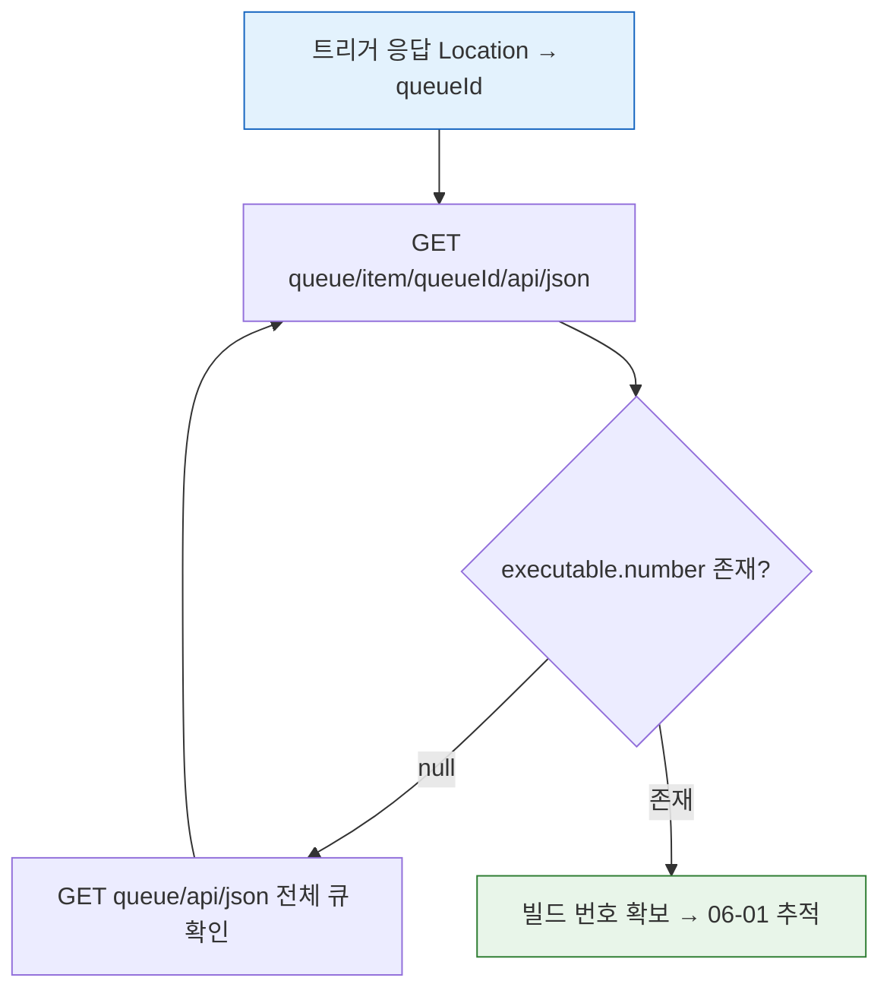
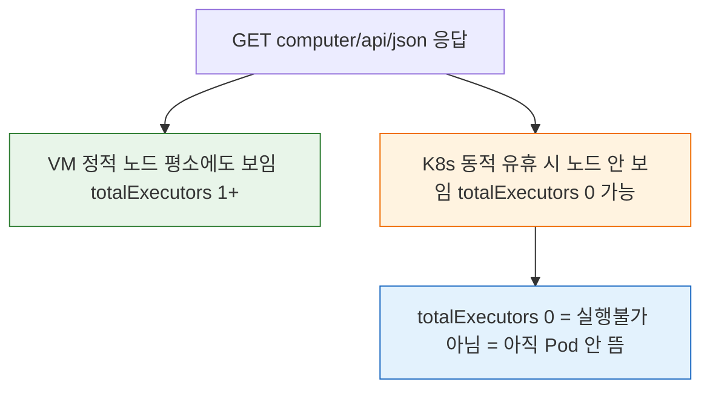

# 젠킨스 큐·실행기 조회 API 스펙
---
> 이 문서는 `05-01.빌드 실행·큐 API 스펙` 에서 분할된 큐·실행기 조회 편입니다.
>
> - 큐 상태 GET, 전체 큐 조회, 실행기(computer) 조회 API를 다룹니다.
> - 빌드 트리거·트리거 응답 처리는 `05-01.빌드 실행·큐 API 스펙`에서 다룹니다.
> - 빌드 중지·취소 제어 API는 `05-05.빌드 중지·취소 API 스펙`에서 다룹니다.

> 이 문서를 읽고 나면 `queueId`로 큐 아이템을 조회해 `executable.number`(실제 빌드 번호)를 얻는 과정을 설명하고, 전체 큐(`/queue`)와 실행기(`/computer`) 상태로 적체·부하를 진단하며, 이 조회 API가 모두 GET이라 crumb 없이 호출되는 이유를 예측할 수 있습니다.

## 사전 지식

> 05-01에서 본 "트리거 직후 받는 값은 queueId"라는 사실을 알고 있다면, 이 문서는 그 queueId로 실제 빌드 번호에 도달하고 주변 큐·실행기 상태까지 읽는 조회 도구 모음입니다.

## 진입 — 트리거 응답만으로는 빌드 번호를 알 수 없다

> 05-01에서 빌드를 트리거하면 응답 `Location` 헤더로 `queueId`가 돌아옵니다. 그런데 `queueId`는 빌드 번호가 아니라 "큐 대기열에서의 자리표"입니다. 실제 빌드 번호(`executable.number`)는 executor가 큐 아이템을 집어 실행을 시작하는 순간에야 채워집니다. 그래서 트리거와 상태 추적(06-01) 사이에는 "큐를 폴링해 빌드 번호를 받아내는" 단계가 반드시 끼어듭니다. 이 문서가 그 단계를 메우는 조회 API를 다룹니다. 큐가 막히거나 비어 있을 때 왜 그런지 진단하려면 같은 GET 계열인 `/computer`(실행기) 조회까지 함께 봐야 하므로, 큐와 실행기를 한 묶음으로 정리합니다.

## 1. 필수 후속 조회: 큐 상태 GET API

> 이 개념은 이미 아는 "트리거 응답의 queueId"가, 실제 빌드 번호로 바뀌어 가는 *상태 전이의 관측 창구*라는 측면입니다.

큐 아이템에서 빌드 번호로 가는 전환은 **은행 번호표**에 비유할 수 있습니다. 번호표(`queueId`)를 뽑는다고 창구(executor)가 바로 열리지는 않고, 내 차례가 되어 창구로 불려 갈 때 비로소 "몇 번 창구"(`executable.number`)가 정해집니다. 이 비유는 "대기 → 호출 → 처리 시작"의 순서까지는 유효하지만, 은행 번호표는 처리가 끝나도 남아 있는 반면 Jenkins `queueId`는 빌드가 시작되고 몇 분 지나면 큐에서 사라져 `404`가 된다는 점에서 깨집니다. 그래서 빌드 번호를 받아낸 뒤에는 `queueId`를 버리고 빌드 번호로 추적해야 합니다.

### 1-0. 선행 작업: 5개 파이프라인 일괄 트리거

> 큐 조회 API를 실습하려면 먼저 빌드가 큐에 들어가 있어야 합니다. 아래 스크립트로 5개 파이프라인을 한번에 트리거하고 각 queue ID를 변수에 저장합니다.

```bash
# 5개 파이프라인 일괄 트리거 + queue ID 추출
for STRUCT_VAR in \
  "NORMAL:${PIPELINE_NORMAL_STRUCT}" \
  "NORMAL_2:${PIPELINE_NORMAL_2_STRUCT}" \
  "FAIL:${PIPELINE_FAIL_STRUCT}" \
  "SLEEP10:${PIPELINE_SLEEP10_STRUCT}"; do

  NAME="${STRUCT_VAR%%:*}"
  STRUCT="${STRUCT_VAR#*:}"

  # PARAM 잡만 buildWithParameters — 파라미터를 받는 엔드포인트가 다르기 때문
  if [ "$NAME" = "PARAM" ]; then
    ENDPOINT="buildWithParameters"
    EXTRA_ARGS="--data-urlencode BRANCH=${PARAM_BRANCH} --data-urlencode ENV=${PARAM_ENV}"
  else
    ENDPOINT="build"
    EXTRA_ARGS=""
  fi

  # build/buildWithParameters는 상태를 바꾸는 POST라 crumb 헤더를 동반
  # (출처: jenkins.io/doc/book/using/remote-access-api — build/buildWithParameters는 POST)
  curl -k -sS -D "headers_${NAME}.txt" -o /dev/null \
    -w "HTTP_STATUS=%{http_code}\n" \
    -X POST -b cookies.txt \
    -u "${JENKINS_USER}:${JENKINS_PASS}" \
    -H "${CRUMB_FIELD}: ${CRUMB}" \
    ${EXTRA_ARGS} \
    "${JENKINS_URL}${STRUCT}/${ENDPOINT}"

  # 응답 Location 헤더(/queue/item/N/)에서 queueId만 추출해 변수에 저장
  QUEUE_ID_VAL=$(grep -i '^location:' "headers_${NAME}.txt" \
    | sed 's|.*/queue/item/\([0-9]*\)/.*|\1|' | tr -d '\r')
  export "QUEUE_ID_${NAME}=${QUEUE_ID_VAL}"
  echo "${NAME}: queue/item/${QUEUE_ID_VAL}/"
done
```

실행 결과는 다음과 같은 형태가 됩니다:

```text
NORMAL: queue/item/215/
NORMAL_2: queue/item/216/
FAIL: queue/item/217/
SLEEP10: queue/item/218/
PARAM: queue/item/219/
```

- 이제 `QUEUE_ID_NORMAL`, `QUEUE_ID_NORMAL_2`, `QUEUE_ID_FAIL`, `QUEUE_ID_SLEEP10`, `QUEUE_ID_PARAM` 변수에 각 queue ID가 저장되어 있습니다. 
- 아래 조회 API에서 바로 사용할 수 있습니다.

### 1-1. `GET /queue/api/json` — 전체 큐 한눈에 보기

> 개별 queue ID를 하나씩 조회하기 전에, 전체 큐를 한번에 보면 현재 어떤 Job이 대기 중인지 빠르게 파악할 수 있습니다.

5개를 트리거한 직후 바로 조회하면 큐에 아이템이 보입니다. 빠른 Job은 금방 큐를 빠져나가므로, 트리거 직후에 조회하는 것이 핵심입니다.

```bash
# /queue/api/json — 어떤 객체 URL에도 /api/json을 붙이면 그 객체를 JSON으로 반환
# (출처: jenkins.io/doc/book/using/remote-access-api)
curl -k -sS -u "${JENKINS_USER}:${JENKINS_PASS}" \
  "${JENKINS_URL}/queue/api/json" \
  | jq '{
      numItems: (.items | length),
      items: [.items[]? | {
        id,
        statusClass: ._class,
        why,
        taskName: .task.name
      }]
    }'
```

큐가 비어 있지 않다면 다음과 같은 응답이 보입니다:

```json
{
  "numItems": 3,
  "items": [
    {
      "id": 215,
      "statusClass": "hudson.model.Queue$BuildableItem",
      "why": "Waiting for next available executor",
      "taskName": "API-NORMAL"
    },
    {
      "id": 218,
      "statusClass": "hudson.model.Queue$WaitingItem",
      "why": "In the quiet period. Expires in 3.1 sec",
      "taskName": "API-SLEEP10"
    },
    {
      "id": 219,
      "statusClass": "hudson.model.Queue$WaitingItem",
      "why": "In the quiet period. Expires in 4.2 sec",
      "taskName": "API-PARAM"
    }
  ]
}
```

- executor가 충분하면 대부분의 아이템이 금방 큐를 빠져나갑니다. 
- 빈 큐(`numItems: 0`)가 보이면 이미 모두 executor를 잡은 것입니다.

Jenkins는 큐 아이템 상태를 `_class`로 구분합니다:

| `_class` 값 | 상태 | 설명 |
|-------------|------|------|
| `Queue$WaitingItem` | 대기 중 | Quiet Period를 기다리는 상태 |
| `Queue$BlockedItem` | 차단됨 | 이전 빌드나 정책 때문에 시작이 막힌 상태 |
| `Queue$BuildableItem` | 실행 가능 대기 | 실행 조건은 충족됐지만 executor를 기다리는 상태 |

주요 응답 필드는 다음과 같습니다:

| 필드 | 타입 | 의미 |
|------|------|------|
| `items` | Array | 현재 큐 아이템 목록 |
| `items[].id` | Integer | 큐 아이템 ID |
| `items[]._class` | String | 큐 상태 클래스 |
| `items[].why` | String | 대기 이유 |
| `items[].task.name` | String | 대상 Job 이름 |

#### `tree=`로 응답 줄이기

기본 `/queue/api/json`은 각 아이템의 모든 서브트리를 펼쳐 반환하므로, 큐가 길면 응답이 수십 KB에 이릅니다. 필요한 필드만 골라 받고 싶다면 `tree=` 파라미터로 반환 트리를 직접 선택합니다. Jenkins는 `tree=`에 적힌 필드만 응답에 남기고 나머지는 잘라내므로, 응답 크기를 수십 KB에서 수백 바이트 수준으로 줄일 수 있습니다(출처: jenkins.io/doc/book/using/remote-access-api — `tree=`로 반환 필드 선택, `depth=`로 서브트리 깊이 제어).

```bash
# tree=로 items의 id·why·task.name만 선택 — 응답을 수십 KB → 수백 B로 축소
# 중첩 객체는 부모[자식,자식] 문법으로 표기 (task[name]이 task.name 한 필드만 남김)
curl -k -sS -u "${JENKINS_USER}:${JENKINS_PASS}" \
  "${JENKINS_URL}/queue/api/json?tree=items[id,why,task[name]]"
```

- `tree=`는 *필드를 더하는* 게 아니라 *나머지를 빼는* 화이트리스트입니다. 적은 필드만 적을수록 응답이 작아집니다.
- 반대로 `depth=`는 *중첩 깊이*를 키워 더 깊은 객체까지 펼칩니다. `depth`를 키울수록 응답이 커지므로, 큐 조회에서는 보통 `tree=`로 줄이는 쪽을 씁니다(출처: jenkins.io/doc/book/using/remote-access-api — `depth=`가 클수록 더 깊은 중첩 반환).

### 1-2. `GET /queue/item/{queueId}/api/json` — 개별 큐 아이템 조회

> 전체 큐에서 대략적인 상태를 파악했으면, 특정 Job의 큐 아이템을 개별 조회해서 `executable.number`(실제 빌드 번호)를 확인합니다.

5개 파이프라인의 큐 상태를 한번에 조회하는 스크립트는 다음과 같습니다:

```bash
for NAME_ID in \
  "NORMAL:${QUEUE_ID_NORMAL}" \
  "NORMAL_2:${QUEUE_ID_NORMAL_2}" \
  "FAIL:${QUEUE_ID_FAIL}" \
  "SLEEP10:${QUEUE_ID_SLEEP10}" \
  "PARAM:${QUEUE_ID_PARAM}"; do

  NAME="${NAME_ID%%:*}"
  QID="${NAME_ID#*:}"

  echo "=== ${NAME} (queue/${QID}) ==="
  curl -k -sS -u "${JENKINS_USER}:${JENKINS_PASS}" \
    "${JENKINS_URL}/queue/item/${QID}/api/json" \
    | jq '{
        id,
        cancelled,
        stuck,
        why,
        task: .task.name,
        executable: (.executable | if . == null then "아직 미배정" else {number, url} end)
      }'
  echo
done
```

개별 Job 하나만 조회하고 싶다면 다음과 같습니다:

```bash
curl -k -sS -u "${JENKINS_USER}:${JENKINS_PASS}" \
  "${JENKINS_URL}/queue/item/${QUEUE_ID_SLEEP10}/api/json" \
  | jq '{
      id,
      cancelled,
      stuck,
      why,
      task: (.task | if . == null then null else {name, url} end),
      executable: (.executable | if . == null then null else {number, url} end)
    }'
```

빌드가 아직 시작되지 않은 상태에서는 `executable`이 `null`입니다:

```json
{
  "id": 218,
  "cancelled": false,
  "stuck": false,
  "why": "Waiting for next available executor",
  "task": {
    "name": "API-SLEEP10",
    "url": "https://jenkins.example.com/job/SBH/job/API-SLEEP10/"
  },
  "executable": null
}
```

빌드가 실제로 시작되면 `executable.number`가 채워집니다:

```json
{
  "id": 218,
  "cancelled": false,
  "stuck": false,
  "why": null,
  "task": {
    "name": "API-SLEEP10",
    "url": "https://jenkins.example.com/job/SBH/job/API-SLEEP10/"
  },
  "executable": {
    "number": 9,
    "url": "https://jenkins.example.com/job/SBH/job/API-SLEEP10/9/"
  }
}
```

주요 응답 필드는 다음과 같습니다:

| 필드 | 타입 | 의미 |
|------|------|------|
| `id` | Integer | 큐 아이템 ID |
| `cancelled` | Boolean | 취소 여부 |
| `stuck` | Boolean | 큐 진행 정체 여부 |
| `why` | String/null | 대기 중인 이유 (실행 중이면 `null`) |
| `task` | Object | 대상 Job 정보 |
| `executable` | Object/null | 실제 빌드 정보 (`null`이면 아직 executor 미배정) |
| `executable.number` | Integer | 실제 빌드 번호 |

트리거 직후 큐·실행기를 조회해 빌드 번호에 도달하는 흐름은 다음과 같습니다:



### 1-3. 전체 큐 vs 개별 큐 아이템: 언제 어떤 것을 쓰는가

| 상황 | 추천 API | 이유 |
|------|---------|------|
| 현재 큐에 뭐가 있는지 빠르게 확인 | `GET /queue/api/json` | 한 번 호출로 전체 목록 |
| 특정 Job의 빌드 번호 추적 | `GET /queue/item/{queueId}/api/json` | `executable.number` 확인 |
| 큐가 비었는지 확인 | `GET /queue/api/json` | `items` 길이만 보면 됩니다 |
| 대기 이유 상세 확인 | `GET /queue/item/{queueId}/api/json` | Job별 `why` 필드 |

에러 케이스는 두 API 공통으로 다음과 같습니다:

| 상태 코드 | 의미 | 대응 |
|-----------|------|------|
| `200` | 조회 성공 | 응답 필드 확인 |
| `401` | 인증 실패 | 인증 정보 확인 |
| `403` | 조회 권한 부족 | Jenkins 권한 확인 |
| `404` | 큐 아이템 없음 (개별 조회만) | `QUEUE_ID` 확인 |


## 2. 관찰용 보조 조회 API

### 2-1. `GET /computer/api/json`

> Jenkins 전체 노드와 executor 상태를 조회하는 API입니다.
>
> - 이 API는 평상시에도 볼 수 있지만, `API-SLEEP10`을 실행해둔 상태에서 보면 executor 변화가 더 잘 드러납니다.
> - 실행기 변화를 더 분명하게 보고 싶다면, 먼저 아래처럼 `API-SLEEP10`을 실행한 뒤 바로 조회합니다:

```bash
curl -k -sS -D headers.txt -o /dev/null -w 'HTTP_STATUS=%{http_code}\n' \
  -X POST -b cookies.txt \
  -u "${JENKINS_USER}:${JENKINS_PASS}" \
  -H "${CRUMB_FIELD}: ${CRUMB}" \
  "${JENKINS_URL}${PIPELINE_SLEEP10_STRUCT}/build"

cat headers.txt
```

요청 형식은 다음과 같습니다:

```http
GET /computer/api/json HTTP/1.1
Authorization: Basic <...>
Accept: application/json
```

예시는 다음과 같습니다:

```bash
# busyExecutors/totalExecutors로 전체 사용량을, computer[]로 노드별 상세를 한 응답에서 확인
# _class를 같이 뽑는 이유: VM 정적 노드와 K8s 동적 노드를 클래스명으로 구분하기 위함
curl -k -sS -u "${JENKINS_USER}:${JENKINS_PASS}" \
  "${JENKINS_URL}/computer/api/json" \
  | jq '{
      busyExecutors,
      totalExecutors,
      computers: [.computer[]? | {
        displayName,
        class: ._class,
        numExecutors,
        idle,
        offline,
        labels: [.assignedLabels[]?.name]
      }]
    }'
```

주요 응답 필드는 다음과 같습니다:

| 필드 | 타입 | 의미 |
|------|------|------|
| `busyExecutors` | Integer | 현재 사용 중인 executor 수 |
| `totalExecutors` | Integer | 전체 executor 수 |
| `computer` | Array | 노드 목록 |
| `computer[]._class` | String | 노드 클래스 |
| `computer[].displayName` | String | 노드 표시 이름 |
| `computer[].numExecutors` | Integer | 노드별 executor 수 |
| `computer[].idle` | Boolean | 유휴 여부 |
| `computer[].offline` | Boolean | 오프라인 여부 |
| `computer[].assignedLabels` | Array | 노드 label 목록 |

이 응답은 다음 순서로 읽는 편이 안전합니다:

- 먼저 `busyExecutors`, `totalExecutors`로 현재 전체 executor 사용량을 봅니다.
- 그 다음 `computer[]`에서 `displayName`, `_class`, `offline`을 봅니다.
- 마지막으로 `assignedLabels`를 보고 어떤 label 기반으로 붙은 노드인지 확인합니다.

빠른 해석 기준은 다음과 같습니다:

- `totalExecutors`가 평소에도 1 이상이면 정적 VM 또는 built-in node가 계속 열려 있을 가능성이 높습니다.
- `totalExecutors=0`이어도 K8s 동적 환경이라면 아직 Pod가 안 뜬 상태일 수 있습니다.
- `computer[]._class`에 `KubernetesComputer` 계열이 보이면 K8s 동적 에이전트 가능성이 높습니다.
- `offline=true`이면 노드가 보이더라도 아직 즉시 실행 가능한 상태가 아닐 수 있습니다.

현재 출력이 다음처럼 보일 수도 있습니다:

```json
{
  "busyExecutors": 1,
  "totalExecutors": 1,
  "computers": [
    {
      "displayName": "Built-In Node",
      "class": "hudson.model.Hudson$MasterComputer",
      "numExecutors": 0,
      "idle": false,
      "offline": false,
      "labels": [
        "built-in"
      ]
    },
    {
      "displayName": "jenkins-pod-agent-k7sft",
      "class": "org.csanchez.jenkins.plugins.kubernetes.KubernetesComputer",
      "numExecutors": 1,
      "idle": false,
      "offline": false,
      "labels": [
        "jenkins-jenkins-agent",
        "k8s-agent",
        "jenkins-pod-agent-k7sft"
      ]
    },
    {
      "displayName": "slave1",
      "class": "hudson.slaves.SlaveComputer",
      "numExecutors": 10,
      "idle": true,
      "offline": true,
      "labels": [
        "slave1"
      ]
    }
  ]
}
```

이 경우 해석은 다음과 같습니다:

- 현재 실행 중인 Job은 없어서 `busyExecutors=0`입니다.
- `slave1`이 executor 10개를 제공하므로 `totalExecutors=10`입니다.
- `Built-In Node`는 보이더라도 `numExecutors=0`이므로 controller 빌드 슬롯은 없는 상태입니다.

응답 해석은 단순 API 조회까지만 이 문서에서 다룹니다. VM/K8s 동적 판별과 Pod 생명주기 영향은 `05-03`에서 별도로 다룹니다.

같은 `/computer` 응답이 두 실행기 환경에서 다르게 읽히는 지점을 그림으로 보면 다음과 같습니다:



에러 케이스는 다음과 같습니다:

| 상태 코드 | 의미 | 대응 |
|-----------|------|------|
| `200` | 조회 성공 | executor 상태 확인 |
| `401` | 인증 실패 | 인증 정보 확인 |
| `403` | 조회 권한 부족 | Jenkins 권한 확인 |

### 2-2. `GET /computer/{agentId}/api/json`

> 특정 에이전트(노드) 한 건의 상세 정보를 조회하는 API입니다.

`/computer/api/json`이 전체 노드 목록을 반환하는 것과 달리, 이 API는 단일 에이전트의 상세 필드를 더 직접적으로 조회합니다. `{agentId}`는 Jenkins UI의 노드 이름 또는 `/computer/api/json`의 `computer[].displayName`에서 얻습니다.

요청 형식은 다음과 같습니다:

```http
GET /computer/{agentId}/api/json HTTP/1.1
Authorization: Basic <...>
Accept: application/json
```

예시는 다음과 같습니다:

```bash
export AGENT_ID='slave1'

curl -k -sS -u "${JENKINS_USER}:${JENKINS_PASS}" \
  "${JENKINS_URL}/computer/${AGENT_ID}/api/json" \
  | jq '{
      displayName,
      class: ._class,
      numExecutors,
      idle,
      offline,
      offlineCause,
      labels: [.assignedLabels[]?.name]
    }'
```

K8s 동적 Pod 에이전트처럼 이름이 동적으로 바뀌는 경우에는 먼저 `/computer/api/json`으로 목록을 확인한 뒤 `displayName`을 추출해서 사용합니다:

```bash
export AGENT_ID=$(curl -k -sS -u "${JENKINS_USER}:${JENKINS_PASS}" \
  "${JENKINS_URL}/computer/api/json" \
  | jq -r '.computer[] | select(._class | contains("Kubernetes")) | .displayName' \
  | head -1)

curl -k -sS -u "${JENKINS_USER}:${JENKINS_PASS}" \
  "${JENKINS_URL}/computer/${AGENT_ID}/api/json" \
  | jq '{displayName, numExecutors, idle, offline}'
```

주요 응답 필드는 다음과 같습니다:

| 필드 | 타입 | 의미 |
|------|------|------|
| `displayName` | String | 노드 표시 이름 |
| `_class` | String | 노드 클래스 |
| `numExecutors` | Integer | 이 노드가 제공하는 executor 수 |
| `idle` | Boolean | 현재 유휴 여부 |
| `offline` | Boolean | 오프라인 여부 |
| `offlineCause` | Object | 오프라인 원인 (offline=true일 때 유의미) |
| `assignedLabels` | Array | 이 노드에 붙은 label 목록 |

`/computer/api/json`과의 차이는 다음과 같습니다:

| 항목 | `/computer/api/json` | `/computer/{agentId}/api/json` |
|------|----------------------|-------------------------------|
| 범위 | 전체 노드 목록 | 단일 노드 상세 |
| `offlineCause` | 일반적으로 포함 안 됨 | 포함됨 |
| 용도 | 전체 executor 현황 파악 | 특정 노드 상태 집중 조회 |

에러 케이스는 다음과 같습니다:

| 상태 코드 | 의미 | 대응 |
|-----------|------|------|
| `200` | 조회 성공 | 응답 필드 확인 |
| `401` | 인증 실패 | 인증 정보 확인 |
| `403` | 조회 권한 부족 | Jenkins 권한 확인 |
| `404` | 해당 `agentId` 노드 없음 | `displayName` 재확인 |


## 면접 질문

> 답을 떠올린 뒤 §정답 절에서 같은 번호로 대조하세요.

1. `queueId`를 빌드 번호 대신 장기 추적 식별자로 쓰면 안 되는 이유는?
2. 이 문서의 조회 API들은 왜 crumb·cookie 없이 Basic Auth만으로 호출되나요?
3. `/computer/api/json`의 `totalExecutors`가 0이면 "지금 빌드를 받을 수 없다"로 해석해도 되나요?

### 빈칸 채우기 — 큐·실행기 조회

아래 빈칸을 먼저 채워 보고, 문서 끝 "빈칸 정답" 절에서 같은 번호로 대조하세요.

1. 트리거 응답 `Location` 헤더에서 얻는 값은 빌드 번호가 아니라 `(____)`이며, 실제 빌드 번호는 `(____)` 필드에서 얻습니다.
2. `/queue/api/json` 응답에서 큐 아이템의 상태(대기·차단·실행가능)는 `(____)` 필드로 구분합니다.
3. 응답 크기를 수십 KB에서 수백 바이트로 줄이려면 `(____)=` 파라미터로 반환 필드를 선택하고, 반대로 중첩을 더 깊이 펼치려면 `(____)=` 파라미터를 키웁니다.
4. K8s 동적 노드인지 클래스명으로 판별할 때 보는 응답 필드는 `computer[].(____)`이고, 그 값에 `(____)`가 들어 있으면 동적 에이전트일 가능성이 높습니다.

## 정답

> 위 질문을 스스로 설명해 본 뒤에 펼치세요.

### 정답 1 — queueId의 짧은 수명

큐 아이템은 빌드가 시작되고 보통 몇 분 지나면 사라져 `404`가 됩니다. 그래서 `queueId`는 빌드 번호를 얻기 위한 짧은 수명의 중간 식별자로만 쓰고, `executable.number`로 빌드 번호를 얻은 뒤에는 빌드 번호로 추적하는 것이 안전합니다.

### 정답 2 — GET이라 crumb 불필요

crumb(CSRF 방어)은 상태를 바꾸는 POST 요청 대상입니다. 이 문서의 큐·실행기 조회는 모두 읽기(GET)라 CSRF 위험이 없으므로 crumb·cookie 없이 Basic Auth만으로 호출됩니다. 상태 변경 POST는 05-01와 05-05에서 다룹니다. 참고로 Jenkins 공식 권고는 CSRF 보호에서도 crumb보다 API token을 선호하며, API token 인증 요청은 crumb이 면제됩니다(출처: jenkins.io/doc/book/security/csrf-protection — API token 인증 요청은 CSRF 면제; jenkins.io/doc/book/using/remote-access-api — "API tokens are preferred instead of crumbs"). 즉 POST라 해도 `--user USER:TOKEN`으로 토큰 인증하면 crumb 발급 단계를 건너뛸 수 있습니다.

### 정답 3 — totalExecutors=0의 해석

K8s 동적 에이전트 환경에서는 빌드 요청 전 Pod가 없어 `totalExecutors=0`일 수 있는데, 이는 "실행 불가"가 아니라 "아직 Pod가 안 떴다"는 뜻입니다. VM 정적 환경에서만 0이 곧 슬롯 부족에 가깝습니다. 그래서 `totalExecutors` 하나가 아니라 `computer[]._class`·`offline`·`queue why`를 함께 봐야 합니다.

### 빈칸 정답 — 큐·실행기 조회

1. `queueId` / `executable.number`
2. `_class`
3. `tree` / `depth`
4. `_class` / `Kubernetes`(또는 `KubernetesComputer`)

## 관련 문서

> 이 편은 트리거(05-01)와 상태 추적(06-01) 사이에서 빌드 번호를 받아내는 조회 단계입니다. 트리거가 어떻게 queueId를 만드는지, 그 큐 데이터가 이후 어떻게 흘러가는지를 함께 읽으면 전후 맥락이 이어집니다.

- [05-01. 빌드 실행·큐 API 스펙](./05-01.빌드%20실행%C2%B7큐%20API%20스펙.md) § "트리거 응답 처리" — queueId가 만들어지는 본편으로, 이 조회의 입력값을 생성합니다
- [05-03. Queue 적재 이후 실행 흐름과 데이터 추적](./05-03.Queue%20적재%20이후%20실행%20흐름과%20데이터%20추적.md) § "큐-빌드 전환" — queueId가 executable.number로 바뀌는 내부 흐름을 더 깊게 다룹니다
- [05-05. 빌드 중지·취소 API 스펙](./05-05.빌드%20중지%C2%B7취소%20API%20스펙.md) § "큐 아이템 취소" — 같은 queueId를 POST로 취소하는 상태 변경 쪽 짝 편입니다
- [06-01. 빌드 상태 추적 API 스펙](./06-01.빌드%20상태%20추적%20API%20스펙.md) § "빌드 번호로 조회" — 이 편에서 받아낸 빌드 번호로 진행 상태를 추적합니다
- [02-02. REST API 구조와 연동](./02-02.REST%20API%20구조와%20연동.md) § "/api/json·tree·depth" — 이 편이 쓰는 tree=·depth= 응답 제어의 일반 규칙을 정리합니다
