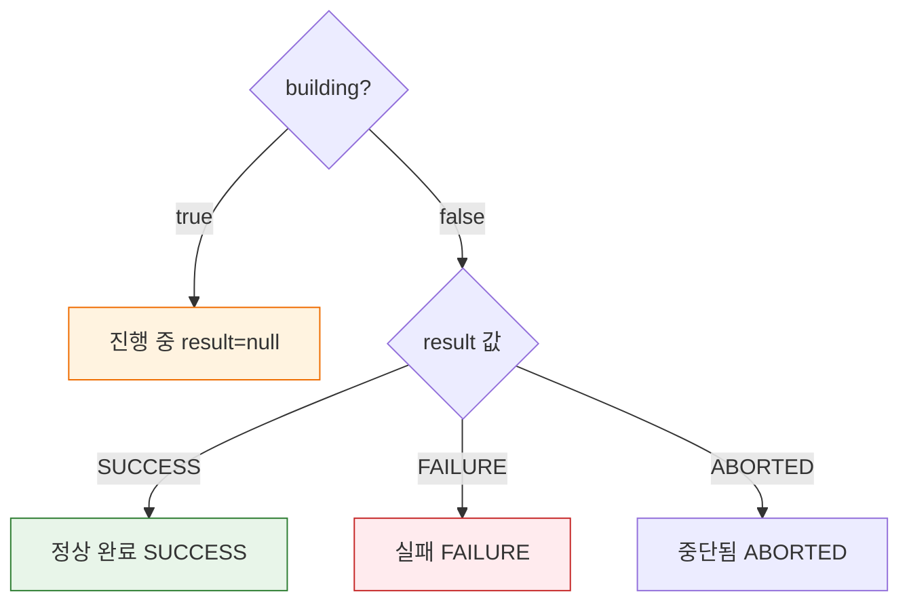
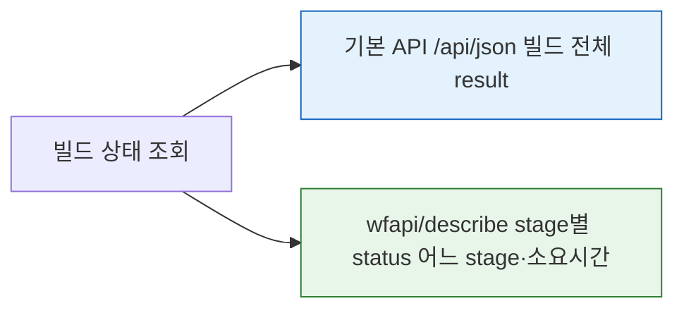

# 젠킨스 빌드 상태 추적 API 스펙
---
> 이 문서를 읽고 나면 `building`과 `result` 조합으로 빌드 상태를 판정하고, `wfapi/describe`로 어느 stage에서 멈췄는지·진행 중인지 추적하며, 완료 대기 polling의 간격과 타임아웃을 직접 선택해 설계할 수 있습니다.

> 이 문서는 Jenkins 빌드 실행 이후 상태를 조회하는 REST API 자체를 설명하는 스펙 문서입니다.
>
> - 코어 빌드 상세 조회, 최근 빌드 조회, Workflow API 상태 조회, 실행 목록 조회를 다룹니다.
> - TPS 상태 매핑, DB 매칭, SyncJob, Blue Ocean 해석은 `06-02`에서 별도로 다룹니다.


## 사전 지식

> 05-01에서 얻은 빌드 번호를 알고 있다면, 이 문서는 그 번호로 빌드의 완료 여부와 stage 단위 진행을 읽어 내는 조회 도구 모음입니다.


## 진입 — 빌드를 던진 다음 "끝났는가"를 무엇으로 판정하는가

> 빌드를 실행(`POST /build`)하면 Jenkins는 큐 아이템 URL만 돌려줄 뿐, 그 빌드가 성공했는지 실패했는지는 알려주지 않습니다. 실행과 결과 판정이 서로 다른 API로 분리돼 있기 때문입니다.

빌드 실행 API는 "시작 신호"만 보내고 곧바로 반환합니다. 빌드가 진행 중인지, 끝났다면 어떤 결과로 끝났는지, 여러 stage 중 어디서 멈췄는지는 모두 *조회 API*로 따로 읽어 와야 합니다. 그래서 빌드를 자동화하는 모든 시스템(TPS의 상태 동기화 포함)은 실행 직후부터 이 문서의 조회 API들을 주기적으로 호출하면서 완료를 기다립니다. 이 편은 그 "완료를 읽어 내는" 조회 API 묶음을 정리합니다.


## 1. 이 문서의 범위

> 이 개념은 이미 아는 빌드 실행 API의 반대편 측면입니다. 05-01이 "빌드를 던지는 쓰기 API"였다면, 이 문서는 "그 결과를 거둬들이는 읽기 API"입니다.

> 이 문서는 빌드 상태 추적에 직접 사용하는 아래 API만 설명합니다.

| 메서드 | 경로 | 목적 |
|------|------|------|
| GET | `/{pipelineStruct}/{buildNumber}/api/json` | 특정 빌드의 코어 상태를 조회 |
| GET | `/{pipelineStruct}/lastBuild/api/json` | 최근 빌드 전체 메타데이터를 조회 |
| GET | `/{pipelineStruct}/lastBuild/buildNumber` | 최근 빌드 번호만 plain text로 조회 |
| GET | `/{pipelineStruct}/wfapi/describe` | Job 기준 `wfapi` 응답을 빠르게 확인 |
| GET | `/{pipelineStruct}/{buildNumber}/wfapi/describe` | 특정 빌드 번호의 파이프라인 전체와 스테이지 상태를 구조적으로 조회 |
| GET | `/{pipelineStruct}/wfapi/runs` | 최근 실행 목록을 조회 |

- 인증과 crumb/cookie 준비는 별도 문서에서 다룹니다.

  - `03-01.인증 API 스펙 (ID-Password + Crumb).md`

  - `03-02.인증 모델과 TPS 패턴 (2.222+).md`


- 빌드 실행과 큐 확보는 이 문서 범위가 아닙니다. 그 내용은 별도 문서에서 다룹니다:
  - `05-01.빌드 실행·큐 API 스펙.md`


### 1-1. 공통 경로 규칙

`{pipelineStruct}`는 Jenkins Job URL 경로 구조를 그대로 따릅니다.

- 단일 Job: `/job/{name}`
- 폴더 중첩 Job: `/job/{folder}/job/{subfolder}/job/{name}`

`{buildNumber}`는 `05-01`에서 확보한 큐 아이템의 `executable.number` 또는 `lastBuild.number`에서 얻습니다.

예시는 다음과 같습니다:

```text
/job/SBH/job/API-NORMAL/8/api/json
/job/SBH/job/API-FAIL/3/api/json
/job/SBH/job/API-SLEEP10/12/wfapi/describe
/job/SBH/job/API-PARAM/wfapi/runs
```

### 1-2. 공통 요청 규칙

모든 예시는 `05-01`까지의 준비가 끝났다는 전제입니다.

이 문서에서 추가로 쓰는 동적 값은 먼저 환경 변수로 빼두는 편이 좋습니다.

```bash
export PIPELINE_NORMAL_STRUCT='/job/SBH/job/API-NORMAL'
export PIPELINE_PARAM_STRUCT='/job/SBH/job/API-PARAM'
export PIPELINE_SLEEP10_STRUCT='/job/SBH/job/API-SLEEP10'
export PIPELINE_FAIL_STRUCT='/job/SBH/job/API-FAIL'
export PIPELINE_NORMAL_2_STRUCT='/job/SBH/job/API-NORMAL-2'

export PARAM_BRANCH='main'
export PARAM_ENV='dev'

export BUILD_NUMBER_NORMAL=''
export BUILD_NUMBER_FAIL=''
export BUILD_NUMBER_SLEEP10=''
export BUILD_NUMBER_PARAM=''
```

Windows PowerShell용 예시는 다음과 같습니다:

```powershell
$env:PIPELINE_NORMAL_STRUCT = '/job/SBH/job/API-NORMAL'
$env:PIPELINE_PARAM_STRUCT = '/job/SBH/job/API-PARAM'
$env:PIPELINE_SLEEP10_STRUCT = '/job/SBH/job/API-SLEEP10'
$env:PIPELINE_FAIL_STRUCT = '/job/SBH/job/API-FAIL'
$env:PIPELINE_NORMAL_2_STRUCT = '/job/SBH/job/API-NORMAL-2'

$env:PARAM_BRANCH = 'main'
$env:PARAM_ENV = 'dev'

$env:BUILD_NUMBER_NORMAL = ''
$env:BUILD_NUMBER_FAIL = ''
$env:BUILD_NUMBER_SLEEP10 = ''
$env:BUILD_NUMBER_PARAM = ''
```

이 문서에서 의미하는 값은 다음과 같습니다:

| 변수 | 의미 | 예시 |
|------|------|------|
| `PIPELINE_NORMAL_STRUCT` | 일반 성공 파이프라인 경로 | `/job/SBH/job/API-NORMAL` |
| `PIPELINE_PARAM_STRUCT` | 파라미터 파이프라인 경로 | `/job/SBH/job/API-PARAM` |
| `PIPELINE_SLEEP10_STRUCT` | 장시간 실행 파이프라인 경로 | `/job/SBH/job/API-SLEEP10` |
| `PIPELINE_FAIL_STRUCT` | 실패 파이프라인 경로 | `/job/SBH/job/API-FAIL` |
| `PIPELINE_NORMAL_2_STRUCT` | 일반 성공 보조 파이프라인 경로 | `/job/SBH/job/API-NORMAL-2` |
| `PARAM_BRANCH` | 파라미터 빌드용 브랜치 값 | `main` |
| `PARAM_ENV` | 파라미터 빌드용 환경 값 | `dev` |
| `BUILD_NUMBER_NORMAL` | `API-NORMAL`의 최근 빌드 번호 | `8` |
| `BUILD_NUMBER_FAIL` | `API-FAIL`의 최근 빌드 번호 | `3` |
| `BUILD_NUMBER_SLEEP10` | `API-SLEEP10`의 최근 빌드 번호 | `12` |
| `BUILD_NUMBER_PARAM` | `API-PARAM`의 최근 빌드 번호 | `5`: |

빠른 상태 확인은 최근 빌드 번호를 바로 가져오면 편합니다. 예시는 다음과 같습니다:

```bash
export BUILD_NUMBER_NORMAL=$(curl -k -sS -u "${JENKINS_USER}:${JENKINS_PASS}" \
  "${JENKINS_URL}${PIPELINE_NORMAL_STRUCT}/lastBuild/api/json" \
  | jq -r '.number')
echo "$BUILD_NUMBER_NORMAL"
```

### 1-3. 권장 실행 순서

이 문서는 조회 API를 개별 스펙으로도 설명하지만, 실제 실습은 아래 순서로 따라가는 편이 자연스럽습니다.

| 순서 | 먼저 하는 일 | 이어서 보는 API | 목적 |
|------|------|------|------|
| 1 | 빌드를 실행해 상태를 만든다 | `GET /{pipelineStruct}/lastBuild/api/json` | 최근 빌드와 `buildNumber` 확보 |
| 2 | 확보한 `buildNumber`로 코어 상태를 본다 | `GET /{pipelineStruct}/{buildNumber}/api/json` | 실행 중 여부와 최종 결과 확인 |
| 3 | 같은 `buildNumber`로 Workflow 상태를 본다 | `GET /{pipelineStruct}/{buildNumber}/wfapi/describe` | 파이프라인 전체와 스테이지 상태 확인 |
| 4 | 최근 빌드 기준으로 간단히 본다 | `GET /{pipelineStruct}/wfapi/describe` | 최근 실행 한 건을 빠르게 요약 확인 |
| 5 | 여러 실행 이력을 누적한 뒤 본다 | `GET /{pipelineStruct}/wfapi/runs` | 최근 실행 목록과 상태 흐름 확인 |

- 즉 이 문서는 "조회 API를 아무 순서로나 나열"하기보다, `05-01`에서 빌드를 시작한 뒤 어떤 조회를 이어서 봐야 하는지 기준으로 목차를 구성합니다.


`building`과 `result`의 관계는 택배 배송 추적에 빗댈 수 있습니다. `building: true`는 "배송 중"이라 도착 결과가 아직 비어 있는(`result: null`) 상태이고, `building: false`로 바뀌면서 비로소 "배송 완료/반송/취소" 같은 최종 라벨(`result`)이 채워집니다. 이 비유는 "진행 중에는 결과 칸이 비어 있다"는 점까지 유효하지만, 택배는 한 덩어리로 움직이는 반면 Pipeline 빌드는 여러 stage가 순차로 진행돼 "전체는 끝나지 않았지만 일부 stage는 이미 완료/실패"라는 중간 상태가 존재한다는 점에서 깨집니다. 그 stage 단위 진행은 `wfapi/describe`로 따로 읽어야 합니다.

`building`과 `result`로 빌드 상태를 판정하는 흐름은 다음과 같습니다:




## 2. 최근 빌드와 `buildNumber` 확보

### 2-1. 상태 준비: 조회 전에 빌드를 먼저 실행

`lastBuild` 계열 조회는 먼저 빌드를 한 번 실행해야 의미가 있습니다. 가장 자주 쓰는 상태 준비 스크립트는 다음과 같습니다.

성공 상태 준비는 이렇게 합니다:

```bash
curl -k -sS -D headers.txt -o /dev/null -w 'HTTP_STATUS=%{http_code}\n' \
  -X POST -b cookies.txt \
  -u "${JENKINS_USER}:${JENKINS_PASS}" \
  -H "${CRUMB_FIELD}: ${CRUMB}" \
  "${JENKINS_URL}${PIPELINE_NORMAL_STRUCT}/build"
```

실행 중 상태 준비는 이렇게 합니다:

```bash
curl -k -sS -D headers.txt -o /dev/null -w 'HTTP_STATUS=%{http_code}\n' \
  -X POST -b cookies.txt \
  -u "${JENKINS_USER}:${JENKINS_PASS}" \
  -H "${CRUMB_FIELD}: ${CRUMB}" \
  "${JENKINS_URL}${PIPELINE_SLEEP10_STRUCT}/build"
```

실패 상태 준비는 이렇게 합니다:

```bash
curl -k -sS -D headers.txt -o /dev/null -w 'HTTP_STATUS=%{http_code}\n' \
  -X POST -b cookies.txt \
  -u "${JENKINS_USER}:${JENKINS_PASS}" \
  -H "${CRUMB_FIELD}: ${CRUMB}" \
  "${JENKINS_URL}${PIPELINE_FAIL_STRUCT}/build"
```

파라미터 빌드 상태 준비는 이렇게 합니다:

```bash
curl -k -sS -D headers.txt -o /dev/null -w 'HTTP_STATUS=%{http_code}\n' \
  -X POST -b cookies.txt \
  -u "${JENKINS_USER}:${JENKINS_PASS}" \
  -H "${CRUMB_FIELD}: ${CRUMB}" \
  --data-urlencode "BRANCH=${PARAM_BRANCH}" \
  --data-urlencode "ENV=${PARAM_ENV}" \
  "${JENKINS_URL}${PIPELINE_PARAM_STRUCT}/buildWithParameters"
```

### 2-2. `GET /{pipelineStruct}/lastBuild/api/json`

> 최근 빌드 한 건의 상태를 빠르게 조회하는 API입니다.

빌드 번호를 아직 모를 때 가장 먼저 보기 좋습니다.

요청 형식은 다음과 같습니다:

```http
GET /{pipelineStruct}/lastBuild/api/json HTTP/1.1
Authorization: Basic <...>
Accept: application/json
```

예시는 다음과 같습니다:

```bash
# -k: 실습 Jenkins가 self-signed 인증서라 검증을 끔 (운영에서는 끄지 않습니다)
# jq로 상태 판정에 쓰는 네 필드만 추려, 응답 전체 메타데이터의 노이즈를 제거합니다
curl -k -sS -u "${JENKINS_USER}:${JENKINS_PASS}" \
  "${JENKINS_URL}${PIPELINE_NORMAL_STRUCT}/lastBuild/api/json" \
  | jq '{
      number,
      building,
      result,
      url
    }'
```

위 `jq` 방식은 전체 메타데이터를 받은 뒤 클라이언트에서 버리므로, 폴링처럼 반복 호출하는 상황에서는 `tree=`로 서버 쪽에서 필드를 골라 응답을 축소하는 편이 낫습니다.

```bash
# tree=로 필드를 서버에서 선택 → 응답 자체가 number/building/result 세 필드만 담아 작아집니다
curl -k -sS -u "${JENKINS_USER}:${JENKINS_PASS}" \
  "${JENKINS_URL}${PIPELINE_NORMAL_STRUCT}/lastBuild/api/json?tree=number,building,result"
```

`tree=`의 동작 원리와 전송량 축소 효과(수십 KB→수백 바이트) 상세는 [09-03. API 쿼리 최적화와 운영](09-03.API%20%EC%BF%BC%EB%A6%AC%20%EC%B5%9C%EC%A0%81%ED%99%94%EC%99%80%20%EC%9A%B4%EC%98%81.md)을 참조합니다.

`API-NORMAL`의 `BUILD_NUMBER_NORMAL`을 바로 다음 단계에 넘기려면 이렇게 잡아두면 됩니다:

```bash
export BUILD_NUMBER_NORMAL=$(curl -k -sS -u "${JENKINS_USER}:${JENKINS_PASS}" \
  "${JENKINS_URL}${PIPELINE_NORMAL_STRUCT}/lastBuild/api/json" \
  | jq -r '.number')

echo "$BUILD_NUMBER_NORMAL"
```

- 응답 필드는 `/{buildNumber}/api/json`과 거의 같지만, 최근 빌드 한 건만 가리킨다는 점이 다릅니다.

### 2-3. `GET /{pipelineStruct}/lastBuild/buildNumber`

> 최근 빌드 번호만 plain text로 반환하는 API입니다.

`lastBuild/api/json`은 전체 빌드 메타데이터를 JSON으로 주지만, `buildNumber`만 필요한 경우에는 이 엔드포인트가 더 가볍습니다. `jq`가 없는 환경이나 빌드 번호 하나만 변수로 잡을 때 유용합니다.

요청 형식은 다음과 같습니다:

```http
GET /{pipelineStruct}/lastBuild/buildNumber HTTP/1.1
Authorization: Basic <...>
```

예시는 다음과 같습니다:

```bash
curl -k -sS -u "${JENKINS_USER}:${JENKINS_PASS}" \
  "${JENKINS_URL}${PIPELINE_NORMAL_STRUCT}/lastBuild/buildNumber"
```

응답은 숫자 하나를 plain text로 반환합니다:

```text
42
```

변수로 바로 받으려면 다음처럼 씁니다:

```bash
export BUILD_NUMBER=$(curl -k -sS -u "${JENKINS_USER}:${JENKINS_PASS}" \
  "${JENKINS_URL}${PIPELINE_NORMAL_STRUCT}/lastBuild/buildNumber")

echo "$BUILD_NUMBER"
```

`lastBuild/api/json`과의 차이는 다음과 같습니다:

| 항목 | `lastBuild/buildNumber` | `lastBuild/api/json` |
|------|------------------------|---------------------|
| 응답 형식 | plain text (숫자) | JSON |
| 응답 크기 | 수백 바이트 | 전체 빌드 메타데이터 |
| `jq` 필요 여부 | 불필요 | 필요 |
| 용도 | 빌드 번호만 빠르게 추출 | 빌드 상태 전반 확인 |

에러 케이스는 다음과 같습니다:

| 상태 코드 | 의미 | 대응 |
|-----------|------|------|
| `200` | 성공 | 숫자 확인 |
| `404` | Job 없음 또는 빌드 이력 없음 | `pipelineStruct` 확인, 빌드 먼저 실행 |
| `401` | 인증 실패 | 인증 정보 확인 |


## 3. 특정 `buildNumber`의 코어 상태 확인

### 3-1. 상태 준비: 보고 싶은 결과에 맞게 빌드를 실행

이 단계는 `2-1`에서 만든 상태를 그대로 이어받아도 됩니다. 다만 의도한 상태를 더 분명히 보고 싶다면 아래처럼 다시 실행한 뒤 바로 조회하면 됩니다.

직전 실행의 `BUILD_NUMBER_SLEEP10`를 다시 잡으려면 이렇게 합니다:

```bash
export BUILD_NUMBER_SLEEP10=$(curl -k -sS -u "${JENKINS_USER}:${JENKINS_PASS}" \
  "${JENKINS_URL}${PIPELINE_SLEEP10_STRUCT}/lastBuild/api/json" \
  | jq -r '.number')
```

### 3-2. `GET /{pipelineStruct}/{buildNumber}/api/json`

> 특정 빌드 번호의 상세 상태를 조회하는 기본 API입니다.

요청 형식은 다음과 같습니다:

```http
GET /{pipelineStruct}/{buildNumber}/api/json HTTP/1.1
Authorization: Basic <...>
Accept: application/json
```

예시는 다음과 같습니다:

```bash
# 어떤 객체 URL에도 /api/json을 붙이면 그 객체의 상태가 JSON으로 내려옵니다
# estimatedDuration/duration을 함께 뽑는 이유: polling 간격·타임아웃을 정할 근거가 되기 때문
curl -k -sS -u "${JENKINS_USER}:${JENKINS_PASS}" \
  "${JENKINS_URL}${PIPELINE_SLEEP10_STRUCT}/${BUILD_NUMBER_SLEEP10}/api/json" \
  | jq '{
      number,
      building,
      result,
      timestamp,
      estimatedDuration,
      duration
    }'
```

같은 객체를 XML(`/api/xml`)이나 Python 리터럴(`/api/python`)로 받는 다중 포맷 규칙과 `xpath=`·`exclude=` 노드 선택은 [02-02. REST API 구조와 연동](02-02.REST%20API%20%EA%B5%AC%EC%A1%B0%EC%99%80%20%EC%97%B0%EB%8F%99.md)에서 다룹니다.

실행 중 예시는 다음과 같습니다:

```json
{
  "number": 12,
  "building": true,
  "result": null,
  "timestamp": 1710000000000,
  "estimatedDuration": 10000,
  "duration": 0
}
```

종료 후 예시는 다음과 같습니다:

```json
{
  "number": 12,
  "building": false,
  "result": "SUCCESS",
  "timestamp": 1710000000000,
  "estimatedDuration": 10000,
  "duration": 10234
}
```

주요 응답 필드는 다음과 같습니다:

| 필드 | 타입 | 의미 |
|------|------|------|
| `number` | Integer | 빌드 번호 |
| `building` | Boolean | 현재 실행 중이면 `true` |
| `result` | String/null | 종료 전에는 `null`, 종료 후에는 결과 문자열 |
| `timestamp` | Long | 빌드 시작 시각 |
| `estimatedDuration` | Long | 예상 실행 시간 |
| `duration` | Long | 실제 실행 시간 |

에러 케이스는 다음과 같습니다:

| 상태 코드 | 의미 | 대응 |
|-----------|------|------|
| `200` | 조회 성공 | `building`, `result` 확인 |
| `401` | 인증 실패 | 인증 정보 확인 |
| `403` | 조회 권한 부족 | Jenkins 권한 확인 |
| `404` | 대상 빌드 없음 | 대응하는 `PIPELINE_*_STRUCT`, `BUILD_NUMBER_*` 확인 |


기본 빌드 API와 wfapi가 보여주는 정밀도 차이를 그림으로 보면 다음과 같습니다:




## 4. Workflow 전체와 스테이지 상태 확인

### 4-1. 상태 준비: `wfapi`는 실행 직후와 종료 후 모두 볼 수 있습니다

`wfapi/describe`는 같은 빌드를 실행 중에 보느냐, 종료 후에 보느냐에 따라 해석이 달라집니다.

- 실행 중 스테이지를 보고 싶다면 `API-SLEEP10`을 실행한 직후 바로 조회합니다.
- 성공 스테이지를 보고 싶다면 `API-NORMAL`을 실행한 뒤 종료 후 조회합니다.
- 실패 스테이지를 보고 싶다면 `API-FAIL`을 실행한 뒤 종료 후 조회합니다.

실행 직후 바로 `BUILD_NUMBER_SLEEP10`를 확보하는 스크립트는 다음과 같습니다:

```bash
curl -k -sS -D headers.txt -o /dev/null -w 'HTTP_STATUS=%{http_code}\n' \
  -X POST -b cookies.txt \
  -u "${JENKINS_USER}:${JENKINS_PASS}" \
  -H "${CRUMB_FIELD}: ${CRUMB}" \
  "${JENKINS_URL}${PIPELINE_SLEEP10_STRUCT}/build"

export BUILD_NUMBER_SLEEP10=$(curl -k -sS -u "${JENKINS_USER}:${JENKINS_PASS}" \
  "${JENKINS_URL}${PIPELINE_SLEEP10_STRUCT}/lastBuild/api/json" \
  | jq -r '.number')
```

### 4-2. `GET /{pipelineStruct}/{buildNumber}/wfapi/describe`

> 특정 빌드 번호의 파이프라인 전체 상태와 스테이지 상태를 구조적으로 조회합니다.

요청 형식은 다음과 같습니다:

```http
GET /{pipelineStruct}/{buildNumber}/wfapi/describe HTTP/1.1
Authorization: Basic <...>
Accept: application/json
```

예시는 다음과 같습니다:

```bash
# wfapi/describe는 stage 배열을 한 단계 중첩으로 펼쳐 주므로 stage 단위 status를 바로 읽습니다
# stages만 별도로 .stages[]로 풀어 status·durationMillis를 추리면, 어느 stage에서 멈췄는지 한눈에 보입니다
curl -k -sS -u "${JENKINS_USER}:${JENKINS_PASS}" \
  "${JENKINS_URL}${PIPELINE_SLEEP10_STRUCT}/${BUILD_NUMBER_SLEEP10}/wfapi/describe" \
  | jq '{
      id,
      name,
      status,
      startTimeMillis,
      durationMillis,
      queueDurationMillis,
      pauseDurationMillis,
      stages: [.stages[]? | {id, name, status, durationMillis}]
    }'
```

stage 안의 더 깊은 세부(개별 step 등)까지 펼치려면 표준 Remote Access API의 `depth=`로 서브트리 깊이를 키웁니다. 깊이별 응답 크기 트레이드오프 상세는 [09-03. API 쿼리 최적화와 운영](09-03.API%20%EC%BF%BC%EB%A6%AC%20%EC%B5%9C%EC%A0%81%ED%99%94%EC%99%80%20%EC%9A%B4%EC%98%81.md)을 참조합니다.

응답 예시는 다음과 같습니다:

```json
{
  "id": "12",
  "name": "#12",
  "status": "SUCCESS",
  "startTimeMillis": 1710000000000,
  "durationMillis": 10234,
  "queueDurationMillis": 1340,
  "pauseDurationMillis": 0,
  "stages": [
    {
      "id": "5",
      "name": "Hello",
      "status": "SUCCESS",
      "durationMillis": 9000
    }
  ]
}
```

주요 응답 필드는 다음과 같습니다:

| 필드 | 타입 | 의미 |
|------|------|------|
| `status` | String | 파이프라인 전체 상태 |
| `startTimeMillis` | Long | 빌드 시작 시각 |
| `durationMillis` | Long | 전체 실행 시간 |
| `queueDurationMillis` | Long | 큐 대기 시간 |
| `pauseDurationMillis` | Long | 승인 대기 등 pause 시간 |
| `stages[].id` | String | 스테이지 노드 ID |
| `stages[].name` | String | 스테이지 이름 |
| `stages[].status` | String | 스테이지 상태 |

스테이지 상태로 자주 보는 값은 다음과 같습니다:

- `SUCCESS`
- `FAILED`
- `IN_PROGRESS`
- `PAUSED_PENDING_INPUT`
- `ABORTED`
- `NOT_EXECUTED`

에러 케이스는 다음과 같습니다:

| 상태 코드 | 의미 | 대응 |
|-----------|------|------|
| `200` | 조회 성공 | `status`, `stages` 확인 |
| `401` | 인증 실패 | 인증 정보 확인 |
| `403` | 조회 권한 부족 | Jenkins 권한 확인 |
| `404` | Workflow API 비활성 또는 대상 빌드 없음 | 플러그인/경로 확인 |

### 4-3. `GET /{pipelineStruct}/wfapi/describe`

> Job 기준 `wfapi` 응답을 조회합니다. 다만 현재 실습 Jenkins에서는 최근 build의 stage 상태 API로 신뢰하지 않는 편이 맞습니다.

현재 실습 환경에서 이 API를 다음처럼 호출하면:

```bash
curl -k -sS -u "${JENKINS_USER}:${JENKINS_PASS}" \
  "${JENKINS_URL}${PIPELINE_SLEEP10_STRUCT}/wfapi/describe" \
  | jq '{
      id,
      name,
      status,
      stages: [.stages[]? | {name, status}]
    }'
```

실제 응답은 다음처럼 나올 수 있습니다:

```json
{
  "id": null,
  "name": "API-SLEEP10",
  "status": null,
  "stages": []
}
```

이 응답은 "최근 build 상태가 비어 있다"기보다, 이 경로가 특정 run이 아닌 Job 자체 기준으로 해석됐다는 쪽에 가깝습니다.

- `name`에는 Job 이름이 내려올 수 있습니다.
- `id`는 특정 build id가 아니므로 `null`일 수 있습니다.
- `status`는 run 문맥이 없어서 `null`일 수 있습니다.
- `stages`도 특정 build가 아니므로 빈 배열일 수 있습니다.

즉 현재 Jenkins에서는 `/{pipelineStruct}/wfapi/describe`를 "최근 build 상태 조회 API"로 신뢰하지 않는 편이 안전합니다.

실제 상태 추적은 다음 조합을 기준으로 보는 편이 맞습니다:

- 최근 build 번호 확보: `GET /{pipelineStruct}/lastBuild/api/json`
- build 전체 상태 확인: `GET /{pipelineStruct}/{buildNumber}/api/json`
- stage 상태 확인: `GET /{pipelineStruct}/{buildNumber}/wfapi/describe`

따라서 이 API는 참고용으로만 두고, 운영 로직이나 TPS 상태 동기화는 `/{pipelineStruct}/{buildNumber}/wfapi/describe`를 기준으로 잡는 편이 낫습니다.


## 5. 최근 실행 목록 확인

### 5-1. 상태 준비: 실행 목록은 여러 건을 쌓아두고 보는 편이 좋습니다

`wfapi/runs`는 단건보다 다건 비교가 핵심이므로, 같은 파이프라인을 2회 이상 실행해두는 편이 낫습니다.

성공 이력을 누적해서 보고 싶다면 다음처럼 같은 파이프라인을 연속 실행합니다:

```bash
curl -k -sS -D /dev/null -o /dev/null -w 'HTTP_STATUS=%{http_code}\n' \
  -X POST -b cookies.txt \
  -u "${JENKINS_USER}:${JENKINS_PASS}" \
  -H "${CRUMB_FIELD}: ${CRUMB}" \
  "${JENKINS_URL}${PIPELINE_NORMAL_STRUCT}/build"

curl -k -sS -D /dev/null -o /dev/null -w 'HTTP_STATUS=%{http_code}\n' \
  -X POST -b cookies.txt \
  -u "${JENKINS_USER}:${JENKINS_PASS}" \
  -H "${CRUMB_FIELD}: ${CRUMB}" \
  "${JENKINS_URL}${PIPELINE_NORMAL_STRUCT}/build"
```

파라미터 빌드 이력을 쌓고 싶다면 이렇게 합니다:

```bash
curl -k -sS -D /dev/null -o /dev/null -w 'HTTP_STATUS=%{http_code}\n' \
  -X POST -b cookies.txt \
  -u "${JENKINS_USER}:${JENKINS_PASS}" \
  -H "${CRUMB_FIELD}: ${CRUMB}" \
  --data-urlencode "BRANCH=main" \
  --data-urlencode "ENV=dev" \
  "${JENKINS_URL}${PIPELINE_PARAM_STRUCT}/buildWithParameters"

curl -k -sS -D /dev/null -o /dev/null -w 'HTTP_STATUS=%{http_code}\n' \
  -X POST -b cookies.txt \
  -u "${JENKINS_USER}:${JENKINS_PASS}" \
  -H "${CRUMB_FIELD}: ${CRUMB}" \
  --data-urlencode "BRANCH=release" \
  --data-urlencode "ENV=prod" \
  "${JENKINS_URL}${PIPELINE_PARAM_STRUCT}/buildWithParameters"
```

### 5-2. `GET /{pipelineStruct}/wfapi/runs`

> 최근 실행 목록을 배열 형태로 조회합니다.

요청 형식은 다음과 같습니다:

```http
GET /{pipelineStruct}/wfapi/runs HTTP/1.1
Authorization: Basic <...>
Accept: application/json
```

예시는 다음과 같습니다:

```bash
curl -k -sS -u "${JENKINS_USER}:${JENKINS_PASS}" \
  "${JENKINS_URL}${PIPELINE_NORMAL_STRUCT}/wfapi/runs" \
  | jq '[.[] | {
      id,
      name,
      status,
      startTimeMillis,
      durationMillis
    }]'
```

응답 예시는 다음과 같습니다:

```json
[
  {
    "id": "12",
    "name": "#12",
    "status": "SUCCESS",
    "startTimeMillis": 1710000000000,
    "durationMillis": 10234
  },
  {
    "id": "11",
    "name": "#11",
    "status": "FAILED",
    "startTimeMillis": 1709999900000,
    "durationMillis": 3210
  }
]
```


## 6. 빠른 상태 확인 팁

> 최근 빌드의 상태만 빨리 보려면 다음 순서가 가장 단순합니다.
>
> 1. `POST /build` 또는 `POST /buildWithParameters`로 상태를 만듭니다.
> 2. `GET /{pipelineStruct}/lastBuild/api/json`으로 대응하는 `BUILD_NUMBER_*`를 확보합니다.
> 3. 실행 중이면 `GET /{pipelineStruct}/{buildNumber}/wfapi/describe`를 봅니다.
> 4. 종료되면 `GET /{pipelineStruct}/{buildNumber}/api/json`의 `result`를 확인합니다.

실습 예시는 다음처럼 잡으면 됩니다:

```bash
export BUILD_NUMBER_SLEEP10=$(curl -k -sS -u "${JENKINS_USER}:${JENKINS_PASS}" \
  "${JENKINS_URL}${PIPELINE_SLEEP10_STRUCT}/lastBuild/api/json" | jq -r '.number')
```


## 7. 완료 대기 polling을 안전하게 설계하기

빌드 완료를 기다리는 polling 루프는 두 가지 수치를 반드시 정해야 합니다. 첫째는 폴링 간격입니다. 간격을 너무 좁히면(예: 0.5초마다) controller가 매 호출마다 빌드 메타데이터를 직렬화하느라 부하가 누적됩니다. 실무에서는 최소 3~5초 간격을 둬, 10초짜리 빌드라면 두세 번, 5분짜리 빌드라면 약 60~100회 안에 완료를 감지하도록 잡습니다. 둘째는 상한입니다. 최대 시도 횟수나 절대 타임아웃을 두지 않으면, 빌드가 멈춰 영영 끝나지 않을 때 루프가 무한히 돕니다. `estimatedDuration`을 기준으로 그 2~3배를 타임아웃으로 잡으면 정상 빌드는 통과시키고 멈춘 빌드만 끊을 수 있습니다.

폴링 한 차례의 전송량도 간격 못지않게 중요합니다. 매 호출마다 전체 메타데이터를 받으면 controller와 네트워크에 부담이 쌓이므로 `?tree=number,building,result`로 필요한 세 필드만 받고, 그 차이는 폴링 횟수가 누적될수록 비례해 커집니다(축소 효과 상세는 위 §2-2의 09-03 링크 참조).


## 면접 질문

> 답을 떠올린 뒤 §정답 절에서 같은 번호로 대조하세요.

1. 빌드가 "끝났는지"를 판정할 때 `result`만 보면 충분한가요? `building`과 어떻게 함께 보나요?
2. 기본 빌드 API로 충분한 경우와 `wfapi/describe`가 꼭 필요한 경우를 구분해 보세요.
3. 빌드 완료를 polling으로 기다릴 때 반드시 둬야 하는 안전장치 두 가지는?

### 빈칸 채우기 — 상태 판정과 응답 축소

1. 빌드가 진행 중일 때 `building`은 `____`이고 `result`는 `____`입니다.
2. 응답 필드를 서버 쪽에서 선택해 전송량을 줄이는 파라미터는 `____=`이고, 서브트리 깊이를 키우는 파라미터는 `____=`입니다.
3. `/{pipelineStruct}/wfapi/describe`(빌드 번호 없는 Job 기준 경로)는 특정 run 문맥이 없어 `status`가 `____`, `stages`가 `____`로 내려올 수 있어 최근 build 상태 조회로는 신뢰하지 않습니다.
4. polling 루프에서 무한 반복을 막으려면 최대 시도 횟수나 `____`을(를) 둬야 합니다.


## 정답

> 위 질문을 스스로 설명해 본 뒤에 펼치세요.

### 정답 1 — building + result

`result`가 `null`이면 아직 진행 중이고, `SUCCESS`/`FAILURE`/`ABORTED` 중 하나가 채워지면 완료입니다. `building: false` + `result` 채워짐을 완료 신호로 함께 보는 것이 안전합니다. `building: true` + `result: null`이면 진행 중입니다.

### 정답 2 — 기본 API vs wfapi

"빌드가 성공했는가?"만 알면 기본 API의 `result`로 충분합니다. "어느 stage에서 실패했는가?", "지금 어느 stage가 실행 중인가?"가 필요하면 `wfapi/describe`의 `stages[]`를 봐야 합니다. wfapi는 Pipeline 빌드에서만 동작합니다.

### 정답 3 — polling 안전장치

① 간격을 최소 3~5초로 둬 controller 부하를 막고, ② 최대 시도 횟수나 타임아웃을 둬 무한 루프를 방지합니다. 둘 다 없으면 빌드가 영영 안 끝날 때 스크립트가 멈추거나 controller를 과부하시킬 수 있습니다.

### 빈칸 정답 — 상태 판정과 응답 축소

1. `building`은 `true`, `result`는 `null`입니다.
2. 전송량을 줄이는 파라미터는 `tree=`, 서브트리 깊이를 키우는 파라미터는 `depth=`입니다.
3. `status`가 `null`, `stages`가 빈 배열(`[]`)로 내려올 수 있습니다.
4. `타임아웃`(절대 시간 상한)을 둬야 합니다.


## 7. 참고 링크

- Jenkins Remote Access API
- Pipeline: REST API Plugin


## 관련 문서

> 이 편이 다룬 조회 API의 결과를 TPS 상태로 매핑하거나, stage 단위 응답을 현대적 방식으로 해석하는 방법은 같은 06 장의 짝 문서에서 이어집니다. 조회의 입력이 되는 빌드 번호 확보와, 로그 추적은 인접 장에서 다룹니다.

- [06-02. 빌드 상태 추적 모델과 TPS 패턴 (2.222+)](06-02.%EB%B9%8C%EB%93%9C%20%EC%83%81%ED%83%9C%20%EC%B6%94%EC%A0%81%20%EB%AA%A8%EB%8D%B8%EA%B3%BC%20TPS%20%ED%8C%A8%ED%84%B4%20%282.222%2B%29.md) § "TPS 상태 매핑" — 이 편의 `result`/`status` 값을 TPS 내부 상태로 변환하는 매핑 규칙
- [06-03. 상태 추적 API 현대화와 Blue Ocean 해석](06-03.%EC%83%81%ED%83%9C%20%EC%B6%94%EC%A0%81%20API%20%ED%98%84%EB%8C%80%ED%99%94%EC%99%80%20Blue%20Ocean%20%ED%95%B4%EC%84%9D.md) § "Blue Ocean 해석" — wfapi 응답을 현대 UI/REST 관점으로 다시 읽는 방법
- [05-01. 빌드 실행·큐 API 스펙](05-01.%EB%B9%8C%EB%93%9C%20%EC%8B%A4%ED%96%89%C2%B7%ED%81%90%20API%20%EC%8A%A4%ED%8E%99.md) § "큐 아이템 → buildNumber" — 이 편 조회의 입력이 되는 빌드 번호를 확보하는 선행 단계
- [03-01. 인증 API 스펙 (ID-Password + Crumb)](03-01.%EC%9D%B8%EC%A6%9D%20API%20%EC%8A%A4%ED%8E%99%20%28ID-Password%20%2B%20Crumb%29.md) § "Crumb 발급" — 조회 전 인증과 crumb/cookie 준비
- [07-01. API 로그 조회와 적재](07-01.API%20%EB%A1%9C%EA%B7%B8%20%EC%A1%B0%ED%9A%8C%EC%99%80%20%EC%A0%81%EC%9E%AC.md) § "consoleText" — 상태가 실패로 판정된 뒤 원인을 로그로 추적
